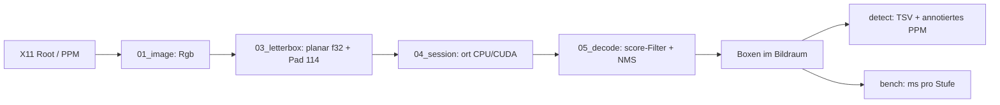

# Implementierungsplan — 20260929_01_gui_elements

Proof of Concept in `examples/26_onnx/source8/`: GUI-Element-Detektion mit
`Salesforce/GPA-GUI-Detector` in Rust (ONNX Runtime via `ort`), inklusive
Python-Exportpipeline (uv), Quantisierung (FP16/INT8) und Benchmark CPU vs.
GPU. Auftrag: Wol Pumba (wolpumba@gmail.com). Prompt:
`plan/20260929_01_gui_elements/prompt.txt`.

Hinweis zur Ordnerangabe im Prompt: Der Abschnitt „Ordnerstruktur“ nennt
`…/25../source6` (Vorlagen-Rest). Maßgeblich ist der explizite Auftrag
„schreibe in ../../source8“ → `examples/26_onnx/source8/`. Ebenso entfallen
die Vorlagen-Begriffe „Modus/HIL/TUI“; sie werden auf „Stufe/Xvfb-Nachweis“
abgebildet.

## Ziel

1. `scripts/fetch_model.sh` lädt `model.pt` (SHA256-geprüft, Commit gepinnt).
2. `scripts/export_models.sh` (→ `python/export.py` via `uv run`) erzeugt
   optimierte ONNX-Varianten: `fp32`, `fp16`, `int8` (statisch, QDQ,
   kalibriert auf GUI-Screenshots), jeweils für `640×640` und `384×640`.
3. Rust-Binary `gui_detect`: `detect` (PPM-Datei oder X11-Root-Grab →
   Boxen als TSV + annotiertes PPM) und `bench` (Zeiten pro Stufe,
   CPU/CUDA, beliebig viele Modelle).
4. Parität Rust ↔ Ultralytics nachgewiesen (Integrationstest).
5. Messbare Antwort auf: CPU vs. GPU? Quantisierung → kleinere Binärdatei
   und höhere Framerate?

## Verifizierte Fakten (Stand 2026-09-29)

- HF-Repo (API): nur `model.pt` (40 572 716 B, SHA256 `dd404f25…5f71`),
  drei Beispielbilder; Lizenz MIT; Commit `d04be6b7`.
- `model.pt` (geladen): **YOLO11m**, 20,05 M Parameter, 68,3 GFLOPs @640,
  **eine einzige Klasse `{0: 'icon'}`**, trainiert auf „groundcua“.
  → Das Modell trennt *nicht* Text von Bild; es liefert „interaktive
  Elemente“. Die im Prompt zitierte „YOLOv26 NMS-free“-Aussage stimmt für
  dieses Checkpoint nicht: YOLO11 braucht NMS.
- Export (probiert): Input `images [1,3,640,640]` f32, Output
  `output0 [1,5,8400]` = `cx,cy,w,h,score` im Letterbox-Pixelraum, Score
  bereits sigmoid (0…1), Opset 18, fp32-Datei 80,4 MB.
- Ultralytics-Preprocessing: LetterBox (Skala `r=min(H/h,W/w)`,
  `round(w·r)`, bilinear, zentriert, Pad 114), RGB, `/255`, CHW.
- `ort 2.0.0-rc.13` ist neueste Version (crates.io), lädt ONNX Runtime
  1.28.0; für Linux x86_64 gibt es CPU- und `cuda13,tensorrt`-Pakete.
- Umgebung: Threadripper PRO 7955WX (16C/32T, AVX-512/VNNI), RTX A4000,
  CUDA 13 Runtime + cuDNN 9 + cuBLAS 13 vorhanden, **kein TensorRT**
  (`libnvinfer` fehlt), Rust 1.98.1, uv 0.12.20. Xvfb/xterm/x11-apps/
  xdotool wurden per apt nachinstalliert.

## Anforderungs-Review: Was fehlt / was ich vorschlage

Gelistet ist, was für die Remote-Desktop-Pipeline (6 kB/s) wichtig wird;
fett = in diesem PoC umgesetzt, Rest = Vorschlag für Folgeschritte.

1. **Klassen-Lücke**: Ein-Klassen-Detektor. Text/Bild-Trennung muss aus
   der Kombination entstehen: PP-OCR-Det aus `source5` liefert Textzeilen,
   GPA liefert Icons/Buttons; Rest-Regionen werden per Farbstatistik als
   „flach“ (Farbwert senden) oder „Grafik“ (AV1-Kachel) klassifiziert.
2. **Eingabeauflösung**: 1920×1080 → 640 verkleinert um Faktor 3; kleine
   Icons (16 px) werden 5 px. **Rechteckiger Export `384×640`** (16:9 ohne
   Pad-Verschwendung, −40 % FLOPs) ist hier umgesetzt; Kachelung oder
   `1280`-Export als Folge-Option.
3. **Inkrementelle Verarbeitung**: Nur geänderte Kacheln (Dirty-Rects,
   XDamage) neu detektieren; bei 6 kB/s ist ohnehin nur 1–2 fps Übertragung
   realistisch — Detektion muss nicht 60 fps schaffen, aber CPU-Last klein.
4. **Zeitliche Stabilität**: Box-Tracking/Hysterese, damit Kacheln nicht
   flackern (flackernde Boxen = neu übertragene AV1-Kacheln = Bandbreite).
5. **Laptop-Profil**: Benchmarks mit begrenzten Threads (**`--threads`**),
   da Ziel-Laptop (Ryzen 7 7735HS, 8C) ohne CUDA läuft.
6. **Binärgröße**: Modell per `include_bytes!` einbetten (**Feature
   `embed`**, INT8) vs. Laufzeitdatei; ORT-Bibliothek dominiert ggf.
7. **Genauigkeit nach Quantisierung**: nicht nur Tempo, sondern
   **Box-Übereinstimmung (Recall@IoU0.5 vs. fp32)** messen.
8. **Lizenz**: Gewichte MIT (Salesforce), Ultralytics-Code AGPL-3.0 — nur
   Build-Zeit-Werkzeug, nicht im Rust-Binary. Offen: Klärung, ob ein
   exportiertes ONNX eines Ultralytics-Modells AGPL-Pflichten erbt.
9. Folge-Ideen: TensorRT-EP (echtes INT8 auf GPU), Wayland/PipeWire,
   Protokoll-Serialisierung der Regionen, rav1e-Integration.

## Architektur



## Relevante Dateien (Kontext für einen unabhängigen Agenten)

Lesen (Vorbilder):
- `source5/src/02_capture.rs` — X11-Z-Pixmap-Grab mit x11rb, BGRA-Layout.
- `source5/src/03_detect.rs` — ort-Session aus Speicher, `TensorRef`, DBNet-
  Postprocessing (Stil-Vorbild, Text-Boxen für spätere Fusion).
- `source5/scripts/fetch_assets.sh` — Download-Skript-Muster (SHA256).
- `source7/src/04_scrfd_detector.rs` — CUDA-Session mit Warmup-Probe und
  CPU-Fallback (cuDNN-Falle, siehe `plan/20260926_01_face/walkthrough.md`).
- `source7/Cargo.toml` — ort-Features, Release-Profil.

Neu (source8):
- `.gitignore` — `models/`, `target/`, `python/.venv/`, `*.onnx`, `*.ppm`.
- `python/pyproject.toml`, `python/uv.lock` — uv-Projekt (torch CPU-Index,
  opencv-headless-Override).
- `python/export.py` — Export fp32 (onnxslim), fp16, int8-QDQ; Kalibrier-
  bilder; PNG→PPM-Fixture; Referenz-Boxen (`reference.tsv`).
- `scripts/fetch_model.sh` — HF-Download, gepinnter Commit, SHA256.
- `scripts/make_screens.sh` — Xvfb-Szenen (xterm/xcalc/xclock/xlogo …)
  als Kalibrier-/Testbilder (PPM per `gui_detect grab`).
- `scripts/export_models.sh` — `uv run python export.py` Wrapper.
- `scripts/bench.sh` — Benchmark-Matrix CPU/CUDA × Varianten × Threads.
- `src/01_image.rs` — `Rgb`-Bild, PPM lesen/schreiben, Rechteck zeichnen.
- `src/02_capture.rs` — X11-Root-Grab → `Rgb`.
- `src/03_letterbox.rs` — Letterbox-Bilinear → planar f32, Rücktransformation.
- `src/04_session.rs` — Session-Aufbau (Threads, Opt-Level, CUDA-Probe).
- `src/05_decode.rs` — YOLO-Decode `[1,5,N]`, NMS, IoU.
- `src/06_detector.rs` — `Detector` (Session + Buffer + Timings).
- `src/07_cli.rs` — Argument-Parsing (std::env).
- `src/08_bench.rs` — Benchmark-Schleife, Statistik (Median/p90).
- `src/lib.rs`, `src/main.rs` — nur Modul-Deklarationen / Verdrahtung.
- `tests/parity.rs` — Rust vs. Ultralytics-Referenz (ignoriert ohne Modelle).
- `tests/cli_smoke.rs` — CLI auf synthetischem PPM.

## Schlüsselentscheidungen

1. **Kein Bild-Crate**: PPM (P6) reicht für Fixtures, X11 liefert Rohpixel.
   PNG→PPM macht Python einmalig. Spart `image` (~30 transitive Crates).
2. **Letterbox bilinear mit halbpixel-zentrierter Abtastung** (wie
   `cv2.INTER_LINEAR`); Rundung `round(w·r)`, Pad `(W−nw)/2` mit ±0.1-Trick
   von Ultralytics → Boxen deckungsgleich.
3. **NMS in Rust** (greedy, klassenagnostisch, IoU 0.7, conf 0.05 wie
   Model-Card), vorab Top-K auf Score-sortiert (max 300).
4. **CUDA optional per Cargo-Feature**, Warmup-Probe entscheidet ehrlich
   über das Provider-Label (Learning aus source7).
5. **INT8 statisch (QDQ, per-channel, U8/S8)**, nur Conv/MatMul quantisiert
   (Detect-Head-Decode bleibt float — sonst Scores → 0, siehe
   Ultralytics `onnx_int8_quantize`). Dynamische Quantisierung verworfen
   (ConvInteger ist auf CPU langsam).
6. **FP16 mit `keep_io_types=True`**: Rust füttert weiter f32.
7. Modell zur Laufzeit per Pfad; Feature `embed` bettet INT8 ein, um die
   Binärgrößen-Frage zu beantworten.

## Usage-Beispiele (vorab via DeepWiki/Registry-Quelle verifiziert)

ort (Session, CUDA mit Fallback, Inferenz):

```rust
use ort::{ep::{CPU, CUDA}, inputs, session::{Session, builder::GraphOptimizationLevel}, value::TensorRef};

let mut s = Session::builder()?
    .with_optimization_level(GraphOptimizationLevel::Level3)?
    .with_intra_threads(8)?
    .with_execution_providers([CUDA::default().build().error_on_failure()])?
    .commit_from_memory(&bytes)?;
let out = s.run(inputs!["images" => TensorRef::from_array_view(([1, 3, 640, 640], &buf[..]))?])?;
let (shape, data) = out[0].try_extract_tensor::<f32>()?; // [1,5,8400]
```

Ultralytics-Export und ORT-Quantisierung:

```python
from ultralytics import YOLO
YOLO("models/model.pt").export(format="onnx", imgsz=[384, 640], simplify=True, nms=False, device="cpu")

from onnxruntime.transformers import float16
fp16 = float16.convert_float_to_float16(onnx.load(f), keep_io_types=True)

from onnxruntime.quantization import quantize_static, QuantFormat, QuantType
quantize_static(src, dst, reader, quant_format=QuantFormat.QDQ, per_channel=True,
                activation_type=QuantType.QUInt8, weight_type=QuantType.QInt8,
                nodes_to_exclude=[n.name for n in g.node if n.op_type not in {"Conv", "MatMul"}])
```

## Tests

- Unit: PPM-Roundtrip, BGRA→RGB, Letterbox-Geometrie (Skala/Pad,
  Box-Rücktransformation), Bilinear an Konstantbild, Decode an
  synthetischem Tensor, IoU, NMS-Unterdrückung, CLI-Parsing, Median/p90.
- Integration: `tests/cli_smoke.rs` (Binary auf synthetischem PPM ohne
  Modell → sauberer Fehler), `tests/parity.rs` (`#[ignore]` ohne Modelle;
  Rust fp32 vs. `reference.tsv`: ≥95 % der Referenzboxen mit IoU ≥ 0.9).
- Xvfb-Nachweis: `scripts/make_screens.sh` + `gui_detect detect x11`.

## Commit-Strategie (Conventional Commits, ausführliche Bodies)

1. `docs(plan): gpa gui detector poc plan, tasks and deps`
2. `build(source8): uv export env and model fetch script`
3. `feat(source8): onnx export with fp16 and int8 qdq variants`
4. `feat(source8): image io, x11 capture and letterbox`
5. `feat(source8): ort session, yolo decode and detector`
6. `feat(source8): detect and bench cli`
7. `test(source8): parity against ultralytics and xvfb smoke`
8. `perf(source8): benchmark cpu vs cuda and quantized variants`
9. `docs(plan): walkthrough for gui element detection poc`

Jeder Body erklärt *was* und *warum* (Messwerte, verworfene Alternativen),
Autor `wol pumba <wolpumba@gmail.com>`. Keine Assets (`*.onnx`, `*.pt`,
`*.ppm`, `.venv`) im Commit — vor jedem Commit `git status` prüfen.

## Erfolgskriterien

1. `cargo fmt --check`, `cargo clippy --all-targets -- -D warnings`,
   `cargo test` grün (CPU- und `--features cuda`-Build); keine Datei >~300 Zeilen.
2. Parität: `cargo test -- --ignored` grün.
3. Benchmark-Tabelle (CPU 32T/8T/4T, CUDA) × (fp32/fp16/int8) × (640²/384×640)
   mit Median-ms, Dateigröße und Box-Übereinstimmung vs. fp32.
4. Walkthrough auf Deutsch mit Mermaid-Diagrammen und Dockerfile-Liste.
