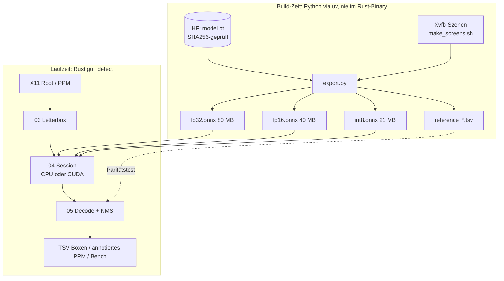
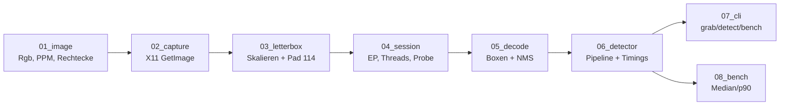
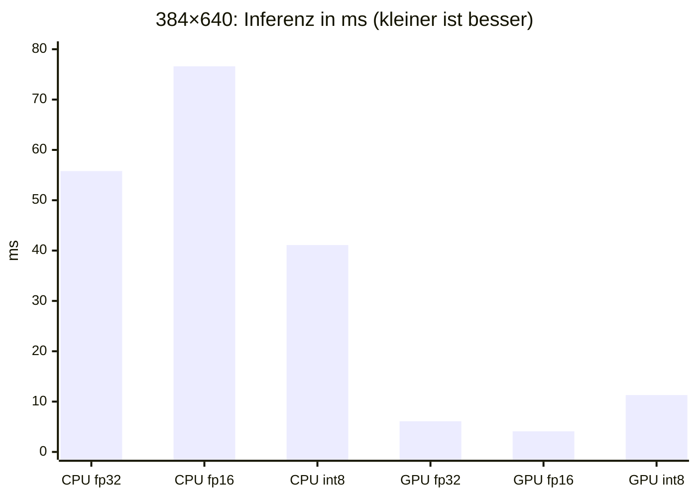
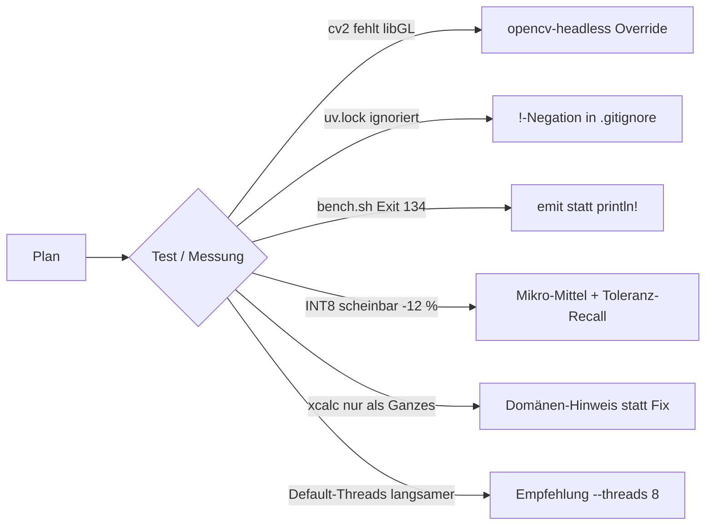
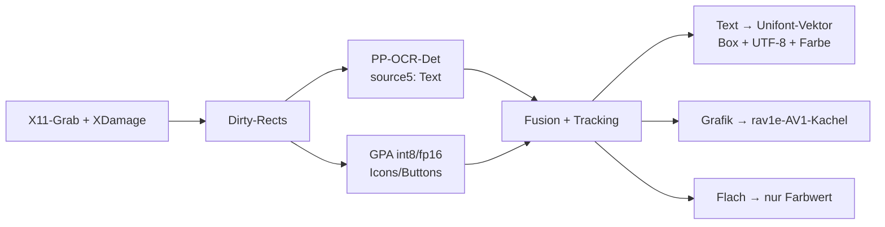

# Walkthrough — GUI-Elemente erkennen mit GPA-GUI-Detector (source8)

Dieses Dokument erzählt, was in `examples/26_onnx/source8/` entstanden ist,
warum es so aussieht, wie es aussieht, und was wir daraus für die
Remote-Desktop-Pipeline mit 6 kB/s lernen. Es richtet sich an jemanden, der
das Projekt kennt, aber diesen Schritt nicht mitverfolgt hat.

Die Kurzfassung vorweg: Ein Rust-Binary (`gui_detect`) greift den
X11-Bildschirm ab, lässt das neuronale Netz von Salesforce darüberlaufen und
liefert Boxen um Icons, Buttons und Bedienelemente — **bitgenau gleich** wie
die Python-Referenz von Ultralytics. Auf der RTX A4000 dauert eine Inferenz
**4,1 ms** (fp16), auf der CPU **41 ms** (INT8, 8 Threads). Quantisierung auf
INT8 viertelt das Modell (80 → 21 MB) und beschleunigt die CPU um Faktor
1,4–2,2, kostet aber rund 7 % Recall an der Schwelle und hilft auf der GPU
überhaupt nicht.

---

## 1. Was exakt implementiert wurde

### 1.1 Das Modell in einem Satz — und die erste Überraschung

`GPA-GUI-Detector` ist ein **YOLO11m** (20 Mio. Parameter, 68 GFLOPs bei
640×640), trainiert mit Ultralytics auf Desktop-Screenshots. *YOLO* („You
Only Look Once“) ist eine Familie von Objektdetektoren, die in einem einzigen
Vorwärtsdurchlauf für ein Raster von Positionen gleichzeitig Box und
Konfidenz vorhersagen.

Beim ersten Laden stellte sich heraus, was die Model-Card nicht erwähnt:

```text
{0: 'icon'} detect
YOLO11m summary: 232 layers, 20,053,779 parameters, 68.3 GFLOPs
```

Es gibt **genau eine Klasse**, `icon`. Das Netz unterscheidet also *nicht*
zwischen Text, Foto und Diagramm — es sagt „hier ist ein interaktives
Element“. Für die Bild/Text-Trennung aus dem Prompt heißt das: GPA allein
reicht nicht, es muss mit der Textdetektion aus `source5` (PP-OCR)
kombiniert werden (siehe Abschnitt 3). Ebenfalls korrigiert: Die im Prompt
zitierte Aussage, man könne das Modell „NMS-frei als YOLOv26“ exportieren,
trifft auf dieses Checkpoint nicht zu. YOLO11 hat keinen One-to-one-Head;
Ultralytics meldet beim Export selbst
`This model has no one-to-one head; using one-to-many outputs`. Wir brauchen
also eine NMS — die schreiben wir in Rust.

*NMS* (Non-Maximum Suppression) räumt auf: Das Netz meldet für ein Icon
viele leicht verschobene Boxen; NMS behält die mit dem höchsten Score und
wirft alle weg, die sich zu stark mit ihr überlappen (gemessen als *IoU*,
Intersection over Union = Schnittfläche / Vereinigungsfläche).

### 1.2 Gesamtbild



### 1.3 Assets: Skripte statt Commits

Kein Binär-Asset liegt im Git (`.gitignore`: `models/`, `*.onnx`, `*.pt`,
`*.ppm`). Stattdessen baut eine Skriptkette alles reproduzierbar auf:

| Skript | Aufgabe |
|---|---|
| `scripts/fetch_model.sh` | lädt `model.pt` vom HF-Commit `d04be6b7`, prüft SHA256, idempotent |
| `scripts/make_screens.sh` | startet Xvfb 1920×1080, arrangiert xterm/xcalc/xclock/xlogo/xeyes, speichert 3 Szenen per `gui_detect grab` |
| `scripts/export_models.sh` | Kette: fetch → `cargo build` → Screens → `uv run python export.py` |
| `scripts/bench.sh` | Benchmark-Matrix CPU/CUDA × 6 Varianten + Binärgrößen |
| `scripts/smoke_xvfb.sh` | End-to-end-Nachweis unter Xvfb |

Die Python-Umgebung (`python/pyproject.toml` + `uv.lock`) enthält zwei
bewusste Kniffe:

```toml
# torch nur als CPU-Build: spart mehrere GB CUDA-Wheels
[tool.uv.sources]
torch = { index = "pytorch-cpu" }

# ultralytics zieht opencv-python (braucht libGL) → im Container ausblenden
[tool.uv]
override-dependencies = ["opencv-python; sys_platform == 'never'"]
```

Der Override ist nötig, weil `import ultralytics` sonst mit
`libGL.so.1: cannot open shared object file` abbricht; stattdessen steckt
`opencv-python-headless` in den Abhängigkeiten.

### 1.4 Export und Quantisierung (`python/export.py`)

Für zwei Eingabeformen — quadratisch `640×640` und rechteckig `384×640` —
entstehen je drei Varianten:

```python
# fp32: Ultralytics-Export, Graph vereinfacht durch onnxslim, ohne NMS
YOLO(pt).export(format="onnx", imgsz=[384, 640], simplify=True, nms=False, device="cpu")

# fp16: Gewichte halbieren, Ein-/Ausgänge bleiben f32 (Rust füttert weiter f32)
float16.convert_float_to_float16(onnx.load(f32), keep_io_types=True)

# int8: statisch, QDQ, per Kanal, kalibriert auf 28 GUI-Bildern
quantize_static(pre, dst, Reader(cal, hw), quant_format=QuantFormat.QDQ,
                per_channel=True, activation_type=QuantType.QUInt8,
                weight_type=QuantType.QInt8, nodes_to_exclude=exclude)
```

Zu den Begriffen: *fp16* speichert jede Zahl in 16 statt 32 Bit (halbe Größe,
auf GPUs mit Tensor-Cores schneller). *INT8-Quantisierung* bildet
Gleitkommawerte auf 8-Bit-Ganzzahlen ab: `x ≈ scale · (q − zero_point)`.
*Statisch* heißt, die Skalen für die Aktivierungen werden vorab aus
Beispielbildern gemessen (*Kalibrierung*), statt zur Laufzeit. *QDQ*
(Quantize/DeQuantize) ist das ONNX-Format, bei dem vor und nach jeder
quantisierten Operation explizite Q- und DQ-Knoten stehen; die Runtime
fusioniert sie zu echten INT8-Kernels — wenn sie es kann (das wird auf der
GPU wichtig).

Wichtig ist `nodes_to_exclude`: Nur `Conv` und `MatMul` werden quantisiert.
Der Decode im Detect-Head mischt Box-Pixelwerte (0…640) und Scores (0…1) in
einem Tensor; eine gemeinsame INT8-Skala dafür würde jeden Score auf 0
runden. (Ultralytics' eigener `onnx_int8_quantize` trifft dieselbe Wahl.)

Kalibrierdaten sind die drei Xvfb-Szenen plus der Beispiel-Screenshot aus
dem HF-Repo, jeweils ergänzt um sechs zufällige Ausschnitte (andere Zoomstufen)
— zusammen 28 Bilder.

Das Skript prüft jede Variante sofort mit onnxruntime-Python und schreibt
`export_report.tsv` (Größe, Recall/Präzision gegenüber fp32) sowie die
Paritätsreferenz `reference_<form>.tsv` aus dem Ultralytics-Predictor.

### 1.5 Der Rust-Teil: acht kleine Module

Zwei Abhängigkeiten: `ort 2.0.0-rc.13` (ONNX Runtime 1.28) und
`x11rb 0.14.0` — beide laut `cargo upgrade --incompatible` die neuesten.
Kein Bild-Crate, kein `ndarray`, kein `clap`.



| Datei | Zeilen | Inhalt |
|---|---:|---|
| `01_image.rs` | 162 | `Rgb`, PPM lesen/schreiben (kommentartolerant), BGRX→RGB, Rechtecke |
| `02_capture.rs` | 54 | Root-Window-Grab per `GetImage` (Z-Pixmap) |
| `03_letterbox.rs` | 158 | Ultralytics-kompatibles Letterboxing + Rücktransformation |
| `04_session.rs` | 133 | Session, `Device` auto/cpu/cuda, Warmup-Probe, Input-Form aus dem Graphen |
| `05_decode.rs` | 133 | `[1,4+nc,N]` → Boxen, IoU, klassenweise greedy NMS |
| `06_detector.rs` | 93 | Letterbox → Inferenz → Decode → Bildkoordinaten, mit Zeitmessung |
| `07_cli.rs` | 269 | Parser (`std::env`) und Kommandos |
| `08_bench.rs` | 134 | Warmup, Iterationen, Median/p90, TSV-Zeile |
| `lib.rs` / `main.rs` | 26 / 15 | nur Deklarationen bzw. Verdrahtung |

**Letterboxing** ist das Detail, an dem Parität hängt. Das Netz erwartet ein
festes Format; ein 1920×1080-Screenshot wird deshalb seitentreu verkleinert
(Faktor `r = min(H/h, W/w)` = 1/3) und oben/unten mit Grau (114) aufgefüllt:

```rust
let r = (dst_h as f64 / src_h as f64).min(dst_w as f64 / src_w as f64);
let nw = (src_w as f64 * r).round_ties_even() as usize;   // Python round()
let dh = (dst_h - nh) as f64 / 2.0;
top: (dh - 0.1).round_ties_even() as usize,               // Ultralytics' ±0.1-Trick
```

`round_ties_even` ist „Banker's Rounding“ wie Pythons `round()`; die
Abtastung erfolgt bilinear mit halbpixel-zentrierten Koordinaten
(`(d + 0.5)·scale − 0.5`), genau wie `cv2.INTER_LINEAR`.

**Decode** liest den Ausgabetensor spaltenweise. Jede der N Spalten ist ein
Kandidat `cx, cy, w, h, score` — der Score ist bereits sigmoid-normiert:

```rust
let (cx, cy, w, h) = (at(0, i), at(1, i), at(2, i) / 2.0, at(3, i) / 2.0);
dets.push(Det { b: [cx - w, cy - h, cx + w, cy + h], score, class });
```

Bei 640×640 ist N = 8400 (80² + 40² + 20² Rasterpunkte der drei Strides
8/16/32), bei 384×640 entsprechend 5040. Weil `04_session` die Eingabeform
aus dem Graphen liest, laufen beide Exporte ohne Codeänderung.

### 1.6 Das CLI

```sh
gui_detect grab out.ppm                                      # X11 → PPM
gui_detect detect models/gpa_384x640_int8.onnx x11 --out a.ppm   # TSV auf stdout
gui_detect bench models/example_input.ppm models/*.onnx --device cpu --threads 8
cargo run --release --features cuda -- bench x11 models/gpa_384x640_fp16.onnx --device cuda
```

Mit Feature `embed` steckt `gpa_384x640_int8.onnx` per `include_bytes!` im
Binary; das Modell heißt dann einfach `embedded`.

### 1.7 Tests

| Ebene | Was | Ergebnis |
|---|---|---|
| Unit (23) | PPM, BGRA, Letterbox-Geometrie (Pad 140 bzw. 12), Rundung, Rücktransformation, Decode, IoU, NMS, Parser, Median/p90, Gerät | grün |
| `tests/cli_smoke.rs` | Usage, kaputtes/fehlendes Modell → Exit 1 statt Panik | grün |
| `tests/parity.rs` (`--ignored`) | Rust vs. Ultralytics auf `example_input`, beide Formen | **300/300 Boxen**, IoU ≥ 0,9, ΔScore < 0,02 |
| `scripts/smoke_xvfb.sh` | echte X11-Fenster → `detect x11` → Boxen > 0 | grün |
| clippy `-D warnings` | Default und `--features cuda,embed` | grün |

So sieht die Ausgabe gegen die Referenz aus — identisch bis zur zweiten
Nachkommastelle:

```text
Rust:        0.95  300.33  79.31  397.42  0.805
Ultralytics: 0.95  300.33  79.31  397.42  0.81
```

### 1.8 Messergebnisse

Eingabe 1920×1080, Median aus 30 Läufen, reine Inferenzzeit (Pre ≈ 1,5 ms und
Post ≈ 0,3 ms kommen dazu). Vollständig in `source8/bench.md`.

| Variante | MB | CPU 4T | CPU 8T | CUDA |
|---|---:|---:|---:|---:|
| 640² fp32 | 80,4 | 150,0 | 91,1 | 9,4 |
| 640² fp16 | 40,3 | 183,8 | 120,2 | 6,0 |
| 640² int8 | 20,9 | 90,3 | 68,2 | 17,3 |
| 384×640 fp32 | 80,4 | 89,8 | 55,8 | 6,1 |
| 384×640 fp16 | 40,2 | 115,1 | 76,6 | **4,1** |
| 384×640 int8 | 20,9 | **53,1** | **41,1** | 11,3 |



End-to-end unter Xvfb (Grab + Pre + Inferenz + Post): CPU/INT8 **47 ms
(21 fps)**, CUDA/fp16 **9 ms (110 fps)**; der X11-Grab selbst kostet 3,5 ms.

Genauigkeit gegenüber fp32 (Score ≥ 0,25, IoU ≥ 0,5):

| Variante | Recall | Präzision | Recall, wenn Variante ≥ 0,15 darf |
|---|---:|---:|---:|
| fp16 | 1,000 | 1,000 | 1,000 |
| int8 640² | 0,934 | 0,955 | 0,986 |
| int8 384×640 | 0,924 | 0,958 | 0,981 |
| fp32 384×640 vs. 640² | 0,985 | 0,990 | 1,000 |

### 1.9 Die Antwort auf die Frage aus dem Prompt

> Können wir das Modell quantisieren, um die Größe der Binärdatei zu
> reduzieren und die Framerate zu erhöhen?

**Ja, auf der CPU — nein, auf der GPU.**

- *Größe:* INT8 viertelt das Modell (80 → 21 MB). Eingebettet wächst das
  Binary von 23 auf 44 MB (xz-komprimiert 23 MB). Danach ist die statisch
  gelinkte ONNX Runtime (~23 MB) der größere Brocken — weiteres Schrumpfen
  ginge nur über einen Minimal-Build von ORT oder ein kleineres Netz.
- *CPU-Framerate:* INT8 ist 1,4× (8 Threads) bis 2,2× (1 Thread) schneller
  als fp32. Der Zen-4-Prozessor hat AVX-512-VNNI, also Befehle für
  INT8-Skalarprodukte; auf dem Laptop (Zen 3+, nur AVX2) fällt der Gewinn
  voraussichtlich kleiner aus (nicht gemessen).
- *GPU:* INT8-QDQ ist auf dem CUDA-EP **langsamer** als fp32 (11,3 vs.
  6,1 ms). Der CUDA-Provider fusioniert Q/DQ-Knoten nicht und fügt 112
  Memcpy-Knoten ein. Richtig ist dort fp16 (4,1 ms). Echtes INT8 auf der GPU
  bräuchte TensorRT.
- *Preis:* INT8 verliert ~7 % Recall an der Schwelle 0,25; fast alle
  Verluste sind Boxen, deren Score knapp darunter rutscht (98 % Recall, wenn
  man der Variante 0,15 erlaubt). Für die Remote-Desktop-Anwendung ist eine
  etwas niedrigere Schwelle mit INT8 daher ein vertretbarer Tausch.

Der größte Einzelhebel war übrigens keine Quantisierung, sondern die
**rechteckige Eingabe 384×640**: −35 bis −40 % Rechenzeit bei 98,5 %
Box-Übereinstimmung, weil ein 16:9-Bildschirm im Quadrat zu 44 % aus grauem
Rand besteht.

---

## 2. Welche Entscheidungen die Tests umgeworfen haben



**opencv ohne Bildschirm.** Ultralytics zieht `opencv-python`, das
`libGL.so.1` braucht; im Container fehlt sie. Lösung: uv-Override plus
`opencv-python-headless`. Stolperstein am Rande: `uv remove` eines
opencv-Pakets löscht das gemeinsame `cv2/`-Verzeichnis und damit auch die
Headless-Variante — `uv sync --reinstall-package opencv-python-headless`
repariert das. In frischen Umgebungen tritt es nicht auf.

**Die Lock-Datei war unsichtbar.** Die `.gitignore` im Repo-Root ignoriert
`*.lock`. Für Rust ist das hier gewollte Konvention, für `uv.lock` nicht: Die
`pyproject.toml` enthält nur Untergrenzen, die exakten Exportversionen
stehen allein in der Lock-Datei. `source8/.gitignore` nimmt sie per
`!/python/uv.lock` wieder auf.

**Ein `| head` tötete den Benchmark.** Der erste Lauf von `bench.sh` endete
mit Exit 134. Ursache: `head -n 1` schließt die Pipe, `println!` panikt bei
`EPIPE`, und mit `panic = "abort"` im Release-Profil wird daraus SIGABRT.
Alle stdout-Zeilen laufen jetzt über

```rust
fn emit(line: &str) -> Result<(), String> {
    writeln!(std::io::stdout(), "{line}").map_err(|e| format!("stdout: {e}"))
}
```

— aus dem Absturz wird ein gewöhnlicher Fehler.

**INT8 sah schlechter aus, als es ist.** Der erste Report meldete für INT8
640² nur 88 % Recall. Die Aufschlüsselung pro Bild zeigte den Grund: Die
Xvfb-Szenen haben 3–6 Boxen; eine einzige Box knapp unter der Schwelle
zählte dort als −33 %, und das Mittel über Bilder blähte das auf. Jetzt wird
über alle Boxen gemittelt (Mikro-Mittel) und zusätzlich ein toleranter
Recall ausgewiesen — der zeigt, dass es sich um Score-Verschiebungen
handelt, nicht um verlorene Objekte. Vier Kalibriermethoden (MinMax,
Percentile 99,999, Entropy, MinMax ohne Detect-Head) lagen alle innerhalb
von ±1 %; MinMax blieb, weil es in 8 s statt 70 s rechnet.

**Das Netz sieht alte X11-Programme anders.** Auf dem Windows-Screenshot
erkennt GPA jedes einzelne Icon und jeden Menüpunkt. Auf den nackten
Xvfb-Szenen (schwarzer Root, keine Fensterdekoration) rahmt es dagegen
ganze xcalc-Fenster und die komplette xlogo/xeyes-Reihe als *ein* Element
ein. Das ist Domänenverschiebung — die Trainingsdaten sind moderne Desktops.
Für den PoC ist das kein Fehler, aber eine wichtige Warnung für den
Einsatz auf spartanischen X11-Setups.

**Mehr Threads ≠ schneller.** Der ORT-Default (ein Thread pro physischem
Kern, hier 16) war mit 70 ms langsamer als 8 Threads mit 56 ms; ab ~8
Threads sättigt die Skalierung. Das CLI bietet `--threads`, die Empfehlung
lautet 8 — praktischerweise auch die Kernzahl des Ziel-Laptops.

**Wie erwartet, aber verifiziert:** Die CUDA-Warmup-Probe aus `source7`
wurde übernommen (Session-Commit beweist nicht, dass cuDNN lädt).
`--device auto` fällt still auf CPU zurück, `--device cuda` scheitert laut —
damit ein Benchmark nie eine CPU-Zahl als GPU-Zahl ausgibt.

---

## 3. Learnings und mögliche Erweiterungen

### Learnings

1. **Erst das Checkpoint laden, dann planen.** Eine Zeile Python
   (`YOLO('model.pt').names`) hat die zentrale Annahme „Bild/Text-Trennung
   per GPA“ widerlegt und die NMS-Frage geklärt.
2. **Parität ist billig, wenn man sie früh baut.** Weil `export.py` die
   Referenzboxen gleich mitschreibt, war der Rust-Port nach dem ersten Lauf
   verifiziert. Die Details (Banker's Rounding, ±0,1-Padding, halbpixel-
   zentriertes Bilinear) sind ohne Referenz kaum zu treffen.
3. **Quantisierung ist Hardware-spezifisch.** QDQ-INT8 hilft der CPU mit
   VNNI und schadet dem CUDA-EP. Die Variante gehört zur Zielhardware, nicht
   zum Modell.
4. **Geometrie schlägt Bits.** Das Weglassen von Padding (384×640) brachte
   so viel wie INT8 — ohne Genauigkeitsverlust.
5. **`copy-dylibs` legt nur Symlinks** nach `~/.cache/ort.pyke.io`. Für ein
   Deployment des CUDA-Builds müssen die `.so` (79 MB für
   `libonnxruntime_providers_cuda.so`) aufgelöst mitkopiert werden.
6. **Lizenzen trennen:** Gewichte MIT (Salesforce), Ultralytics AGPL-3.0 —
   nur Build-Werkzeug, nicht im Rust-Binary. Ob ein aus Ultralytics
   exportiertes ONNX AGPL-Pflichten erbt, ist juristisch zu klären.

### Wie es in der Remote-Desktop-Pipeline weitergehen kann



- **Fusion mit OCR:** Textzeilen aus PP-OCR nehmen, GPA-Boxen mit hohem
  Text-Überlapp als „Text-Button“ markieren, den Rest per Farbstatistik
  (Varianz, Anzahl Farben) in „flach“ und „Grafik“ teilen.
- **Nur Geändertes rechnen:** XDamage liefert Dirty-Rects; bei 6 kB/s sind
  ohnehin nur 1–2 übertragene Frames/s realistisch. 41 ms CPU pro
  Vollbild sind dann ~5 % Last.
- **Zeitliche Stabilität:** Box-Tracking mit Hysterese, damit Kacheln nicht
  flackern — jede flackernde Box wäre eine neu übertragene AV1-Kachel.
- **Kleine Icons:** Bei Faktor 1/3 wird ein 16-px-Icon 5 px groß. Optionen:
  Export mit 768×1280, Kachelung in 2×2 Ausschnitte, oder nur Dirty-Rects
  nativ detektieren.
- **TensorRT-EP** (Paket ist in ORT 1.28 bereits enthalten, nur
  `libnvinfer` fehlt) für echtes INT8/fp16 auf der GPU.
- **Kleineres Netz:** Das Checkpoint gibt es nur als YOLO11m (68 GFLOPs).
  Eine Destillation auf YOLO11s/n (laut Ultralytics ~22 bzw. ~6,5 GFLOPs,
  also 3–10× weniger) mit GPA als Lehrer wäre der größte Hebel für den
  Laptop.
- **Mehr Kalibrier- und Testdaten** von echten Linux-Desktops (GNOME/KDE,
  Browser, IDE), um die Domänenlücke zu messen.

---

## 4. Neue Programme/Pakete für das Dockerfile

Referenz: `cl-cl-generator/example/05_dockerfile_meta/source01/examples/03_ai_env/Dockerfile`
(Basis `nvidia/cuda:13.4.1-cudnn-runtime-ubuntu26.04`; `uv`, `curl`,
`xz-utils` und cuDNN sind dort bereits enthalten).

| Paket | Warum | Pflicht? |
|---|---|---|
| `xvfb` | virtueller X-Server für Screens, Smoke-Tests (`Xvfb`, `xvfb-run`) | ja |
| `xterm` | Textfenster in den Testszenen | ja |
| `x11-apps` | `xcalc`, `xclock`, `xlogo`, `xeyes` als GUI-Testmotive | ja |
| `xdotool` | Tastatur/Fenster-Automation in Smoke-Tests (source5/6/8) | empfohlen |
| `cargo-edit` (cargo install) | `cargo upgrade` laut Prompt-Vorgabe | empfohlen |
| `libnvinfer10` / TensorRT 10 (CUDA 13) | TensorRT-EP für GPU-INT8 | optional |

```dockerfile
RUN apt-get update \
 && apt-get install -y --no-install-recommends xvfb xterm x11-apps xdotool \
 && rm -rf /var/lib/apt/lists/*
```

Hinweis: Python-Pakete (torch-CPU, ultralytics, onnxruntime …) gehören
*nicht* ins Image — sie werden projektlokal per `uv sync` aus `uv.lock`
installiert. Ein vorgewärmter uv-Cache (`/root/.cache/uv`) spart beim ersten
Export allerdings rund 1 GB Download.

---

## Anhang: Commits dieses Schritts

| Commit | Inhalt |
|---|---|
| `c297bb9` docs(plan) | Plan, Tasks, deps.md |
| `2b9c135` build(source8) | uv-Umgebung, Modell-Download |
| `76c23d0` feat(source8) | Bild-I/O, X11-Capture, Letterbox |
| `ff9e671` feat(source8) | ONNX-Export fp32/fp16/int8 |
| `f6b843f` feat(source8) | Session, Decode, Detector |
| `6040c70` feat(source8) | CLI detect/bench |
| `972c0ab` test(source8) | Parität + Xvfb-Smoke |
| `81bb801` style(source8) | rustfmt-Nachzug im Paritätstest |
| `608a8fe` perf(source8) | Benchmarks, bench.md |
| `4573a14` fix(source8) | EPIPE-Fehler statt Abort, README |
