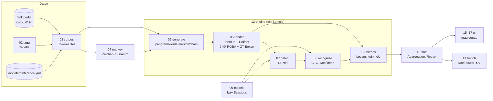

# Implementierungsplan — 20260930_01_unicode (source9)

**Ziel:** Variante von `source5` (PP-OCRv6-Live-OCR). Statt den Bildschirm
abzufotografieren, *erzeugt* das Programm Schriftproben in vielen Sprachen,
rastert sie mit **GNU Unifont** in ein 640×640-Bild, liest sie mit
**PaddleOCR** (ONNX) wieder ein und **misst** dabei Fehler und
Geschwindigkeit. Tasten schalten Sprache, Textgenerator, Modell und
Anzeigemodus um. Realistische Texte kommen aus **Markov-Ketten**, die auf
heruntergeladenen Wikipedia-Texten trainiert werden.

Arbeitsordner: `examples/26_onnx/source9/`. Plan-Ordner:
`examples/26_onnx/plan/20260930_01_unicode/` (dieses Dokument, `task.md`,
`deps.md`, später `walkthrough.md`). Es wird **direkt Rust** geschrieben
(kein Lisp-Input für den Transpiler), Edition 2024.

---

## 1. Kontext aufbauen — Dateien, die der Agent lesen muss

| Datei | Warum |
|---|---|
| `examples/26_onnx/plan/20260930_01_unicode/prompt.txt` | Originalauftrag (Regeln für Datei-Aufteilung, Commits, Walkthrough) |
| `examples/26_onnx/plan/20260923_01_keys_source5/walkthrough.md` | Learnings aus source5 (Font-Pfad, Clippy 1.98 `as_chunks`, Xvfb ohne WM, gehaltene Tasten) |
| `examples/29_lowbandwidth/plan/20260929_01_lowbandwidth/walkthrough.md` | Stil-Vorlage für den deutschen Walkthrough (Mermaid, Tabellen, Code) |
| `examples/26_onnx/source5/src/03_detect.rs` | DBNet-Nachverarbeitung (BFS, Unclip) — wird 1:1 übernommen |
| `examples/26_onnx/source5/src/04_recognize.rs` | Crop → 48×W, Normalisierung `/127.5-1`, `load_dict`, `ctc_decode` — Basis für `08_recognize.rs` |
| `examples/26_onnx/source5/src/02_capture.rs` | `prepare_native`: Normalisierung für die Detektion (ImageNet-Mittelwerte) |
| `examples/26_onnx/source5/src/05_overlay.rs` | Unifont-Suchliste, Box-/Label-Zeichnen, HUD |
| `examples/26_onnx/source5/scripts/fetch_assets.sh` | Muster für Downloads mit SHA256-Prüfung |
| `examples/26_onnx/source5/scripts/smoke_xvfb.sh` | Muster für Xvfb-Tests mit `xdotool --window` |
| `examples/26_onnx/source8/.gitignore`, `Cargo.toml` | Konventionen: Modelle nie committen, Release-Profil |
| `examples/26_onnx/README.md` | Übersicht der sourceN-Varianten (source9 eintragen) |
| `/workspace/src/cl-cl-generator/example/05_dockerfile_meta/source01/examples/03_ai_env/Dockerfile` | Docker-Referenz (Pakete für Walkthrough-Liste) |
| `plan/20260930_01_unicode/deps.md` | Abhängigkeiten + DeepWiki-Namen |

## 2. Anforderungen (aus dem Prompt) und ergänzende Vorschläge

Aus dem Prompt:

1. Schriftproben in vielen Sprachen (Deutsch mit Sonderzeichen, Französisch,
   Russisch, Japanisch, Chinesisch, Thai, …) mit GNU Unifont ausgeben.
2. Mit PaddleOCR wieder einlesen, Fehler + Geschwindigkeit messen.
3. Tasten: Sprache wechseln, Modi (nichts / Anzeige / Anzeige + Boxen),
   zufällige Sprachen, zufällige Wörter.
4. Markov-Ketten für realistische Strings, trainiert auf heruntergeladenen
   Texten (Python nur per `uv`).
5. Kleiner, effizienter Code, wenige Abhängigkeiten, nummerierte Dateien
   ≤~300 Zeilen, `cargo fmt/clippy/upgrade`, Tests, Xvfb, Conventional
   Commits, deutscher Walkthrough.

**Ergänzende Anforderungen (vom Planer vorgeschlagen und umgesetzt):**

| # | Vorschlag | Begründung / Entscheidung |
|---|---|---|
| E1 | **Sprachspezifische Erkennungsmodelle** (eslav, th, korean, el, arabic, devanagari, ta) + Taste `M` für Vergleich „universal vs. spezifisch“ | PP-OCRv6-small kennt kein Kyrillisch/Thai/Hangul — ohne E1 wären Russisch/Thai reine 100 %-Fehler |
| E2 | **Zeichensatz-Filter**: Generatoren erzeugen nur Zeichen, die (a) zur Schrift der Sprache gehören, (b) im Wörterbuch des Modells stehen und (c) Unifont kennt | Fehler messen dann das *Modell*, nicht Wörterbuchlücken |
| E3 | **Headless-Benchmark** (`bench`-Unterbefehl, ohne Fenster) mit Markdown-Tabelle + optionalem TSV-Log | Reproduzierbare Messungen, Integrationstests, Walkthrough-Zahlen |
| E4 | **Seed** (`--seed`) für deterministische Läufe | Vergleichbarkeit zwischen Modellen/Commits |
| E5 | **Zeichen-Statistik**: pro Sprache die schlechtesten Zeichen und häufigsten Verwechslungen (z. B. `ß→B`) | „insbesondere Sonderzeichen“ messbar machen |
| E6 | **Generator „chars“** (gleichverteilte Zeichen des Sprach-Zeichensatzes) neben `pangram`, `words`, `markov` | Jedes Sonderzeichen gleich oft testen |
| E7 | **Schriftgrößen** 16/24/32/48 px (Unifont ist ein 16-px-Bitmapfont → Vielfache bleiben scharf) | Einfluss der Größe auf Fehler/Zeit messen |
| E8 | **Worker-Thread** für die Inferenz, UI bleibt reaktiv | Rec dauert 50–400 ms pro Probe |
| E9 | Keine Bidi-/Shaping-Engine (Arabisch, Devanagari, Tamil, Thai-Kombinationszeichen) — stattdessen *gemessen und dokumentiert* | Hält Code klein; Ergebnis ist selbst ein Befund |

Nicht umgesetzt, als Erweiterung notiert: Screen-Roundtrip über X11
(Fenster abfotografieren wie source5), Rauschen/Blur/JPEG-Artefakte,
Farben/Hintergründe, Arabisch-Shaping, Graphem-basierte CER, GPU (CUDA).

## 3. Architektur



- **Kein Screen-Capture**: das Bild entsteht deterministisch im Speicher
  (fontdue-CPU-Rasterung). Dasselbe RGBA-Bild geht an die OCR *und* als
  Textur ans Fenster. Damit ist die gesamte Pipeline ohne Display testbar.
- **Ground Truth**: pro Textzeile String + Tinten-Bounding-Box (Vereinigung
  aller Glyph-Bitmaps).
- Arabisch wird in **visueller Reihenfolge** (Zeichen umgedreht, ohne
  Shaping) gerendert und verglichen; das Modell liest links→rechts.

### Dateien (`source9/src/`)

| Datei | Inhalt | Tests |
|---|---|---|
| `lib.rs` | nur `mod`-Deklarationen + Re-Exports | – |
| `main.rs` | CLI parsen → `bench` oder Fenster starten | – |
| `01_rng.rs` | SplitMix64 (`next_u64`, `below`, `pick`) | Determinismus, Bereich |
| `02_lang.rs` | `Lang`-Tabelle: Code, Name, Schrift-Bereiche, Extra-Satzzeichen, Modell (spezifisch), RTL, Pangramme | Codes eindeutig, Pangramme im Bereich |
| `03_corpus.rs` | Korpus laden, Tokens filtern (alle Zeichen erlaubt), `Charset` | Filter, Charset-Schnitt |
| `04_markov.rs` | Zeichen-n-Gramm (Ordnung 3, Backoff), Training + Sampling | Deterministisch, nur gelernte Übergänge |
| `05_generate.rs` | `GenMode`, Zeilen erzeugen bis Breite voll (`fits`-Callback) | Breite eingehalten, Modi |
| `06_render.rs` | `Raster` (fontdue, Glyph-Cache), Layout, Canvas, GT-Boxen, Breitenmessung | Tinte in Box, weiße Ränder, RTL |
| `07_detect.rs` | RGBA→Planar-Normalisierung + DBNet (aus source5) | synthetische Prob-Maps |
| `08_recognize.rs` | Crop + CTC + Konfidenz, Modell aus Datei, `load_dict` (YAML-`''`-Escape) | CTC, Dict-Escape |
| `09_models.rs` | Modellpfade, `ModelChoice` (auto/universal), lazy Rec-Cache | Pfadauflösung |
| `10_metrics.rs` | Normalisierung, Levenshtein + Alignment, Box-Zuordnung, `SampleEval` | CER, Konfusionen, IoU |
| `11_stats.rs` | Aggregation je (Sprache, Modell), Zeichen-Statistik, Markdown-Report | Summen, Report-Format |
| `12_engine.rs` | `Engine::run(settings, seed) -> Sample` (Zeitmessung je Stufe) | via Integrationstest |
| `13_cli.rs` | Argumente (handgeschrieben) | Parser |
| `14_bench.rs` | Headless-Schleife, TSV | via Integrationstest |
| `15_ui_state.rs` | `Settings`, `Action`, `apply` (rein) | Tasten-Logik |
| `16_ui_draw.rs` | Canvas, Boxen (grün/rot), HUD, Statistik-Panel | – (Xvfb) |
| `17_ui_loop.rs` | Fenster-Loop, Tasten → Actions, Worker-Thread (mpsc) | – (Xvfb) |

Integrationstests `tests/roundtrip.rs` (Engine, alle Sprachen, Deutsch-CER-
Schwelle) und `tests/cli.rs` (Binary `bench`). Skripte: `scripts/fetch_models.sh`,
`scripts/fetch_corpus.py`, `scripts/smoke_xvfb.sh`, `scripts/README.md`.

### Sprachen (Startumfang)

| Code | Sprache | Modell „auto“ | Anmerkung |
|---|---|---|---|
| de | Deutsch | PP-OCRv6 small | ä ö ü ß Ä Ö Ü ẞ „ “ – … € § |
| fr | Französisch | PP-OCRv6 small | é è ê ç à œ « » ’ |
| en | Englisch | PP-OCRv6 small | Referenz |
| es | Spanisch | PP-OCRv6 small | ñ ¿ ¡ á |
| pl | Polnisch | latin v5 | ą ę ł ń ś ź ż |
| ru | Russisch | eslav v5 | Kyrillisch |
| uk | Ukrainisch | eslav v5 | і ї є ґ |
| el | Griechisch | el v5 | Tonos |
| ja | Japanisch | PP-OCRv6 small | Kana + Kanji, keine Leerzeichen |
| zh | Chinesisch | PP-OCRv6 small | Hanzi |
| ko | Koreanisch | korean v5 | Hangul |
| th | Thai | th v5 | Kombinationszeichen (ohne Shaping) |
| ar | Arabisch | arabic v5 | RTL visuell, ohne Shaping |
| hi | Hindi | devanagari v5 | ohne Shaping |
| ta | Tamil | ta v5 | ohne Shaping |

### Metriken

- **CER** (Character Error Rate) = Levenshtein(GT, OCR) / |GT| auf Codepoints,
  nach Normalisierung: Leerzeichen entfernt (Modelle setzen Leerzeichen
  bei CJK/Thai uneinheitlich), Vollbreiten-ASCII (U+FF01–FF5E) gefaltet.
- **Exakt** = Anteil Zeilen mit CER 0.
- **Det-Recall** = GT-Zeilen mit ≥1 zugeordneter Box (Box-Mittelpunkt in
  GT-Box ±4 px); **FP** = nicht zugeordnete Boxen; **IoU** = Vereinigung
  der zugeordneten Boxen vs. GT-Box.
- **Zeiten**: Render-, Det-, Rec-ms pro Sample, Zeichen/s.
- **Konfidenz**: Mittel der Max-Wahrscheinlichkeit emittierter CTC-Schritte.
- **Zeichen-Statistik**: aus dem Levenshtein-Alignment: je GT-Zeichen
  gesehen/korrekt, Top-Verwechslungen `gt→ocr` (`∅` = Löschung).

### Tasten (interaktiv)

| Taste | Wirkung |
|---|---|
| `→` / `←` | nächste / vorige Sprache |
| `R` | Zufallssprache pro Sample an/aus |
| `G` | Generator: pangram → words → markov → chars |
| `V` | Anzeige: nichts → Text → Text + Boxen |
| `↑` / `↓` | Schriftgröße 16/24/32/48 |
| `M` | Modell: auto (sprachspezifisch) ↔ universal (PP-OCRv6) |
| `Space` | Pause / weiter |
| `N` | ein Sample (auch in Pause) |
| `C` | Statistik löschen |
| `Esc` / `Q` | Ende, Report auf stdout |

### CLI

```text
unicode_ocr [OPTIONEN]              # Fenster
unicode_ocr bench [OPTIONEN]        # headless, Markdown-Report
  --lang de,fr|all   --gen pangram|words|markov|chars   --size 32
  --lines 8  --samples 20  --seed 1  --model auto|universal
  --models DIR  --corpus DIR  --font PATH  --tsv FILE
```

## 4. Usage-Beispiele (per DeepWiki erfragt)

**fontdue** (`mooman219/fontdue`): Bitmap startet oben links; Oberkante =
`baseline_y - (ymin + height)`, links = `pen_x + xmin`; fehlende Glyphen →
`lookup_glyph_index(c) == 0`; Kombinationszeichen haben `advance_width == 0`.

```rust
let font = fontdue::Font::from_bytes(bytes, fontdue::FontSettings::default())?;
let (m, bitmap) = font.rasterize('ß', 32.0);
let top = baseline - (m.ymin + m.height as i32);
let left = pen_x + m.xmin;
pen_x += m.advance_width.round() as i32;
let known = font.lookup_glyph_index('ẞ') != 0;
```

**ort** (`pykeio/ort`, 2.0.0-rc.13):

```rust
let mut s = Session::builder()?.with_intra_threads(4)?.commit_from_file(path)?;
let out = s.run(inputs![TensorRef::from_array_view(([1, 3, 48, w], &buf[..]))?])?;
let (shape, probs) = out[0].try_extract_tensor::<f32>()?;
```

**macroquad** (`not-fl3/macroquad`, 0.4): ohne Attribut-Makro starten,
Textur aus RGBA aktualisieren, Tasten lesen.

```rust
fn main() { macroquad::Window::from_config(conf(), ui_main(args)); }
let tex = Texture2D::from_rgba8(640, 640, &rgba);
tex.set_filter(FilterMode::Nearest);
tex.update_from_bytes(640, 640, &rgba);
if is_key_pressed(KeyCode::Right) { /* nächste Sprache */ }
```

**PaddleOCR** (`PaddlePaddle/PaddleOCR`): Rec-Eingabe Höhe 48,
`x/127.5-1`; CTC-Blank = Index 0; mit `use_space_char` ist Leerzeichen die
letzte Klasse; `pred_reverse` dreht Arabisch nach der Erkennung in logische
Reihenfolge (wir vergleichen stattdessen visuell).

## 5. Tests und Nachweise

- Nach jedem Rust-Schritt: `cargo fmt --check`,
  `cargo clippy --all-targets -- -D warnings`, `cargo test`.
- Asset-abhängige Tests (Modelle, Unifont, Korpus) laufen nur, wenn die
  Assets da sind; `scripts/fetch_models.sh` + `uv run scripts/fetch_corpus.py`
  stellen sie her. Fehlen Modelle/Font, schlagen die Tests mit klarer Meldung
  fehl (kein stilles Überspringen); nur der Korpus darf fehlen (Markov/Words
  fallen dann auf Pangramme zurück, Test meldet `SKIP`).
- „HIL“-Nachweis = echter X-Server (Xvfb) mit synthetischen Tasten
  (`xdotool --window`), Screenshots (`scrot`) und Report auf stdout.

## 6. Commits

Conventional Commits (`type(scope): kurz`), Scope `source9` bzw. `plan`,
Body mit *was*, *warum*, *wie getestet*; Trailer
`Co-authored-by: Copilot <223556219+Copilot@users.noreply.github.com>`.
Nie `*.onnx`, `models/`, `corpus/`, `target/` committen (`source9/.gitignore`).
Beispiel:

```text
feat(source9): add fontdue renderer with ground-truth line boxes

Rasterizes GNU Unifont glyphs on the CPU into a 640x640 RGBA canvas and
records one ink bounding box per text line. RTL languages are laid out in
visual order (no shaping). This replaces screen capture from source5 and
makes the whole OCR round trip testable without a display.

Tests: cargo test (render: ink inside box, margins white, rtl order).
```

## 7. Risiken

- `ort` ist RC → API-Drift; Version pinnen, `cargo upgrade` am Ende.
- v5-Modelle könnten andere Eingaben erwarten → erster Integrationstest pro
  Modell (T5) deckt es auf.
- Wikipedia-Extrakte sind kurz/stubby → pro Sprache ~150 kB sammeln;
  Rate-Limit beachten (User-Agent, Pausen).
- Xvfb ohne WM: Fenster bei (0,0), Tasten per `--window`, `Escape` halten.
