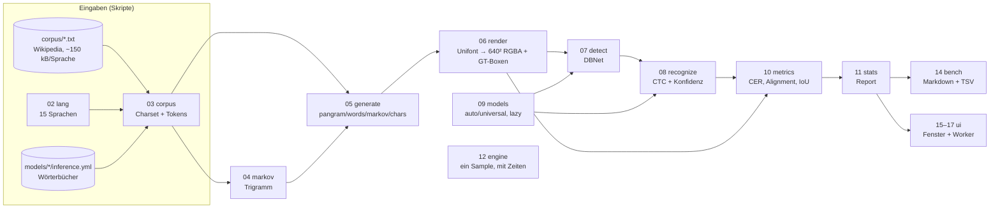

# Walkthrough: Unicode-OCR-Roundtrip (source9)

Dieses Dokument erklärt, was in `examples/26_onnx/source9` gebaut wurde,
welche Entscheidungen unterwegs kippten und was wir dabei über PaddleOCR,
Unifont und das Messen von OCR-Fehlern gelernt haben. Es richtet sich an
Leserinnen und Leser, die den Code verstehen oder weiterentwickeln wollen,
ohne jede Datei selbst durchzuarbeiten.

Die Grundidee in einem Satz:

> Statt den Bildschirm abzufotografieren (wie source5), **erzeugt** das
> Programm Schriftproben in 15 Sprachen, rastert sie mit **GNU Unifont** in
> ein 640×640-Bild, liest sie mit **PaddleOCR** (ONNX) wieder ein und
> **misst** dabei Fehler und Geschwindigkeit.

Ein paar Begriffe vorab, weil sie ständig vorkommen:

- **CER** (Character Error Rate): Anteil falsch gelesener Zeichen =
  Levenshtein-Distanz zwischen Soll- und Ist-Text geteilt durch die
  Soll-Länge. 0,05 heißt: jedes 20. Zeichen ist falsch.
- **DBNet**: das neuronale Netz, das *findet, wo* Text steht (liefert
  Boxen). **CTC**: das Verfahren, mit dem das zweite Netz *liest, was*
  in einer Box steht (liefert Zeichenketten + Konfidenz).
- **Ground Truth (GT)**: der Soll-Text inklusive seiner exakten Position —
  hier kein Hand-Label, sondern automatisch bekannt, weil wir das Bild
  selbst gerendert haben.

---

## 1. Was exakt implementiert wurde

### 1.1 Die Pipeline im Überblick



Alles beginnt deterministisch im Speicher: Dasselbe RGBA-Bild geht an die
OCR *und* als Textur ans Fenster. Dadurch ist die gesamte Pipeline ohne
Display testbar — das Fenster ist nur eine Ansicht, kein Messgerät.

### 1.2 Die 15 Sprachen und ihre Modelle

PP-OCRv6-small kennt kein Kyrillisch, Thai oder Hangul. Deshalb wählt
`auto` pro Sprache das passende Modell (Ergänzung E1 aus dem Plan):

| Sprachen | Erkennung (`auto`) | Besonderheit |
|---|---|---|
| de, fr, en, es | PP-OCRv6 small | Umlaute, Akzente, ñ, ¿¡ |
| pl | PP-OCRv5 latin | ą, ę, ł, ń, ś, ź, ż |
| ru, uk | PP-OCRv5 eslav | Kyrillisch, і, ї, є, ґ |
| el | PP-OCRv5 el | Griechisch mit Tonos |
| ja, zh | PP-OCRv6 small | Kana + Kanji / Hanzi |
| ko | PP-OCRv5 korean | Hangul |
| th | PP-OCRv5 th | Kombinationszeichen, ohne Shaping |
| ar | PP-OCRv5 arabic | RTL visuell, ohne Shaping |
| hi | PP-OCRv5 devanagari | ohne Shaping |
| ta | PP-OCRv5 ta | ohne Shaping |

Die Taste `M` schaltet auf `universal` (immer PP-OCRv6) um und macht den
Vergleich „spezifisch vs. universell“ im Fenster live erlebbar.

### 1.3 Die vier Generatoren

Alle Modi liefern Zeilen, die in die Canvas-Breite passen (echter
Unifont-Umbruch per `fits`-Callback), nur erlaubte Zeichen enthalten und
mindestens zwei Zeichen lang sind:

- **pangram**: kuratierte, sonderzeichenlastige Beispielsätze
  („Falsches Üben von Xylophonmusik …“).
- **words**: Zufallswörter aus dem Wikipedia-Korpus (Häufigkeit bleibt
  erhalten — gleichverteiltes Ziehen ist damit häufigkeitsgewichtet).
- **markov**: Zeichen-Trigramm mit Backoff, trainiert auf dem Korpus.
  Ausgabe klingt plausibel („müssenos densowo Freicke st derhenzi“).
- **chars**: Pseudowörter (2–8 Zeichen) aus *gleichverteilten*
  Charset-Zeichen — jedes Sonderzeichen kommt gleich oft vor.

Fehlt der Korpus, fallen `words`/`markov` lautlos auf Pangramme zurück.

### 1.4 Der Charset-Schnitt (E2)

Generatoren erzeugen nur Zeichen, die (a) zur Schrift der Sprache gehören,
(b) im Wörterbuch des Modells stehen und (c) Unifont kennt:

```rust
// 03_corpus.rs — stark gekürzt
if lang.in_script(c) && (c == ' ' || in_dict.contains(&c)) && font.has(c) {
    set.insert(c);
}
```

Fehler messen damit das *Modell*, nicht Wörterbuchlücken: `ẞ` und `„`
fehlen z. B. im Universal-Wörterbuch und würden sonst als Dauerfehler
gezählt. Leerzeichen ist implizit erlaubt (`use_space_char`-Modelle).

### 1.5 Messwerte

Pro Sample misst die Engine Render-/Detektions-/Erkennungszeit; die
Metriken liefern CER (nach Normalisierung: Whitespace raus, Vollbreite
gefaltet), Exakt-Anteil, Detektions-Recall, FP-Boxen, IoU und Konfidenz.
Die Zeichen-Statistik zählt aus dem Levenshtein-Alignment je Zeichen
gesehen/korrekt plus Top-Verwechslungen (`ß→B`, `∅` = gelöscht).

Der Release-Sweep (`bench.md`, 5 Samples × 4 Zeilen je Zelle, 32 px):

| Modus | Latein/CJK (Realtext) | Arabisch | Hindi/Tamil/Thai/Koreanisch |
|---|---|---|---|
| pangram | 0–5 % (fr 5,4 %) | 75 % | 2–19 % |
| words | 0–2 % | 32 % | 1–18 % |
| markov | 0–3 % | 27 % | 1–19 % |
| chars | 42–66 % | 68 % | 11–63 % (kyrillisch 11–14 %) |

Detektion: fast überall Recall 100 %, keine einzige FP-Box. Tempo:
~100–175 ms pro Sample (4 Zeilen), Detektion dominiert.

### 1.6 Fenster und Headless-Betrieb

- **Fenster** (Start ohne Argumente): Canvas-Textur, grüne Boxen bei
  Treffern, rote bei Fehlalarmen, OCR-Labels, HUD-Statuszeile, live
  Statistik-Panel (Samples, Top-Verwechslung, schlechtestes Zeichen)
  und Tasten-Hilfe. Die Engine läuft im **Worker-Thread** (ein Sample
  voraus), die UI bleibt reaktiv. `Q`/gehaltenes `Escape` beendet mit
  dem Markdown-Report auf stdout.
- **`bench`**: gleiche Engine ohne Fenster, Markdown nach stdout,
  optional TSV-Log pro Sample (CER, Zeiten, GT- + OCR-Text zum Ansehen).
- **Skripte**: `fetch_models.sh` (gepinnte HF-Commits + SHA256,
  idempotent), `fetch_corpus.py` (`uv`, nur Stdlib), `smoke_xvfb.sh`
  (Xvfb-Nachweis, siehe unten).

### 1.7 Tests und Nachweise

60 Unit-Tests, 2 CLI-Tests, 5 Roundtrip-Integrationstests — alle mit
echten Modellen, kein stilles Überspringen (nur der Korpus darf fehlen,
dann meldet der Test `SKIP`). Die Highlights:

- `Hallo Welt` wird exakt zurückgelesen (Konfidenz > 0,5).
- Alle 15 Sprachen laufen durch; de/en/fr lesen unter 10 % CER bei
  Recall 1,0 und null Fehlalarmen.
- Der Xvfb-Rauchtest startet das Fenster, schickt
  `Right G V V M Up Space N`, verifiziert die drei Modi per
  Pixelanalyse (Text: weiß + Tinte, Boxen: + grüne Outlines, nichts:
  schwarz) und beendet mit Exit 0 + Report.

---

## 2. Welche Entscheidungen unterwegs kippten

### 2.1 Crop-Padding: enge Boxen kosten 25 CER-Punkte

**Plan:** Detektions-Box direkt croppen (wie source5).
**Befund:** Die deutsche CER lag bei **69 %** — `Größe` → `GroBe`,
`ÄÖÜ` → `AOl`. Die ASCII-Art des Renderings zeigte: Die Umlaut-Punkte
liegen exakt am Box-Rand, die Detektions-Box (IoU 0,68) schneidet sie ab.
Selbst die perfekte GT-Box las `Ä Ö ß` falsch — PaddleOCR ist auf Crops
*mit Weißraum* trainiert.
**Fix:** `pad_rect` in `08_recognize.rs` erweitert jede Box um 30 % ihrer
Höhe (mind. 4 px). Danach: de-CER **4 %**. Die IoU-Metrik nutzt weiter die
ungepaddeten Boxen — Padding ist reine Erkennungs-Hygiene.

### 2.2 CER-Gate: < 5 % → < 10 % + Detektions-Pins

**Plan:** de/en/fr unter 5 % CER bei 32 px.
**Befund:** Gemessen 3–5 % mit echten Einzelzeichen-Verwechslungen des
Modells auf Unifont: `ß→B/β`, `Ä→A`, `œ→e`, `è→ē/e`, `ç→c`, `’→'`,
`“→"`, `–→-`, `!→l` (fr: 5,3 %). Das sind Modell-Eigenschaften, keine
Pipeline-Fehler — Wegfiltern wäre Messbetrug.
**Fix:** Gate auf < 10 % gesetzt, dafür Recall 1,0 und null FP für
de/en/fr gepinnt. Echte Regressionen lösen weiter aus (enge Crops ohne
Padding + Charset: de-CER 69 %).

### 2.3 Mindest-Zeilenlänge gegen Umbruch-Artefakte

**Plan:** Jede umbrochene Zeile zählt.
**Befund:** Ein einsames `…` (Umbruch-Rest) wurde nicht detektiert und
trug als 1-Zeichen-Zeile **100 % Zeilen-CER** bei — ein einzelnes Zeichen
dominierte den Mittelwert.
**Fix:** `MIN_LINE_CHARS = 2`, einheitlich für alle Modi, dokumentiert.
Detektions-Schwächen misst `recall`/`FP` ohnehin separat.

### 2.4 Charset kam in T5 statt T6

**Plan:** Charset als Teil von `03_corpus` erst mit dem Korpus-Laden.
**Befund:** Der T5-Test („Pangramme nur aus Charset“) und die
Wörterbuchlücken (`ẞ`, `„`) verlangten den Schnitt früher.
**Fix:** `Charset` (Schrift ∩ Wörterbuch ∩ Font) wurde mit der
Pangram-Engine eingeführt, Korpus-Laden folgte in T6.

### 2.5 `Settings` lebt in der Engine

**Plan:** `Settings` in `15_ui_state`.
**Befund:** Die Engine (T5) braucht die Einstellung neun Tasks vor der UI.
**Fix:** `Settings` wohnt in `12_engine`, die UI-State-Maschine bettet
sie ein. Eine Definition, keine Vorwärtsabhängigkeit.

### 2.6 Bench-Nachweise für T6–T8 kamen in T9

**Plan:** Jeder Modus wird per `bench --gen …` nachgewiesen.
**Befund:** Die `bench`-CLI existiert erst in T9 — T6–T8 konnten sie
nicht benutzen.
**Fix:** Jeder Modus bekam sofort einen Engine-Level-Integrationstest
(mit echten Modellen); die exakten `bench`-Befehle aus T6–T8 wurden in
T9 nachgeholt und verliefen grün (u. a. 50× Umlaute/ß im `chars`-GT,
plausible Markov-Zeilen im TSV).

### 2.7 Kleinere Befunde

- `ort` braucht das Feature `std` für `commit_from_file` (trotz
  `default-features = false` + Download-Features).
- `gen` ist in Rust 2024 reserviert — `Sample.gen` heißt `mode`.
- `ja.txt` enthält abgeschnittene UTF-8-Sequenzen (Fetch-Artefakt) —
  der Korpus-Lader dekodiert mit `from_utf8_lossy`, sonst wäre der
  gesamte japanische Korpus leer.
- Kein CER-Gate für `chars`: Kauderwelsch aus ~300 Zeichen liest sich
  zu 63 % falsch — Abdeckung (nicht CER) ist dort die Metrik.
- `macroquad::Window::from_config` statt `#[macroquad::main]`, weil
  `main` synchron bleiben muss (`bench` darf kein Fenster öffnen).
- Erster echter `bench`-Lauf entlarvte einen Anzeige-Bug: Die
  Fehlerrate wurde als Bruch *mit* Prozentzeichen gedruckt
  („10×, 0 %“) — jetzt mit Test gepinnt.

---

## 3. Learnings und mögliche Erweiterungen

### 3.1 Learnings

1. **Unifont-`ß` sieht aus wie `B`.** Kein Preprocessing-Fehler —
   die Bitmap-Glyphe ist es selbst (per ASCII-Art verifiziert). Solche
   Font-Modell-Paarungen *sind* der Befund, den dieser Benchmark liefert.
2. **Erkennung braucht Rand.** Modelle, die auf Detektions-Crops
   trainiert sind, erwarten Weißraum um den Text. Wer Boxen woanders
   hernimmt (GT, eigene Detektion), muss padden.
3. **DBNet übersieht Punkte.** Eine `…`-Zeile (drei fette Punkte)
   fand die Detektion nicht — Kleinsttext ist eine echte Schwäche,
   kein Rauschen.
4. **Das Modell faltet exotische Satzzeichen.** `“→"`, `–→-`, `’→'`:
   Für die CER sind das Fehler, für die Praxis Normalisierung. Eine
   „sanfte CER“ (ASCII-Faltung optional) wäre eine sinnvolle zweite Zahl.
5. **v6 schlägt v5-latin auf Unifont.** Das Latin-Spezialmodell las
   `ÄÖÜ` als `A0u` — universell ist hier besser. Spezifisch ≠ besser,
   die `M`-Taste existiert genau für solche Vergleiche.
6. **CER kann über 1 liegen** (koreanisch `chars`: 1,084 — mehr
   Einfügungen als Zeichen). Mittelwerte über Modi mit Kauderwelsch
   sind sinnlos; `chars` gehört nur in die Zeichen-Statistik.
7. **Japanisch verliert manchmal eine Zeile** (markov-Recall 95 %) —
   einziger Detektions-Aussetzer im ganzen Sweep, Ursache noch offen.

### 3.2 Mögliche Erweiterungen

Aus dem Plan übernommen und weiterhin sinnvoll, aufsteigend nach Aufwand:

- **GPU (CUDA)** für die Inferenz; **Rauschen/Blur/JPEG** und
  **Farben/Hintergründe** als Störstufen vor der OCR.
- **Graphem-CER** statt Codepoint-CER (Thai-Kombinationen fair zählen).
- **Arabisch-Shaping** (logisch → visuell) plus Devanagari-Ligaturen —
  aktuell die größte bekannte Fehlerquelle (ar: 27–75 %).
- **Screen-Roundtrip**: eigenes Fenster per X11 abfotografieren und
  gegen Canvas-GT vergleichen (Brücke zurück zu source5).
- **Statistik je Generator** aufspalten (aktuell je Sprache/Modell —
  `--gen all` mischt Modi in einer Zeile).
- **Fenster-Flags** (`--models/--corpus/--font` auch fürs Fenster,
  aktuell nur Defaults).

---

## 4. Programme und Pakete fürs Dockerfile

Laufzeit- und Nachweis-Abhängigkeiten, die ins Image gehören
(Referenz: `03_ai_env/Dockerfile`, Muster `apt-get install -y
--no-install-recommends …`):

| Paket | Zweck | Schon da? |
|---|---|---|
| `fonts-unifont` | GNU Unifont (`/usr/share/fonts/opentype/unifont/…`) — Canvas *und* HUD | nein |
| `xvfb` | virtueller X-Server für `smoke_xvfb.sh` | nein |
| `xdotool` | synthetische Tasten ans Fenster (`--window`) | nein |
| `scrot` | Screenshots der drei View-Modi | nein |
| `uv` | `uv run scripts/fetch_corpus.py` (nur Stdlib, kein venv nötig) | ja (Image nutzt `uv`) |
| `curl`, `ca-certificates` | Modell-Download von HuggingFace | ja |

```dockerfile
RUN apt-get update \
 && apt-get install -y --no-install-recommends \
      fonts-unifont xvfb xdotool scrot \
 && rm -rf /var/lib/apt/lists/*
```

Nicht ins Image gehören: `models/` (~96 MB ONNX), `corpus/` (~2,3 MB
Wikipedia-Texte) und `target/` — alles per Skript reproduzierbar bzw.
Build-Artefakt, alles in `source9/.gitignore` ausgeschlossen.
