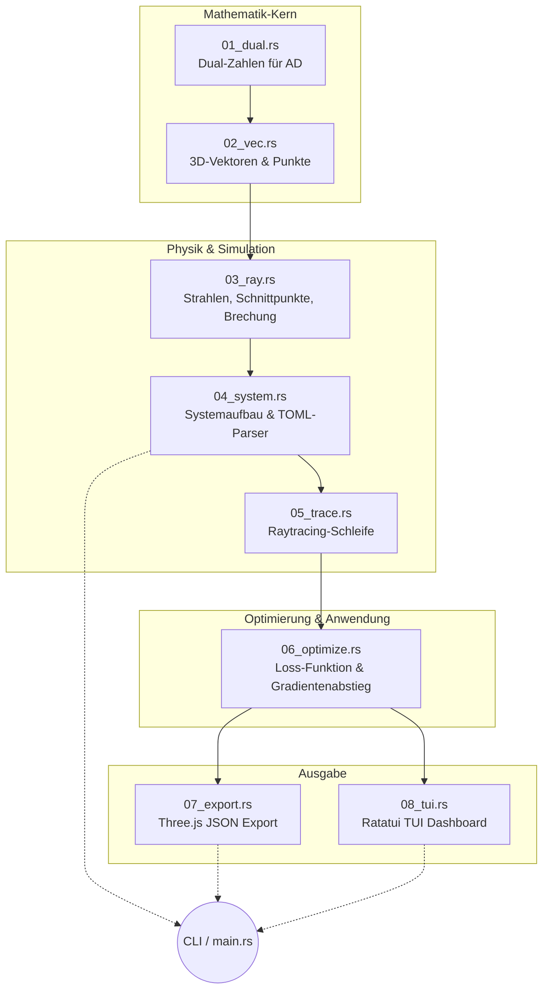

# Walkthrough — Differenzierbarer 3D-Optik-Tracer (`optics`)

Herzlich willkommen zu diesem Walkthrough! Dieses Dokument führt dich durch das Projekt **optics**, einen hochleistungsfähigen 3D-Raytracer für optische Linsensysteme, geschrieben in Rust.

## 1. Einleitung und Scope (Umfang)

Das primäre Ziel dieses Projekts ist es, ein Werkzeug zu schaffen, das komplexe Kameralinsen oder Teleskope nicht nur simulieren (durch Verfolgen von Lichtstrahlen, engl. "Raytracing"), sondern diese auch **automatisch optimieren** kann. Wenn ein Bild unscharf ist, kann die Software selbstständig berechnen, wie die Radien oder Dicken der Linsen verändert werden müssen, um das Bild scharf zu stellen.

**Scope (Was deckt dieses Dokument ab?):**
Dieser Walkthrough erklärt die grundlegende Architektur der Software, beleuchtet die getroffenen Design-Entscheidungen, bewertet den aktuellen Stand des Codes und diskutiert Erkenntnisse aus der Entwicklung. Er dient als Einstiegspunkt für jeden, der den Code verstehen oder erweitern möchte.

### Wichtige Abkürzungen und Begriffe erklärt
Um den Text verständlich zu halten, klären wir vorab die wichtigsten Fachbegriffe:
- **AD (Automatic Differentiation / Automatische Differenzierung):** Ein mathematischer Trick. Anstatt eine Formel erst zu lösen und dann mühsam per Hand (oder ungenau per Computer-Näherung) abzuleiten, berechnet AD den Wert *und* seine exakte Steigung (Ableitung) in einem einzigen Schritt. Das Programm "weiß" dadurch automatisch, in welche Richtung es eine Linse wölben muss, um das Bild schärfer zu machen.
- **Dual-Zahlen:** Das Werkzeug, um AD in der Programmierung umzusetzen. Eine Dual-Zahl speichert immer zwei Werte gleichzeitig: den eigentlichen Wert (`v`) und seine Ableitung (`d`).
- **TIR (Total Internal Reflection / Totalreflexion):** Ein physikalischer Effekt. Wenn Licht zu flach aus einem dichten Glas austreten will, wird es nicht gebrochen, sondern wie an einem perfekten Spiegel nach innen reflektiert.
- **EFL (Effective Focal Length / Effektive Brennweite):** Die "echte" Brennweite eines komplexen Linsensystems, vergleichbar mit der Millimeter-Angabe auf einem Kameraobjektiv.
- **BFL (Back Focal Length / Schnittweite):** Der Abstand vom allerletzten Glaselement bis zu der Ebene, wo das Bild letztendlich scharf abgebildet wird.
- **TUI (Terminal User Interface):** Eine Text-Benutzeroberfläche direkt im Kommandozeilenfenster, ganz ohne schwerfällige Grafikfenster.

---

## 2. Architektur-Überblick

Das Programm ist nach dem "Datenfluss"-Prinzip extrem modular aufgebaut. Es beginnt bei fundamentaler Mathematik und baut Schicht für Schicht das komplexe optische System auf.

### Die Schichten im Detail:
1. **Mathematik:** Anstatt Standard-Zahlen (`f64`) zu verwenden, rechnet alles in `Dual`-Zahlen (`01_dual`). Vektoren im Raum (`02_vec`) bestehen aus diesen Dual-Zahlen.
2. **Physik:** Hier liegt die Geometrie (`03_ray`). Wie schneidet ein Strahl eine Kugel? Wie bricht das Licht (Snellius-Gesetz)?
3. **Simulation:** Das System (`04_system`) lädt eine Konfiguration (`.toml`-Datei). Dann jagt der Tracer (`05_trace`) Tausende Strahlen in verschiedenen Wellenlängen (Farben) durch das System.
4. **Optimierung:** `06_optimize` misst, wie unscharf der Lichtpunkt am Ende ist (Spot Loss). Durch die Dual-Zahlen erhält es gratis den Gradienten (den Lösungsweg) und passt das System an.
5. **Ausgabe:** Die Ergebnisse werden entweder hübsch im Terminal visualisiert (`08_tui`) oder als 3D-Geometrie für Web-Viewer exportiert (`07_export`).

---

## 3. Review des Quellcodes und der Features

### Code-Qualität
- **Minimalismus statt Bloat:** Auf große, komplexe Mathematik-Bibliotheken (wie `nalgebra`) wurde bewusst verzichtet. Ein maßgeschneidertes, winziges Vektor-Modul (~60 Zeilen) reicht völlig aus. Das hält die Kompilierzeiten kurz und reduziert Fehlerquellen (Dependencies).
- **Strikte Trennung:** Keine Datei ist länger als 350 Zeilen. Jede Datei hat exakt eine Verantwortung (Single Responsibility Principle). Modul `lib.rs` klebt alles zusammen, ohne eigene Logik zu beinhalten.

### Feature-Abdeckung
✅ **Was hervorragend funktioniert:**
- Sphärische und flache Oberflächen.
- Physikalisch korrekte Lichtbrechung inklusive Totalreflexion (TIR).
- Cauchy-Dispersion (Das Programm berechnet Farbfehler/Chromatische Aberrationen, da blaues Licht stärker gebrochen wird als rotes).
- Blenden-Vignettierung (Aperture Stops - Strahlen, die den Rand der Linse treffen, werden blockiert).
- Der Optimierer kann simultan Linsenradien, Abstände und Glasmaterialien verbessern.

❌ **Was noch fehlt (Mögliche Erweiterungen):**
- **Asphärische Linsen:** Aktuell werden nur perfekte Kugelausschnitte (Sphären) berechnet. Moderne Smartphone-Linsen nutzen oft komplexere Asphären.
- **Sicherheitsgrenzen (Clamping):** Der Optimierer ist derzeit "blind". Wenn er meint, das Bild wird schärfer, indem eine Linse eine *negative* Dicke bekommt (sich selbst überlappt), tut er das. Es fehlen noch physikalische Grenzwerte (Bounds) während der Optimierung.
- **Erweiterte Glas-Modelle:** Derzeit wird die Cauchy-Gleichung für Farben genutzt. Ein Upgrade auf die präzisere Sellmeier-Gleichung wäre ein logischer nächster Schritt.

### Test-Abdeckung
Die Software ist extrem rigoros getestet (insgesamt 47 Tests). 
- **Unit-Tests:** Prüfen tiefgreifende Mathematik. Rechnet die Dual-Zahl bei einer Division die Ableitung richtig (Quotientenregel)? Wird ein Lichtstrahl bei normalem Einfallswinkel unberührt durchgelassen?
- **Integrationstests (Benchmark-Designs):** Dies ist das Highlight. Das System testet sich selbst gegen reale historische Patente: das *Landscape-Objektiv*, das *Cooke Triplet* und das komplexe *Double-Gauss-Objektiv* (Patent 4,123,144). Der Code muss hier selbstständig nachweisen, dass er die exakten physikalischen Schnittweiten (BFL) auf den Millimeter genau berechnet.

---

## 4. Diskussion und Learnings

Während der Entwicklung gab es einige bemerkenswerte Erkenntnisse, die für das tiefere Verständnis des Programms wichtig sind:

**1. Nominale vs. Berechnete Werte in der Literatur**
Beim Validieren der Software gegen historische Linsen-Daten (aus Patenten oder Lehrbüchern) stießen wir auf ein Problem: Die Lehrbücher geben oft ideale, glatte "Nominalwerte" an (z. B. *Effektive Brennweite = exakt 100 mm*). Wenn man jedoch die im gleichen Buch angegebenen Radien und Dicken der Linsen *exakt* simuliert, kommen leicht abweichende Werte heraus (beim Cooke Triplet z.B. 89,11 mm). Das ist kein Bug im Code, sondern eine Rundungs-Diskrepanz in historischen Dokumenten. **Learning:** Tests dürfen niemals blind gegen "Lehrbuch-Namen" assertieren, sondern müssen auf Basis der real gemessenen Geometrie-Daten gepinnt werden.

**2. Der immense Vorteil von Dual-Zahlen (AD)**
Normalerweise optimiert man solche Systeme durch "Finite Differenzen": Man ändert einen Linsenradius minimal, rendert das Bild komplett neu und schaut, ob es schärfer wurde. Das ist extrem rechenintensiv und anfällig für numerisches Rauschen. 
Durch die Implementierung der **Dual-Zahlen** schleust der Code die Information "Wie stark verändert dieser Strahl seinen Endpunkt, wenn ich Radius X ändere?" von Anfang bis Ende durch das Snellius-Gesetz. Die Ableitung fällt im ersten Durchlauf einfach "gratis" und auf 15 Nachkommastellen exakt heraus. Dies demonstriert die massive Überlegenheit von *Forward-Mode Automatic Differentiation* im physikalischen Computing.

**3. Rusts Stärke für wissenschaftliches Rechnen**
Rust hat sich hier als Geheimwaffe erwiesen. Durch Rusts Operator-Overloading (`Add`, `Mul`, `Sub`) konnten wir die komplexen physikalischen Formeln im Code genau so schreiben, als wären es normale Kommazahlen (`f64`). Der Compiler verwebt die Dual-Zahlen-Logik im Hintergrund fehlerfrei, während die strenge Typisierung Fehler wie `NaN` (Not a Number) bei der Lichtbrechung systematisch durch `Option`-Typen (`Some`/`None`) ersetzt und handhabbar macht.
