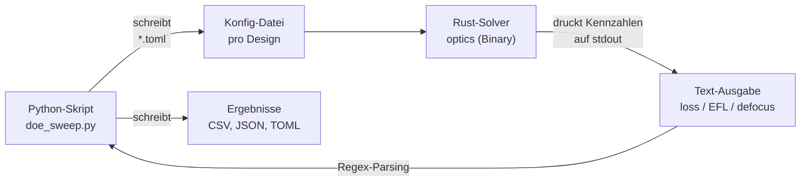
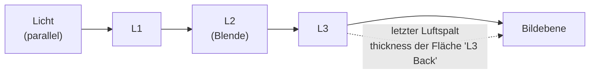
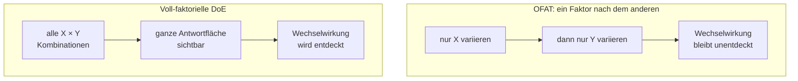
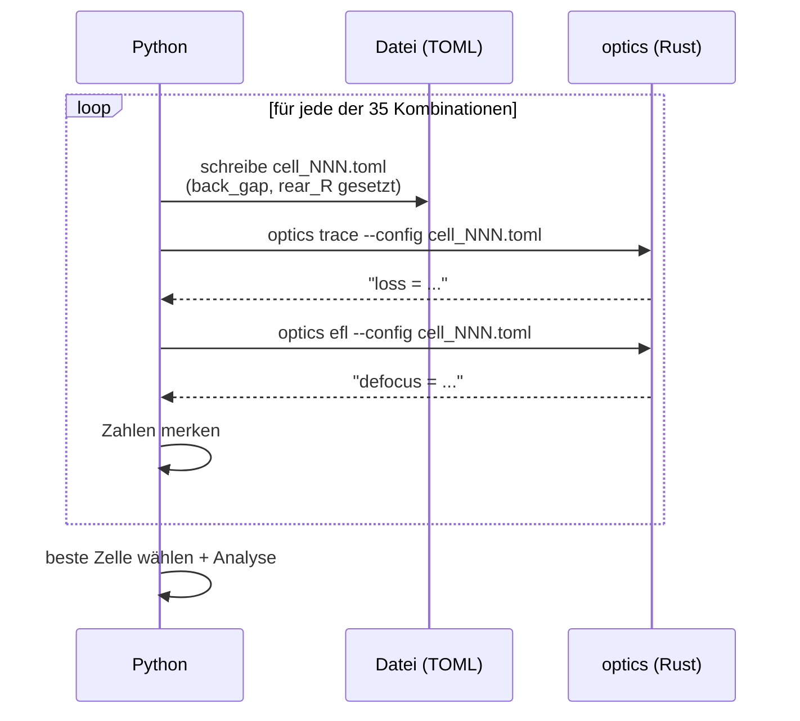
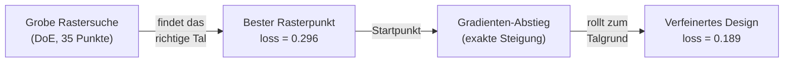

# Statistische Versuchsplanung (DoE) für ein reales Objektiv-Design

*Ein Tutorial: Wie man den Rust-Solver `optics` aus Python heraus steuert, einen Parameter­raum systematisch durchsucht und das Ergebnis mit dem eingebauten Optimierer absichert.*

---

## 0. Für wen ist dieses Dokument – und was Sie davon haben

Dieses Tutorial richtet sich an Leserinnen und Leser, die **programmieren können**, aber **keine Optik-Fachleute** sein müssen. Sie brauchen kein Vorwissen über Linsen. Alle Fachbegriffe werden bei ihrer ersten Verwendung erklärt, und jede Abkürzung wird ausgeschrieben.

Am Ende verstehen Sie drei Dinge:

1. **Wie** man einen kompilierten Rechenkern (hier: das Rust-Programm `optics`) wie eine Black Box aus einem Python-Skript heraus aufruft und dessen Ergebnisse einsammelt.
2. **Was** eine statistische Versuchsplanung (englisch *Design of Experiments*, kurz **DoE**) ist und warum sie ein besseres Werkzeug ist als „einfach mal ein paar Werte ausprobieren".
3. **Warum** man das Ergebnis einer solchen Rastersuche anschließend noch mit einem Gradienten­verfahren verfeinert – und wie beide Methoden zusammenspielen.

> **Ein Bild vorweg.** Stellen Sie sich vor, Sie stehen im Nebel auf einem Berg und suchen das tiefste Tal. Die DoE ist wie ein grobes Raster von Messpunkten, das Sie ablaufen, um überhaupt zu erkennen, *wo* das Tal ungefähr liegt. Das Gradienten­verfahren ist das anschließende „bergab rollen", sobald Sie im richtigen Tal stehen. Beide zusammen sind stärker als jede Methode allein.

---

## 1. Geltungsbereich (Scope)

**Was dieses Tutorial abdeckt:**

- Ein konkretes, reproduzierbares Beispiel: die Neu­fokussierung eines *Cooke-Triplet*-Objektivs (Erklärung folgt in Abschnitt 3).
- Ein vollständiges Python-Skript (`doe_sweep.py`), das ohne Fremd­bibliotheken auskommt – nur die Python-Standard­bibliothek und das kompilierte `optics`-Programm.
- Eine zwei­dimensionale, voll­faktorielle DoE über 35 Design­varianten.
- Die Analyse der Ergebnisse: Antwort­fläche, Haupt­effekte, Auswahl des besten Punktes.
- Die Absicherung („Validierung") mit dem eingebauten, exakt­differenzierbaren Optimierer.

**Was dieses Tutorial *nicht* abdeckt:**

- Die Herleitung der optischen Physik (Snelliussches Brechungs­gesetz, automatische Differenziation). Diese steckt bereits im Rust-Code und wird hier nur *benutzt*, nicht erklärt.
- Fortgeschrittene DoE-Verfahren wie Antwort­flächen­modelle höherer Ordnung, D-optimale Pläne oder Varianz­analyse (ANOVA). Wir bleiben bei der anschaulichen Rastersuche.
- Toleranz­rechnung oder Fertigungs­einflüsse.

**Voraussetzungen:**

- Python 3.9 oder neuer (getestet mit 3.14).
- Das kompilierte `optics`-Programm. Falls es noch nicht existiert:
  ```sh
  cd ../../source6 && cargo build --release
  ```

---

## 2. Das große Ganze: Wer redet mit wem?

Bevor wir in Details gehen, hier der Datenfluss. Python erzeugt Konfigurations­dateien, ruft das Rust-Programm auf, liest dessen Text­ausgabe zurück und wertet sie aus.



Der entscheidende Punkt: **Python kennt keine Optik.** Es behandelt `optics` als *Black Box* – man schiebt oben eine Beschreibung des Objektivs hinein und liest unten eine Zahl (die „Güte") heraus. Genau so würde man in der Praxis einen fremden Simulations­kern, ein FEM-Programm oder einen Fertigungs­prozess ansteuern.

### 2.1 Kurzes Glossar der Abkürzungen

| Abkürzung | Ausgeschrieben | Bedeutung in einem Satz |
|-----------|----------------|--------------------------|
| **DoE** | Design of Experiments (statistische Versuchsplanung) | Ein *systematischer* Plan, welche Parameter­kombinationen man ausprobiert, statt planlos zu raten. |
| **CLI** | Command-Line Interface (Kommandozeilen­schnittstelle) | Das Programm wird über Text­befehle im Terminal gesteuert, nicht per Mausklick. |
| **RMS** | Root Mean Square (quadratischer Mittelwert) | Ein Maß für die „durchschnittliche Größe" einer Streuung – hier: wie weit die Lichtstrahlen vom idealen Bildpunkt entfernt landen. |
| **EFL** | Effective Focal Length (effektive Brennweite) | Wie stark das Objektiv das Licht bündelt, in Millimetern. |
| **TOML** | Tom's Obvious Minimal Language | Ein einfaches, menschen­lesbares Datei­format für Konfigurationen (ähnlich wie INI-Dateien). |
| **stdout** | Standard Output (Standard­ausgabe) | Der Text­kanal, auf dem ein Kommandozeilen­programm seine Ergebnisse ausgibt. |

---

## 3. Das reale Problem: ein unscharfes Objektiv

### 3.1 Was ist ein Cooke-Triplet?

Ein **Cooke-Triplet** ist eine klassische Foto­objektiv-Bauform aus dem Jahr 1893, bestehend aus **drei** Linsen (daher „Triplet"). Es ist berühmt, weil es mit nur drei Elementen erstaunlich gut abbildet. In der Konfigurations­datei `cooke.toml` ist es als Folge von sechs *Flächen* beschrieben (jede Linse hat eine Vorder- und eine Rückseite).

Eine Linsen­fläche wird durch drei Zahlen beschrieben:

- **radius** – der Krümmungs­radius der Fläche in Millimetern. Je kleiner, desto stärker gekrümmt.
- **thickness** – der axiale Abstand zur *nächsten* Fläche in Millimetern (bei der letzten Fläche: der Abstand bis zur Bildebene).
- **material** – die Brechzahl des Materials *nach* dieser Fläche (Glas ≈ 1,5–1,6; Luft = 1,0).



### 3.2 Der Defekt: 19 Millimeter daneben

Die mitgelieferte Prescription (Fachwort für „Rezept" bzw. die vollständige Linsen­beschreibung) hat einen realen Fehler: **die Bildebene sitzt nicht dort, wo das Licht sich tatsächlich bündelt.**

Wenn wir den Solver einmal mit dem Unterbefehl `efl` aufrufen, sagt er uns das direkt:

```
EFL = 89.1073 mm
back focus z = 104.1349 mm (image plane 123.2000)
defocus = 19.0651 mm
```

Übersetzung dieser drei Zeilen:

- **back focus z = 104,13 mm** – bei dieser Position bündeln sich die Strahlen wirklich.
- **image plane = 123,20 mm** – dort sitzt aber der Sensor / Film.
- **defocus = 19,07 mm** – die Differenz. Fast zwei Zentimeter Unschärfe. Das Bild wäre komplett verschwommen.

Die zugehörige **Güte­kennzahl** (der „Verlust", englisch *loss*) beträgt **102,48**. Diese Zahl ist die Summe der quadratischen Abstände aller Strahlen vom Bild­zentrum – ein RMS-Spot-Maß. **Kleiner ist besser; 0 wäre ein perfekter Punkt.**

> **Merksatz.** Der *loss* ist unsere einzige Zielgröße. Die gesamte Übung dreht sich darum, diese eine Zahl so klein wie möglich zu machen.

### 3.3 Warum das ein gutes Demonstrations­beispiel ist

Dieses Problem ist kein Spielzeug:

- Es hat einen **klar messbaren Defekt** (19 mm Defokus, loss = 102).
- Es hat **mehrere Stellschrauben**, die sich gegenseitig beeinflussen (der letzte Luftspalt *und* die Krümmung der hinteren Fläche wirken beide auf den Fokus).
- Der Solver ist **differenzierbar** – er kann nicht nur die Güte, sondern auch deren exakte Steigung liefern. Das erlaubt uns, DoE (Rastersuche) und Gradienten­abstieg (gezieltes Bergab­rollen) direkt zu vergleichen.

---

## 4. Warum DoE – und nicht „einfach mal probieren"?

Angenommen, Sie hätten zwei Stellschrauben und wollten für jede fünf Werte testen. Naiv würden Sie vielleicht erst die eine Schraube durchprobieren (die andere festhalten), dann die andere. Das nennt man **OFAT** (*One Factor At A Time*, „ein Faktor nach dem anderen"). Das Problem: Wenn sich die Schrauben **gegenseitig beeinflussen** (Fachwort: *Wechselwirkung*), findet OFAT das echte Optimum systematisch nicht.

Die **voll­faktorielle DoE** testet stattdessen *alle* Kombinationen. Bei zwei Faktoren mit 7 bzw. 5 Stufen sind das 7 × 5 = **35 Versuche**. Das klingt nach viel, ist aber für einen schnellen Solver trivial – und es deckt Wechselwirkungen auf.



### 4.1 Unsere zwei Faktoren

| Faktor (Kürzel) | Physikalische Bedeutung | Fläche & Feld | Stufen |
|-----------------|--------------------------|----------------|--------|
| `back_gap` | Der letzte Luftspalt = Abstand der hinteren Linse zur Bildebene. Verschiebt direkt den Fokus. | `L3 Back` · `thickness` | 7 Werte von 60 bis 90 mm |
| `rear_R` | Krümmungs­radius der hintersten Fläche. Beeinflusst Fokus *und* Abbildungs­fehler. | `L3 Back` · `radius` | 5 Werte von −60 bis −45 mm |

Diese beiden wurden gewählt, weil sie den offensichtlichen Defekt (Defokus) angreifen und zugleich eine echte Wechselwirkung zeigen.

---

## 5. Wie das Python-Skript den Solver steuert

Das Skript `doe_sweep.py` macht im Kern drei Dinge. Sehen wir sie uns an echten Code­ausschnitten an.

### 5.1 Den Solver aufrufen (Black-Box-Prinzip)

Python startet das Rust-Programm als Unter­prozess und fängt dessen Text­ausgabe ab:

```python
proc = subprocess.run(
    [str(binary), "trace", "--config", str(config)],
    capture_output=True, text=True, cwd=str(SOURCE6),
)
```

Der Solver druckt daraufhin eine Zeile wie:

```
rays: 24/30 arrived, loss = 102.477846
```

### 5.2 Die Kennzahl herauslesen (Parsing)

Python zerlegt diese Zeile mit einem regulären Ausdruck und holt sich die Zahl:

```python
_LOSS_RE = re.compile(r"rays:\s*(\d+)/(\d+)\s*arrived,\s*loss\s*=\s*([-\d.eE+]+)")
```

> **Fachbegriff „Parsing".** Damit meint man das gezielte Heraus­lesen strukturierter Werte aus einem Text. Ein *regulärer Ausdruck* (englisch *regular expression*, kurz *Regex*) ist ein Such­muster – hier: „finde `loss = ` und lies die Zahl danach".

### 5.3 Eine Konfigurations­variante erzeugen

Für jede der 35 Kombinationen schreibt Python eine eigene TOML-Datei, in der genau die zwei Faktor-Felder ersetzt sind. So bleibt die ursprüngliche Prescription unangetastet, und jeder Versuch ist als Datei nachvollziehbar (`results/cells/cell_000.toml` …).



---

## 6. Ergebnisse der Rastersuche

Nach dem Lauf von `python3 doe_sweep.py` erhalten wir eine **Antwort­fläche** (englisch *response surface*): die Güte­kennzahl über dem Raster der zwei Faktoren. Das Skript zeichnet sie als ASCII-Heatmap (Zeichen von hell `.` = niedriger Verlust bis dunkel `@` = hoher Verlust, **logarithmisch** skaliert, damit das tiefe Tal sichtbar bleibt):

```
          60.0  65.0  70.0  75.0  80.0  85.0  90.0
  -60.0    *     +     =           :     +     *
  -56.2    *     =     .     :     =     *     #
  -52.5    +     :     .     =     *     #     #
  -48.8    -     .     =     *     #     #     %
  -45.0          =     *     #     #     %     @

x = back_gap (thickness of L3 Back)
y = rear_R (radius of L3 Back)
Schattierung ' .:-=+*#%@' bildet log-loss von 0.296 bis 309.7 ab
```

Man erkennt sofort ein **diagonales Tal**: Die niedrigsten Werte (leere Felder und `.`) ziehen sich schräg durch die Fläche. Das ist der sichtbare Beweis für die **Wechselwirkung** – ein größerer Luftspalt lässt sich durch eine stärkere Krümmung teilweise ausgleichen und umgekehrt. Genau das hätte OFAT übersehen.

### 6.1 Haupt­effekte: Welche Schraube wirkt stärker?

Der **Haupt­effekt** eines Faktors ist die Spannweite des mittleren Verlusts, wenn man diesen einen Faktor über alle seine Stufen variiert (und über die andere Achse mittelt). Je größer, desto einfluss­reicher:

| Faktor | Haupt­effekt (Spannweite des mittleren loss) |
|--------|-----------------------------------------------|
| `back_gap` | **136,26** |
| `rear_R` | 95,33 |

**Interpretation:** Der letzte Luftspalt (`back_gap`) ist die dominierende Stellschraube – wenig überraschend, denn er verschiebt den Fokus direkt. Die Krümmung wirkt zwar auch stark, aber schwächer.

### 6.2 Der beste Rasterpunkt

```
DoE-best design:
  back_gap = 75.0000
  rear_R   = -60.0000
  loss     = 0.2956   defocus = -2.083 mm
```

Von **loss 102,48** (Original) auf **0,30** (bester Raster­punkt) – das ist bereits eine Verbesserung um den Faktor ~347, allein durch systematisches Suchen.

---

## 7. Validierung: der Gradienten­abstieg als „Feinschliff"

Die Rastersuche findet nur die *nächstgelegene Raster­zelle*. Das echte Optimum liegt fast immer *zwischen* den Raster­punkten. Hier kommt die Besonderheit dieses Solvers ins Spiel: Er ist **differenzierbar**, das heißt, er kann per *automatischer Differenziation* die exakte Steigung des Verlusts nach jeder Stellschraube berechnen. Damit kann sein eingebauter **Gradienten­abstieg** (englisch *gradient descent*) gezielt „bergab rollen".

> **Was heißt „Gradienten­abstieg"?** Man steht auf der Verlust-Landschaft, berechnet die Richtung des steilsten Abstiegs (den *Gradienten*) und macht einen kleinen Schritt bergab. Wiederholt man das, landet man im Tiefpunkt des Tals. Weil der Solver den Gradienten *exakt* liefert (nicht durch numerisches Herum­probieren), ist dieser Abstieg schnell und stabil.

Das Python-Skript übergibt den besten Raster­punkt an den Optimierer, indem es das Feld als optimierbar markiert und `optics optimize` aufruft:

```
Validierung: Verfeinerung des DoE-besten Designs mit exaktem Gradienten­abstieg …
  optimiser: loss 0.2956 -> 0.1893 in 60 iters
  refined design: loss = 0.1893   defocus = -1.831 mm
```

Der Optimierer bestätigt und verbessert das DoE-Ergebnis: von **0,296 auf 0,189**. Er springt *nicht* in ein anderes Tal – ein Beleg dafür, dass die DoE das richtige Becken gefunden hatte. DoE und Gradient bestätigen sich gegenseitig.

### 7.1 Das Zusammenspiel als Bild



---

## 8. Gesamt­ergebnis

| Stufe | Verlust (loss) | Defokus | Kommentar |
|-------|----------------|---------|-----------|
| **Original** (wie geliefert) | 102,48 | +19,07 mm | Stark unscharf. |
| **DoE-bester Rasterpunkt** | 0,296 | −2,08 mm | Systematische Rastersuche. |
| **Optimierer-verfeinert** | 0,189 | −1,83 mm | Feinschliff per Gradient. |

**Verbesserung insgesamt: Faktor ≈ 541** (102,48 / 0,189).

Das ist die Kern­aussage des Tutorials: Eine als Black Box behandelte Rust-Rechen­maschine, angesteuert aus wenigen Zeilen reinem Python, verwandelt ein unbrauchbares Objektiv in ein scharfes – und der Weg dorthin (Raster­suche → Feinschliff) ist systematisch, nachvollziehbar und auf beliebige andere Solver übertragbar.

---

## 9. Selbst ausprobieren

```sh
# 1. Solver bauen (einmalig)
cd ../../source6 && cargo build --release && cd -

# 2. Die komplette Studie laufen lassen
python3 doe_sweep.py

# 3. Ergebnisse ansehen
cat results/summary.json          # maschinen­lesbare Zusammenfassung
cat results/doe_grid.csv          # eine Zeile pro Design
cat results/best_design.toml      # das beste Raster-Rezept
cat results/optimized.toml        # das verfeinerte Rezept
```

Optionale Argumente:

```sh
python3 doe_sweep.py --binary <pfad/zu/optics> --base-config <andere.toml> --out <verzeichnis>
```

### 9.1 Erzeugte Dateien

| Datei | Inhalt |
|-------|--------|
| `results/doe_grid.csv` | Alle 35 Designs mit loss, EFL, Defokus – ideal für Tabellen­kalkulation. |
| `results/summary.json` | Baseline, Faktoren, Haupt­effekte, bestes Design, Optimierer-Ergebnis. |
| `results/best_design.toml` | Die beste Prescription aus der Rastersuche. |
| `results/optimized.toml` | Die vom Gradienten­abstieg verfeinerte Prescription. |
| `results/cells/cell_NNN.toml` | Die 35 einzelnen Versuchs­konfigurationen (voll nachvollziehbar). |

---

## 10. Anhang: Fachwörter auf einen Blick

- **Prescription** – die vollständige, tabellarische Beschreibung eines Objektivs (alle Flächen mit Radius, Dicke, Material). Wörtlich „Rezept".
- **Fläche (surface)** – eine einzelne brechende Grenzfläche zwischen zwei Medien (z. B. Glas → Luft).
- **Defokus (defocus)** – der axiale Abstand zwischen dem tatsächlichen Fokus und der Bildebene. Null = perfekt fokussiert.
- **Antwort­fläche (response surface)** – die Ziel­größe (hier loss) aufgetragen über den variierten Faktoren.
- **Haupt­effekt (main effect)** – wie stark ein einzelner Faktor im Mittel die Ziel­größe verschiebt.
- **Wechselwirkung (interaction)** – wenn die Wirkung eines Faktors davon abhängt, wie ein anderer eingestellt ist.
- **Automatische Differenziation (autodiff)** – ein Verfahren, mit dem ein Programm neben dem Ergebnis auch dessen exakte Ableitung berechnet (nicht durch Näherung, sondern durch Anwendung der Ketten­regel im Code).
- **Gradient** – der Vektor der Ableitungen; zeigt in Richtung des steilsten Anstiegs. Der Abstieg geht in die Gegen­richtung.
