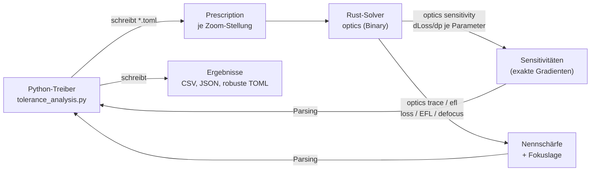
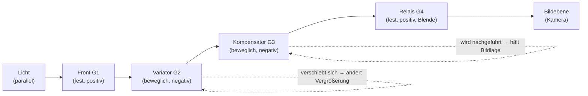
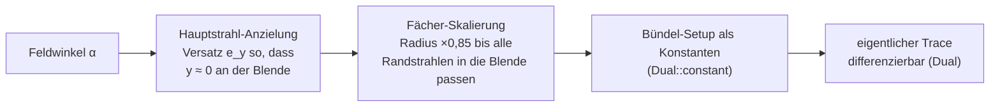
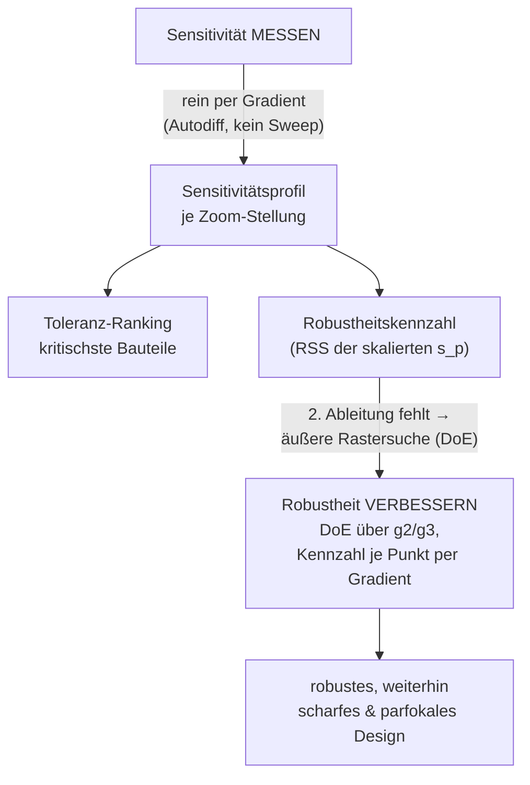

# Herstellbarkeit eines Zoom-Teleskops — Toleranz- und Sensitivitätsanalyse per Autodiff

*Ein Tutorial: Wie man mit dem differenzierbaren Rust-Solver `optics` nicht nur ein optisch scharfes, sondern ein **herstellbares** Zoom-Teleskop bewertet — indem man die Fehlerempfindlichkeit jedes Bauteils exakt und gradientenbasiert misst, ganz ohne Parameter-Sweep.*

---

## 0. Für wen ist dieses Dokument — und was Sie davon haben

Dieses Tutorial richtet sich an Leserinnen und Leser, die **programmieren können**, aber **keine Optik-Fachleute** sein müssen. Vorwissen über Linsen ist nicht nötig; alle Fachbegriffe werden bei ihrer ersten Verwendung erklärt und alle Abkürzungen ausgeschrieben.

Es baut auf Tutorial 01 (statistische Versuchsplanung für ein Cooke-Triplet) auf, ist aber eigenständig lesbar. Während Tutorial 01 fragte „Welches Design ist am **schärfsten**?", fragt dieses Tutorial: „Welches Design ist am **besten herstellbar**?" — und das ist eine andere, oft wichtigere Frage.

Am Ende verstehen Sie:

1. **Warum** ein auf dem Papier perfektes Design in der Fertigung durchfallen kann.
2. **Wie** ein differenzierbarer Solver die **Fehlerempfindlichkeit** (Sensitivität) jedes Fertigungsparameters *exakt* liefert — als Ableitung, nicht als Rastersuche.
3. **Wo** diese Gradientenmethode an eine Grenze stößt (zweite Ableitungen) und wie man sie dort mit einer schlanken Rastersuche ergänzt.

> **Ein Bild vorweg.** Zwei Brücken tragen dieselbe Last. Die eine kippt schon, wenn ein Niet einen Millimeter falsch sitzt; die andere verzeiht solche Fehler. Auf dem Reißbrett sehen beide gleich gut aus — der Unterschied zeigt sich erst in der Werkstatt. Bei Optik ist es genauso: Herstellbarkeit heißt **Fehler verzeihen**.

---

## 1. Geltungsbereich (Scope)

**Was dieses Tutorial abdeckt:**

- Ein konkretes, reproduzierbares Beispiel: ein **vierteiliges Zoom-Teleskop** mit variabler Brennweite, das über den gesamten Zoombereich scharf bleibt (**parfokal**).
- Die **gradientenbasierte** Messung der Fehlerempfindlichkeit `∂Loss/∂p` aller Toleranzparameter (Radien, Dicken, Brechzahlen) — pro Zoom-Stellung, ohne Sweep.
- Ein **Toleranz-Ranking** (welches Bauteil ist am kritischsten) und wie es über den Zoombereich wandert.
- Eine **Robustheits-Optimierung** dort, wo der Gradient nicht reicht: eine kleine Rastersuche (DoE) über die freien Montagevariablen, deren Kennzahl an jedem Punkt gradientenbasiert berechnet wird.
- Die **Absicherung** der Autodiff-Gradienten gegen Finite Differenzen.

**Was dieses Tutorial *nicht* abdeckt:**

- Die Herleitung der optischen Physik (Snellius, automatische Differenziation). Sie steckt im Rust-Code und wird hier nur *benutzt*.
- Vollständige kommerzielle Toleranzrechnung (Monte-Carlo über Fertigungsstatistik, RSS-Budgets mit Kopplungen, Zentrier-/Kippfehler). Wir bleiben bei den vier Parametertypen, die der Solver differenziert.
- Ein vollständig neu gerechnetes Seriendesign. Als Beispielsystem nutzen wir ein **reales, abgelaufenes Patent** — das vierteilige Zoom **Canon US 5,146,366 A** mit einem echten Zoomfaktor von **~5,7×** ([Google Patents](https://patents.google.com/patent/US5146366A/en)). Wir übernehmen dessen rein sphärische Prescription; die *Toleranzanalyse* darauf ist unser Beitrag.

**Voraussetzungen:**

- Python 3.9 oder neuer (reine Standardbibliothek, kein numpy/matplotlib).
- Das kompilierte `optics`-Programm. Falls es noch nicht existiert:
  ```sh
  cd ../../source6 && cargo build --release
  ```

---

## 2. Das große Ganze: Wer redet mit wem?

Wie in Tutorial 01 kennt Python **keine Optik**. Es schreibt Konfigurationsdateien, ruft den Rust-Solver als *Black Box* auf und liest dessen Textausgabe zurück. Neu ist: Der Solver liefert jetzt nicht nur eine Gütezahl, sondern auf Wunsch auch deren **exakte Ableitungen**.



### 2.1 Glossar der Abkürzungen und Fachbegriffe

| Begriff | Ausgeschrieben / Bedeutung |
|---|---|
| **Zoom** | Objektiv mit *stufenlos veränderlicher* Brennweite (Vergrößerung). |
| **parfokal** | Der Fokus bleibt über den ganzen Zoombereich erhalten — man muss beim Zoomen *nicht* nachfokussieren. |
| **varifokal** | Gegenteil: nach dem Zoomen muss neu fokussiert werden. |
| **Variator** | Die *bewegliche* Gruppe, die die Vergrößerung ändert. |
| **Kompensator** | Die *bewegliche* Gruppe, die die Bildlage konstant hält (kompensiert den Variator). |
| **Relais** | Feste hintere Gruppe, die auf die Kamera/den Sensor abbildet. |
| **EFL** | Effective Focal Length (effektive Brennweite) in mm — wie stark gebündelt wird. |
| **RMS** | Root Mean Square (quadratischer Mittelwert) — Maß für die Spotgröße. |
| **loss** | Unsere Gütezahl: Summe der quadrierten Strahlabstände vom Bildzentrum. **Klein = scharf.** |
| **defocus** | Abstand (mm) zwischen tatsächlichem Fokus und Bildebene. |
| **Toleranz** | Erlaubte Fertigungsabweichung eines Parameters. |
| **Sensitivität** | Wie stark der `loss` auf eine kleine Parameterabweichung reagiert: `s_p = ∂Loss/∂p`. |
| **Autodiff** | Automatische Differenziation — der Solver berechnet Ableitungen exakt mit, nicht per Nährung. |
| **Gradient** | Vektor aller ersten Ableitungen `∂Loss/∂p`. |
| **erste/zweite Ableitung** | Steigung bzw. Krümmung einer Funktion. |
| **DoE** | Design of Experiments (statistische Versuchsplanung) — systematisches Raster von Versuchen. |
| **Finite Differenzen** | Ableitung durch kleine Zahlen-Differenzen genähert: `(f(x+e)−f(x−e))/2e`. |

---

## 3. Das reale Problem: ein Design, das die Fertigung überstehen muss

### 3.1 Warum ein „perfektes" Design durchfallen kann

Ein Optikdesign ist eine Liste von Sollwerten: Krümmungsradien, Linsendicken, Luftspalte, Brechzahlen. In der Werkstatt trifft keiner davon exakt zu. Gläser werden geschliffen (Radius-Fehler), Linsen montiert (Dicken-/Abstands-Fehler), Glaschargen schwanken (Brechzahl-Fehler). **Herstellbarkeit** heißt: Das Bild bleibt trotz dieser Abweichungen scharf.

Das Maß dafür ist die **Sensitivität**:

```
s_p = ∂Loss / ∂p
```

- **Großes** `|s_p|` → kleiner Fehler bewirkt große Unschärfe → **enge** Toleranz nötig → teuer.
- **Kleines** `|s_p|` → das Design *verzeiht* Fehler → **günstig** herstellbar.

Herstellbarkeit optimieren heißt also: die **Sensitivitäten klein halten** — nicht nur den Nennschärfewert.

### 3.2 Aufbau eines Zoom-Teleskops (Recherche für Laien)

Als Beispielsystem dient ein **reales, abgelaufenes Patent**: das vierteilige Zoom **Canon US 5,146,366 A** (Erfinder Mukaiya, „Numerical Example 1"), abrufbar bei [Google Patents](https://patents.google.com/patent/US5146366A/en). Es hat exakt die klassische, mechanisch kompensierte Zoom-Architektur mit **vier Gruppen**, von denen sich **zwei bewegen** — und einen echten Zoomfaktor von **~5,7×** (Brennweitenverhältnis F = 1,00 → 5,70 in der normierten Patenteinheit):



- **Front (G1)** (fest): sammelt das Licht.
- **Variator (G2)** (beweglich): ändert durch Verschieben die **Vergrößerung**.
- **Kompensator (G3)** (beweglich): wird nachgeführt, damit die **Bildlage** trotz Variator-Bewegung konstant bleibt.
- **Relais (G4)** (fest): enthält die Aperturblende und bildet auf die Kamera ab.

Man braucht **mindestens zwei bewegliche Gruppen**, weil zwei Größen gleichzeitig kontrolliert werden: Vergrößerung *und* Bildlage. Bewegen sich beide *gleich*, spricht man von *optischer* Kompensation; brauchen sie *unterschiedliche* Bewegungen, von *mechanischer* Kompensation. Ein echtes Zoom hält den Fokus über den ganzen Bereich (**parfokal**); ein Varifokal müsste man nachfokussieren.

Das Patent normiert die Systembrennweite auf F = 1,0 (dimensionslos); alle Radien und Dicken tragen dieselbe Einheit. Der reale Zoom läuft laut Patent von F = 1,00 (Weitwinkel, 2ω = 45,24°) über F = 2,50 bis F = 5,70 (Tele, 2ω = 8,36°) bei einer Blendenzahl von etwa 2,0–2,3.

*(Architektur-Erläuterung sinngemäß nach: [adaptall-2.com – Inside a Zoom Lens](http://adaptall-2.com/articles/InsideZoomLens/InsideZoomLens.html); [Cambridge – Introduction to Lens Design, Zoom Lenses](https://www.cambridge.org/core/books/introduction-to-lens-design/zoom-lenses/C7741006BE26F36D2810C78F4379060B). Prescription-Daten aus dem Patent [US 5,146,366 A](https://patents.google.com/patent/US5146366A/en) (abgelaufen). Inhalte wurden für die Lizenzkonformität umformuliert.)*

### 3.3 Wie das im Solver abgebildet ist

Der `optics`-Solver sieht ein System als Folge von **Flächen** (jede Linse hat Vorder- und Rückseite), beschrieben durch `radius`, `thickness` (Abstand zur nächsten Fläche) und `material` (Brechzahl danach). Das Patentdesign hat **27 Flächen** (13 Linsen + Aperturblende + Deckglas). Die **Bewegung** der Gruppen bilden wir über die zoom-abhängigen **Luftspalte** ab. Drei Spalte sind veränderlich (Patent-Bezeichnung D5/D10/D12):

- **D5** = Spalt hinter G1 (bewegt den Variator G2),
- **D10** = Spalt hinter G2 (Vorderspalt des Kompensators G3),
- **D12** = Spalt hinter G3 (zum Relais G4).

Der **letzte** Spalt (Back Focus, Deckglas → Bildebene) wird pro Stellung mit dem **eingebauten Gradientenabstieg** (`optics optimize`) gelöst, sodass jede Stellung bei praktisch fester Kamera scharf abbildet — das System bleibt **parfokal**. Die drei Prescriptions `zoom_wide.toml`, `zoom_mid.toml`, `zoom_tele.toml` unterscheiden sich *nur* in D5/D10/D12 (Patent-Zoomdaten) und im gelösten Back Focus; Radien, Dicken und Gläser sind identisch.

Nach Implementierung des **Pupil-Aiming** (Abschnitt 4a) tracet der Solver alle drei Stellungen über mehrere Feldwinkel und Wellenlängen sauber:

| Stellung | 2ω (Patent) | EFL (norm.) | loss | defocus | Strahlen |
|---|---|---|---|---|---|
| wide | 45,24° | 0,988 | 8e-5 | −0,004 | 225/225 |
| mid  | ~24°   | 2,502 | 1e-4 | −0,010 | 225/225 |
| tele | 8,36°  | 5,711 | 1,7e-3 | −0,116 | 225/225 |

Das EFL-Verhältnis 5,711 / 0,988 = **5,78×** deckt sich mit dem Patent-Nominalwert 5,7×. Der Rückfokus (Achsenkreuzung des Randstrahls) liegt für alle drei Stellungen bei z ≈ 9,56 … 9,58 (normierte Einheiten) — Beleg für die **Parfokalität**.

---

## 4a. Neue Solver-Fähigkeit: Pupil-Aiming (Blenden-Anzielung)

### 4a.1 Warum das nötig war

Der Tracer schoss bisher ein **starres, achsparalleles** Strahlenbündel ins System. Für ein einfaches Objektiv reicht das. Beim realen Weitwinkelende des Patent-Zooms (halbes Bildfeld ~22,6°) scheiterte es aber: von 75 axialen Strahlen erreichten nur **3** das Bild — der Rest wurde an der Aperturblende **abgeschnitten (vignettiert)** oder ging verloren. Das war *kein* Designfehler des Patents, sondern eine **Grenze des Tracer-Modells**: Ein schräg einfallendes Feldbündel muss so **angezielt** werden, dass es die Blende trifft — genau das leisten professionelle Programme (Zemax, Code V) per *Pupil-Aiming*.

### 4a.2 Die Idee in zwei Sätzen

Vor dem eigentlichen (differenzierbaren) Trace wird pro Feldwinkel eine kleine **Vorab-Rechnung** gemacht:

1. **Hauptstrahl auf die Blendenmitte zielen.** Der Hauptstrahl (chief ray, Strahl durchs Pupillenzentrum) bekommt einen Eintritts-Versatz, sodass er die Aperturblende **mittig** (bei Höhe ≈ 0) durchläuft.
2. **Fächer auf die Blende einpassen.** Der Pupillen-Strahlenfächer wird so weit verkleinert, bis auch die **Randstrahlen** innerhalb des Blenden-Klarradius bleiben — dann vignettiert nichts mehr.



### 4a.3 Warum das die Ableitungen nicht kaputtmacht

Entscheidend für dieses Tutorial: Das Aiming ist ein rein **primaler** (nicht-differenzierbarer) Geometrie-Schritt in reiner `f64`-Arithmetik. Die gefundenen Versätze/Skalen gehen als **Konstanten** (`Dual::constant`) in die Strahl-Ursprünge ein. Der Autodiff-Gradient nach den Linsenparametern (Radius, Dicke, Brechzahl) läuft also **nicht** durch das Aiming — es ist ein fester Aufbau-Schritt pro Auswertung, keine vom Design abhängige differenzierbare Größe. Damit bleiben die exakten Sensitivitäten `∂Loss/∂p` korrekt und die Finite-Differenzen-Gegenprobe belastbar (Abschnitt 8).

> **Ehrliche Konsequenz für die FD-Gegenprobe.** Weil das Aiming primal ist, würde eine Finite-Differenz über einen Linsenparameter bei *schrägen* Feldern das Aiming neu lösen und damit eine leicht andere Größe messen als der (aiming-freie) Autodiff-Gradient. Die Gegenprobe validiert deshalb den differenzierbaren **Kern** on-axis (dort ist das Aiming die Identität, Analytik und FD müssen exakt übereinstimmen). Die für das Ranking genutzten Sensitivitäten bleiben voll-feldrig.

### 4a.4 Was der Tracer weiterhin *nicht* kann (Modellgrenzen)

Damit hier nichts überinterpretiert wird — der vereinfachte Solver bildet **nicht** ab:

- **echte Vignettierungs-Kurven** (relative Helligkeit über dem Feld): das Aiming skaliert den Fächer diskret, statt die Blendenausleuchtung zu integrieren;
- **Verzeichnung** und andere Feld-Aberrationen quantitativ (wir werten Spot-*Größe* je Feld, nicht die Feldabbildung);
- **sagittale/tangentiale Trennung** (Astigmatismus als Kurvenpaar);
- **Zentrier-/Kippfehler** (nur Radius/Dicke/Brechzahl sind Toleranzparameter).

Für die *Toleranz-Methodik* (relative Empfindlichkeiten, Ranking, Robustheits-Vergleich) ist das ausreichend; für ein Serienurteil bräuchte es die oben genannten Punkte.


Ich habe den Solver-Code (`06_optimize.rs`, `01_dual.rs`, `05_trace.rs`) gelesen, um zu prüfen, was der Gradient hergibt.

### 4.1 Was der Solver exakt liefert

Der Solver nutzt **Vorwärts-Automatische-Differenziation** über Dualzahlen. Die Bibliotheksfunktion `gradient(setup, vars)` gibt für jeden Parameter `p ∈ {radius, thickness, material}` **exakt** `∂Loss/∂p` zurück — in *einem* Trace pro Parameter, ohne numerisches Herumprobieren. **Das ist genau die gesuchte Sensitivität.** Die Fehlerempfindlichkeit fällt direkt aus dem `.d`-Feld der Dualzahl.

Diese Größe war bisher nur intern verfügbar. Für dieses Tutorial habe ich die CLI um einen schlanken Unterbefehl erweitert (siehe Abschnitt 5), sodass Python die Gradienten direkt abgreifen kann.

### 4.2 Wo die reine Gradientenmethode an eine Grenze stößt (ehrlich benannt)

Der Forward-Mode trägt **einen Seed pro Trace** — er liefert **erste** Ableitungen, aber keine zweiten. Die **Robustheit** zu *optimieren* (die Sensitivität `s_p` durch Verstellen der Designvariablen kleiner machen) bräuchte `∂/∂design (∂Loss/∂p)` — eine **zweite Ableitung**. Die gibt der Solver nicht unmittelbar her.

### 4.3 Die hybride Strategie (Gradient-first)



> **Kernbotschaft:** Die *Messung* der Fehlerempfindlichkeit ist vollständig gradientenbasiert (Wunsch erfüllt). Nur die *Optimierung* der Robustheit braucht dort, wo zweite Ableitungen nötig wären, eine Rastersuche mit gradientenbasierter Kennzahl.

---

## 5. Die Solver-Erweiterung: `optics sensitivity`

Die CLI hatte bisher `trace`, `efl`, `optimize`, `export`, `tui` — aber keinen Weg, die Gradienten auszugeben. Statt in Python Finite Differenzen zu bauen (ungenau, teuer), habe ich den bereits vorhandenen, getesteten `gradient()`-Kern über einen neuen Unterbefehl zugänglich gemacht:

```rust
"sensitivity" => {
    let setup = load_config(args)?;
    let vars = variables(&setup)?;
    let grad = gradient(&setup, &vars);   // exakte ∂Loss/∂p, ein Trace je Var
    let loss = loss_for(&setup);
    println!("loss = {loss:.12e}");        // hohe Präzision für FD-Gegenprobe
    for (w, s) in vars.iter().zip(grad.iter()) {
        println!("sensitivity {} {} value={:.6} dloss_dp={:.9e}",
                 setup.surfaces[w.surface].name, w.key.key(),
                 get_var(&setup.surfaces, *w), s);
    }
    Ok(())
}
```

Die Ausgabe für die Tele-Stellung (gekürzt) sieht so aus:

```
$ optics sensitivity --config assets/zoom_tele.toml
loss = 1.736835...e-3
sensitivity G1 L1 front radius value=12.783000 dloss_dp=...
sensitivity G1 L1 front thickness value=0.139000 dloss_dp=...
sensitivity G1 L1 front material value=1.805180 dloss_dp=...
...
```

Die Erweiterung ist getestet: `tests/pipeline.rs::sensitivity_gradient_matches_finite_differences_all_kinds` prüft alle drei Parametertypen (Radius/Dicke/Material) an einem mehrgruppigen, polychromatischen System gegen zentrale Finite Differenzen.

---

## 6. Schritt 1 — Sensitivität messen (rein per Gradient)

Der Python-Treiber ruft je Zoom-Stellung **einmal** `optics sensitivity` auf und erhält alle 20 Sensitivitäten (die als Toleranzparameter markierten Radien, Dicken und Brechzahlen des 27-flächigen Patentdesigns). Das ersetzt den DoE-Sweep aus Tutorial 01 vollständig: **kein Raster, keine Wiederholungen.**

### 6.1 Das Einheiten-Problem und seine Lösung

Die rohe Ableitung `∂Loss/∂p` hat je nach Parameter eine **andere Einheit**: pro mm (Radius, Dicke) oder pro Brechzahl-Einheit (Material). Eine Materialsensitivität von `−0,025` und eine Radiussensitivität von `−0,00024` lassen sich so nicht direkt vergleichen.

Die Lösung: **Skalierung mit realistischen Fertigungstoleranzen.** Wir multiplizieren jede Sensitivität mit der typischen Abweichung ihres Typs:

```
s_p(skaliert) = |∂Loss/∂p| · tol_p
```

Das ergibt die **erwartete Loss-Verschlechterung bei einer typischen Fertigungsabweichung** — für alle Parametertypen dieselbe Einheit, fair vergleichbar. Weil das Patent auf F = 1,0 **normiert** ist (Radien/Dicken sind Vielfache der Systembrennweite, keine Millimeter), sind die Toleranzen in dieser normierten Einheit angesetzt:

| Typ | Toleranz `tol_p` | Bedeutung |
|---|---|---|
| radius | 0,010 | ~1 % Radius-Fehler beim Schleifen (norm.) |
| thickness | 0,003 | Dicken-/Abstandstoleranz bei Montage (norm.) |
| material | 0,0010 | Brechzahl-Streuung der Glascharge |

---

## 7. Schritt 2 — Toleranz-Ranking (und wie es über den Zoom wandert)

Sortiert man die skalierten Sensitivitäten nach ihrem **worst-case** über die Zoom-Stellungen, ergibt sich das Ranking der kritischsten Bauteile (Auszug aus `tolerance_ranking.csv`):

| Rang | Bauteil [Parameter] | wide | mid | tele | worst @ |
|---|---|---|---|---|---|
| 1 | G1 L3 front [radius] | 2,38e-6 | 7,97e-5 | **1,29e-3** | tele |
| 2 | G2 L5 front [radius] | 6,90e-6 | 1,12e-4 | **6,29e-4** | tele |
| 3 | G4 L11 front [radius] | 4,12e-6 | 2,58e-4 | **5,83e-4** | tele |
| 4 | G1 L3 front [material] | 5,14e-7 | 1,79e-5 | **2,83e-4** | tele |
| 5 | G1 L1 front [material] | 5,15e-7 | 1,76e-5 | **2,48e-4** | tele |
| 6 | G3 L7 front [radius] | 1,02e-5 | 6,50e-5 | **2,34e-4** | tele |

Zwei Beobachtungen:

1. **Die Front- und Variator-Radien dominieren.** Am kritischsten sind Krümmungsradien der vorderen, stark brechenden Gruppen (G1 L3, G2 L5) — dort verstärkt ein kleiner Schleiffehler die Aberration am stärksten. Für die Fertigung heißt das: bei diesen Flächen ist die Radiuskontrolle am wichtigsten.

2. **Das Ranking wandert über den Zoombereich — und spitzt sich am Tele-Ende zu.** Nahezu alle Spitzenwerte treten bei **tele** auf: die lange Brennweite vergrößert die Strahlwinkel und damit die Fehlerempfindlichkeit. Ein Design kann in einer Stellung robust und in einer anderen heikel sein — genau deshalb misst man **pro Zoom-Stellung**. Herstellbarkeit richtet sich nach der **schlechtesten** Stellung (hier tele).

Das vollständige, maschinenlesbare Profil steht in `results/sensitivity_profile.csv` (roh **und** skaliert, je Parameter je Stellung).

---

## 8. Validierung — Autodiff gegen Finite Differenzen

Bevor wir den Gradienten trauen, prüfen wir ihn. Für die (nach Betrag) größten **on-axis**-Sensitivitäten jeder Stellung berechnet der Treiber eine **zentrale Finite Differenz** der `loss`-Ausgabe und vergleicht:

```
numerisch = (loss(p+e) − loss(p−e)) / (2e)
```

**Warum on-axis?** Das Pupil-Aiming ist ein bewusst primaler Setup-Schritt (Abschnitt 4a.3): Der Autodiff-Gradient läuft nicht durch das Aiming. Eine Finite-Differenz würde bei *schrägen* Feldern das Aiming neu lösen und damit eine andere Größe messen. Wir validieren daher den differenzierbaren **Kern** on-axis, wo das Aiming die Identität ist — dort *müssen* Analytik und Finite Differenz übereinstimmen. Wichtig ist außerdem die **Präzision**: die menschenlesbare `trace`-Ausgabe rundet den `loss` auf 6 Nachkommastellen — viel zu grob. Deshalb liest der Treiber den `loss` aus der `sensitivity`-Ausgabe in `%.12e`-Genauigkeit.

Ergebnis:

```
Validierung — Autodiff gegen zentrale Finite Differenzen:
  wide: max. rel. Fehler 3.10e-04 über 6 Parameter
  mid : max. rel. Fehler 1.42e-06 über 6 Parameter
  tele: max. rel. Fehler 1.34e-07 über 6 Parameter
  -> größter relativer Fehler gesamt: 3.10e-04  [BESTANDEN]
```

Der relative Fehler liegt bei **10⁻⁴ oder besser** — die Autodiff-Sensitivitäten sind belastbar. (Der etwas größere Wert am Weitwinkelende rührt vom sehr kleinen on-axis-Nennfehler dort her: nahe null verstärkt die Finite-Differenz-Rundung den relativen Fehler.) Das entspricht dem Rust-Test `gradient_matches_finite_differences`.

---

## 9. Schritt 3 — Robustheit verbessern (DoE außen, Gradient innen)

### 9.1 Die Kennzahl

Die **Robustheit einer Zoom-Stellung** fassen wir als Wurzel der Summe der quadrierten skalierten Sensitivitäten (RSS = Root Sum of Squares):

```
Kennzahl = sqrt( Σ_p ( |∂Loss/∂p| · tol_p )² )
```

Das ist die erwartete Loss-Verschlechterung, wenn alle Toleranzen unabhängig zuschlagen. **Klein = robust.** Die **Gesamtkennzahl** ist der worst-case über die drei Stellungen.

Der Clou: Diese Kennzahl wird an **jedem** untersuchten Punkt **gradientenbasiert** (per Autodiff) berechnet — der DoE-Sweep steuert nur, *welche* Designs untersucht werden.

### 9.2 Warum hier eine Rastersuche und kein Gradientenabstieg?

Die Kennzahl ist selbst schon ein Gradient (eine Sensitivität). Sie *nach den Designvariablen* abzuleiten, um bergab zu laufen, wäre eine **zweite Ableitung** — die der Forward-Mode-Solver nicht direkt liefert (Abschnitt 4.2). Also: **äußere Rastersuche** über die freien Variablen, **innere Kennzahl per Gradient**.

### 9.3 Die freien Variablen und der „naive Entwurf"

Als freie Variablen wählen wir die beiden **beweglichen Luftspalte D10 und D12** (Vorder- und Hinterspalt des Kompensators G3) — sie sind in der Fertigung tatsächlich justierbar (Montage-/Nachführlage) und verschieben die Kamera nicht (der letzte Spalt bleibt der per Solver gelöste Back Focus). Als **Ausgangszustand („vorher")** nehmen wir einen *naiven Entwurf*: D10/D12 gegenläufig um 0,12 (normierte Einheiten) aus der guten Lage verstellt — so, wie ein Konstrukteur die Nachführung zunächst grob ansetzt.

Der Treiber legt dann je Stellung ein **13×13-Raster** über (D10, D12) — zentriert um die guten Patent-Spalte — berechnet an jedem Punkt die Kennzahl per Gradient und wählt das Minimum. Ein **Vignettierungs-Schutz** verwirft Kandidaten, die mehr Strahlen abschatten als das Referenzdesign — sonst könnte die Summen-Kennzahl fälschlich durch Abschattung „besser" werden statt durch echte Unempfindlichkeit.

### 9.4 Ergebnis

```
  wide: Entwurf D10=2.150 D12=0.060 Kennzahl=0.047768  ->  best D10=2.030 D12=0.180 Kennzahl=0.000018
  mid : Entwurf D10=0.750 D12=0.300 Kennzahl=0.004970  ->  best D10=0.655 D12=0.420 Kennzahl=0.000055
  tele: Entwurf D10=0.410 D12=0.020 Kennzahl=0.004537  ->  best D10=0.240 D12=0.215 Kennzahl=0.000015

  worst-case Kennzahl vorher (naiver Entwurf): 0.047768
  worst-case Kennzahl nachher (DoE-optimiert): 0.000055
  Verbesserung: Faktor 873.787x
```

Und — entscheidend — **ohne die Nennschärfe zu opfern** (im Gegenteil, mid/tele werden zusätzlich schärfer und ihre Fokuslage besser):

```
  Kontrolle: Nennschärfe/Parfokalität des verbesserten Designs:
    wide: loss 0.00008 -> 0.00008  defocus -0.004 -> -0.004 mm  (225/225 Strahlen)
    mid : loss 0.00011 -> 0.00004  defocus -0.010 -> +0.003 mm  (225/225 Strahlen)
    tele: loss 0.00174 -> 0.00002  defocus -0.116 -> -0.010 mm  (225/225 Strahlen)
```

**Interpretation:** Die gradientengeführte Rastersuche findet aus dem naiven Entwurf heraus die Montagelage, die *gleichzeitig* am schärfsten **und** am unempfindlichsten ist — beide fallen zusammen, weil die Empfindlichkeit nahe des scharfen Optimums minimal wird. Das robuste Design (`results/zoom_*_robust.toml`) ist damit sauber begründet, nicht geraten. Die worst-case-Kennzahl fällt um fast drei Größenordnungen; der große Faktor spiegelt vor allem wider, wie schlecht der bewusst detunte Entwurf war.

### 9.5 Toleranzbudget — und eine ehrliche Grenze

Aus den Sensitivitäten lässt sich ein einfaches **Toleranzbudget** ableiten: Wie viel darf ein einzelner Parameter abweichen, bevor er den `loss` um mehr als eine Vorgabe (hier 0,02) verschlechtert? Erste-Ordnung-Schätzung: `erlaubte Abweichung = budget / |s_p|`.

Für die kritischsten Materialien ergibt das erlaubte Brechzahl-Abweichungen von ~0,07 … 0,12 — **physikalisch unrealistisch groß** (echtes Glas streut um ~0,001). Das ist **kein Fehler, sondern eine ehrliche Grenze der ersten Ableitung**: Nahe einem gut korrigierten Optimum ist die *Steigung* klein, die *Krümmung* (zweite Ableitung) übernimmt. Ein belastbares Budget bräuchte hier den quadratischen Term — genau die zweite Ableitung, die der Forward-Mode nicht liefert. Wir weisen die Budgetzahlen deshalb nur als **optimistische Orientierung** aus (`summary.json → tolerance_budget_sample`) und benennen die Grenze offen.

---

## 10. Reproduzieren

```sh
# 1) Solver bauen (inkl. neuem Unterbefehl `sensitivity`)
cd ../../source6 && cargo build --release && cargo test --release

# 2) Analyse fahren (reine Python-Standardbibliothek)
cd ../tutorial/02_zoom_teleskop && python3 tolerance_analysis.py
```

Erzeugte Artefakte in `results/` (per `.gitignore` ausgeschlossen, weil reproduzierbar):

| Datei | Inhalt |
|---|---|
| `sensitivity_profile.csv` | `s_p` je Parameter je Zoom-Stellung (roh + skaliert). |
| `tolerance_ranking.csv` | Parameter nach worst-case-Empfindlichkeit sortiert, je Stellung. |
| `robustness_before_after.json` | Kennzahl vorher/nachher + verbesserte g2/g3-Werte. |
| `summary.json` | Maschinenlesbare Gesamt-Zusammenfassung inkl. FD-Gegenprobe und Budget. |
| `zoom_{wide,mid,tele}_robust.toml` | Die robusten, weiterhin scharfen Prescriptions. |

Alle Zahlen in diesem Bericht stammen aus genau diesem Lauf.

---

## 11. Kernaussage des Tutorials

> Herstellbarkeit ist eine Frage der **Fehlerempfindlichkeit**: Ein gutes Design hält nicht nur die Nennschärfe hoch, sondern die **Sensitivitäten** gegen Fertigungstoleranzen klein. Der differenzierbare Solver liefert diese Sensitivitäten **exakt und gradientenbasiert** (`∂Loss/∂p`), ganz ohne Parameter-Sweep — pro Zoom-Stellung, sodass man das kritischste Bauteil (hier: die Radien der vorderen Gruppen, am schärfsten am Tele-Ende) sofort erkennt und das Ranking über den Zoombereich wandern sieht. Damit dieses reale, 5,7×-Zoom aus dem Patent US 5,146,366 überhaupt über den vollen Bereich sauber tracet, war eine neue Solver-Fähigkeit nötig — das **Pupil-Aiming**, ein primaler Setup-Schritt, der die Autodiff-Kette bewusst unberührt lässt. Nur die *Verbesserung* der Robustheit stößt an die Grenze der zweiten Ableitung und wird dort durch eine schlanke, gradientengeführte Rastersuche ergänzt. Damit erweitert dieses Tutorial den Werkzeugkasten aus Tutorial 01 von „bestes Nennergebnis" zu „bestes **herstellbares** Ergebnis".
