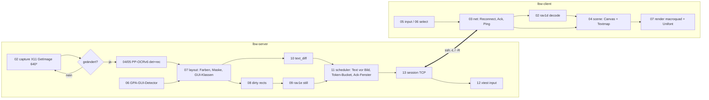

# Implementierungsplan: Low-Bandwidth-Remote-Desktop (Rust, 6 kB/s)

Ziel: Ein Rust-Server nimmt einen 640×640-Ausschnitt eines X11-Bildschirms
auf, trennt Text (PP-OCRv6) von Bildinhalten (GPA-GUI-Detector), überträgt
Text als Vektordaten und den Rest als AV1-Still-Picture-Kacheln über eine
6-kB/s-TCP-Verbindung (SSH-Tunnel). Ein kleiner Macroquad-Client setzt das
Bild wieder zusammen (Text in GNU Unifont) und schickt Maus/Tastatur zurück.

Arbeitsverzeichnis: `examples/29_lowbandwidth/source6/`
(im Prompt stand `25../source6`; `25_dnb` ist ein anderes Projekt, gemeint
ist dieser Ordner). Abhängigkeiten: [`source6/deps.md`](../../source6/deps.md).
Tasks: [`task.md`](task.md).

---

## 1. Anforderungs-Review: Lücken und Ergänzungen

Die Anforderungen aus `prompt.txt` und `review01.md` sind vollständig
übernommen. Zusätzlich fehlen bzw. werden präzisiert:

| # | Lücke | Vorschlag (umgesetzt, falls nicht anders markiert) |
|---|---|---|
| 1 | **Bufferbloat**: Ein Token-Bucket allein reicht nicht; ist die echte Leitung langsamer als 6 kB/s, füllen sich TCP-/SSH-Puffer und Text wartet Sekunden. | App-Level-Flusskontrolle: Client quittiert empfangene Bytes (`Ack{rx_bytes}`), Server hält `gesendet − quittiert ≤ Fenster` (≈ 1 s × Rate). |
| 2 | **Text-Priorität braucht Chunking**: Eine 5-kB-Kachel blockiert die Leitung ~1 s. | Kacheln in ≤ 512-Byte-`TileData`-Stücke teilen; Text überholt zwischen zwei Stücken (max. ~85 ms Wartezeit). |
| 3 | **Adaptive Bildrate** konkret | Neue Bildkacheln werden erst kodiert, wenn der Bild-Backlog leer ist. OCR läuft weiter (Text bleibt aktuell). Ohne Client: gar keine Verarbeitung. |
| 4 | **Text-Deltas** statt Vollbild-Text | Textelemente bekommen IDs; gesendet wird nur `remove[]`/`add[]`. Tippen kostet ~30 Byte. |
| 5 | **Rekonstruktion vor Bildankunft** | Jedes Textelement trägt `fg`+`bg`; der Client malt `bg` unter den Text → Text ist lesbar, bevor das AV1-Bild da ist. |
| 6 | **TCP-Keepalive ist über `ssh -L` wirkungslos** (Socket endet auf localhost). | App-Heartbeat `Ping/Pong` alle 5 s; Client wartet bis 90 s ohne Daten (> 60 s-Anforderung), danach Reconnect mit `Hello{server_id, seq}`; SSH mit `ServerAliveInterval`. |
| 7 | **Sicherheit** | Server bindet default auf `127.0.0.1` (kein Auth im Protokoll → nur via SSH erreichbar). Warnung bei anderer Adresse. |
| 8 | **Mauszeiger** fehlt in X11-`GetImage`. | Client zeigt lokalen Zeiger (keine Bandbreite). |
| 9 | **Maus-Bandbreite** upstream | Mausbewegung max. 30 Hz, nur bei Änderung (7 Byte/Event). |
| 10 | **Tastatur-Semantik** | Druckbare Zeichen als `Char` (Layout-unabhängig, Server mappt Keysym→Keycode, bindet fehlende Keysyms temporär), Sondertasten/Ctrl-Kombis als `Key{keysym, mods}`. |
| 11 | **Copy/Paste** (nice to have) | Mit miniquad-Clipboard ohne neue Dependency: `F2` = Auswahlrechteck → Texte ins Clipboard; `F3` = Clipboard als Tipp-Text senden. |
| 12 | **Modelle nicht im Git** | Laufzeitpfade per CLI, `scripts/fetch_models.sh` (kopiert/holt). GUI-Detektor optional (`--gui none`). |
| 13 | **Tests ohne X11/Modelle** | `FrameSource`-Trait (X11 oder synthetisch), Drosselungs-Proxy `lbw-throttle` (Rate, Latenz, Blackout, Abriss). |
| 14 | Nicht im MVP (Vorschläge) | Qualitäts-Nachschärfen statischer Bereiche, Scroll-Erkennung (Bildverschiebung statt Neukodierung), Fenster > 640², Tastenwiederholung/Halten, Audio, Mehrbenutzer. |

## 2. Architektur



### 2.1 Protokoll (`lbw-common`, nur `std`)

Frame: `[u16 LE Länge][u8 Typ][Payload]`, Zahlen little-endian, Strings
`u16`-Länge + UTF-8.

Server → Client:
- `Hello{server_id:u64, w:u16, h:u16, resumed:bool}`
- `Text{seq:u32, remove:[u32], add:[TextItem{id,x,y,w,h,fg,bg,text}]}`
- `TileStart{tile_id, seq, x,y,w,h, len:u32}` + `TileData{tile_id, offset, bytes}`
- `Ping{t}`/`Pong{t}`, `Stats{rate, backlog, fps}` (HUD)

Client → Server:
- `Hello{version, server_id, seq}` (Resume)
- `Input(MouseMove|Button|Wheel|Key{keysym,mods}|Char|Text(String))`
- `Ack{rx_bytes:u64, seq:u32}`, `Ping`/`Pong`

### 2.2 Server-Pipeline

1. **Capture** (`x11rb` `GetImage`, BGRA → RGB), Vergleich per `memcmp`
   mit dem letzten Frame; Poll alle 100 ms (0,2 ms Kosten).
2. **OCR**: DBNet-Boxen + CTC-Erkennung (Code aus `26_onnx/source5`).
3. **Farben**: `bg` = häufigste (quantisierte) Randfarbe der Box,
   `fg` = Mittel der Pixel mit größter Distanz zu `bg`.
4. **Maske**: Textboxen mit `bg` füllen → AV1 sieht keine Textkanten.
5. **GUI-Detektor** (YOLO11, `gpa_640_int8.onnx`, Code aus `source8`):
   Box mit Textabdeckung ≥ 60 % = Text-Element (kein Bild); sonst
   Icon/Bild → eigene Kachel mit besserem Quantizer.
6. **Dirty-Rects**: 32×32-Blockraster, geänderte Blöcke → Komponenten →
   max. 4 Rechtecke (gerade Kanten, ≥ 16 px).
7. **AV1**: je Rechteck ein rav1e-Still-Picture (Speed 10, q 180 Hinter-
   grund / q 110 Icons), rohe OBUs.
8. **Scheduler**: Kontrolle > Text > Bild-Stücke; Token-Bucket (6000 B/s,
   Burst 1 KB) und Ack-Fenster.

### 2.3 Client

Netz-Thread (blockierendes `std::net`, Reconnect mit Backoff 0,5→5 s,
dekodiert AV1 mit rav1d) → `mpsc` → Macroquad-Loop (Canvas-Textur 640²,
Text mit Unifont, `font_scale_aspect` passt Breite an die Box an).

## 3. Kontext für den ausführenden Agenten (Dateien)

| Datei | Warum lesen |
|---|---|
| `plan/20260929_01_lowbandwidth/prompt.txt` | Originalanforderungen, Regeln (Dateiaufteilung, Commits, Walkthrough). |
| `plan/20260929_01_lowbandwidth/review01.md` | Review mit Pipeline-, Protokoll- und Robustheitsvorschlägen. |
| `26_onnx/source5/src/03_detect.rs` | DBNet-Postprocessing (BFS, Unclip) — Vorlage für `04_ocr_detect.rs`. |
| `26_onnx/source5/src/04_recognize.rs` | CTC-Decoder, Wörterbuch-Parser, Crop-Resize — Vorlage für `05_ocr_recognize.rs`. |
| `26_onnx/source5/src/02_capture.rs` | X11-Capture, Normalisierung (ImageNet-Mittelwerte). |
| `26_onnx/source5/scripts/fetch_assets.sh` | Download-URLs + SHA256 der PP-OCRv6-Modelle, Unifont-Pfade. |
| `26_onnx/source5/scripts/smoke_xvfb.sh` | Muster für Xvfb-Smoke-Tests (xterm, xdotool, Software-GL). |
| `26_onnx/source8/src/04_session.rs` | ort-Session mit Threads/Optimierung, Input-Geometrie. |
| `26_onnx/source8/src/05_decode.rs` | YOLO-Decode + NMS — übernehmen. |
| `26_onnx/source8/src/06_detector.rs` | Ablauf Letterbox→Inferenz→Decode (bei 640² ist Letterbox Identität). |
| `26_onnx/source8/bench.md` | Laufzeiten (640² int8 ≈ 70 ms @ 8 Threads). |
| `20_webprox_avif/cloud-render-srv/src/encoder/rav1e_enc.rs` | rav1e-Konfiguration (still_picture, low_latency). |
| `20_webprox_avif/macroquad-client/src/video/decoder.rs` | Beispiel YUV→RGBA im Client (hier durch rav1d ersetzt). |
| `20_webprox_avif/11_latency_rav1e_settings.md` | Learnings zu rav1e-Latenz. |
| `source6/deps.md` | Alle Abhängigkeiten mit `org/projekt` für DeepWiki. |

## 4. Usage-Beispiele der Abhängigkeiten (per DeepWiki geprüft)

rav1e (Still Picture):
```rust
let mut enc = EncoderConfig::with_speed_preset(10);
enc.width = w; enc.height = h; enc.still_picture = true; enc.quantizer = 180;
let mut ctx: Context<u8> = Config::new().with_encoder_config(enc).new_context()?;
let mut f = ctx.new_frame();
f.planes[0].copy_from_raw_u8(&y, w, 1); /* u, v analog */
ctx.send_frame(f)?; ctx.flush();
while let Ok(p) = ctx.receive_packet() { out.extend(p.data); }
```

rav1d (dav1d-API in Rust, `unsafe`):
```rust
dav1d_default_settings(NonNull::new(s.as_mut_ptr()).unwrap());
dav1d_open(Some(NonNull::from(&mut ctx)), Some(NonNull::from(&mut s)));
let p = dav1d_data_create(Some(NonNull::from(&mut data)), obu.len()); // + memcpy
dav1d_send_data(ctx, Some(NonNull::from(&mut data)));
dav1d_get_picture(ctx, Some(NonNull::from(&mut pic)));   // pic.data[0..3], pic.stride
dav1d_picture_unref(...); dav1d_data_unref(...); dav1d_close(...);
```

x11rb + XTEST:
```rust
use x11rb::protocol::xtest::ConnectionExt as _;
conn.xtest_fake_input(xproto::MOTION_NOTIFY_EVENT, 0, 0, root, x, y, 0)?;
conn.xtest_fake_input(xproto::BUTTON_PRESS_EVENT, 1, 0, root, 0, 0, 0)?;
let map = conn.get_keyboard_mapping(min_kc, max_kc - min_kc + 1)?.reply()?;
conn.change_keyboard_mapping(1, spare_kc, 1, &[keysym])?; // fehlendes Keysym binden
```

ort (ONNX Runtime):
```rust
let s = Session::builder()?.with_intra_threads(8)?.commit_from_file(path)?;
let out = s.run(ort::inputs![name => TensorRef::from_array_view(([1,3,640,640], &buf[..]))?])?;
let (shape, data) = out[0].try_extract_tensor::<f32>()?;
```

macroquad:
```rust
let font = load_ttf_font_from_bytes(&std::fs::read(UNIFONT)?)?;
let d = measure_text(txt, Some(&font), size, 1.0);
draw_text_ex(txt, x, y, TextParams { font: Some(&font), font_size: size,
    font_scale_aspect: box_w / d.width, color, ..Default::default() });
while let Some(c) = get_char_pressed() { /* Char */ }
miniquad::window::clipboard_set(&s); let s = miniquad::window::clipboard_get();
tex.update(&image);
```

## 5. Dateiaufteilung (verbindlich)

Nummer + Name, Reihenfolge = Datenfluss; `lib.rs`/`main.rs` nur
Modul-Deklarationen und Verdrahtung; Dateien < ~300 Zeilen.

```
source6/
  common/src/  01_types.rs 02_codec.rs 03_frame.rs 04_keys.rs 05_yuv.rs 06_rate.rs lib.rs
  server/src/  01_config.rs 02_capture.rs 03_image.rs 04_ocr_detect.rs 05_ocr_recognize.rs
               06_gui_detect.rs 07_layout.rs 08_dirty.rs 09_av1.rs 10_text_diff.rs
               11_scheduler.rs 12_input.rs 13_session.rs 14_pipeline.rs lib.rs main.rs
  server/tests/ av1_roundtrip.rs loopback.rs
  client/src/  01_config.rs 02_av1.rs 03_net.rs 04_scene.rs 05_input.rs 06_select.rs
               07_render.rs 08_app.rs lib.rs main.rs
  throttle/src/ 01_config.rs 02_pipe.rs main.rs
  scripts/     fetch_models.sh smoke_xvfb.sh ssh_tunnel.sh
```

## 6. Werkzeuge und Qualität

- Rust 2024 (`edition = "2024"`, rustc ≥ 1.98), `cargo fmt`, `cargo clippy
  --all-targets -- -D warnings`, `cargo upgrade --incompatible` bei neuen
  Dependencies (neueste Version erzwingen).
- Tests: `cargo test --workspace` (Unit + Integration ohne X11), E2E über
  `scripts/smoke_xvfb.sh` (zwei Xvfb-Displays, echte Modelle, Drossel 6 kB/s).

## 7. Commit-Regeln

Conventional Commits, Autor Wol Pumba `<wolpumba@gmail.com>`, jede
Nachricht mit Titel (≤ 72 Zeichen, `typ(scope): was`) und ausführlichem
Body (Warum, Was, wie getestet). Typen: `feat`, `fix`, `test`, `docs`,
`refactor`, `build`, `chore`. Scopes: `common`, `server`, `client`,
`throttle`, `plan`, `scripts`. Ein Commit pro abgeschlossenem Task mit
grünen Tests. Beispiel:

```
feat(server): add priority scheduler with token bucket and ack window

Text messages always overtake queued image chunks; image tiles are split
into 512-byte TileData frames. A token bucket caps the send rate
(default 6000 B/s) and an ack-based in-flight window prevents
bufferbloat in SSH/TCP buffers when the real link is slower.

Tested: cargo test -p lbw-server scheduler (6 unit tests).
```

## 8. Walkthrough-Regeln (für `walkthrough.md` nach Abschluss)

- **Sprache und Stil:** zwingend Deutsch, didaktisch, flüssig lesbar.
- **Erklärungen:** Fachbegriffe kurz und verständlich erklären.
- **Visualisierung:** reichlich Code-Beispiele und Mermaid-Diagramme
  (Architektur, Datenfluss, komplexe Konzepte).
- **Struktur:** 1. Was exakt implementiert wurde. 2. Welche Architektur-
  Entscheidungen aufgrund von Tests geändert werden mussten. 3. Learnings
  und mögliche Erweiterungen. 4. Liste neuer Programme/Pakete fürs
  Dockerfile.
