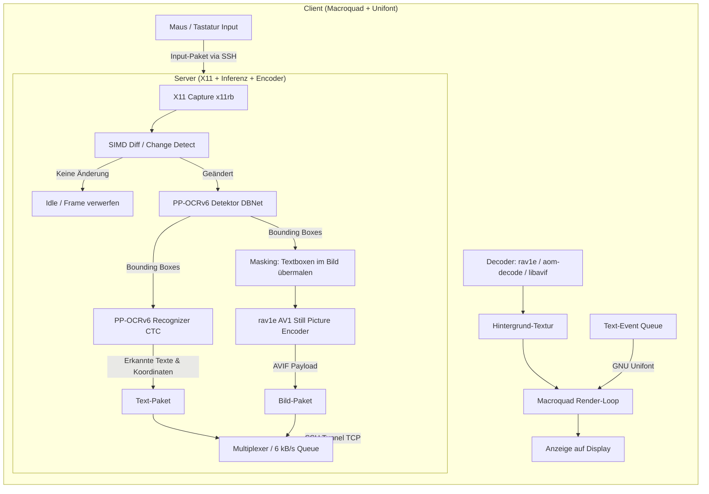

Die Aufgabenstellung enthält bereits eine sehr klare Vision und gute technische Randbedingungen (6 kB/s Bandbreite, Macroquad, Unifont, `rav1e` AV1/AVIF, SSH-Tunnel). Allerdings gibt es noch einige **architektonische Lücken und unpräzise Spezifikationen**, die vor der Implementierung geklärt werden müssen.

Nachfolgend findest du die Analyse der Spezifikation, Vorschläge zur Schließung der Lücken sowie eine konkrete Empfehlung für das ONNX-Modell und die Bild-/Text-Trennungs-Pipeline.

---

### Teil 1: Ist die Aufgabe gut spezifiziert? (Lücken & Vorschläge)

Die Kernanforderungen sind verständlich, aber folgende Aspekte sind noch unter- bzw. nicht spezifiziert:

#### 1. Text-/Bild-Trennung und Rekonstruktion (Konzeptschärfung)
* **Status im Prompt:** *"Bilddaten und Textdaten sollen durch ein Neuronales Netz getrennt werden (weil Text wichtiger ist). Auf der Client Seite sollen die Bilder und Text ungefaehr wieder so zusammengesetzt werden, wie sie im screenshot waren. Der Text soll mit gnu unifont gerendert werden."*
* **Lücke:**
  1. Reines Segmentieren (z. B. „hier ist Text“) reicht **nicht** aus, wenn der Client den Text mit GNU Unifont rendern soll. Der Server muss zwingend ein **vollständiges OCR** durchführen (Detektion der Bounding Box *und* Erkennung der Zeichenkette).
  2. Was passiert mit dem Hintergrund unter dem Text? Wenn AV1 das gesamte Bild unverändert kodiert, kodiert es den Text doppelt (einmal pixelig/verschwommen via AV1 und einmal scharf via Unifont darübergelegt).
* **Vorschlag:**
  * **Text-Masking (Inpainting/Solid Fill):** Sobald das NN Textboxen erkennt und deren Text extrahiert, übermalt der Server diese Bounding Boxes im AV1-Frame mit der lokalen Hintergrundfarbe.
  * **Vorteil:** AV1 verschwendet keine Bits an scharfe Textkanten (hohe Frequenzen), was die Dateigröße massiv senkt. Der Client zeichnet das AV1-Hintergrundbild und platziert die Unifont-Glyphen exakt darüber.
  * **Farb- & Schriftgrößenextraktion:** Das NN liefert Box + String. Der Server sollte zusätzlich mit 2–3 Zeilen Code die dominante Textfarbe (Vordergrund) und Hintergrundfarbe sampeln, damit der Client nicht alles einfarbig weiß rendern muss.

#### 2. Das 6-kB/s-Bandbreitenbudget vs. AV1-Framerate
* **Status im Prompt:** Geringe Latenz bei 6 kB/s (~48 kbit/s).
* **Lücke:**
  * Selbst ein stark komprimierter AV1-Still-Frame (z. B. 640×480 bei Quantizer 220–240) benötigt ca. **2 bis 6 Kilobytes**.
  * Bei einer Bandbreite von 6 kB/s kann also maximal **1 AV1-Bild alle 1 bis 1,5 Sekunden** übertragen werden!
* **Vorschlag:**
  * **Zwei-Kanal-Priorisierung:**
    1. **Text-Stream (High Priority):** Textänderungen (z. B. im Terminal tippen) benötigen nur ca. 20–100 Bytes pro Zeile. Diese werden **sofort** ohne Drosselung gesendet. Das sorgt für < 50 ms Reaktionsgefühl beim Tippen.
    2. **Bild-Stream (Low Priority / Rate-Limited):** AV1-Hintergrundframes werden nur bei echten Grafikänderungen (Wallpaper, Icons, Browser-Bilder) und mit maximal 1 Frame pro 1–2 Sekunden gesendet oder gekachelt (nur geänderte Sub-Regionen als AVIF).

#### 3. Client-Dependencies vs. Protokollwahl (Tonic/gRPC vermeiden)
* **Status im Prompt:** *"Besonders die Client Binary soll moeglichst klein sein, d.h. ich moechte moeglichst wenige Rust Dependencies hineinziehen. Deshalb wuerde ich Macroquad favorisieren."* Im Referenzcode (`20_webprox_avif`) wurde jedoch `tonic` (gRPC / Prost) verwendet.
* **Lücke:** `tonic` zieht `tokio`, `prost`, `h2`, `hyper`, `tower` usw. hinein. Die Binary wird groß und kompiliert langsam.
* **Vorschlag:**
  * Da die Verbindung ohnehin durch einen **SSH-Tunnel** (`ssh -L` / `ssh -R`) geleitet wird (Port-Forwarding erledigt Verschlüsselung und NAT-Traversal), sollte **kein gRPC** verwendet werden.
  * Empfehlung: Ein schlankes, maßgeschneidertes Binärprotokoll über Standard-TCP (`std::net::TcpStream` oder minimale Framed-Sockets).
  * Paketformat:
    * `Packet::Text { x, y, size, fg_color, text }`
    * `Packet::ImageTile { x, y, w, h, av1_payload }`
    * `Packet::Input { kind }` (Client $\to$ Server)
  * Das hält den Macroquad-Client extrem klein (< 10 MB statt 30–50 MB) und frei von komplexen HTTP/2-Stacks.

#### 4. Remote Input Injection im Server
* **Status im Prompt:** Der Client sendet Tasten und Klicks.
* **Lücke:** Wie speist der Server die Events in X11 ein?
* **Vorschlag:** Da der Server bereits `x11rb` für den Screen-Capture verwendet, sollte für Maus und Tastatur die X11-Erweiterung **`x11rb::protocol::xtest`** (`xtest::fake_input`) genutzt werden. Damit sind **keine externen C-Tools** (wie `xdotool`) oder zusätzlichen Crates nötig.

#### 5. Mosh-ähnliche Robustheit über TCP/SSH
* **Status im Prompt:** *"wie mosh auch nach 60s ohne packet nicht zusammenbrechen"*.
* **Vorschlag:**
  * Mosh setzt auf UDP mit State-Synchronisation. Über einen SSH-Tunnel läuft jedoch TCP.
  * Um Hänger zu vermeiden:
    1. TCP-Keepalive im Socket aktivieren.
    2. Client implementiert eine automatische Reconnect-Schleife mit Frame-Acks / Sequenznummern: Nach einem Tunnel-Abbruch verbindet sich der Client neu, sendet seine letzte empfangene Text-/Bild-Versionsnummer, und der Server schickt sofort einen vollständigen Keyframe-Refresh.

---

### Teil 2: Welches ONNX-Modell für die Text-/Bild-Trennung?

Für das gegebene Setup (X11-Desktop, CPU-Inferenz via `ort`, minimaler Footprint, Textausgabe für GNU Unifont) ist die beste Wahl:

#### Empfehlung: **PP-OCRv6 (DBNet Detektor + SVTR Recognizer)**
Dies ist exakt die Modell-Kombination, die du bereits in `/workspace/src/cl-rust-generator/examples/26_onnx/source5/` vorliegen hast:
1. **`PP-OCRv6_small_det.onnx`** (DBNet-Detektionsmodell, ~2.5 MB)
2. **`PP-OCRv6_small_rec.onnx`** (SVTR/CTC-Erkennungsmodell, ~4 MB)

#### Warum genau dieses Modell?

1. **Bereits integriert und CPU-tauglich:**
   * In `source5/src/03_detect.rs` und `04_recognize.rs` ist die Vor- und Nachverarbeitung (DBNet-Polygon-Unclipping, Binarisierung, CTC-Greedy-Decoder) bereits fertig implementiert und optimiert.
   * `PP-OCRv6 small` benötigt auf moderner x86_64-CPU nur ~15–30 ms für Detektion und ~5 ms pro Textzeile.

2. **Wie damit die Bildbereiche ermittelt werden (Die Trennung):**
   * **Text-Regionen:** Alle Bereiche, für die `DBNet` Pixelwahrscheinlichkeiten $> 0.3$ liefert und zu Boxen clustert. Diese werden OCR-analysiert und als formatierter Text übertragen.
   * **AV1-Bild-Regionen:**
     * **Strategie A (Text-Masked Fullframe):** Man nimmt den geänderten Bildausschnitt und füllt alle detektierten Text-Rechtecke mit dem Median ihrer Randpixel. Der verbleibende Frame enthält nur noch Hintergründe, Fensterrahmen, Symbole oder Grafiken. Er wird an `rav1e` übergeben (`still_picture = true`, hohe Quantisierung).
     * **Strategie B (Non-Text Bounding Box Slicing):** Flächen, die nach Abzug der Textboxen signifikante Bildentropie (Fotos, Icons) aufweisen, werden als separate Bounding Boxes ausgeschnitten und einzeln als kleine AVIF-Tiles übertragen. Für einfache GUIs (z. B. Terminal oder Code-Editor) fällt dadurch das AV1-Datenvolumen oft auf **0 Bytes**, da der gesamte Inhalt als reiner Text übertragen werden kann!

3. **Vergleich mit Alternativen:**
   * *DocLayNet / YOLOv8-Document Layout:* Unterscheidet zwar zwischen `Picture` und `Text`, erkennt aber den Text selbst nicht (benötigt danach ohnehin ein OCR-Modell) und ist mit 20–80 MB viel schwergewichtiger.
   * *Tesseract:* Zu langsam für kontinuierliche interaktive Bildschirminferenz; kein moderner ONNX-Runtime-Support.
   * *PP-OCRv6:* Vereint minimale Modellgröße (< 7 MB gesamt), extrem hohe Erkennungsrate bei UI-Schriften und liegt bereits im Repository bereit.

---

### Zusammenfassung der Empfehlung für den nächsten Schritt

Bevor der eigentliche Implementierungsplan (`task.md` und Code) erstellt wird, sollten wir folgende Architektur-Präzisierungen festhalten:
1. **Pipeline:** Server nutzt `PP-OCRv6` Detektion + Erkennung $\to$ Text als Vektordaten (Text + Box + Farbe) $\to$ Textstellen im Bitmap maskieren $\to$ verbleibendes Bitmap via `rav1e` (AVIF) kodieren.
2. **Netzwerk:** Schlankes Binär-Framing über Standard-TCP (kompatibel mit `ssh -L` / `ssh -R`), kein schweres Tonic/gRPC, um Macroquad klein zu halten.
3. **Input:** `x11rb::protocol::xtest` auf Server-Seite für Klicks und Keys.
4. **Bandbreite:** Text-Prioritäts-Queue (Text hat absolute Priorität vor AV1-Bildkacheln, um unter den 6 kB/s zu bleiben).
