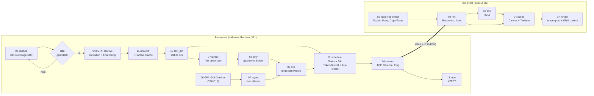
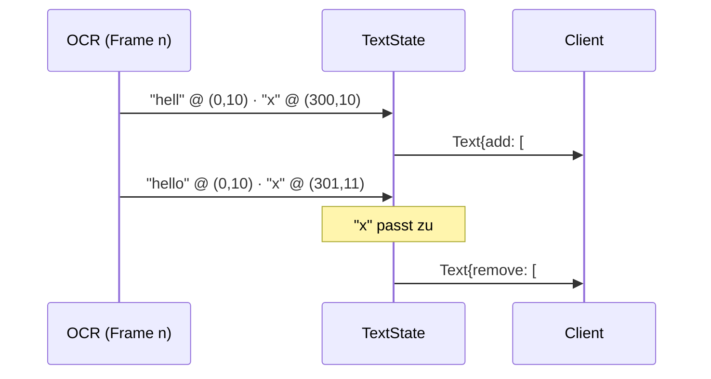
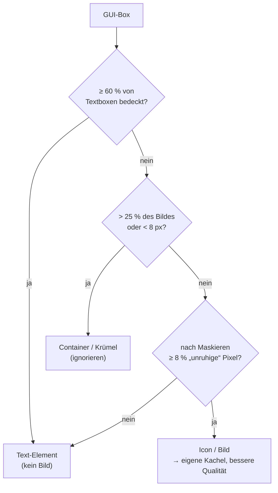
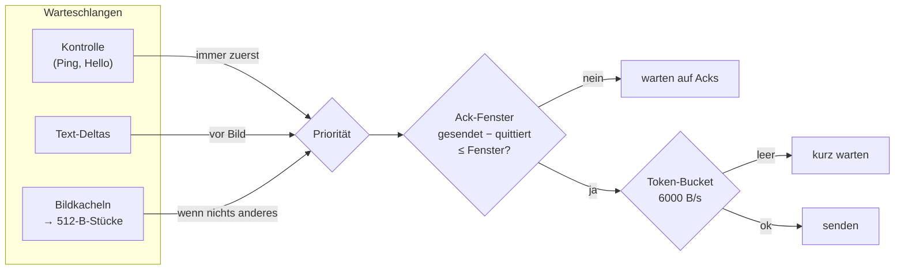
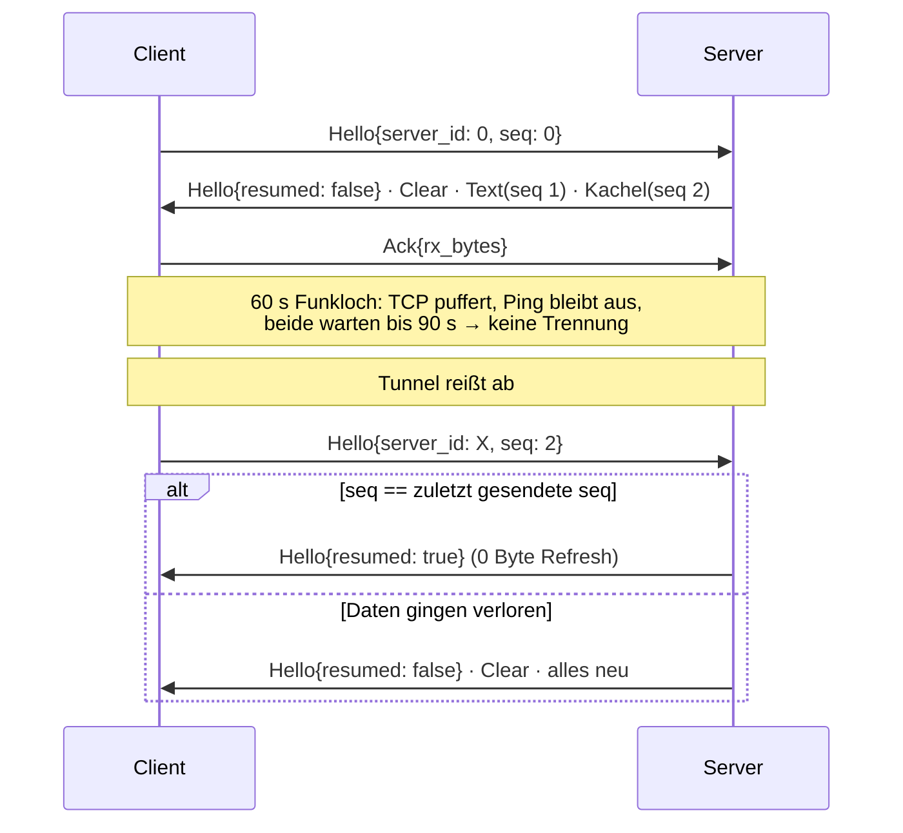
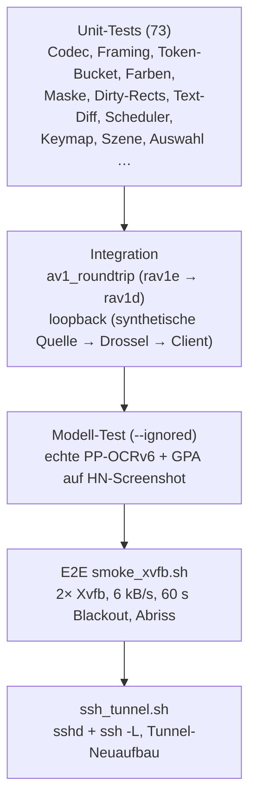

# Walkthrough: Ein Remote-Desktop für 6 kB/s

Dieses Dokument erklärt, was in `examples/29_lowbandwidth/source6` gebaut
wurde, warum es so gebaut wurde und was wir unterwegs gelernt haben. Es
richtet sich an Leserinnen und Leser, die den Code verstehen oder
weiterentwickeln wollen, ohne jede Datei selbst durchzuarbeiten.

Zur Einordnung vorab eine Zahl: **6 kB/s** sind etwa so viel, wie ein
Modem Ende der 1990er schaffte. Ein einziger unkomprimierter Screenshot
mit 640×640 Pixeln (1,2 MB) bräuchte über drei Minuten. Ein gewöhnliches
JPEG dieses Bildes immer noch 10–20 Sekunden. Unser Ziel war, darüber
trotzdem Webseiten und Terminals *flüssig bedienbar* zu machen.

---

## 1. Was exakt implementiert wurde

### 1.1 Die Grundidee in einem Satz

> Text wird **nicht als Bild**, sondern als **Zeichenkette mit Position und
> Farbe** übertragen; nur was danach noch übrig bleibt (Hintergründe,
> Icons, Fotos), geht als stark komprimiertes AV1-Bild über die Leitung.

Warum das so gut funktioniert, zeigt eine Messung an einem echten
Screenshot (Hacker-News-Startseite, 640×640 Pixel):

| Variante | Bytes |
|---|---:|
| ganzer Ausschnitt als AV1-Bild | 37 610 |
| derselbe Ausschnitt, Text übermalt („maskiert“), als AV1 | **1 966** |
| alle 37 Textzeilen als Vektordaten | 2 606 |

Das Übermalen des Textes spart **95 %** der Bilddaten. Der Grund: Scharfe
Buchstabenkanten sind für Bildkompressoren „hohe Frequenzen“ — genau das
Teuerste, was es zu kodieren gibt. Ohne Text bleibt eine fast glatte
Fläche, die AV1 mit wenigen hundert Bytes beschreibt.

### 1.2 Die Architektur im Überblick



Der Code liegt in vier Crates (Rust-Pakete) eines Workspaces:

| Crate | Aufgabe | Abhängigkeiten |
|---|---|---|
| `lbw-common` | Protokoll, Framing, Tastencodes, Farbraum, Ratenbegrenzer | **keine** (nur `std`) |
| `lbw-server` | Capture, KI-Modelle, AV1-Encoder, Versand, Eingabe | `ort`, `rav1e`, `x11rb` |
| `lbw-client` | Empfang, AV1-Decoder, Darstellung, Eingabe | `macroquad`, `rav1d` |
| `lbw-throttle` | Test-Proxy, der eine schlechte Leitung simuliert | nur `lbw-common` |

Jede Quelldatei hat eine zweistellige Nummer in Datenfluss-Reihenfolge
(`01_config.rs` … `15_pipeline.rs`); `lib.rs` und `main.rs` enthalten nur
Moduldeklarationen und Verdrahtung.

### 1.3 Der Server Schritt für Schritt

**Capture und Änderungserkennung.** Alle 100 ms holt der Server per
`GetImage` einen 640×640-Ausschnitt vom X-Server. Ob sich etwas geändert
hat, entscheidet ein simpler Byte-Vergleich (`memcmp`, ~0,2 ms). Hat sich
nichts geändert, passiert nichts — kein OCR, kein Encoder. Ist kein Client
verbunden, ruht die Pipeline komplett.

**OCR (Texterkennung).** Zwei neuronale Netze aus der PaddleOCR-Familie
(PP-OCRv6) übernehmen:

- *DBNet* (Detektion) liefert eine Wahrscheinlichkeitskarte „hier ist
  Text“; zusammenhängende Pixel werden zu Rechtecken (Bounding Boxes).
- *SVTR* mit *CTC*-Dekodierung (Erkennung) liest aus jedem Rechteck die
  Zeichenkette. CTC („Connectionist Temporal Classification“) heißt: das
  Netz gibt je Spalte eine Zeichen-Wahrscheinlichkeit aus, Wiederholungen
  und „Leerzeichen-Symbole“ werden anschließend zusammengefasst.

Neu gegenüber dem Proof of Concept aus `26_onnx/source5` ist eine
**Konfidenz** pro Zeile: Unsichere Treffer (etwa „Text“ in einem Foto)
werden verworfen und bleiben Bildinhalt. Und ein **Erkennungs-Cache**:
Zeilen, deren Box und Pixel sich nicht geändert haben, werden nicht erneut
erkannt.

```rust
// server/src/11_analyze.rs — unveränderte Zeile → alter Text
let key = (r, crop_hash(img, r));
let (text, conf) = match self.cache.get(&key) {
    Some(v) => v.clone(),
    None => { let (t, c) = self.rec.recognize(img, r)?; (t.trim().to_owned(), c) }
};
```

Beim Tippen in einem Terminal ändert sich meist nur eine Zeile; die
Erkennung sinkt dadurch von 467 ms (37 Zeilen) auf unter 1 ms plus die
eine geänderte Zeile.

**Farben.** Für jede Textbox wird die Hintergrundfarbe (`bg`, häufigste
Randfarbe) und die Schriftfarbe (`fg`, Mittel der Pixel, die sich am
stärksten vom Hintergrund unterscheiden) bestimmt — „zwei, drei Zeilen
Code“, wie im Prompt gewünscht, in `07_layout.rs::sample_colors`.

**Text-Delta mit stabilen IDs.** Der Server sendet nicht jedes Mal alle
Zeilen, sondern nur Änderungen. `10_text_diff.rs` ordnet neu erkannte
Zeilen alten zu, wenn Text gleich, Farbe ähnlich und die Box höchstens
3 px verschoben ist:



Eine getippte Zeile kostet so rund 40–50 Byte. Wichtiges Detail: Bei
einem Treffer behält der Server die **alte** Box. Dadurch bleibt die
Maske im Bild pixelgleich, und das Zittern der Detektion erzeugt keine
unnötigen Bildkacheln.

**Maskieren und GUI-Detektion.** Alle Textboxen werden mit ihrer
Hintergrundfarbe übermalt (plus 2 px Rand, siehe Abschnitt 2). Dann sucht
der GPA-GUI-Detektor (YOLO11, aus `26_onnx/source8`) alle bedienbaren
GUI-Elemente. Wie im Prompt vermutet, findet er auch Buttons mit reinem
Text. Die Einteilung:



Auf der HN-Seite bleiben von 19 GUI-Boxen genau die 3 echten Icons übrig
(Tab-Symbol, Zurück, Neu laden).

**Geänderte Bereiche (Dirty-Rects).** `08_dirty.rs` vergleicht das
maskierte Bild mit dem, was der Client bereits hat, in 16×16-Blöcken.
Geänderte Blöcke werden zu Gruppen zusammengefasst und zu höchstens vier
Rechtecken zusammengelegt. Zusammenlegen lohnt sich, weil jede AV1-Kachel
~100 Byte Kopfdaten kostet: Liegen zwei Änderungen nahe beieinander, ist
eine gemeinsame Kachel billiger als zwei.

**AV1-Kodierung.** Jedes Rechteck wird ein eigenständiges AV1-Bild im
*Still-Picture*-Modus — das ist genau der Inhalt einer AVIF-Datei, nur
ohne deren Container (spart ~300 Byte je Kachel, weil wir beide Enden
kontrollieren):

```rust
// server/src/09_av1.rs
let mut enc = EncoderConfig::with_speed_preset(10); // schnellste Stufe
enc.width = w; enc.height = h;
enc.still_picture = true;          // Intra-only, unabhängig dekodierbar
enc.pixel_range = PixelRange::Full;
enc.quantizer = 180;               // Hintergrund; Icons: 110 (schärfer)
let mut ctx: Context<u8> = Config::new().with_encoder_config(enc).new_context()?;
```

*Quantizer* bestimmt, wie grob gerundet wird (0 = verlustfrei, 255 =
Brei). Hintergrund darf grob sein, Icons bekommen mehr Qualität.

### 1.4 Die Leitung: Priorität, Drosselung, Flusskontrolle

Das Protokoll ist ein kleines, handgeschriebenes Binärformat über TCP
(kein gRPC, kein serde): `[u16 Länge][u8 Typ][Nutzdaten]`, alles
little-endian.

| Nachricht | Richtung | Inhalt |
|---|---|---|
| `Hello` | beide | Version bzw. Server-ID, Größe, Resume-Status |
| `Text` | S→C | Sequenznummer, zu entfernende IDs, neue Elemente |
| `TileStart` / `TileData` | S→C | AV1-Kachel, in ≤ 512-Byte-Stücken |
| `Clear` | S→C | „alles verwerfen, Voll-Refresh folgt“ |
| `Input` | C→S | Maus, Taste, Zeichen, eingefügter Text |
| `Ack` | C→S | bisher empfangene Bytes |
| `Ping`/`Pong`, `Stats` | beide | Lebenszeichen, RTT, HUD-Werte |

Der **Scheduler** (`12_scheduler.rs`) entscheidet, was als Nächstes auf
die Leitung darf. Drei Mechanismen greifen ineinander:



1. **Priorität mit Stückelung.** Eine 5-kB-Kachel würde die Leitung fast
   eine Sekunde blockieren. Deshalb wird sie in 512-Byte-Stücke zerlegt;
   zwischen zwei Stücken kann Text überholen. Im Loopback-Test kommt der
   Text einer neuen Seite nachweislich *vor* der ersten Kachel an.
2. **Token-Bucket.** Ein „Eimer“, der sich mit 6000 Byte/s füllt; jedes
   gesendete Byte nimmt ein Token heraus. So wird die Rate nie
   überschritten.
3. **Ack-Fenster gegen Bufferbloat.** *Bufferbloat* heißt: Wenn man
   schneller sendet, als die Leitung transportiert, sammeln sich die Daten
   in Puffern (Kernel, SSH). Dort stehen dann auch die eiligen Textpakete
   hinten an — Latenz von Sekunden. Der Client quittiert daher alle
   512 Byte, was er empfangen hat; der Server lässt höchstens ein
   „Fenster“ (≈ Rate × (minimale RTT + 200 ms), 2–6 kB) unquittiert. Ist
   die echte Leitung langsamer als 6 kB/s, bremst das Fenster automatisch.

**Adaptive Bildrate.** Die Pipeline kodiert neue Bildkacheln erst, wenn
der Bild-Backlog des Schedulers leer ist. OCR läuft dagegen bei jeder
Änderung weiter, weil Text Vorrang hat. Schafft die Leitung also nur
0,5 Bilder pro Sekunde, wird auch nur mit 0,5 fps kodiert — genau wie im
Prompt gewünscht:

```rust
// server/src/15_pipeline.rs
if self.pending_image && self.sh.outbox.with(|q| q.image_backlog()) == 0 {
    self.encode()?;     // GUI-Detektor + AV1 nur, wenn die Leitung frei ist
}
```

### 1.5 Robustheit wie bei mosh — aber über TCP/SSH

*mosh* synchronisiert über UDP einen Bildschirmzustand und überlebt so
Funklöcher. Wir laufen über einen SSH-Tunnel, also TCP. Die Umsetzung:



- **Heartbeat statt TCP-Keepalive.** Der Prompt schlug TCP-Keepalive vor.
  Hinter `ssh -L` endet der Socket aber auf *localhost* beim ssh-Prozess —
  diese Verbindung reißt nie ab, Keepalive merkt also nichts. Stattdessen
  schickt der Server alle 2 s ein `Ping`; beide Seiten tolerieren bis
  90 s Stille (> 60 s aus der Anforderung). Den WAN-Abschnitt überwacht
  SSH selbst (`ServerAliveInterval`).
- **Resume.** Jede Text- und Bildnachricht trägt eine Sequenznummer. Der
  Client merkt sich die der zuletzt *vollständig angewandten* Nachricht,
  der Server die der zuletzt *vollständig gesendeten*. Da TCP die
  Reihenfolge erhält, stimmen beide genau dann überein, wenn nichts
  verloren ging — dann entfällt der Refresh.
- **Ablösung.** Eine neue Verbindung ersetzt die alte sofort (typisch
  nach Tunnel-Neuaufbau).

### 1.6 Eingaben: vom Client in den X-Server

Der Client unterscheidet zwei Arten von Tasten:

- **Druckbare Zeichen** gehen als `Char('ä')`. Das ist unabhängig vom
  Tastaturlayout des Clients.
- **Sondertasten und Kombinationen** (Enter, Pfeile, Ctrl+C) gehen als
  `Key{keysym, mods}`. Ein *Keysym* ist der X11-Name einer Taste
  (z. B. `0xff0d` = Return).

Der Server übersetzt Keysyms mit der aktuellen Tastenbelegung in
*Keycodes* (physische Tastennummern) und drückt sie per **XTEST** — einer
X11-Erweiterung, mit der Programme Eingaben erzeugen dürfen. Fehlt ein
Zeichen in der Belegung (etwa `€` auf US-Layout), wird es wie bei
`xdotool` vorübergehend auf einen freien Keycode gelegt:

```rust
// server/src/13_input.rs
self.conn.change_keyboard_mapping(1, kc, 2, &[keysym, keysym])?;
self.conn.get_input_focus()?.reply()?;   // Rundreise: Belegung ist aktiv
self.conn.xtest_fake_input(KEY_PRESS_EVENT, kc, 0, self.root, 0, 0, 0)?;
```

Mausbewegungen werden auf 30 Hz gedrosselt (7 Byte je Ereignis),
Mausrad-Schritte als Tasten 4/5 gesendet.

### 1.7 Der Client

Der Client ist bewusst klein: **2,0 MB** (`cargo build --profile min`),
dynamisch nur gegen libc/libm/libgcc gelinkt; OpenGL lädt miniquad zur
Laufzeit. Zwei Abhängigkeiten: `macroquad` (ohne Default-Features) und
`rav1d`, ein AV1-Decoder in reinem Rust (Portierung von dav1d).

- **Netz-Thread** (`03_net.rs`): Verbinden mit Backoff 0,5 → 5 s, Kacheln
  zusammensetzen, mit rav1d dekodieren, Acks senden. So bleibt der
  Zeichen-Thread flüssig.
- **Szene** (`04_scene.rs`): ein RGBA-Canvas plus eine Liste von
  Textelementen — rein und ohne Grafik testbar.
- **Darstellung** (`07_render.rs`): Erst der Canvas, dann für jedes
  Textelement ein Rechteck in `bg` und darauf der Text in GNU Unifont,
  exakt in die Server-Box eingepasst. Weil `bg` mitgeliefert wird, ist
  Text **lesbar, bevor das Bild angekommen ist**.

```rust
// client/src/07_render.rs — Breite exakt auf die Box
let d = measure_text(&t.text, font, size, 1.0);
let aspect = ((f32::from(r.w) - 2.0) / d.width).clamp(0.4, 2.5);
draw_text_ex(&t.text, x, y, TextParams { font, font_size: size,
    font_scale_aspect: aspect, color: rgb(t.fg), ..Default::default() });
```

- **Copy & Paste** (Nice-to-have, ohne neue Abhängigkeit): Da Text als
  Zeichenkette ankommt, ist Kopieren trivial. `F2` → Rechteck ziehen →
  alle getroffenen Elemente in Lesereihenfolge in die Zwischenablage
  (`miniquad::window::clipboard_set`). `F3` tippt die Zwischenablage auf
  dem Server. `F1` blendet ein HUD mit Rate, Backlog und Status ein.

### 1.8 Wie getestet wurde



Der Test-Proxy `lbw-throttle` war dabei zentral: Er begrenzt die Rate,
verzögert, hält im *Blackout* alles an (die TCP-Verbindung bleibt offen —
wie ein Funkloch) und kann Verbindungen abreißen.

Ergebnisse des E2E-Laufs (alle sieben Prüfungen grün):

| Prüfung | Ergebnis |
|---|---|
| xterm-Text erreicht den Client | ✓ |
| Tippen im Client → XTEST → xterm → OCR → Client | ✓, ~0,1 s nach der letzten Taste |
| Mausbewegung im Client bewegt Zeiger auf dem Server | ✓ (200,150) |
| 60 s Blackout | keine Trennung, gestaute Eingaben kommen danach an |
| Verbindungsabriss | Reconnect mit Resume |
| Webseite (36 Zeilen + 3 Icons) | Text zuerst, 2,2 kB AV1 ~0,4 s später |
| Durchsatz | Spitze 4,3 kB/s < 6,5 kB/s (Rate + Burst) |

Der Smoke-Test legt Screenshots beider Seiten ab (`/tmp/lbw-smoke/`:
`server_page.png` = Original, `client_page.png` = Rekonstruktion aus
Unifont-Text und AV1-Hintergrund). Layout, Farben, die orange Leiste und
die Icons stimmen überein; die Schrift ist naturgemäß eine andere. Ein
Textelement aus dem Log:

```
Server: "Hacker News new | past | comments | ask | show | jobs | submit"
Client: Text-Element, fg (56,28,4) auf bg (255,102,0), Box 170,157 391×12
```

---

## 2. Architektur-Entscheidungen, die Tests erzwungen haben

| Was der Plan sagte | Was der Test zeigte | Was wir geändert haben |
|---|---|---|
| rav1d mit `asm`-Feature für Geschwindigkeit | Mit nur `bitdepth_8` fehlen beim Linken 16-bpc-Assemblersymbole (Debug-Build) | rav1d **ohne** `asm`, reines Rust. Für ein 640²-Intra-Bild pro Sekunde mehr als schnell genug; Client braucht kein `nasm`. |
| GUI-Box ist Icon, wenn Text < 60 % bedeckt | Auf der HN-Seite wurden die orange Kopfleiste und die „Chrome for Testing“-Leiste als Icons erkannt: Labels mit viel Innenabstand bedecken nur ~45 % | Zusätzlicher **Inhaltstest**: Nach dem Maskieren muss die Box noch ≥ 8 % „unruhige“ Pixel haben. 19 → 3 Icons, alle echt. |
| Erkennung jeder Zeile pro Frame | 37 Zeilen = 467 ms, also < 2 fps | **Cache** über (Box, Pixel-Hash): 0,8 ms für unveränderte Seiten. |
| Fenstergröße aus gemessener RTT | Die RTT unter Last enthält die eigene Warteschlange → größeres Fenster → mehr Warteschlange → Rückkopplung | Fenster aus der **minimalen** RTT, gedeckelt auf 1 s Daten. |
| Neue Verbindung setzt den Scheduler zurück | Der Writer-Thread der *alten* Verbindung konnte das `Hello` der neuen aus der Warteschlange nehmen und ins tote Socket schreiben | Scheduler kennt die **Verbindungsgeneration**; fremde Writer bekommen nichts. |
| `Clear` als Kontrollnachricht beim Reconnect | Kontrollnachrichten überholen Text; ein veraltetes Delta konnte *nach* `Clear` ankommen und verwaiste Textelemente hinterlassen | `Clear` läuft durch die **Text-Warteschlange** (Reihenfolge garantiert) mit Seq 0 = „Zustand gelöscht“. |
| Maske = exakte DBNet-Box | Im E2E-Screenshot sah man graue „Geister“ von Unterlängen (g, y) im AV1-Bild | Maske um **2 px** gepolstert. |
| Schriftgröße ≈ 0,8 × Boxhöhe | Unifont ist eine 16-px-Pixelschrift; 11 px oder 13 px wirkten verwaschen | Für übliche Zeilenhöhen (11–22 px) **fest 16 px**, Filter `Nearest`, Grundlinie gerundet. |
| Testbild aus Rauschen für den Loopback-Test | 116 kB je Kachel, 22 s Übertragung — kein realistischer Inhalt | UI-artiges Testbild (Verlauf + weiche „Fotos“), ~3–4 kB. |
| TCP-Keepalive (Prompt) | Hinter `ssh -L` wirkungslos (Socket endet auf localhost) | App-Heartbeat (Ping 2 s, 90 s Toleranz) + SSH-`ServerAliveInterval`. |
| SSH-Test mit Standard-Client | `/root/.ssh/config` im Container hat falsche Rechte, ssh bricht ab | Test nutzt `ssh -F /dev/null` (Benutzerkonfiguration unangetastet). |

---

## 3. Learnings und mögliche Erweiterungen

### Learnings

- **Das größte Einsparpotenzial liegt nicht im Codec, sondern in der
  Semantik.** Text als Text zu senden und aus dem Bild zu entfernen bringt
  Faktor 19; kein Quantizer-Tuning kommt da heran.
- **Latenz entsteht in Puffern, nicht auf der Leitung.** Ohne Ack-Fenster
  hätte der Token-Bucket allein bei einer langsameren echten Leitung
  sekundenlange Textverzögerungen erzeugt.
- **Zustandsvergleich über Sequenznummern ist einfach, wenn man „zuletzt
  vollständig“ vergleicht** — dank TCP-Reihenfolge braucht es keine
  komplizierten Ack-Bäume.
- **Tests gegen echte Daten finden andere Fehler als Unit-Tests.** Die
  Icon-Fehlklassifikation, Masken-Geister und unscharfe Schrift fielen
  erst mit echten Screenshots auf. Screenshots beider Displays im
  Smoke-Test lohnen sich.
- **OCR-Fehler bleiben sichtbar**: Der Cursor wurde als „l“ gelesen
  (`lafter blackout`), das HN-Logo als „Y“. Für Terminals wäre ein
  Cursor-Filter nützlich.
- **Kleine Schrift** (11 px graue Zeilen auf Webseiten) wird in 16-px-
  Unifont horizontal gestaucht — lesbar, aber enger als im Original.

### Mögliche Erweiterungen

1. **Qualitäts-Nachschärfen:** Bleibt ein Bereich einige Sekunden
   unverändert und ist die Leitung frei, dieselbe Kachel mit kleinerem
   Quantizer nachsenden (progressive Verbesserung).
2. **Scroll-Erkennung:** Verschobene Inhalte als „kopiere Rechteck um
   dy“ senden statt neu zu kodieren — beim Scrollen die größte Ersparnis.
3. **Größere Ausschnitte / Zoom:** Capture > 640² mit Kachelung der
   Modelle oder einem 384×640-Modell (schneller, siehe source8/bench.md).
4. **GPU-Inferenz:** Mit CUDA fällt der GUI-Detektor von ~85 ms auf ~5 ms.
5. **Text-Kompression:** Wörterbuch über bereits gesendete Strings
   (Zeilen wiederholen sich beim Scrollen).
6. **Tastenhalten:** echtes Key-Down/Key-Up statt Tippen + lokaler
   Wiederholung (für Spiele/Editoren mit Halten).
7. **Kleine Schrift:** Unifont halbiert (8 px) oder eine zweite
   Schriftgröße für Boxen < 11 px.
8. **Mehrere Clients / Authentifizierung**, falls der Dienst je ohne
   SSH laufen soll (heute bewusst nur `127.0.0.1`).

---

## 4. Neue Programme/Pakete fürs Dockerfile

Für Build, Betrieb und Tests wurden folgende Ubuntu-Pakete benötigt
(`xvfb`, `xterm`, `xdotool`, `x11-apps` und Mesa waren im Container schon
vorhanden, gehören aber für die E2E-Tests dauerhaft dazu):

| Paket | Wofür |
|---|---|
| `fonts-unifont` | GNU Unifont für den Client |
| `nasm` | rav1e-Assembler-Optimierungen (Server-Encoder) |
| `xvfb`, `xterm`, `xdotool`, `x11-apps` | virtueller X-Server, Testfenster, Eingabe (E2E) |
| `libgl1-mesa-dri`, `libglx-mesa0` | Software-OpenGL für macroquad unter Xvfb |
| `imagemagick`, `scrot` | Screenshots und Bildanzeige im Smoke-Test |
| `openssh-server`, `openssh-client` | SSH-Tunnel-Test |
| `autossh` | empfohlen für den Produktivbetrieb (Tunnel-Reconnect; nicht getestet) |
| `bc` | Zeitrechnung in den Testskripten |

```dockerfile
# Low-Bandwidth-Remote-Desktop (examples/29_lowbandwidth): Schrift, Encoder, E2E-Tests
RUN --mount=type=cache,target=/var/cache/apt,sharing=locked \
    --mount=type=cache,target=/var/lib/apt/lists,sharing=locked apt-get update \
 && apt-get install -y --no-install-recommends fonts-unifont nasm \
    xvfb xterm xdotool x11-apps libgl1-mesa-dri libglx-mesa0 \
    imagemagick scrot openssh-server openssh-client autossh bc
```

Rust-seitig keine zusätzlichen Werkzeuge außer den vorhandenen
(`cargo fmt`, `cargo clippy`, `cargo-edit` für `cargo upgrade`). ONNX
Runtime lädt `ort` beim ersten Build selbst herunter (Netzwerk nötig).
