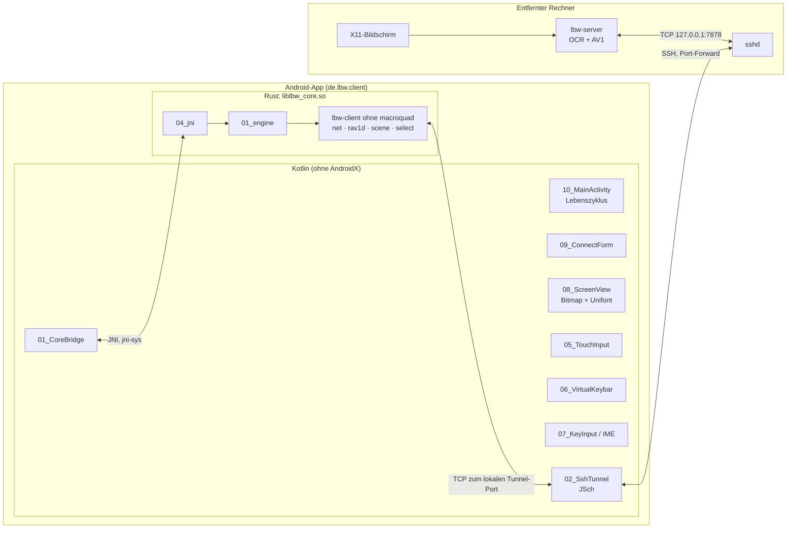
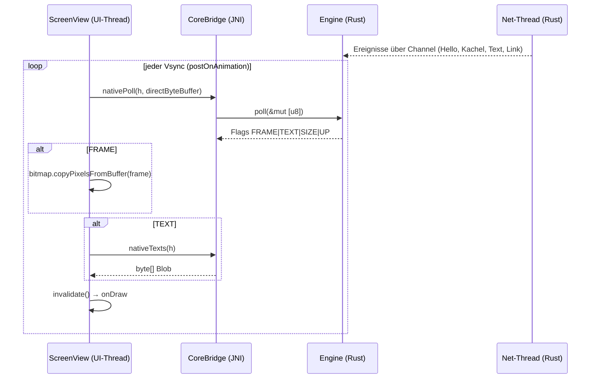
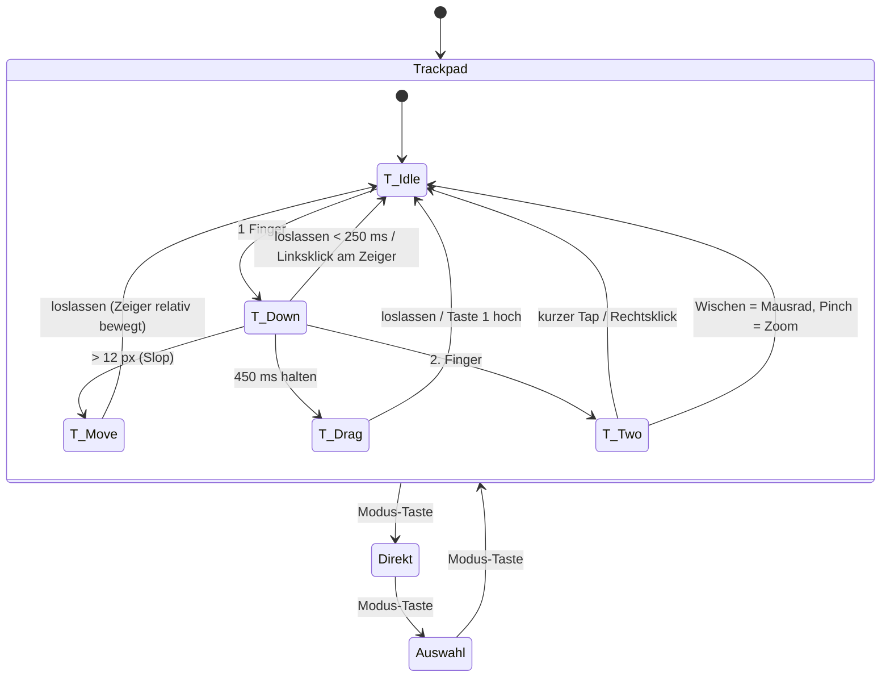
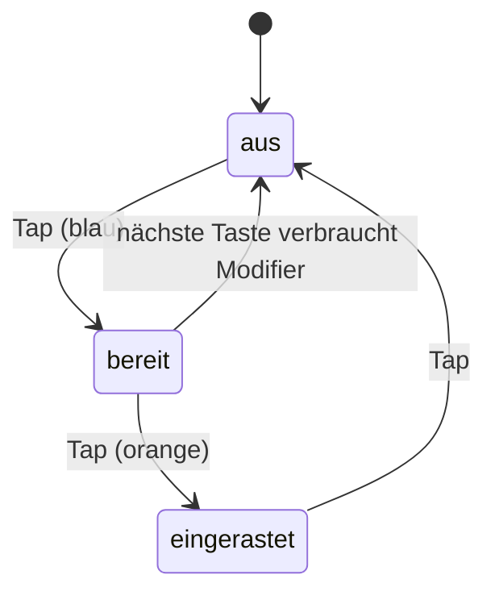
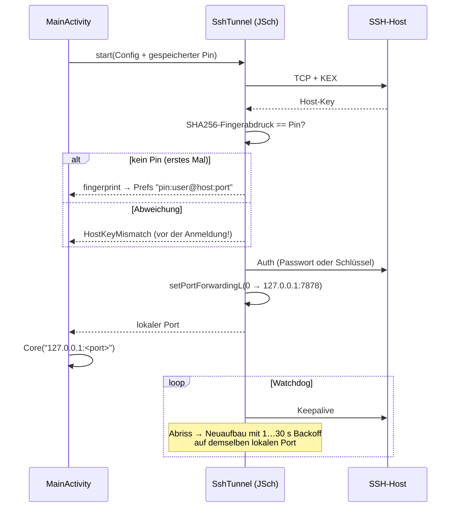
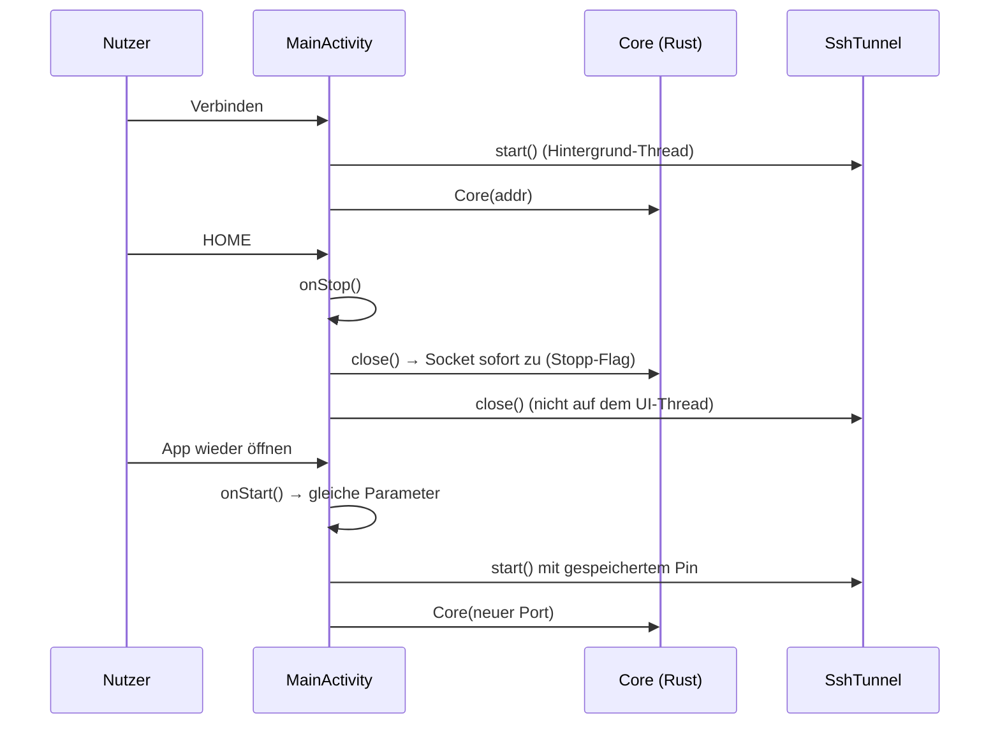
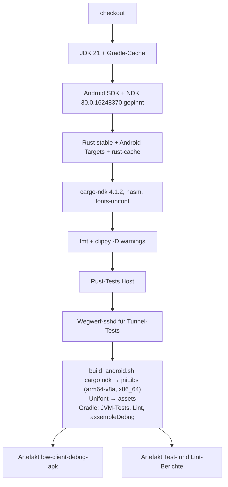
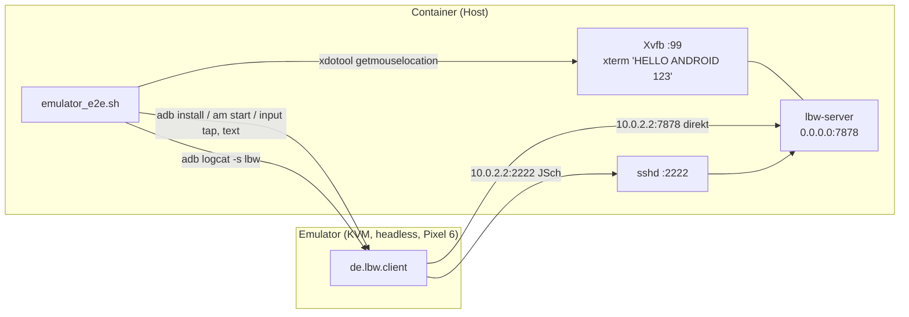

# Walkthrough: Android-Client für den Low-Bandwidth-Remote-Desktop

Dieses Dokument erklärt, was im Arbeitspaket „Android-Version des
`lbw-client`“ tatsächlich gebaut wurde, welche Entscheidungen erst durch
Tests zustande kamen, was wir dabei gelernt haben und welche Werkzeuge
dauerhaft in das Docker-Image gehören.

Zur Einordnung: `lbw-server` nimmt auf einem entfernten Linux-Rechner
einen 640×640-Ausschnitt des X11-Bildschirms auf. Text wird per OCR als
**Vektordaten** geschickt (Zeichenkette + Rechteck + Farben), der Rest als
kleine **AV1-Standbild-Kacheln**, und das alles gedrosselt auf etwa
6 kB/s. Der Desktop-Client (`source6/client`, Rust + macroquad) setzt
daraus das Bild zusammen und schickt Maus und Tastatur zurück. Die
Android-App macht jetzt dasselbe auf dem Handy.

Plan: [`plan.md`](plan.md) · Tasks:
[`source6/android_client/task.md`](../../source6/android_client/task.md) ·
Abhängigkeiten: [`source6/android_client/deps.md`](../../source6/android_client/deps.md)

---

## 1. Was exakt implementiert wurde

### 1.1 Überblick: hybrid aus Rust und Kotlin

Die App ist **hybrid**. Alles, was schon im Desktop-Client funktioniert
und getestet ist (Protokoll, Reconnect, Kachel-Zusammenbau,
AV1-Dekodierung mit `rav1d`, Textauswahl), bleibt Rust. Kotlin macht nur,
was Android-spezifisch ist: Oberfläche, Touch, Bildschirmtastatur,
Lebenszyklus und den SSH-Tunnel.

- **JNI** (Java Native Interface) ist die offizielle Brücke, über die
  Java/Kotlin Funktionen einer nativen Bibliothek (`.so`) aufruft.
- **cdylib** ist eine Rust-Bibliothek im C-Format, die Android als
  `liblbw_core.so` lädt.



### 1.2 Vorbereitungen im Desktop-Client

Damit Android den Client-Code wiederverwenden kann, waren zwei kleine
Umbauten in `source6/client` nötig:

1. **Feature `desktop`** (Commit `5423bd8`): macroquad ist jetzt
   optional. Mit `--no-default-features` baut `lbw-client` als reine
   Bibliothek (Netz, AV1, Szene, Eingabe-Formung, Auswahl). Die
   Tastenzuordnung von macroquad (`06_keycode.rs`) ist vom
   plattformneutralen Teil (`05_input.rs`) getrennt.

   ```toml
   # source6/client/Cargo.toml
   [features]
   default = ["desktop"]
   desktop = ["dep:macroquad"]
   ```

2. **Stopp-Flag im Netz-Thread** (Commit `042688a`): Früher merkte der
   Netz-Thread erst beim nächsten Senden, dass niemand mehr zuhört. Bei
   ruhender Leitung konnte die TCP-Verbindung dann noch bis zu 90 s
   offen bleiben. Android muss in `onStop()` aber sofort loslassen.
   `Drop for Net` setzt deshalb ein `AtomicBool`, und ein Test prüft,
   dass der Server-Socket keine Sekunde nach `drop(net)` EOF sieht.

### 1.3 Der Rust-Kern `rust-core` (Crate `lbw-core`)

| Datei | Aufgabe |
|---|---|
| `01_engine.rs` | `Engine { Net, Scene }`: `poll()` verarbeitet Netz-Ereignisse und kopiert das RGBA-Bild nur bei Änderung. |
| `02_blob.rs` | Texte als kompakter Binärblob für Kotlin, HUD-Statuszeile |
| `03_keymap.rs` | Android `KEYCODE_*`/`META_*` → X11-Keysyms und Modifier |
| `04_jni.rs` | 14 Exporte `Java_de_lbw_client_CoreBridge_*` mit `jni-sys` |

**Pull statt Callback.** Rust ruft Kotlin nie auf. Kotlin fragt einmal
pro Bildwechsel (Vsync, etwa 60 Hz) nach, was es Neues gibt. Das
vermeidet JNI-Aufrufe aus fremden Threads (`AttachCurrentThread`) und
jede Form von Rückruf-Synchronisation.



Das Bild landet in einem **direkten ByteBuffer**, einem Speicherbereich
außerhalb des Java-Heaps, den Rust per `GetDirectBufferAddress` direkt
beschreibt. `Bitmap.copyPixelsFromBuffer` ist dann ein einziges
`memcpy`, und der Garbage Collector hat nichts zu tun.

```kotlin
// 01_CoreBridge.kt – die JNI-Oberfläche (Auszug)
@JvmStatic external fun nativeNew(addr: ByteArray, deadAfterS: Int): Long
@JvmStatic external fun nativePoll(h: Long, frame: ByteBuffer?): Int
@JvmStatic external fun nativeTexts(h: Long): ByteArray?
@JvmStatic external fun nativeAndroidKey(h: Long, keyCode: Int, metaState: Int): Boolean
@JvmStatic external fun nativeMouse(h: Long, x: Int, y: Int, force: Boolean)
@JvmStatic external fun nativeWheel(h: Long, dy: Int)
```

```rust
// 04_jni.rs – Gegenstück in Rust
#[unsafe(no_mangle)]
pub extern "system" fn Java_de_lbw_client_CoreBridge_nativePoll(
    env: Env,
    _: jclass,
    h: jlong,
    frame: jobject,
) -> jint {
    engine(h).map_or(0, |mut e| e.poll(direct(env, frame)))
}
```

Zeichenketten gehen als **UTF-8-`byte[]`** über die Grenze und nicht als
`jstring`. JNI kodiert Strings intern als „modified UTF-8“, das sich bei
Emojis und `\0` anders verhält. Mit `byte[]` gibt es keine Überraschungen.

**Text-Blob.** Die Texte der Szene werden als kleines Binärformat
übergeben (Little Endian):

```text
u32 anzahl
je Element: u32 id | u16 x y w h | u8 fg[3] | u8 bg[3] | u16 len | len Byte UTF-8
            └──────────── 20 Byte Kopf ────────────────┘
```

Die Rust- und die Kotlin-Tests prüfen **dieselben Bytes**. So fällt eine
Abweichung zwischen Kodierer (`02_blob.rs`) und Parser (`03_TextItems.kt`)
sofort auf. Genau so wurde ein Fehler gefunden (siehe Abschnitt 2).

**Größe:** `liblbw_core.so` ist 1,8 MB (arm64-v8a) bzw. 2,0 MB (x86_64)
groß und hängt nur von libc ab. Das Debug-APK hat 6,9 MB, davon 5,3 MB
Unifont.

### 1.4 Die Kotlin-App `android-app`

Die App kommt **ohne AndroidX und ohne Compose** aus: nur Android-Views,
Kotlin-Stdlib und JSch. Das hält das APK klein, den CI-Build schnell und
den Code überschaubar. Die Dateien sind in Datenfluss-Reihenfolge
nummeriert:

| Datei | Zeilen | Aufgabe |
|---|---|---|
| `01_CoreBridge.kt` | 153 | JNI-Deklarationen, `Core`-Wrapper (Handle, Frame-Puffer, `close()`) |
| `02_SshTunnel.kt` | 175 | JSch-Port-Forward, Keepalive, Watchdog, Host-Key-Pinning |
| `03_TextItems.kt` | 72 | Blob-Parser, Unifont-Größe und -Streckung je Textbox |
| `04_Viewport.kt` | 84 | Einpassen, Zoom um einen Fokuspunkt, Pan mit Randbegrenzung |
| `05_TouchInput.kt` | 219 | Gesten-Zustandsautomat (rein, ohne Android-Klassen, JVM-testbar) |
| `06_VirtualKeybar.kt` | 201 | Tastenleiste und Sticky-Modifier |
| `07_KeyInput.kt` | 92 | IME-`InputConnection` und Hardware-Tasten |
| `08_ScreenView.kt` | 266 | Vsync-Schleife, Zeichnen (Bitmap, Texte, Cursor, Auswahl, HUD) |
| `09_ConnectForm.kt` | 114 | Formular, Prefs (ohne Passwort), Intent-Extras |
| `10_MainActivity.kt` | 226 | Sitzung, Verbindungsaufbau, `onStart`/`onStop`, Zurück |

#### Zeichnen

Die AV1-Kacheln stehen im Bitmap. Darüber zeichnet `ScreenView` jeden
Text mit **GNU Unifont** in genau sein Rechteck. Die Schriftgröße wird
aus der Boxhöhe berechnet, und `textScaleX` streckt horizontal, damit die
Breite passt. Das Bitmap wird **ohne Filter** (Nearest Neighbour)
skaliert, damit Kachelkanten scharf bleiben.

#### Touch-Bedienung

Ein Handy hat keine Maus. `05_TouchInput` übersetzt Gesten in Maus-Ereignisse
und kennt drei Modi, die man in der Tastenleiste umschaltet:



- **Trackpad** (Standard): Der Finger bewegt den Zeiger *relativ* wie auf
  einem Laptop-Touchpad. Tap = Linksklick, lang drücken = Ziehen,
  Zwei-Finger-Tap = Rechtsklick, Zwei-Finger-Wischen = Mausrad.
- **Direkt**: Der Zeiger springt unter den Finger. Tap = Klick an dieser
  Stelle, lang drücken = Rechtsklick.
- **Auswahl**: Mit einem Rechteck wählt man Text; Rust liefert den
  OCR-Text aus der Szene, der in die Zwischenablage wandert.
- **Pinch** (zwei Finger spreizen) zoomt in allen Modi. Ist hineingezoomt,
  verschieben zwei Finger die Ansicht, statt zu scrollen.

Das Mausrad folgt dem Handy-Gefühl („natural scrolling“): Finger nach
unten heißt Inhalt nach unten, also Rad **hoch** (`dy = +1`, X-Button 4).

Weil `TouchInput` keine Android-Klassen benutzt, testen elf JVM-Tests
jede Geste mit einem Fake-Empfänger:

```kotlin
@Test
fun twoFingerDragScrollsNaturally() {
    val (t, r) = setup(TouchMode.TRACKPAD)
    t.down(100f, 100f, 0)
    t.move(2, 100f, 100f, 50f, 10)
    t.move(2, 100f, 190f, 50f, 20) // fingers down 90 px → 2 notches up
    t.up(500)
    assertEquals(listOf("w1", "w1"), r.buttons())
}
```

#### Tastatur

- **Bildschirmtastatur (IME)**: `07_KeyInput` liefert eine eigene
  `InputConnection` mit `TYPE_TEXT_VARIATION_VISIBLE_PASSWORD`. Damit gibt
  es keine Wortvorschläge und keine Autokorrektur, die sonst ganze Wörter
  ersetzen würde. `commitText` schickt Zeichen, `deleteSurroundingText`
  wird zu Backspace, die Editor-Aktion zu Return.
- **Tastenleiste** (`06_VirtualKeybar`): ⌨, Modus, Esc, Tab, Ctrl, Alt, ⇧,
  ❖, Pfeile, Rad, Fn (F1–F12), Pos1/Ende/Bild↑/Bild↓/Einf/Entf, Einfügen,
  Einpassen, HUD. Die Knöpfe sind **nicht fokussierbar**, damit die IME
  beim Antippen offen bleibt.
- **Sticky-Modifier**: Einmal Ctrl tippen = für die nächste Taste
  (blau), zweimal = eingerastet (orange), dreimal = aus. So geht Ctrl+C
  auch ohne Hardware-Tastatur.



#### SSH-Tunnel mit Host-Key-Pinning

Der Server bindet absichtlich nur an `127.0.0.1`, weil das Protokoll
keine Authentifizierung hat. Vom Handy aus erreicht man ihn über einen
**SSH-Local-Port-Forward**: JSch öffnet lokal einen zufälligen Port, und
alles, was dort ankommt, geht verschlüsselt zum SSH-Host und dort an
`127.0.0.1:7878`.

**TOFU** („Trust On First Use“): Beim ersten Verbinden merkt sich die App
den Fingerabdruck des Server-Schlüssels. Weicht er später ab, bricht die
Verbindung ab, noch **bevor** Passwort oder Schlüssel gesendet werden. Die
Prüfung sitzt in einem eigenen `HostKeyRepository`, das JSch während des
Schlüsselaustauschs (KEX) fragt.



Der **Watchdog** baut den Tunnel nach einem Abriss auf *demselben*
lokalen Port neu auf. Der Rust-Reconnect verbindet sich dann einfach
wieder mit `127.0.0.1:<port>` und muss von SSH nichts wissen.

Das Format des Fingerabdrucks ist exakt das von `ssh-keygen -lf`
(`SHA256:` + Base64 ohne `=`). Der Nutzer kann ihn also mit dem Server
vergleichen.

#### Lebenszyklus



Das Passwort steht nur im Speicher und nie in den Prefs. Die
Backup-Regeln (`data_extraction_rules.xml`) schließen die Prefs aus,
damit Host-Key-Pins nicht per Cloud-Backup auf ein anderes Gerät wandern.

### 1.5 Build und GitHub Action



`scripts/ci_local.sh` führt **dieselben Schritte** lokal aus. Die
Action selbst wurde in dieser Sitzung nicht auf GitHub ausgeführt, weil
nichts gepusht wurde. Geprüft wurde sie mit `actionlint` und einem
grünen `ci_local.sh` in einem frischen Klon.

```sh
cd source6/android_client
scripts/build_android.sh     # .so, Font, JVM-Tests, Lint, APK
scripts/ci_local.sh          # komplette Action lokal
scripts/emulator_e2e.sh      # HIL im Emulator
```

### 1.6 Tests auf drei Ebenen

| Ebene | Was | Anzahl |
|---|---|---|
| Unit (Rust) | Blob, Keymap, Engine-Hilfen | Teil von `cargo test --workspace` |
| Integration (Rust) | `tests/engine.rs`: Fake-Server sendet Hello, Text und eine echte rav1e-Kachel; Pixel, Blob, Auswahl, Eingaben auf der Leitung, EOF nach Drop | 1 (End-to-End) |
| Unit (JVM) | `TextItemsTest`, `ViewportTest`, `TouchInputTest`, `StickyModsTest`, `FingerprintTest` | 22 |
| Integration (JVM) | `CoreBridgeHostTest` lädt die **Host-`.so`** und ruft jede native Funktion; `SshTunnelTest` gegen echten `sshd` (Echo, Abriss → gleicher Port, falscher Pin, Passwort) | 6 |
| HIL (Emulator) | `scripts/emulator_e2e.sh`: echte App im KVM-Emulator gegen echten `lbw-server` | 19 Nachweise |

**HIL** („Hardware in the Loop“) heißt hier: Die echte App läuft auf
einem echten Android-System, dem Emulator mit Android 16 (API 36), und
spricht mit einem echten Server, der einen echten X11-Bildschirm
abgreift.



Die Nachweise im Einzelnen:

1. `link up`, und der OCR-Text des xterm erscheint in der App.
2. Ein Tap im Modus Direkt auf Szene (200,150) setzt den X-Zeiger
   **exakt** auf (200,150). Die Umrechnung Szene → Bildschirm nutzt die
   Logzeile `view WxH@X,Y`.
3. `adb input text` **und** echte Taps auf die Bildschirmtastatur
   (`commitText`) tippen ins xterm, und der Text kommt per OCR zurück.
4. Trackpad: Ein Tap klickt am Zeiger, Wischen bewegt ihn relativ.
5. SSH: Tunnel steht, Fingerabdruck = `ssh-keygen`, Text kommt an, Pin
   gespeichert, Passwort nicht.
6. HOME trennt, Wiederöffnen verbindet neu, mit demselben Pin.
7. Die Tastatur startet verborgen, und ein Zurück führt zum Formular.

Ein kompletter Lauf ab Kaltstart des Emulators dauert etwa 53 s.

---

## 2. Architektur-Entscheidungen, die durch Tests geändert wurden

| # | Was ein Test zeigte | Änderung |
|---|---|---|
| 1 | `TextItemsTest` las den Blob aus dem Rust-Test und verlor das letzte Element. Der Parser verlangte **24** Byte Kopf, es sind **20**. | Mindestgröße korrigiert. Seitdem prüfen Rust und Kotlin dieselben Bytes. |
| 2 | Die Tunnel-Tests waren im Gradle-Lauf „grün“, liefen aber gar nicht: Gradle hielt die Testaufgabe für *up to date*, weil sich die Umgebungsvariablen `LBW_SSHD_*` nicht als Eingaben auswirkten. | Die Testaufgabe deklariert `LBW_SSHD_*` und die Host-`.so` als Inputs. |
| 3 | Auf GitHub-Runnern zeigt `ANDROID_NDK_HOME` auf ein anderes NDK als das gepinnte. | `build_android.sh` nimmt immer das gepinnte NDK (nur `LBW_NDK_HOME` überschreibt) und bricht früh ab, wenn es fehlt. |
| 4 | Test-`sshd` als root, Runner als normaler Nutzer: Der Testschlüssel war nicht lesbar. | `test_sshd.sh` legt den Schlüssel lesbar ab. |
| 5 | Mit `StrictHostKeyChecking=no` hätte jeder Mittelsmann das Passwort bekommen. | **TOFU-Pinning** vom Punkt „Erweiterung“ in den Kern verschoben (A5.3); die Prüfung läuft während KEX, vor der Anmeldung. |
| 6 | Desktop-Client-Analyse: Ein fallengelassenes `Net` hielt die Verbindung bis zu 90 s. | Stopp-Flag in `Net` (Commit `042688a`); Test verlangt EOF in weniger als 1 s. |
| 7 | Mausrad-Richtung: Der Server wertet positives `dy` als „hoch“ (Button 4). | Zwei-Finger-Wischen nach unten ergibt `+1` (natural scrolling); per Test festgenagelt. |
| 8 | Android-Lint (`GestureBackNavigation`): Ab API 36 ruft das System `onBackPressed` für Gesten nicht mehr auf. | `OnBackInvokedDispatcher` ab API 33 plus `enableOnBackInvokedCallback="true"` im Manifest; `onBackPressed` nur noch darunter. `lintDebug` läuft jetzt im Build. |
| 9 | **Emulator-Screenshot**: Ctrl/Alt/⇧/❖ waren weiße Flächen ohne lesbare Schrift. Der Theme-Farbton steckt *im* Standard-Drawable und geht verloren, sobald man `backgroundTintList` anfasst, auch beim Zurücksetzen. | Alle Tasten bekommen ein eigenes `RippleDrawable` + `GradientDrawable`. |
| 10 | **Emulator**: Das erste Zurück schloss nicht die Sitzung. `ScreenView` ist ein Texteditor mit Fokus, und das System öffnete die IME beim Start von selbst; deren Zurück-Callback schluckte den Tastendruck. | `windowSoftInputMode="stateHidden|adjustResize"`: Die Tastatur öffnet nur ⌨. |
| 11 | **Emulator**: JSch handelt auf Android **ECDSA** aus, nicht Ed25519, weil Android keinen Ed25519-Provider für JSch hat. | Test-`sshd` bietet Ed25519- und ECDSA-Host-Schlüssel an; der E2E vergleicht den Fingerabdruck aus dem Log mit `ssh-keygen -lf` aller Host-Schlüssel und gibt den ausgehandelten Typ aus. |
| 12 | Trackpad-Test: Der Zeiger startete nicht an der Server-Position, sondern in der Szenenmitte, weil der Server die Zeigerposition nicht meldet. | Verhalten dokumentiert; der Test synchronisiert zuerst mit einem Tap. |
| 13 | Die Dateiregel (≈ 300 Zeilen) wurde von `ScreenView` und später `MainActivity` überschritten. | Abgeteilt wurden `07_KeyInput.kt` sowie `09_ConnectForm.kt`/`10_MainActivity.kt`, ohne Verhaltensänderung (JVM-Tests, Lint und E2E vorher und nachher grün). |

Zwei Beispiele im Detail.

**Gradle-Cache (Nr. 2).** Gradle überspringt Aufgaben, deren Eingaben
sich nicht geändert haben (Gradle Build Cache, *up to date*). Umgebungsvariablen zählen standardmäßig nicht
dazu, und ohne `LBW_SSHD_PORT` markierten sich die Tunnel-Tests als
„übersprungen“. Das Ergebnis wurde gecacht, und spätere Läufe *mit* sshd
führten sie nie aus:

```kotlin
// app/build.gradle.kts
tasks.withType<Test>().configureEach {
    systemProperty("java.library.path", hostLibDir)
    systemProperty("lbw.hostLib", hostLibDir)
    inputs.dir(hostLibDir).optional().withPropertyName("hostLib")
    // SshTunnelTest runs only with a test sshd; re-run when that changes
    for (v in listOf("LBW_SSHD_PORT", "LBW_SSHD_USER", "LBW_SSHD_KEY", "LBW_SSHD_PWUSER", "LBW_SSHD_PASSWORD")) {
        inputs.property(v, providers.environmentVariable(v).orElse(""))
    }
}
```

**Weiße Tasten (Nr. 9).** Den Fehler sah kein Unit-Test, erst der
Screenshot aus dem Emulator. Die Lösung zeichnet den Hintergrund selbst:

```kotlin
private fun keyBackground(color: Int) = RippleDrawable(
    ColorStateList.valueOf(Color.argb(90, 255, 255, 255)),
    GradientDrawable().apply { cornerRadius = dp(4).toFloat(); setColor(color) },
    null,
)
```

---

## 3. Learnings und mögliche Erweiterungen

### Learnings

- **Pull-JNI ist einfach und schnell.** Ein `poll()` pro Vsync, ein
  direkter Puffer und Flags als Rückgabewert: keine Threads, die JNI
  kennen müssen, keine Rückrufe, kein GC-Druck. 14 Funktionen reichen.
- **Die Host-`.so` im JVM-Test ist Gold wert.** `CoreBridgeHostTest`
  lädt dieselbe Rust-Bibliothek, nur für x86_64-Linux gebaut, und findet
  falsche JNI-Namen oder Signaturen, bevor ein Emulator startet.
- **Reine Kotlin-Logik** (Viewport, Gesten, Sticky-Modifier, Blob-Parser)
  ohne Android-Klassen ist in Millisekunden auf der JVM testbar. Nur das
  Zeichnen und die Systemintegration brauchen den Emulator.
- **Der Emulator findet, was Unit-Tests nicht sehen**: Theme-Farben,
  IME-Verhalten, Back-Dispatch, JSch-Kryptoprovider. Der Kaltstart
  dauert unter 30 s mit KVM, der ganze HIL-Lauf etwa 53 s.
- **Emulator-Eigenheit**: Die virtuelle QWERTY-Tastatur des Emulators
  zählt als Hardware-Tastatur und unterdrückt die Bildschirmtastatur.
  Abhilfe: `settings put secure show_ime_with_hard_keyboard 1`.
- **Logzeilen als Test-Schnittstelle** (`link up`, `texts N: …`,
  `view WxH@X,Y`) machen Shell-Tests robust und helfen später beim
  Debuggen mit `adb logcat -s lbw`.
- **Ohne AndroidX** bleibt alles klein: Zwei Warnungen (Back-Navigation,
  Insets) muss man dann selbst lösen, beides wenige Zeilen.

### Mögliche Erweiterungen

1. **Server meldet die Zeigerposition** (neue `ServerMsg`). Dann startet
   der Trackpad-Zeiger dort, wo er auf dem Desktop wirklich steht.
2. **Emulator-Job in der Action** (`workflow_dispatch`, KVM auf
   `ubuntu-latest`), mit Modell-Cache für den Server.
3. **Release-Build** mit Signatur (Keystore als Secret), R8 und
   `abiFilters` nur `arm64-v8a` für Handys; Unifont auf die benötigten
   Bereiche beschneiden (5,3 MB → < 1 MB).
4. **Ed25519 für JSch auf Android** über Bouncy Castle, falls ein Server
   nur Ed25519-Host-Keys anbietet.
5. **Schlüsselverwaltung**: privaten Schlüssel im Android Keystore
   erzeugen und den Public Key anzeigen, statt PEM-Text einzufügen.
6. **Foreground-Service**, damit eine Sitzung kurze App-Wechsel ohne
   Neuaufbau überlebt (heute trennt `onStop` bewusst sofort).
7. **Hardware-AV1** (`MediaCodec`) nur als Messversuch; für einzelne
   Standbild-Kacheln ist `rav1d` einfacher und berechenbarer.
8. **Barrierefreiheit**: Die OCR-Texte liegen ohnehin als Strings vor und
   könnten als virtuelle Views für TalkBack angeboten werden.

---

## 4. Neue Programme/Pakete für das Dockerfile

Diese Werkzeuge wurden für Build und Tests installiert und sollten
dauerhaft in das Image
(`05_dockerfile_meta/source01/examples/03_ai_env/Dockerfile`):

| Paket / Werkzeug | Quelle | Wofür |
|---|---|---|
| `openjdk-21-jdk-headless` | apt | Gradle/AGP, JVM-Tests |
| Android cmdline-tools (`sdkmanager`, `avdmanager`) | Google-ZIP → `/opt/android-sdk` | SDK-Verwaltung |
| `platform-tools` (adb), `platforms;android-36`, `build-tools;37.0.0` | sdkmanager | APK bauen, installieren |
| `ndk;30.0.16248370` | sdkmanager | Rust-Crosskompilierung für Android |
| `emulator`, `system-images;android-36;default;x86_64` | sdkmanager | HIL-Test (braucht `/dev/kvm` im Container) |
| Rust-Targets `aarch64-linux-android`, `x86_64-linux-android` | rustup | `.so` für Handy und Emulator |
| `cargo-ndk` 4.1.2 | cargo install | NDK-Linker je ABI, Ausgabe nach `jniLibs` |
| `cargo-edit` | cargo install | `cargo upgrade` |
| `nasm` | apt | Assembler-Teile von `rav1d`/`rav1e` |
| `fonts-unifont` | apt | Unifont-OTF für die App |
| `openssh-server` | apt | Test-`sshd` (Tunnel-Tests) |
| `xvfb`, `xterm`, `xdotool`, `imagemagick` | apt | „Entfernter“ X11-Rechner, Zeiger-Nachweis, Screenshots |
| `libpulse0`, `libnss3`, `libxcomposite1`, `libxcursor1`, `libxdamage1`, `libxi6`, `libxtst6` | apt | Laufzeitbibliotheken des Emulators (headless) |
| `actionlint` 1.7.12 | GitHub-Release-Binary | Workflow prüfen vor dem Push |

Gradle selbst kommt über den Wrapper (`gradlew`, 9.8.0) und muss nicht
installiert werden.

Skizze für das Dockerfile:

```dockerfile
RUN --mount=type=cache,target=/var/cache/apt,sharing=locked \
    --mount=type=cache,target=/var/lib/apt/lists,sharing=locked apt-get update \
 && apt-get install -y --no-install-recommends openjdk-21-jdk-headless nasm \
    fonts-unifont openssh-server xvfb xterm xdotool imagemagick \
    libpulse0 libnss3 libxcomposite1 libxcursor1 libxdamage1 libxi6 libxtst6
ENV ANDROID_HOME=/opt/android-sdk
RUN mkdir -p $ANDROID_HOME/cmdline-tools \
 && curl -fsSL -o /tmp/clt.zip https://dl.google.com/android/repository/commandlinetools-linux-<rev>_latest.zip \
 && unzip -q /tmp/clt.zip -d $ANDROID_HOME/cmdline-tools && mv $ANDROID_HOME/cmdline-tools/cmdline-tools $ANDROID_HOME/cmdline-tools/latest \
 && yes | $ANDROID_HOME/cmdline-tools/latest/bin/sdkmanager --licenses >/dev/null \
 && $ANDROID_HOME/cmdline-tools/latest/bin/sdkmanager "platform-tools" "platforms;android-36" \
    "build-tools;37.0.0" "ndk;30.0.16248370" "emulator" "system-images;android-36;default;x86_64"
RUN rustup target add aarch64-linux-android x86_64-linux-android \
 && cargo install cargo-ndk@4.1.2 cargo-edit
```

Zum Starten des Containers für den HIL-Test: `--device /dev/kvm`.
