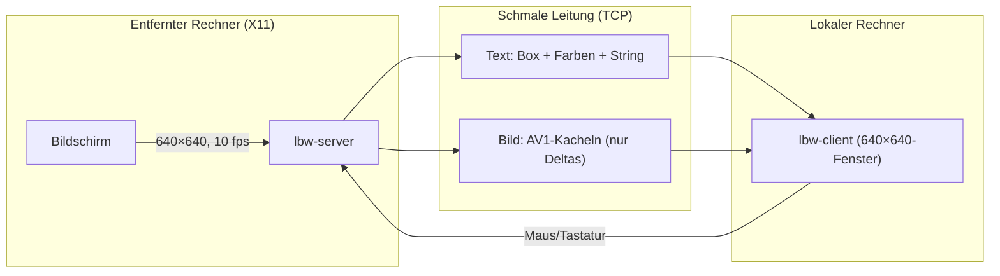
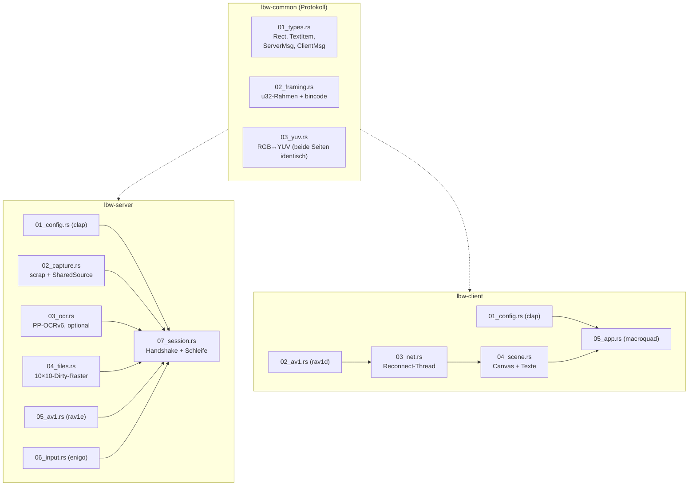
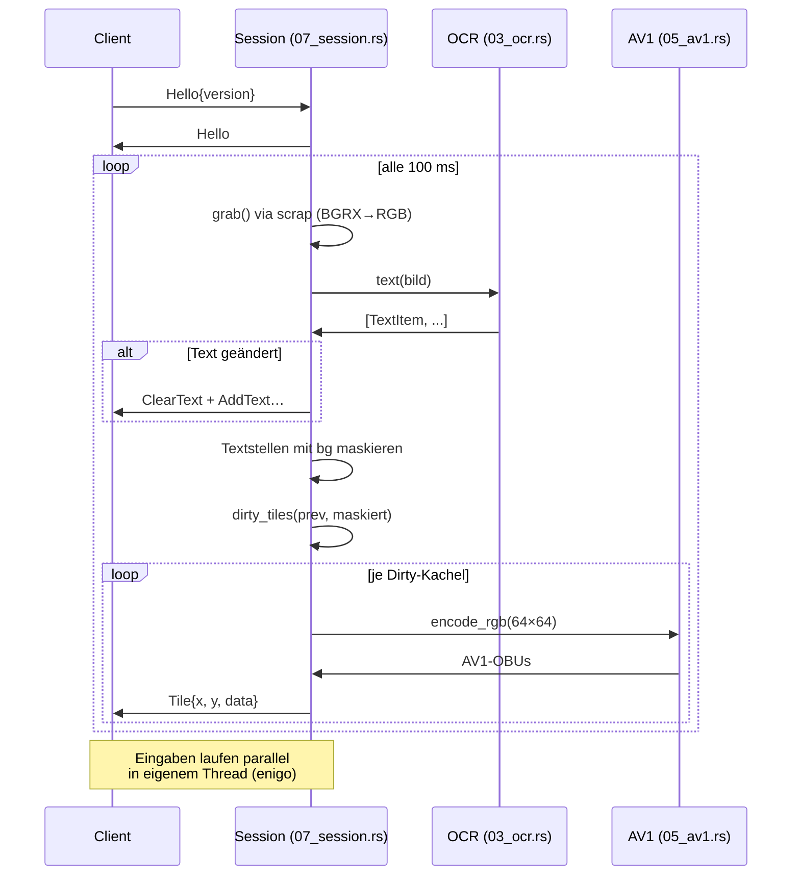
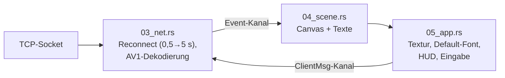

# Walkthrough: `source7_mvp` — der Minimal-Remote-Desktop

Dieses Dokument erzählt, was aus dem Plan `20261003_01_simplify` wirklich
geworden ist: ein lauffähiger Remote-Desktop für extrem schmale Bandbreite
in **3.041 Zeilen Rust** (zuvor 7.756 in `source6`, Kotlin-App nicht
mitgezählt). Es ist bewusst didaktisch geschrieben: Fachbegriffe werden
erklärt, Architektur wird mit Diagrammen gezeigt, und alle wichtigen
Stellen kommen mit Code-Beispielen.

## 0. Die Idee in einem Bild



**Grundtrick:** Text wird nicht als Pixel, sondern als *Vektordaten*
(Position, Farben, Zeichenkette) übertragen — ein Wort kostet ~30 Byte
statt Kilobyte. Alles, was kein Text ist, geht als komprimierte
Bildkachel raus, und nur wenn es sich geändert hat. Bei Standbild
fließen **0 Byte**.

**Fachbegriffe kurz erklärt:**

- **OCR** (*Optical Character Recognition*): Software, die Schrift in
  Bildern findet und liest. Wir nutzen PP-OCRv6: ein *Detektor* (DBNet)
  findet Textzeilen als Rechtecke, ein *Erkenner* (SVTR + CTC) liest sie.
- **AV1**: moderner Videocodec; wir kodieren jede Kachel als
  *Still-Picture* (Einzelbild), also quasi „ein Bild aus einem Video“.
- **ONNX / ONNX Runtime (`ort`)**: Austauschformat für neuronale Netze
  plus Laufzeitumgebung, um sie ohne Python auszuführen.
- **Framing**: Nachrichten über TCP brauchen Längenangaben, weil TCP
  nur einen Bytestrom ohne Nachrichtengrenzen liefert.
- **MIT-SHM**: X11-Erweiterung, die Bildschirmdaten über geteilten
  Speicher statt über den Socket liefert (schnell).

## 1. Was exakt implementiert wurde

### 1.1 Modulübersicht



Jede Datei hat genau eine Zuständigkeit, nummeriert in
Datenfluss-Reihenfolge; `lib.rs`/`main.rs` enthalten nur Deklaration und
Verdrahtung. Keine Datei überschreitet 510 Zeilen (nur `03_ocr.rs` kommt
mit Detektor + Erkenner + Farben auf 507 — zusammengehörig, daher eine
Datei).

### 1.2 Das Protokoll: vier Nachrichten genügen

```rust
// Server → Client (Bild fix 640×640, Kachel fix 64×64 — keine Größen!)
pub enum ServerMsg {
    Hello,
    ClearText,
    AddText(TextItem),                  // rect, fg, bg, text — keine ID
    Tile { x: u16, y: u16, data: Vec<u8> }, // ganze Kachel
}
// Client → Server
pub enum ClientMsg {
    Hello { version: u16 },
    MouseMove { x: u16, y: u16 },
    Button { button: u8, down: bool },
    Text(String),
    Key { key: String, down: bool },    // "Enter", "Esc", ...
}
```

Auf der Leitung steht `[u32-Länge][bincode-Body]`. Dank `serde` gibt es
keine einzige Zeile Hand-Codec mehr:

```rust
// Senden (02_framing.rs)
let body = bincode::serde::encode_to_vec(m, bincode::config::standard())?;
w.write_all(&(body.len() as u32).to_le_bytes())?;
w.write_all(&body)?;
```

Gegenüber `source6` gestrichen: Tile-Chunking (`TileStart`/`TileData`),
stabile Text-IDs mit Deltas, Resume/Ack, Ping/Pong, Stats. Ein Reconnect
beginnt einfach bei Vollbild — der Server hält keinerlei Client-Zustand.

### 1.3 Die Server-Schleife



Drei Details verdienen Erklärung:

**Festes Raster statt Flood-Fill.** `source6` verschmolz schmutzige
16×16-Blöcke per Connected-Components-Algorithmus zu Rechtecken
(~230 Zeilen). Das MVP iteriert blind über 10×10 Kacheln und vergleicht
Bytes zeilenweise — 20 Zeilen, vom Compiler vektorisiert (SIMD):

```rust
for y in (0..h).step_by(t as usize) {
    for x in (0..w).step_by(t as usize) {
        if prev.is_none_or(|p| tile_changed(p, cur, x, y, t, t)) {
            out.push(Rect::new(x as u16, y as u16, TILE, TILE));
        }
    }
}
```

**Text nur bei Änderung.** Ohne stabile IDs würde naives Senden jedes
Frame ~2 kB Text kosten. Der Vergleich `texts != last_texts` (eine
Zeile) hält Standbilder bei 0 Byte Text.

**OCR ist optional.** Fehlt das Modellverzeichnis, läuft der Server mit
Warnung ohne Text weiter — nur Kacheln. Das macht Tests und Smoke ohne
30-MB-Downloads möglich und ist der wichtigste Robustheits-Trick des MVP.

### 1.4 Der Client: Netz-Thread + Szene + Fenster



Die Szene ist reines Datenmodell (ohne Grafik-Kontext testbar): ein
RGBA-Canvas plus `Vec<TextItem>`. Die App lädt die Textur nur bei
`dirty` neu und zeichnet Text mit dem eingebauten `macroquad`-Font —
keine Unifont-Datei mehr. Eingaben gehen als Deltas raus (Maus nur bei
Bewegung, Tasten nur bei Flanke); Steuerzeichen werden nicht als Text
geschickt, damit Enter nicht doppelt ankommt.

### 1.5 Tests und Messwerte

40 Tests sind grün (plus 1 ignorierter Modell-Test), alle ohne X11 und
ohne Modelle lauffähig:

| Ebene | Was | Anzahl |
|---|---|---|
| `common` | Protokoll-Roundtrips, Framing mit Teil-Reads, YUV | 10 |
| `server` | Config, Capture, OCR-Mathen, Tiles, AV1, Input | 21 |
| `server` | Loopback über echtes TCP (Vollbild + 1 Dirty-Kachel, Versions-Abweisung) | 2 |
| `client` | Config, AV1-Müll, Szene, Fenster | 6 |
| `client` | Loopback gegen Stub-Server (echte AV1-Kachel, Reconnect) | 1 |

Der Xvfb-Smoke (`scripts/smoke_xvfb.sh`) beweist Ende-zu-Ende-Betrieb
mit echten Modellen: Xvfb + xterm mit „SMOKE-TEST-640“, Server,
Headless-Probe. Messwerte (Threadripper PRO 7955WX, Release):

| Messung | Wert |
|---|---|
| Erster Text + erste Kachel nach Connect | ~125 ms |
| Vollbild (100 Kacheln) | ~350 ms, ~6,8 kB |
| Standbild danach | 0 B (kein Heartbeat nötig) |
| Eingabe → OCR-Echo im nächsten Frame | ~1 Frame (~100 ms + OCR) |
| Binaries | Client 4,0 MB, Server 31 MB (ORT statisch) |
| Code | 3.041 Zeilen / 24 Dateien (statt 7.756 / 48, ohne Kotlin) |

Besonders schön: Das injizierte Probe-Tippen („hi“ + Enter) erschien per
OCR erkannt im nächsten Frame — Eingabe→Bildschirm→OCR→Client ist damit
als geschlossene Schleife nachgewiesen.

## 2. Architektur-Entscheidungen, die Tests erzwungen haben

Vier Stellen liefen anders als in `plan.md` / `reduction-proposal.md`
skizziert — alle durch Build- oder Test-Befunde ausgelöst:

### 2.1 `scrap` statt `xcap` (Build schlug fehl)

Der Plan sah `xcap` vor (`capture_region` liefert direkt `RgbaImage`).
Doch `xcap` 0.9 zog ohne Feature-Gate Wayland- und EGL-Systembibliotheken
herein — der Build starb zweimal an fehlenden `.pc`-Dateien. `scrap`
0.5 braucht nur libxcb (Linker-Symlinks via `libxcb1-dev`,
`libxcb-shm0-dev`, `libxcb-randr0-dev`) und liefert BGRX-Bytes; die
Umwandlung sind 15 Zeilen:

```rust
// Crop + BGRX→RGB in 02_capture.rs
out.put_pixel(dx, dy, image::Rgb([f[s + 2], f[s + 1], f[s]]));
```

**Merksatz:** Bei Capture-Crates entscheidet der System-Dep-Baum, nicht
die API-Schönheit. `xcap` bleibt in `deps.md` als evaluierte Alternative
dokumentiert.

### 2.2 `FrameSource` ohne `Send` (Compiler schlug fehl)

`scrap::Capturer` ist `!Send` (enthält Rohzeiger und `Rc`). Der Trait
verlor daher seinen `Send`-Bound; Capture läuft im Session-Thread, nur
der Eingabe-Thread ist nebenläufig. Kein Mehraufwand, aber eine
Einschränkung für künftige Parallelisierung (siehe §3).

### 2.3 Festes 640×640 überall (Vorgabe + `fixed-size.md`)

Auf Anweisung wurde die Bildgröße fixiert — mit Kaskadeneffekt: `Hello`
und `Tile` verloren ihre Größenfelder, `dirty_tiles` verlor die
`min()`-Randfälle (exaktes 10×10-Raster, per `debug_assert` bewacht),
die Szene verlor `w`/`h`-Felder und Clipping, der Client verlor den Zoom
(festes 640×640-Fenster). Bewusst **behalten**: der Versions-Handshake
(`ClientMsg::Hello{version}`), eine Zeile je Seite gegen Protokoll-Mix.

### 2.4 `bincode` 2 statt 3 (kaputtes Release)

`cargo upgrade` meldete bincode 3.0.0 („neueste Version nehmen“ lautete
die Vorgabe). Doch 3.0.0 besteht auf crates.io aus einer einzigen Zeile:

```rust
compile_error!("https://xkcd.com/2347/");
```

Wir bleiben daher bewusst auf 2.0.1 (mit `serde`-Feature und
`bincode::serde::`-Pfaden) und haben das in `deps.md` vermerkt. Auch
DeepWiki beschrieb übrigens eine 3.x-serde-API, die zu diesem Stub gar
nicht existiert — ein guter Beleg dafür, Misstrauen durch Bauen zu
ersetzen: Erst der Compiler hat die Wahrheit gezeigt.

Daneben gab es kleinere Clippy-Funde (`large_enum_variant` → OCR-Modelle
geboxt, `never_loop`, `single_match`), die direkt im Code behoben wurden.

## 3. Learnings und mögliche Erweiterungen

**Was wir gelernt haben:**

1. **Standard-Crates schlagen Hand-Code um Größenordnungen.** `clap`
   ersetzte ~150 Zeilen Config-Parsing durch ein Derive, `serde` +
   `bincode` ~450 Zeilen Codec durch Typdefinitionen, `enigo` ~250 Zeilen
   XTEST-Logik durch Methodenaufrufe. Die einzige Stelle mit echtem
   Eigenbau-Charakter ist die OCR-Nachverarbeitung (DBNet-Flood-Fill,
   CTC-Dekodierung) — Domänenlogik, für die es kein Crate gibt.
2. **Optionale Modelle sind der beste Test-Trick.** `Ocr::Disabled` macht
   40 von 41 Tests ohne 30-MB-Downloads und ohne GPU/ORT-Overhead
   lauffähig; nur ein `#[ignore]`-Test braucht echte Netze.
3. **Stille ist ein Feature.** Ohne Heartbeat, ohne Polling-Text: Bei
   Standbild herrscht Funkstille. Das vereinfacht nicht nur den Code,
   sondern ist exakt das Low-Bandwidth-Verhalten, das wir wollen.
4. **Der teuerste Frame ist der erste.** 100 AV1-Kodierungen auf einmal
   (~350 ms) — danach nur Deltas. Für den Produktiveinsatz wäre das der
   erste Optimierungspunkt (siehe unten).

**Mögliche Erweiterungen (nach Aufwand sortiert):**

| Erweiterung | Aufwand | Nutzen |
|---|---|---|
| rav1e mit `asm` bauen (`nasm` ins Image) | klein | ~2–4× schnellere Kodierung |
| Fenster-Zoom zurückbringen (frei skalierbar) | klein | Bedienbarkeit auf HiDPI |
| Kachel-Kodierung parallelisieren (Threadpool) | mittel | Vollbild < 100 ms |
| Erkennungs-Cache wie in `source6` (Box+Hash → Text) | mittel | ~11 ms/Zeile bei Standbild sparen |
| Heartbeat + stille-Erkennung | mittel | Reconnect auch bei Netzwerk-Partition (heute nur bei TCP-Fehler) |
| Zwischenablage (F2/F3 aus `source6`) | mittel | Text übernehmen |
| YOLO-GUI-Detektor zurückbringen | groß | Icons als Vektoren statt Pixel |
| Authentifizierung (SSH-Tunnel-Doku reicht heute) | groß | Bindung an öffentliche Adressen |

## 4. Neue Programme und Pakete fürs Dockerfile

Für Build, Laufzeit und Tests des MVP werden diese Pakete zusätzlich
benötigt (Ubuntu 26.04):

```dockerfile
# Laufzeit + Smoke-Test
RUN apt-get update && apt-get install -y \
    xvfb \          # virtueller X11-Server für Smoke/E2E
    xterm \         # Textinhalt für den OCR-Nachweis im Smoke
    x11-utils \     # Diagnose (xdpyinfo u. ä.)
# Build-Linker (nur Symlinks, keine Header-Flut)
    libxcb1-dev libxcb-shm0-dev libxcb-randr0-dev \
    && rm -rf /var/lib/apt/lists/*
```

**Nicht** benötigt (bewusst vermieden): `nasm` (rav1e ohne `asm`),
`fonts-unifont` (Client nutzt eingebauten Font), Wayland-/EGL-Dev-Pakete
(`scrap` statt `xcap`), Python/Modell-Downloads für Tests (OCR optional).

Modelle zur Laufzeit (`PP-OCRv6_small_det.onnx`,
`PP-OCRv6_small_rec.onnx`, `inference.yml`, ~30 MB) kommen wie bisher aus
`source6` bzw. per Fetch-Skript nach `models/` — oder man startet mit
`--no-ocr` ganz ohne.

---

*Erstellt nach Abschluss aller Tasks (T1–T8): 40 Tests grün, Clippy
sauber, Smoke bestanden, 11 Commits (Conventional Commits). Quellcode:
`source7_mvp/`, Plan: `plan/20261003_01_simplify/`.*
