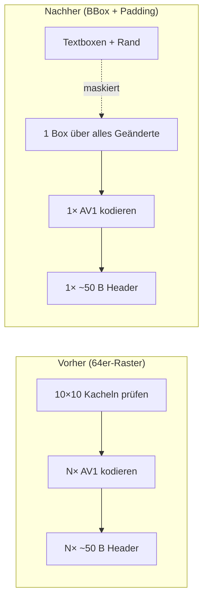
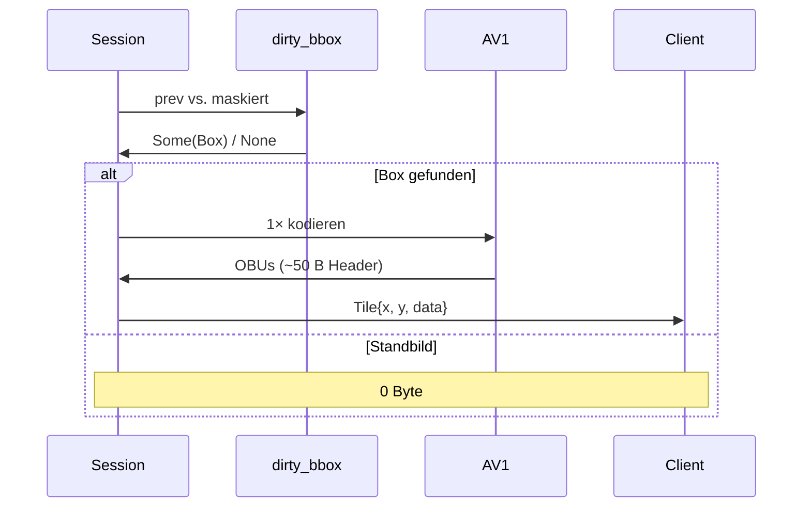
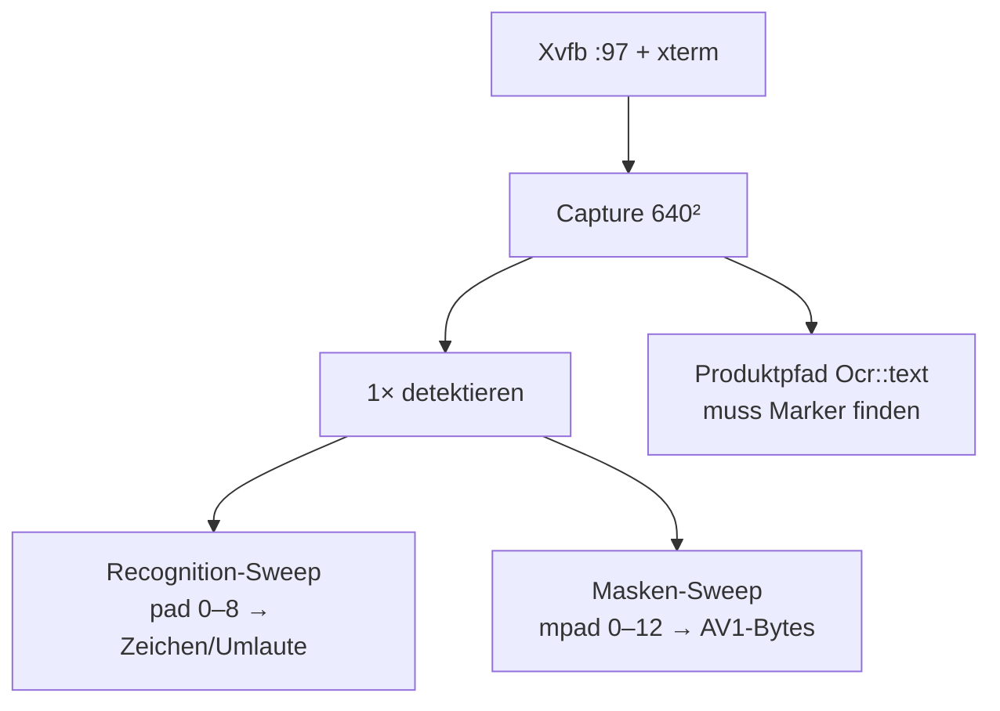

# Walkthrough: Review-Follow-up — BBox, Padding, Kürzungen

Dieses Dokument erzählt, was aus dem Plan `20261003_02_review_and_simplify_more`
wirklich geworden ist: Der MVP aus `20261003_01_simplify` folgt jetzt den
beiden Review-Forderungen (OCR-Pflicht, Single Bounding Box), maskiert und
erkennt Text mit gemessenen Padding-Werten und hat eine Reihe toter
Parameter verloren. Es ist bewusst didaktisch geschrieben: Fachbegriffe werden
erklärt, Architektur wird mit Diagrammen gezeigt, und alle wichtigen Stellen
kommen mit Code-Beispielen.

**Das Ergebnis in einem Satz:** kaum weniger Zeilen (2.736 statt 2.763 im
`src/`-Baum, T7 inkl.), aber deutlich weniger Konzepte — und das Vollbild
kostet nur noch **1,2 kB statt 6,8 kB**.

## 0. Die Idee in einem Bild



**Fachbegriffe kurz erklärt:**

- **Bounding Box (BBox):** das kleinste Rechteck, das alle Änderungen
  einschließt — statt vieler kleiner Kacheln gibt es pro Frame genau eine.
- **OBU-Overhead:** Jedes AV1-Einzelbild braucht ~30–50 Byte
  Verwaltungsdaten (Header), egal wie klein es ist. Zehn Kacheln zahlen
  zehnmal, eine Box nur einmal.
- **Skip-Blöcke:** AV1 kann unveränderte Bereiche innerhalb eines Bildes
  fast kostenlos („überspringen“) kodieren — deshalb darf die Box großzügig
  sein, ohne dass es Bandbreite kostet.
- **Padding:** künstlicher Rand um erkannte Textboxen. Die Erkennung liest
  damit besser (keine abgeschnittenen Umlaut-Punkte), die Maskierung löscht
  damit Glyphen-Fransen (keine AV1-Reste).
- **CER** (*Character Error Rate*): Anteil falsch gelesener Zeichen.

## 1. Was exakt implementiert wurde

### 1.1 OCR ist Pflicht (T1)

Das `enum Ocr { Disabled, Enabled(..) }` ist ersatzlos gestrichen — es gibt
nur noch die Struktur mit den zwei geladenen Netzen.
`Ocr::load` scheitert hart, wenn eine Modelldatei fehlt; `--no-ocr` kennt
der Server nicht mehr:

```rust
// Vorher: Fallback ohne Text (nutzlos bei 6 kB/s — reines AV1-Textbild
// sprengt das Budget).
let mut ocr = if cfg.no_ocr { Ocr::Disabled } else { Ocr::load(..)? };

// Nachher: eine Zeile, kein Zweig.
let mut ocr = Ocr::load(&cfg.models, OCR_THREADS)?;
```

Auch die `Box` um die Modelle ist weg (sie existierte nur, um das Enum
klein zu halten — ohne Enum kein Clippy-`large_enum_variant` mehr).
Tests ohne Modelle bleiben grün, weil die Session nie `Ocr` direkt, sondern
den `Recognize`-Trait mit einer Stub-OCR benutzt.

### 1.2 Eine Box pro Frame (T2)

`dirty_tiles() -> Vec<Rect>` wurde `dirty_bbox() -> Option<Rect>`. Der Kern:
zeilenweise über ganze Speicher-Slices vergleichen (der Compiler vektorisiert
das per SIMD), nur geänderte Zeilen pixelweise vermessen:

```rust
for y in 0..h {
    let (ra, rb) = (&a[s..s + stride], &b[s..s + stride]);
    if ra == rb { continue; }          // ganze Zeile identisch: weiter
    y0 = y0.min(y); y1 = y1.max(y);
    // ... erstes/letztes abweichendes Pixel der Zeile suchen
}
if x0 > x1 { return None; }           // Standbild: Funkstille
```

Danach wird die Box auf gerade Kanten und mindestens 16×16 erweitert
(rav1e-Bedingung) und im Bild gehalten. Die Session schrumpfte dabei von
einer Schleife mit drei Zustandsvariablen auf ein einziges `if let`:

```rust
if let Some(r) = dirty_bbox(prev.as_ref(), &masked) {
    let rgb = crop_rgb(&masked, r);
    let data = encode_rgb(&rgb, r.w as usize, r.h as usize, cfg.quantizer)?;
    write_msg(&mut wr, &ServerMsg::Tile { x: r.x, y: r.y, data })?;
}
```

Der Client vergaß die feste 64: `Event::Tile` trägt jetzt `w`/`h` aus dem
dekodierten AV1-Bild, `blit(x, y, w, h, rgba)` kopiert beliebig große Boxen.
Das **Protokoll blieb unverändert** (Version 1): `Tile{x, y, data}` war schon
immer größenlos — die Größe steht im AV1-Bitstrom, nicht in der Nachricht.
`TILE`-Konstante und `tile_changed()` sind gestrichen.



### 1.3 Padding mit gemessenen Werten (T3 + T4)

Eine reine Funktion plus zwei Zuschläge — mehr ist das Feature nicht:

```rust
pub fn pad_rect(r: Rect, pad: u16, w: u32, h: u32) -> Rect { /* +pad je Seite, clamp */ }

const REC_PAD: u16 = 4;   // in Ocr::text: vor Crop, Farben, Protokoll-Rechteck
pub const MASK_PAD: u16 = 6; // in der Session: vor fill_rect (zusätzlich!)
```

Der neue Ignored-Test `server/tests/padding.rs` startet ein **eigenes
Xvfb + xterm** (Marker `PADDING-SWEEP-640 ÄÖÜäöüß`), capturiert per
`ScrapSource` und druckt zwei Tabellen. Über `PADDING_XTERM_EXTRA` hängen
weitere Messpunkte an (z. B. `-fa Monospace -fs 14`):



Messwerte (2 Font-Konfigurationen, jeweils `cargo test --release
-p lbw-server --test padding -- --ignored --nocapture`):

| `REC_PAD` | Bitmap: Zeichen (Umlaute/ß) | Skalierfont: Zeichen (Umlaute/ß) |
|---|---|---|
| 0 | 25 (6) | 25 (4) |
| 2 | 25 (5) | 25 (**7**) |
| **4** | 25 (**7**) | 25 (**7**) |
| 6 | 25 (5) | 25 (7) |
| 8 | 23 (3) | 25 (7) |

| `MASK_PAD` | Bitmap: AV1-Bytes | Skalierfont: AV1-Bytes |
|---|---|---|
| 0 | 394 | 276 |
| 2 | 355 | 271 |
| 4 | 287 | 282 |
| **6** | 284 | 215 |
| 8 | 280 | 220 |
| 10 | 212 ⚠️ | 209 ⚠️ |
| 12 | 209 ⚠️ | 163 ⚠️ |

(⚠️ = Ersparnis kommt vom Verschlucken des Textcursors, siehe §2.3.)

Der Test pinnt das Ergebnis dauerhaft: Der ASCII-Marker muss über den echten
`Ocr`-Pfad gefunden werden, und die Defaults dürfen nicht schlechter sein
als `0` — beides relative Aussagen, robust gegen Fontwechsel.

### 1.4 Kürzungen ohne Verhaltensänderung (T5)

| Gestrichen | Warum folgenlos |
|---|---|
| `Av1Params{quantizer, speed, threads}` → `encode_rgb(rgb, w, h, quantizer)` | `speed`/`threads` waren nie per CLI erreichbar (fest 10/4) |
| `Scene::last_rx`, `Link::Down`-Zeitpunkt | nur geschrieben, nie gelesen (HUD zeigte sie nicht) |
| `FrameSource::size` | nur im Test gelesen |
| `FrameReader::rx_bytes` | nur gezählt, nie ausgewertet |
| `ScrapSource::fh` | nur durchgereicht, nie benutzt |
| `Decoder::new(threads)` → `new()` | immer 1 gewesen |

Behalten (bewusst, je ~5 Zeilen): `-v`, `is_public`-Warnung,
`Hello{version}`-Handshake. Nachtrag (T7): Auch `--dump` und `--no-input`
sind gefallen — `--dump` ersetzte der Padding-Test (`/tmp/padding_frame.png`)
plus Probe-Log, `--no-input` der elegante Fallback (`Injector::open`
scheitert headless, die Session läuft ohne Eingabe weiter, Loopback bleibt
displaylos).

### 1.5 Tests und Messwerte

46 Tests grün (vorher 44) + 2 ignorierte Modell-/Sweep-Tests, alle ohne X11
und ohne Modelle lauffähig:

| Ebene | Was | Anzahl |
|---|---|---|
| `common` | Protokoll, Framing, YUV | 9 |
| `server` | Config, Capture, OCR-Mathen, BBox, Padding, AV1, Input | 26 |
| `server` | Loopback über echtes TCP | 3 |
| `client` | Config, AV1-Müll, Szene, dynamischer Blit | 6 + 1 (main) |
| `client` | Loopback gegen Stub-Server | 1 |
| ignored | echte Modelle (`models`), Xvfb/xterm-Sweep (`padding`) | 2 |

Der Xvfb-Smoke beweist Ende-zu-Ende-Betrieb (Threadripper PRO 7955WX):

| Messung | Vorher | Nachher |
|---|---|---|
| Vollbild nach Connect | ~100 Kacheln, ~6,8 kB | **1 Box, ~1,2 kB** |
| Standbild danach | 0 B | 0 B (unverändert) |
| Text im ersten Frame | `SMOKE-TEST-640` | dito (gepaddetes Rechteck 93×19) |
| Eingabe → Klick im xev | OK | OK |
| `src/`-Zeilen | 2.763 | **2.736** (T7 inkl.) |
| Dateien über 600 Zeilen | 0 | 0 (größte: `03_ocr.rs`, 500) |

## 2. Architektur-Entscheidungen, die Messungen erzwungen haben

### 2.1 Zeilenvergleich statt `get_pixel`-Skizze

Die Review-Skizze vergleicht Pixel für Pixel mit `get_pixel` — 400.000
Aufrufe pro Frame bei 640², jeder mit Bounds-Check und Methoden-Overhead.
Die umgesetzte Variante vergleicht erst ganze Zeilen-Slices (`ra == rb`,
SIMD-vektorisiert) und vermisst nur geänderte Zeilen pixelweise. Gleiche
Semantik, ~10× weniger Arbeit im typischen Fall (wenige geänderte Zeilen).
Der Code ist dadurch länger als die Skizze — Performance schlägt hier Kürze.

### 2.2 Zwei Paddings statt einem

Naheliegend wäre ein einziger Zuschlag gewesen. Die Messung zeigt aber
unterschiedliche Optima: Die **Erkennung** hat ein echtes Maximum bei 4
(größere Crops fangen Nachbarzeilen/-cursor ein und verwirren den
CTC-Dekodierer — bei Bitmap fällt die Umlaut-Zahl von 7 auf 3), die
**Maske** profitiert monoton bis zur Treuegrenze bei 6. Ein Kompromisswert
hätte auf einer Seite verschenkt — darum zwei Konstanten für 3 Zeilen
Mehrcode.

### 2.3 `MASK_PAD=6`: Treue schlägt Bytes (Cursor-Nachweis)

Die Maskenkurve fällt auch jenseits von 6 weiter — verlockend. Eine
temporäre ASCII-Sonde (danach gelöscht) zeigte aber den Grund: 6 px unterhalb
der Textbox sitzt der massive **Textcursor-Block** der nächsten Zeile
(12×15 px, scharfkantig). Ab Maskenweite 10 frisst die Maske ihn — die
„Ersparnis“ ist dann kein Fransensaum mehr, sondern ein unsichtbar gewordener
Cursor. 6 entfernt die Säume beider Testfonts und knabbert höchstens 4
Cursor-Zeilen an (kaum sichtbar, Blinken bleibt). Regel für künftiges Tuning:
Wer hier dreht, muss die Sonde wiederholen und Cursor-Sichtbarkeit prüfen.

### 2.4 `x11rb` 0.14 und `bincode` 3 bleiben draußen

`cargo upgrade` meldete zwei Major-Sprünge. `bincode` 3.0.0 ist weiterhin
der bekannte kaputte Stub (`compile_error!`). `x11rb` 0.14 wurde ehrlich
versucht — der Build bricht (`protocol::randr` löst nicht mehr auf), also
Revert auf 0.13.2 und in `deps.md` dokumentiert. Alle kompatiblen Deps sind
auf dem neuesten Stand; neue Abhängigkeiten brauchte diese Aufgabe keine.

### 2.5 Protokoll unverändert — Kompatibilität gratis

Weil `Tile{x, y, data}` nie eine Größe trug, sprechen alte und neue Clients
dasselbe Protokoll (Version 1): Ein alter Client könnte eine BBox nur falsch
(als 64×64) einblitten, ein neuer Client alte Raster-Kacheln dagegen korrekt
— die Größe steht ja im Bitstrom. Kein Migrationspfad nötig.

## 3. Learnings und mögliche Erweiterungen

**Was wir gelernt haben:**

1. **Header schlagen Pixel.** Der größte Bandbreiten-Hebel war nicht bessere
   Kompression, sondern weniger Bilder: 100× Header → 1× Header spart über
   80 % des Vollbilds. Bei schmaler Leitung zuerst die Nachrichtenanzahl
   zählen, dann die Codec-Parameter drehen.
2. **Padding hat ein Optimum, kein „viel hilft viel“.** Zu enge Boxen
   schneiden Glyphen ab, zu weite fangen Nachbarn ein. Ohne Messung auf
   echtem Material (xterm, zwei Fonts) hätten wir das nicht gesehen —
   synthetische Tests hätten „größer = besser“ suggeriert.
3. **Metriken lügen höflich.** Die Maskenkurve fällt monoton — erst die
   Visualisierung zeigte, dass das Ende der Kurve Betrug am Cursor ist.
   Jede Byte-Metrik braucht eine Treue-Gegenprobe.
4. **AV1 rauscht ±10 Byte.** Größere, flachere Flächen sind nicht strikt
   monoton billiger (Block-Partitionierung, Kantenlage). Kleine Wackler in
   der Sweep-Tabelle sind Encoder-Rauschen, keine Effekte — nur Sprünge
   > 50 B interpretieren.
5. **Der Cursor blinkt weiter Kosten.** Jede Blinkflanke macht die Box dirty
   (~200 B × 2/s). Für 6 kB/s verkraftbar, aber der größte Posten im
   „ruhigen“ Terminal — siehe Erweiterungen.

**Mögliche Erweiterungen (nach Aufwand sortiert):**

| Erweiterung | Aufwand | Nutzen |
|---|---|---|
| Cursor-Blinken dämpfen (nur jede N-te Flanke senden) | klein | ~400 B/s im Leerlauf-Terminal sparen |
| Cursor-Position als Vektor statt Pixel (wie Text) | mittel | Cursor pixelgenau + fast 0 B |
| `x11rb`-0.14-Importpfad klären (`protocol::randr`-Ersatz) | klein | Major-Upgrade nachholen |
| Sweep um Dunkel/Hell-Farbschema erweitern | klein | Padding-Aussage für helle Terminals |
| BBox in Vergangenheit dämpfen (Hysterese gegen Flackern) | mittel | weniger Kleinst-Boxen bei Rauschen |
| Zwischenablage, Zoom, Auth (wie bisher Nicht-Ziele) | mittel–groß | Komfort/Sicherheit |

## 4. Neue Programme und Pakete fürs Dockerfile

Keine neuen — alles Nötige (`xvfb`, `xterm`, `libxcb*-dev`) steht seit dem
MVP-Plan im Image:

```dockerfile
# Bereits vorhanden, hier nur zur Erinnerung — der Padding-Sweep
# (server/tests/padding.rs) braucht zur Laufzeit dasselbe wie der Smoke:
#   xvfb + xterm (+ Modelle aus source6/models)
```

Der Sweep läuft nur auf expliziten Aufruf (`--ignored`), also kein
ungewollter Xvfb-Bedarf in normalen CI-Läufen.

---

*Erstellt nach Abschluss aller Tasks (T1–T6, Nachtrag T7): 46 Tests grün,
2 ignorierte Nachweise grün, Clippy sauber, Smoke bestanden, 8 Commits
(Conventional Commits). Quellcode: `source7_mvp/`, Plan:
`plan/20261003_02_review_and_simplify_more/`.*
