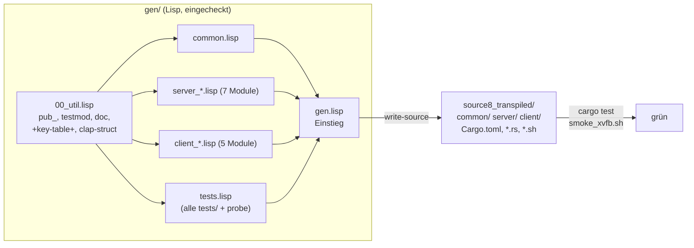

# Implementierungsplan: `source8_transpiled` — `source7_mvp` im Transpiler ausgedrückt

Ziel: derselbe MVP wie in `source7_mvp/` (Low-Bandwidth-Remote-Desktop,
640×640, PP-OCRv6-Text als Vektordaten + Rest als ein AV1-Still-Picture
pro Frame über TCP), aber nicht von Hand in Rust geschrieben, sondern aus
Common-Lisp-Quellen mit dem Transpiler **cl-rust-generator** erzeugt.
Ablage: neuer Workspace `source8_transpiled/` mit Generator-Verzeichnis
`gen/` (Lisp) plus erzeugtem Rust-Code (eingecheckt, reproduzierbar).

## 0. Transpiler-Entscheidung (wichtig, bitte zuerst lesen)

Der Prompt nennt den Polyglot-Generator
(`/workspace/src/cl-cl-generator/example/13_polyglot_generator`).
Dieser wurde evaluiert und **für diese Aufgabe verworfen**:

- Das Rust-Backend des Polyglot-Generators kennt nur `#[derive(Debug,
  Clone)]`, kein `unsafe`, keine Generics, keine `Result`-Propagation,
  keine Derive-Makros (`serde`, `clap`), keine Attribute-Makros
  (`#[macroquad::main]`), keine Lebensdauern (Belege:
  `SUPPORTED_FORMS.md` dort, `src/backend/rust/items.lisp`).
- `source7_mvp` braucht all das: `unsafe`-rav1d-FFI (`02_av1.rs`),
  generische Funktionen (`encode_msg<T>`, `serve_client<S, R>`),
  `serde`/`clap`-Derives, `macroquad::main`, Closures mit `move`.
- Mit dem Polyglot-Generator bestünde der Code zu ~90 % aus
  `rs:raw`-Strings — das nutzt keinen Transpiler-Vorteil und verletzt den
  Prompt-Geist („Vorteile des Transpilers ausnutzen").

Stattdessen wird **cl-rust-generator** (`plops/cl-rust-generator`,
Datei `rs.lisp`, Einstieg `write-source`/`emit-rs`) verwendet:

- Direkte S-Expression→Rust-Abbildung mit String-Escape-Hatch für alles
  Exotische (Generics, Lebensdauern, `self`, komplexe Muster).
- Lisp-Funktionen zur Transpile-Zeit + `,@`-Splices für repetitive Stücke
  — exakt was der Prompt fordert.
- Bewährt in diesem Repo (z. B. `examples/22_summarizer/gen*.lisp` mit
  `toolkit.lisp`-Helfern und `pub_`-Wrapper).
- DeepWiki-Doku eingeholt (`plops/cl-rust-generator`, siehe `deps.md`).

## 1. Was exakt zu liefern ist (Requirements)

1. `source8_transpiled/gen/` mit Lisp-Quellen:
   `gen.lisp` (Einstieg, schreibt alles), `00_util.lisp` (Helfer),
   je ein Modul pro Crate-Datei (`common_*.lisp`, `server_*.lisp`,
   `client_*.lisp`), jeweils < 600 Zeilen.
2. Der Generator erzeugt den kompletten Workspace: `Cargo.toml`
   (Workspace + 3 Crates), alle `src/*.rs`, `tests/*.rs`,
   `examples/probe.rs`, `scripts/smoke_xvfb.sh`, `README.md`,
   `collect.sh` — per `sbcl --load gen/gen.lisp` reproduzierbar.
3. Der erzeugte Code ist **verhaltensgleich** zu `source7_mvp`
   (gleiche Dateien, gleiche Tests, gleiche Testanzahlen:
   common 9, server-lib 26, server-loopback 3, client-lib 6,
   client-main 1, client-loopback 1; 2 ignored).
4. Transpiler-Vorteile sind sichtbar genutzt (keine 1:1-String-Kopie):
   - Eine Lisp-Tabelle `+key-table+` erzeugt **beide** Seiten des
     Tasten-Mappings (Server-`key_code`-Match + Client-`send_input`-Liste)
     aus einer Quelle.
   - Helfer `pub_`, `testmod`, `doc` (Modul-Doku), `err-map`
     (`.map_err(|e| format!(...))`), `clap-struct` (Config-Structs).
   - `,@(loop ...)`-Splices für repetitive Tests (z. B. Config-Optionen,
     Key-Tabellen, Padding-Sweep-Werte).
5. `cargo fmt --check`, `cargo clippy -- -D warnings`,
   `cargo test --workspace` sind grün; `./scripts/smoke_xvfb.sh`
   läuft Ende-zu-Ende (Xvfb + xterm + echte Modelle aus
   `../source6/models`, wie in `source7_mvp`).
6. `deps.md` (GitHub `org/projekt`-Pfade), `plan.md` (diese Datei),
   `task.md` (serielle Schritte), `walkthrough.md` (deutsch, mit
   Mermaid-Diagrammen, Learnings, Dockerfile-Paketen).

Offene Punkte, die der Prompt nicht nennt, die ich empfehle:

- **Byte-Vergleich als Abnahmekriterium**: Nach dem Generieren wird
  `diff -r source7_mvp source8_transpiled` (ohne `target/`, `gen/`,
  `Cargo.lock`) gefahren; Abweichungen werden einzeln begründet oder
  beseitigt. Das beweist Verhaltensgleichheit stärker als Tests allein.
- **Determinismus-Test**: Generator zweimal laufen lassen —
  byte-identische Ausgabe (der Transpiler schreibt nur bei Änderung).
- **`gen/README.md`**: Einstieg für Leser (SBCL-Aufruf, Dateiübersicht).
- **Keine Änderung am Transpiler selbst** (`rs.lisp` bleibt unangetastet):
  Lücken werden mit String-Escapes + Lisp-Helfern geschlossen. Falls doch
  eine Lücke sperrt, wird sie als Upstream-Issue dokumentiert.

## 2. Kontext-Dateien für den ausführenden Agenten

Der Agent soll sich diese Dateien ansehen (Reihenfolge = Einarbeitungspfad):

| Datei | Warum |
|---|---|
| `plan/20261003_03_transpiler/prompt.txt` | Der Auftrag (diese Aufgabe). |
| `source7_mvp/README.md`, `source7_mvp/deps.md` | Was der MVP tut, welche Crates/Modelle. |
| `source7_mvp/common/src/*.rs` (3 Dateien, 507 Zeilen) | Protokoll-Typen, Framing, YUV — kleinster Einstieg. |
| `source7_mvp/server/src/01_config.rs`, `02_capture.rs`, `05_av1.rs`, `06_input.rs` | Einfache Server-Module (Muster für Helfer). |
| `source7_mvp/server/src/04_tiles.rs`, `07_session.rs` | Änderungserkennung + Session-Schleife (Kernlogik). |
| `source7_mvp/server/src/03_ocr.rs` | Größtes Modul (500 Zeilen, ONNX) — zuletzt. |
| `source7_mvp/client/src/*.rs` (5 Dateien + `probe.rs`) | Client inkl. `unsafe`-Decoder und macroquad-App. |
| `source7_mvp/*/tests/*.rs`, `scripts/smoke_xvfb.sh` | Abnahmekriterien (müssen 1:1 mit). |
| `SUPPORTED_FORMS.md` (Repo-Wurzel) | Alle Transpiler-Formen mit Beispiel (aus Tests erzeugt). |
| `transpiler-tests.lisp` (Repo-Wurzel) | Exakte Ein-/Ausgabe-Paare bei Unklarheit (`case`, `if-let`, `dotimes` …). |
| `examples/22_summarizer/gen00_utils.lisp`, `toolkit.lisp`, `gen01_models.lisp` | Bewährtes Mehrdateien-Generator-Layout (`pub_`, Builder, `write-source`). |
| `examples/01_gcd/gen00.lisp` | Minimalbeispiel (`write-source`, `do0`, `defun`). |
| `plan/20261003_01_simplify/walkthrough.md` | Architektur-Verständnis (Protokoll, Paddings, Budget). |

Werkzeuge: `sbcl` (mit Quicklisp, `ql:register-local-projects` lädt
`cl-rust-generator` aus `~/quicklisp/local-projects`), `cargo`
(Edition 2024, `fmt`, `clippy`), `xvfb`/`xterm` für den Smoke.

## 3. Architektur des Generators



- Jedes `*-Modul.lisp` definiert genau eine Funktion `<name>-rs`, die den
  kompletten Dateiinhalt als `` `(do0 ...) `` zurückgibt; `gen.lisp` ruft
  `write-source` je Datei auf (Idiome aus `22_summarizer`).
- Nicht-Code-Dateien (`Cargo.toml`, `smoke_xvfb.sh`, `README.md`,
  `collect.sh`) werden als Lisp-Strings geschrieben (`write-text-file`,
  mit je einer Test-Assertion auf Inhalt/Stimmbarkeit).
- Konvention: Lisp-Symbole mit `-` werden zu Rust-`_` (Transpiler-Regel);
  Pfade mit `--` zu `::`; alles ohne eigene Form (Generics, Muster mit
  Struct-Varianten, Let-Chains, `const fn`) als String.

## 4. Risiken und Gegenmaßnahmen

| Risiko | Maßnahme |
|---|---|
| Transpiler-Form fehlt (z. B. Match-Guards, Let-Chains) | String-Escape für die eine Stelle; Stelle im Walkthrough listen. |
| Generierter Code kompiliert nicht | Pro Modul sofort `cargo check` (siehe `task.md`); Lisp-Fehler sind lokalisiert. |
| Clippy meldet Neues (z. B. `collapsible_if` nach Umformung) | Keine Umformung: Code 1:1 übernehmen, auch wenn das Strings erfordert. |
| SBCL/Quicklisp-Umgebung fehlt im Docker-Build | Generator läuft nur zur Entwicklungszeit; erzeugtes Rust ist ohne Lisp baubar (README dokumentiert das). |

## 5. Commit-Regeln für den ausführenden Agenten

Jeder `task.md`-Schritt endet mit genau einem Commit (nur wenn seine Tests
grün sind). Format: **Conventional Commits** mit umfassender Beschreibung:

```text
<typ>(<scope>): <kurze zusammenfassung im imperativ, kleingeschrieben>

<warum diese änderung, was sie bewirkt, wie verifiziert.
mehrere sätze sind erwünscht; testbefehle und deren ergebnis nennen.>

```

- Typen: `feat` (neues Generator-Modul / neue erzeugte Dateien),
  `fix` (Fehler im Generator oder erzeugtem Code), `test` (nur Tests),
  `docs` (nur `plan/`- und `*.md`-Dateien), `chore` (Build, fmt, Deps).
- Scope: `source8` (Generator + erzeugter Code) oder `plan`.
- Sprache: deutsch für den Fließtext, englischer Typ/Scope.
- Vor jedem Commit: `cargo fmt`, betroffene Tests, `git status` prüfen
  (keine fremden Dateien, kein `target/`).

## 6. Usage-Beispiele (Transpiler, aus DeepWiki + verifiziert)

```lisp
;; Minimal: Datei schreiben (DeepWiki plops/cl-rust-generator)
(write-source "/tmp/demo/src/main.rs"
  '(do0 (defun main () (println! (string "hello")))))

;; pub-Item (Idiom aus examples/22_summarizer)
(defun pub_ (form) `(space "pub" ,form))
`(do0 ,(pub_ '(defun f (x) (declare (type i32 x) (values i32))
                (return (+ x 1)))))
;; => pub fn f(x: i32) -> i32 { return (x)+(1) }

;; Generische Funktion: Name als String (Escape-Hatch, per Probe verifiziert)
`(defun "encode_msg<T: Serialize>" (m)
   (declare (type "&T" m) (values "Result<Vec<u8>, String>")) ...)
;; => fn encode_msg<T: Serialize>(m: &T) -> Result<Vec<u8>, String> { ... }

;; Unit-Varianten-Muster im Match (per Probe verifiziert)
`(case m ((scope ServerMsg Hello) 1) (t 0))
;; => match m { ServerMsg::Hello => { 1 }, _ => { 0 }, }
```
