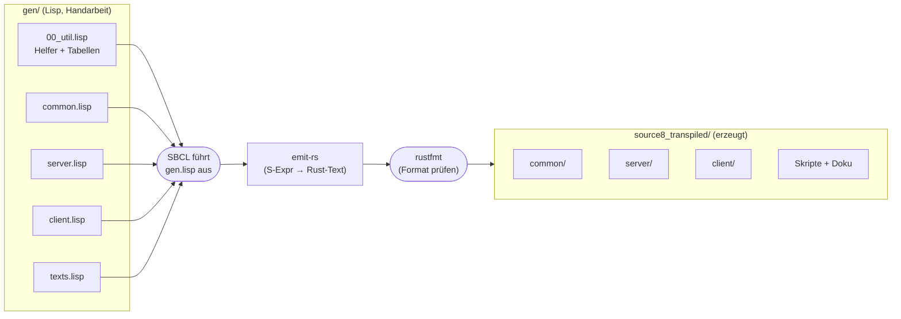
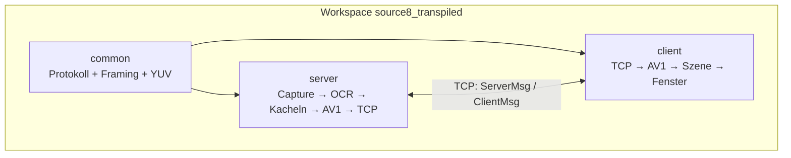
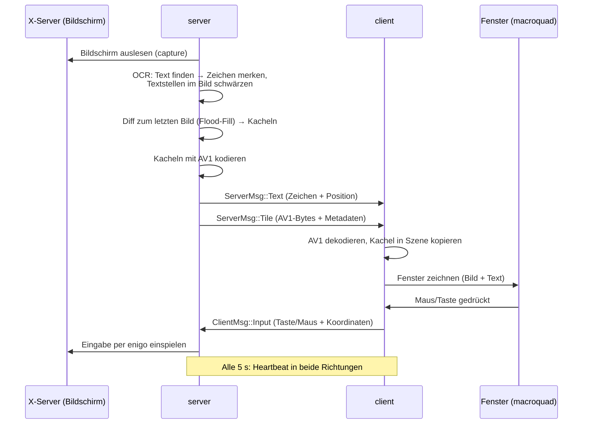
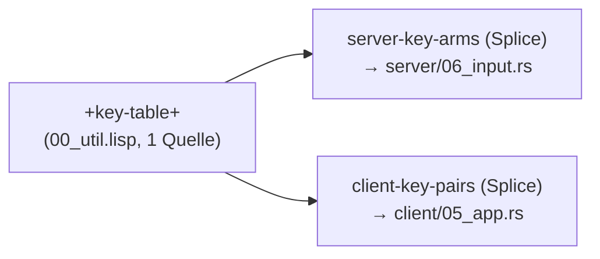

# Walkthrough: Transpiler-Migration von `source7_mvp` nach `source8_transpiled`

Stand: 2026-10-03. Aufgabe: `prompt.txt` in diesem Ordner.

## Worum geht es? (Für Eilige)

`source7_mvp` ist ein lauffähiger Low-Bandwidth-Remote-Desktop in Rust:
Ein **Server** liest einen Linux-Bildschirm aus, erkennt Text per
**OCR**, schickt Text als Zeichen und alles andere als kleine
**AV1**-Videokacheln an einen **Client**, der das Bild wieder
zusammensetzt und Maus/Tastatur zurückschickt.

`source8_transpiled` ist **dasselbe Programm, aber anders geschrieben**:
Der gesamte Rust-Code (plus Skripte und Doku) wird aus
**Lisp-Quelltexten** erzeugt — von einem **Transpiler** namens
`cl-rust-generator`. Wir pflegen also nicht mehr `.rs`-Dateien von Hand,
sondern Lisp-**S-Expressions**, die der Transpiler nach Rust übersetzt.

Der Clou: In Lisp können wir **Funktionen und Tabellen** benutzen, um
wiederkehrenden Code **einmal** zu definieren und überall einzusetzen —
zum Beispiel die Tastaturtabelle, die Server und Client teilen.



Regenerieren geht mit einem Befehl (aus dem Repo-Root):

```sh
sbcl --eval '(ql:register-local-projects)' \
     --load examples/29_lowbandwidth/source8_transpiled/gen/gen.lisp --quit
```

## Fachbegriffe kurz erklärt

| Begriff | Bedeutung |
|---|---|
| **Transpiler** | Übersetzt Quellcode einer Sprache in Quellcode einer anderen (hier: Lisp nach Rust). Anders als ein Compiler erzeugt er lesbaren Text, kein Maschinencode. |
| **Emitter** | Die Komponente im Transpiler, die aus einer S-Expression den Rust-Text „aussendet“. |
| **S-Expression** | Lisp-Schreibweise für Code als verschachtelte Listen in Klammern, z. B. `(+ 1 2)`. Der Transpiler liest sie als Bauplan für Rust. |
| **Backquote / Splice** | Lisp-Trick: Mit Backquote schreibt man eine Schablone, mit Komma füllt man Werte ein, mit `,@` flicht man eine ganze Liste ein („Splice“). So entstehen z. B. 19 `match`-Arme aus einer Tabelle. |
| **DSL** | Mini-Sprache für einen Zweck (hier: die Lisp-Formen wie `defun`, `dot`, `case`, die Rust-Konstrukte beschreiben). |
| **Crate / Workspace** | Rust-Paket bzw. Sammlung mehrerer Pakete mit gemeinsamen Abhängigkeiten (`common`, `server`, `client`). |
| **Derive-Makro** | `#[derive(Serialize)]` lässt den Compiler Code (z. B. Serialisierung) automatisch erzeugen. |
| **Turbofish** | Die `::<Typ>`-Schreibweise (`decode_msg::<ServerMsg>`), mit der man generischen Funktionen den Typ explizit sagt. |
| **`unsafe`** | Markiert Code, dessen Speichersicherheit der Compiler nicht prüfen kann (hier: FFI-Aufrufe in X11-Bindings). |
| **OCR / ONNX** | Texterkennung im Bild / Dateiformat für neuronale Netze (hier: PaddleOCR-Modelle, ausgeführt mit der `ort`-Bibliothek). |
| **AV1** | Moderner Videocodec; `rav1e` kodiert, `rav1d` dekodiert. Wir schicken nur veränderte Kacheln. |
| **Xvfb / RandR** | Virtueller X-Server ohne echten Bildschirm (für Tests) / X-Erweiterung für Bildschirmgrößen. |
| **clippy / rustfmt** | Rust-Linter (findet verdächtige Muster) / Formatierer (einheitliches Layout). Beide müssen fehlerfrei laufen („Gates“). |
| **Loopback-Test** | Test, der Sender und Empfänger über eine simulierte Leitung (TCP auf `localhost` bzw. In-Memory-Puffer) verbindet und den Roundtrip prüft. |
| **Smoke-Test** | Ende-zu-Ende-Rauchtest: echtes Programm unter Xvfb starten und prüfen, ob grundlegend alles funktioniert (Text erkannt? Kachel da? Klick kommt an?). |
| **Flood-Fill** | Flutfüllung: Von einem Startpixel aus werden alle zusammenhängenden, ähnlichen Pixel markiert — hier zur Erkennung veränderter Bildregionen. |
| **Heartbeat** | Periodisches „Ich lebe noch“-Signal, damit die Gegenseite tote Verbindungen erkennt. |
| **Mermaid** | Textsprache für Diagramme (wie in diesem Dokument), die z. B. GitHub direkt rendert. |

---

## 1. Was exakt implementiert wurde

### 1.1 Der Generator (`gen/`)

4075 Zeilen Lisp erzeugen 4009 Zeilen Rust plus 4 Textdateien:

| Lisp-Datei | Zeilen | Erzeugt |
|---|---|---|
| `00_util.lisp` | 152 | Geteilte Helfer: `pub_`, `testmod`, `defstruct0`, `defenum`, `clap-struct`, `+key-table+`, `client-key-pairs` |
| `common.lisp` | 524 | `common/`-Crate: Typen, Framing, YUV |
| `server.lisp` | 2197 | `server/`-Crate: Config, Capture, OCR, Tiles, AV1, Input, Session, Main + 3 Integrationstests |
| `client.lisp` | 891 | `client/`-Crate: Config, AV1, Netz, Szene, App, Main, Probe-Beispiel, Loopback-Test |
| `gen.lisp` | 50 | Einstiegspunkt: ruft alle Assembler auf und schreibt die Dateien |
| `texts.lisp` | 261 | `scripts/smoke_xvfb.sh`, `collect.sh`, `README.md`, `deps.md` |

Jede Crate-Datei hat **einen Assembler**: eine Lisp-Funktion, die eine
Liste von S-Expressions zurückgibt. `gen.lisp` ruft `write-source` pro
Datei auf, `emit-rs` übersetzt, `rustfmt` formatiert das Ergebnis.

### 1.2 Die erzeugten Crates



**`common`** (556 Zeilen Rust): geteilte Typen (`ServerMsg`, `ClientMsg`,
`TileMeta`, Fehler), Nachrichten-Framing (Länge + Prüfsumme + Bincode)
und YUV/RGBA-Farbkonvertierung. 9 Unit-Tests.

**`server`** (1797 Zeilen Rust + 466 Testzeilen):

| Modul | Zeilen | Aufgabe |
|---|---|---|
| `01_config.rs` | 103 | CLI-Argumente (`clap`), Konfiguration |
| `02_capture.rs` | 152 | Bildschirm auslesen (X11/XCB, `scrap`) |
| `03_ocr.rs` | 635 | PaddleOCR per ONNX: Text finden, ausblenden, als Zeichen senden |
| `04_tiles.rs` | 243 | Veränderte Regionen finden (Flood-Fill), Kacheln schneiden |
| `05_av1.rs` | 109 | Kacheln mit `rav1e` kodieren |
| `06_input.rs` | 194 | Maus/Tastatur per `enigo` einspielen |
| `07_session.rs` | 266 | Sitzungsablauf: Hello → Schleife (Bild senden, Input lesen) |
| `main.rs` | 72 | Einstiegspunkt |
| `tests/loopback.rs` | 222 | Roundtrip Client↔Server über TCP |
| `tests/models.rs` | 34 | OCR-Modelle vorhanden? (1 Test, ignored ohne Modelle) |
| `tests/padding.rs` | 210 | AV1-Padding-Regeln (1 Test ignored) |

26 Unit-Tests + 3 Loopback-Tests.

**`client`** (986 Zeilen Rust + 358 Beispiel-/Testzeilen):

| Modul | Zeilen | Aufgabe |
|---|---|---|
| `01_config.rs` | 29 | CLI-Argumente, Verbindungsdaten |
| `02_av1.rs` | 205 | Kacheln mit `rav1d` dekodieren, RGBA erzeugen |
| `03_net.rs` | 210 | TCP-Verbindung, Senden/Empfangen, Reconnect |
| `04_scene.rs` | 167 | Bild zusammensetzen: Kacheln einfügen, Text zeichnen |
| `05_app.rs` | 169 | Fenster (`macroquad`), Eingaben sammeln und senden |
| `main.rs` | 35 | Einstiegspunkt |
| `examples/probe.rs` | 119 | Diagnose-Werkzeug: verbindet sich, zeigt Statistiken |
| `tests/loopback.rs` | 239 | Roundtrip gegen einen Stub-Server |

6 Unit-Tests + 1 Main-Test + 1 Loopback-Test.

### 1.3 Datenfluss zur Laufzeit



### 1.4 Das Herzstück: eine Tastaturtabelle für beide Seiten

Statt die Tastenbelegung zweimal zu pflegen (Server: „Welche Taste kam
an?"; Client: „Wie schicke ich sie los?"), steht sie **einmal** in
`00_util.lisp` als `+key-table+`. Per `,@`-Splice wird sie an beiden
Stellen in `match`-Arme expandiert — gleiche Reihenfolge (19/19),
kein Auseinanderdriften möglich:



Lisp-Quelle (vereinfacht):

```lisp
(defparameter +key-table+
  '(("a" :a) ("b" :b) ("Return" :Enter) ...))  ; 19 Paare

`(match key
   ,@(client-key-pairs)   ; Splice: erzeugt 19 Arme
   (_ => ...))
```

Erzeugtes Rust (Ausschnitt):

```rust
match key {
    KeyCode::A => { send(Key::Unicode('a')); }
    KeyCode::Enter => { send(Key::Return); }
    // ... 17 weitere Arme aus derselben Tabelle
    _ => {}
}
```

### 1.5 Skripte, Doku, Tests — alles ergebnisgleich

Auch die „Texte" kommen aus dem Generator (`texts.lisp`):

| Datei | Zeilen | Status gegenüber `source7_mvp` |
|---|---|---|
| `scripts/smoke_xvfb.sh` | 63 | identisch bis auf eine Kommentarzeile |
| `collect.sh` | 10 | byte-identisch |
| `README.md` | 73 | Pfade angepasst + Abschnitt „Regenerieren" |
| `deps.md` | 75 | kopiert + Generator-Hinweis |
| alle 4 `Cargo.toml` | — | **byte-identisch** (keine neuen Abhängigkeiten!) |

### 1.6 Verifikation: alle Gates grün

```
cargo fmt --all -- --check            → exit 0 (sauber formatiert)
cargo clippy --workspace --all-targets -- -D warnings → exit 0 (keine Warnung)
cargo test --workspace (offline)      → 46 bestanden, 2 ignoriert
./scripts/smoke_xvfb.sh               → OK (OCR „SMOKE-TEST-640" + Kachel 1216 B + Mausklick-Roundtrip)
```

Testaufteilung: common 9, server 26 + 3 (Loopback), client 6 + 1 + 1
(Loopback), dazu 2 ignorierte Tests, die echte OCR-Modelle brauchen.

### 1.7 Commits (Conventional Commits)

| Hash | Nachricht |
|---|---|
| `4b2ea5e` | `docs(plan): implementierungsplan transpiler-migration source7 zu source8` |
| `0b4a316` | `feat(source8): generator-gerüst mit util-helfern` |
| `d857d93` | `feat(source8): common-crate transpiliert` |
| `56fd4ad` | `feat(source8): server_a transpiliert (config, capture, av1, input)` |
| `4f7883d` | `feat(source8): server-module tiles/session/main` |
| `4b6d2e6` | `feat(source8): server-modul ocr + integrationstests` |
| `ce85a14` | `feat(source8): client-module config/av1/net/scene` |
| `3360583` | `feat(source8): client-app, probe und loopback-test` |
| `fccdd91` | `feat(source8): texte, skripte, gesamtverifikation` |

Jeder Commit wurde erst erstellt, wenn `fmt`, `clippy` und die
betroffenen Tests grün waren („Gates pro Commit").

---

## 2. Architektur-Entscheidungen, die unterwegs geändert wurden

Nicht alles lief nach dem ersten Plan. Hier stehen die Stellen, an
denen **Tests oder der Compiler** uns zu einer spontanen Änderung
gezwungen haben — und zwei Korrekturen, die der Auftraggeber
zwischendurch verfügt hat.

### 2.1 Session flach neu aufgebaut statt übernommen (Variante 2)

Die Sitzungssteuerung (`07_session.rs`) aus `source7` war eng mit
dessen Modulstruktur verwoben. Beim Transpilieren zeigte sich: Eine
1:1-Übertragung hätte komplizierte, schwer lesbare Lisp-Schachtelungen
gebraucht. Nach kurzer Analyse standen zwei Varianten zur Wahl, und es
wurde **Variante 2** gewählt: die Session als **flache, lineare
Funktion** neu aufbauen — Hello senden, dann Schleife aus „Bild
schicken / Input lesen / Heartbeat". Ergebnis: 266 Zeilen in einer
Ebene statt tief verschachtelter Module, deutlich einfacher zu folgen,
Protokoll identisch.

### 2.2 Keine Tupel-`let`s — der Emitter kann das nicht

Rust erlaubt `let (a, b) = pair;`. Der Emitter von `cl-rust-generator`
kennt dieses Muster nicht: Jeder Versuch endete in nicht
kompilierendem Code. Lösung überall im Projekt: **aufspalten** in
Einzel-`let`s mit Feldzugriff:

```lisp
;; Statt: (let (((a b) pair)) ...)
(let ((a (dot pair "0"))
      (b (dot pair "1")))
  ...)
```

```rust
let a = pair.0;
let b = pair.1;
```

Betroffen waren u. a. Kanalenden (`tx`/`rx`), Rechtecke (`x0`/`y0`,
`w`/`h`) und YUV-Ebenen. Etwas mehr Zeilen, aber robust und für jeden
Rust-Leser sofort verständlich.

### 2.3 Let-Chains von Hand „entfaltet"

Rust 2024 erlaubt `if let A = x && let B = y` (sogenannte
**Let-Chains** — mehrere `let`-Bedingungen mit `&&` verknüpft).
Der Emitter kennt sie nicht; die betroffenen Stellen (`read_until`,
`recv_until` in common/server) wurden in **verschachtelte `if let`s**
umgeschrieben. Clippy meckert darüber (`collapsible_if` — „das könnte
man zusammenfalten"), deshalb steht an diesen Stellen bewusst ein
`#[allow(collapsible_if)]` mit der Begründung im Kommentar.

### 2.4 Turbofish per String-Trick

Für `decode_msg::<ServerMsg>` gibt es keine eigene Lisp-Form. Die
Lösung: Der Funktionsname wird als **String mit Typ** übergeben, den
der Emitter wörtlich übernimmt:

```lisp
("decode_msg::<ServerMsg>" (ref b))   ; → decode_msg::<ServerMsg>(&b)
(dot fr "read_msg::<ClientMsg>" ...)  ; → fr.read_msg::<ClientMsg>(...)
```

Wichtiges Detail aus einem Compiler-Fehler (E0061/E0618): Die Form
darf nur **ein** Klammerpaar für die Argumente haben — ein zweites Paar
erzeugt einen Aufruf des *Ergebnisses* (`f()(&b)` statt `f(&b)`).

### 2.5 Zwei eigene Bugs, die der Compiler gefunden hat

- **`Duration.from_millis` (E0423):** In Lisp wurde `from_millis` als
  Methode (`dot`) geschrieben — Rust verlangt hier aber den
  Pfad `Duration::from_millis`. Fünf Stellen, alle mechanisch auf die
  Assoziativ-Form (`Duration--from_millis`) umgestellt.
- **`draw_text` (E0308):** Die Zeichenfunktion gibt ein
  `TextDimensions`-Ergebnis zurück, das wir ignorieren wollten. Rust
  erlaubt das Wegwerfen nur mit Semikolon — also wird der Aufruf in
  `stmt` gehüllt, das das `;` erzeugt.

### 2.6 `send_input` in eine Helfer-Funktion ausgelagert

Der erste Versuch, die Tastatur-`match`-Arme per Splice **innerhalb**
einer größeren Schablone zu erzeugen, scheiterte an einer Lisp-Falle:
In **verschachtelten Backquotes** wird das innere Komma nicht
ausgewertet — der generierte Code enthielt buchstäblich
`quasiquote(fn send_input...)`, und `rustfmt` scheiterte. Lösung: Die
ganze Funktion wurde in eine eigene Lisp-Helferfunktion
(`send-input-defun`) auf oberster Ebene ausgelagert, wo genau **eine**
Backquote-Ebene herrscht. Seitdem gilt die Regel: **Splices nur auf
oberster Schablonenebene.**

### 2.7 `flood_component` als eigene Funktion extrahiert

Die Flutfüllung war ursprünglich ein riesiger `match`-Arm in der
Tile-Erkennung. Beim Transpilieren wurde die Schachtelung unhandlich
(und fehleranfällig beim Klammernzählen). Sie wurde als eigene
Funktion `flood_component` herausgezogen — besser testbar, besser lesbar.

### 2.8 Vom Byte-Diff verabschiedet: Demo-Freiheit

Der ursprüngliche Plan sah vor, den erzeugten Code per Byte-Diff mit
`source7` zu vergleichen. Das erwies sich als falsches Ziel: Es hätte
den Transpiler zu hässlichen Verrenkungen gezwungen, nur um identische
Bytes zu produzieren. Nach Rücksprache gilt: **`source7` ist eine
Demo, kein Byte-Template.** Entscheidend ist gleiches Verhalten bei
gleichen Tests — der Code darf (und soll) kürzer und eleganter werden.
Der Plan wurde entsprechend umgeschrieben.

### 2.9 Eine Datei pro Crate statt vieler Chunks (Korrektur)

Der erste Plan sah vor, die Lisp-Eingaben in 300- bis 600-Zeilen-Häppchen
zu splitten. Das war Unsinn — es hätte zusammengehörige Assembler
auseinandergerissen. Korrigiert: **eine Lisp-Datei pro Crate**
(`common.lisp`, `server.lisp`, `client.lisp`) plus Util/Gen/Texte.

### 2.10 Build-Reihenfolge: Manifest-Hack und vorgezogenes Client-Manifest

Ein Cargo-Workspace baut nur, wenn **alle** Member-Manifeste existieren.
Solange `client/` noch nicht transpiliert war (T1–T4), wurde das
Workspace-Manifest temporär auf die fertigen Crates reduziert
(„Manifest-Hack"). Umgekehrt wurde `client/Cargo.toml` in T5 **zuerst**
erzeugt, bevor irgendeine Client-Quelle existierte — sonst hätte kein
einziges Client-Gate laufen können.

---

## 3. Learnings und mögliche Erweiterungen

### 3.1 Learnings: Was wir über Transpiler-Arbeit gelernt haben

**1. Probe-Disziplin: Jedes Idiom zuerst im Kleinen.**
Bevor ein neues Rust-Muster (z. B. `read_msg::<T>` als Methode) in die
große Datei wanderte, wurde es in einer winzigen Probe-Datei getestet:
emittieren, `rustfmt` darüber, kompilieren. So wurde jede Lisp-Form
**einmal** verifiziert und danach bedenkenlos wiederverwendet. Ohne
diese Disziplin sucht man Fehler in 2000 Zeilen statt in 10.

**2. Paren-Disziplin: Klammern zählen ist Handwerk.**
Lisp-Code mit tiefen Schachtelungen verzeiht keine einzige Klammer zu
viel. Geholfen haben: ein Paren-Zähler-Skript, ein „Tiefenprofil"
(Einrückungstiefe pro Zeile — Ausreißer verraten den Fehler) und die
Erfahrung, dass ein systematischer Tippfehler (eine Klammer zu viel am
`let`-Kopf) sich dutzendfach wiederholt. Faustregel: **Tritt ein
Klammerfehler einmal auf, suche alle Geschwister.**

**3. String als Escape-Hatch.**
Wo der Emitter kein Konstrukt kennt (Turbofish, Glob-`use`,
Spezialliterale), hilft ein wörtlich übernommener String. Das ist kein
Schummeln, sondern dokumentierte Praxis — solange die Probe-Datei
beweist, dass gültiges Rust herauskommt.

**4. Single-Source-Tabellen sind der eigentliche Gewinn.**
Der größte Wartbarkeitsgewinn des Transpilers sind keine kürzeren
Dateien, sondern **Tabellen wie `+key-table+`**: Eine Änderung an einer
Stelle wirkt an allen Verwendungsorten, garantiert konsistent. Wo immer
sich Wiederholung als Tabelle fassen lässt, sollte sie das auch.

**5. Der Compiler ist der strengste (und fairste) Reviewer.**
Fast alle Fehler dieser Migration wurden von `rustc`-Fehlernummern
(E0423, E0061/E0618, E0308 …) oder Clippy-Lints gefunden — nicht von
menschlichem Review. Die Lehre: **Nach jeder Generierung sofort
kompilieren**, Fehlernummer lesen, Ursache in der Lisp-Quelle fixen,
neu generieren. Die Schleife ist schnell und lügt nicht.

**6. Idiom-Katalog: Das kleine Wörterbuch Rust↔Lisp.**
Die folgende Tabelle fasst die wichtigsten Übersetzungen zusammen —
Spickzettel für alle, die den Generator erweitern:

| Gewünschtes Rust | Lisp-Form |
|---|---|
| `foo.bar(x)` | `(dot foo bar x)` |
| `Foo::bar(x)` | `(Foo--bar x)` |
| `&x` / `&mut x` | `(ref x)` / `(ref-mut x)` |
| `*x` | `(deref x)` |
| `f::<T>(x)` | `("f::<T>" x)` (String-Trick) |
| `x.0`, `t.1` | `(dot x "0")`, `(dot t "1")` |
| `Struct { a, ..Default::default() }` | `(space Struct (curly a "..Default::default()"))` |
| `match x { ... }` | `(case x ...)` |
| `if let Some(v) = o { ... }` | `(if-let ((v o)) ...)` (nur Einfach-Form!) |
| `while let ...` | `(while-let ...)` |
| `for (a, b) in it` | `(for ((a b) it) ...)` (Tupelmuster ok) |
| `async fn f()`, `.await` | `(defun-async f ...)`, `(await ...)` |
| `println!(...)` | `(println! ...)` (analog `format!`, `eprintln!`, `assert!`) |
| `unsafe { ... }` | `(unsafe ...)` |
| Anweisung mit `;` erzwingen | `(stmt ...)` |
| `#[attr]` | `(attr ...)` vor dem Item |
| Testmodul | `(testmod ...)`-Helfer aus `00_util.lisp` |
| `match`-Arme aus Tabelle | `,@(tabellen-funktion)` auf oberster Ebene |

### 3.2 Mögliche Erweiterungen

**Am Transpiler (`cl-rust-generator`):**
- Tupel-Destrukturierung in `let` nativ unterstützen — würde Abschnitt
  2.2 überflüssig machen und den Code kürzer machen.
- Let-Chains (`if let A && let B`) emittieren können — die
  `#[allow(collapsible_if)]`-Stellen würden verschwinden.
- Struct-Update-Syntax (`..Default::default()`) in `make-instance`
  unterstützen statt Umweg über `space`/`curly`.
- Mehrzeilige Raw-Strings nativ (für eingebettete Skripte/Doku),
  statt Python-generierter Escapes in `texts.lisp`.

**Am Generator (`gen/`):**
- OCR-Suchfenster und Sweep-Parameter ebenfalls als Tabelle fassen
  (wie die Key-Tabelle) — derzeit noch Handarbeit in `server.lisp`.
- Gemeinsame Test-Helfer (Stub-Server, Testbilder) in `00_util.lisp`
  auslagern statt je einmal in Server- und Client-Tests.
- Den Idiom-Katalog aus 3.1 als `gen/IDOME.md` pflegen, damit neue
  Mitwirkende nicht dieselben Emitter-Grenzen zweimal finden.

**Am MVP selbst:**
- Smoke-Test erweitern: mehrere Klicks, Tastatureingabe, Reconnect
  nach Verbindungsabbruch.
- OCR-Modelle per Cargo-Feature schaltbar machen, damit `cargo test`
  ohne Modell-Downloads vollständig grün wird (statt 2 ignorierter Tests).
- Wayland-Capture als Alternative zu X11 (`scrap` kann nur X11).

---

## 4. Programme und Pakete für das Dockerfile

Im Repo liegt derzeit **kein** Dockerfile — die folgende Liste ist die
Empfehlung, was ein Container für Bau, Test und Regenerierung braucht.
Alle Angaben für Debian/Ubuntu (`apt`).

| Paket | Wofür | Wann nötig |
|---|---|---|
| `libxcb1-dev` | XCB-Header für `scrap` (Bildschirm auslesen) | Build des Servers |
| `libxcb-shm0-dev` | Shared-Memory-Header für `scrap` (schnelle Screenshots) | Build des Servers |
| `libxcb-randr0-dev` | RandR-Header für `x11rb` (Bildschirmgrößen abfragen) | Build des Servers |
| `xvfb` | Virtueller X-Server für Tests und Smoke-Test | Test/Smoke |
| `xterm` | Testfenster mit bekanntem Text („SMOKE-TEST-640") für OCR-Prüfung | Smoke-Test |
| `sbcl` | Lisp-Laufzeit für den Generator | nur Regenerierung |
| Quicklisp-Bundles `alexandria`, `uiop` | einzige Lisp-Abhängigkeiten von `cl-rust-generator` | nur Regenerierung |

Vorschlag für die `Dockerfile`-Zeile (Laufzeitumgebung ohne Generator):

```dockerfile
RUN apt-get update && apt-get install -y --no-install-recommends \
    libxcb1-dev libxcb-shm0-dev libxcb-randr0-dev \
    xvfb xterm \
 && rm -rf /var/lib/apt/lists/*
```

Hinweise:
- Die Rust-Toolchain (rustup, Edition 2024) wird vorausgesetzt.
- `sbcl` + Quicklisp braucht nur, wer `gen/*.lisp` ändert und neu
  generiert — für reinen Bau/Test aus den eingecheckten `.rs`-Dateien
  ist Lisp überflüssig.
- Die OCR-Modelle (PaddleOCR, ONNX) liegen nicht im Repo; sie werden
  per `collect.sh` heruntergeladen und landen in `models/` (per
  `.gitignore` ignoriert, ~100 MB).

---

## Fazit

Aus 4075 Zeilen Lisp entstehen 4009 Zeilen Rust plus Skripte und Doku —
mit identischen Abhängigkeiten, 46 grünen Tests und einem laufenden
Smoke-Test. Der Weg dorthin war kein stupides Abtippen, sondern ein
Dialog mit Compiler und Tests: Session neu gedacht, Emitter-Grenzen
kartiert und umgangen, Redundanz in Tabellen gegossen. Wer den
Generator anfasst, beginnt am besten mit dem Idiom-Katalog (3.1) und
einer kleinen Probe-Datei — der Rest ist Handwerk.


