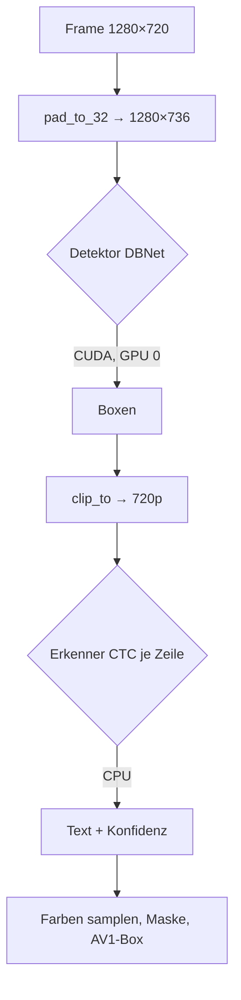
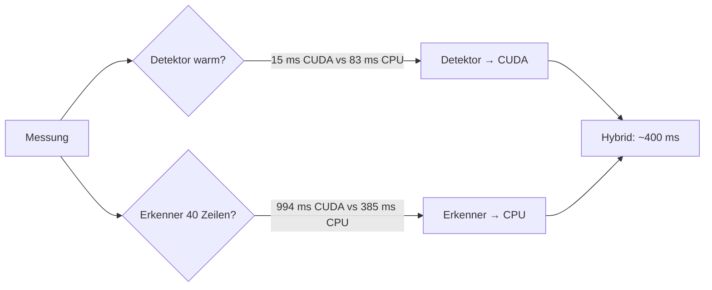
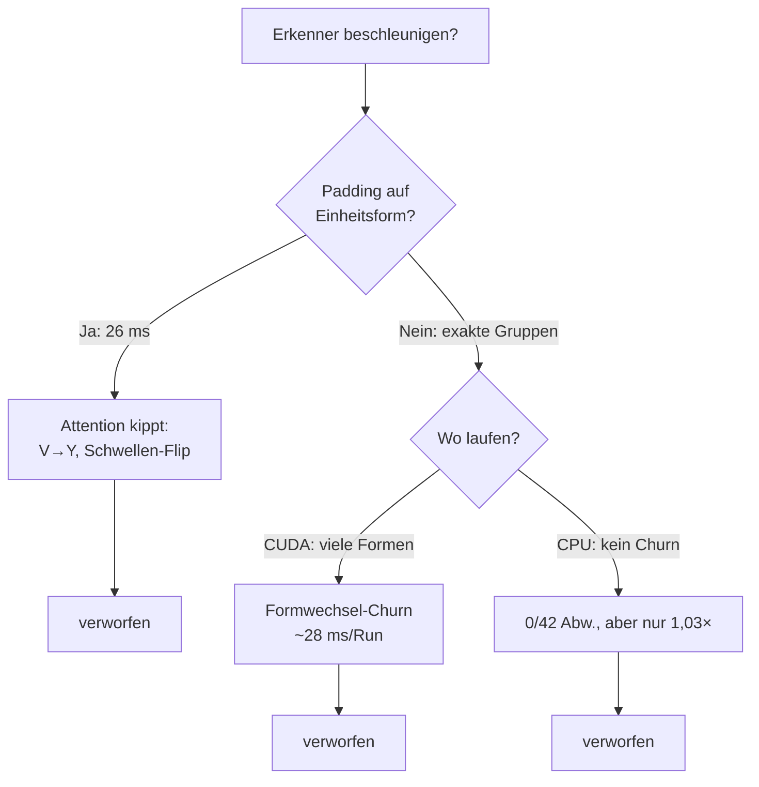

# Walkthrough: GPU-Server mit 1280×720 (`source9_gpu`)

Ziel war: Die KI des Low-Bandwidth-Remote-Desktops soll auf der NVIDIA RTX A4000
rechnen statt auf der CPU, und der Server soll einen 1280×720-Bildschirm lesen
und kodieren. Ergebnis ist `source9_gpu` — eine Weiterentwicklung von
`source7_mvp` (640×640, reine CPU). Dieses Dokument erklärt, was genau gebaut
wurde, was unterwegs umentschieden werden musste und was man daraus mitnimmt.

Fachbegriffe werden beim ersten Auftreten kurz erklärt. Alle Messwerte stammen
von echten Läufen auf diesem Rechner (RTX A4000, 16 GB, CUDA 13.4, cuDNN 9).
Plan und Tasks dazu: [`plan.md`](plan.md), [`task.md`](task.md) im selben Ordner.

## 1. Was exakt implementiert wurde

### 1.1 Protokoll v2: 1280×720 statt 640×640

Das MVP kannte genau eine Bildgröße: `SIZE = 640`. Jetzt gibt es Breite und Höhe
getrennt, und die Protokollversion wurde erhöht, damit sich alte und neue
Clients/Server nicht versehentlich mischen (der Server lehnt fremde Versionen
beim `Hello` ab):

```rust
// common/src/01_types.rs
/// v2: 1280×720 statt 640×640 (inkompatibel zu v1).
pub const PROTO_VERSION: u16 = 2;
/// Feste Bildbreite (GPU: immer 1280×720).
pub const WIDTH: u32 = 1280;
/// Feste Bildhöhe (GPU: immer 1280×720).
pub const HEIGHT: u32 = 720;
```

Angepasst wurden: Server-Capture (`ScrapSource::open(x, y, WIDTH, HEIGHT)`),
Client-Fenster und Szene (`04_scene.rs`: Canvas jetzt `W * H` statt `N * N`,
`blit` prüft beide Achsen), alle Tests sowie das Smoke-Skript (Xvfb mit
`1280x720x24`). Das AV1-Kodierprinzip blieb: **eine** Bounding-Box pro Frame
als AV1-Still-Picture — ein *Still-Picture* ist ein einzelnes, unabhängig
dekodierbares Intra-Bild, also quasi „AVIF ohne Container“.

### 1.2 Hybrid-KI: Detektor auf der GPU, Erkenner auf der CPU

**Execution Provider (EP)** heißt bei ONNX Runtime die austauschbare
Rechen-Schicht: derselbe Modell-Graph kann auf CPU, CUDA oder TensorRT laufen.
Die Crate `ort` lädt dafür passende Binaries; mit dem Cargo-Feature `cuda`
kommt ein build mit CUDA-Unterstützung:

```toml
# server/Cargo.toml
ort = { version = "2.0.0-rc.13", default-features = false,
        features = ["download-binaries", "copy-dylibs", "tls-native", "std", "cuda"] }
```

Der Clou: `ort-sys` erkennt das installierte CUDA 13 und lädt ONNX Runtime 1.28
mit CUDA-13-EP (`x86_64-unknown-linux-gnu+cuda13,tensorrt,nvrtx`) — exakt
passend zu CUDA 13.4 + cuDNN 9 auf diesem Rechner. **Kein einziges apt-Paket
war dafür nötig**, und es kam **keine neue Rust-Abhängigkeit** dazu.

Die Session-Erzeugung versucht CUDA explizit — `error_on_failure` verhindert,
dass ein kaputtes CUDA still auf CPU zurückfällt (dann wüsste niemand, dass die
GPU untätig ist). Der Fallback passiert stattdessen sichtbar, mit Grund:

```rust
// server/src/03_ocr.rs
fn session(path: &str, threads: usize, want_cuda: bool)
    -> Result<(Session, &'static str), String>
{
    let build = |cuda: bool| -> Result<Session, String> {
        // ... Builder wie bisher (Level 3, Threads) ...
        if cuda {
            b = b.with_execution_providers([ort::ep::CUDA::default()
                .with_device_id(0)
                .build()
                .error_on_failure()])
                .map_err(|x| format!("{path}: {x}"))?;
        }
        b.commit_from_file(path).map_err(e)
    };
    if want_cuda {
        match build(true) {
            Ok(s) => return Ok((s, "CUDA")),
            Err(e) => eprintln!("[ort] {path}: CUDA fehlgeschlagen ({e}) — CPU-Fallback"),
        }
    }
    build(false).map(|s| (s, "CPU"))
}
```

Warum Hybrid und nicht alles auf die GPU? Das hat die Messung entschieden
(siehe Abschnitt 2). Der Aufteilung liegt ein simples Prinzip zugrunde:

- **Detektor (DBNet)** — *compute-gebunden*: ein großer Durchlauf über das
  ganze Bild. Rechenlast hoch, ein Transfer über *PCIe* (die Verbindung
  zwischen CPU und Grafikkarte). GPU gewinnt haushoch.
- **Erkenner (CTC)** — *formwechsel-gebunden*: ~40 Durchläufe (je Textzeile),
  jeder mit anderer Bildbreite. CUDA zahlt pro Formwechsel ~28 ms statt ~1 ms
  (Speicher-/Kernel-Setup, s. Abschnitt 2). CPU ist formwechsel-robust und
  gewinnt.

*DBNet* findet Text**boxen**, *CTC* (*Connectionist Temporal Classification*)
liest danach den **Inhalt** jeder Box.



Der aktive Provider steht beim Start im Log und ist per `Ocr::ep()` abfragbar
(`"CUDA+CPU"` oder `"CPU"`). `--cpu` erzwingt reinen CPU-Betrieb:

```
[ort] execution provider: CUDA+CPU (det: CUDA, rec: CPU)
[server] lauscht auf 127.0.0.1:7878 (1280x720@0,0, q=180)
```

### 1.3 Padding statt Tiling für das KI-Modell

DBNet ist *voll-convolutional*: Es akzeptiert jede Eingabegröße, solange Breite
und Höhe Vielfache von 32 sind. 1280 ist es (40×32), 720 nicht (22,5×32).
Statt das Bild zu kacheln (*Tiling*: viele Teilbilder + Zusammenfügen der
Boxen mit Überlappungs-Logik), wird unten mit **Kanten-Replikation** auf
1280×736 aufgefüllt — die letzte Zeile wird wiederholt, sodass keine künstliche
Bildkante entsteht, die der Detektor als Text missverstehen könnte:

```rust
// server/src/03_ocr.rs
pub fn pad_to_32(img: &RgbImage) -> (RgbImage, u32, u32) {
    let (w, h) = (img.width(), img.height());
    let (pw, ph) = (w.div_ceil(32) * 32, h.div_ceil(32) * 32);
    let mut out = RgbImage::new(pw, ph);
    for y in 0..ph {
        let sy = y.min(h - 1);
        for x in 0..pw {
            out.put_pixel(x, y, *img.get_pixel(x.min(w - 1), sy));
        }
    }
    (out, w, h)
}

/// Schneidet `r` auf `w`×`h` zu; `None` bei Boxen ganz außerhalb
/// (z. B. in der Padding-Zone unterhalb von 720).
pub fn clip_to(r: Rect, w: u32, h: u32) -> Option<Rect> { /* ... */ }
```

Erkennung, Farbsampling und Maske laufen danach auf dem **Original** — die
Koordinaten oberhalb von 720 sind in beiden Bildern identisch.

### 1.4 Timing-Log als GPU-Nachweis

Jeder `Ocr::text()`-Durchlauf misst Detektor- und Erkenner-Zeit; die Session
loggt sie bei `-v`. So sieht man ohne Profiler, wo die Zeit bleibt:

```
[frame 1] 1 Texte (det 490.2 ms, rec 9.0 ms), 1 Kacheln, 1324 B
[frame 2] 1 Texte (det 14.2 ms, rec 7.9 ms), 0 Kacheln, 0 B
```

(Frame 1 zahlt den CUDA-Kaltstart, danach ist der Detektor bei ~14 ms.)

### 1.5 Modelle per Symlink, Tests, Client

- `source9_gpu/models` → Symlink auf `../source7_mvp/models` (echte Dateien,
  nicht im Git; Pfad in `.gitignore` ergänzt). `--models` bleibt als Option.
- Client: Fenster, Szene und Maus-Clamping auf 1280×720; Rest unverändert.
- Tests: Unit-Tests für `pad_to_32`/`clip_to`; `models`-Test assertiert EP,
  Textmenge (> 20 Zeichen), Boxen-im-Bild und deterministische Wiederholung;
  `padding`-Sweep und Smoke laufen auf 720p-Xvfb.

### 1.6 Verifikation im Überblick

Alles auf diesem Rechner beobachtet, nichts übernommen:

- `cargo test --workspace`: 12 Suiten grün (u. a. 28 Server-Unit-Tests).
- `models`-Test: `EP=CUDA+CPU`, 40 Zeilen / 2050 Zeichen, Detektor warm 15 ms,
  Erkenner 385 ms; zweiter Durchlauf bitgleich.
- `padding`-Sweep: Marker `PADDING-SWEEP-720` über den Produktpfad gefunden,
  REC_PAD=4 und MASK_PAD=6 halten (MVP-Konstanten gelten auch bei 720p).
- `smoke_xvfb.sh`: OK — Probe meldet Text + Kachel, Mausklick kommt in `xev`
  an, Server loggt Eingaben und RandR-Ursprung `+0+0`.
- `nvidia-smi` während eines Laufs: `lbw-server` mit 440 MiB GPU-Speicher.
- `cargo fmt --check` und `cargo clippy` (eigener Code) sauber.
- Commits (Conventional Commits, aufsteigend): `2494335` docs Plan/Tasks,
  `314cfed` feat Implementierung, `8b60c19` docs Walkthrough, `fdd04de` docs
  Aufwand, `4d0008f` fix Formwechsel-Befund, `81b4fed` docs Batching-Befund,
  `f0e3956` docs Verkettungs-Befund.

## 2. Architektur-Entscheidungen, die Tests erzwungen haben

### 2.1 Voll-CUDA → Hybrid (die große Umentscheidung)

Der Plan sagte: alles auf die GPU. Die Messung sagte: falsch. Auf dem
720p-Testbild (40 Textzeilen, 2050 Zeichen):

| EP | Detektor kalt | Detektor warm | Erkenner warm (40 Zeilen) |
|---|---|---|---|
| CUDA (beide) | 437 ms | **14,5 ms** | 994 ms (~25 ms/Zeile) |
| CPU (beide) | 118 ms | 83 ms | ≈420 ms (~11 ms/Zeile) |
| **Hybrid (det→CUDA, rec→CPU)** | 431 ms | **15 ms** | **385 ms** |

„Kalt“ ist der erste Durchlauf (CUDA-Kontext + *cuDNN-Autotune*: ONNX Runtime
probiert beim ersten Mal per *Exhaustive-Search* alle Faltungs-Algorithmen
durch — langsam einmalig, schnell für immer). „Warm“ ist jeder weitere.

Lesart: Der Detektor ist auf CUDA **6× schneller** als auf CPU (15 vs. 83 ms).
Der Erkenner ist auf CUDA **2× langsamer** (994 vs. ~420 ms). Voll-CUDA wäre in
Summe (~1000 ms) sogar langsamer als Voll-CPU (~500 ms) gewesen — der Hybrid
(~400 ms) schlägt beide. Konsequenz im Code: `Recognizer::new` nimmt gar keinen
Provider mehr (immer CPU, dokumentiert), `Detector::new` bekommt ihn.

**Korrektur (Nachtrag):** Die erste Fassung dieses Dokuments gab dem PCIe-
Transfer die Schuld („40 PCIe-Roundtrips“). Das war falsch. Eine Nachmessung
mit fester Zeilenbreite zeigt CUDA mit 1,3 ms pro Lauf *inklusive* Transfers
4× schneller als CPU (7,3 ms). Die wahre Ursache: **Jede Zeile hat eine andere
Breite, und CUDA zahlt pro Formwechsel ~28 ms statt ~1 ms** — Speicherplanung
und Kernel-Setup werden bei jedem formverschiedenen Lauf neu gemacht (der Cache
greift offenbar nur bei identischer Wiederholungsform: 40 Läufe gruppiert nach
Breite dauern 256 ms, verschachtelt 1125 ms). Weder `Heuristic`-Suche (1013 ms)
noch PCIe sind der Treiber; CPU ist schlicht formwechsel-robust. Diese
Erkenntnis macht Batching (ein Lauf, eine Form) zum logischen nächsten Schritt
(siehe unten).



### 2.2 Padding statt Tiling (bestätigt, nicht geändert)

Der Plan vermutete bereits: kein Tiling nötig. Der `models`-Test beweist es:
Alle 40 Zeilen werden auf dem gepaddeten Vollbild gefunden, alle Boxen liegen
nach dem Clip im 720p-Bild. Tiling hätte Stitching-Logik (doppelte Boxen an
Kachelgrenzen verschmelzen, *NMS*) für null Nutzen bedeutet.

### 2.3 Kleinigkeit: Loopback-Test pinnt Protokollversion

Der Client-Loopback-Test assertierte `version: 1` hartkodiert und schlug nach
dem Versionssprung fehl — kein Produktfehler, sondern ein Test, der zu viel
wusste. Jetzt nutzt er `PROTO_VERSION` wie der Server-Test schon immer.

### 2.4 Batching versucht und verworfen (Negativ-Befund)

Auf die Frage „Erkenner batchen?“ wurde beides implementiert und vermessen —
und beides wieder verworfen. Ein Äquivalenztest (Batch vs. einzeln, 42 Zeilen)
diente als Tripwire:

- **Bucket-Batching auf CUDA** (3 Breiten-Buckets, 1 Run pro Bucket): schnell
  (Batch 40 in 26 ms statt 1125 ms einzeln), aber **ändert die Erkennung**.
  Die Transformer-Attention mischt die Pad-Timesteps ein: Kurze Zeilen kippen
  (`"V"`→`"Y"`, `"个"`→`"←"`, `" 1"`→`"ā"`), Konfidenzen wackeln überall
  (0,99→0,98), und eine Zeile rutscht dadurch sogar über die
  `MIN_TEXT_CONF`-Schwelle (0,15→0,51) — das ändert die gesendeten `TextItems`.
  Ohne Ground-Truth-Korpus ist so eine Änderung nicht validierbar → Tripwire
  blieb rot → verworfen.
- **Exaktes Batching auf CPU** (Gruppen gleicher Breite, kein Zusatz-Padding):
  **0/42 Zeilen weichen ab** — aber nur 1,03× schneller (371 vs. 385 ms), weil
  fast jede Zeile eine eigene Breite hat (fast so viele Runs wie Zeilen) und
  der CPU-Run-Overhead winzig ist. Rund 80 Zeilen Code für 3 % → ebenfalls
  verworfen (revertiert; Stand: Hybrid mit Einzel-Läufen wie zuvor).



Trilemma für dieses Modell: exakte Tensoren brauchen viele Formen (CUDA
unbezahlbar), wenige Formen brauchen Padding (Attention kippt), CPU hat kaum
Overhead (Batching spart nichts). Echte Hebel lägen woanders (siehe unten).

### 2.5 Verketten statt Padding? — Nein, dreifach nein (Sonde)

Naheliegend: Zeilen ohne Padding aneinanderhängen (Streifen mit Trennstegen,
ein Run pro Streifen). Eine Wegwerf-Sonde (42 echte Zeilen, exakte
Resize-Mathematik, Substring-Orakel) lehnt das aus drei unabhängigen Gründen ab:

1. **Übersprechen frisst Zeichen.** Im einzigen geteilten Streifen (8 kurze
   Zeilen) gehen 4/8 verloren: `"V"`→`"Y"`, `"X"`→`"x"` (Case-Flip), `"个"`
   und `"1"` verschwinden ganz. Echte Nachbar-Texte stören die Attention noch
   stärker als graues Padding (gleiche Kipprichtung `V`→`Y` wie dort).
2. **Packen spart fast keine Runs.** 42 Zeilen → 35 Streifen: UI-Zeilen sind
   zu breit, um sich 960 px zu teilen. Ersparnis auf CPU: ~7 Runs × ~2 ms.
3. **Formenproblem bleibt.** Streifenbreiten streuen genauso wie Zeilenbreiten
   (CUDA-Churn), Einheitsbreite bräuchte wieder Padding — plus ungelöster
   Split-Logik (Zeichen→Time-Step-Alignment, CTC-Merge an Nähten: End-`e` +
   Anfangs-`e` würden zu einem `e` verschmelzen).

(Sonde danach gelöscht; Befund: Verketten optimiert die falsche Variable —
Runs sind auf CPU billig, auf CUDA zählt nur die Formgleichheit.)

## 3. Learnings und mögliche Erweiterungen

### Learnings

- **GPU heißt nicht automatisch schneller — und die erste Erklärung ist oft
  falsch.** Erst hieß es „PCIe-Latenz“, die Nachmessung zeigte: Transfers sind
  schnell (1,3 ms inkl. allem), der Killer ist der **Formwechsel pro Lauf**
  (~28 ms). Faustregel jetzt: wenige gleiche Formen → GPU; viele wechselnde
  Formen → CPU (nicht Batching — siehe §2.4). Immer messen, nie annehmen —
  der `models`-Test druckt deshalb kalt/warm-Zeiten. (Sonde: `/tmp/recprobe`,
  nicht im Git.)
- **Timing-Tests seriell laufen lassen.** Zwei `#[ignore]`-Tests parallel
  verfälschen sich gegenseitig massiv (Detektor-Kaltstart 459 statt 56 ms):
  `cargo test … -- --ignored --test-threads=1` für vergleichbare Zahlen.
- **Der erste CUDA-Durchlauf lügt.** 437 ms kalt vs. 15 ms warm beim Detektor —
  wer nur einmal misst, verwirft die GPU zu Unrecht. `ConvAlgorithmSearch`
  steht auf *Exhaustive* (langsamster Kaltstart, schnellster Dauerbetrieb):
  richtig für einen Server, der stundenlang läuft.
- **`error_on_failure` ist Pflicht.** Ohne das Flag fällt `ort` bei kaputtem
  CUDA lautlos auf CPU zurück — man glaubt, auf der GPU zu sein, und ist es
  nicht. Mit Flag scheitert die Session explizit, und der eigene Fallback
  loggt den Grund.
- **crates.io blockt den Default-curl-User-Agent** (HTTP 403), `cargo`
  funktioniert trotzdem. Bei Netz-Rätseln zuerst den User-Agent prüfen.
- **`pkill -f` trifft die eigene Shell**, wenn das Muster im eigenen Kommando
  vorkommt (z. B. ein Pfad mit `lbw-server`). Für exakte Namen: `pkill -x`.
- **`ort` erkennt CUDA 13 selbst** (per `nvcc`/Env) und lädt das passende
  Binary — kein `ORT_CUDA_VERSION` nötig, kein apt, keine neue Rust-Dep.

### Mögliche Erweiterungen

- **Batched Recognition: evaluiert und verworfen** (siehe §2.4). Die
  Batch-Dimension ist zwar dynamisch und Batch 40 läuft auf CUDA in 26 ms —
  aber Bucket-Padding ändert die Erkennung (Attention), exaktes Batching auf
  CPU bringt nur 1,03×. Nicht wieder aufgreifen ohne neues Modell.
- **Zeilen-Verkettung: evaluiert und verworfen** (siehe §2.5). Übersprechen
  (4/8 Zeichen im geteilten Streifen verloren), kein Run-Gewinn (42→35),
  Formenproblem ungelöst plus Split-Komplexität.
- **Stillstand-Skip**: `Ocr::text` läuft alle 100 ms, auch wenn sich kein Pixel
  geändert hat (400 ms für nichts). Frame mit letztem vergleichen, bei
  Gleichheit `last_texts` wiederverwenden — ~5 Zeilen, bit-identisches
  Ergebnis, größter Hebel für ruhige Bildschirme.
- **Erkennungs-Cache**: Unveränderte Boxen über Frames hinweg nicht neu
  erkennen (Box + Pixel-Hash als Schlüssel; `source6` hatte so einen Cache,
  MVP strich ihn). Größter Hebel für dichte, statische Bildschirme.
- **Text nur bei Änderung erkennen**: Detektor jede N Frames statt jedes Frame
  (Text ändert sich selten) — braucht Box-Tracking für Scrollen.
- **CUDA-Graphen** (`with_cuda_graph`): könnten den Detektor-Overhead weiter
  senken (fixe Form 1280×736, ideal für Graphen); für den Erkenner mit seinen
  variablen Breiten nutzlos.
- **TensorRT-EP**: Das geladene Binary enthält ihn bereits, aber `libnvinfer`
  ist nicht installiert. Potenziell schnellerer Detektor nach Engine-Build
  (Minuten beim Start).
- **FP16 / INT8**: Kleinere Modelle, schnellere Inferenz — braucht Validierung
  der Erkennungsqualität (CER-Messung).
- **VRAM-Limit-Flag** (`with_memory_limit`, Default unbegrenzt): relevant erst
  bei geteilter GPU.
- **Multi-GPU** (`--device-id`): aktuell fest GPU 0 — richtig für genau eine
  A4000, erweiterbar bei Bedarf.

## 4. Programme/Pakete für das Dockerfile

Dauerhaft ins Image (GPU-Laufzeit + Build + Tests):

| Paket | Wofür | Phase |
|---|---|---|
| CUDA 13 + cuDNN 9 (bereits im GPU-Image) | ONNX-CUDA-EP zur Laufzeit | Laufzeit |
| `libxcb1-dev`, `libxcb-shm0-dev`, `libxcb-randr0-dev` | Link-Symlinks für `scrap` | Build |
| `xvfb`, `xterm` | Smoke-Test + Padding-Sweep | Test |
| `x11-utils` (`xdpyinfo`, `xrandr`) | Display-Diagnose | Debug |

Ausdrücklich **nicht** nötig: `nasm` (rav1e ohne `asm`), `nvcc`/CUDA-Toolkit
zum Bauen (nur Laufzeit-Libs), TensorRT-Libs (ungenutzt), neue Rust-Crates.

## 5. Betrieb: Server aus dem Container auf Host-`:0`

Der Server läuft auch aus dem Container heraus direkt gegen den echten
Host-Desktop (`:0`, 1280×720 — passt exakt zum Capture-Ausschnitt), ohne
etwas auf dem Host zu ändern. Zwei Stolpersteine:

**X-Auth schlägt fehl, obwohl ein Cookie da ist.** Der Container teilt
`/tmp/.X11-unix` mit dem Host (der `X0`-Socket liegt darin), und
`/root/.Xauthority` ist als Read-only-Mount sichtbar. Aber: X11-Clients
suchen den Cookie-Eintrag unter dem eigenen Rechnernamen
(`$(hostname)/unix:0`), und die drei Einträge darin (`(none)`, `gentoo`,
`localhost`) passen nicht zum Container-Hostnamen — `xdpyinfo` meldet
`Authorization required, but no authorization protocol specified`. Durch
Ausprobieren: Nur der `localhost`-Cookie
(`b56239a3a3e85008964efd97b11e6e7b`) authentifiziert gegen Host-`:0`
(X.Org 21.1.24). Fix: beschreibbare Kopie mit passendem
Hostnamen-Eintrag anlegen (die gemountete Datei ist nicht schreibbar)
— **kein `xhost +` auf dem Host nötig**, also kein Sicherheitsloch:

```sh
# einmalig pro Container-Leben (der Hostname ändert sich bei Neustart)
COOKIE=b56239a3a3e85008964efd97b11e6e7b
xauth -f /tmp/.Xauthority-host add "$(hostname)/unix:0" MIT-MAGIC-COOKIE-1 "$COOKIE"       # root
xauth -f /home/ubuntu/.Xauthority add "$(hostname)/unix:0" MIT-MAGIC-COOKIE-1 "$COOKIE"    # ubuntu
chown ubuntu:ubuntu /home/ubuntu/.Xauthority

# Server starten (aus source9_gpu/)
DISPLAY=:0 XAUTHORITY=/tmp/.Xauthority-host ./target/release/lbw-server
su -s /bin/bash ubuntu -c 'cd .../source9_gpu && DISPLAY=:0 XAUTHORITY=/home/ubuntu/.Xauthority ./target/release/lbw-server'
```

**`su`-Syntax.** `su ubuntu xterm` scheitert mit
`/usr/bin/xterm: cannot execute binary file` — `su` ohne `-c` führt kein
Programm aus, sondern füttert es an die Shell. Es heißt
`su -s /bin/bash ubuntu -c '…'`.

**Verifikation auf Host-`:0`** (Port 17881, danach gestoppt): `xterm`
erschien im Host-Display (`xlsclients` listet es); der Server meldete
`[ort] CUDA+CPU`, `lauscht auf … (1280x720@0,0)`, `[input] bereit`,
RandR-Ursprung `+0+0`. Eine eingabefreie Probe (Variante von
`client/examples/probe.rs` **ohne** Maus-/Tastatur-Events — die normale
Probe klickt bei 100,100 und tippt `hi`+Enter, gefährlich auf einem
echten Desktop; Sonde: `/tmp/probe_noinput`, nicht im Git):
`probe: OK (41 Texte, 1 Kacheln, 8385 B)` mit echten Host-Inhalten
(Firefox-Tabs, Fenstermenü). Detektor warm ~14,5 ms, keine
Session-Fehler. Befund: **MIT-SHM-Capture (`scrap`) funktioniert über
die Container-Grenze** — kein `--ipc=host`, kein Fallback nötig.
