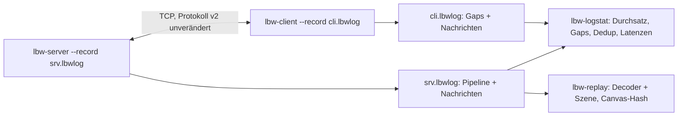
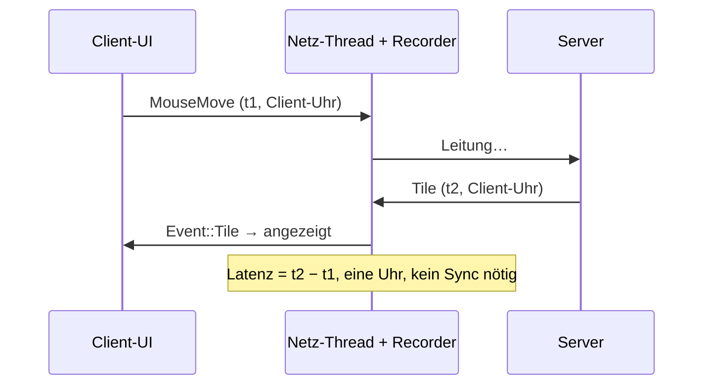
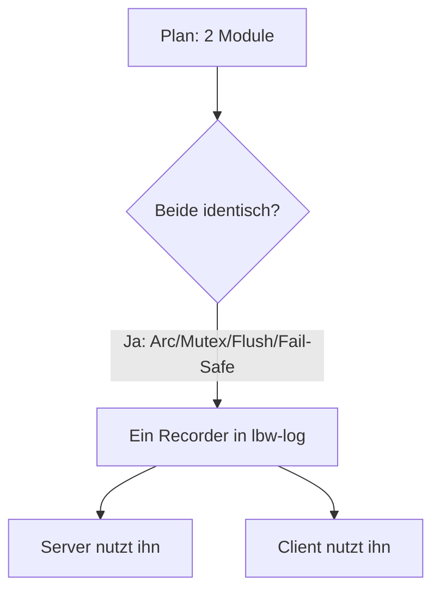

# Walkthrough: Instrumentierung + Session-Recording (`source10_instrumentation`)

Ziel war: Den Low-Bandwidth-Remote-Desktop aus `source9_gpu` so zu
instrumentieren, dass sich der ~6-kB/s-Übertragungskanal (komprimierte
SSH-Strecke über einen unbezahlten Mobilfunkvertrag, oft stockend)
vermessen lässt — jede übertragene Nachricht plus Timing- und
Performance-Metriken landet in einer Datei, die späteres Wiederabspielen
und Offline-Analyse erlaubt. Ergebnis ist `source10_instrumentation`:
derselbe Remote-Desktop (Protokoll v2, 1280×720, GPU-Hybrid-OCR), aber mit
`--record`-Schaltern an Server und Client sowie zwei Analysewerkzeugen.

Fachbegriffe werden beim ersten Auftreten kurz erklärt. Alle Messwerte
stammen von echten Läufen auf diesem Rechner (RTX A4000, Xvfb-Smoke mit
echten PP-OCRv6-Modellen). Plan und Tasks dazu: [`plan.md`](plan.md),
[`task.md`](task.md) im selben Ordner.

## 1. Was exakt implementiert wurde

### 1.1 Leitidee: Instrumentierung nur an den Rändern, Protokoll unberührt

Die wichtigste Entscheidung zuerst: Das Netzwerkprotokoll (`common/`, v2)
wurde **nicht** angefasst — `diff -r` gegen `source9_gpu/common` ist leer.
Statt Sequenznummern oder Ping-Nachrichten einzubauen, schneiden beide Seiten
jeweils lokal mit, was über ihre Leitung geht, und stempeln es mit zwei Uhren:

- *Wall-Clock* (`SystemTime`, µs seit der Unix-Epoche): grob, aber über
  Dateien hinweg vergleichbar — damit lassen sich Server- und Client-Log
  nachträglich zusammenlegen.
- *Monotone Uhr* (`Instant`, µs seit Aufnahme-Start): hochpräzise Intervalle,
  aber nur innerhalb einer Datei gültig — alle Latenzen werden deshalb
  grundsätzlich auf **einer** Uhr gemessen (s. §1.4).



### 1.2 Die neue Crate `lbw-log`: Format, Recorder, Statistik

Das `.lbwlog`-Format ist bewusst ans Protokoll-Framing angelehnt: 8 Byte
Magic (`LBWLOG10`), dann ein Strom aus `[u32-LE-Länge][bincode-Body]`-Records.
*Bincode* ist ein kompakter Binär-Serialisierer — dieselbe Technik wie auf der
Leitung, also kein neues Format zu lernen und keine neue Abhängigkeit.

```rust
// log/src/01_record.rs (Auszug)
pub enum LogRecord {
    Session { app: String, version: u16, args: Vec<String> },
    Msg { stamp: Stamp, dir: Dir, kind: MsgKind,
          wire_bytes: usize, hash: u64, body: Vec<u8> },
    Frame { stamp: Stamp, frame: u64, texts: usize, text_changed: bool,
            text_bytes: usize, tile: Option<TileStat>, ms: FrameMs },
    Decode { stamp: Stamp, tile_bytes: usize, ms: f32, ok: bool },
    Inject { stamp: Stamp, kind: MsgKind, ms: f32, ok: bool },
    Gap { stamp: Stamp, event: GapEvent },
    End { stamp: Stamp },
}
```

Jeder Record trägt einen Doppel-Stempel (`Stamp`: Wall- + Mono-µs).
`Msg`-Records enthalten den **vollständigen Leitungs-Body** — damit ist jede
Aufzeichnung exakt wiederabspielbar. Der Clou dabei: `bincode::standard` ist
*deterministisch* (gleiche Nachricht → gleiche Bytes), deshalb wird der Body
gesendeter Nachrichten einfach nach-kodiert statt mitgeschnitten — kein
einziger Eingriff ins Framing war nötig. Empfangene Nachrichten werden mit
exakten Leitungsbytes geloggt. Hashes sind FNV-1a/64 (5 Zeilen Hand-Code,
stabil über Prozesse hinweg — der `std`-Hash wäre pro Lauf anders und für
Dedup-Analyse unbrauchbar).

Der `Recorder` (`02_io.rs`) ist die thread-sichere Aufnahme-Front für
Eingabe- und Netz-Threads (`Clone` via `Arc<Mutex<…>>`, ohne Datei ein
No-op). Drei Robustheits-Details:

1. Nach jedem Record wird geflusht — ein Absturz kostet höchstens den letzten.
2. Schreibfehler (volle Platte) werden **einmal** gemeldet, danach schaltet
   sich die Aufnahme still ab — die Sitzung läuft immer weiter.
3. `Drop` schreibt best-effort ein `End`; fehlt es, war es ein Kill/Absturz.
   Ein zerrissener Schluss ist beim strikten `Reader` ein Fehler, die Tools
   laden per `load_lenient` trotzdem den Teilstand (mit Warnung).

Die Statistik (`03_stats.rs`) ist als reine Funktion über Records gebaut —
gut testbar, ohne jede Datei-Annahme:

- **Durchsatz:** pro Datei (Server- und Client-Log beschreiben *dieselben*
  Bytes — Summen pro Datei verhindern Doppelzählen), pro Nachrichtenart,
  pro Wall-Sekunde, plus Zähler „Sekunden über 6-kB/s-Budget“.
- **Gaps:** Down-Phasen mit live gemessener Down-Dauer (stimmt auch bei
  gesplitteten Dateien), hängende Disconnects am Dateiende werden als
  „offen“ gelistet.
- **Dedup:** Top-5 der wiederholt übertragenen Texte und Kacheln (nach
  verschwendeten Bytes) — Referenzstrom ist das Server-Log (das tatsächlich
  Gesendete); Antwort auf „wird immer derselbe Text übermittelt?“.
- **Latenzen:** Server-Stufen (Capture/det/rec/Mask+Diff/Encode/Send),
  Client-Decode, Server-Inject, Input→sichtbar (Client-Uhr), Input→Frame
  (Server-Uhr), jeweils als n/avg/p50/max.
- **Motion:** Box-Mittelpunkts-Deltas aufeinanderfolgender Kacheln —
  Hinweisgeber, ob sich *Motion Compensation* (Weiterverwenden des
  Vorbildes bei Bewegung statt Neu-Kodieren) lohnen würde.
- **Uhr-Offset:** gleiche Eingaben (Art+Hash, Auftretens-Reihenfolge) auf
  beiden Seiten matchen, Minimum der Wall-Differenzen (NTP-Prinzip:
  das schnellste Paket hat am wenigsten Wartezeit gesehen).

`lbw-logstat` rendert das als Human-Text oder `--json` (Hand-Code, ~40 Zeilen —
flache Summary, kein `serde_json` wert) plus optional `--csv`-Timeline.

### 1.3 Server: `--record` mit Pipeline-Timings

`serve_client` (`07_session.rs`, von 211 auf ~300 Zeilen gewachsen, Verhalten
identisch) misst pro Frame sechs Stufen und loggt jede Nachricht:

```rust
// server/src/07_session.rs (Prinzip)
let t = Instant::now();
let img = src.grab()?;            // → capture_ms
let texts = ocr.text(&img)?;      // → det/rec aus Ocr::last_ms (GPU-timing bleibt in 03_ocr!)
let t = Instant::now();
// … Maskierung + dirty_bbox …     // → mask_diff_ms
let data = encode_rgb(...)?;      // → encode_ms (0 bei Stille)
let n = write_msg(&mut wr, &msg)?; // → send_ms + Msg-Record
rec.frame(frames, texts.len(), text_changed, text_bytes, tile_stat, ms);
```

Wichtig: Auch bei Standbild-Stille wird pro Frame ein `Frame`-Record
geschrieben (`tile: None`) — nur so kann `logstat` „gesunde Stille“ von
„Ausfall“ unterscheiden. Der Eingabe-Thread misst Empfang→Injektion je
Eingabe (`Inject`-Record mit ok-Flag, z. B. `false` bei unbekannter Taste).
`main.rs` loggt Connect/Disconnect-Gaps mit Peer-Adresse und Grund. Die
Handshake-`Hello`-Nachricht und `input_loop` lesen jetzt den rohen Frame
(`fr.read` + `decode_msg` statt `read_msg`), um exakte Leitungsbytes zu
loggen — das Dekodier-Verhalten ist identisch.

### 1.4 Client: `--record` mit Gaps und Decode-Zeiten

Der Netz-Thread (`03_net.rs`) loggt über `Net::connect_recorder`:

- `Gap Up` beim Server-`Hello` (mit Down-Dauer seit dem letzten Abriss),
  `Gap Down` bei jedem Abriss **und** jedem fehlgeschlagenen
  Verbindungsversuch — gerade die stockende Strecke erzeugt viele davon,
  und genau die wollen wir charakterisieren.
- Jede empfangene Nachricht (mit Rohbytes) plus AV1-Decode-ms je Kachel
  (`Decode`-Record, auch Fehlschläge).
- Jede gesendete Eingabe mit Sendezeit — daraus misst `logstat` offline die
  **Input→Photon-Latenz auf der Client-Uhr**: letzte Eingabe-Sendung bis zur
  nächsten sichtbaren Änderung (Kachel oder Textwechsel). Keine
  Uhrensynchronisation nötig, weil Senden und Anzeigen auf derselben Uhr
  passieren.



### 1.5 `lbw-replay`: Headless-Replay mit Determinismus-Nachweis

`lbw-replay` (Client-Paket, ohne Fenster) füttert alle Server→Client-Nachrichten
eines Logs durch den **echten** AV1-`Decoder` und die **echte** `Scene` und
meldet Zähler plus FNV-Hash des Canvas:

```
replay: 1 Kacheln, 1 Texte, canvas 8f8524dc4c65fece (0 Fehler: 0 msg, 0 av1)
```

Zwei Läufe über dasselbe Log müssen denselben Hash liefern — das prüft der
`replay`-Test automatisch. Optionen: `--ppm <dir>` (Canvas nach jeder Kachel
als PPM-Rohbild — P6 per Hand, ~8 Zeilen, kein Dep) und `--realtime`
(Mono-Abstände einhalten, max. 2 s je Sprung). Eingaben werden nicht
abgespielt (reine Anzeige-Wiedergabe).

### 1.6 Tests und Verifikation im Überblick

Alles auf diesem Rechner beobachtet:

- `cargo test --workspace`: **65 passed, 0 failed** (Client 10, Common 9,
  Log 14, Server 32), 2 ignored (GPU-Modelltests, laufen separat).
  Neu: Record-Roundtrip aller Varianten, Magic-/Torn-Tail-Fehler,
  Recorder-Gap/Drop-Test, 5 Stats-Tests auf synthetischen Logs (Timeline,
  Budget, Gaps, 250-ms-Latenz, Dedup, Offset-Min, Motion),
  Server-Loopback mit Recording (Bodies re-dekodierbar, 128×128-Vollbild),
  Client-Loopback mit Recording (beide Richtungen + Decode),
  `logstat`-Golden-Test, Replay-Determinismus-Test.
- `smoke_xvfb.sh` (alt, unverändert): OK — `SMOKE-TEST-720` erkannt, Klick
  kommt an. Beweis, dass die Instrumentierung das Verhalten nicht ändert.
- `smoke_record.sh` (neu): Xvfb + Server/Probe mit `--record` + `logstat`
  beider Logs + `replay`. Echte Messung (33 Frames, 1 Kachel, Rest Stille):
  Detektor p50 14,8 ms (kalt 498,8 — CUDA-Warmup sichtbar!),
  Erkenner 7,0 ms, Encode p50 0 ms, Decode 18,3 ms, Inject p50 0,3 ms,
  Uhr-Offset 43,6 ms aus 6 Samples, Replay 0 Fehler.
- `common/` per `diff -r` identisch zu source9; `03_ocr.rs` (638 Zeilen)
  bewusst nicht angefasst (Split-Regel); `cargo fmt --check` und
  `cargo clippy` (eigener Code) sauber; **keine neuen externen Deps**.
- Commits (Conventional Commits): Plan/Tasks, Implementierung, Walkthrough.

## 2. Architektur-Entscheidungen, die Tests erzwungen haben

### 2.1 Zwei Recorder-Module → einer (Duplikat erkannt)

Der Plan sah `server/08_record.rs` und `client/06_record.rs` vor. Beim
Schreiben war klar: Das wäre zweimal derselbe Thread-sichere Datei-Wrapper
gewesen. Stattdessen lebt **ein** `Recorder` in `lbw-log` (`02_io.rs`,
~200 Zeilen inkl. Gap-Tracking und Fail-Safe) und beide Seiten nutzen ihn.
Weniger Code, ein Verhalten, ein Test-Ort. Der Plan bleibt als historisches
Dokument stehen — diese Abweichung ist dokumentiert.



### 2.2 `down_ms` ans `Up`- statt ans `Down`-Event

Erster Entwurf: Die Down-Dauer steht am `Down`-Record („ms seit letztem
Down“). Falsch gedacht — die Dauer einer Lücke kennt man erst beim
Wiederaufbau. Jetzt: `Up { peer, down_ms }` (`None` beim allerersten
Connect), `Down { reason }`. Der Recorder merkt sich den letzten
Down-Stempel. Der `Recorder`-Test assertiert exakt das (2-ms-Sleep →
`down_ms ≥ 2.0`).

### 2.3 `Reader::next` → `next_record` (Clippy)

Clippy (`should_implement_trait`): Eine Methode namens `next`, die nicht der
`Iterator`-Trait ist, irritiert. Umbenannt statt `#[allow]` — vier
Aufrufstellen, keine API-Reue, weil die Crate neu ist. Gleicher Durchgang:
`needless_lifetimes`, `unnecessary_sort_by`, `clone_on_copy`,
`chunks_exact_to_as_chunks`, redundantes `matches!` — alle behoben,
Clippy für eigenen Code jetzt still.

### 2.4 Logstat-Darstellung nach dem ersten echten Lauf

Der erste `smoke_record`-Lauf zeigte zwei Darstellungsfehler:

1. Timeline mit absoluten Wall-Sekunden (`s+1791622566`) — unlesbar.
   Jetzt relativ zur ersten Sekunde der Datei (`s+0`, `s+1`).
2. Jeder erste Connect stand als „offen“ da (kein `down_ms`).
   Jetzt drei Zustände: `initial` (erster Connect), `reconnect`
   (mit Down-Dauer), `offen` (hängender Disconnect am Dateiende).

Kleinigkeiten, aber genau dafür ist der Smoke da: echte Logs statt
synthetischer.

### 2.5 Erste echte Charakterisierung schon im Smoke

Der Uhr-Offset auf **derselben Maschine** misst 43,6 ms (Min über 6 Samples).
Bei synchronen Uhren wären ~0 ms zu erwarten — die Differenz ist echt und
erklärt: Der Client-Netz-Thread flusht ausgehende Eingaben nur aus seiner
50-ms-Leseschleife heraus, jede Eingabe wartet also 0–50 ms im Kanal. Die
Instrumentierung hat damit in ihrem ersten Lauf bereits eine
Optimierungsstelle gefunden (Flush per `Notify`/kürzerem Timeout) — Beweis,
dass das Werkzeug tut, wofür es gebaut wurde.

## 3. Learnings und mögliche Erweiterungen

### Learnings

- **Einseitige Latenzen schlagen Protokoll-Änderungen.** Alle
  praxisrelevanten Zeiten (Input→sichtbar, Pipeline-Stufen, Decode, Inject)
  sind auf einer einzigen Uhr messbar. Der Verzicht auf Protokoll-v3
  (Seq-Nummern, Ping) hat alle Kompatibilitäts- und Test-Umbauten gespart —
  `common/` ist byte-identisch.
- **Deterministisches Bincode ist ein Feature.** Dass Nach-Kodieren ==
  Leitungsbytes gilt, hat den gesamten Empfangs-/Sende-Pfad vor
  Framing-Eingriffen bewahrt. Nur zwei Stellen lesen jetzt Roh-Frames
  (Handshake, `input_loop`) — und auch dort nur zum Byte-Zählen.
- **Stille loggen, nicht nur Daten.** Der `Frame`-Record bei Standbild
  (10/s, ~100 Byte) kostet fast nichts und ist der einzige Weg, „nichts
  los“ von „Verbindung tot“ zu unterscheiden. Ohne ihn wäre jede
  Gap-Analyse geraten.
- **Min-Filter statt Synchronisation.** Der Uhr-Offset-Schätzer (schnellstes
  Paket ≈ reine Uhrdifferenz) ist 20 Zeilen und reicht für alle
  Ende-zu-Ende-Aussagen. Echte NTP-Synchronisation wäre overkill.
- **Drop-Records brauchen Warte-Logik im Test.** Der Client-`Recorder` lebt
  im Netz-Thread und schreibt `End` erst bei dessen (asynchronem) Ende —
  der Test pollt deshalb aufs `End` statt zu schlafen (robust statt
  flaky).
- **`cargo search` statt `cargo install cargo-edit`.** Für die
  Versionsprüfung (serde max, bincode-Stub bekannt) genügte die
  Sparse-Index-Abfrage — keine Minuten fürs Kompilieren von cargo-edit.

### Mögliche Erweiterungen

- **Input-Flush beschleunigen** (§2.5): 0–50-ms-Wartezeit im Client-Kanal
  per kürzerem Read-Timeout oder Weck-Mechanismus senken — größte bekannte
  Eingabe-Latenz, jetzt messbar.
- **Echte Kanal-Bytes messen:** Die Logs zählen TCP-Nutzdaten *innerhalb*
  des SSH-Tunnels; `ssh -C` komprimiert zusätzlich. Echte Luft-Bytes
  brauchen Paketmitschnitt oder SSH-Statistiken (Follow-up,
  z. B. `logstat`-Import von `tcpdump`-Zählern).
- **Browser-Session aufzeichnen:** Die eigentliche Zielnutzung — längere
  Alltags-Sessions (Webbrowser bedienen) aufnehmen und Dedup-/Motion-/Gap-
  Daten sammeln, bevor über Text-Cache oder Motion Compensation entschieden
  wird. Die Werkzeuge dafür sind fertig (`--record` + `logstat` + `replay`).
- **HUD-Live-Metriken:** Dieselben Records könnten live ins Client-HUD
  fließen (B/s, letzte Latenz) — Datei first war richtig, Anzeige folgt.
- **PPM→Video:** Replay-Frames per externem `ffmpeg` zu MP4 montieren
  (kein Rust-Dep nötig) für visuelle Vorher/Nachher-Vergleiche.
- **Stillstand-Skip aus source9 übernehmen:** OCR alle 100 ms auch bei
  Standbild — die Frame-Records quantifizieren jetzt exakt, wie viel das
  kostet (im Smoke: 32 von 33 Frames ohne Änderung).

## 4. Programme/Pakete für das Dockerfile

Dauerhaft ins Image (zusätzlich zu source9: CUDA 13 + cuDNN 9,
`libxcb1-dev`, `libxcb-shm0-dev`, `libxcb-randr0-dev`):

| Paket | Wofür | Phase |
|---|---|---|
| `xvfb`, `xterm` | Smoke-Tests (alt + Recording) | Test |
| `x11-utils` (`xev`, `xdpyinfo`) | Klick-Nachweis, Display-Diagnose | Test/Debug |
| `ffmpeg` (optional) | PPM-Replay-Frames → MP4 montieren | Analyse |

Ausdrücklich **nicht** nötig: neue Rust-Crates (null), `nasm`
(rav1e ohne `asm` wie bisher), `cargo-edit` (Versionsprüfung geht per
`cargo search`), neue Systemlibs zur Laufzeit (Recording ist reines `std`).
