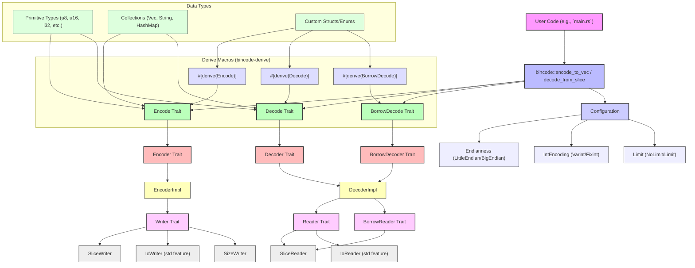

# plops/bincode

## GitHub & DeepWiki
- GitHub: https://github.com/plops/bincode
- DeepWiki: https://deepwiki.com/plops/bincode

## Kurze Einführung
`bincode` ist eine Rust-Bibliothek zur binären Serialisierung und Deserialisierung von Datenstrukturen. Sie zeichnet sich durch eine kompakte, "fluff-freie" Kodierung aus, die oft zu einer kleineren oder gleich großen Repräsentation im Vergleich zur In-Memory-Größe führt. Die Bibliothek ist für Anwendungsfälle konzipiert, bei denen Effizienz und geringer Overhead bei der Datenübertragung oder -speicherung entscheidend sind, wie z.B. in Netzwerk-RPCs, Grafik-Debugging oder der Speicherung von Anwendungsdaten auf der Festplatte.  

## Die 3 wichtigsten (oder komplexesten) Algorithmen

### 1. Variable Integer Encoding (Varint)
1.  **Name & Verortung im Code**: `VarintEncoding`  ist eine Konfigurationsoption, die in der `Configuration` Struktur  über die Methode `with_variable_int_encoding`  aktiviert wird. Die Implementierung der Dekodierung für verschiedene Integer-Typen findet sich in `src/de/impls.rs` .
2.  **Detaillierte technische Funktionsweise**: Bei der `VarintEncoding` werden vorzeichenlose Ganzzahlen (`u` außer `u8`) wie folgt kodiert: Werte kleiner 251 werden als einzelnes Byte kodiert. Größere Werte werden mit einem Präfix-Byte (251-254) versehen, das die Größe des folgenden Integers angibt (z.B. 251 für `u16`, 252 für `u32`, 253 für `u64`, 254 für `u128`).  Für vorzeichenbehaftete Ganzzahlen wird zuerst der Zigzag-Algorithmus angewendet, um sie in vorzeichenlose Ganzzahlen umzuwandeln.  Dieser Algorithmus bildet kleine absolute Werte auf kleine vorzeichenlose Werte ab, was die Effizienz der Varint-Kodierung für negative Zahlen verbessert. 
3.  **"Warum prägend"**: Dieser Algorithmus ist prägend, da er die Speichereffizienz von `bincode` maßgeblich beeinflusst. Durch die variable Länge werden kleinere Zahlen mit weniger Bytes kodiert, was zu einer sehr kompakten Repräsentation führt. Dies ist entscheidend für Anwendungen, die Bandbreite oder Speicherplatz sparen müssen, und trägt zur "zero-fluff" Philosophie von `bincode` bei. 

### 2. `Encode` und `Decode` Traits
1.  **Name & Verortung im Code**: Die Kernfunktionalität von `bincode` basiert auf den Traits `Encode`  und `Decode` . Diese sind in `src/enc/mod.rs` und `src/de/mod.rs` definiert. Die automatische Implementierung erfolgt über das `#[derive(bincode::Encode)]` und `#[derive(bincode::Decode)]` Makro  , welches `virtue`  als Helfer nutzt.
2.  **Detaillierte technische Funktionsweise**: Der `Encode`-Trait definiert die Methode `encode<E: Encoder>(encoder: &mut E) -> Result<(), EncodeError>` , die beschreibt, wie ein Typ in ein binäres Format serialisiert wird. Der `Decode`-Trait definiert `decode<D: Decoder>(decoder: &mut D) -> Result<Self, DecodeError>` , um einen Typ aus einem Byte-Stream zu deserialisieren. Für Typen mit geborgten Daten gibt es den `BorrowDecode`-Trait . Die `derive`-Makros generieren den Boilerplate-Code für diese Implementierungen, indem sie die Felder der Struktur sequenziell kodieren oder dekodieren. 
3.  **"Warum prägend"**: Diese Traits bilden das Fundament der Serialisierungs- und Deserialisierungslogik. Sie ermöglichen es Entwicklern, eigene Typen einfach mit `bincode` zu verwenden, indem sie das `derive`-Makro nutzen, oder bei komplexeren Anforderungen manuelle Implementierungen vorzunehmen. Die Trennung in `Encode`, `Decode` und `BorrowDecode` ermöglicht eine flexible Handhabung von Daten, insbesondere im Hinblick auf geborgte Daten und die Vermeidung unnötiger Allokationen, was für Performance und Speichereffizienz entscheidend ist.

### 3. Konfigurierbare Endianness und Integer-Kodierung
1.  **Name & Verortung im Code**: Die Konfiguration der Endianness und der Integer-Kodierung wird durch die `Configuration` Struktur  im Modul `src/config.rs`  gesteuert. Methoden wie `with_big_endian` , `with_little_endian` , `with_variable_int_encoding`  und `with_fixed_int_encoding`  erlauben die Anpassung.
2.  **Detaillierte technische Funktionsweise**: `bincode` verwendet standardmäßig Little-Endian und Variable Integer Encoding.  Die `Configuration`-Struktur ist generisch über Typen, die die Endianness (`E`), Integer-Kodierung (`I`) und Limit (`L`) repräsentieren.  Durch Aufruf der `with_*`-Methoden wird eine neue `Configuration`-Instanz mit den entsprechenden Typ-Parametern zurückgegeben, die das Verhalten des Encoders/Decoders zur Laufzeit bestimmt.    
3.  **"Warum prägend"**: Die Flexibilität bei der Wahl der Endianness und der Integer-Kodierung ist entscheidend für die Interoperabilität von `bincode` in heterogenen Systemumgebungen. Sie ermöglicht die Anpassung an spezifische Protokolle oder Hardware-Architekturen und stellt sicher, dass `bincode` in einer Vielzahl von Szenarien eingesetzt werden kann, ohne die Datenintegrität zu gefährden. Dies ist besonders wichtig für die Langzeitarchivierung von Daten oder die Kommunikation zwischen Systemen mit unterschiedlichen Byte-Reihenfolgen. 

## Architektur & Zusammenspiel

Die Architektur von `bincode` ist modular und trait-basiert. Im Zentrum stehen die `Encode`-, `Decode`- und `BorrowDecode`-Traits   , die definieren, wie Datenstrukturen serialisiert und deserialisiert werden können. Diese Traits werden entweder manuell implementiert oder automatisch über `derive`-Makros  generiert, die `virtue`  als Helfer nutzen.

Die eigentliche Kodierungs- und Dekodierungslogik wird von `Encoder`  und `Decoder`  Traits gehandhabt, die Methoden zum Schreiben und Lesen primitiver Typen bereitstellen. Konkrete Implementierungen wie `EncoderImpl`  und `DecoderImpl`  nutzen wiederum `Writer`  und `Reader`  Traits für den Low-Level-Byte-Zugriff. Beispiele für `Writer`-Implementierungen sind `SliceWriter`  für Slices und `SizeWriter`  zum Zählen von Bytes. Auf der Dekodierungsseite gibt es `SliceReader`  für Slices.

Die `Configuration` Struktur  ist zentral für die Anpassung des Verhaltens, indem sie Endianness, Integer-Kodierung (Varint oder Fixint) und optionale Byte-Limits festlegt.  Diese Konfiguration wird an die Encoder- und Decoder-Instanzen übergeben und beeinflusst, wie Daten auf Byte-Ebene interpretiert werden. <cite repo="plops/bincode" path="src/de/

Wiki pages you might want to explore:
- [Glossary (plops/bincode)](/wiki/plops/bincode#7)

View this search on DeepWiki: https://deepwiki.com/search/zielrepository-plopsbincode-er_cb245906-266f-4718-a665-1a2e1eb0916d
