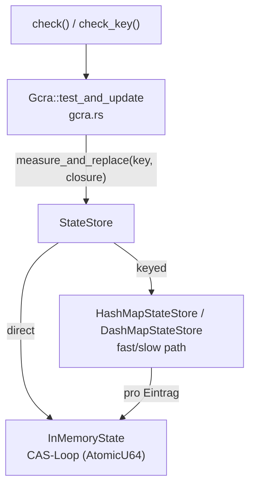

https://github.com/boinkor-net/governor

governor is a Rust library for enforcing rate limits. It implements
the Generic Cell Rate Algorithm (GCRA), which is functionally
equivalent to a leaky bucket but operates without any background
maintenance process. All state is tracked in a single AtomicU64
updated via compare-and-swap, making the library both memory-efficient
and thread-safe.

was sind die drei wichtigsten (oder komplexesten) algorithmen in
diesem repo? erklaere wie sie die software zu dem machen was sie ist

Die drei zentralen Algorithmen sind: (1) **GCRA** in `gcra.rs` – die eigentliche Rate-Limiting-Logik über den Theoretical Arrival Time; (2) **die lockfreie Compare-and-Swap-Schleife** in `InMemoryState::measure_and_replace_one` – die den Zustand in einem einzigen `AtomicU64` hält; (3) **der Fast-Path/Slow-Path-Lookup der keyed State Stores** (`HashMapStateStore`, `DashMapStateStore`), der pro Key einen eigenen TAT verwaltet.

---

## 1. GCRA – `Gcra::test_and_update` / `test_n_all_and_update`

Das Kernstück der Bibliothek: das *Generic Cell Rate Algorithm*, funktional äquivalent zu einem Leaky Bucket, aber ohne Hintergrund-Thread – der gesamte Zustand ist ein einzelner Zeitstempel (TAT). [1](#0-0) 

- Aus dem `Quota` werden `t` (Zeit pro Zelle) und `tau = t * (max_burst - 1)` berechnet. [2](#0-1) 
- Entscheidung: `earliest_time = tat - tau`; wenn `now < earliest_time` → Ablehnung mit `NotUntil`, sonst `next = max(tat, t0) + t`. [3](#0-2) 
- Die Batch-Variante `test_n_all_and_update` multipliziert das Zellgewicht mit `n` und lehnt `n > max_burst` sofort mit `InsufficientCapacity` ab, ohne den State zu konsultieren. [4](#0-3) 

Beide werden von den öffentlichen Einstiegspunkten `check()`/`check_n()` (direct) bzw. `check_key()`/`check_key_n()` (keyed) aufgerufen – jede Rate-Limiting-Entscheidung der Bibliothek läuft durch diesen Code. [5](#0-4) [6](#0-5) 

## 2. Lockfreie CAS-Schleife – `InMemoryState::measure_and_replace_one`

Das macht governor schnell: Der TAT liegt in einem `AtomicU64` (via `portable-atomic`, daher `no_std`-fähig) und wird per `compare_exchange_weak` aktualisiert – bei Kollision wird die GCRA-Closure `f` mit dem neuen Wert erneut ausgewertet. [7](#0-6) 

Der Stresstest `stresstest_collisions` beweist die Korrektheit unter 8 Threads: Kollisionen passieren, aber der Endwert stimmt exakt. [8](#0-7) 

Die GCRA-Closure wird dem State Store über das `StateStore`-Trait übergeben – der Store garantiert dabei, dass der Wert nur ersetzt wird, wenn er sich seit dem Lesen nicht geändert hat. [9](#0-8) 

## 3. Fast/Slow-Path-Lookup in den keyed State Stores

Für per-Key-Limits (z. B. ein Limit pro API-Key) kapselt jeder Map-Eintrag einen eigenen `InMemoryState`. Beide Implementierungen folgen demselben Zwei-Wege-Algorithmus:

1. **Fast path:** Key existiert → `measure_and_replace_one` direkt auf dem Eintrag.
2. **Slow path:** Key fehlt → `entry(key).or_default()` einfügen, dann messen.

- `DashMapStateStore` (Standard bei `std` + `dashmap`): Shard-Locks, lesender Zugriff im Fast Path – hohe Parallelität. [10](#0-9) 
- `HashMapStateStore` (`no_std`-fähig): ein globaler `Mutex` (`parking_lot` unter `std`, `spinning_top` Spinlock sonst). [11](#0-10) [12](#0-11) 

## Zusammenhang

## Notes

- Erwähnenswert als "halber vierter Algorithmus": die async `until_ready_with_jitter`-Schleife, die bei Ablehnung über `NotUntil::wait_time_from` + `Jitter` schläft und Thundering-Herds vermeidet. [13](#0-12)  Analoge Zustandsautomaten existieren für `RatelimitedSink`/`RatelimitedStream`. [14](#0-13) 
- Der 584-Jahre-Bereich des `Nanos`-Zeitstempels ist die dokumentierte Einschränkung des Ein-Zeitstempel-Designs (README). [15](#0-14) 

