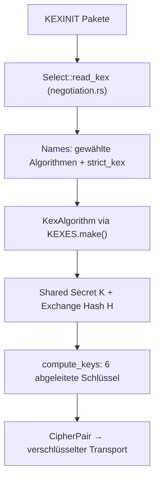

https://deepwiki.com/Eugeny/russh

Russh is a low-level Tokio-based SSH2 library for Rust that provides
both client and server implementations. It is designed to be
asynchronous, leveraging Rust's futures and the Tokio runtime for
efficient I/O operations. This library is a fork of Thrussh and
focuses on modern cryptographic primitives and panic safety.

**Kurzantwort:** Die drei komplexesten Algorithmen in `russh` sind (1) die Schlüsselaustausch-Familie hinter dem `KexAlgorithmImplementor`-Trait (inkl. dem hybriden Post-Quantum-KEX `MlKem768X25519Kex`), (2) die Schlüsselableitung `compute_keys` nach RFC 4253 §7.2, und (3) die Algorithmus-Aushandlung `Select::read_kex` inklusive Strict-KEX/Terrapin-Mitigation. Zusammen bilden sie den kryptografischen Kern, der `russh` zu einer vollständigen SSH-2-Implementierung macht. [1](#0-0) 

---

## 1. Die KEX-Algorithmus-Familie (`KexAlgorithmImplementor`)

Alle Schlüsselaustausch-Verfahren — klassisches DH, ECDH auf NIST-Kurven, Curve25519, DH Group Exchange und hybrides Post-Quantum — sind hinter dem Trait `KexAlgorithmImplementor` vereinheitlicht und werden über das Enum `KexAlgorithm` dispatcht (via `enum_dispatch`). [2](#0-1) 

Die besonders komplexen Teile:

- **Hybrider Post-Quantum-KEX**: `MlKem768X25519Kex` kombiniert ML-KEM-768 (FIPS 203) mit klassischem X25519 — der Server kapselt gegen den ML-KEM-Public-Key des Clients und rechnet parallel ein X25519-DH, beide Secrets werden konkateniert und mit SHA-256 zum eigentlichen Shared Secret gehasht. Damit bleibt die Verbindung sicher, solange mindestens eines der beiden Verfahren ungebrochen ist. [3](#0-2) [4](#0-3) 
- **Modular-DH mit BigUint-Arithmetik**: `DH` in `groups.rs` führt `modpow` auf 2048–8192-bit-Primzahlen aus und validiert Public Keys und Shared Secrets gegen den Bereich `(1, p-1)` — der klassische Schutz gegen Small-Subgroup-Attacken. [5](#0-4) 
- **DH Group Exchange (GEX)**: Statt fester Gruppen fordert der Client eine Gruppengröße an (`KEX_DH_GEX_REQUEST`), der Server liefert `p` und `g` über `lookup_dh_gex_group` — ein zusätzlicher Verhandlungsschritt, den nur `DhGroupKex` mit `is_dh_gex()` unterstützt. [6](#0-5) [7](#0-6) 
- Jeder Algorithmus berechnet seinen **Exchange Hash** `H` über Client-/Server-IDs, beide KEXINIT-Payloads, Host Key und die ephemeralen Keys — die kryptografische Verbindung zwischen Handshake und authentifiziertem Server. [8](#0-7) 

Die Zustandsautomaten `ClientKexState`/`ServerKexState` (z. B. `WaitingForGexReply`, `WaitingForDhInit`) orchestrieren den sequentiellen Paketfluss über diese Varianten hinweg. [9](#0-8) [10](#0-9) 

## 2. Schlüsselableitung `compute_keys` (RFC 4253 §7.2)

Aus dem Shared Secret `K` und dem Exchange Hash `H` leitet `compute_keys<D>` sechs Schlüssel ab — IVs, Encryption Keys und MAC Keys für beide Richtungen — indem `Hash(K || H || Buchstabe || SessionID)` berechnet und bei Bedarf erweitert wird. Die Buchstaben 'A'–'F' werden je nachdem, ob die Seite Server oder Client ist, gespiegelt. [11](#0-10) [12](#0-11) 

Das Ergebnis ist ein `CipherPair` (`local_to_remote`/`remote_to_local`), das über `cipher.make_sealing_key`/`make_opening_key` die komplette verschlüsselte Transportschicht versorgt. [13](#0-12) [14](#0-13) 

## 3. Algorithmus-Aushandlung `Select::read_kex` + Strict KEX

`read_kex` parst die KEXINIT-Namensliste der Gegenseite und wählt für KEX, Host-Key, Cipher, MAC und Kompression jeweils den ersten gemeinsamen Algorithmus — wobei Client- und Server-Präferenzordnung unterschiedlich gewichtet werden (`Select` für `Server` iteriert client-first, für `Client` umgekehrt). [15](#0-14) [16](#0-15) 

Der subtile Teil ist die **Strict-KEX-Erkennung** (Terrapin-Mitigation): Extension-Namen werden vor der Auswahl herausgefiltert, und wenn beide Seiten `kex-strict-*` ankündigen, werden Sequenznummern strikt validiert — auf Client-Seite muss KEXINIT sonst exakt Sequenznummer 1 haben. [17](#0-16) [18](#0-17) 

Zusätzlich steuert `ignore_guessed` den RFC-4253-Mechanismus zum Verwerfen falsch geratener erster Pakete. [19](#0-18) 

## Wie das zusammenspielt

## Notes

- **Kandidat Nr. 4**: Die Public-Key-Authentifizierung mit Signaturverifikation über `session_id || Request-Payload` in `encrypted.rs` ist ebenfalls komplex, insb. die `pk_ok`-Zwei-Phasen-Logik und Zertifikats-Abzweigung. [20](#0-19) 
- `CryptoVec` (gezeroed/`mlock`-geschützter Speicher für Secrets) ist kein Algorithmus, aber sicherheitskritische Infrastruktur — sensible Schlüssel wie `session_id` werden bewusst als `CryptoVec` gehalten. [21](#0-20) 
- Der Design-Grundsatz des Repos ist explizit, *nicht* alle je publizierten Algorithmen zu implementieren — SHA-1-Varianten sind z. B. schon aus den Defaults (`SAFE_HMAC_ORDER`) ausgeschlossen. [22](#0-21) [23](#0-22) 
- Cipher-Implementierungen (ChaCha20-Poly1305, AES-GCM, CBC) wurden hier nur am Rand gezeigt; Details zu Channel-Multiplexing/Flow-Control sind im bereitgestellten Kontext nicht enthalten.
