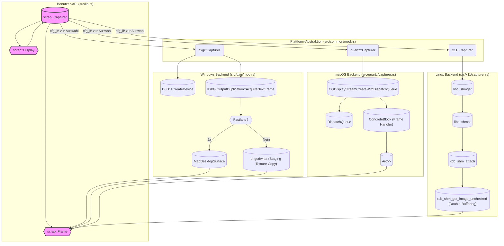

# quadrupleslap/scrap

## GitHub & DeepWiki
- GitHub: https://github.com/quadrupleslap/scrap
- DeepWiki: https://deepwiki.com/quadrupleslap/scrap

## Kurze Einführung
`scrap` ist eine plattformübergreifende Bibliothek zur Bildschirmaufnahme, die eine einfache API für die Erfassung von Frames von einem Display bietet. Sie unterstützt Windows, macOS und Linux, indem sie plattformspezifische APIs wie DXGI, Quartz und XCB mit MIT-SHM nutzt. Das Hauptziel ist es, eine effiziente und unkomplizierte Möglichkeit zur Bildschirmaufnahme in Rust-Anwendungen bereitzustellen. 

## Die 3 wichtigsten (oder komplexesten) Algorithmen

### 1. Plattform-spezifische Frame-Akquisition (Windows: DXGI Desktop Duplication API)
1.  **Name & Verortung im Code**: `Capturer::load_frame` und `Capturer::ohgodwhat` in `src/dxgi/mod.rs`.  
2.  **Detaillierte technische Funktionsweise**: Auf Windows nutzt `scrap` die DXGI Desktop Duplication API. Die Methode `load_frame` versucht, den nächsten Frame mittels `AcquireNextFrame` zu erhalten.  Es wird geprüft, ob der Desktop-Image bereits im Systemspeicher liegt (`fastlane`). 
    -   **Fastlane**: Wenn `fastlane` aktiv ist, wird `MapDesktopSurface` verwendet, um direkt einen Zeiger auf die Pixeldaten zu erhalten. 
    -   **Ohne Fastlane**: Andernfalls wird die Methode `ohgodwhat` aufgerufen. Diese erstellt eine Staging-Textur (`ID3D11Texture2D`) mit `D3D11_USAGE_STAGING` und `D3D11_CPU_ACCESS_READ`, kopiert den Frame von der GPU in diese Staging-Textur und mappt dann die Staging-Textur, um CPU-Zugriff auf die Pixeldaten zu erhalten. 
3.  **Warum prägend**: Dieser Algorithmus ist entscheidend für die Performance auf Windows, da er die effizienteste Methode zur Bildschirmaufnahme über die DXGI API implementiert. Die Unterscheidung zwischen "Fastlane" und dem Staging-Textur-Ansatz optimiert den Datenfluss je nach Verfügbarkeit des Desktop-Images im Systemspeicher, was die Latenz und den Ressourcenverbrauch minimiert. 

### 2. Plattform-spezifische Frame-Akquisition (Linux: XCB mit MIT-SHM und Double-Buffering)
1.  **Name & Verortung im Code**: `Capturer::new` und `Capturer::frame` in `src/x11/capturer.rs`.  
2.  **Detaillierte technische Funktionsweise**: Der Linux-Backend nutzt XCB und die MIT-SHM-Erweiterung für die Bildschirmaufnahme.
    -   **Initialisierung**: Bei der Erstellung eines `Capturer` wird ein System V Shared Memory Segment mittels `libc::shmget` erstellt, das doppelt so groß ist wie ein einzelner Frame (`size * 2`).  Dieses Segment wird dann an den Adressraum des Prozesses angehängt (`libc::shmat`)  und dem X-Server über `xcb_shm_attach` bekannt gemacht. 
    -   **Frame-Erfassung**: Die Methode `frame` implementiert ein Double-Buffering-Schema. Sie gibt einen Slice auf den Teil des Shared Memory zurück, der vom *vorherigen* `xcb_shm_get_image_unchecked`-Aufruf gefüllt wurde, während gleichzeitig ein *neuer* asynchroner Request für den anderen Teil des Buffers gestartet wird.  Dies ermöglicht eine kontinuierliche Frame-Erfassung ohne Blockierung.
3.  **Warum prägend**: Die Verwendung von MIT-SHM ist entscheidend für die hohe Performance auf Linux, da sie das Kopieren von Pixeldaten über den X11-Socket vermeidet und stattdessen Shared Memory nutzt.  Das Double-Buffering-Schema sorgt für einen reibungslosen Frame-Fluss, indem es die Latenz zwischen Frame-Anforderung und -Verfügbarkeit minimiert. 

### 3. Plattform-spezifische Frame-Akquisition (macOS: CGDisplayStream mit Callback-Modell)
1.  **Name & Verortung im Code**: `Capturer::new` in `src/quartz/capturer.rs` und die `handler` Closure. 
2.  **Detaillierte technische Funktionsweise**: Auf macOS verwendet `scrap` `CGDisplayStream` aus dem Quartz-Framework.
    -   **Initialisierung**: Der `Capturer` wird mit `CGDisplayStreamCreateWithDispatchQueue` erstellt, wobei ein `DispatchQueue` und ein `ConcreteBlock` (Objective-C Block) als Callback-Handler übergeben werden.  Dieser Handler wird aufgerufen, wenn ein neuer Frame verfügbar ist.
    -   **Frame-Verwaltung**: Der `Capturer` in `src/common/quartz.rs` kapselt den plattformspezifischen `quartz::Capturer` und verwendet einen `Arc<Mutex<Option<quartz::Frame>>>`, um den neuesten Frame zu speichern.  Der Callback-Handler des `CGDisplayStream` aktualisiert diesen `Mutex` mit dem neuen Frame. 
    -   **Frame-Abruf**: Die Methode `frame` versucht, den `Mutex` zu sperren und den neuesten Frame zu entnehmen. Wenn kein neuer Frame verfügbar ist oder der `Mutex` gesperrt ist, wird ein `WouldBlock`-Fehler zurückgegeben. 
3.  **Warum prägend**: Dieser Ansatz wandelt das push-basierte Callback-Modell von `CGDisplayStream` in ein pull-basiertes Polling-Modell um, das mit der einheitlichen `Capturer::frame` API von `scrap` kompatibel ist.  Die Verwendung von `Arc<Mutex>` ermöglicht eine sichere und effiziente Übergabe von Frames zwischen dem asynchronen Callback und dem synchronen Abruf durch den Benutzer. 

## Architektur & Zusammenspiel

Die Architektur von `scrap` basiert auf einem Facade-Muster, das durch bedingte Kompilierung implementiert wird.  Die `build.rs`-Datei erkennt das Zielbetriebssystem und setzt entsprechende `rustc-cfg`-Flags.  Basierend auf diesen Flags re-exportiert `src/common/mod.rs` die plattformspezifischen Implementierungen von `Capturer`, `Display` und `Frame` unter einem einheitlichen Namen. 

-   **Windows (DXGI)**: Verwendet `D3D11CreateDevice` zur Initialisierung und `IDXGIOutputDuplication` zur Frame-Akquisition.   Es gibt einen optimierten Pfad (`fastlane`) für Frames im Systemspeicher und einen Fallback mit Staging-Texturen für GPU-Frames.  
-   **macOS (Quartz)**: Nutzt `CGDisplayStream` mit einem Callback-Handler, der Frames asynchron in einen `Arc<Mutex>` schreibt.  Die Benutzer-API ruft Frames synchron aus diesem `Mutex` ab. 
-   **Linux (X11/XCB)**: Verwendet MIT-SHM für Shared Memory und ein Double-Buffering-Schema mit `xcb_shm_get_image_unchecked`, um Frames effizient vom X-Server zu erhalten.  

## Notes
Eine bemerkenswerte Designentscheidung ist die Verwendung von `cfg_if!` und `build.rs` zur plattformspezifischen Kompilierung, anstatt Cargo-Features zu nutzen.   Dies stellt sicher, dass immer der korrekte Backend für das Zielsystem ausgewählt wird und verhindert ungültige Konfigurationen. 
Die `Frame`-Struktur garantiert ein gepacktes BGRA-Format, was die Kompatibilität über verschiedene Plattformen hinweg vereinfacht.  Die Möglichkeit, `WouldBlock` zurückzugeben, wenn kein neuer Frame verfügbar ist, ermöglicht nicht-blockierende Frame-Abrufe in Anwendungen. 

Wiki pages you might want to explore:
- [Linux Backend (X11/XCB) (quadrupleslap/scrap)](/wiki/quadrupleslap/scrap#3.3)
- [Conditional Compilation and Platform Selection (quadrupleslap/scrap)](/wiki/quadrupleslap/scrap#4.1)
- [Glossary (quadrupleslap/scrap)](/wiki/quadrupleslap/scrap#5)

View this search on DeepWiki: https://deepwiki.com/search/zielrepository-quadrupleslapsc_c9b4f0eb-f9c4-404b-85cb-4fb45678a964
