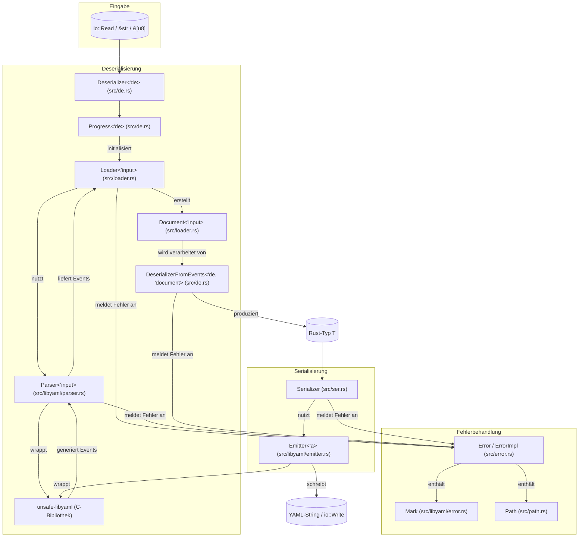

# dtolnay/serde-yaml

## GitHub & DeepWiki
- GitHub: https://github.com/dtolnay/serde-yaml
- DeepWiki: https://deepwiki.com/dtolnay/serde-yaml

## Kurze Einführung
`serde-yaml` ist eine Rust-Bibliothek, die das Serde-Serialisierungsframework für die Arbeit mit YAML-Daten implementiert. Sie ermöglicht die einfache Konvertierung von Rust-Datentypen in YAML-Strings und umgekehrt. Die Bibliothek ist für Entwickler gedacht, die YAML-Konfigurationsdateien, Datenformate oder andere YAML-basierte Anwendungen in Rust verarbeiten müssen. 

## Die 3 wichtigsten (oder komplexesten) Algorithmen

### 1. YAML Parsing und Event-Generierung (`Parser::next`)
Der `Parser` in `src/libyaml/parser.rs` ist für die Umwandlung von rohen YAML-Bytes in einen Strom von YAML-Ereignissen zuständig.  Er kapselt die C-Bibliothek `unsafe-libyaml`, um die YAML-Parsing-Logik zu handhaben.  Die Methode `Parser::next()` liest das nächste YAML-Ereignis aus dem Eingabestrom, konvertiert es von der C-Repräsentation (`yaml_event_t`) in eine sichere Rust-Repräsentation (`Event`) und gibt es zusammen mit Positionsinformationen (`Mark`) zurück. 

**Warum prägend**: Dieser Algorithmus ist grundlegend, da er die Brücke zwischen der externen C-Bibliothek `libyaml` und der Rust-Umgebung schlägt.  Er ist entscheidend für die Performance und Korrektheit des Parsens, da er die Low-Level-Details der YAML-Spezifikation handhabt und gleichzeitig eine sichere und idiomatische Rust-API bereitstellt. 

### 2. Dokumenten-Assemblierung und Ankerauflösung (`Loader::next_document`)
Der `Loader` in `src/loader.rs` nimmt den Ereignisstrom vom `Parser` entgegen und setzt ihn zu vollständigen `Document`-Strukturen zusammen.  Eine zentrale Aufgabe ist die Auflösung von YAML-Ankern (`&name`) und Aliasen (`*name`).  Der `Loader` verfolgt Anker in einer `BTreeMap<Anchor, usize>` und speichert die aufgelösten Alias-IDs und deren Positionen im Ereignisstrom in `document.aliases`.  

**Warum prägend**: Dieser Algorithmus ist entscheidend für die korrekte Interpretation komplexer YAML-Dokumente, insbesondere solcher, die Anker und Aliase verwenden.  Er ermöglicht die effiziente Handhabung von Referenzen innerhalb des Dokuments und verhindert Datenredundanz. Die Auflösung auf dieser Ebene stellt sicher, dass der nachfolgende Deserialisierungsprozess eine konsistente und vollständige Datenstruktur erhält. 

### 3. Deserialisierung von Ereignisströmen mit Alias-Auflösung und Rekursionsschutz (`DeserializerFromEvents::jump`)
Die Struktur `DeserializerFromEvents` in `src/de.rs` implementiert das `serde::Deserializer`-Trait und verarbeitet den Ereignisstrom eines einzelnen `Document`.  Eine wichtige Methode ist `jump()`, die aufgerufen wird, wenn ein `Event::Alias` angetroffen wird.  Sie sucht die Zielposition des Alias im `document.aliases`-Mapping und aktualisiert den aktuellen `pos`-Zeiger, um die Deserialisierung an der referenzierten Stelle fortzusetzen.  Um Denial-of-Service-Angriffe (z.B. "Billion Laughs Attack") zu verhindern, wird ein `jumpcount` geführt, der eine maximale Anzahl von Sprüngen begrenzt.  Zusätzlich schützt ein `remaining_depth`-Zähler vor unendlicher Rekursion. 

**Warum prägend**: Dieser Algorithmus ist entscheidend für die Sicherheit und Robustheit der Deserialisierung.  Er ermöglicht die korrekte Handhabung von Aliasen, die auf komplexe Datenstrukturen verweisen, und schützt gleichzeitig vor bösartigen Eingaben, die zu unendlichen Schleifen oder übermäßigem Ressourcenverbrauch führen könnten. 

## Architektur & Zusammenspiel

          

## Notes
Die Bibliothek `serde-yaml` verwendet `IndexMap` für die `Mapping`-Struktur, um die Reihenfolge der Schlüssel in YAML-Mappings zu erhalten, was für die semantische Korrektheit von YAML wichtig ist.   Dies ist eine bewusste Designentscheidung, da YAML-Mappings im Gegensatz zu JSON-Objekten eine definierte Reihenfolge haben können. 

Für die Serialisierung von Zahlen werden spezialisierte Crates wie `itoa` und `ryu` verwendet, um eine optimierte und schnelle Konvertierung von Ganzzahlen und Gleitkommazahlen in Strings zu gewährleisten.  Dies trägt zur Performance der Serialisierung bei.  

Die Fehlerbehandlung ist detailliert und umfasst verschiedene `ErrorImpl`-Varianten, die spezifische Fehlerzustände wie I/O-Fehler, unbekannte Anker oder Rekursionslimit-Überschreitungen abdecken.  Fehler enthalten auch `Mark`-Informationen, um die genaue Position des Fehlers im YAML-Dokument anzugeben. 

Wiki pages you might want to explore:
- [YAML Parsing and Document Loading (dtolnay/serde-yaml)](/wiki/dtolnay/serde-yaml#6.3)
- [Architecture and Internals (dtolnay/serde-yaml)](/wiki/dtolnay/serde-yaml#9)

View this search on DeepWiki: https://deepwiki.com/search/zielrepository-dtolnayserdeyam_9fe7f3d4-9fc5-4dc7-a6ba-332c7f5c0758
