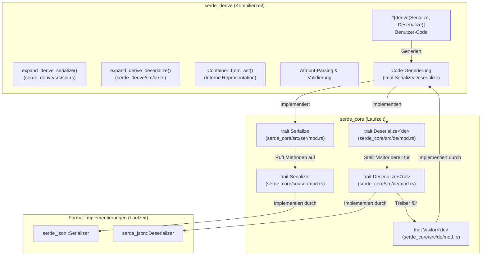

# serde-rs/serde

## GitHub & DeepWiki
- GitHub: https://github.com/serde-rs/serde
- DeepWiki: https://deepwiki.com/serde-rs/serde

## Kurze Einführung
Serde ist ein Framework für die effiziente und generische Serialisierung und Deserialisierung von Rust-Datenstrukturen. Es trennt Datenstrukturen von Datenformaten durch ein Trait-System, das eine gemeinsame Datenmodell-Sprache verwendet. Dies ermöglicht es, jede unterstützte Datenstruktur mit jedem unterstützten Datenformat zu serialisieren und deserialisieren. 

## Die 3 wichtigsten (oder komplexesten) Algorithmen

### 1. Derive-Makros für `Serialize` und `Deserialize`
**Name & Verortung im Code:** Die Derive-Makros `#[proc_macro_derive(Serialize, attributes(serde))]` und `#[proc_macro_derive(Deserialize, attributes(serde))]` befinden sich in `serde_derive/src/lib.rs` . Die Implementierungslogik ist in `serde_derive/src/ser.rs` für die Serialisierung und `serde_derive/src/de.rs` für die Deserialisierung zu finden.  

**Detaillierte technische Funktionsweise:** Diese prozeduralen Makros analysieren die AST (Abstract Syntax Tree) von Rust-Strukturen und Enums zur Kompilierzeit.  Sie extrahieren `#[serde(...)]`-Attribute und generieren basierend auf der Struktur (Struct, Enum, Feldtypen) den entsprechenden Code für die `Serialize`- und `Deserialize`-Trait-Implementierungen.   Der Prozess umfasst das Parsen des Inputs in ein `syn::DeriveInput` AST, das Ersetzen von `Self` durch den konkreten Typ, das Erstellen einer internen `Container`-Repräsentation, das Parsen von Attributen, die Validierung von Constraints, die Berechnung generischer Bounds und die eigentliche Codegenerierung.  

**Warum prägend:** Diese Makros sind entscheidend für Serdes "Zero-Cost Abstraction"-Ansatz.  Sie eliminieren die Notwendigkeit manueller Trait-Implementierungen und ermöglichen es Entwicklern, komplexe Datenstrukturen einfach serialisierbar/deserialisierbar zu machen, ohne Laufzeit-Overhead durch Reflection.  Die Codegenerierung zur Kompilierzeit führt zu einer Performance, die mit handgeschriebenem Code vergleichbar ist. 

### 2. Das Serde Datenmodell und die `Serializer`/`Deserializer` Traits
**Name & Verortung im Code:** Die Kern-Traits `Serialize`, `Deserialize`, `Serializer` und `Deserializer` sind im `serde_core`-Crate definiert, insbesondere in `serde_core/src/ser/mod.rs` und `serde_core/src/de/mod.rs`.    

**Detaillierte technische Funktionsweise:** Das Serde-Datenmodell definiert 29 primitive Typen, die alle möglichen Rust-Datenstrukturen formatunabhängig repräsentieren.   Die `Serialize`-Implementierung einer Datenstruktur ruft Methoden auf dem `Serializer`-Trait auf, um sich in diese Datenmodelltypen zu übersetzen.  Umgekehrt erstellt die `Deserialize`-Implementierung eine Datenstruktur, indem sie einen `Visitor` bereitstellt, der vom `Deserializer` mit Datenmodelltypen gefüllt wird.  Der `Serializer` akzeptiert Datenmodelltypen und schreibt sie in das Ausgabeformat, während der `Deserializer` aus dem Eingabeformat liest und den `Visitor` mit Datenmodelltypen versorgt.  

**Warum prägend:** Dieses System ermöglicht eine vollständige Entkopplung zwischen Datenstrukturen und Datenformaten.  Jede Datenstruktur, die `Serialize` und `Deserialize` implementiert, kann mit jedem Format (z.B. JSON, YAML), das `Serializer` und `Deserializer` implementiert, arbeiten. Dies fördert die Wiederverwendbarkeit und Modularität im Serde-Ökosystem. 

### 3. Deserialisierungs-Visitor-Muster
**Name & Verortung im Code:** Das Visitor-Muster ist ein zentraler Bestandteil der `Deserialize`-Trait-Implementierung und wird durch den `Visitor`-Trait in `serde_core/src/de/mod.rs` definiert.  (Referenz aus Wiki, genaue Zeilen nicht im Snippet). Die Codegenerierung für den Visitor findet in `serde_derive/src/de/struct_.rs` und verwandten Dateien statt. 

**Detaillierte technische Funktionsweise:** Beim Deserialisieren einer Datenstruktur ruft die `Deserialize`-Implementierung `deserializer.deserialize_struct(name, fields, visitor)` auf.  Der `Deserializer` parst den Input und ruft dann die entsprechende `visit_*`-Methode auf dem bereitgestellten `Visitor` auf (z.B. `visit_map` für eine Struktur).  Der `Visitor` ist für den iterativen Zugriff auf die Daten (z.B. Felder einer Map) über `MapAccess` oder `SeqAccess` verantwortlich und konstruiert die endgültige Datenstruktur. 

**Warum prägend:** Das Visitor-Muster ermöglicht es dem Deserializer, den Deserialisierungsprozess zu steuern, was für nicht-selbstbeschreibende Formate wie Postcard unerlässlich ist.  Es unterstützt auch Zero-Copy-Deserialisierung, indem es der deserialisierten Datenstruktur erlaubt, vom Eingabepuffer zu borgen, was die Performance durch Vermeidung unnötiger Allokationen verbessert. 

## Architektur & Zusammenspiel

## Notes
Serde verwendet eine `Ctxt`-Struktur in `serde_derive/src/internals/ctxt.rs` (nicht im Snippet enthalten) für die Fehlerbehandlung in den Derive-Makros. Dies ermöglicht das Sammeln mehrerer Fehler und die Zuordnung zu spezifischen AST-Knoten für präzise Compiler-Diagnosen.  Die `#[serde(remote = "...")]`-Attribute ermöglichen die Implementierung von `Serialize`/`Deserialize` für Typen aus externen Crates, ohne diese direkt zu modifizieren, indem ein Wrapper generiert wird.  

Wiki pages you might want to explore:
- [Core Traits and Data Model (serde-rs/serde)](/wiki/serde-rs/serde#2)
- [Derive Macros (serde-rs/serde)](/wiki/serde-rs/serde#3)

View this search on DeepWiki: https://deepwiki.com/search/zielrepository-serdersserde-er_9c67346c-ca7d-4682-bd9a-82c5f5152ba5
