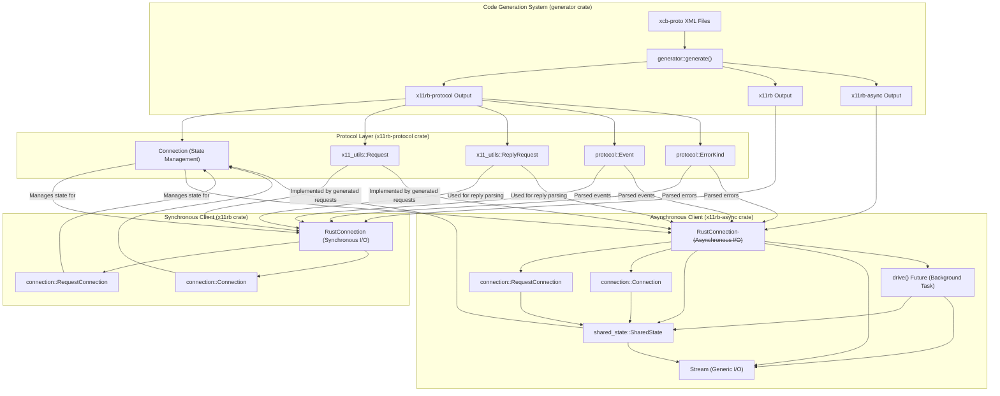

# psychon/x11rb

## GitHub & DeepWiki
- GitHub: https://github.com/psychon/x11rb
- DeepWiki: https://deepwiki.com/psychon/x11rb

## Kurze Einführung
`x11rb` ist eine Rust-Bibliothek, die eine reine Rust-Implementierung des X11-Protokolls bietet. Sie ermöglicht die Interaktion mit einem X11-Server, indem sie das Senden von Anfragen und den Empfang von Antworten und Ereignissen verwaltet. Die Bibliothek ist in mehrere Crates unterteilt, wobei `x11rb-protocol` die Protokolldefinitionen ohne I/O enthält und `x11rb` sowie `x11rb-async` die Client-Implementierungen für synchrone bzw. asynchrone Verbindungen bereitstellen.   

## Die 3 wichtigsten (oder komplexesten) Algorithmen

### 1. Code-Generierungssystem
Das Code-Generierungssystem ist in der `generator`-Crate implementiert und befindet sich hauptsächlich in `generator/src/generator/mod.rs` . Es ist verantwortlich für die automatische Erstellung von Rust-Bindings für das X11-Protokoll aus XML-Protokollbeschreibungen, die vom `xcb-proto`-Projekt stammen. 

**Detaillierte technische Funktionsweise:**
Der Generator verarbeitet XML-Dateien und erzeugt Rust-Code für drei Ziel-Crates: `x11rb-protocol`, `x11rb` und `x11rb-async`.  Der Prozess beginnt in der Funktion `generate()`, die die gesamte Pipeline orchestriert.  Für jeden Namespace (Core X11 und Erweiterungen) wird ein `NamespaceGenerator` verwendet, der verschiedene Definitionstypen wie Anfragen, Ereignisse und Typen durch spezialisierte Sub-Generatoren verarbeitet.   Beispielsweise generiert das `request`-Modul Strukturen für Anfragen und Antworten sowie Methoden für die `Connection`-Traits.  Es werden auch Master-Enums wie `Request`, `Reply`, `Event` und `ErrorKind` generiert, die alle möglichen X11-Nachrichten umfassen. 

**Warum prägend:**
Dieses System ist prägend, da es die Grundlage für die gesamte Bibliothek bildet. Es automatisiert die Erstellung der umfangreichen X11-Protokolldefinitionen und stellt sicher, dass die Bindings aktuell und vollständig sind. Dies reduziert den manuellen Aufwand erheblich und minimiert Fehler, die bei der manuellen Implementierung eines so komplexen Protokolls auftreten könnten. Die Trennung in `x11rb-protocol` ermöglicht es anderen Crates, die Protokolldefinitionen ohne die I/O-Abhängigkeiten zu nutzen. 

### 2. Asynchrone Verbindungsverwaltung (`RustConnection<S>`)
Die asynchrone Verbindungsverwaltung wird durch die Struktur `RustConnection<S>` in der `x11rb-async`-Crate (`x11rb-async/src/rust_connection/mod.rs`) realisiert.  Sie ermöglicht nicht-blockierende X11-Kommunikation unter Verwendung von Rusts `async/await`-Syntax und dem Futures-Ökosystem. 

**Detaillierte technische Funktionsweise:**
`RustConnection<S>` verwaltet den X11-Protokollzustand und delegiert I/O-Operationen an ein generisches `Stream`-Interface.  Die Architektur trennt die Verbindungsverwaltung vom Paketlesen durch einen gemeinsam genutzten Zustand (`SharedState`).  Die Verbindung wird über Methoden wie `connect()` oder `connect_to_stream()` aufgebaut, die Authentifizierung und Setup-Verhandlungen umfassen.  Anfragen werden über die `RequestConnection`-Trait-Implementierung gesendet, die Cookie-basierte Anfragen verwendet.  Das Senden einer Anfrage (`send_request`) beinhaltet die Generierung von Sequenznummern, Längenberechnung, Pufferung und Synchronisationsmanagement.  Ein Hintergrund-Future (`drive()`) liest kontinuierlich Pakete vom Stream, setzt sie zusammen und reiht sie in den `ProtoConnection`-Zustand ein, wobei wartende Tasks benachrichtigt werden. 

**Warum prägend:**
Diese Implementierung ist entscheidend für die Performance und Skalierbarkeit der Bibliothek, da sie nicht-blockierende I/O ermöglicht. Durch die Trennung von Verbindungslogik und Paketlesen kann die Anwendung reaktionsfähig bleiben, während I/O-Operationen im Hintergrund ausgeführt werden. Dies ist besonders wichtig für GUI-Anwendungen oder Server, die viele X11-Verbindungen gleichzeitig verwalten müssen. Die generische `Stream`-Trait ermöglicht zudem Flexibilität bei der Wahl des Transportmechanismus (z.B. TCP, Unix-Sockets). 

### 3. Protokollzustandsverwaltung (`x11rb_protocol::connection::Connection`)
Die `Connection`-Struktur in `x11rb-protocol/src/connection/mod.rs`  ist eine reine Rust-, I/O-freie Implementierung des X11-Protokollzustands. Sie ist darauf ausgelegt, mit einem I/O-Backend kombiniert zu werden, um den Zustand des X11-Protokolls zu verwalten. 

**Detaillierte technische Funktionsweise:**
Diese Struktur verfolgt die Sequenznummern von gesendeten Anfragen (`last_sequence_written`, `sent_requests`), die erwartete nächste Antwort (`next_reply_expected`) und die zuletzt gelesene Sequenznummer (`last_sequence_read`).  Sie speichert auch ausstehende Ereignisse (`pending_events`) und Antworten (`pending_replies`) sowie Dateideskriptoren (`pending_fds`).  Die Methode `send_request()` weist eine Sequenznummer zu und speichert Informationen über die gesendete Anfrage, einschließlich ob eine Antwort erwartet wird und ob Dateideskriptoren enthalten sind.  `discard_reply()` ermöglicht das Ignorieren von Antworten für bereits gesendete Anfragen. 

**Warum prägend:**
Diese Struktur ist grundlegend, da sie den Kern des X11-Protokollzustands abstrahiert und I/O-unabhängig macht. Dies ermöglicht es, die Protokolllogik von den spezifischen I/O-Implementierungen (synchron oder asynchron) zu entkoppeln. Die präzise Verwaltung von Sequenznummern und ausstehenden Nachrichten ist entscheidend für die korrekte und zuverlässige Kommunikation mit dem X11-Server. Sie stellt sicher, dass Antworten den richtigen Anfragen zugeordnet werden und dass der Protokollfluss korrekt eingehalten wird, selbst bei komplexen Interaktionen mit Dateideskriptoren. 

## Architektur & Zusammenspiel

         

## Notes
Die Bibliothek legt großen Wert auf Sicherheit und versucht, die Verwendung von `unsafe`-Code zu minimieren, indem sie die Serialisierungs- und Deserialisierungscodes des X11-Protokolls in Rust neu implementiert, anstatt sich auf `libxcb` FFI zu verlassen. 
`x11rb-protocol` kann im `no_std`-Modus verwendet werden, was die Portabilität erhöht. 
Die Bibliothek unterstützt auch Dateideskriptor-Passing (FD-Passing) mit dem Server. 
Für die ID-Generierung wird ein `IdAllocator` verwendet, der bei Erschöpfung der IDs das XC-MISC-Protokoll zur Anforderung neuer Bereiche nutzen kann. 

Wiki pages you might want to explore:
- [Code Generation System (psychon/x11rb)](/wiki/psychon/x11rb#3)
- [Asynchronous Connections (psychon/x11rb)](/wiki/psychon/x11rb#5.2)

View this search on DeepWiki: https://deepwiki.com/search/zielrepository-psychonx11rb-er_2eb8afb4-7774-4e6a-816e-84465b934fe8
