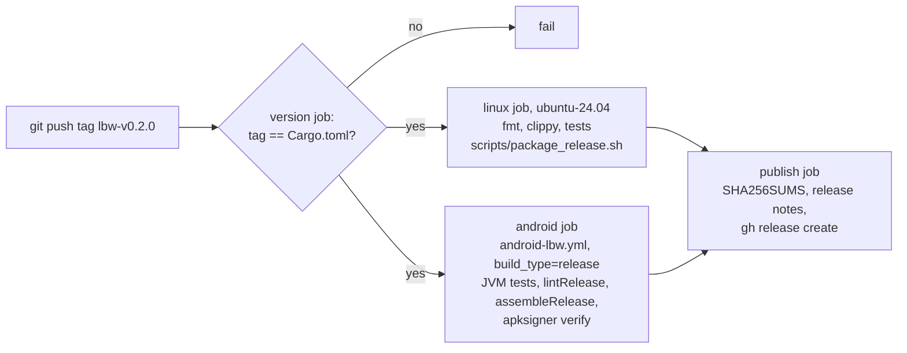

# Releasing lbw (server, Linux client, Android app)

A release is a Git tag `lbw-v<version>`. Pushing the tag starts
[`.github/workflows/release-29-lowbandwidth.yml`](../../../.github/workflows/release-29-lowbandwidth.yml),
which builds and tests everything, then creates the GitHub release with these assets:

| Asset | Contents |
|---|---|
| `lbw-server-<v>-linux-x86_64.tar.gz` | `lbw-server`, the PP-OCRv6 models in `models/`, `README.txt`, `LICENSE` |
| `lbw-client-<v>-linux-x86_64.tar.gz` | `lbw-client` (desktop, macroquad), `LICENSE` |
| `lbw-client-<v>-android.apk` | Release APK for arm64-v8a and x86_64, signed with the release key |
| `SHA256SUMS.txt` | Checksums of all assets |

Nothing is uploaded by hand; every asset comes from the workflow run.



## Version numbers

There is exactly **one** version: `[workspace.package] version` in
[`Cargo.toml`](Cargo.toml). All crates inherit it, and the Android build reads
it too (`android_client/android-app/app/build.gradle.kts`):

- `versionName` = the Cargo version, e.g. `0.2.0`;
- `versionCode` = `major*10000 + minor*100 + patch`, e.g. `200`.

So minor and patch must stay below 100, and every release must raise the
version. Android refuses to install a lower `versionCode` over a higher one.
A suffix such as `0.3.0-rc.1` marks the GitHub release as a **pre-release**.
It has the same `versionCode` as `0.3.0`.

The tag must be `lbw-v` followed by exactly that version. Otherwise the
`version` job fails before anything is built.

## One-time setup: Android signing key

Android only installs an update if it is signed with the **same key** as the
installed version. So the key has to be created once and kept forever. If it
is lost, users must uninstall the app (and lose its settings and host-key
pins) before they can install a new version.

1. Create the keystore (outside the repository):

   ```sh
   keytool -genkeypair -keystore lbw-release.jks -alias lbw \
     -keyalg RSA -keysize 4096 -validity 10000 -dname "CN=lbw"
   ```

   Store `lbw-release.jks` and its password in a password manager or backup.
   **Never commit it.**

2. Store it as repository secrets (Settings → Secrets and variables →
   Actions, or with the `gh` CLI):

   ```sh
   base64 -w0 lbw-release.jks | gh secret set LBW_KEYSTORE_BASE64
   gh secret set LBW_KEYSTORE_PASSWORD      # prompts for the value
   gh secret set LBW_KEY_ALIAS --body lbw
   gh secret set LBW_KEY_PASSWORD           # optional; defaults to the keystore password
   ```

If `LBW_KEYSTORE_BASE64` is missing, the workflow still publishes, but with
a warning. The APK is then named `lbw-client-<v>-android-debugsigned.apk`
and signed with the runner's throwaway debug key. It installs fine, but
every later release needs an uninstall first. Use this only for testing.

Local signed builds use the same variables, with a file path instead of base64:

```sh
export LBW_KEYSTORE=$HOME/keys/lbw-release.jks LBW_KEYSTORE_PASSWORD=… LBW_KEY_ALIAS=lbw
GRADLE_TASKS="testDebugUnitTest lintRelease assembleRelease" android_client/scripts/build_android.sh
```

## Checklist for a release

All commands are run from `examples/29_lowbandwidth/source6` unless noted.

1. **Start from a clean, up-to-date `master`** with green CI
   (`android-lbw.yml`):

   ```sh
   git switch master && git pull --ff-only && git status --short
   ```

2. **Bump the version** in `Cargo.toml` (`[workspace.package] version`).
   This is the only file to change: the crates inherit the version, internal
   path dependencies are not version-pinned, and `Cargo.lock` is not tracked
   (repository-wide `.gitignore`). CI therefore resolves dependencies fresh,
   within the ranges in the `Cargo.toml` files.

   ```sh
   sed -i '/^\[workspace.package\]/,/^\[/ s/^version = ".*"/version = "0.2.0"/' Cargo.toml
   git diff --stat                  # only Cargo.toml
   ```

3. **Verify locally** (the same steps the workflow runs):

   ```sh
   cargo fmt --all --check
   cargo clippy --workspace --all-targets -- -D warnings
   cargo test --workspace --release
   scripts/package_release.sh /tmp/lbw-dist         # both tar.gz, prints the minimum glibc
   (cd android_client && GRADLE_TASKS="testDebugUnitTest lintRelease assembleRelease" scripts/build_android.sh)
   ```

   Optional, but recommended after changes to the app: run the emulator HIL
   test with both APKs. With the release APK, checks 5d/5e are skipped
   because `run-as` needs a debuggable app.

   ```sh
   cd android_client
   scripts/emulator_e2e.sh
   APK=$PWD/android-app/app/build/outputs/apk/release/app-release.apk scripts/emulator_e2e.sh
   ```

4. **Commit and push** the version bump:

   ```sh
   git commit -am "chore(release): lbw 0.2.0"
   git push origin master
   ```

5. **Tag and push the tag.** An annotated tag records who released and when.

   ```sh
   git tag -a lbw-v0.2.0 -m "lbw 0.2.0"
   git push origin lbw-v0.2.0
   ```

6. **Watch the workflow** (about 15–25 minutes; Rust release builds with LTO
   dominate):

   ```sh
   gh run watch "$(gh run list --workflow release-29-lowbandwidth.yml -L1 --json databaseId -q '.[0].databaseId')"
   ```

7. **Check the published release:**

   ```sh
   mkdir /tmp/rel && cd /tmp/rel
   gh release download lbw-v0.2.0
   sha256sum -c SHA256SUMS.txt
   $ANDROID_HOME/build-tools/37.0.0/apksigner verify --print-certs lbw-client-0.2.0-android.apk
   tar xzf lbw-server-0.2.0-linux-x86_64.tar.gz && ./lbw-server-0.2.0-linux-x86_64/lbw-server --help
   ```

   The certificate digest printed by `apksigner` must be the same for every
   release.

## Dry run without publishing

Starting the workflow manually on a **branch** builds and tests everything
and keeps the files as workflow artifacts (`lbw-linux-release`,
`lbw-client-release-apk`), but does not create a release. The version
check then only validates the format of the version:

```sh
gh workflow run release-29-lowbandwidth.yml --ref master
gh run download <run-id> -n lbw-linux-release -n lbw-client-release-apk
```

## When something goes wrong

| Symptom | Cause and fix |
|---|---|
| `tag lbw-v… does not match Cargo.toml version …` | The tag was set on the wrong commit or the bump was not committed. Delete the tag (`git push origin :refs/tags/lbw-vX; git tag -d lbw-vX`), fix, tag again. |
| Build breaks although nothing changed | A dependency released a new version within the allowed range (no lock file). Pin it in the crate's `Cargo.toml` (`=x.y.z`) and release again. |
| A job failed for a flaky reason (network, runner) | Re-run the failed jobs in the Actions UI. The publish job is idempotent: if the release already exists, it replaces the assets (`gh release upload --clobber`) and updates the notes. |
| Warning `LBW_KEYSTORE_BASE64 not set` | Secrets are missing (see one-time setup); the APK is `-debugsigned`. |
| Phone reports `App not installed` / `INSTALL_FAILED_UPDATE_INCOMPATIBLE` | The installed app was signed with a different key (e.g. a debug build). Uninstall it first. |
| `INSTALL_FAILED_VERSION_DOWNGRADE` | The installed `versionCode` is higher; releases must raise the version. |
| Server: `version 'GLIBC_2.39' not found` | The target system is older than Ubuntu 24.04 / Debian 13. Build there with `scripts/package_release.sh`. |
| Client: `LibraryNotFound(DlOpenError("libXi.so.6"))` | macroquad loads X11/GL at runtime: `apt install libx11-6 libxi6 libgl1`. |
| Server fails to load `gpa_640_int8.onnx` | The GUI detector model is not shipped (Ultralytics export, AGPL). Start with `--gui none`, or export it via `examples/26_onnx/source8/scripts/export_models.sh`. |

A published release should not be changed afterwards. For a real bug, release
the next patch version instead of moving the tag.

## Files involved

| File | Role |
|---|---|
| `.github/workflows/release-29-lowbandwidth.yml` | Tag trigger, version check, Linux build, publish job |
| `.github/workflows/android-lbw.yml` | APK build; called with `build_type: release` (signing, `apksigner verify`) |
| `scripts/package_release.sh` | Builds and packs the Linux archives (same locally and in CI) |
| `scripts/fetch_models.sh` | Downloads the OCR models (SHA256-checked) |
| `android_client/scripts/build_android.sh` | `.so` for both ABIs, Unifont, Gradle; `GRADLE_TASKS` selects debug/release |
| `android_client/android-app/app/build.gradle.kts` | Version from `Cargo.toml`, release signing from `LBW_KEYSTORE*` |
