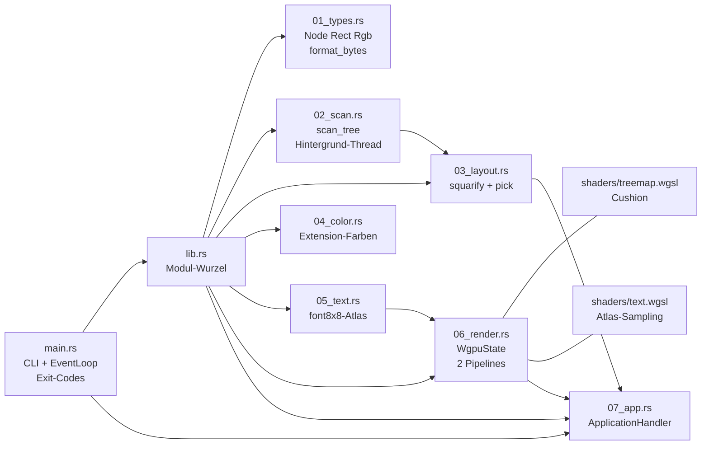
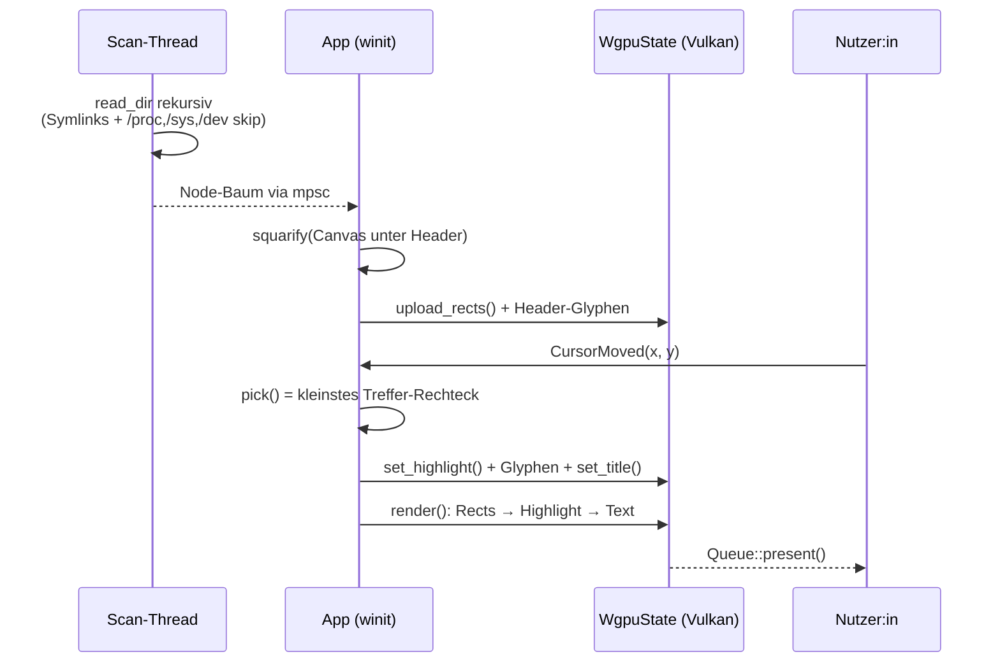

# Walkthrough: Treemap-Disk-Visualisierer (wgpu + winit, Vulkan-only)

> Ein minimaler Disk-Usage-Visualisierer in Rust: 3 direkte Dependencies,
> 107 Crates im Graphen, 3,1 MB Binary, ein Vulkan-Device, zwei Shader.

## 1. Was exakt implementiert wurde

### 1.1 Überblick & Funktionalität

Das Programm `treemap [VERZEICHNIS]` scannt ein Verzeichnis rekursiv und
zeichnet jede Datei als flächenproportionales Rechteck — eine **Treemap**.
Eine Treemap ist eine platzfüllende Visualisierung hierarchischer Daten:
Die Fläche jedes Rechtecks entspricht der Dateigröße, Verschachtelung
entspricht der Verzeichnishierarchie. Das Layout-Verfahren heißt
**Squarify** (Bruls et al.): Es gruppiert Rechtecke so in Zeilen, dass sie
möglichst quadratisch bleiben — Quadrate lassen sich deutlich besser
vergleichen als dünne Streifen.

Pflicht-Features (alle umgesetzt):

- **Squarified Treemap**: Rechtecke für alle Dateien/Verzeichnisse,
  flächenproportional, rekursiv verschachtelt.
- **Mouse-Hover**: Unter dem Cursor wird die tiefste Datei bzw. das
  tiefste Verzeichnis erkannt und als `Pfad (Größe)` in einer
  On-Screen-Headerzeile **und** im Fenster-Titel angezeigt. Das
  Hover-Rechteck erhält zusätzlich ein helles Highlight mit weißer Kante.

Nice-to-have (beides umgesetzt):

- **Farbe kodiert den Dateityp**: Quelltext grün, Bilder blau, Medien
  violett, Archive rot, alles andere deterministisch aus dem Dateinamen
  gehasht (stabile Pastellfarbe).
- **Cushion-Treemap im Shader**: Jedes Rechteck wird im Fragment-Shader
  parabolisch zur Mitte aufgehellt („Cushion“ = Kissen) und erhält eine
  dunkle 1,5-px-Innenkante — Tiefe ganz ohne Geometrie-Mehraufwand.

Bedienung: `treemap [DIR]` (Default: `.`), Beenden per Fenster-Schließen
oder `Esc`. Exit-Codes: `0` ok, `1` kein Verzeichnis, `2` Fenster-/
GPU-Fehler. Während des Scans zeigt die Headerzeile `Scanning …`.

### 1.2 Gemessene Realität (keine Prospektwerte)

| Messung | Ergebnis |
|---|---|
| Direkte Dependencies | 3 (`wgpu`, `winit`, `font8x8`) |
| Crates im Graph (`cargo tree`) | 107 statt 152 mit Default-Features (−30 %) |
| GLES-/Wayland-Pakete (`glow`, `glutin`, `sctk`, …) | 0 |
| Release-Binary (`strip` + LTO + `opt-level="z"` + `panic="abort"`) | 3,1 MB |
| Scan von `/` (638 GB belegt) | < 20 s, 385 MB RSS |
| Unit-/Integrationstests | 22 + 1, alle grün; Clippy mit `-D warnings` sauber |
| Render-Nachweis (Xvfb + llvmpipe) | 605 Farben im Frame, Header-Text per Pixelanalyse bestätigt |

So sieht der echte Output aus — Screenshot des `/`-Scans, als
Helligkeits-ASCII (80×24) aus dem Xvfb-Framebuffer gelesen:

```text
:-------------=-===-=-----=---------::--------::----:--------==--------==------:
*###++++*#***+*****+#**************************#*****#*%%*%#+***********+*=*+*++
#%##****#%%*#+##**#*####*####################**#*****#*##*#%*#*##********#+*+***
***##*####*#%+#****+****#######%%%%%%%#######*##*#***********##**+*+****+++*+***
***#****##++=+###*#*%#*######%%%%%%%%%%%######*#***#***#**#*#**#*+***+++*++*****
*###*#+##*+*=+#****+++++####%%%%%%%%%%%%%#######*****#***##*#*#******+***##*****
#%%###*#%###%##**#**#%%#####%%%%%%%%%%%%%#######*****#**********************++**
*#####+##**+***+****###*####%%%%%%%%%%%%%######%***###**#*+*****#****+**+*+++***
##**####*+*******###*#########%%%%%%%%%%#####*#%#######*****+*++++*+++****+**=+*
*#######***********++##*#####################*##***###**#*****+++************+++
#%#####%##%#***+*%#*+*##*###################**###**##*=*#*##%+***##***#***%**+=-
******##*#**#**+***+*+##***########**#%%%%%%%####**#*+==*+**#*##*#****%##++*##*=
*##**+#+************#*#**#############%@@@@@@%#++**####****##*#####*****+===*+*+
####%**+**#*#####*******####%%%%%%####%@@@@@@%****+**++*++**+*##******++=+++###*
*##*#**++*#*+*#*#####***###%%%%%%%####%%%%%%%%#*#*+*++=+##**#*#*+++***++++++#%#*
*#****#*#*#++++++*++***+####%%%%%%#####%%%%%####***#***#*=****++**#+++*#***=+++=
###**+*####+=+++++++===+*##############%%%%%%###**+***+***+*+*****+##*++#%#*+=*=
*##**+**##*++*++=-+---+=*##########***#######*#*++***++*++*++*####+***+*++++***+
##**#**#*******===+====+####%%%%###*########*******##*+**+*++*%%%#****+*=+*****+
*##*##*+***++*++=++==--=##%%%%%%%##*%###%%##*##**++*#**#*++++*#%##****+++*****++
++===+=+++*###**+***+=++###%%%%%###*########*****+++**++*+++=*###***+=-=+++**+++
**++***++++#%#*####**=+++*##++++++*++###*++**+#%####*##%%##**#**#****++*++*++=+*
#%###**#**+*%#*%##%#*++++*+*====-=--=###+=-+**#%#**####%###**###*****#+=++**=-=+
#%#%%**#****%##%##%%*++==+*=*#*+**+++++=+#**+=#%###*###%%****#**+**=++*++*+==+++
```

Zeile 1 ist die Headerzeile mit dem Hover-Text; darunter hunderte
verschachtelte Rechtecke mit sichtbaren Cushion-Verläufen (`%%%`-Kerne).

### 1.3 Modul-Architektur



Jede Datei trägt genau eine Zuständigkeit (alle < 300 Zeilen, Vorgabe
eingehalten); `main.rs`/`lib.rs` enthalten keine Geschäftslogik.

### 1.4 Laufzeit-Datenfluss: vom Byte zum Pixel



```mermaid
stateDiagram-v2
    [*] --> Scanning: App::new startet Thread
    Scanning --> Ready: about_to_wait empfängt Node-Baum
    Ready --> Ready: CursorMoved → Hover-Update + Redraw
    Ready --> Ready: Resized → Relayout + Redraw
    Ready --> [*]: CloseRequested / Esc
    Scanning --> [*]: CloseRequested / Esc
```

Entscheidend: **On-Demand-Rendering** (`ControlFlow::Wait`). Ohne
Interaktion wird kein einziger Frame berechnet — im Leerlauf liegt die
CPU-Last bei null. Frames entstehen nur bei Resize, Hover-Wechsel oder
frischen Scan-Daten.

## 2. Architektur- und Design-Entscheidungen

### 2.1 Getroffene Entscheidungen (mit Begründung)

**Vulkan-only, zweimal erzwungen.** In `Cargo.toml` (`default-features =
false` + nur `vulkan`, `wgsl`) und zur Laufzeit
(`Backends::VULKAN`). Ergebnis: Null GLES-/GL- und Null
Wayland-Pakete im Graphen. Bei `winit` ist zusätzlich nur `x11`
aktiv — Wayland entfällt bewusst (Xvfb-Testbarkeit, halbierter
Plattform-Code). Preis: Unter reinem Wayland ohne XWayland läuft das
Programm nicht — dokumentierte Trade-off-Entscheidung für Minimalität.

**Zwei Pipelines, ein Render-Pass, kein Vertex-Buffer.** Rechtecke und
Text sind *instanziierte Quads*: Pro Rechteck/Glyphe eine Instanz in
einem **Storage-Buffer** (GPU-seitig lesbares Array), die sechs
Dreiecks-Ecken errechnet der Vertex-Shader arithmetisch aus
`vertex_index`. Das spart den kompletten Vertex-Buffer-Apparat
(Layouts, Strides, Uploads) und ist das von DeepWiki empfohlene
wgpu-Minimalmuster.

**Pixel-Koordinaten + Screen-Uniform statt Matrizen.** Instanzen tragen
Fenster-Pixel; ein 8-Byte-Uniform (`width`, `height`) rechnet im Shader
nach **NDC** (Normalized Device Coordinates, −1…1) um. Kein
`glam`/`nalgebra` nötig — und Picking (CPU) und Rendering (GPU) sprechen
dasselbe Koordinatensystem, was eine ganze Fehlerklasse ausschließt.

**Hover-Picking auf der CPU, tiefster Treffer gewinnt.** `pick()` filtert
alle Rechtecke, die den Cursor enthalten, wählt das kleinste und steigt
rekursiv ab. Kosten O(n), bei 65k Rechtecken unmerklich, dafür exakt und
ohne GPU-Readback (der wäre langsam und kompliziert).

```rust
pub fn pick(nodes: &[Node], x: f32, y: f32) -> Option<&Node> {
    let hit = nodes
        .iter()
        .filter(|n| n.rect.contains(x, y))
        .min_by(|a, b| a.rect.area().total_cmp(&b.rect.area()))?;
    Some(pick(&hit.children, x, y).unwrap_or(hit))
}
```

**Highlight als separater 1-Instanz-Draw.** Statt bei jedem Hover-Wechsel
den 2-MB-Rechteck-Buffer umzuschreiben, liegt das Highlight in einem
eigenen 32-Byte-Buffer mit eigener Bind-Group und wird mit derselben
Pipeline (Flag `FLAG_HI` → Aufhellung + weiße Kante) darüber gezeichnet.

**Text ohne Font-Stack.** `wgpu_glyph`/`glyphon` würden
`ab_glyph`/`ttf-parser`/Threading für eine einzige Textzeile reinziehen.
Stattdessen: `font8x8` (null transitive Dependencies) → 96 ASCII-Glyphen
werden einmalig in eine 128×48-RGBA-**Atlas**-Textur gerastert (ein Atlas
packt viele kleine Bilder in eine Textur, hier ein 16×6-Grid aus
8×8-Zellen); pro Zeichen eine Instanz. Umlaute werden transliteriert
(`ä`→`a`), Rest wird `?`. Kosten: eine 24-KB-Textur.

**Eigener `block_on` statt `pollster`.** Die wgpu-Initialisierung
(`request_adapter`, `request_device`) liefert Futures; der übliche
`pollster`-Einzeiler ist ein ~20-Zeilen-Park/Unpark-Executor mit
`std::task` — also selbst geschrieben, eine Dependency weniger:

```rust
pub fn block_on<F: Future>(future: F) -> F::Output {
    // ... Waker parkt den Thread, wake() weckt ihn per unpark() ...
    loop {
        match future.as_mut().poll(&mut cx) {
            Poll::Ready(value) => return value,
            Poll::Pending => std::thread::park(),
        }
    }
}
```

**`lib.rs` + `main.rs`-Split.** Die Module leben in einer Library (alle
`pub`), das Binary ist reine Verdrahtung. Das ermöglicht
Integrationstests (`tests/scan_layout.rs` nutzt die echte
Scan→Layout→Pick-Pipeline) und hält jeden Commit für sich kompilier-
und testbar.

**Obergrenzen gegen Riesen-Bäume.** Rekursion nur für Rechtecke > 4 px
(MVP-Regel), Zeichen-Skip unter 1 px, Instanz-Cap bei 262.144 Rechtecken
(8 MB Buffer) und 512 Glyphen. Gesammelt wird in **Breitensuche**, damit
die Kappe nur tiefes Detail trifft statt ganzer Regionen (anfangs
Tiefensuche — ließ unten rechts grau, s. 2.2); ein Canvas-Hintergrund in
Verzeichnisfarbe fängt jeden Rest ab. Der `/`-Scan mit Millionen Dateien
läuft dadurch in < 20 s bei 385 MB RSS.

### 2.2 Was Tests und Probleme spontan erzwangen

**Schwarzes Fenster: `Queue::present` statt `drop`.** Der erste Xvfb-Lauf
zeigte nur Schwarz — nicht einmal die Clear-Farbe. Ursache: In wgpu 30
gibt es kein `SurfaceTexture::present()` mehr; ein bloßes Fallenlassen
ruft `texture_discard()` auf und **verwirft** den Frame stillschweigend.
Die Present-API heißt jetzt `Queue::present(frame)` — nach dem Submit.
Diagnoseweg: Screenshots waren schwarz trotz `Success`-Frames, also
wgpu-Registry-Quelle gelesen (`surface_texture.rs`, `queue.rs`). Der
DeepWiki-Stand (wgpu 0.20/0.25) kannte diese API noch nicht —
**Learning: Bei Versionsdifferenz ist die lokale Registry-Quelle das
Orakel, nicht die Doku.**

**`winit` ohne `rwh_06` kompiliert nicht.** Mit
`default-features = false` + nur `x11` fehlen die
`HasWindowHandle`/`HasDisplayHandle`-Impls an `Window` (sie hängen am
separaten Default-Feature `rwh_06`), und `create_surface` scheitert mit
Trait-Bound-Fehlern. Fix: `features = ["x11", "rwh_06"]` — kostet nur
das dep-lose `raw-window-handle` 0.6. In `deps.md`/`plan.md` nachgetragen.

**wgpu-30-Feldneuerungen.** `InstanceDescriptor` hat kein `Default` mehr
→ `new_without_display_handle()` + `backends`-Override;
`RequestAdapterOptions` verlangt `apply_limit_buckets: false`;
`RenderPassDescriptor` verlangt `multiview_mask: None`;
`PipelineLayoutDescriptor.bind_group_layouts` ist `&[Option<&…>]`.
Alles per Compiler-Feedback aus der Registry-Quelle übernommen.

**MVP-Bug gefixt: Dateigrößen fehlten in Verzeichnisgrößen.** Das
macroquad-Vorbild addierte nur Unterverzeichnis-, aber nie direkte
Dateigrößen auf `Node.size` — Verzeichnisse mit vielen direkten Dateien
wurden zu klein gemeldet (und falsch gehover-t). Jetzt gilt: `size` =
exakte Kindersumme, per Test (`sizes_consistent`) abgesichert. Ebenfalls
gehärtet: `/proc|/sys|/dev`-Erkennung via `Path::starts_with`
(komponentenweise) statt String-Präfix, Extension-Match case-insensitiv
mit mehr Endungen.

**Laufzeit-Dep `libxkbcommon-x11`.** winit lädt sie per `dlopen`; im
schlanken Container fehlte sie → Panik beim Start. Per `apt` installiert
und unten fürs Dockerfile notiert. Reine Laufzeit-, keine Compilezeit-
Abhängigkeit.

**Graue Region trotz Hover-Treffern (Nutzer-Fund).** Auf großen Platten
blieb unten rechts grau, obwohl Hover dort Dateien fand. Ursache:
`collect_rects` sammelte per Tiefensuche und kappte bei 65.536
Instanzen — hintere Top-Level-Teilbäume (sortiert klein = unten rechts)
wurden nie gezeichnet, `pick()` (ohne Kappe) fand sie trotzdem. Fix:
Breitensuche + Cap auf 262.144 + Canvas-Hintergrund. Vorher/Nachher auf
100k-Dateien-Fixture: Hintergrund-Anteil unten rechts 82,7 % → 0 %.

**Scan-Ergebnis weckte die Loop nicht auf.** Mit `ControlFlow::Wait`
schläft die Loop bis zum nächsten OS-Event — das per `mpsc`
eintreffende Scan-Ergebnis lag unbeachtet im Kanal, bis die Maus sich
bewegte. Fix: Der Scan-Thread startet in `resumed()` und ruft nach dem
Senden `EventLoopProxy::send_event(())` (winit 0.30 kennt kein
`wake_up`; der Proxy muss in `main` per `EventLoop::create_proxy`
erzeugt werden, da `ActiveEventLoop` ihn nicht anbietet).

**Schwarze Kleinst-Rechtecke (Nutzer-Fund + -Vorschlag).** Cushion
(0,68× am Rand) mal dunkler 1,5-px-Kante (0,45×) drückt alles unter
~3 px auf ~0,3× Helligkeit — dichte Regionen wirkten schwarz. Fix nach
Nutzer-Vorschlag („Cushion invertieren“): Detail-Faktor
`smoothstep(3, 8, kürzeste Seite)` blendet unter 3 px auf volle
Dateifarbe ohne Kante, darüber weich zum vollen Cushion. Dichte-Zone im
Vorher/Nachher: mittlere Helligkeit 146 → 206 (+42 %).

### 2.3 Der Cushion-Shader (Kernstück)

```wgsl
@fragment
fn fs(in: VsOut) -> @location(0) vec4f {
    // Invertiertes Detail für kleine Rechtecke (s. 2.2).
    let detail = smoothstep(3.0, 8.0, min(in.size_px.x, in.size_px.y));
    var base = in.color;
    if (!flat) {
        // Cushion: Mitte heller (parabolisch), Ränder dunkler.
        let n = in.uv * 2.0 - 1.0;
        let d = max(0.0, (1.0 - n.x * n.x) * (1.0 - n.y * n.y));
        base *= mix(1.0, 0.68 + 0.42 * d, detail);
    }
    // 1.5-px-Innenkante: dunkel, im Highlight-Modus weiß.
    ...
}
```

Die Parabel `(1−nx²)·(1−ny²)` ist 1 in der Mitte und 0 am Rand — mal
Farbe ergibt das den Kissen-Effekt. Die Kante nutzt die echte
Pixelgröße (`size_px`-Varying), damit 1,5 px auf jedem Rechteck gleich
wirken.

## 3. Learnings & zukünftige Erweiterungen

### 3.1 Learnings

1. **DeepWiki + Registry-Quelle kombinieren.** DeepWiki liefert
   Architektur und Muster (Vulkan-Minimal-Features,
   `ApplicationHandler`, `vertex_index`-Quads) — aber den Stand
   älterer Major-Versionen. Jede Signatur wurde gegen
   `~/.cargo/registry/src/*/wgpu-30*/` verifiziert. Diese
   Zwei-Quellen-Disziplin hat vier Compile-Runden gespart statt
   gekostet.
2. **wgpu ohne `std`-Feature funktioniert** (nur Error-`source()`-
   Details ändern sich) — der minimale Feature-Satz `vulkan` + `wgsl`
   trägt eine komplette Anwendung.
3. **GPU-Smoke-Tests im Container sind machbar:** Xvfb + llvmpipe +
   `xwd`/`xwdtopnm` + 30 Zeilen Python (Pixelstatistik,
   ASCII-Vorschau, Titel per `xwininfo`) beweisen Rendering, Text und
   Hover ohne menschliches Hinsehen. Diese Pipeline ist
   wiederverwendbar für jedes winit/wgpu-Projekt.
4. **LSB-first bei font8x8** (Bit 0 = Pixel links) — per Byte-Dump von
   `'A'` gegen die Doku-Grafik verifiziert, nicht geraten.
5. **Release-Profil matters:** `strip` + LTO + `opt-level="z"` +
   `panic="abort"` liefern 3,1 MB; der Release-Smoke-Test ist Pflicht,
   weil `abort` + LTO theoretisch Laufzeitverhalten ändern können
   (hier: alles grün).

### 3.2 Zukünftige Erweiterungen

- **Wayland-Feature** (`winit/wayland`) als opt-in Cargo-Feature für
  reine Wayland-Desktops.
- **Drill-down/Zoom**: Klick steigt in ein Verzeichnis ab (neues
  Wurzel-Layout + Breadcrumb); `Backspace` steigt auf.
- **Paralleler Scan** (`jwalk`/`rayon`) — Trade-off: mehr Dependencies
  gegen 2–3× Scan-Tempo auf NVMe. Erst messen, dann entscheiden.
- **Legende & Tooltip-Verbesserung**: Farbkategorien-Overlay,
  Prozent-Anteile, Datei-Count pro Verzeichnis.
- **Klick-Aktionen**: Rechtsklick öffnet den Dateimanager am Pfad.
- **Sortier-/Filter-Optionen**: Mindestgrößen-Filter, Extension-Filter,
  Top-N-Modus.

## 4. Docker-Environment-Updates

Folgende Pakete sollten dauerhaft ins `Dockerfile` (Laufzeit bzw. CI):

```dockerfile
# Laufzeit: Vulkan (Software + Loader) + winit-X11-dlopen-Dep.
RUN apt-get update && apt-get install -y --no-install-recommends \
    libvulkan1 \
    mesa-vulkan-drivers \
    libxkbcommon0 \
    libxkbcommon-x11-0 \
 && rm -rf /var/lib/apt/lists/*

# Nur CI/Test-Stage: Headless-GPU-Smoke-Tests (Xvfb + Screenshots + Maus).
RUN apt-get update && apt-get install -y --no-install-recommends \
    xvfb \
    vulkan-tools \
    x11-apps \
    x11-utils \
    netpbm \
    xdotool \
 && rm -rf /var/lib/apt/lists/*
```

Begründung: `libvulkan1` + `mesa-vulkan-drivers` stellen Loader und
llvmpipe-Software-Vulkan (inkl. XCB-WSI) bereit — ohne sie findet
`request_adapter` kein Device. `libxkbcommon*` lädt winit-X11 per
`dlopen` (Fehlen = Start-Panik). Die CI-Pakete ermöglichen die
Xvfb-Screenshot-Pipeline aus Abschnitt 3.1. Keine Buildzeit-Deps nötig:
`ash` (Vulkan-Bindings) und `x11rb` linken nichts zur Compilezeit.
