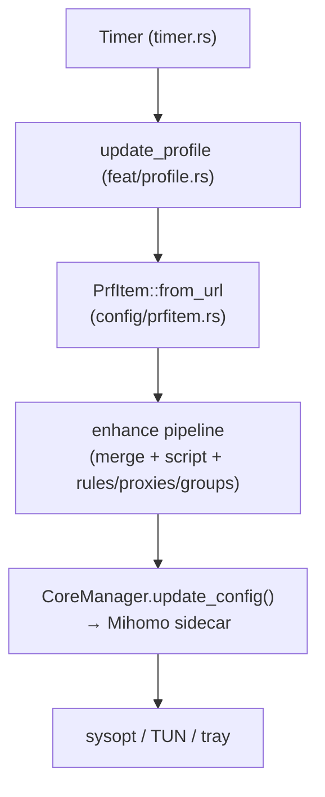

Clash Verge Rev is a desktop GUI application for the Mihomo (formerly
Clash Meta) proxy core. It is a community-maintained continuation of
the original clash-verge project.

https://deepwiki.com/clash-verge-rev/clash-verge-rev

The application is built with the Tauri framework, which combines a
Rust backend with a React/TypeScript frontend rendered in a native OS
webview. The Mihomo binary is bundled as a sidecar process, meaning
users do not need to install or manage the proxy core separately.

was sind die drei wichtigsten (oder komplexesten) algorithmen in
diesem repo? erklaere wie sie die software zu dem machen was sie ist

Du fragst nach den drei wichtigsten bzw. komplexesten Algorithmen in `clash-verge-rev` — also den Kernmechanismen im Rust-Backend (`src-tauri/src/`), die diese Tauri-GUI für den Mihomo-Proxykern ausmachen. Basierend auf der Codebasis sind das die **Enhancement-Pipeline**, die **Profil-Update-Retry-Logik** und der **Auto-Update-Timer**.

---

## 1. Die Enhancement-Pipeline (`enhance`, `enhance_profiles`)

Der komplexeste Algorithmus ist die Pipeline, die ein Profil beim Aktivieren in die finale Runtime-Config für Mihomo umbaut. Sie kombiniert YAML-Deep-Merge, JavaScript-Transformationen (über `boa_engine`/QuickJS) und Prepend/Append-Listen für `rules`, `proxies` und `groups` — alles als Extension-Items (`merge`, `script`, `rules`, `proxies`, `groups`) am Profil hängend, deren UIDs in `PrfOption` gespeichert sind. [1](#0-0)  Zwei globale Items (`"Merge"`, `"Script"`) greifen bei *jedem* Profil. [2](#0-1)  Die Pipeline wird über den IPC-Command `enhance_profiles` angestoßen und macht Clash Verge Rev zu dem, was es ist: nicht nur ein Config-Viewer, sondern ein programmierbarer Config-Compiler vor dem Proxy-Core. [3](#0-2) 

## 2. Profil-Aktivierung mit Retry-Fallbacks (`feat::update_profile`)

`feat/profile.rs` implementiert ein mehrstufiges Fallback-Verfahren beim Herunterladen entfernter Profile: erst direkter Download, dann über den laufenden Clash-Proxy (`self_proxy`), dann über den System-Proxy (`with_proxy`). [4](#0-3)  Die Aktivierung selbst ist durch das atomare Flag `CURRENT_SWITCHING_PROFILE` gegen Race Conditions geschützt und validiert das YAML, bevor `CoreManager.update_config()` den Core neu lädt. [5](#0-4) [6](#0-5)  Das ist der Algorithmus, der die Software robust gegen zirkuläre Abhängigkeiten macht (Profil braucht Proxy, Proxy braucht Profil).

## 3. Auto-Update-Timer (`Timer` in `core/timer.rs`)

Der `Timer`-Singleton verwaltet periodische Subscription-Updates: Beim Start berechnet er überfällige Profile (`cur_timestamp - updated >= interval`), und `refresh()` ermittelt bei Konfigurationsänderungen den Diff der hinzuzufügenden/entfernenden Timer-Tasks. [7](#0-6) [8](#0-7)  Das Frontend zeigt die nächste Update-Zeit über `verge://timer-updated`-Events an. [9](#0-8) 

## Zusammenhang

## Notes

- Die Dateiinhalte von `src-tauri/src/enhance/` (Merge-Algorithmus, JS-Runtime) und `feat/profile.rs` waren in meinem Index-Ausschnitt nicht vollständig enthalten; die Beschreibung der Merge-Semantik stützt sich auf die dokumentierte Architektur. Für Zeilen-genaues Lesen dieser Funktionen lohnt eine Devin-Session.
- Weitere erwähnenswerte, aber weniger zentrale Algorithmen: der System-Proxy-Guard in `core/sysopt.rs`, die Retry-Logik via `backon::ExponentialBuilder` in `config.rs`. [10](#0-9) 
