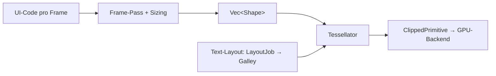

https://deepwiki.com/emilk/egui

as sind die drei wichtigsten (oder komplexesten) algorithmen in diesem repo? erklaere wie sie die software zu dem machen was sie ist

Die drei zentralen Algorithmen sind: (1) der **Immediate-Mode-Frame-Pass mit Sizing-Passes**, (2) die **Tessellation** (Formen → Dreiecke) in `epaint::Tessellator`, und (3) die **Text-Layout-Pipeline** (`LayoutJob` → `Galley` → Glyphen-Mesh). Gemeinsam erzeugen sie pro Frame aus einfachem UI-Code fertige, GPU-renderbare Dreiecke — das ist das Wesen von egui.

---

## 1. Immediate-Mode-Pass & Sizing-Passes

Der Kern-Algorithmus: Die komplette UI wird **jeden Frame neu aufgebaut** — `begin_pass(RawInput)` → User-Closure → `end_pass` → `FullOutput` [1](#0-0) . Das macht egui einfach: keine Callbacks, kein State-Sync, `if ui.button("...").clicked() { ... }` [2](#0-1) .

Das bekannte Paradoxon (Fenstergröße muss vor Inhalt bekannt sein) löst egui mit **gespeicherten Größen aus dem Vorframe** plus optionalen Mehrfach-Passes via `Context::request_discard` [3](#0-2) . Dieser Kompromiss — seltene Frame-Delays gegen massive API-Vereinfachung — definiert eguis Charakter.

## 2. Tessellator (`epaint`)

Der `Tessellator` wandelt `Shape`s (Rect, Circle, Text, Bezier) in `Mesh`es (Vertex-/Index-Buffer) um, gebatcht nach Clip-Rect, ausgegeben als `Vec<ClippedPrimitive>` [4](#0-3) . Das entkoppelt die gesamte UI-Logik vom Renderer — `egui_glow`/`egui-wgpu` müssen nur Dreiecke + eine Font-Atlas-Textur zeichnen [5](#0-4) . Das ist der Grund für eguis extreme Portabilität.

Komplexe Teile:

- **Bezier-Flattening**: Kurven werden in Punktfolgen zerlegt (`flatten_closed`) und dann gefüllt/gestrichelt [6](#0-5) ; die Extremum-Berechnung (Ableitung der Bezier-Gleichung, Quadratische Lösung) für Bounding Boxes stammt aus `lyon_geom` [7](#0-6) .
- **Text-Tessellation**: Glyphen-Meshes werden aus der `Galley` kopiert, mit Culling pro Zeile, Farb-Overrides und Rotation [8](#0-7) .
- **Parallelisierung** via rayon für große Formen [9](#0-8) .

## 3. Text-Layout-Pipeline

Der komplexeste Unterbau: `LayoutJob` → `Galley` → `PlacedRow`/`Glyph` → `Mesh`, mit `harfrust` (Kerning/Shaping) und `Skrifa`+`vello_cpu` (Hinting) sowie CJK-Umbruchregeln [10](#0-9) . Da Immediate Mode Layout pro Frame verlangt, müssen Galley-Caching und Hinting extrem schnell sein — das macht lesbaren Text bei 60 FPS möglich und trägt wesentlich zum „polierten" Look bei.

## Wie sie zusammenwirken

Einfache API vorne, Dreiecke hinten — dazwischen diese drei Algorithmen. Plattformintegrationen wie `glow_integration.rs` sind laut eigener Kommentarzeile „sehr komplexer, nicht sehr hübscher" Glue-Code, aber eher Infrastruktur als Kernalgorithmus [11](#0-10) .

## Notes

- Ehrenwerte Erwähnungen: Touch-Gestenerkennung (`TouchState`/`GestureState` für Pinch) [12](#0-11) , das `Id`-System für persistenten Widget-State [13](#0-12) .
- Meine Einschätzung basiert auf den bereitgestellten Snippets + Wiki; der Index enthält nicht alle Dateien (z. B. `text_layout.rs` nur über das Wiki).

as sind die drei wichtigsten (oder komplexesten) algorithmen im eframe modul in diesem repo? erklaere wie sie die eframe software zu dem machen was sie ist
Du fragst nach den drei wichtigsten bzw. komplexesten Algorithmen im `eframe`-Crate und wie sie eframe zu dem machen, was es ist — einem Framework, mit dem dieselbe `egui`-App nativ und im Web läuft (`ARCHITECTURE.md`). [1](#0-0) 

**Kurzantwort:** Die drei komplexesten Kernmechanismen in `eframe` sind (1) das **Multi-Viewport-Management mit GL-Kontextwechsel** in `glow_integration.rs` / `wgpu_integration.rs`, (2) die **Frame-Pipeline mit Repaint-Scheduling** (Input → `App` → Tessellate → Paint → `swap_buffers`), und (3) die **Web-Laufzeit** in `app_runner.rs`/`web_runner.rs`, die dasselbe Frame-Modell über `requestAnimationFrame` plus `TextAgent`-IME-Handling und Panic-Poisoning abbildet.

---

## 1. Multi-Viewport-Management & GL-Kontextwechsel (nativ)

Das ist der explizit als „very complex code" markierte Teil von eframe. [2](#0-1) 

- `handle_viewport_output` nimmt die `ViewportOutput`-Map, die egui pro Frame liefert, und synchronisiert sie mit realen `winit`-Fenstern: Viewports werden angelegt/aktualisiert (`initialize_or_update_viewport`), `ViewportCommand`s verarbeitet, neue Fenster erzeugt und entfernte Viewports aufgeräumt — inklusive Wayland-Resize-Workaround. [3](#0-2) 
- **Immediate Viewports** erfordern synchrones Rendering innerhalb des UI-Codes; dazu wird der OpenGL-Kontext pro Fenster umgeschaltet (`change_gl_context`), gezeichnet und `swap_buffers` aufgerufen — die Fehlerbehandlung deckt sogar den Fall ab, dass das Fenster auf dem falschen Thread erstellt wurde. [4](#0-3) 
- Zustand lebt in `GlowWinitApp` (`running: Option<GlowWinitRunning>`), das die App-Erzeugung via `AppCreator` verzögert, bis die Plattform bereit ist. [5](#0-4) 

**Warum das eframe ausmacht:** Genau hier wird aus dem plattformagnostischen `egui::FullOutput` echte Fensterverwaltung — mehrere native Fenster pro App, ohne dass der App-Code etwas von winit/glutin weiß.

## 2. Die Frame-Pipeline & Repaint-Scheduling

Der Herzschlag: `RawInput` einsammeln → `App::logic`/`ui` → `egui_ctx.tessellate` → `painter.paint_and_update_textures` → `swap_buffers`. [6](#0-5) 

- Der Frame-Timer wird um VSync herum pausiert (`frame_timer.pause()` vor `swap_buffers`), damit `IntegrationInfo::cpu_usage` echte CPU-Zeit misst. [7](#0-6) 
- Eine generische `EframeWinitApplication` kapselt den `winit::ApplicationHandler` und kann sogar via `pump_eframe_app` in fremde Event-Loops eingebettet werden. [8](#0-7) 
- Actions wie `Screenshot`/`Cut`/`Copy`/`Paste` werden pro Viewport aus `actions_requested` in `egui::Event`s zurückübersetzt — so kommuniziert die Plattform asynchron zurück in egui. [9](#0-8) 

**Warum das eframe ausmacht:** Repaint-on-demand (statt Dauer-Rendering) plus sauberes Frame-Timing ist der Grund, warum eframe-Apps stromsparend und responsiv sind.

## 3. Web-Laufzeit: AppRunner + WebRunner

Im Web-Pfad (ein separater, aber paralleler Mechanismus) repliziert `AppRunner::new` die native Initialisierung: Renderer-Auswahl (`Glow`/`Wgpu`), `localStorage` als `Storage`, `CreationContext`, `set_request_repaint_callback` → `NeedRepaint`. [10](#0-9) 

- `WebInput::new_frame` setzt pro Frame `screen_rect`, `native_pixels_per_point` und markiert versteckte Tabs als `occluded`; `set_focus`/`set_modifiers` verhindern „sticky modifiers" beim Alt-Tab. [11](#0-10) 
- `WebRunner` hält den `AppRunner` in einem `Rc<RefCell<Option<...>>>`, das bei einem Panic „poisoned" wird, und räumt Event-Subscriptions separat ab — Panic-Sicherheit in einer `!Send`-Welt. [12](#0-11) 

**Warum das eframe ausmacht:** Dieser Pfad liefert die „same code, web or native"-Garantie — denselben `App`-Trait, dieselbe Frame-Semantik, aber mit DOM-Events, `TextAgent` für IME und `requestAnimationFrame`.

---

## Notes

- `glow_integration.rs` und `wgpu_integration.rs` sind bewusst nahezu identisch gehaltene Zwillinge („code very similar to each other") — Änderungen müssen meist doppelt gepflegt werden. [13](#0-12) 
- Die eigentliche Tessellation/Layout-Algorithmik steckt in `egui`/`epaint`, nicht in `eframe` — eframes Komplexität ist Integrations- bzw. Orchestrierungskomplexität, nicht geometrische Algorithmik.
- Ehrlich gesagt sind das eher „komplexe Subsysteme" als klassische Algorithmen; die Index-Ausschnitte zeigen die Kernpfade, nicht den vollständigen Dateiinhalt.

