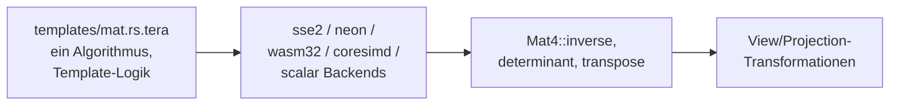

https://github.com/bitshifter/glam-rs

glam: Die moderne Go-To-Library für Spiele und Grafik in Rust. Sie ist extrem schnell, nutzt SIMD-Optimierungen und ist exakt auf die Bedürfnisse von modernen Grafik-APIs ausgelegt.

was sind die drei wichtigsten (oder komplexesten) algorithmen in diesem repo? erklaere wie sie die software zu dem machen was sie ist

Die drei komplexesten Algorithmen in `glam-rs` sind die SIMD-optimierten linearen Algebra-Kerne in `templates/mat.rs.tera`: `inverse()` (Adjunkte/Kofaktor-Inversion), `determinant()` (vektorisierte Laplace-Entwicklung nach GLM) und `transpose()` (2-Phasen-Shuffle nach DirectXMath). Sie machen glam zu einer schnellen, spaltenorientierten Transformationsbibliothek für Grafik-Anwendungen.

---

## 1. `inverse()` – 4x4-Matrixinversion per Kofaktoren

`inverse` berechnet die Inverse über die Adjunkte (Kofaktormatrix geteilt durch die Determinante). Für `Mat4` werden sechs Kofaktor-Produkte (`fac0`–`fac5`) gebildet und zu vier inversen Spalten kombiniert, danach mit `rcp_det` skaliert. [1](#0-0) 

Für `Mat2` gibt es eine elegante SIMD-Version: die 2x2-Matrix liegt komplett in einem `__m128`-Register, die Inversion ist nur eine Folge von Shuffles, einer Division und Vorzeichenflips. [2](#0-1) 

**Warum zentral:** Invertierung von Transformations- und View-Matrizen ist eine der teuersten Operationen in 3D-Engines; dass glam sie vollständig in SIMD realisiert, ist ein Kern des Leistungsversprechens.

## 2. `determinant()` – vektorisierte Determinantenberechnung

Der 4x4-Algorithmus (explizit als Portierung von `glm_mat4_determinant` gekennzeichnet) verwendet aggressive SIMD-Swizzles: die `z`-/`w`-Achsen werden in sechs Permutationen (`swp2a`…`swp3c`) gebracht, multipliziert und zu Zwischenprodukten `sube`/`subf` subtrahiert, die dann gegen die `y`-Achse gefaltet werden. [3](#0-2) 

Das Template enthält dieselbe Logik für Core-SIMD sowie einen auskommentierten NEON-Pfad – mit dem Vermerk, dass NEON langsamer als Skalar war. [4](#0-3) 

Für kleinere Dimensionen degeneriert der Algorithmus elegant: 2x2 ist ein Kreuzprodukt, 3x3 ein Spatprodukt (`dot(cross)`). [5](#0-4) 

**Warum zentral:** Die Determinante ist Voraussetzung für `inverse()` und wird intern auch zur Validierung (`glam_assert!(dot1 != 0.0)`) genutzt. [6](#0-5) 

## 3. `transpose()` – 4x4-Transposition per 2-Phasen-Shuffle

Transposition einer 4x4-Matrix in nur 8 Shuffle-Operationen, als Portierung von DirectXMaths `XMMatrixTranspose`: zuerst werden die Spaltenpaare interleaved (`tmp0`–`tmp3`), dann daraus die neuen Zeilen = Spalten gezogen. [7](#0-6) 

**Warum zentral:** Da glam spaltenorientiert (`column-major`, GLSL-Konvention) arbeitet, ist `transpose()` die Brücke zu Zeilenzugriffen und zu `inverse()` (Adjunkte = transponierte Kofaktormatrix).

## Wie sie die Software prägen

- **Ein Template, fünf Backends:** Alle drei Algorithmen existieren einmal in `templates/mat.rs.tera` und werden per `` etc. für SSE2, NEON, WASM, Core-SIMD und Skalar generiert. Das ist das eigentliche Architekturmerkmal: maximale SIMD-Leistung bei garantiert identischem API-Verhalten. [8](#0-7) 
- **Spaltenorientierung:** `inverse` und `determinant` arbeiten direkt auf den `Vec4`-Spalten (`x_axis`…`w_axis`), ohne die Matrix umzukopieren – dadurch sind sie allocation-frei.
- **Bewusste Pragmatik:** Der auskommentierte NEON-Determinanten-Code zeigt, dass glam nur SIMD einsetzt, wo es tatsächlich schneller ist. [9](#0-8) 

## Notes

- Auf `inverse`/`determinant`/`transpose` bauen die View-Methoden (`look_at_rh`, `look_to_rh` etc.) indirekt auf – diese nutzen Kreuzprodukte zur Achsenkonstruktion statt expliziter Inversion. [10](#0-9) 
- Weitere Kandidaten für "komplex" wären die Quaternion-Konversionen (`from_quat`, `to_scale_rotation_translation`) und die Perspektiv-Projektionen, die aber mathematisch einfacher sind; sie waren nicht in den gezeigten Snippets enthalten.
- `Mat2` ist interessant: es nutzt SIMD-Speicher (`__m128`), aber der Wiki zufolge meist skalare Operationen – eine bewusste Abwägung. [11](#0-10) 
