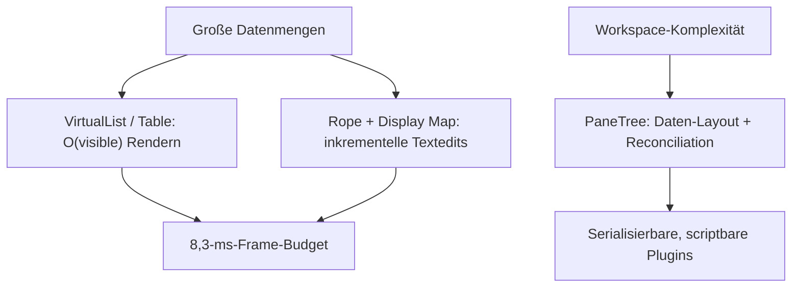

# GPUI

## GPUI-kit

https://deepwiki.com/longbridge/gpui-kit

GPUI Kit is a comprehensive Rust desktop application framework built on GPUI 
README.md
13
 It combines a production-ready UI system with application-grade data, layout, and editing capabilities, all built on a reusable foundation of behavior, state, and infrastructure 
README.md
13-15
 The framework ships 75+ documented components and primitives, WebAssembly support, AccessKit accessibility, UI integration testing, and an optional JavaScript extension runtime 
README.md
16-18

was sind die drei wichtigsten (oder komplexesten) algorithmen in diesem repo? erklaere wie sie die software zu dem machen was sie ist

Die drei komplexesten Algorithmen im Repo sind: **(1) die Virtualisierung variabler Listenelemente** (`VirtualList`), **(2) die Text-/Editor-Engine** auf Basis einer Rope-Datenstruktur (`InputState`/`EditorState`), und **(3) der Dock-Layout-Baum** mit Reconciliation (`DockArea`/`PaneTree`). Zusammen tragen sie das Kernversprechen des Frameworks: native Performance bei großen Datenmengen, ohne dass Aufrufer schwieriges Verhalten selbst nachbauen müssen.

---

## 1. Virtualisierung mit unterschiedlichen Elementgrößen — `VirtualList`

`gpui-base` rendert Listen beliebiger Länge, indem nur der sichtbare Bereich gezeichnet wird — mit **per-item sizes statt uniformer Zeilenhöhe**, was den Algorithmus deutlich schwieriger macht als klassisches Virtual Scrolling mit fester Höhe. [1](#0-0)  Dieselbe Technik steht hinter der Data Table, die „Hunderttausende Zeilen" mit virtuellem Scrollen, fixierten und größenveränderbaren Spalten trägt. [2](#0-1) 

**Warum prägend:** Diese Algorithmik ist der Grund, warum die Software mit dem 120-FPS-Anspruch („GPU-accelerated interfaces that remain smooth under load") glaubwürdig ist — ein Frame-Budget von ~8,3 ms ist nur haltbar, wenn der Render-Pfad O(visible) statt O(total) bleibt. [3](#0-2) 

## 2. Die Text-Engine — Rope + Display Map + Tree-sitter

Texteingabe (`InputBaseState`, `TextareaState`, `EditorState`) läuft über eine `ropey`-Rope für effiziente Bearbeitung großer Dokumente, getrennt von einer Display Map, die Soft-Wrapping (`TextWrapper`/`LineItem`), Cursor-Navigation und Range-Selektionen berechnet. [4](#0-3)  Darauf aufbauend bleibt der Code-Editor bei 200.000 Zeilen stabil, mit Tree-sitter-Highlighting und LSP-Diagnosen/-Completion. [5](#0-4) 

**Warum prägend:** Das ist der Algorithmus, der GPUI Kit von einem „Widget-Toolkit" zu einer Plattform für echte Produktivitäts-Apps macht — der Editor ist ein „Stateful System", das über Frames hinweg Zustand, Messungen und inkrementelle Updates hält. [6](#0-5) 

## 3. Dock-Layout — `PaneTree` + Reconciliation

`DockArea` verwaltet einen rekursiven `PaneTree` aus Split-, Tab- und Tile-Knoten; ein Reconciliation-Algorithmus hält die lebenden GPUI-View-Entities mit dem logischen Baum synchron — während Drag-and-Drop, Tab-Verschieben und Resize. [7](#0-6)  Entscheidend: das Layout ist **reine Daten**, serialisierbar ohne Fenster, während jeder Pixel über Renderer-Traits vom Aufrufer kommt — das macht es zum ersten „Plugin-fähigen" Baustein, den `gpui-shell` später aufgreift. [8](#0-7) 

**Warum prägend:** Der Baum-as-Daten-Ansatz ist die Architektur-These des Repos („Behavior is built in, presentation is yours") in Reinform — und er ist die technische Voraussetzung dafür, dass Script-Panels ein Layout über einen Restart hinweg überleben. [9](#0-8) 

## Notes

- Ehrenhafte Erwähnung: das **Spec/`materialize`-Protokoll** in `gpui-shell` — JS „beschreibt" Elemente in eine Arena, Rust spielt sie beim Invalidate in echte GPUI-Elemente, gecachte Frames laufen ohne JS. Algorithmisch die clevere Single-Use-/Snapshot-Lösung für ein konsumierendes Element-Modell. [10](#0-9) 
- Ebenfalls komplex, aber lokaler: der `Positioner` (Viewport-Flipping/-Snapping für Overlays) und `resolve_default_font`/`resolve_default_mono_font` mit `OnceLock`-Caching der OS-Font-Enumeration. [11](#0-10) 
- Der Index zeigt hier vor allem Docs/Wiki-Seiten, nicht die Algorithmus-Implementierungen selbst (z. B. `crates/base/src/virtual_list.rs`, `crates/base/src/input/`). Für Zeilen-Ebene-Details der Algorithmen lohnt sich eine Devin-Session mit vollem Dateizugriff.
