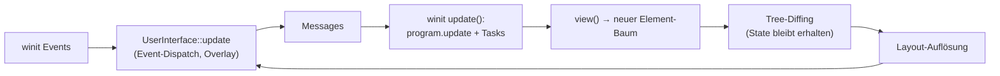

https://deepwiki.com/iced-rs/iced

iced is a cross-platform GUI library for Rust focused on simplicity and type-safety, heavily inspired by The Elm Architecture
src/lib.rs1-4 It provides a declarative, reactive programming model where the user interface is a pure function of application state
src/lib.rs1-4 The library leverages Rust to its full extent—ownership, borrowing, lifetimes, futures, and traits—to ensure compile-time safety and high performance
src/lib.rs10-21

Ein an Elm angelehntes, deklaratives GUI-Framework. Es eignet sich besser für klassische Desktop-Anwendungen und nutzt im Hintergrund standardmäßig wgpu für das Rendering.

was sind die drei wichtigsten (oder komplexesten) algorithmen in diesem repo? erklaere wie sie die software zu dem machen was sie ist

Du fragst nach den drei zentralen Algorithmen in `iced` — dem Elm-inspirierten GUI-Toolkit. Die drei wichtigsten sind: **Widget-Tree-Reconcili­ation (Diffing)**, **Layout-Auflösung** und **der Event-/Update-Zyklus inkl. Overlay-Behandlung**.

---

## 1. Widget-Tree-Diffing (`diff_children_custom_with_search`)

Da `view` jedes Mal einen komplett neuen `Element`-Baum erzeugt, ist der persistente `widget::Tree` das Gedächtnis der UI (Scroll-Positionen, Fokus, Cursor). Der Diffing-Algorithmus in `core/src/widget/tree.rs` gleicht neue Kind-Widgets mit gespeichertem State ab — über `Tag`-Vergleiche (TypeId) und eine `maybe_changed`-Heuristik, die Insert/Delete-Positionen effizient findet, statt den ganzen Baum neu zu bauen. [1](#0-0) 

Der `State` wird dabei typsicher per `TypeId`-Downcast gehalten. [2](#0-1) 

**Warum zentral:** Das ist das Äquivalent zu Reacts Reconciler — es macht das deklarative Modell überhaupt erst performant möglich. Ohne es ginge bei jedem `view`-Aufruf der gesamte Widget-State verloren.

## 2. Layout-Auflösung (Flex-Resolution)

Der `Widget::layout`-Lebenszyklus löst `Length`-Constraints (`Fill`, `Fit`, `Fixed`) rekursiv über `layout::flex::resolve` in `Row`/`Column` auf und erzeugt `layout::Node`-Bäume mit konkreten Größen. 

Dieser Pass läuft bei jeder UI-Erneuerung in `build_user_interface` über `UserInterface::build`. [3](#0-2) 

**Warum zentral:** Er übersetzt die deklarative, constraint-basierte Beschreibung in konkrete Pixel-Geometrie — das Herzstück des "responsive layout"-Versprechens aus dem README. [4](#0-3) 

## 3. Event-Dispatch & Update-Loop (`UserInterface::update`)

Der komplexeste Ablauf sitzt in `runtime/src/user_interface.rs`: Events gehen zuerst an den **Overlay** (Dropdowns, Tooltips), der sich bei Layout-Invalidation mitten in der Event-Schleife selbst neu aufbaut; erst danach bekommt der Basis-Widget-Tree die Rest-Events. Shell-Invalidations werden dabei akkumuliert (`status.max`, `redraw_request.min`). [5](#0-4) 

Darüber orchestriert `update` in `winit/src/lib.rs` das eigentliche MVU-Rundum: Messages → `program.update` → Tasks synchron pollen bzw. in die Runtime geben → Subscriptions neu tracken → `UserInterface`s neu bauen. [6](#0-5) 

**Warum zentral:** Dieser Loop implementiert wortwörtlich The Elm Architecture (State → View → Messages → Update → neuer View) und macht iced damit zu dem, was es ist — einer reaktiven, unidirektionalen UI-Engine. [7](#0-6) 

## Zusammenhang

## Notes

- `layout::flex::resolve` selbst (vermutlich unter `core/src/layout/` bzw. verwendet in `widget/src/column.rs`/`row.rs`) liegt mir nicht als Snippet vor — die Details der Flex-Verteilung konnte ich daher nur aus der Wiki-Dokumentation ableiten, nicht aus dem Code direkt. 
- Ehrenvolle Erwähnung: das inkrementelle Markdown-Parsing in `widget/src/markdown.rs` (Section-Fixing, Referenz-Recomputing bei Streaming) ist ebenfalls algorithmisch anspruchsvoll, aber nur ein einzelnes Widget. [8](#0-7) 
- Ebenso das Layer-basierte Primitiv-Prepare im wgpu-Renderer (Quads/Triangles/Text pro Layer mit Culling per `intersection`) ist die wichtigste Rendering-Pipeline-Logik. [9](#0-8) 
