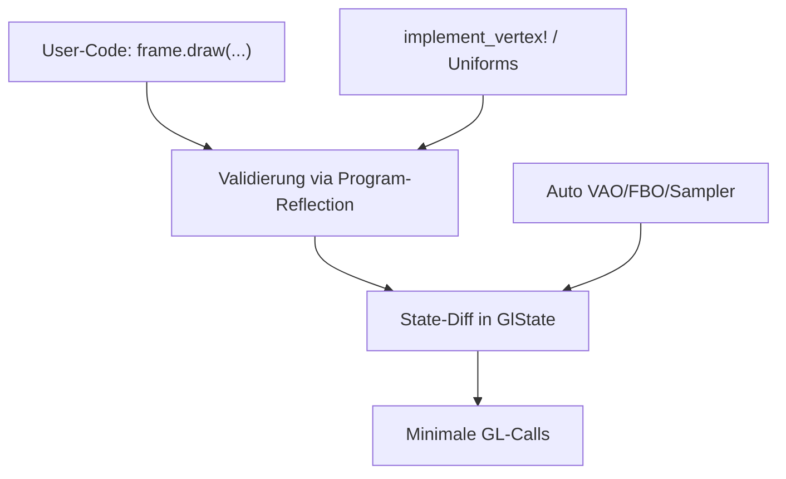

https://github.com/glium/glium

Glium acts as an intermediate wrapper designed to abstract away the error-prone state machine of OpenGL. It automatically manages memory, context creation, and framebuffers using Rust’s RAII principles, preventing the memory leaks and undefined behaviors common in traditional graphics programming.

was sind die drei wichtigsten (oder komplexesten) algorithmen in diesem repo? erklaere wie sie die software zu dem machen was sie ist

## Kurzantwort

Die drei komplexesten "Algorithmen" in glium sind: **(1) Shader-Reflection & Uniform-Binding**, **(2) OpenGL-State-Synchronisation mit Dirty-Checking**, und **(3) automatisches Resource-/Vertex-Format-Management via Makros**. Zusammen machen sie glium zu einem sicheren, zustandslosen OpenGL-Wrapper: Statt OpenGL-Status manuell zu managen, übergibst du Parameter, und glium errechnet die minimalen GL-Calls.

---

## 1. Shader-Kompilierung, Linking & Reflection

`Program::new` nimmt `ProgramCreationInput` (Source, SPIR-V oder Binary), prüft Feature-Verfügbarkeit gegen OpenGL-Version/Extensions, kompiliert jede Stage via `build_shader` und linkt via `RawProgram::from_shaders` — unter einem globalen `COMPILER_GLOBAL_LOCK`, weil manche Treiber nicht thread-sicher kompilieren. [1](#0-0) [2](#0-1) 

Der eigentlich clevere Teil ist die **Reflection**: Nach dem Linken fragt glium Uniforms, Attributes, Uniform-Block-Layouts usw. aus dem Programm ab. So kann es beim `draw()` validieren, dass deine Rust-Typen zu den GLSL-Typen passen — das ist der Kern von gliums "detect errors before OpenGL does"-Philosophie. [3](#0-2) 

## 2. State-Synchronisation (Dirty-Checking)

OpenGL ist eine gigantische globale State-Machine. Glium spiegelt den kompletten State in `GlState` (sichtbar an Feldern wie `stencil_op_front`, `blend_func`, `texture_units`, `provoking_vertex` etc.) und diffed bei jeder Operation gewünschten vs. aktuellen State. [4](#0-3) 

Funktionen wie `sync_smooth` zeigen das Muster: Nur wenn `ctxt.state.enabled_line_smooth` sich vom Ziel unterscheidet, wird `gl.Enable`/`gl.Disable`/`gl.Hint` aufgerufen — gleichzeitig wird pro Primitiv-Typ (Punkte vs. Linien vs. Polygone) validiert und `DrawError::SmoothingNotSupported` zurückgegeben. [5](#0-4)  Dasselbe Prinzip gilt für conditional rendering via `sync_conditional_render`. [6](#0-5) 

Das ist das, was glium **"stateless"** macht: `set_something()`-Funktionen existieren nicht — jeder Draw-Call ist deterministisch, weil der GL-State immer vollständig aus den Parametern synchronisiert wird. [7](#0-6) 

## 3. Automatisches Vertex-/Buffer-Layout via Makros

`implement_vertex!` generiert zur Compile-Zeit die `VertexFormat`-Bindings: Attribut-Name, Byte-Offset (via `__glium_offset_of!`) und `AttributeType` werden statisch aus dem Struct abgeleitet — kein manuelles `glVertexAttribPointer`-Fiddeln. [8](#0-7) 

`implement_buffer_content!` ist noch trickreicher: Es benutzt `mem::transmute` auf Fake-Fat-Pointern, um `min_size` und Element-`step` dynamisch-schichtbarer Typen (DST) zu berechnen und `ref_from_ptr` zu validieren, ob eine Buffer-Größe zu dem Typ passt. [9](#0-8)  Zusammen mit der automatischen VAO/FBO/Sampler-Verwaltung im `Context` eliminiert das die fehleranfälligsten Teile von OpenGL. [10](#0-9) 

## Wie das zusammenwirkt



Reflection garantiert Korrektheit, das State-Diffing garantiert Performance (keine redundanten GL-Calls), und die Makros garantieren Typsicherheit — genau das, was laut README gliums Kernversprechen ist: OpenGL-Fehler werden zu Rust-Panics *vor* dem GL-Call. [11](#0-10) 

## Notes

- Ich habe auf Basis der Wiki-Doku und sichtbarer Snippets geantwortet; die zentralen Dateien `src/ops/draw.rs` und `src/program/reflection.rs` sind im Index nicht vollständig sichtbar — dort liegt vermutlich die größte Einzelkomplexität (die `draw()`-Orchestrierung).
- "Algorithmen" ist hier eher als "Subsysteme" zu lesen; glium ist ein Wrapper, keine Algorithmen-Sammlung.


how do i have to configure the glium dependency in Cargo.toml if i want the smallest possible libarry for linux x11


For a minimal X11-only build, disable glium's default features and enable only the backends you need, then turn on the X11/GLX backends on `glutin`/`winit` yourself, since glium declares those dependencies with `default-features = false`.

```toml
[dependencies]
glium = { version = "0.36", default-features = false, features = ["glutin_backend", "simple_window_builder"] }
winit = { version = "0.30", default-features = false, features = ["x11"] }
glutin = { version = "0.32", default-features = false, features = ["x11", "glx"] }
glutin-winit = { version = "0.5", default-features = false }
```

---

## Why this works

Glium's default feature set is fairly heavy — it enables the glutin backend, the `SimpleWindowBuilder` helper, **and** the default features of `glutin`, `winit`, and `glutin-winit` (which pull in Wayland, EGL, etc.): [1](#0-0) 

The actual feature flags you can pick from are:

| Feature | Pulls in |
|---|---|
| `glutin_backend` | `glutin` only |
| `simple_window_builder` | `glutin`, `glutin-winit`, `winit`, `raw-window-handle` | [2](#0-1) 

Crucially, glium declares all of those optional deps with `default-features = false`, so when you disable glium's default features, `glutin`/`winit` have *no* platform backend at all — you must enable `x11`/`glx` via your own direct dependency entries as shown above: [3](#0-2) 

If you don't need the `SimpleWindowBuilder` convenience API (it's mainly for the tutorial), you can drop `simple_window_builder`, `winit`, `glutin-winit`, and `raw-window-handle` entirely and manage the window/context yourself — that leaves only `glutin` as the extra dep: [2](#0-1) [4](#0-3) 

The unavoidable base deps are `memoffset`, `backtrace`, `smallvec`, `fnv`, and build-time `gl_generator` — there's no feature flag to remove those: [5](#0-4) 

## Notes

- The exact glutin feature names (`x11`, `glx`, `egl`) come from glutin 0.32's own `Cargo.toml`, which isn't in this repo's index — verify with `cargo tree` or `cargo add glutin --features x11,glx` if a name is off.
- If you want EGL instead of GLX (e.g., for newer NVIDIA drivers), use `features = ["x11", "egl"]` on glutin.
- Tip: run `cargo build` and check `cargo tree -e normal` to confirm no Wayland/wayland-* crates remain.
