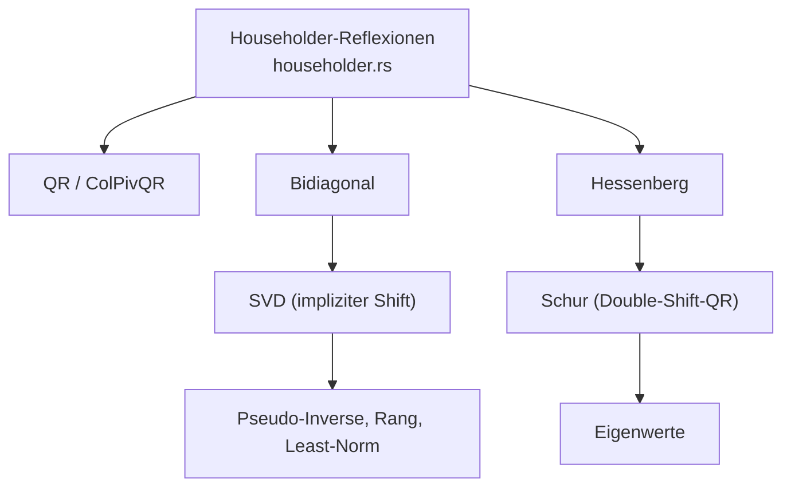

https://github.com/dimforge/nalgebra

nalgebra: Ältere Alternative zu glam. nalgebra wird vor allem dann genutzt, wenn du komplexe physikalische oder wissenschaftliche Berechnungen (lineare Algebra auf hohem Niveau) benötigst.

was sind die drei wichtigsten (oder komplexesten) algorithmen in diesem repo? erklaere wie sie die software zu dem machen was sie ist

Die drei komplexesten Algorithmen in diesem Repo (nalgebra, eine lineare-Algebra-Bibliothek) sind die **SVD mit implizitem Shift**, die **Schur-Zerlegung via Double-Shift-QR** und die **Householder-Reflektions-Maschinerie**, die fast allen anderen Zerlegungen zugrunde liegt. Zusammen bilden sie das eigentliche "Herz" der Bibliothek: Sie verwandeln rohe Matrizen in Faktorisierungen, aus denen sich Eigenwerte, Inverse, Rang und Lösungen linearer Systeme ableiten lassen.

---

## 1. SVD — Singularwertzerlegung mit implizitem Shift (`src/linalg/svd.rs`)

Die aufwendigste Zerlegung im Repo: `SVD::new` faktorisiert `A = UΣVᵀ` und wird über `Matrix::svd` exponiert [1](#0-0) .

Der Algorithmus ist dreistufig:
- **Spezialfälle**: 2×2- und 3×3-Matrizen werden analytisch über `svd2`/`svd3` gelöst.
- **Bidiagonalisierung**: Die Matrix wird per Householder-Reflektionen auf Bidiagonalform reduziert.
- **Iterative QR-Sweeps**: Mit impliziten Shifts und Givens-Rotationen werden Nebendiagonalelemente eliminiert, wobei `delimit_subproblem` konvergierte Teilprobleme abspaltet — derselbe Deflations-Trick wie in der Schur-Zerlegung [2](#0-1) .

Die SVD macht nalgebra "robust": Pseudo-Inverse, Rangbestimmung und Lösung unterbestimmter Systeme hängen daran — die numerisch stabilste, aber teuerste Zerlegung.

## 2. Schur-Zerlegung — impliziter Double-Shift-QR (`src/linalg/schur.rs`)

`Schur::try_new` faktorisiert eine quadratische Matrix in `A = QTQᵀ` mit quasi-oberdreieckigem T und ist der Motor hinter der Eigenwertberechnung für allgemeine Matrizen [3](#0-2) .

Der Kern ist die Francis-Iteration: Nach Reduktion auf Hessenberg-Form [4](#0-3)  berechnet `do_decompose` aus den 2×2-Eckelementen den Doppel-Shift und jagt eine "Bulge" mit Householder-Reflektionen durch die Matrix, bis Nebendiagonalelemente unter die Toleranz fallen [5](#0-4) . `delimit_subproblem` nullt konvergierte Einträge nach dem LAPACK-DLAHQR-Vorbild [6](#0-5) .

Davon hängen direkt `eigenvalues()` und `complex_eigenvalues()` auf `SquareMatrix` ab [7](#0-6) . Ohne diesen Algorithmus hätte nalgebra keine allgemeinen Eigenwerte — ein Kern-Feature.

## 3. Householder-Reflektionen — das gemeinsame Fundament (`src/linalg/householder.rs`, `qr.rs`, `hessenberg.rs`)

Nicht eine einzelne Zerlegung, sondern der wiederkehrende Baustein, der QR, Bidiagonal, Hessenberg und Schur zusammenhält. In `Schur::do_decompose` werden `reflection_axis_mut`, `Reflection::reflect` und `reflect_rows` aufgerufen, um die Bulge-Chase durchzuführen [8](#0-7) ; `Hessenberg::q` baut Q via `householder::assemble_q` [9](#0-8) ; und `QR::q_tr_mul` wendet die gespeicherten Reflektionen an, ohne Q explizit zu bilden [10](#0-9) .

Diese kompakte Darstellung (Reflektionsvektoren statt expliziter orthogonaler Matrizen) ist es, die nalgebra effizient und speichersparend macht — das "Handshake" zwischen allen Zerlegungen.

## Notes

- Als Alternative wäre **Cholesky mit Rank-1-Updates** (`rank_one_update`, `insert_column`) erwähnenswert — ein ungewöhnlich raffinierter Update-Algorithmus, der die Faktorisierung in O(n²) modifiziert statt neu zu zerlegen [11](#0-10) .
- `SymmetricEigen` baut intern auf Tridiagonalisierung + QR-Iteration auf und teilt Konvergenzlogik mit Schur/SVD.
- Die Dateien `src/linalg/givens.rs`, `svd2.rs`/`svd3.rs` und große Teile von `svd.rs` wurden im Kontext nicht gezeigt; Details der Rotationslogik basieren auf der Wiki-Dokumentation.
