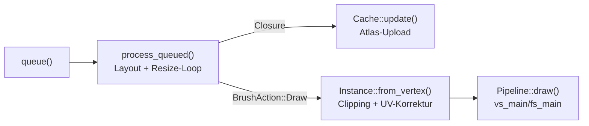
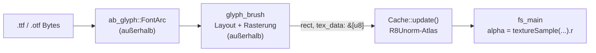

https://github.com/hecrj/wgpu_glyph

Das Zeichnen von Schriftarten auf der GPU ist mathematisch komplex. wgpu bietet hierfür keine eingebaute Funktion.

    wgpu_glyph: Ein bewährtes Crate, das auf glyphon oder rusttype aufbaut. Es kümmert sich um das Layouten von Texten und das effiziente Cachen von Schriftzeichen in einer Textur-Atlas auf der GPU.
	
	
wgpu_glyph is a high-performance text rendering library designed for wgpu, powered by [glyph_brush] [Cargo.toml:6, src/lib.rs:1]. It provides efficient font layout, glyph caching, and batched GPU rendering using instance buffers and texture atlases.

Die drei wichtigsten Algorithmen in `wgpu_glyph` sind: (1) die Layout-/Caching-Schleife in `GlyphBrush::process_queued` mit dynamischem Atlas-Resize, (2) das Alignment-korrigierte Hochladen von Glyphen-Texeln in `Cache::update`, und (3) die instanziierte Quad-Generierung mit Bounds-Clipping in `Instance::from_vertex` plus dem WGSL-Shader. Zusammen machen sie das Repo zu einem schnellen GPU-Textrenderer: CPU-seitiges Layout wird gecacht, Rasterdaten landen effizient in einer Textur-Atlas, und jede Glyphe wird als einzelnes instanziiertes Quad gezeichnet.

---

## 1. `process_queued`: Layout, Cache-Callback und Atlas-Resize

Das Herzstück ist die Schleife in `GlyphBrush::process_queued`, die `glyph_brush` anweist, alle gequeueten `Section`s zu positionieren und für neue Glyphen über eine Closure `pipeline.update_cache` aufzurufen [1](#0-0) . Meldet `glyph_brush` `BrushError::TextureTooSmall`, wird der Atlas auf die vorgeschlagene (auf 2048 gedeckelte) Größe vergrößert und die Schleife erneut durchlaufen, bis das Zeichnen gelingt [2](#0-1) . Danach unterscheidet `BrushAction` zwischen `Draw` (neue Vertices werden via `pipeline.upload` hochgeladen) und `ReDraw` (Caching macht den Upload überflüssig) [3](#0-2) . Dieser Resize-Loop ist das, was die Software „einfach funktionieren" lässt: Du musst die Atlas-Größe nicht kennen, sie wächst on demand.

## 2. `Cache::update`: Alignment-sichere Texel-Uploads

`Cache` ist der `R8Unorm`-Texturatlas, der die gerasterten Glyphen-Silhouetten hält [4](#0-3) . `Cache::update` implementiert den nichttrivialen Teil: WebGPU verlangt, dass `bytes_per_row` ein Vielfaches von `COPY_BYTES_PER_ROW_ALIGNMENT` ist, also wird jede Zeile einzeln in einen gepaddeten Staging-Buffer kopiert, der bei Bedarf neu alloziert wird [5](#0-4) . Der eigentliche Transfer geschieht per `copy_buffer_to_texture` mit Offset in den Atlas [6](#0-5) . Das ist der Algorithmus, der aus CPU-Rasterdaten eine samplebare GPU-Textur macht.

## 3. Instanziiertes Quad-Rendering: `Instance::from_vertex` + `glyph.wgsl`

`Instance::from_vertex` wandelt jeden positionierten `GlyphVertex` in eine GPU-Instanz um — inklusive Clipping: Ragt die Glyphe über ihre `bounds` hinaus, werden Pixel- *und* Texturkoordinaten proportional gekürzt, damit das Glyphenbild nicht verzerrt wird [7](#0-6) . Die Draw-Seite ist bemerkenswert sparsam: Es gibt keinen Vertex-Buffer für Geometrie — `vs_main` generiert die vier Quad-Ecken allein aus `@builtin(vertex_index)` und den Instanz-Attributen, danach wird durch `globals.transform` projiziert [8](#0-7) . `fs_main` sampelt den Rot-Kanal des Atlas als Alpha, verwirft leere Fragmente und multipliziert mit der Vertex-Farbe [9](#0-8)  — kombiniert mit Alpha-Blending und `TriangleStrip` in der Pipeline [10](#0-9)  ergibt das einen einzigen `draw(0..4, 0..instances)`-Aufruf für beliebig viel Text [11](#0-10) .

## Zusammenspiel

## Notes

- Das eigentliche Text-Layout (Linebreaking, Positionierung, Glyphen-Caching-Hashing) steckt in der externen `glyph_brush`-Crate, nicht in diesem Repo — `wgpu_glyph` ist die dünne GPU-Schicht darüber [12](#0-11) .
- Der Instanz-Buffer startet mit Kapazität für 50.000 Glyphen (`Instance::INITIAL_AMOUNT`), was zeigt, dass der Renderer auf große Textmengen pro Draw Call ausgelegt ist [13](#0-12) .

Die Font-Verarbeitung liegt komplett außerhalb dieses Repos: `wgpu_glyph` delegiert an `glyph_brush`, das wiederum `ab_glyph` nutzt — unterstützt werden damit **TrueType (`.ttf`) und OpenType (`.otf`)**, die typischerweise via `ab_glyph::FontArc::try_from_slice` aus den Font-Bytes geladen werden [1](#1-0) [2](#1-1) . Die Umwandlung in Pixel (Rasterisierung der Glyphen-Umrisse in Coverage-Werte) macht `ab_glyph` auf der CPU; dieses Repo erhält nur fertige `u8`-Coverage-Daten und schreibt sie in eine `R8Unorm`-Textur.

---

## Welche Formate?

Der Font-Typ ist generisch: `GlyphBrush<Depth, F, H>` fordert nur `F: Font`, wobei `Font` das Trait aus `ab_glyph` ist [3](#1-2) . Konkret wird standardmäßig `ab_glyph::FontArc` verwendet [4](#1-3) , und Fonts werden über `GlyphBrushBuilder::using_font`/`using_fonts` bzw. später über `add_font` registriert [5](#1-4) [6](#1-5) . `ab_glyph` parst TrueType-/OpenType-Outline-Fonts (glyf- und CFF-basiert); die Keywords der Crate nennen explizit `ttf`/`truetype` [1](#1-0) .

## Wie wird zu Pixeln gerastert?

### CPU-Seite: `ab_glyph` (außerhalb des Repos)

`glyph_brush` ruft `ab_glyph` auf, um jede benötigte Glyphe zu positionieren und ihre Outline in ein Graustufen-Coverage-Bitmap (ein `u8` pro Pixel = Alpha/Coverage) zu rastern. Die Rasterung kann optional über mehrere CPU-Kerne verteilt werden — per Default aktiviert über `draw_cache_multithread` [7](#1-6) .

### Übergabe an dieses Repo: die `process_queued`-Closure

Das Repo sieht das Ergebnis nur als Byte-Slice: In `process_queued` liefert `glyph_brush` pro neu gerasterter Glyphe ein `rect` (Position im Atlas) plus `tex_data` (die Coverage-Pixel) an die Closure, die `pipeline.update_cache` aufruft [8](#1-7) .

### GPU-Seite: `R8Unorm`-Atlas

`Cache::update` schreibt diese Bytes zeilenweise gepaddet in den Staging-Buffer und kopiert sie per `copy_buffer_to_texture` in die `R8Unorm`-Atlas-Textur [9](#1-8) . Beim Rendern sampelt `fs_main` dann den Rot-Kanal als Alpha-Wert und verwirft Fragmente mit `alpha <= 0.0` — die Coverage-Map wird also direkt als Antialiasing-Maske genutzt [10](#1-9) .

## Datenfluss

## Notes

- Der eigentliche Font-Parser und Rasterizer steckt in `ab_glyph`/`glyph_brush`, nicht in diesem Repo — Details wie Outline-Evaluation (quadratische/kubische Bézierkurven) kann ich daher nicht aus dem vorliegenden Code belegen [11](#1-10) .
- Weitere Formate (Bitmap-Fonts, Variable Fonts, Color-Fonts wie COLR/CBDT) werden von dieser Pipeline nicht unterstützt — der Atlas ist einkanalig (`R8Unorm`), d.h. reine Alpha-Masken ohne Farbinformation [12](#1-11) .
