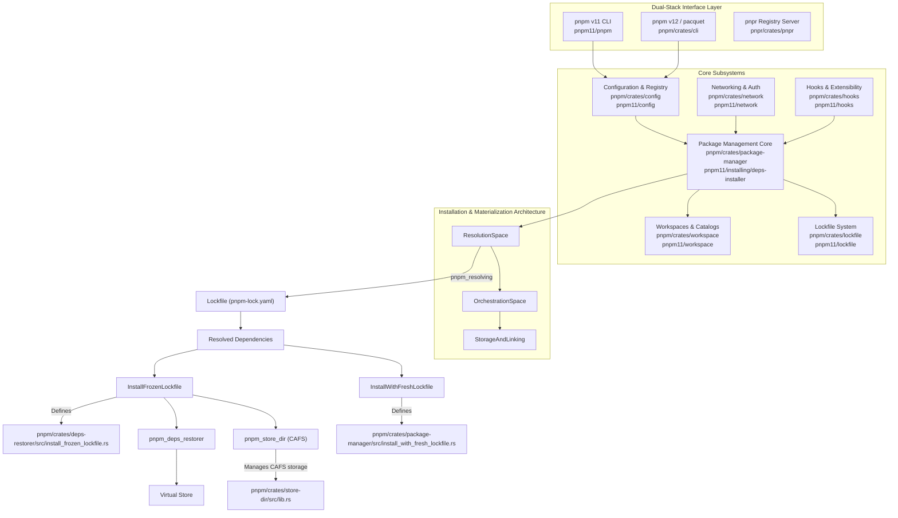
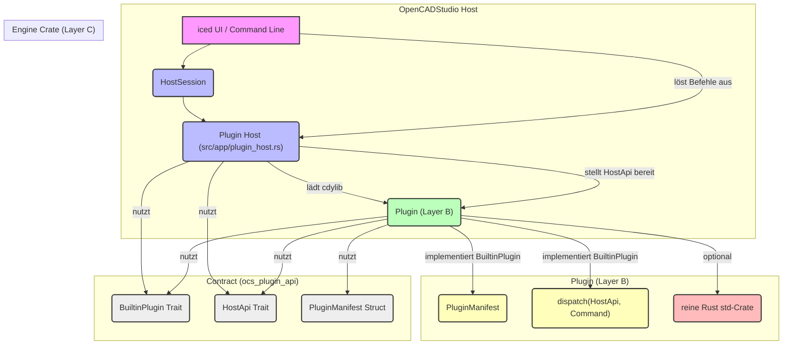
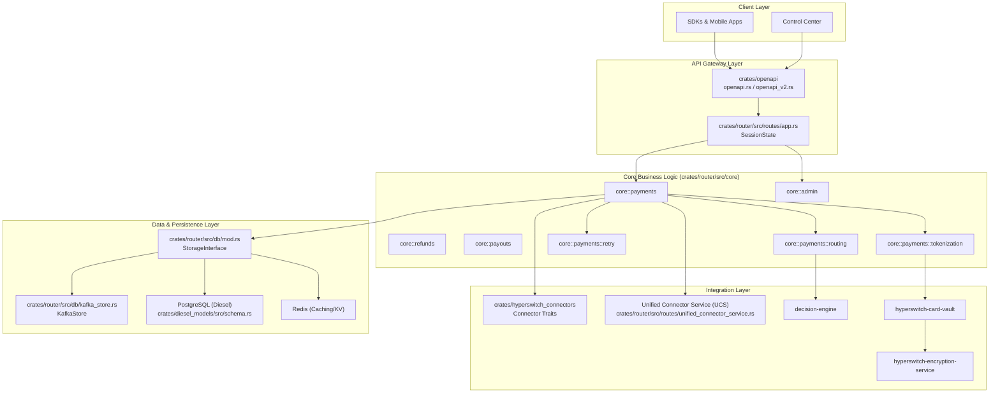
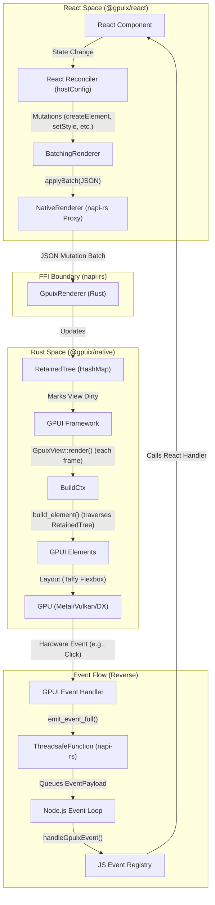

# pnpm/pnpm

## GitHub & DeepWiki
- GitHub: https://github.com/pnpm/pnpm
- DeepWiki: https://deepwiki.com/pnpm/pnpm

## Kurze Einführung
pnpm ist ein schneller und speichereffizienter Paketmanager für JavaScript-Projekte, der sich durch die Verwendung eines Content-Addressable File Systems (CAFS) auszeichnet, um Abhängigkeiten zu speichern und zu deduplizieren.  Er ist für Monorepos optimiert und stellt sicher, dass Pakete nur auf die in ihrer `package.json` deklarierten Abhängigkeiten zugreifen können, was zu einer strikten und deterministischen Installation führt.  Das Projekt entwickelt sich mit einer TypeScript v11 CLI und einem experimentellen Rust v12 Port namens `pacquet` weiter, der auf höhere Leistung und Parallelität abzielt. 

## Die 3 wichtigsten (oder komplexesten) Algorithmen

### 1. Content-Addressable File System (CAFS) und Hard Linking
1.  **Name & Verortung im Code:** Das CAFS wird im Rust-Stack hauptsächlich im `pnpm_store_dir`-Crate implementiert , während im TypeScript-Stack Funktionen um `pnpm11/store/cafs` existieren.  Die Kernlogik für das Speichern und Verknüpfen von Dateien befindet sich in Crates wie `pnpm/crates/store-dir/src/lib.rs`. 
2.  **Detaillierte technische Funktionsweise:** pnpm speichert alle Dateien von Modulverzeichnissen in einem Content-Addressable File System.  Anstatt redundante Kopien von Paketen zu speichern, werden Dateien basierend auf ihrem Inhalt gehasht und nur einmal im zentralen Speicher abgelegt.  Wenn ein Paket installiert wird, werden seine Dateien mittels Hard-Links oder Reflinks (Copy-on-Write) aus diesem zentralen Speicher in das `node_modules`-Verzeichnis des Projekts verknüpft.  Dies bedeutet, dass nur die Dateien, die sich zwischen verschiedenen Versionen eines Pakets unterscheiden, zusätzlich gespeichert werden müssen. 
3.  **Warum prägend:** Dieser Ansatz ist prägend für pnpm, da er den Festplattenspeicherverbrauch drastisch reduziert und die Installationszeiten erheblich beschleunigt.  Die Deduplizierung auf Dateiebene und die Verwendung von Hard-Links führen zu einer hohen Effizienz und Skalierbarkeit, insbesondere in Monorepos, wo viele Projekte dieselben Abhängigkeiten nutzen. 

### 2. Lockfile-Verwaltung und Auflösung (Dependency Graph Resolution)
1.  **Name & Verortung im Code:** Die Lockfile-Verwaltung und die Abhängigkeitsauflösung sind in Rust in Crates wie `pnpm/crates/lockfile` und `pnpm/crates/package-manager` implementiert.  Spezifische Funktionen für die Installation mit frischen oder eingefrorenen Lockfiles finden sich in `pnpm/crates/package-manager/src/install_with_fresh_lockfile.rs` und `pnpm/crates/deps-restorer/src/install_frozen_lockfile.rs`. 
2.  **Detaillierte technische Funktionsweise:** Das System verwaltet die `pnpm-lock.yaml`-Datei, die eine deterministische Installation über verschiedene Umgebungen hinweg gewährleistet.  Es lädt und parst die Lockfile, wandelt sie in einen Abhängigkeitsgraphen um und führt Integritätsprüfungen durch.  Bei einer "frischen" Installation (`InstallWithFreshLockfile`) wird der Abhängigkeitsgraph neu aufgelöst, während bei einer "eingefrorenen" Installation (`InstallFrozenLockfile`) der bestehende Lockfile verwendet wird, um die Abhängigkeiten wiederherzustellen.  Der Prozess beinhaltet auch die Validierung des Modulzustands und die Materialisierung der virtuellen Stores. 
3.  **Warum prägend:** Die strikte Lockfile-Verwaltung und die Fähigkeit, zwischen frischer Auflösung und eingefrorener Installation zu wechseln, sind entscheidend für die Reproduzierbarkeit und Zuverlässigkeit von pnpm.  Dies minimiert "works on my machine"-Probleme und stellt sicher, dass alle Entwickler und CI/CD-Systeme dieselben Abhängigkeiten erhalten. Die Effizienz wird durch die Wiederverwendung von Auflösungsergebnissen aus dem Lockfile weiter gesteigert. 

### 3. Virtueller Store und `node_modules`-Struktur
1.  **Name & Verortung im Code:** Der virtuelle Store ist ein dediziertes Verzeichnis innerhalb des `node_modules`-Ordners eines Projekts.  Im Rust-Stack wird die Erstellung und das Layout des virtuellen Stores in Crates wie `pnpm/crates/deps-restorer` verwaltet, insbesondere in `pnpm/crates/deps-restorer/src/install_frozen_lockfile.rs`. 
2.  **Detaillierte technische Funktionsweise:** pnpm erstellt eine einzigartige, verschachtelte `node_modules`-Struktur, die als "virtueller Store" bezeichnet wird.  Standardmäßig ist dies `node_modules/.pnpm` in v11 und `node_modules/.pacquet` in v12.  In diesem Verzeichnis werden die Abhängigkeiten in einer flachen Struktur gespeichert und dann über Symlinks in das `node_modules`-Verzeichnis des Projekts verknüpft.  Diese Struktur isoliert den Paketinhalt, um Phantom-Abhängigkeiten zu verhindern und das Linking zu unterstützen.  Jedes Paket kann nur auf die Abhängigkeiten zugreifen, die explizit in seiner `package.json` deklariert sind. 
3.  **Warum prägend:** Diese strikte `node_modules`-Struktur ist ein Kernmerkmal von pnpm, das die Zuverlässigkeit und Sicherheit von Projekten erhöht. Durch die Vermeidung von Phantom-Abhängigkeiten und die Durchsetzung einer strikten Zugriffsregel wird die Integrität des Abhängigkeitsgraphen gewahrt.  Dies trägt auch zur Performance bei, da die Auflösung von Modulen effizienter wird und unerwartete Abhängigkeitskonflikte reduziert werden. 

## Architektur & Zusammenspiel

Die Architektur von pnpm ist dual-stack, bestehend aus einer TypeScript v11 CLI und einem Rust v12 Port (`pacquet`), sowie einem Registry-Server (`pnpr`).  Die Kernsubsysteme umfassen Konfiguration, Paketmanagement, Lockfile-System, Workspaces, Netzwerkkonnektivität und Erweiterbarkeit. 


Die obige Architektur visualisiert das Zusammenspiel der Komponenten. Die CLI-Frontends (TypeScript v11 und Rust v12) interagieren mit dem Konfigurationssystem , das wiederum die Paketmanagement-Kernlogik speist.  Der Paketmanager orchestriert die Abhängigkeitsauflösung, das Fetching und die Materialisierung des virtuellen Stores.  Dabei wird entweder ein frischer Lockfile-Installationspfad (`InstallWithFreshLockfile`) oder ein eingefrorener Pfad (`InstallFrozenLockfile`) gewählt.  Beide Pfade nutzen den `pnpm_store_dir` (CAFS) für die Speicherung und `pnpm_deps_restorer` für die Wiederherstellung und Verknüpfung der Abhängigkeiten im virtuellen Store. 

## Notes
**NAPI (Node API):** pnpm nutzt NAPI, um die in Rust implementierten Hochleistungs-Engines (wie `pacquet`) für JavaScript-Laufzeiten zugänglich zu machen.  Dies ermöglicht es, performancekritische Teile in Rust zu schreiben und sie nahtlos in die TypeScript-CLI zu integrieren, was die Gesamtleistung verbessert. 

**Graph Hasher:** Das `pnpm/crates/graph-hasher`-Crate ist für das Hashing von Objekten und Abhängigkeitsgraphen zuständig.  Es repliziert das spezifische rekursive Bytestream-Format der npm-Bibliothek `object-hash`, um Kompatibilität und byte-genaue Übereinstimmung mit pnpm zu gewährleisten.  Dies ist entscheidend für die Cache-Schlüssel, die vom Side-Effects-Cache verwendet werden, um die Effizienz zu maximieren. 

**Multi-Ecosystem Support:** pnpm v12 erweitert seine Unterstützung über npm hinaus auf andere Paket-Ökosysteme wie Cargo (Rust) und Python (PyPI).  Dies wird durch dedizierte Resolver- und Installer-Crates wie `cargo-resolver` und `python-resolver` erreicht, die sich in den Workspace-Graphen und den Umgebungsmanager integrieren. 

Wiki pages you might want to explore:
- [Architecture (pnpm/pnpm)](/wiki/pnpm/pnpm#2)
- [Glossary (pnpm/pnpm)](/wiki/pnpm/pnpm#7)

View this search on DeepWiki: https://deepwiki.com/search/zielrepository-pnpmpnpm-erstel_dab2b535-c274-4653-bd6d-b7fb43f1800c

---

# HakanSeven12/OpenCADStudio

## GitHub & DeepWiki
- GitHub: https://github.com/HakanSeven12/OpenCADStudio
- DeepWiki: https://deepwiki.com/HakanSeven12/OpenCADStudio

## Kurze Einführung
Open CAD Studio (OCS) ist eine CAD-Anwendung für 2D-Zeichnung und 3D-Modellierung, die in Rust entwickelt wurde und native DWG- und DXF-Dateien lesen und schreiben kann . Es bietet eine breite Palette von Funktionen für die geometrische Modellierung, Annotationen, Bemaßungen und die Verwaltung von Papierbereichen und Layouts . OCS ist sowohl als native Desktop-Anwendung als auch als WebAssembly-Version für den Browser verfügbar .

## Die 3 wichtigsten (oder komplexesten) Algorithmen

### 1. Block-Definition Tessellierungs-Cache und lazy Expansion
**Name & Verortung im Code:** `BlockDefn` und `LocalWire` in `src/scene/cache/block_cache.rs` . Die Logik für die Erstellung und Expansion befindet sich in Funktionen wie `build_nested_ref` und `tessellate_sub_local` in derselben Datei  .

**Detaillierte technische Funktionsweise:** Jede Blockdefinition wird einmal in blocklokale Koordinaten tesselliert und als Liste von `LocalSub` gespeichert . Ein `LocalSub` kann entweder ein tesselliertes primitives Drahtmodell oder eine unexpandierte Referenz auf einen verschachtelten `INSERT` sein . Zur Laufzeit, wenn ein `INSERT` verwendet wird, wird die Definition durchlaufen, primitive Elemente werden transformiert und kopiert, und in verschachtelte Referenzen wird rekursiv eingetaucht . Jede verschachtelte Definition ist dabei ein Cache-Treffer und wird nie erneut tesselliert . Dies verhindert eine kombinatorische Explosion bei der Erstellung von Blöcken mit vielen verschachtelten `INSERT`s . Eine Rekursionstiefenbegrenzung (`MAX_NESTING_DEPTH`) und ein `visited`-Set erkennen Zyklen und verhindern Endlosschleifen bei selbstreferenziellen Blöcken  .

**Warum prägend:** Dieser Algorithmus ist entscheidend für die Performance und Skalierbarkeit von OCS, insbesondere bei großen und komplexen Zeichnungen mit vielen Blockinstanzen . Durch die lazy Expansion und das Caching der tessellierten Blockdefinitionen wird die Rechenarbeit proportional zur Gesamtzahl der Entitäten gehalten, anstatt bei jedem `INSERT` eine vollständige Neuberechnung durchzuführen .

### 2. Inkrementelles Tessellierungs-Memo (Wire-Cache)
**Name & Verortung im Code:** `tess_memo` und `resident_tess_memo` in der `Scene`-Struktur in `src/scene/mod.rs`  . Die Logik für die Verwendung und Aktualisierung dieser Memos befindet sich in der `tessellate_visible_entities`-Funktion .

**Detaillierte technische Funktionsweise:** Das System verwendet zwei Memoization-Caches: `tess_memo` für den gecullten Renderpfad, der von Kamera-Parametern abhängt, und `resident_tess_memo` für den kameraunabhängigen residenten Drahtsatz . Wenn `tessellate_visible_entities` aufgerufen wird, wird ein Guard-Hash aus verschiedenen Parametern (Zoom, Toleranz, Ansicht, Annotation, Hintergrund, etc.) berechnet . Stimmt dieser Hash nicht mit dem gespeicherten Guard überein, wird der Memo-Cache geleert . Anschließend werden die sichtbaren Entitäten klassifiziert: Treffer im Memo-Cache werden wiederverwendet, während verpasste Entitäten parallel tesselliert werden . Die Ergebnisse der Tessellierung werden dann in den Cache eingefügt .

**Warum prägend:** Dieser Algorithmus ist entscheidend für die interaktive Performance von OCS. Er ermöglicht es, bei Änderungen an einzelnen Entitäten nur die betroffenen Entitäten neu zu tessellieren, anstatt die gesamte Zeichnung . Dies reduziert die Latenz bei Benutzerinteraktionen wie Pan, Zoom oder Bearbeitung erheblich, da die meisten Drahtmodelle aus dem Cache geladen werden können .

### 3. Plugin-Architektur mit drei Schichten und stabilem Vertrag
**Name & Verortung im Code:** Die Architektur wird in `docs/plugin-architecture.md` beschrieben . Die Kernkomponenten sind das `ocs_plugin_api`-Crate , der Plugin-Host (`src/app/plugin_host.rs`) und externe dynamische Bibliotheken (`cdylib`) als Plugins .

**Detaillierte technische Funktionsweise:** Die Plugin-Architektur ist in drei Schichten unterteilt:
*   **Schicht A (Host):** Verantwortlich für die Erkennung, das Laden und die UI-Integration von Plugins .
*   **Schicht B (Plugin):** Eine externe dynamische Bibliothek (`cdylib`), die ein Manifest deklariert und Befehle über den `BuiltinPlugin`-Trait dispatchen kann .
*   **Schicht C (Engine):** Eine optionale, reine Rust `std`-Crate, die domänenspezifische Logik enthält und keine UI- oder CAD-Abhängigkeiten hat .

Der `ocs_plugin_api`-Crate dient als stabiler, semver-versionierter Vertrag zwischen Host und Plugin . Er definiert Schnittstellen wie `PluginManifest`, `BuiltinPlugin` und `HostApi` . Plugins werden zur Laufzeit geladen, und der Host ruft die `dispatch`-Methode des Plugins auf, wenn ein Befehl ausgelöst wird .

**Warum prägend:** Diese Architektur ermöglicht es Drittentwicklern, die CAD-Umgebung zu erweitern, ohne den Host-Quellcode ändern zu müssen . Der stabile Vertrag gewährleistet die Kompatibilität zwischen Host und Plugins, selbst wenn sich die internen Implementierungen des Hosts ändern . Die Trennung in Schichten fördert die Modularität, Stabilität und plattformübergreifende Kompatibilität, da Engine-Crates sogar in WASM/CLI ohne die CAD-Host-Abhängigkeiten laufen können  .

## Architektur & Zusammenspiel



## Notes
Ein weiteres technisches Highlight ist die Verwendung von XDATA (Extended Data) zur Persistenz von Plugin-spezifischen Daten, die einen DWG/DXF-Roundtrip überleben . Die `HostSession` bietet Methoden zum Lesen, Schreiben und Entfernen dieser Datensätze .

Das System nutzt `rayon` für Parallelisierung auf nativen Builds, um die Tessellierung und den Aufbau von Interaktionsindizes zu beschleunigen . Im WebAssembly-Build ist die Parallelisierung aufgrund von Browserbeschränkungen deaktiviert, und die Operationen werden sequenziell ausgeführt  .

Die `Scene`-Struktur verwaltet eine Vielzahl von Caches, darunter `hatch_cache`, `wipeout_cache`, `image_cache` und `mesh_cache`, um die Render-Performance zu optimieren und unnötige Neuberechnungen zu vermeiden . Diese Caches sind oft nach `geometry_epoch` und anderen Parametern wie `selection_generation` oder `block` geschlüsselt, um eine effiziente Invalidierung und Aktualisierung zu gewährleisten .

Wiki pages you might want to explore:
- [Glossary (HakanSeven12/OpenCADStudio)](/wiki/HakanSeven12/OpenCADStudio#12)
- [Plugin System (HakanSeven12/OpenCADStudio)](/wiki/HakanSeven12/OpenCADStudio#8)

View this search on DeepWiki: https://deepwiki.com/search/zielrepository-hakanseven12ope_9e7bf91f-6c31-4e9c-8a6d-6fe21cc66d70

---

# juspay/hyperswitch

## GitHub & DeepWiki
- GitHub: https://github.com/juspay/hyperswitch
- DeepWiki: https://deepwiki.com/juspay/hyperswitch

## Kurze Einführung
Hyperswitch ist eine modulare Open-Source-Zahlungsinfrastruktur, die eine einzige API zur Integration mit über 120 Zahlungsdienstleistern (PSPs) bietet. Es fungiert als Zahlungsrouter und Orchestrierungsschicht, die Händlern die Verwaltung mehrerer Zahlungs-Konnektoren, die Handhabung komplexer Routing-Logik und die Abwicklung von Zahlungen über verschiedene Zahlungsmethoden und Regionen hinweg ermöglicht. Das System ist auf Skalierbarkeit, Flexibilität und eine gute Entwicklererfahrung ausgelegt.  

## Die 3 wichtigsten (oder komplexesten) Algorithmen

### 1. Intelligentes Routing
Das intelligente Routing ist ein Kernmerkmal von Hyperswitch, das in der `router`-Kiste implementiert ist.  Es ermöglicht die Auswahl des am besten geeigneten Zahlungsdienstleisters (PSP) für jede Transaktion. 

#### Detaillierte technische Funktionsweise
Der Algorithmus wählt den PSP mit der höchsten vorhergesagten Autorisierungsrate oder den niedrigsten Kosten für jede Transaktion aus.  Dies wird durch die Analyse verschiedener Faktoren wie Karten-BIN, Region, Zahlungsmethode und andere dynamische Daten erreicht.  Das `decision-engine`-Repository ist ein eigenständiger Dienst, der als Routing-Kontrollebene fungiert und regelbasierte sowie erfolgsratenbasierte Gateway-Auswahl ermöglicht. 

#### Warum prägend
Dieses intelligente Routing ist prägend, da es die Erfolgsraten von Transaktionen maximiert, Ausfallzeiten vermeidet und die Latenz minimiert, was direkt die Performance und Zuverlässigkeit des Zahlungssystems beeinflusst.  Es bietet Händlern die Flexibilität, ihre Zahlungsabläufe zu optimieren und die Kosten zu senken. 

### 2. Revenue Recovery (Intelligente Wiederholungsstrategien)
Der Revenue Recovery-Mechanismus ist ein weiterer wichtiger Algorithmus, der in Hyperswitch implementiert ist. 

#### Detaillierte technische Funktionsweise
Dieser Algorithmus bekämpft passiven Churn durch intelligente Wiederholungsstrategien.  Diese Strategien werden durch Faktoren wie Karten-BIN, Region und Methode optimiert.  Es bietet eine feingranulare Kontrolle über Wiederholungsalgorithmen und Budgetgrenzen für Strafen. 

#### Warum prägend
Dieser Algorithmus ist entscheidend für die Maximierung der Einnahmen von Händlern, indem er fehlgeschlagene Transaktionen erfolgreich wiederholt.  Er verbessert die Ausfallsicherheit des Systems und reduziert den Verlust von Einnahmen, was direkt zur Skalierbarkeit und Effizienz der Plattform beiträgt. 

### 3. PCI-konformer Vault und Tokenisierung
Der PCI-konforme Vault-Dienst ist eine zentrale Datenstruktur und ein Algorithmus für die sichere Speicherung sensibler Zahlungsinformationen. 

#### Detaillierte technische Funktionsweise
Der Vault speichert Karten, Token, Wallets und Bankdaten sicher.  Er ermöglicht die Tokenisierung und Wiederverwendung von Zahlungsmethoden.  Das separate Repository `hyperswitch-card-vault` ist für die PCI-konforme Kartenspeicherung zuständig, während der `encryption-service` die Verschlüsselung und Entschlüsselung übernimmt. 

#### Warum prägend
Dieser Algorithmus ist prägend, da er die Einhaltung strenger Sicherheitsstandards (PCI DSS) gewährleistet und das Vertrauen der Nutzer in die Plattform stärkt.  Die sichere Speicherung und Wiederverwendung von Zahlungsmethoden verbessert die Benutzererfahrung und reduziert den Aufwand für wiederkehrende Zahlungen. 

## Architektur & Zusammenspiel


Die Architektur von Hyperswitch ist modular aufgebaut und besteht aus mehreren Schichten. Die `ClientLayer` umfasst SDKs und das Control Center, die über die `APILayer` mit dem System interagieren.  Die `APILayer` nutzt OpenAPI-Spezifikationen und die `SessionState` in `crates/router/src/routes/app.rs` als zentralen Zustand.  Die `CoreBusinessLogic` in `crates/router/src/core` verarbeitet Zahlungen, Rückerstattungen und Auszahlungen.  Hier sind auch die Module für Routing, Wiederholungsversuche (`retry`) und Tokenisierung (`tokenization`) angesiedelt.  Die `IntegrationLayer` verbindet sich mit externen Diensten wie Zahlungs-Konnektoren, dem `DecisionEngine` für intelligentes Routing, dem `CardVault` für sichere Speicherung und dem `EncryptionService` für Verschlüsselung.  Die `DataLayer` verwendet eine trait-basierte Abstraktion (`StorageInterface`) für die Persistenz, mit PostgreSQL als Hauptdatenbank und Redis für Caching und Warteschlangen.   Kafka wird für das Streaming von Datenänderungen und Ereignissen verwendet. 

## Notes
Hyperswitch nutzt Rust für Performance und Zuverlässigkeit.  Das System ist in verschiedene Crates unterteilt, wie `api_models`, `common_enums`, `common_utils`, `diesel_models`, `drainer`, `external_services`, `masking`, `redis_interface`, `router`, `router_derive`, `router_env`, `scheduler` und `storage_impl`, die jeweils spezifische Aufgaben erfüllen.  Das `drainer`-Crate liest beispielsweise Redis-Streams und schreibt Daten in PostgreSQL, was ein KV-Store-Muster mit einem Hintergrund-Drainer implementiert.  Für die Überwachung werden OpenTelemetry Collector, Prometheus, Promtail, Loki und Tempo eingesetzt, um Metriken, Logs und Traces zu sammeln und zu analysieren. 

Wiki pages you might want to explore:
- [Overview (juspay/hyperswitch)](/wiki/juspay/hyperswitch#1)

View this search on DeepWiki: https://deepwiki.com/search/zielrepository-juspayhyperswit_becfc794-bc05-4c99-acd7-61fb53070cef

---

# remorses/gpuix

## GitHub & DeepWiki
- GitHub: https://github.com/remorses/gpuix
- DeepWiki: https://deepwiki.com/remorses/gpuix

## Kurze Einführung
GPUIX ist eine Hochleistungsbrücke, die es ermöglicht, native GPU-beschleunigte Desktop-Anwendungen mit React und TypeScript zu erstellen. Es nutzt GPUI, das Rendering-Framework des Zed-Editors, um Electron und Webansichten zu umgehen und Komponenten direkt über Metal, DirectX oder Vulkan zu rendern . Das Projekt richtet sich an Entwickler, die performante Desktop-Anwendungen mit einer React-ähnlichen Entwicklungserfahrung erstellen möchten .

## Die 3 wichtigsten (oder komplexesten) Algorithmen

### 1. Mutationsbasiertes Protokoll und Retained Tree
*   **Name & Verortung im Code:** Das mutationsbasierte Protokoll wird durch die `NativeRenderer`-Schnittstelle in TypeScript  und die `GpuixRenderer`-Klasse in Rust  implementiert. Der `RetainedTree` ist eine zentrale Datenstruktur in Rust, die in `packages/native/src/renderer.rs` verwaltet wird .
*   **Detaillierte technische Funktionsweise:** Anstatt einen vollständigen JSON-Baum bei jeder Änderung zu serialisieren, sendet der React-Reconciler granulare Mutationen (z.B. `createElement`, `appendChild`, `setStyle`) über die FFI-Grenze an Rust . Diese Mutationen aktualisieren einen persistenten `RetainedTree` in Rust, der den React-Komponenten-Baum widerspiegelt . Der `RetainedTree` speichert Elementtypen, Stile und Event-Flags . Die Mutationen werden in Batches zusammengefasst und über die `applyBatch`-Methode in einem einzigen FFI-Aufruf an Rust gesendet, um den Overhead zu minimieren .
*   **Warum prägend:** Dieses Protokoll ist entscheidend für die Performance, da es die Menge der über die FFI-Grenze gesendeten Daten minimiert . Es ermöglicht GPUIX, die deklarative Natur von React mit dem Immediate-Mode-Rendering von GPUI zu verbinden, indem es einen stabilen, aber effizient aktualisierbaren Zustand in Rust beibehält .

### 2. Text-Funneling und Selektion
*   **Name & Verortung im Code:** Das Text-Funneling wird in Rust in `crate::text` implementiert . Die Selektionslogik ist Teil der `GpuixView` und wird während des `render`-Zyklus verwaltet .
*   **Detaillierte technische Funktionsweise:** Jeder Text, der in GPUIX gerendert wird, durchläuft eine spezifische Pipeline, entweder als `selectable_text` für interaktiven Inhalt oder als `chrome_text` für nicht-interaktive UI-Elemente . Die Selektion wird durch ein `canvas`-Element realisiert, das als Unterlage für den Text dient und die Selektionsbereiche malt . Die Selektionsregistrierung wird bei jedem Frame-Reset neu aufgebaut, um sicherzustellen, dass nur sichtbare und aktuelle Elemente berücksichtigt werden .
*   **Warum prägend:** Dieses System gewährleistet eine konsistente und testbare Textdarstellung und -interaktion über alle Elemente hinweg . Es löst das Problem der durchgehenden Textselektion über verschiedene UI-Komponenten hinweg, was in Immediate-Mode-Frameworks oft eine Herausforderung darstellt .

### 3. Virtuelle Listen
*   **Name & Verortung im Code:** Virtuelle Listen werden in Rust innerhalb der `GpuixView` verwaltet, insbesondere durch die Methode `build_virtual_child` . Die Implementierung befindet sich in `packages/native/src/renderer.rs` und wird durch das `<virtual-list>` Custom Element in React genutzt .
*   **Detaillierte technische Funktionsweise:** Das `<virtual-list>`-Element rendert seine Kinder nicht während des initialen `GpuixView::render`-Aufrufs . Stattdessen verwendet es `cx.processor`, um die `GpuixView`-Entität nach dem Root-Render erneut zu betreten und nur die Zeilen zu erstellen, die GPUI anfordert . Dies bedeutet, dass nur die aktuell sichtbaren Elemente im DOM-Baum vorhanden sind, was die Rendering-Last reduziert .
*   **Warum prägend:** Virtuelle Listen sind entscheidend für die Skalierbarkeit und Performance bei der Darstellung langer Listen von Elementen, wie z.B. in Chat-Anwendungen oder Code-Editoren . Sie verhindern, dass das gesamte DOM für nicht sichtbare Elemente aufgebaut wird, was zu einer erheblichen Reduzierung des Speicherverbrauchs und einer flüssigeren Scroll-Erfahrung führt .

## Architektur & Zusammenspiel


   

## Notes
GPUIX nutzt `napi-rs` als Foreign Function Interface (FFI) zwischen Node.js und Rust, was eine effiziente Kommunikation ermöglicht . Für die Layout-Berechnung wird die Taffy-Engine verwendet, die Flexbox-Eigenschaften unterstützt . Das System unterstützt Hot Module Replacement (HMR) auf der React-Seite, um schnelle Iterationen zu ermöglichen, ohne den nativen Prozess neu starten zu müssen . Es gibt auch eine Reihe von "Custom Elements" wie `<markdown>`, `<code>` und `<diff>`, die komplexe Rendering-Logik nativ in Rust implementieren  .

Wiki pages you might want to explore:
- [GPUIX Overview (remorses/gpuix)](/wiki/remorses/gpuix#1)
- [Glossary (remorses/gpuix)](/wiki/remorses/gpuix#7)

View this search on DeepWiki: https://deepwiki.com/search/zielrepository-remorsesgpuix-e_611fd116-05a1-4baa-bdcc-e2fb1624f2a4

---

# rust-lang/rust

## GitHub & DeepWiki
- GitHub: https://github.com/rust-lang/rust
- DeepWiki: https://deepwiki.com/rust-lang/rust

## Kurze Einführung
Das `rust-lang/rust`-Repository beherbergt den Rust-Compiler (`rustc`), die Standardbibliotheken und zugehörige Tools. Es dient als zentrale Anlaufstelle für die Entwicklung, Wartung und Verteilung der Rust-Programmiersprache. Die Zielgruppe umfasst Rust-Entwickler, Compiler-Ingenieure und Beitragende, die an der Sprache und ihrem Ökosystem arbeiten.

## Die 3 wichtigsten (oder komplexesten) Algorithmen

### 1. Das Query-System
Das Query-System ist der zentrale Mechanismus des Rust-Compilers für die inkrementelle Kompilierung und die Verwaltung von Abhängigkeiten zwischen verschiedenen Kompilierungsschritten. 


1.  **Verortung im Code:** Das Query-System ist in `compiler/rustc_middle/src/query/mod.rs` definiert und wird über die `TyCtxt`-Struktur (`compiler/rustc_middle/src/ty/context.rs`) zugänglich gemacht.  
2.  **Detaillierte technische Funktionsweise:** Anstatt den Kompilierungsprozess als eine sequentielle Reihe von Durchläufen zu organisieren, ist `rustc` als eine Sammlung von "Queries" aufgebaut.  Jede Query ist eine Funktion, die bei Bedarf ein bestimmtes Stück Information berechnet (z.B. den Typ eines Ausdrucks oder den optimierten MIR einer Funktion).  Die Ergebnisse dieser Queries werden zwischengespeichert, sowohl im Speicher als auch auf der Festplatte, um bei nachfolgenden Kompilierungen redundante Arbeit zu vermeiden.  Wenn eine Query aufgerufen wird, prüft das System zuerst den Cache. Bei einem Cache-Miss wird eine Provider-Funktion aufgerufen, um das Ergebnis zu berechnen.  Das System erkennt Zyklen und unterstützt Parallelisierung. 
3.  **Warum prägend:** Dieses System ist entscheidend für die inkrementelle Kompilierung von Rust, die es ermöglicht, bei kleinen Codeänderungen nur die betroffenen Teile neu zu kompilieren, was die Kompilierungszeiten erheblich reduziert.  Es verbessert auch die Modularität des Compilers und erleichtert die Wartung. 

### 2. Typinferenz und Trait-Auflösung
Die Typinferenz und Trait-Auflösung sind Kernbestandteile des Typsystems von Rust, die sicherstellen, dass der Code typsicher ist und die Trait-Constraints erfüllt werden. 

1.  **Verortung im Code:** Diese Prozesse finden hauptsächlich nach der Erstellung der High-Level Intermediate Representation (HIR) statt.  Die Hauptdatenstruktur für Typen ist `rustc_middle::ty::Ty`.  Die Trait-Auflösung wird vom Trait-Selektions-Engine in `compiler/rustc_trait_selection/src/traits/select/mod.rs` gehandhabt. 
2.  **Detaillierte technische Funktionsweise:** Die Typinferenz ist der automatische Prozess, bei dem der Compiler die Typen von Ausdrücken erkennt.  Die Trait-Auflösung ist der Prozess, bei dem für jeden Trait-Verweis eine passende Implementierung (`impl`) gefunden wird.  Dies beinhaltet auch die Typüberprüfung, die die vom Benutzer geschriebenen Typen in die interne Darstellung des Compilers (`Ty<'tcx>`) umwandelt und die Typsicherheit, Korrektheit und Kohärenz überprüft.  Der `InferCtxt` (`infcx`) ist der Typinferenzkontext. 
3.  **Warum prägend:** Diese Algorithmen sind fundamental für die Typsicherheit und das "Zero-Cost Abstraction"-Paradigma von Rust. Sie ermöglichen es Entwicklern, hochabstrahierten Code zu schreiben, der dennoch zur Laufzeit effizient ist, da der Compiler alle Typ- und Trait-Informationen zur Kompilierzeit auflösen kann. 

### 3. Borrow Checker (NLL)
Der Borrow Checker ist ein einzigartiger Bestandteil des Rust-Compilers, der die Speichersicherheit ohne Garbage Collection gewährleistet. 

1.  **Verortung im Code:** Der Borrow Checker arbeitet auf der Mid-Level Intermediate Representation (MIR).  Die Implementierung befindet sich hauptsächlich im `rustc_borrowck`-Crate.  Die `mir_borrowck`-Query ist der Haupteinstiegspunkt. 
2.  **Detaillierte technische Funktionsweise:** Der Borrow Checker analysiert die Lebensdauern von Referenzen und die Besitzverhältnisse von Daten, um Datenwettläufe und Dangling Pointers zur Kompilierzeit zu verhindern.  Die "Non-Lexical Lifetimes" (NLL) sind eine Erweiterung des Borrowing-Systems, die auf dem Kontrollflussgraphen des MIR basiert.  Dies ermöglicht präzisere Analysen und erlaubt mehr gültigen Code, der zuvor vom lexikalischen Borrow Checker abgelehnt wurde. 
3.  **Warum prägend:** Der Borrow Checker ist das Herzstück von Rusts Versprechen der Speichersicherheit ohne Laufzeit-Overhead. Er ermöglicht es Entwicklern, sichere und performante Systemprogramme zu schreiben, indem er eine ganze Klasse von Fehlern (wie Use-After-Free oder Datenwettläufe) zur Kompilierzeit eliminiert. 

## Architektur & Zusammenspiel

```mermaid
graph TD
    A[Rust Source Code] --> B(Lexing & Parsing)
    B --> C{Abstract Syntax Tree (AST)}
    C --> D(AST Lowering)
    D --> E{High-Level IR (HIR)}
    E --> F(Type Inference & Trait Solving)
    F --> G{Typed HIR (THIR)}
    G --> H(MIR Lowering)
    H --> I{Mid-Level IR (MIR)}
    I --> J(Borrow Checking)
    I --> K(MIR Optimizations)
    J --> L(Monomorphization Collection)
    K --> L
    L --> M(Code Generation)
    M --> N{LLVM IR}
    N --> O(LLVM Backend)
    O --> P{Executable Binary}

    subgraph Compiler Core
        TyCtxt["TyCtxt (Typing Context)"]
        QuerySystem["Query System"]
        Interning["Interning (Types, Regions, Consts)"]
        Metadata["Crate Metadata"]
    end

    TyCtxt -- manages --> QuerySystem
    TyCtxt -- uses --> Interning
    TyCtxt -- accesses --> Metadata

    E -- uses --> TyCtxt
    F -- uses --> TyCtxt
    I -- uses --> TyCtxt
    J -- uses --> TyCtxt
    K -- uses --> TyCtxt
    M -- uses --> TyCtxt

    style TyCtxt fill:#f9f,stroke:#333,stroke-width:2px
    style QuerySystem fill:#bbf,stroke:#333,stroke-width:2px
    style Interning fill:#ccf,stroke:#333,stroke-width:2px
    style Metadata fill:#cfc,stroke:#333,stroke-width:2px
```
Die Kompilierung beginnt mit der Umwandlung des Rust-Quellcodes in einen Token-Stream durch den Lexer (`rustc_lexer`).  Dieser Token-Stream wird dann vom Parser (`rustc_parse`) in einen Abstract Syntax Tree (AST) übersetzt.  Der AST wird anschließend in eine High-Level Intermediate Representation (HIR) umgewandelt, eine compilerfreundlichere Darstellung, die Desugaring beinhaltet.  Auf dem HIR erfolgen Typinferenz, Trait-Auflösung und Typüberprüfung.  Das HIR wird weiter zu einem Typed HIR (THIR) und dann zur Mid-Level Intermediate Representation (MIR) abgesenkt.  Das MIR ist die Grundlage für den Borrow Checker und MIR-Optimierungen.  Während der Monomorphisierung werden generische Typen durch konkrete Typen ersetzt.  Schließlich wird der MIR in LLVM IR umgewandelt, das vom LLVM-Backend optimiert und in ausführbaren Maschinencode übersetzt wird. 

Das gesamte Kompilierungssystem wird durch den `TyCtxt` (`rustc_middle::ty::context::TyCtxt`) verwaltet, der als zentraler, schreibgeschützter Kontext dient und Zugriff auf typrelevante Daten und sitzungsweite Informationen bietet.  Der `TyCtxt` umschließt den `GlobalCtxt`, der die permanenten Arena-Allokationen für internierte Typen, Regionen und Konstanten sowie das Query-System besitzt.  Das Query-System (`rustc_middle::query::mod.rs`) ist der demand-driven Berechnungs-Engine, der inkrementelle Kompilierung durch Caching von Ergebnissen ermöglicht.  Interning (`rustc_data_structures::intern::Interned`) wird verwendet, um häufig verwendete Daten wie Typen und Symbole effizient zu speichern und zu vergleichen.  Crate-Metadaten (`rustc_metadata`) ermöglichen die separate und inkrementelle Kompilierung über Crate-Grenzen hinweg. 

## Notes
Ein weiteres technisches Highlight ist die Bootstrapping-Strategie des Compilers: `rustc` ist in Rust geschrieben und wird von einer älteren Version von sich selbst kompiliert.  Dies stellt sicher, dass der Compiler ständig seine eigene Software testet ("eating our own dogfood"). 

Die Parallelisierung ist ein fortlaufendes Entwicklungsgebiet. Derzeit ist nur die Codegenerierung standardmäßig parallelisiert.  Es gibt Bemühungen, weitere Teile des Compilers zu parallelisieren, indem `RefCell`s in `Mutex`s umgewandelt werden, um Thread-sichere interne Mutabilität zu ermöglichen. 

Das `rust-lang/rust`-Repository enthält auch umfangreiche Dokumentation, wie den `rustc-dev-guide`, der die internen Abläufe des Compilers detailliert beschreibt. <cite repo="rust-lang/rust" path="wiki_page:rust-lang/rust:5.7" start

Wiki pages you might want to explore:
- [Core Compiler Infrastructure (rust-lang/rust)](/wiki/rust-lang/rust#3)
- [Compiler Developer Documentation (rustc-dev-guide & books) (rust-lang/rust)](/wiki/rust-lang/rust#5.7)

View this search on DeepWiki: https://deepwiki.com/search/zielrepository-rustlangrust-er_3012b3ca-2341-46a3-b721-5c7980f2f786
