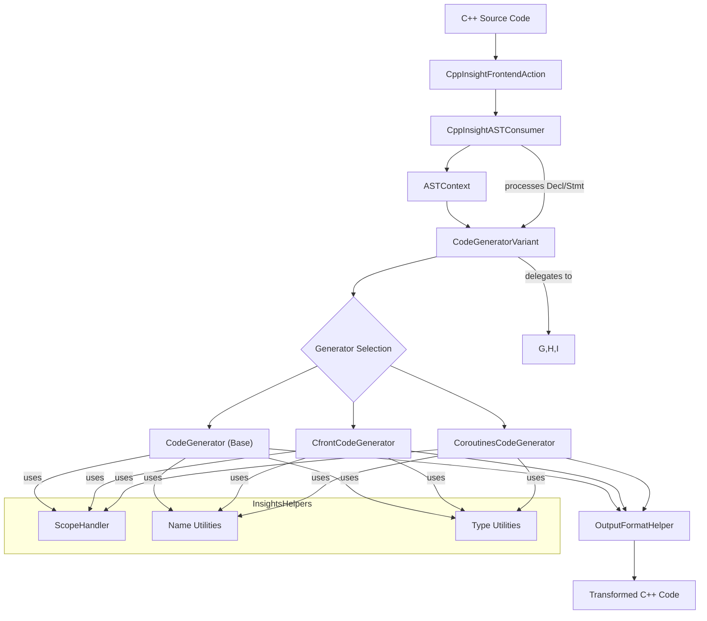

# andreasfertig/cppinsights

## GitHub & DeepWiki
- GitHub: https://github.com/andreasfertig/cppinsights
- DeepWiki: https://deepwiki.com/andreasfertig/cppinsights

## Kurze Einführung
C++ Insights ist ein auf Clang basierendes Tool, das eine Quell-zu-Quell-Transformation von C++-Code durchführt. Es macht die impliziten Operationen des Compilers explizit sichtbar, wie z.B. Template-Instanziierungen, Lambda-Transformationen und die Behandlung von Coroutinen. Das Tool richtet sich an C++-Entwickler, die ein tieferes Verständnis dafür entwickeln möchten, wie der Compiler ihren Code verarbeitet. 

## Die 3 wichtigsten (oder komplexesten) Algorithmen

### 1. CodeGenerator-Varianten
*   **Name & Verortung im Code:** Die Kernfunktionalität wird durch die Klasse `CodeGenerator`  und ihre spezialisierten Ableitungen wie `CfrontCodeGenerator`  und `CoroutinesCodeGenerator`  implementiert. Die Auswahl und Verwaltung dieser Varianten erfolgt über die Klasse `CodeGeneratorVariant` .
*   **Detaillierte technische Funktionsweise:** Die `CodeGeneratorVariant`-Klasse wählt basierend auf Kommandozeilenoptionen den passenden Code-Generator aus.  Der Basis-`CodeGenerator` transformiert AST-Knoten in lesbaren C++-Code, indem er implizite Sprachmerkmale wie `auto`-Typableitungen oder Range-based For-Loops explizit darstellt.  Der `CfrontCodeGenerator` wandelt modernen C++-Code in C-ähnlichen Code um, inklusive expliziter Vtable-Behandlung.  Der `CoroutinesCodeGenerator` transformiert C++20 Coroutinen in ihre äquivalenten Zustandsmaschinen-Implementierungen. 
*   **Warum prägend:** Diese Architektur ermöglicht es C++ Insights, verschiedene "Ansichten" des Codes zu generieren, die jeweils unterschiedliche Aspekte der Compilerverarbeitung beleuchten. Dies ist entscheidend für das Ziel des Tools, die "Augen des Compilers" sichtbar zu machen und das Verständnis komplexer C++-Features zu verbessern. 

### 2. Implizite Cast-Transformation
*   **Name & Verortung im Code:** Die Transformation impliziter Casts wird hauptsächlich in der Methode `CodeGenerator::InsertArg(const ImplicitCastExpr* stmt)`  gehandhabt.
*   **Detaillierte technische Funktionsweise:** Diese Methode identifiziert verschiedene Arten von impliziten Casts (`CastKind`) und entscheidet basierend auf Konfigurationsoptionen (z.B. `ShowAllImplicitCasts`), ob und wie der Cast im generierten Code dargestellt werden soll.  Für bestimmte Casts, wie `CK_DerivedToBase` oder `CK_BaseToDerived`, berechnet der `CfrontCodeGenerator` explizite Pointer-Offsets und fügt diese in den Code ein, um die Transformation von Objekten in C-ähnliche Strukturen zu simulieren. 
*   **Warum prägend:** Die explizite Darstellung impliziter Casts ist ein Kernmerkmal von C++ Insights, da sie verborgene Compiler-Operationen aufdeckt, die für das Verständnis der Typkonvertierung und Objektmodellierung in C++ entscheidend sind. Dies trägt maßgeblich zur Transparenz der Compiler-Arbeit bei.

### 3. Lambda-Transformation
*   **Name & Verortung im Code:** Die Verarbeitung von Lambda-Ausdrücken erfolgt in der Methode `CodeGenerator::InsertArg(const LambdaExpr* stmt)`  und der zugehörigen `HandleLambdaExpr`-Methode. Auch die `CodeGenerator::InsertArg(const CXXRecordDecl* stmt)`  Methode spielt eine Rolle bei der Generierung der Lambda-Klasse.
*   **Detaillierte technische Funktionsweise:** Wenn ein Lambda-Ausdruck verarbeitet wird, wird ein `LambdaScopeHandler`  verwendet, um den Kontext zu verfolgen. C++ Insights generiert eine explizite Klasse für das Lambda, inklusive des `operator()` und der Member-Variablen für die Captures.  Spezielle Logik existiert für Init-Captures, die `std::move` verwenden, um die korrekte Semantik im transformierten Code widerzuspiegeln. 
*   **Warum prägend:** Lambdas sind ein komplexes und häufig genutztes C++-Feature. Die Fähigkeit von C++ Insights, die vom Compiler generierte Klasse und die Capture-Mechanismen explizit darzustellen, ist von großem Wert für das Verständnis der Laufzeitkosten und des Verhaltens von Lambdas. Dies ist ein Paradebeispiel dafür, wie das Tool "hinter die Kulissen" blickt.

## Architektur & Zusammenspiel

Die `CppInsightFrontendAction`  initialisiert den Prozess und erstellt einen `CppInsightASTConsumer` . Dieser Consumer verarbeitet die `ASTContext`  und nutzt eine `CodeGeneratorVariant` , um den passenden Code-Generator (z.B. `CodeGenerator`, `CfrontCodeGenerator`, `CoroutinesCodeGenerator`) basierend auf den Kommandozeilenoptionen auszuwählen.  Die ausgewählte `CodeGenerator`-Instanz durchläuft die Deklarationen und Anweisungen des AST und verwendet die `OutputFormatHelper`-Klasse  sowie verschiedene Hilfsklassen aus `InsightsHelpers`  (wie `ScopeHandler` , Name- und Typ-Utilities), um den transformierten Code zu generieren. 

## Notes
Ein weiteres technisches Highlight ist die `LifetimeTracker`-Klasse , die verwendet wird, um die Lebensdauer von Variablen zu verfolgen und explizite Destruktoraufrufe in den generierten Code einzufügen, insbesondere wenn die Option `ShowLifetime` aktiviert ist.  Dies ist besonders nützlich, um zu verstehen, wann temporäre Objekte zerstört werden oder wann `std::initializer_list` verwendet wird. 

Wiki pages you might want to explore:
- [InsightsHelpers (andreasfertig/cppinsights)](/wiki/andreasfertig/cppinsights#2.2)
- [Code Generator Variants (andreasfertig/cppinsights)](/wiki/andreasfertig/cppinsights#3)

View this search on DeepWiki: https://deepwiki.com/search/zielrepository-andreasfertigcp_328b5cc0-6cdc-4517-8959-b19fbceb661f
