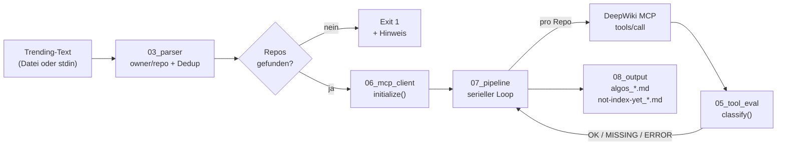
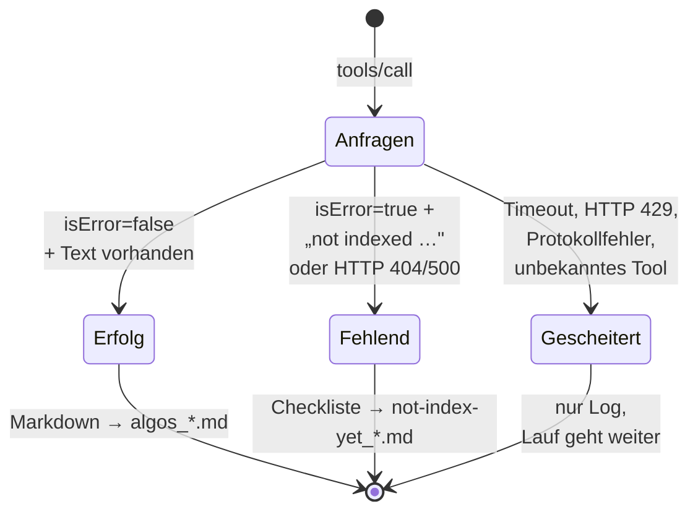
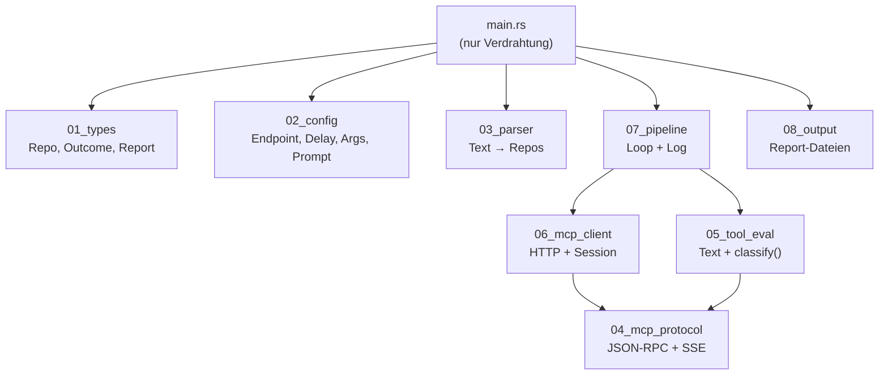
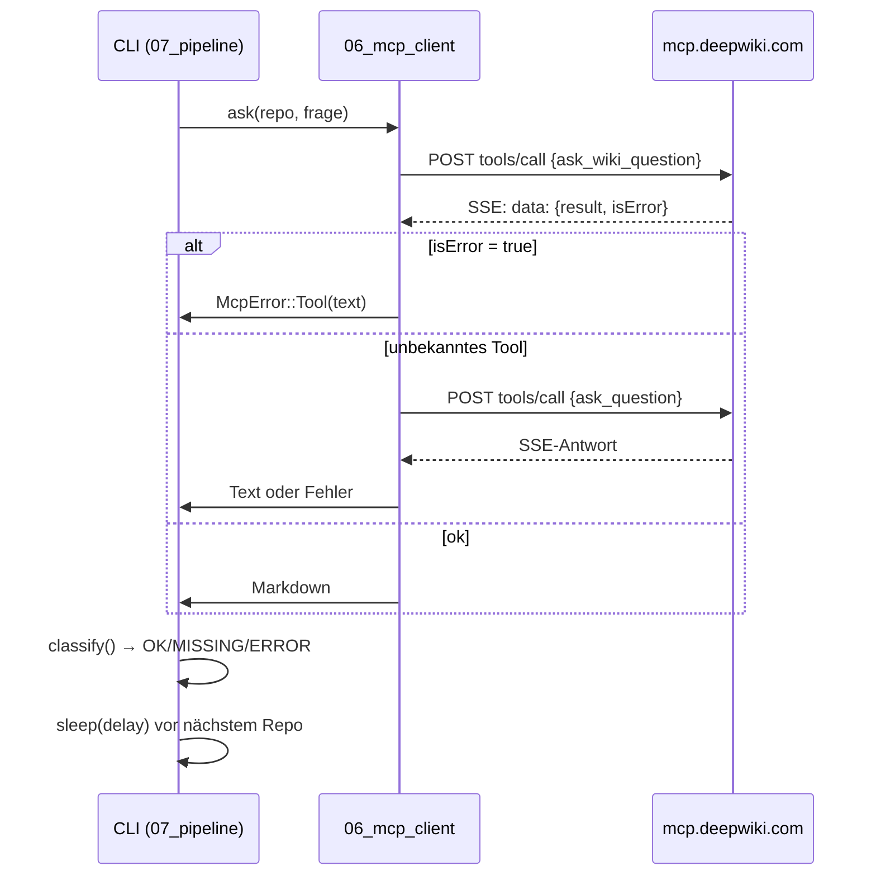

# Walkthrough: `github-trending-algos` — vom Trending-Feed zur DeepWiki-Analyse

> Ein Rust-CLI (Edition 2024), das kopierten GitHub-Trending-Text einliest, jedes Repository
> per **DeepWiki MCP über Streamable HTTP** nach seinen wichtigsten Algorithmen befragt und
> zwei Zeitstempel-Reports schreibt. Robust: kein Absturz bei fehlender Indizierung,
> Rate-Limits oder Netzwerkfehlern.

---

## 1. Was exakt implementiert wurde

### Überblick & Funktionalität

Eingabe ist unstrukturierter Text — z. B. der Beispiel-Feed mit 22 Rust-Repositories:

```text
max-sixty / worktrunk

Worktrunk is a CLI for Git worktree management ...
longbridge / gpui-kit
...
```

Das Programm beherrscht zwei Eingabewege:

```bash
cargo run -- trending.txt            # aus Datei
cat trending.txt | cargo run          # via stdin-Pipe
cargo run -- --delay-ms 2000 file.txt # mit eigenem Rate-Limit-Delay
```

Pro Repository stellt es dem DeepWiki-MCP-Server (`https://mcp.deepwiki.com/mcp`) eine
deutsche Analysefrage und erzeugt im Arbeitsverzeichnis zwei Dateien:

| Datei | Inhalt |
|---|---|
| `algos_2026-10-01_15-15-28.md` | Erfolgreiche Analysen, getrennt durch `---` |
| `not-index-yet_2026-10-01_15-15-28.md` | Checkliste nicht indizierter Repos mit Links |

Beispiel für die Zweitdatei (exakt nach Template):

```markdown
# Nicht indizierte Repositories (2026-10-01_15-15-28)
- [ ] [some/fresh-repo](https://github.com/some/fresh-repo) – DeepWiki: https://deepwiki.com/some/fresh-repo
```

Auf der Konsole läuft ein Fortschritts-Log (nach `stderr`, damit `stdout` für
Zusammenfassung und Dateien frei bleibt):

```text
[1/2] Analysiere rust-lang/rust ... OK
[2/2] Analysiere some/fresh-repo ... MISSING (nicht indiziert)
Fertig: 1 OK, 1 nicht indiziert, 0 Fehler.
```

### Der Analyse-Prompt

Jede Anfrage enthält den Frage-Prompt aus dem Auftrag — mit eingesetztem Repository,
damit die Antwort Links und Titel garantiert korrekt enthält:

```rust
// src/02_config.rs — build_question()
format!(
    "Ziel-Repository: {full}\n\n\
     Erstelle eine vollständige, tiefgehende technische Analyse auf Deutsch ...\n\n\
     # {full}\n\n\
     ## GitHub & DeepWiki\n\
     - GitHub: https://github.com/{full}\n\
     - DeepWiki: https://deepwiki.com/{full}\n\n\
     ## Kurze Einführung\n... ## Die 3 wichtigsten (oder komplexesten) Algorithmen\n\
     ... ## Architektur & Zusammenspiel\n Ein valides ```mermaid Diagramm ...\n\
     ... ## Notes\n... Wichtig: Antworte komplett auf Deutsch auf Senior-Entwickler-Niveau."
)
```

Der Live-Smoke-Test mit `rust-lang/rust` lieferte exakt dieses Format zurück —
inklusive Mermaid-Graph über Lexer → Parser → HIR → MIR.

### Gesamt-Datenfluss



### Outcome-Klassifizierung (Zustandsübergänge)



### Test- & Qualitätslage

- **38 Unit-Tests** (in den Moduldateien): Parser-Edge-Cases, SSE-Varianten,
  Matcher-Matrix, Prompt-Pflichtblöcke, Dateinamen-Format, Fortschritts-Log.
- **5 Integrationstests** (`tests/offline_flow.rs`, ohne Netzwerk): 22er-Feed,
  SSE→Klassifizierung-Kette, Pipeline→Dateien-End-to-End.
- `cargo fmt --all`, `cargo clippy --all-targets --all-features -- -D warnings`,
  `cargo test` — alles grün.
- **Live-Smoke-Tests**: `rust-lang/rust` → `OK` (7,8 KB Analyse),
  Fantasie-Repo → `MISSING`, `stdin`-Pipe-Variante ebenfalls verifiziert.

---

## 2. Architektur- und Design-Entscheidungen

### Modulstruktur (Nummern = Datenflussreihenfolge)



Jede Datei hat genau eine Zuständigkeit und bleibt unter 300 Zeilen
(`lib.rs` verdrahtet die nummerierten Dateien per `#[path]` auf sprechende Modulinamen).
`main.rs` enthält keinerlei Geschäftslogik — nur Argumente, stdin/Datei-Lesen und Exit-Codes.

**Fachbegriffe kurz erklärt:**

- **Streamable HTTP**: Transportvariante des *Model Context Protocol (MCP)* — der Client
  sendet JSON-RPC per HTTP-POST und erhält die Antwort als *Server-Sent Events (SSE)*,
  also als Textstrom mit `data: {...}`-Zeilen, oder als plain JSON.
- **`Mcp-Session-Id`**: optionaler Antwort-Header, mit dem der Server Conversation-State
  über mehrere Requests hinweg verknüpft. Der Client speichert ihn und sendet ihn zurück.
- **Notification** (`notifications/initialized`): JSON-RPC-Nachricht *ohne* `id` —
  „zur Kenntnisnahme“, ohne Antwort (Server quittiert mit HTTP 202 und leerem Body).

### Spontan angepasst aufgrund von Tests und Live-Proben

1. **Tool-Name `ask_question` existiert nicht.** Der Auftrag nennt `ask_question`,
   der reale Server meldet per `tools/list` aber ausschließlich `ask_wiki_question`.
   Lösung: Primärname `ask_wiki_question`, bei `Method not found` automatischer
   Fallback auf `ask_question` — beide Welten funktionieren.

2. **„Nicht indiziert“ sieht anders aus als erwartet.** Statt `"not indexed"` liefert
   der Server `"Repository not found. Visit https://deepwiki.com to index it."`
   mit `isError: true`. Der Matcher prüft daher neben den drei Pflicht-Phrasen
   zusätzlich `not found`, `to index` und `index it` — aber nur auf Fehlerpfaden,
   damit Analyse-Texte nie falsch einsortiert werden. Wichtigste Falle dabei:
   `Method not found` enthält ebenfalls `not found` — deshalb wird zuerst auf
   „unbekanntes Tool“ geprüft, erst danach auf „nicht indiziert“ (per Test fixiert).

3. **DeepWiki-Antwort weicht von der ureq-Doku ab.** Die DeepWiki-Recherche
   beschrieb `response.header()` / `response.status()`; ureq 3.4 liefert tatsächlich
   `http::Response<Body>`, also `response.headers().get(...)`,
   `response.status().as_u16()` und `response.body_mut().read_to_string()`.
   Verifiziert anhand der vendorten Crate-Quellen unter `~/.cargo/registry`.

4. **`initialize` ist optional geworden.** Live-Proben zeigten: `tools/call`
   funktioniert auch ohne vorheriges `initialize` (stateless). Schlägt das
   Initialize fehl, warnt das CLI und läuft trotzdem weiter — maximale Robustheit.

5. **300-Zeilen-Regel erzwang zwei Splits.** Das MCP-Modul wuchs mit Tests auf
   455 Zeilen und wurde in `04_mcp_protocol` (JSON-RPC/SSE),
   `05_tool_eval` (Textauswertung/Klassifizierung) und `06_mcp_client` (Transport)
   zerlegt — was nebenbei sauberere, einzeln testbare Einheiten ergab.

6. **Timeout statt Endlos-Warten.** KI-Antworten brauchen teils Minuten; ohne
   Timeout hinge der Lauf bei einem Hänger ewig. Der `ureq::Agent` läuft daher
   mit globalem Timeout von 300 s pro Request — ein Timeout wird als `ERROR`
   geloggt, der Lauf geht weiter.

### Sequenz einer Repo-Analyse



---

## 3. Learnings & zukünftige Erweiterungen

### Learnings

- **Erst proben, dann coden.** Drei `curl`-Probes (SSE-Hülle, `tools/list`,
  Erfolgs- vs. Fehler-Payload) klärten mehr als jede Spekulation — Tool-Name,
  `isError`-Form und `: ping`-Keepalives waren alle nur live sichtbar.
- **Fehlermeldungen sind API.** Der gesamte Missing-Pfad hängt an natürlichsprachlichen
  Server-Strings. Der Matcher ist bewusst mehrstufig (HTTP-Status → Tool-Fehler →
  Phrasenliste) und case-insensitiv, damit kleine Server-Änderungen ihn nicht brechen.
- **Blocking schlägt async — hier.** Bei seriellem Ablauf mit festem Delay bringt
  `tokio`/`reqwest` nur Build-Zeit und Komplexität; `ureq` hält das Programm bei
  vier Dependencies und unter zwei Sekunden Compile-Zeit für den eigenen Code.
- **Tests als Spezifikations-Auffangnetz.** Der `Method-not-found`-vs.-`not-found`-Konflikt
  wurde erst beim Schreiben der Matcher-Matrix sichtbar — ohne die Matrix wäre er
  als falsches `MISSING` in Produktion gegangen.

### Zukünftige Erweiterungen

- **Wiederaufnahme (`--resume`)**: bereits analysierte Repos anhand existierender
  `algos_*.md` überspringen — sinnvoll bei 22 Repos à ~1 Minute Analysezeit.
- **Parallele Anfragen mit Token-Bucket**: 2–4 Worker mit gemeinsamem Rate-Limiter
  statt strikt seriell (Achtung: HTTP-429-Risiko steigt).
- **Markdown-Nachbearbeitung**: Mermaid-Blöcke per Parser validieren und bei
  ungültiger Syntax automatisch eine Reparatur-Frage stellen.
- **Ausgabeformate**: `--format json` für maschinelle Weiterverarbeitung
  (z. B. Trending-Dashboard).

---

## 4. Docker-Environment-Updates

Für das Projekt-`Dockerfile` (Ubuntu 26, Rust-Umgebung) ist dauerhaft vorzusehen:

```dockerfile
# Systempakete für TLS + Build
RUN apt-get update && apt-get install -y --no-install-recommends \
        ca-certificates \
        curl \
        pkg-config \
        libssl-dev \
    && rm -rf /var/lib/apt/lists/*

# Rust-Toolchain (Edition 2024 => Rust >= 1.85)
RUN curl --proto '=https' --tlsv1.2 -sSf https://sh.rustup.rs | sh -s -- -y \
    && rustup component add clippy rustfmt

# Cargo-Helfer für Versions-Aktualität (cargo upgrade)
RUN cargo install cargo-edit
```

| Paket/Tool | Warum |
|---|---|
| `ca-certificates`, `curl` | HTTPS-Probes gegen `mcp.deepwiki.com` (TLS-Vertrauenskette, manuelle Endpoint-Tests) |
| `pkg-config`, `libssl-dev` | Native-TLS-Builds gängiger HTTP-Stacks (für `ureq` mit Default-Features nicht zwingend, aber Standard) |
| `clippy`, `rustfmt` | Pflicht-Gates des Projekts (`-D warnings`, `cargo fmt`) |
| `cargo-edit` | `cargo upgrade` für „ausnahmslos neueste Versionen“ (hier: `ureq 3.4.2`, `serde 1.0.229`, `serde_json 1.0.151`, `chrono 0.4.45`) |

Kein weiterer Dienst (Datenbank, Broker) nötig — das CLI ist zustandslos;
einzige Laufzeit-Dependency ist Netzwerkzugriff auf `https://mcp.deepwiki.com/mcp`.
