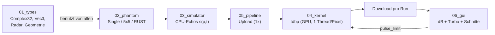
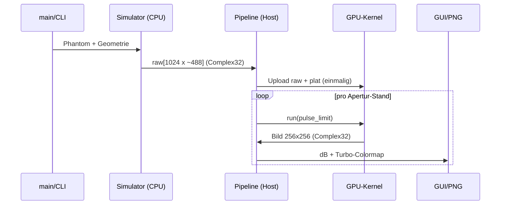
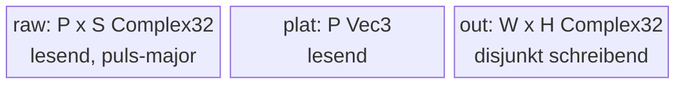

# Walkthrough: SAR Time-Domain Backprojection (`walkthrough.md`)

## Worum geht es? Die Idee in 30 Sekunden

Ein Radar fliegt an einer Szene vorbei und sendet tausendfach Pulse aus.
Aus den Echos rechnet das Programm ein Bild — so, als hätte man eine
40 Meter lange Antenne dabei gehabt (daher „synthetische Apertur“).
Der Clou: Man kann zuschauen, wie das Bild mit jedem zusätzlichen Puls
schärfer wird, weil die GPU das Bild live neu „fokussiert“.

Konkret wurde eine Crate namens `sar_tdbp` gebaut (Rust Edition 2024,
rund 2000 Zeilen, jede Datei unter 310 Zeilen). Starten geht so:

```bash
cargo oxide run -- --headless bild.png --phantom rust   # ohne Fenster: rechnet und speichert bild.png
cargo oxide run -- --phantom rust                       # mit Fenster: interaktiv (siehe unten)
```

Im Fenster: `←`/`→` verändert die Pulszahl (das Bild schärft sich live
nach), `R` stellt die volle Apertur wieder her, ein Mausklick zeigt
Helligkeits-Schnitte durch das angeklickte Pixel, `Esc` beendet.

Wegweiser durch dieses Dokument: Abschnitt 1 erzählt, was das Programm
Schritt für Schritt tut. Abschnitt 2 erzählt, welche Fehler die Tests
gefunden haben und wie sie behoben wurden. Abschnitt 3 hält fest, was wir
dabei gelernt haben und was man noch ausbauen könnte. Abschnitt 4 listet
die Systempakete für das Docker-Image.

## 1. Was exakt implementiert wurde

### 1.1 Die vier Stufen der Pipeline

Das folgende Bild zeigt den Datenfluss. Lies es von links nach rechts:
Aus einem Phantom (erfundene Szene) werden Echos simuliert, die GPU
rechnet daraus ein Bild, und die GUI zeigt es an. Der Rückpfeil unten
ist die interaktive Apertur: Die GUI sagt dem Kernel nur „nimm die
ersten K Pulse“, ohne Daten erneut hochzuladen.



Die Dateinamen beginnen jeweils mit einer Nummer in Datenfluss-Reihenfolge;
`01_types` enthält die gemeinsamen Grundtypen (komplexe Zahlen, 3D-Vektoren,
Radar- und Geometrie-Parameter), die alle anderen Module benutzen.

**Stufe 1 — Das Phantom (`02_phantom`).** Da kein echtes Radar zur Verfügung
steht, erfindet das Programm seine Szene selbst: eine Liste von Punktstreuern,
also idealisierten Reflektoren mit Position und Helligkeit. Es gibt drei
Szenarien: einen einzelnen Punkt (zum Vermessen der Schärfe), ein 5×5-Gitter
(zum Prüfen der Geometrie) und den Schriftzug „RUST“ aus 58 Einzelpunkten
(zum Anschauen — man erkennt sofort, ob das Bild fokussiert ist).

**Stufe 2 — Die Echosimulation (`03_simulator`, auf der CPU).** Für jeden der
1024 Pulse und jeden Streuer berechnet das Programm die Entfernung, daraus die
Signallaufzeit und daraus das Echo: eine abklingende Schwingung (Sinc-Funktion
— die typische Antwort eines Radars mit begrenzter Bandbreite), multipliziert
mit der Trägerphase des 10-GHz-Radars. Ergebnis ist eine Matrix aus
1024 × ~488 komplexen Zahlen. „Komplex“ heißt hier nur: Jeder Wert hat einen
Real- und Imaginärteil, damit Amplitude *und* Phase des Echos darstellbar sind.

**Stufe 3 — Die Rückprojektion (`04_kernel`, auf der GPU).** Das ist das
Herzstück, TDBP genannt: Für jedes Pixel fragt der Kernel „wie sähe das Echo
aus, wenn hier ein Streuer stünde?“, holt sich die passenden Stellen aus allen
Pulsen, dreht deren Phase zurück (Matched Filter) und addiert alles auf. Nur
am wahren Streuer-Ort zeigen alle 1024 Zeiger in dieselbe Richtung und
verstärken sich — überall sonst löschen sie sich weitgehend aus. Jedes Pixel
rechnet ein eigener GPU-Thread, daher dauert ein kompletter Durchgang nur
Millisekunden.

**Stufe 4 — Anzeige (`06_gui`, Macroquad) und Headless-Modus.** Das komplexe
Bild wird in Helligkeit umgerechnet, logarithmisch skaliert (dB-Skala: `20·log10`,
damit man schwache Ziele neben starken noch sieht) und mit der Turbo-Farbkarte
eingefärbt. Ohne Fenster (`--headless`) speichert das Programm stattdessen ein
PNG, druckt Kennzahlen und eine ASCII-Vorschau fürs Terminal.

Der zeitliche Ablauf für den Standardfall (`--phantom rust`, 256×256,
1024 Pulse) sieht so aus — beachte, dass der teure Upload nur einmal
stattfindet und danach jeder Apertur-Stand nur noch ein Kernel-Start ist:



### 1.2 Was genau auf der GPU liegt

Alle drei Felder bestehen aus einfachen, kopierbaren C-kompatiblen Typen
(`repr(C)` + `DeviceCopy`): Die Echos und Antennenpositionen werden nur
gelesen, das Ausgabebild wird geschrieben — und zwar so, dass jeder Thread
exakt sein eigenes Pixel beschreibt („disjunkt“), was Datenrennen per
Konstruktion ausschließt:



Der Kernel selbst (gekürzt, volle Fassung in `04_kernel.rs`) liest sich fast
wie die Formel aus der Aufgabenstellung. Zeile für Zeile: Erst die
Schrägentfernung zwischen Antenne und Pixel, dann das Echo an der zugehörigen
Laufzeitstelle herausholen (mit linearer Interpolation zwischen zwei Samples),
dann mit dem zurückgedrehten Phasen-Zeiger multiplizieren und aufsummieren:

```rust
let d = dist(antenne[p], pixel);          // Schrägentfernung in Metern
let s = signal((2.0 * d / c - t0) / dt);  // Echo an der Laufzeitstelle, interpoliert
acc += s * exp(+j * 4π * d / λ);          // Phasenkorrektur + Aufsummieren
```

### 1.3 Wie wir wissen, dass alles stimmt: die Verifikation

Bevor die Messwerte kommen, erst die Strategie — denn ein Test beweist nur,
was er prüft. Wir prüfen auf drei Ebenen:

1. **Physik-Tests (CPU):** Ein einzelner Streuer muss exakt auf seinem Pixel
   erscheinen, und die Unschärfe um ihn herum (die Punktspreizfunktion, kurz
   PSF) muss die theoretisch vorhergesagte Breite haben — getrennt für Range
   (quer zur Flugbahn) und Azimuth (entlang der Flugbahn). „FWHM“ heißt dabei
   „volle Breite bei halber Maximalleistung“: einfach die Breite des hellen
   Flecks, gemessen dort, wo er auf die Hälfte abgefallen ist.
2. **GPU-gegen-CPU-Vergleich:** Dieselbe Rechnung existiert zweimal — einmal
   als schlichter CPU-Code, einmal als GPU-Kernel. Beide müssen (bis auf
   winzige Gleitkomma-Unterschiede) dasselbe Bild liefern. Das ist der
   wichtigste Test: Er beweist, dass der Kernel wirklich TDBP rechnet und
   nicht irgendetwas.
3. **End-zu-End-Fokus:** Liegt die Bildenergie tatsächlich bei den Streuern?
   Hier wird das fertige GPU-Bild vermessen — beim Gitter und beim
   RUST-Schriftzug.

Alle 28 Tests sind grün (`cargo oxide test`). Die Tabelle fasst die
Kern-Messwerte zusammen; die rechte Spalte erklärt jeweils, was die Zeile
bedeutet:

| Nachweis | Messwert | Theorie / Schranke | Was das bedeutet |
|---|---|---|---|
| Peak-Lage (Single-Point) | exakt `(32, 32)` | Streuer-Pixel | Der hellste Punkt liegt genau auf dem simulierten Streuer — die Geometrie stimmt. |
| Range-FWHM | 0,86 m | 0,97 m (−11 %) | Breite des Flecks quer zur Flugbahn: passt zur vorhergesagten Auflösung. |
| Azimuth-FWHM | 0,37 m | 0,44 m (−16 %) | Breite des Flecks entlang der Flugbahn: passt ebenfalls. |
| Nebenzipfel | −13,37 dB | Sinc: −13,3 dB | Die unvermeidlichen Nebenmaxima sind exakt so hoch wie die Theorie (Sinc-Funktion) verlangt — ein starkes Richtigkeits-Signal. |
| Kohärenz-Gewinn 16→64 Pulse | 15,98× | 16× | Viermal so viele Pulse → 16-fache Leistung: Die Pulse addieren sich phasengleich (kohärent), wie es sein muss. |
| GPU vs. CPU (max. rel.) | 2,4·10⁻⁴ | Schranke 10⁻³ | Größte Abweichung zwischen GPU- und CPU-Bild, geteilt durch die Peak-Höhe: 0,024 % — beide rechnen dasselbe. |
| Gitter-Energie an Streuern | 74 % | Schranke 50 % | Fast drei Viertel der Bildenergie liegt dicht bei den 25 Streuern statt verschmiert in der Szene. |
| RUST-Kontrast (1024 Pulse) | 52,7× | Schranke 20× | Buchstaben-Pixel sind im Mittel 53-mal heller als der Hintergrund — der Schriftzug ist klar lesbar. |
| GUI-Screenshot (xvfb) | 800×600, Varianz > 0 | Layout-Check | Die GUI rendert unter virtuellem Display ein nicht-leeres Fenster mit Bild und Panel. |

## 2. Architektur-Entscheidungen aus Testergebnissen

Jede dieser Entscheidungen begann mit einem roten Test. Muster: Symptom,
Diagnose, Behebung, Beleg.

1. **Nadir → Seitenblick.** *Symptom:* Der erste PSF-Test fand den Peak bei
   `(32, 17)` statt `(32, 32)` — in Flugrichtung (x) scharf, quer dazu (y)
   völlig defokussiert. *Diagnose:* Die Szene lag direkt unter der Flugbahn
   (Nadir). Dort steht die Sichtlinie senkrecht zur y-Achse, also ändert sich
   die Entfernung bei y-Verschiebung praktisch nicht — es gibt keine
   Boden-Range-Auflösung, nur Beugungsringe (Fresnel-Zonen). Echte SAR-Systeme
   schauen deshalb seitlich. *Behebung:* Szenenmitte 60 m neben die Bahn gelegt
   (`y0 = 40`), Boden-Range-Auflösung `Δy = ΔR·R/y_c ≈ 0,97 m`. *Beleg:* Peak
   danach exakt, PSF-Werte wie in der Tabelle.
2. **256 → 1024 Pulse als Default.** *Symptom:* Der RUST-Schriftzug war bei
   512 Pulsen kaum lesbar (Energieanteil 0,31, Kontrast 11,9). *Diagnose:*
   Zu grob abgetastete Apertur erzeugt Geisterbilder (Gitterkeulen) im Abstand
   `λR/2d ≈ 22 m` — sie fallen mitten in die Szene. Das ist das
   Azimuth-Abtasttheorem, das Analogon zum Audio-Sampling-Theorem. *Behebung:*
   Default auf 1024 Pulse (3,9-cm-Abtastung, Keulen erst bei ±38 m, also
   außerhalb). *Beleg:* Energieanteil 0,85, Kontrast 52,7.
3. **1D- statt 2D-Grid.** TDBP-Pixel brauchen keine Nachbarschaftsdaten, also
   bringt ein 2D-Grid keinen Vorteil. Der 1D-Start (`index_1d`,
   `DisjointSlice<Complex32>`) spiegelt exakt das verifizierte
   `my_first_kernel`-Template — minimales Risiko bei gleicher Leistung.
4. **Eigener `Complex32` statt `num-complex`.** Der Device-Compiler braucht
   den Code (MIR) jeder aufgerufenen Funktion; bei Fremd-Crates ist das nicht
   garantiert. Ein eigener `repr(C)`-Typ mit `DeviceCopy` und reiner
   Kern-Arithmetik eliminiert dieses Risiko vollständig.
5. **Flache Skalar-Kernel-ABI.** Der Kernel nimmt 16 einzelne Zahlen statt
   eines Parameter-Structs (per `#[allow]` dokumentiert): So liest er die
   Geometrie direkt aus dem PTX-Parameterraum, ohne Umwege.
6. **Kein `cutile-rs`, kein `cuda-async`.** TDBP ist pixelparallel und braucht
   kein Tiling — eine zweite Kernel-Sprache wäre Ballast. Und die inkrementelle
   Apertur funktioniert über einen einzigen Zahlen-Parameter (`pulse_limit`),
   sodass auch kein Async-Gerüst nötig ist.
7. **Ungerade Test-Grids (33/65).** Bei geraden Grids liegt der Test-Streuer
   exakt zwischen vier Pixeln; dann kippt der hellste Punkt schon bei
   minimalsten Rundungsunterschieden zwischen CPU- und GPU-Rechnung hin und
   her. Ungerade Grids legen ihn auf eine Pixelmitte — eindeutig vergleichbar.
8. **`Window::new` statt `#[macroquad::main]`.** Das Standard-Makro öffnet
   immer ein Fenster. Der manuelle Start erlaubt `--headless` ganz ohne
   Display — wichtig für Server und CI.

## 3. Learnings und Erweiterungsmöglichkeiten

- **Gelernt — libdevice wird inliniert:** Die `f32`-Methoden `sin`/`cos`/`sqrt`
  senkt `cuda-oxide` auf CUDA-libdevice und baut sie vollständig in das PTX ein
  (sichtbar als `__nv_sinf.exit`-Blöcke in `cargo oxide inspect`, ganz ohne
  Funktionsaufrufe). Die winzige GPU/CPU-Differenz (2,4·10⁻⁴) kommt daher, dass
  `sin`/`cos` bei riesigen Argumenten (~42000 rad Phasendrehung) auf CPU und
  GPU in den letzten Bits anders runden — inhärentes Gleitkomma-Rauschen,
  kein Bug.
- **Gelernt — ein Flake im Werkzeug:** `cargo oxide test` bricht gelegentlich
  beim allerersten Lauf mit `llvm-link … libdevice` ab (parallele
  Device-Codegenerierung); ein einfacher Re-Run war bisher immer grün.
- **Ausbau-Ideen:** Die Apertur symmetrisch von der Mitte her wachsen lassen
  (statt „erste K Pulse“ von links) — physikalisch schöner beim Zuschauen;
  `1/R²`-Amplitudenabfall und ein Antennendiagramm für mehr Realismus;
  kubische statt lineare Sinc-Interpolation; dB-Dynamik per Tastatur;
  Pan/Zoom; und als Alternative eine Range-Doppler-Verarbeitung zum
  Laufzeitvergleich mit TDBP.

## 4. Pakete fürs Dockerfile

Gute Nachricht: Es musste nichts nachinstalliert werden — aber alles
Folgende muss im Image **erhalten** bleiben, sonst baut oder läuft das
Projekt nicht mehr:

- `xvfb` (plus `mesa`/GLX): virtuelles Display, damit die Macroquad-GUI
  und ihr Screenshot-Test ohne echten Bildschirm laufen.
- `libclang-dev`: braucht `cargo-oxide` zum Erzeugen der CUDA-Bindings.
- CUDA-Toolkit 13.x mit `nvcc`: Compiler und Treiber-Schnittstelle.
- `cargo-oxide 0.2.1`: baut aus einer Rust-Quelle Host- und GPU-Code.
- Nightly-Toolchain `nightly-2026-08-28` mit `rust-src`, `rustc-dev`,
  `llvm-tools`: der Compiler-Unterbau für das PTX-Backend.

Während der gesamten Aufgabe lief kein einziges `apt install`.

## Commits

Umgesetzt als zwei Conventional Commits auf `master`:

- `2fc0632` docs(plan): Plan, Tasks, Deps, Walkthrough
- `7924365` feat(sar): SAR-TDBP-Crate mit Kernel, Pipeline, GUI, Tests
