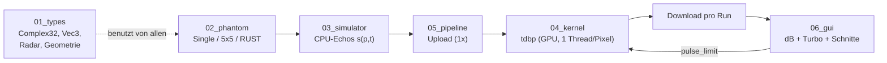
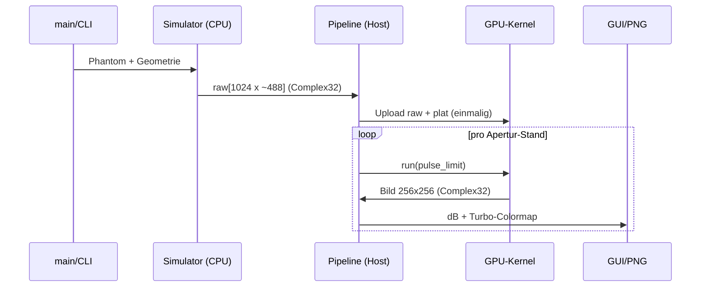
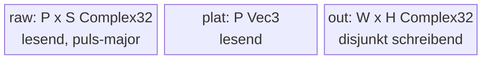

# Walkthrough: SAR Time-Domain Backprojection (`walkthrough.md`)

Interaktive SAR-Simulation mit GPU-Fokussierung: Vom diskreten Phantom über
synthetische Radar-Echos und Time-Domain Backprojection (TDBP) auf der
RTX A4000 bis zum live nachfokussierenden Radarbild in Macroquad.

Kurzes Begriffsglossar: **TDBP** — Bildgebung durch phasenrichtige Rückprojektion
jedes Echos auf jedes Pixel; **PSF** (Punktspreizfunktion) — Antwort des Systems
auf einen einzelnen Punktstreuer, bestimmt Schärfe und Nebenzipfel;
**Range** — Entfernung quer zur Flugbahn; **Azimuth** — Richtung entlang der
Flugbahn; **Sidelobes/Nebenzipfel** — helle Ringe/Streifen neben echten Zielen;
**Gitterkeulen** — Geisterbilder bei zu grober Puls-Abtastung;
**Matched Filter** — Korrelation mit dem erwarteten Signal (hier: Zurückdrehen
der Trägerphase); **dB-Skala** — logarithmische Darstellung (`20·log10`),
damit schwache Ziele neben starken sichtbar bleiben.

## 1. Was exakt implementiert wurde

Crate `sar_tdbp` (Rust Edition 2024, ~2000 Zeilen, jede Datei < 310 Zeilen),
gebaut und getestet mit `cargo oxide` (Host + PTX aus einer Quelle).



**Pipeline im Detail** (`--phantom rust`, 256×256, 1024 Pulse):



**GPU-Memory-Layout** (alles `DeviceCopy`, `repr(C)`):



Der Kernel (`04_kernel.rs`, 1D-Grid, `LaunchConfig1D`, `#[launch_contract]`):

```rust
let d = dist(antenne[p], pixel);      // Schrägentfernung
let s = signal((2.0 * d / c - t0) / dt); // Range-Interpolation
acc += s * exp(+j * 4π * d / λ);       // Matched Filter
```

**Verifikation (alle 28 Tests grün, `cargo oxide test`):**

| Nachweis | Messwert | Theorie |
|---|---|---|
| Peak-Lage (Single-Point) | exakt `(32, 32)` | Streuer-Pixel |
| Range-FWHM | 0,86 m | 0,97 m (−11 %) |
| Azimuth-FWHM | 0,37 m | 0,44 m (−16 %) |
| Nebenzipfel | −13,37 dB | Sinc: −13,3 dB |
| Kohärenz-Gewinn 16→64 Pulse | 15,98× | 16× |
| GPU vs. CPU (max. rel.) | 2,4·10⁻⁴ | Schranke 10⁻³ |
| Gitter-Energie an Streuern | 74 % | Schranke 50 % |
| RUST-Kontrast (1024 Pulse) | 52,7× | Schranke 20× |
| GUI-Screenshot (xvfb) | 800×600, Varianz > 0 | Layout-Check |

Bedienung: `--headless bild.png` (PNG + Kennzahlen + ASCII-Vorschau),
GUI mit `←/→` (Apertur live), `R` (volle Apertur), Mausklick
(Range-/Azimuth-Schnitt mit −3-dB-Linie), `Esc` (Ende).

## 2. Architektur-Entscheidungen aus Testergebnissen

1. **Nadir → Seitenblick.** Erster PSF-Test: Peak bei `(32, 17)` statt
   `(32, 32)` — direkt unter der Flugbahn steht die Sichtlinie senkrecht zur
   y-Achse, es gibt keine Boden-Range-Auflösung (nur Fresnel-Ringe). Fix:
   Szenenmitte 60 m neben der Bahn (`y0 = 40`), Boden-Range
   `Δy = ΔR·R/y_c ≈ 0,97 m`. Danach Peak exakt, PSF-Werte wie oben.
2. **256 → 1024 Pulse (Default).** RUST-Sonde bei 512 Pulsen: Energieanteil
   0,31, Kontrast 11,9 — Gitterkeulen (Abstand `λR/2d ≈ 22 m`) fallen in die
   Szene. Bei 1024 Pulsen (3,9-cm-Abtastung, Keulen bei ±38 m): 0,85 / 52,7.
   Der Default erfüllt damit das Azimuth-Abtasttheorem.
3. **1D- statt 2D-Grid.** TDBP braucht keine Nachbarschaftswiederverwendung;
   1D-Launch (`index_1d`, `DisjointSlice<Complex32>`) spiegelt exakt das
   verifizierte `my_first_kernel`-Template — minimales Risiko, gleiche Leistung.
4. **Eigener `Complex32` statt `num-complex`.** Device-Code braucht MIR aller
   aufgerufenen Funktionen; ein `repr(C)`-Eigen­typ mit `DeviceCopy` und nur
   Kern-Arithmetik eliminiert jedes Fremd-Crate-Risiko im Kernel.
5. **Flache Skalar-Kernel-ABI** (16 Parameter, per `#[allow]` dokumentiert)
   statt Parameter-Struct: direkte PTX-Parameternutzung ohne Deserialisierung.
6. **Kein `cutile-rs`, kein `cuda-async`.** TDBP ist pixelparallel ohne
   Tiling-Bedarf; ein Stream + `pulse_limit`-Parameter erfüllt die inkrementelle
   Apertur ohne zweite Kernel-Sprache und ohne Async-Overhead.
7. **Ungerade Test-Grids** (33/65): Bei geraden Grids liegt der Single-Point
   zwischen 4 Pixeln und der Argmax kippt zwischen CPU/GPU-Rechnung.
8. **`Window::new` statt `#[macroquad::main]`.** Das Makro öffnet immer ein
   Fenster; der manuelle Start erlaubt `--headless` ohne Display.

## 3. Learnings und Erweiterungen

- **Gelernt:** `f32`-`sin`/`cos`/`sqrt` werden auf libdevice gesenkt und
  vollständig in das PTX inliniert (`__nv_sinf.exit`-Blöcke, keine Calls);
  `cargo oxide inspect` zeigt das sofort. Die GPU/CPU-Differenz (2,4·10⁻⁴)
  stammt aus der Fehlerverstärkung von `sin`/`cos` bei großen Argumenten
  (~42000 rad) — inhärentes Float-Rauschen, kein Bug.
- **Flake:** `cargo oxide test` bricht gelegentlich beim allerersten Lauf mit
  `llvm-link … libdevice` ab (parallele Device-Codegen); ein simpler Re-Run
  war bisher immer grün.
- **Erweiterungen:** Apertur symmetrisch von der Mitte wachsen lassen
  (statt erste-K-Pulse); `1/R²`-Amplitude und Antennendiagramm; feinere
  Sinc-Interpolation (kubisch); dB-Dynamik per Tastatur; Pan/Zoom; als
  Alternative Range-Doppler-Verarbeitung zum Laufzeitvergleich.

## 4. Pakete fürs Dockerfile

Keine Nachinstallation war nötig — alles war im Image vorhanden und muss dort
**erhalten** bleiben: `xvfb` (+ `mesa`/GLX für Macroquad unter Xvfb),
`libclang-dev` (für `cargo-oxide`/Bindgen), CUDA-Toolkit 13.x mit `nvcc`,
`cargo-oxide 0.2.1` und die Nightly-Toolchain `nightly-2026-08-28`
(`rust-src`, `rustc-dev`, `llvm-tools`). Kein `apt install` während der Aufgabe.

## Vorgeschlagene Commits (nicht ausgeführt)

Commits wurden bewusst nicht erstellt (kein expliziter Auftrag); bei Bedarf:

- `feat(types,phantom): SAR-Grundtypen, Geometrie, Phantome`
- `feat(sim): range-komprimierte Echo-Simulation + CPU-TDBP mit PSF-Nachweis`
- `feat(cuda): TDBP-Kernel, Pipeline, Headless-Modus (GPU≡CPU 2.4e-4)`
- `feat(gui): Macroquad-UI mit Apertur-Animation, Schnitten, xvfb-Test`
- `docs: Plan/Task/Walkthrough, clippy-sauber, Deps aktuell`
