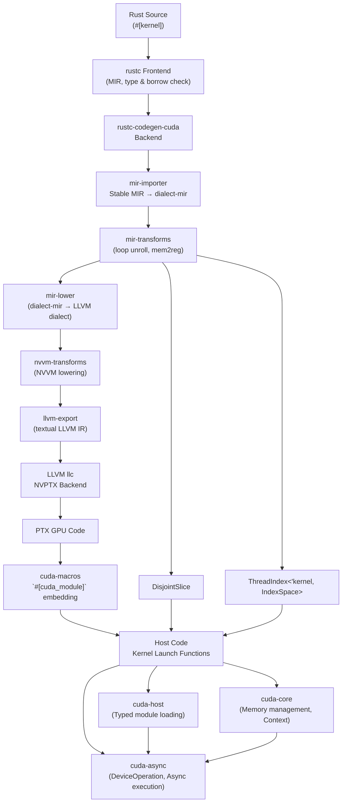

# NVIDIA/cuda-rust

## GitHub & DeepWiki
- GitHub: https://github.com/NVIDIA/cuda-rust
- DeepWiki: https://deepwiki.com/NVIDIA/cuda-rust

## Kurze Einführung
`cuda-oxide` ist ein benutzerdefiniertes `rustc`-Backend, das die Kompilierung von GPU-Kerneln in reinem Rust ermöglicht. Es bietet eine Single-Source-Kompilierung, bei der Host- und Gerätecode in derselben Datei liegen, und nutzt ein Rust-natives Kompilierungs-Pipeline, um `#[kernel]`-Funktionen in CUDA PTX zu übersetzen. Das Projekt zielt darauf ab, die Entwicklung von CUDA-Kerneln für Rust-Entwickler ergonomisch und sicher zu gestalten, indem es Rusts Typsystem und interne `rustc`-Mechanismen nutzt.   <cite repo="NVIDIA/cuda-rust" path="cuda-oxide/cuda-oxide-book/compiler/architecture-overview.md" start="1-113" end="1-113" />

## Die 3 wichtigsten (oder komplexesten) Algorithmen

### 1. `rustc-codegen-cuda` (Benutzerdefiniertes `rustc`-Codegen-Backend)
1.  **Name & Verortung im Code**: `rustc-codegen-cuda` ist ein Crate im Verzeichnis `cuda-oxide/crates/rustc-codegen-cuda/` . Es implementiert das `CodegenBackend`-Trait von `rustc` .
2.  **Detaillierte technische Funktionsweise**: Dieses Backend fängt die `codegen_crate()`-Phase von `rustc` ab . Es identifiziert Funktionen, die mit `#[kernel]` annotiert sind, indem es nach einem reservierten Namensschema sucht . Anschließend durchläuft es den MIR-Aufrufgraphen, um alle transitiv erreichbaren Gerätefunktionen zu sammeln . Der gesammelte MIR wird dann durch die `cuda-oxide`-Pipeline geleitet, die ihn in `dialect-mir` übersetzt, Optimierungen wie `mem2reg` und Loop-Unrolling anwendet, in LLVM IR umwandelt und schließlich PTX-Code mit `llc` kompiliert . Der Host-Code wird vom Standard-LLVM-Backend verarbeitet .
3.  **"Warum prägend"**: Dieser Algorithmus ist prägend, da er die Single-Source-Kompilierung ermöglicht, bei der Host- und Gerätecode in derselben Rust-Datei koexistieren . Dies vereinfacht den Entwicklungsprozess erheblich, da keine separaten Toolchains oder DSLs erforderlich sind und Rusts Typsystem und Generics nahtlos für GPU-Code genutzt werden können .

### 2. `DisjointSlice<T, IndexSpace>` und `ThreadIndex` (Sicherheitsmodell für parallele Schreibvorgänge)
1.  **Name & Verortung im Code**: `DisjointSlice<T, IndexSpace>` und `ThreadIndex<'kernel, IndexSpace>` sind Typen, die im Crate `cuda-device` definiert sind  .
2.  **Detaillierte technische Funktionsweise**: `ThreadIndex` ist ein undurchsichtiger Zeuge, der einen `usize`-Wert kapselt und nur über vertrauenswürdige Funktionen wie `index_1d` oder `index_2d` aus Hardware-Built-in-Variablen (z.B. `threadIdx`, `blockIdx`) abgeleitet werden kann . Es ist `!Send + !Sync + !Copy + !Clone`, um die Übertragung zwischen Threads oder das Überleben außerhalb des Kernel-Scopes zu verhindern . `DisjointSlice<T, IndexSpace>` ist ein Slice-ähnlicher Typ, dessen `get_mut()`-Methode nur einen `ThreadIndex` akzeptiert, dessen `IndexSpace` mit seinem eigenen übereinstimmt . Dies stellt sicher, dass jeder Thread nur auf sein eigenes Element zugreifen kann, wodurch Datenkonflikte bei parallelen Schreibvorgängen vermieden werden .
3.  **"Warum prägend"**: Dieses System ist entscheidend für die Sicherheit von GPU-Kerneln in Rust . Es erweitert Rusts Ownership- und Borrowing-Regeln auf den Gerätecode und ermöglicht so datenkonfliktfreie parallele Schreibvorgänge durch Typsicherheit und Kompilierzeitprüfungen . Dies ist ein Kernbestandteil des Tier-1-Sicherheitsmodells von `cuda-oxide` .

### 3. `DeviceOperation` (Asynchrones Ausführungsmodell)
1.  **Name & Verortung im Code**: `DeviceOperation` ist ein Typ, der im Crate `cuda-async` definiert ist .
2.  **Detaillierte technische Funktionsweise**: `DeviceOperation` repräsentiert eine faule, zusammensetzbare Beschreibung von GPU-Arbeit (z.B. Allokation, Kernel-Launch, Datentransfer) . Die Ausführung erfolgt erst, wenn `.sync()` oder `.await` aufgerufen wird . Wenn ein `DeviceOperation` `await`et wird, wird es zu einem `DeviceFuture`, das Rusts `std::future::Future` implementiert . Beim ersten Poll wird die GPU-Arbeit an den Stream übermittelt und ein `cuLaunchHostFunc`-Callback in denselben Stream eingereiht . Wenn die GPU die Arbeit beendet, wird der Host-Callback auf einem Treiber-Thread aufgerufen, der ein `AtomicBool`-Flag setzt und den `AtomicWaker` der Aufgabe weckt . Beim zweiten Poll erkennt das Future das Flag und gibt `Poll::Ready` zurück .
3.  **"Warum prägend"**: Dieses Modell ermöglicht eine effiziente asynchrone GPU-Ausführung, ohne dass Host-Threads während der GPU-Arbeit blockiert werden . Es erlaubt die Komposition von GPU-Arbeit als Graphen und die Nutzung von Rusts `async`/`await`-Syntax für GPU-Operationen, was die Entwicklung komplexer, nebenläufiger GPU-Anwendungen vereinfacht .

## Architektur & Zusammenspiel

        

Die Architektur von `cuda-oxide` basiert auf einer mehrschichtigen Kompilierungspipeline, die Rust-Quellcode in ausführbaren PTX-Code für NVIDIA-GPUs umwandelt .

1.  **Rust Source (`#[kernel]`)**: Der Prozess beginnt mit Rust-Quellcode, der `#[kernel]`-Funktionen enthält, die GPU-Einstiegspunkte markieren .
2.  **`rustc` Frontend**: Der `rustc`-Frontend verarbeitet den Rust-Code, führt Typ- und Borrow-Checks durch und generiert den Mid-level IR (MIR) .
3.  **`rustc-codegen-cuda` Backend**: Das benutzerdefinierte `rustc-codegen-cuda`-Backend fängt den Kompilierungsprozess ab . Es trennt Gerätecode von Host-Code .
4.  **`mir-importer`**: Dieser Crate übersetzt den Stable MIR in `dialect-mir`, eine pliron-Dialekt-Darstellung von Rust MIR  .
5.  **`mir-transforms`**: Hier werden Optimierungspässe wie Loop-Unrolling und `mem2reg` auf den `dialect-mir` angewendet  .
6.  **`mir-lower`**: Dieser Schritt wandelt den `dialect-mir` in den LLVM-Dialekt um  .
7.

Wiki pages you might want to explore:
- [Overview (NVIDIA/cuda-rust)](/wiki/NVIDIA/cuda-rust#1)
- [cuda-oxide: Rust-to-PTX Compiler and Runtime (NVIDIA/cuda-rust)](/wiki/NVIDIA/cuda-rust#3)

View this search on DeepWiki: https://deepwiki.com/search/zielrepository-nvidiacudarust_96480e19-9ec7-4fae-99d4-cb7ffa30b4d7
