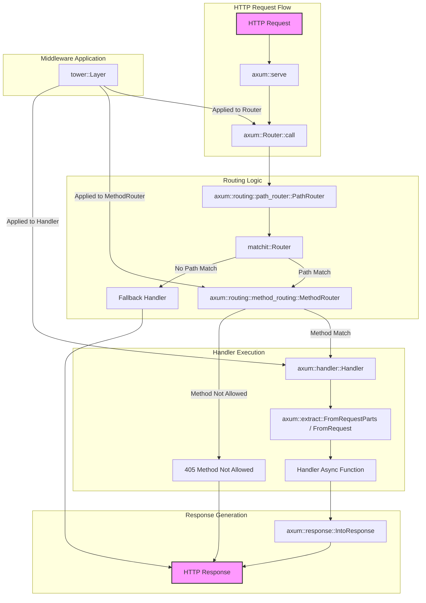
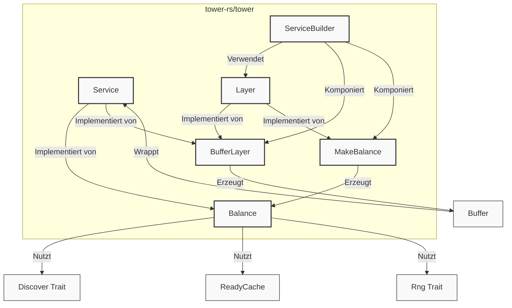
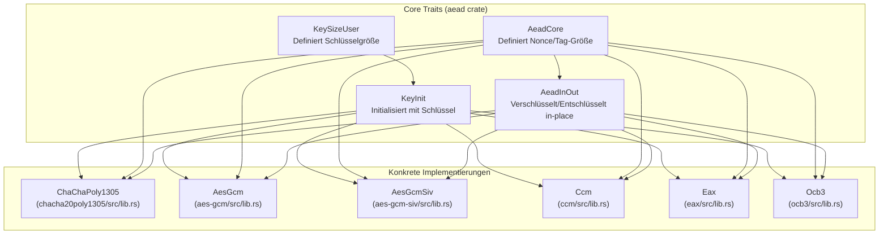
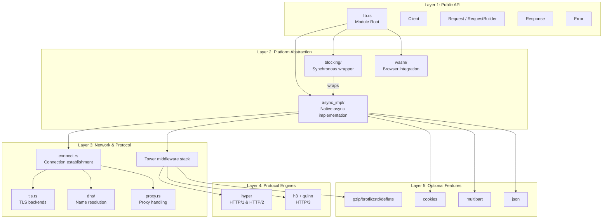
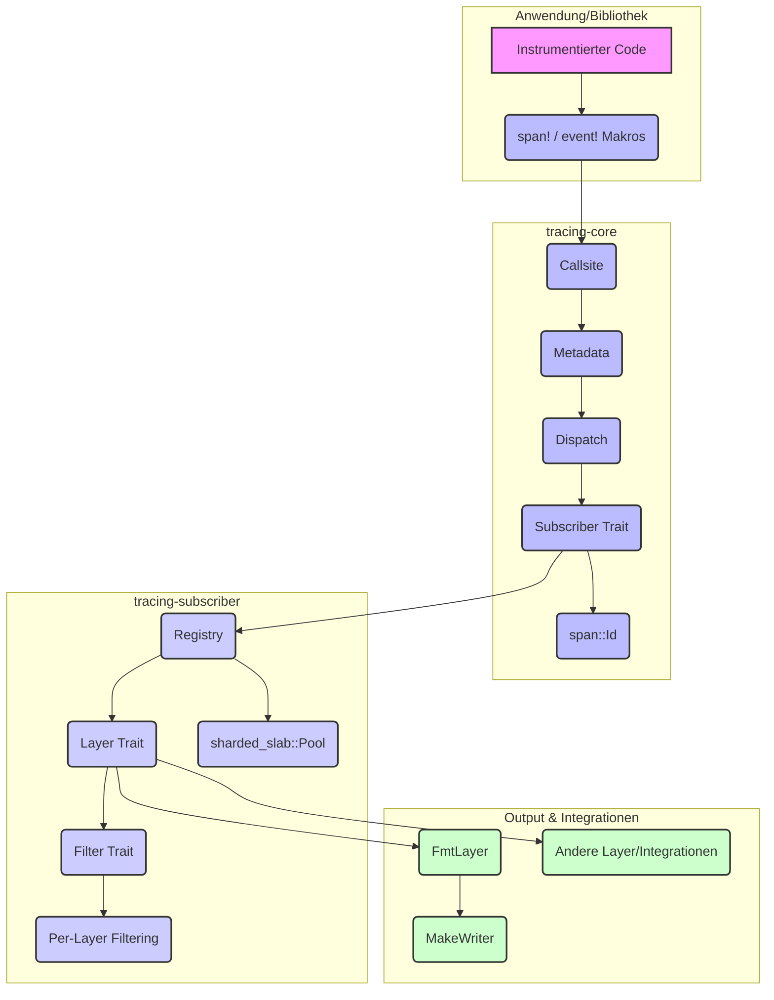

# tokio-rs/axum

## GitHub & DeepWiki
- GitHub: https://github.com/tokio-rs/axum
- DeepWiki: https://deepwiki.com/tokio-rs/axum

## Kurze Einführung
`axum` ist eine Web-Framework-Bibliothek für Rust, die auf `tokio` und `hyper` aufbaut und sich auf Ergonomie und Modularität konzentriert. Sie ermöglicht das Routing von HTTP-Anfragen zu asynchronen Handlern und die deklarative Verarbeitung von Anfragen mittels Extractor. Ein wesentliches Merkmal ist die Integration mit dem `tower`-Ökosystem, das Middleware für Funktionen wie Tracing, Komprimierung und Autorisierung bereitstellt.  

## Die 3 wichtigsten (oder komplexesten) Algorithmen

### 1. Routing-Algorithmus (`PathRouter` und `matchit`)
1.  **Name & Verortung im Code**: Der zentrale Routing-Algorithmus ist in `axum::routing::path_router::PathRouter` implementiert und nutzt die externe Bibliothek `matchit` für das Pfad-Matching.  
2.  **Detaillierte technische Funktionsweise**: `PathRouter` verwaltet eine Sammlung von Endpunkten und einen `matchit::Router`, der als Radix-Baum implementiert ist.  Eingehende Anfragen werden anhand ihres Pfades gegen diesen Baum abgeglichen, um den passenden `RouteId` zu finden.  Dies ermöglicht das Matching von statischen Pfaden, Pfad-Parametern (z.B. `/{id}`) und Wildcard-Pfaden (z.B. `/{*path}`). 
3.  **"Warum prägend"**: Dieser Algorithmus ist entscheidend für die Performance und Flexibilität von `axum`. Durch die Verwendung eines Radix-Baums bietet `matchit` eine effiziente Pfad-Matching-Leistung, die mit der Anzahl der Routen skaliert.  Die Unterstützung verschiedener Pfad-Segment-Typen ermöglicht es Entwicklern, komplexe Routing-Strukturen einfach zu definieren. 

### 2. Handler-Ausführung und Extractor-System
1.  **Name & Verortung im Code**: Die Handler-Ausführung wird durch das `Handler`-Trait in `axum::handler::Handler` definiert, und das Extractor-System basiert auf den Traits `FromRequest` und `FromRequestParts`.  
2.  **Detaillierte technische Funktionsweise**: Handler sind asynchrone Funktionen, die das `Handler`-Trait implementieren.  Vor der Ausführung eines Handlers werden die Argumente der Funktion durch Extractor-Implementierungen aus der eingehenden `Request` extrahiert.  Extractor können Teile der Anfrage (z.B. Header, Pfadparameter) oder den gesamten Body konsumieren.  Nach der Ausführung des Handlers wird der Rückgabewert, der `IntoResponse` implementiert, in eine HTTP-Antwort umgewandelt. 
3.  **"Warum prägend"**: Dieses System fördert eine deklarative und typsichere Art der Anfragenverarbeitung. Entwickler können sich auf die Geschäftslogik konzentrieren, während `axum` die Details der HTTP-Anfrage-Deserialisierung und -Validierung übernimmt.  Dies reduziert Boilerplate-Code und verbessert die Wartbarkeit.

### 3. Middleware-Integration mit `tower::Service`
1.  **Name & Verortung im Code**: `axum` integriert sich direkt mit dem `tower`-Ökosystem, wobei `tower::Service` das Kern-Trait für Middleware darstellt.  Middleware kann auf `Router`s, `MethodRouter`s oder einzelne Handler angewendet werden. 
2.  **Detaillierte technische Funktionsweise**: `axum` selbst implementiert kein eigenes Middleware-System, sondern nutzt die `tower::Layer`- und `tower::Service`-Traits.  Eine `Layer` ist ein Factory-Trait, das einen `Service` um einen anderen `Service` wickelt, um zusätzliche Funktionalität hinzuzufügen.  Die Reihenfolge der Middleware-Anwendung ist wichtig und kann entweder von "unten nach oben" (bei einzelnen `layer`-Aufrufen) oder "oben nach unten" (bei Verwendung von `tower::ServiceBuilder`) erfolgen. 
3.  **"Warum prägend"**: Diese Integration ist ein Alleinstellungsmerkmal von `axum`. Sie ermöglicht den Zugriff auf eine reiche Auswahl an bestehender `tower`- und `tower-http`-Middleware für Aufgaben wie Tracing, CORS, Komprimierung und Timeouts, ohne dass `axum` diese selbst implementieren muss.  Dies fördert die Wiederverwendbarkeit und reduziert den Entwicklungsaufwand.

## Architektur & Zusammenspiel


    

## Notes
`axum` legt großen Wert auf ein einfaches und vorhersehbares Fehlerbehandlungsmodell, bei dem Handler immer eine Antwort zurückgeben müssen.  Fehler, die in Middleware auftreten, müssen explizit behandelt und in HTTP-Antworten umgewandelt werden, um zu verhindern, dass die Verbindung geschlossen wird.  Hierfür wird oft `HandleErrorLayer` aus `tower-http` verwendet.  Das Framework nutzt `tokio` für die asynchrone Laufzeit und `hyper` als HTTP-Implementierung, was eine hohe Performance und Skalierbarkeit gewährleistet.  

Wiki pages you might want to explore:
- [Glossary (tokio-rs/axum)](/wiki/tokio-rs/axum#15)
- [Routing System (tokio-rs/axum)](/wiki/tokio-rs/axum#3)

View this search on DeepWiki: https://deepwiki.com/search/zielrepository-tokiorsaxum-ers_db27ec0f-df0f-4f4b-a5f8-c78fb1500567

---

# tokio-rs/tokio

## GitHub & DeepWiki
- GitHub: https://github.com/tokio-rs/tokio
- DeepWiki: https://deepwiki.com/tokio-rs/tokio

## Kurze Einführung
Tokio ist eine ereignisgesteuerte, nicht-blockierende I/O-Plattform für die Entwicklung asynchroner Anwendungen in Rust . Es bietet eine Laufzeitumgebung mit einem Task-Scheduler, einem I/O-Treiber und einem Timer, um zuverlässige, performante und skalierbare Anwendungen zu ermöglichen . Die Zielgruppe sind Entwickler, die hochperformante, nebenläufige Netzwerkdienste und andere asynchrone Anwendungen in Rust erstellen möchten .

## Die 3 wichtigsten (oder komplexesten) Algorithmen

### 1. Work-Stealing Scheduler
1.  **Name & Verortung im Code**: Der Work-Stealing Scheduler ist im Modul `tokio::runtime::scheduler::multi_thread` implementiert, insbesondere in `tokio/src/runtime/scheduler/multi_thread/worker.rs` . Die Hauptstruktur ist der `MultiThread`-Scheduler .
2.  **Detaillierte technische Funktionsweise**: Der Multi-Thread Scheduler verwendet einen Pool von Worker-Threads . Jeder Worker-Thread hat eine lokale Aufgabenwarteschlange und es gibt eine globale Warteschlange . Bevorzugt werden Aufgaben aus der lokalen Warteschlange ausgeführt . Wenn die lokale Warteschlange leer ist, versucht der Worker, Aufgaben aus der globalen Warteschlange zu holen . Ist auch diese leer, versucht der Worker, Aufgaben von den lokalen Warteschlangen anderer Worker-Threads zu "stehlen" . Das Stehlen erfolgt, indem die Hälfte der Aufgaben von einer lokalen Warteschlange in die des stehlenden Workers verschoben wird . Eine Optimierung ist der LIFO-Slot, der die zuletzt aufgeweckte Aufgabe speichert, um die Cache-Lokalität zu verbessern .
3.  **Warum prägend**: Dieser Algorithmus ist entscheidend für die Skalierbarkeit und Performance von Tokio auf Mehrkernsystemen . Durch Work-Stealing wird die Arbeitslast dynamisch über die verfügbaren CPU-Kerne verteilt, was eine hohe Auslastung und geringe Latenz gewährleistet . Die O-Komplexität des Task-Managements wird durch die Kombination aus lokalen und globalen Warteschlangen sowie Work-Stealing optimiert, um Kontextwechsel zu minimieren und die Cache-Effizienz zu maximieren.

### 2. Kooperatives Scheduling mit Budget
1.  **Name & Verortung im Code**: Das kooperative Scheduling wird durch die `Budget`-Struktur im Modul `tokio::task::coop` verwaltet .
2.  **Detaillierte technische Funktionsweise**: Tokio-Tasks sind kooperativ, was bedeutet, dass sie explizit dem Scheduler die Kontrolle zurückgeben müssen . Um zu verhindern, dass eine einzelne Task andere Tasks blockiert, implementiert Tokio ein Budget-System . Jede Task erhält ein `Budget` (standardmäßig 128 Ticks) pro `poll`-Aufruf . Nach einer bestimmten Anzahl von Operationen innerhalb einer Task wird das Budget reduziert . Wenn das Budget auf Null fällt, wird die Task gezwungen, dem Scheduler die Kontrolle zurückzugeben, auch wenn sie noch nicht `Poll::Ready` ist . Dies stellt sicher, dass andere Tasks ebenfalls Ausführungszeit erhalten.
3.  **Warum prägend**: Dieses kooperative Budget-System ist entscheidend für die Fairness und Robustheit der Tokio-Laufzeit . Es verhindert, dass "gierige" Tasks, die lange ohne `await`-Punkte laufen, andere Tasks aushungern . Dies ist besonders wichtig in einer asynchronen Umgebung, in der keine präemptive Unterbrechung durch das Betriebssystem erfolgt . Es trägt zur Vorhersagbarkeit der Latenz bei und verbessert die allgemeine Reaktionsfähigkeit der Anwendung.

### 3. I/O-Treiber (Reactor)
1.  **Name & Verortung im Code**: Der I/O-Treiber, oft als Reactor bezeichnet, ist im Modul `tokio::runtime::io::driver` implementiert . Er wird während der Initialisierung der Laufzeit in `tokio/src/runtime/builder.rs` erstellt .
2.  **Detaillierte technische Funktionsweise**: Der I/O-Treiber ist die Schnittstelle zum Betriebssystem-Ereigniswarteschlangenmechanismus (z.B. `epoll` unter Linux, `kqueue` unter macOS/BSD, `IOCP` unter Windows) . Er überwacht I/O-Ressourcen und Timer . Wenn ein I/O-Ereignis oder ein Timer abläuft, weckt der Treiber die entsprechende Task auf, damit diese vom Scheduler ausgeführt werden kann . Der Treiber wird regelmäßig zwischen den Task-Scheduling-Vorgängen abgefragt, um neue Ereignisse zu verarbeiten .
3.  **Warum prägend**: Der I/O-Treiber ist das Herzstück der nicht-blockierenden I/O-Fähigkeiten von Tokio . Er ermöglicht es, Tausende von gleichzeitigen Verbindungen mit einer geringen Anzahl von Threads zu verwalten, indem er auf Ereignisse wartet, anstatt blockierend auf I/O zu warten . Dies ist grundlegend für die hohe Performance und Effizienz, die Tokio für Netzwerk- und andere I/O-intensive Anwendungen bietet.

## Architektur & Zusammenspiel

```mermaid
graph TD
    subgraph "Anwendungscode"
        A["#[tokio::main] / Runtime::new()"]
    end

    subgraph "Tokio Runtime (tokio::runtime::Runtime)"
        B["Builder (tokio::runtime::Builder)"]
        C["Handle (tokio::runtime::Handle)"]
        D["Scheduler"]
        E["I/O Driver (Reactor)"]
        F["Timer"]
        G["Blocking Pool"]
    end

    subgraph "Scheduler-Implementierungen"
        D1["MultiThread Scheduler (Work-Stealing)"]
        D2["CurrentThread Scheduler"]
    end

    subgraph "Task Management"
        H["Task (tokio::task)"]
        I["Cooperative Budget (tokio::task::coop::Budget)"]
        J["Lokale Warteschlange"]
        K["Globale Warteschlange"]
        L["LIFO Slot"]
    end

    A --> B: "Konfiguration"
    B --> C: "Erstellt Handle"
    B --> D: "Erstellt Scheduler"
    B --> E: "Erstellt I/O Driver"
    B --> F: "Erstellt Timer"
    B --> G: "Erstellt Blocking Pool"

    C --> H: "Spawnt Tasks"
    D -- "Verwaltet" --> H
    D1 -- "Work-Stealing" --> J
    D1 -- "Work-Stealing" --> K
    D1 -- "Optimierung" --> L
    D2 -- "FIFO" --> J

    H -- "Polls" --> I: "Verbraucht Budget"
    H -- "Wartet auf" --> E
    H -- "Wartet auf" --> F
    H -- "Blocking-Code" --> G

    E -- "Weckt auf" --> H
    F -- "Weckt auf" --> H

    D --> D1
    D --> D2
```

## Notes
Tokio bietet zwei Haupt-Scheduler-Flavors: den `CurrentThread`-Scheduler, der alle Tasks auf einem einzigen Thread ausführt und sich gut für `!Send`-Futures eignet, und den `MultiThread`-Scheduler, der einen Work-Stealing-Thread-Pool verwendet . Die Laufzeit kann über die `Builder`-API feinabgestimmt werden, um die Anzahl der Worker-Threads, die Größe des Blocking-Pools und verschiedene Thread-Hooks zu konfigurieren . Für die Kommunikation zwischen asynchronen Tasks bietet Tokio verschiedene Synchronisationsprimitive und Kanäle, wie z.B. `mpsc` (Multi-Producer, Single-Consumer) Kanäle, die Backpressure-Mechanismen nutzen . Die `tokio_unstable`-Funktion ermöglicht zusätzliche Konfigurationsoptionen für Metriken und Fehlerbehandlung, wie z.B. die Konfiguration des Verhaltens bei unbehandelten Panics .

Wiki pages you might want to explore:
- [Glossary (tokio-rs/tokio)](/wiki/tokio-rs/tokio#13)
- [Runtime Initialization and Configuration (tokio-rs/tokio)](/wiki/tokio-rs/tokio#3.1)

View this search on DeepWiki: https://deepwiki.com/search/zielrepository-tokiorstokio-er_916ef64a-e39d-4004-9278-e20d31a74eb7

---

# tower-rs/tower

## GitHub & DeepWiki
- GitHub: https://github.com/tower-rs/tower
- DeepWiki: https://deepwiki.com/tower-rs/tower

## Kurze Einführung
Tower ist eine Bibliothek modularer und wiederverwendbarer Komponenten zum Aufbau robuster Netzwerk-Clients und -Server in Rust.  Es bietet protokollagnostische Abstraktionen, die auf asynchronen Anfrage-/Antwortmustern basieren.  Die Bibliothek richtet sich an Entwickler, die Middleware für Netzwerkdienste erstellen und zusammensetzen möchten, um Funktionen wie Timeouts, Ratenbegrenzung und Lastverteilung hinzuzufügen. 

## Die 3 wichtigsten (oder komplexesten) Algorithmen

### 1. Das `Service`-Trait
*   **Name & Verortung im Code:** `Service` Trait, definiert in `tower-service/src/lib.rs`. 
*   **Detaillierte technische Funktionsweise:** Das `Service`-Trait ist die grundlegende Abstraktion in Tower und repräsentiert eine asynchrone Funktion, die eine Anfrage (`Request`) entgegennimmt und ein `Future` zurückgibt, das entweder eine Antwort (`Response`) oder einen Fehler (`Error`) auflöst.  Es definiert zwei Hauptmethoden: `poll_ready` und `call`.  `poll_ready` wird verwendet, um Backpressure zu signalisieren, indem es anzeigt, ob der Dienst bereit ist, eine Anfrage zu verarbeiten.  `call` nimmt die Anfrage entgegen und gibt das `Future` zurück. 
*   **Warum prägend:** Dieses Trait ist das Herzstück von Tower, da es eine einheitliche Schnittstelle für Clients und Server bietet und die Entwicklung protokollagnostischer Middleware ermöglicht.  Die explizite `poll_ready`-Methode ist entscheidend für die Handhabung von Backpressure und verhindert Überlastung und kaskadierende Fehler in verteilten Systemen. 

### 2. Das `Layer`-Trait und `ServiceBuilder`
*   **Name & Verortung im Code:** `Layer` Trait, definiert in `tower-layer/src/lib.rs`.  `ServiceBuilder` Struktur, definiert in `tower/src/builder/mod.rs`. 
*   **Detaillierte technische Funktionsweise:** Das `Layer`-Trait ermöglicht die Komposition von Middleware, indem es einen `Service` nimmt und einen neuen, dekorierten `Service` zurückgibt.  Die Methode `layer` ist die zentrale Funktion, die diese Transformation durchführt.  `ServiceBuilder` bietet eine deklarative Schnittstelle, um mehrere `Layer`s zu einer Middleware-Kette zusammenzusetzen.  Die Reihenfolge, in der `Layer`s hinzugefügt werden, bestimmt die Reihenfolge der Ausführung, wobei die zuerst hinzugefügten `Layer`s die Anfrage zuerst sehen.  Die `Stack`-Struktur (`tower-layer/src/stack.rs`) wird intern verwendet, um zwei `Layer`s zu verketten. 
*   **Warum prägend:** Die `Layer`-Abstraktion und der `ServiceBuilder` sind entscheidend für die Modularität und Wiederverwendbarkeit von Tower.  Sie ermöglichen es Entwicklern, komplexe Verhaltensweisen wie Timeouts, Ratenbegrenzung oder Buffering einfach zu ihren Diensten hinzuzufügen, ohne die Kernlogik des Dienstes ändern zu müssen.  Dies fördert eine saubere Trennung der Belange und eine hohe Skalierbarkeit durch einfache Komposition.

### 3. Power of Two Choices (P2C) Load Balancing
*   **Name & Verortung im Code:** `Balance` Struktur, implementiert in `tower/src/balance/p2c/service.rs`. 
*   **Detaillierte technische Funktionsweise:** Dieser Algorithmus verteilt Anfragen effizient auf eine beliebige Anzahl von Diensten.  Bei jeder eingehenden Anfrage werden zufällig zwei bereite Dienste ausgewählt, und die Anfrage wird an den weniger ausgelasteten Dienst gesendet.  Die Auslastung eines Dienstes wird durch den Rückgabewert des `Load`-Traits bestimmt.  Der `Balance`-Dienst verwendet `Discover` (ein `Stream`), um Änderungen in der Menge der verfügbaren Dienste zu verfolgen.  Die Implementierung nutzt eine `ReadyCache` (`tower/src/ready_cache`) um die Bereitschaft der Dienste zu verwalten und einen Zufallszahlengenerator (`Rng`) für die Auswahl. 
*   **Warum prägend:** P2C ist ein robuster und effizienter Algorithmus für die Lastverteilung, der eine geringe maximale Lastvarianz zwischen Servern gewährleistet, selbst bei ungenauen Lastmessungen.  Dies ist entscheidend für die Skalierbarkeit und Zuverlässigkeit von Microservices-Architekturen, da es hilft, Hotspots zu vermeiden und die Systemleistung unter Last zu optimieren.

## Architektur & Zusammenspiel


Das Diagramm zeigt das Zusammenspiel der Kernkomponenten. Das `Service`-Trait  ist die grundlegende Schnittstelle für asynchrone Anfragen und Antworten. Das `Layer`-Trait  ermöglicht es, `Service`s mit zusätzlichen Funktionen zu umhüllen. Der `ServiceBuilder`  ist ein Werkzeug, um diese `Layer`s deklarativ zu komponieren.

Beispielsweise kann ein `BufferLayer`  einen `Service` mit einem Puffer umhüllen, um Anfragen zu speichern, wenn der innere Dienst nicht bereit ist. Der `BalanceService`  implementiert das `Service`-Trait und nutzt `Discover`  zur Dienstentdeckung, `ReadyCache`  zur Verwaltung der Dienstbereitschaft und `Rng`  für die zufällige Auswahl im P2C-Algorithmus. `MakeBalance`  ist ein `Layer`, der `BalanceService`s erstellt.

## Notes
Tower verwendet Cargo-Features, um eine modulare Architektur zu ermöglichen, bei der Benutzer nur die benötigte Middleware kompilieren.  Standardmäßig sind keine Middleware-Features aktiviert.  Viele Middleware-Implementierungen im Haupt-`tower`-Crate hängen von `tokio` für asynchrone Laufzeit-Primitive ab, wie z.B. `buffer`, `limit` und `timeout`.  Für die Fehlerbehandlung wird der Typalias `BoxError` (`Box<dyn std::error::Error + Send + Sync>`) verwendet, um typ-erased Fehler zu ermöglichen.  Das `tower-service`-Crate und `tower-layer`-Crate sind `no_std`-kompatibel, während das Haupt-`tower`-Crate dies nicht ist. 

Wiki pages you might want to explore:
- [Overview (tower-rs/tower)](/wiki/tower-rs/tower#1)
- [Core Abstractions (tower-rs/tower)](/wiki/tower-rs/tower#2)

View this search on DeepWiki: https://deepwiki.com/search/zielrepository-towerrstower-er_7414c79d-fb16-4420-9f49-10f6044ebae6

---

# launchbadge/sqlx

## GitHub & DeepWiki
- GitHub: https://github.com/launchbadge/sqlx
- DeepWiki: https://deepwiki.com/launchbadge/sqlx

## Kurze Einführung
SQLx ist ein asynchrones SQL-Toolkit für Rust, das compile-time überprüfte Abfragen ohne eine Domain Specific Language (DSL) ermöglicht, indem es sich zur Validierung mit einer Entwicklungsdatenbank verbindet  . Es unterstützt PostgreSQL, MySQL/MariaDB und SQLite und ist für Entwickler gedacht, die native SQL-Abfragen mit Rust-Typensicherheit kombinieren möchten  .

## Die 3 wichtigsten (oder komplexesten) Algorithmen

### 1. Compile-Time Query Checking (Makro-System)
- **Name & Verortung im Code**: Das Makro-System ist hauptsächlich in den Crates `sqlx-macros` und `sqlx-macros-core` implementiert . Die Kernmakros sind `query!()`, `query_as!()`, `query_file!()` und `query_file_as!()` .
- **Detaillierte technische Funktionsweise**: Bei der Kompilierung verbindet sich SQLx mit einer Entwicklungsdatenbank (definiert durch `DATABASE_URL`) . Die Datenbank selbst validiert die SQL-Syntax und liefert Metadaten zu Parameter- und Ergebnistypen . Diese Metadaten umfassen die Anzahl der Bind-Parameter, deren erwartete Typen, sowie die Anzahl, Namen und Typen der Ergebnisspalten . Für PostgreSQL und SQLite wird zusätzliche Logik verwendet, um die Nullbarkeit von Spalten zu bestimmen, z.B. durch `EXPLAIN (VERBOSE, FORMAT JSON)` für PostgreSQL oder durch Analyse des Bytecodes für SQLite . Die gesammelten Informationen werden verwendet, um anonyme Rust-Strukturen zu generieren, die den Abfrageergebnissen entsprechen, oder um die Typen der gebundenen Parameter zu validieren  . Für den Offline-Modus können diese Metadaten in `.sqlx/*.json`-Dateien zwischengespeichert werden, um eine Datenbankverbindung während des Builds zu vermeiden .
- **Warum prägend**: Dieses System ist prägend, da es compile-time Typensicherheit für SQL-Abfragen bietet, ohne eine DSL zu verwenden . Es ermöglicht Entwicklern, native SQL-Syntax zu schreiben und gleichzeitig die Vorteile der Rust-Typüberprüfung zu nutzen, was die Fehlererkennung in einem frühen Stadium des Entwicklungszyklus verbessert und die Zuverlässigkeit der Anwendung erhöht . Die Performance wird durch die Vermeidung von Laufzeit-SQL-Parsing und die Nutzung von Prepared Statements optimiert .

### 2. Trait-basierte Datenbankabstraktion
- **Name & Verortung im Code**: Die Kernabstraktionen sind in `sqlx-core/src/database.rs` und anderen Modulen innerhalb von `sqlx-core` definiert . Wichtige Traits sind `Database`, `Connection`, `Executor`, `Transaction`, `Row`, `Type`, `Encode`, `Decode` und `FromRow` .
- **Detaillierte technische Funktionsweise**: Der `Database`-Trait ist der zentrale Punkt, der assoziierte Typen für eine spezifische Datenbank definiert, wie z.B. `Connection`, `Row` und `TypeInfo` . Der `Executor`-Trait bietet Methoden zur Ausführung von Abfragen (`fetch`, `execute`) und wird von `Pool`, `Connection` und `Transaction` implementiert  . Die Traits `Type`, `Encode` und `Decode` ermöglichen die Abbildung von Rust-Typen auf Datenbanktypen und deren Serialisierung/Deserialisierung . Der `FromRow`-Trait wird verwendet, um Datenbankzeilen in Rust-Strukturen zu dekodieren .
- **Warum prägend**: Diese Abstraktion ermöglicht es SQLx, eine einheitliche API über verschiedene Datenbanken (PostgreSQL, MySQL, SQLite) hinweg anzubieten, während die datenbankspezifischen Implementierungsdetails gekapselt werden . Dies fördert die Wiederverwendbarkeit von Code und erleichtert den Wechsel zwischen Datenbanken, ohne die Anwendungslogik grundlegend ändern zu müssen.

### 3. Connection Pooling
- **Name & Verortung im Code**: Das Connection Pooling ist im Modul `sqlx-core/src/pool/mod.rs` implementiert . Die Hauptstruktur ist `Pool<DB>` und die Konfiguration erfolgt über `PoolOptions<DB>`  .
- **Detaillierte technische Funktionsweise**: Der `Pool` verwaltet eine Sammlung von Datenbankverbindungen . Wenn eine Abfrage ausgeführt wird, erwirbt der Pool eine Verbindung, führt die Abfrage aus und gibt die Verbindung nach Abschluss der Operation an den Pool zurück . Der Pool kann mit Optionen wie `max_connections` konfiguriert werden, um die maximale Anzahl gleichzeitiger Verbindungen zu steuern . Intern wurde die Implementierung der Pool-Interna unter Verwendung von `futures-intrusive` überarbeitet, um Deadlocks und Stalls beim Erwerb von Verbindungen zu beheben .
- **Warum prägend**: Connection Pooling ist entscheidend für die Performance und Skalierbarkeit von Datenbankanwendungen . Das wiederholte Öffnen und Schließen von Datenbankverbindungen ist ressourcenintensiv. Der Pool reduziert diesen Overhead, indem er Verbindungen wiederverwendet. Dies führt zu einer besseren Reaktionszeit der Anwendung und einer effizienteren Nutzung der Datenbankressourcen.

## Architektur & Zusammenspiel

```mermaid
graph TD
    subgraph "User-Facing API"
        A[sqlx crate<br/>(Facade)]
    end
    
    subgraph "Core Infrastructure"
        B[sqlx-core<br/>(Database Abstractions)]
    end
    
    subgraph "Database Drivers"
        C[sqlx-postgres<br/>(PostgreSQL)]
        D[sqlx-mysql<br/>(MySQL/MariaDB)]
        E[sqlx-sqlite<br/>(SQLite)]
    end
    
    subgraph "Compile-Time Macros"
        F[sqlx-macros<br/>(Proc-Macro Entry Point)]
        G[sqlx-macros-core<br/>(Macro Implementation)]
    end
    
    subgraph "Developer Tools"
        H[sqlx-cli<br/>(CLI Tool)]
    end
    
    A --> B
    A -- Optional --> F
    A -- Optional --> C
    A -- Optional --> D
    A -- Optional --> E
    
    F --> G
    G --> B
    G -- Uses --> C
    G -- Uses --> D
    G -- Uses --> E
    
    C --> B
    D --> B
    E --> B
    
    H --> B
    H --> G

    style A fill:#f9f,stroke:#333,stroke-width:2px
    style B fill:#bbf,stroke:#333,stroke-width:2px
    style C fill:#ccf,stroke:#333,stroke-width:2px
    style D fill:#ccf,stroke:#333,stroke-width:2px
    style E fill:#ccf,stroke:#333,stroke-width:2px
    style F fill:#ffc,stroke:#333,stroke-width:2px
    style G fill:#ffc,stroke:#333,stroke-width:2px
    style H fill:#cfc,stroke:#333,stroke-width:2px

    subgraph "Core Traits in sqlx-core"
        DB_Trait["Database trait"]
        Conn_Trait["Connection trait"]
        Exec_Trait["Executor trait"]
        Tx_Trait["Transaction trait"]
        Pool_Struct["Pool struct"]
        Row_Trait["Row trait"]
        TypeInfo_Trait["TypeInfo trait"]
    end

    subgraph "Type System Traits"
        Type_Trait["Type trait"]
        Encode_Trait["Encode trait"]
        Decode_Trait["Decode trait"]
        FromRow_Trait["FromRow trait"]
    end

    subgraph "Driver Implementations"
        PgConn["PgConnection"]
        MySqlConn["MySqlConnection"]
        SqliteConn["SqliteConnection"]
    end

    DB_Trait --> Conn_Trait
    DB_Trait --> Exec_Trait
    DB_Trait --> Tx_Trait
    DB_Trait --> Row_Trait
    DB_Trait --> TypeInfo_Trait
    
    Conn_Trait --> PgConn
    Conn_Trait --> MySqlConn
    Conn_Trait --> SqliteConn
    
    Type_Trait --> Encode_Trait
    Type_Trait --> Decode_Trait
    Decode_Trait --> FromRow_Trait

    B --> DB_Trait
    B --> Conn_Trait
    B --> Exec_Trait
    B --> Tx_Trait
    B --> Pool_Struct
    B --> Row_Trait
    B --> TypeInfo_Trait
    B --> Type_Trait
    B --> Encode_Trait
    B --> Decode_Trait
    B --> FromRow_Trait

    C --> PgConn
    D --> MySqlConn
    E --> SqliteConn

    Exec_Trait -- Implemented by --> Pool_Struct
    Exec_Trait -- Implemented by --> Conn_Trait
    Exec_Trait -- Implemented by --> Tx_Trait

    G -- Generates code using --> Type_Trait
    G -- Generates code using --> Encode_Trait
    G -- Generates code using --> Decode_Trait
    G -- Generates code using --> FromRow_Trait

    subgraph "Query Execution Pipeline"
        User["User Code"]
        QueryObj["Query/QueryAs/QueryScalar"]
        ExecutorImpl["Executor (Pool/Connection/Transaction)"]
        StmtCache["Statement Cache"]
        DbDriver["Database Driver"]
        ResultMapping["Result Mapping (FromRow)"]
    end

    User --> QueryObj: "query().bind()"
    QueryObj --> ExecutorImpl: ".fetch_one(&pool)"
    ExecutorImpl --> StmtCache: "Check/Store Prepared Statement"
    ExecutorImpl --> DbDriver: "Execute Query"
    DbDriver --> ExecutorImpl: "Raw Results"
    ExecutorImpl --> ResultMapping: "Decode Rows"
    ResultMapping --> User: "Typed Results"

    G -- Influences --> QueryObj: "Compile-time validation"
    G -- Influences --> ResultMapping: "Generates anonymous structs"
```
  

Das `sqlx`-Crate dient als Fassade, die Funktionalität von spezialisierten Sub-Crates re-exportiert . `sqlx-core` stellt die grundlegenden Datenbankabstraktionen bereit, wie die Traits `Database`, `Connection`, `Executor` und `Pool` . Die datenbankspezifischen Crates wie `sqlx-postgres`, `sqlx-mysql` und `sqlx-sqlite` implementieren diese Traits für ihre jeweiligen Datenbanken . Das Makro-System, bestehend aus `sqlx-macros` und `sqlx-macros-core`, interagiert mit den Datenbanktreibern zur Kompilierzeit, um Abfragen zu validieren und typsicheren Code zu generieren . Der `sqlx-cli` bietet Kommandozeilen-Tools für Migrationen und den Offline-Modus . Bei der Abfrageausführung werden `Query`-Objekte erstellt, Parameter gebunden und über einen `Executor` (z.B. `Pool` oder `Connection`) an den Datenbanktreiber gesendet . Prepared Statements werden standardmäßig gecacht, um die Performance zu verbessern .

## Notes
SQLx legt großen Wert auf die Vermeidung von SQL-Injection durch die standardmäßige Verwendung von Prepared Statements . Es unterstützt verschiedene asynchrone Runtimes wie Tokio und async-std sowie mehrere TLS-Backends wie `native-tls` und `rustls`  . Das Feature-Flag-System ermöglicht eine feingranulare Kontrolle über die Abhängigkeiten und die Kompilierung, um nur die benötigten Komponenten einzubinden . Die `Any`-Datenbanktreiberfunktion erlaubt die Laufzeitentscheidung des Datenbanktreibers basierend auf dem URL-Schema .

Wiki pages you might want to explore:
- [Overview (launchbadge/sqlx)](/wiki/launchbadge/sqlx#1)
- [Query Construction and Execution (launchbadge/sqlx)](/wiki/launchbadge/sqlx#4.1)

View this search on DeepWiki: https://deepwiki.com/search/zielrepository-launchbadgesqlx_e84c4353-0678-4e78-b63b-5200af5827d3

---

# bigskysoftware/htmx

## GitHub & DeepWiki
- GitHub: https://github.com/bigskysoftware/htmx
- DeepWiki: https://deepwiki.com/bigskysoftware/htmx

## Kurze Einführung
htmx ist eine schlanke, abhängigkeitsfreie JavaScript-Bibliothek, die HTML um moderne Browser-Funktionen wie AJAX, CSS-Übergänge, WebSockets und Server-Sent Events erweitert, indem sie deklarative Attribute verwendet.   Der Kernzweck ist es, HTML als Hypertext-System zu vervollständigen, indem die Einschränkungen traditioneller `<a>`- und `<form>`-Elemente aufgehoben werden.   Es richtet sich an Entwickler, die moderne Benutzeroberflächen mit der Einfachheit und Leistungsfähigkeit von Hypertext erstellen möchten, ohne umfangreichen JavaScript-Code schreiben zu müssen.  

## Die 3 wichtigsten (oder komplexesten) Algorithmen

### 1. Attribut-Parsing und Event-Registrierung (`processNode` und `getTriggerSpecs`)
1.  **Name & Verortung im Code:**
    *   `processNode`  ist eine zentrale Funktion, die im Hauptmodul `src/htmx.js` definiert und der öffentlichen API als `htmx.process` zugewiesen wird. 
    *   `getTriggerSpecs`  ist eine interne Hilfsfunktion, die ebenfalls in `src/htmx.js` implementiert ist und über das `internalAPI`-Objekt zugänglich ist. 

2.  **Detaillierte technische Funktionsweise:**
    Wenn `processNode` aufgerufen wird, durchläuft es das DOM-Element und seine Kinder, um `hx-*` Attribute zu identifizieren.  Für jedes gefundene `hx-*` Attribut, insbesondere `hx-trigger`, wird `getTriggerSpecs` aufgerufen.  Diese Funktion analysiert den Wert des `hx-trigger`-Attributs, um die Ereignisse, Modifikatoren und Filter zu bestimmen, die eine AJAX-Anfrage auslösen sollen.  Basierend auf diesen Spezifikationen registriert `addTriggerHandler` dann die entsprechenden Event-Listener im DOM. 

3.  **"Warum prägend":**
    Dieser Algorithmus ist prägend, da er die deklarative Natur von htmx ermöglicht.  Er übersetzt einfache HTML-Attribute in komplexe Verhaltensweisen, ohne dass der Entwickler JavaScript schreiben muss.  Die Effizienz des Parsings und der Event-Registrierung ist entscheidend für die Performance, da sie sicherstellt, dass htmx schnell auf DOM-Änderungen reagieren und neue Elemente dynamisch verarbeiten kann. 

### 2. AJAX-Anfrage-Lebenszyklus (`ajaxHelper`)
1.  **Name & Verortung im Code:**
    *   `ajaxHelper`  ist die Kernfunktion für die Durchführung von AJAX-Anfragen und wird der öffentlichen API als `htmx.ajax` zugewiesen.  Sie ist in `src/htmx.js` implementiert. 

2.  **Detaillierte technische Funktionsweise:**
    Wenn ein registriertes Ereignis ausgelöst wird, ruft htmx `ajaxHelper` auf.  Diese Funktion sammelt die notwendigen Parameter und Header für die Anfrage, erstellt ein `XMLHttpRequest`-Objekt und sendet die Anfrage an den Server.  Während des Lebenszyklus der Anfrage werden verschiedene Ereignisse ausgelöst (z.B. `htmx:beforeRequest`, `htmx:beforeSend`, `htmx:afterRequest`), die es Erweiterungen und Benutzern ermöglichen, das Verhalten der Anfrage anzupassen oder zu überwachen.    Nach Erhalt einer Antwort verarbeitet `ajaxHelper` diese und übergibt sie an den Swap-Mechanismus. 

3.  **"Warum prägend":**
    Dieser Algorithmus ist das Herzstück der dynamischen Interaktivität von htmx.  Er ermöglicht es, dass beliebige HTML-Elemente HTTP-Anfragen senden und empfangen können, was die traditionellen Beschränkungen von `<a>` und `<form>` aufhebt.  Die umfangreiche Event-Schnittstelle um `ajaxHelper` herum bietet eine hohe Flexibilität und Erweiterbarkeit, was für die Anpassungsfähigkeit von htmx an verschiedene Anwendungsfälle entscheidend ist. 

### 3. DOM-Aktualisierung und Swapping (`swap` und `makeFragment`)
1.  **Name & Verortung im Code:**
    *   `swap`  ist eine zentrale Funktion für die DOM-Manipulation und wird der öffentlichen API als `htmx.swap` zugewiesen.  Sie ist in `src/htmx.js` implementiert. 
    *   `makeFragment`  ist eine interne Hilfsfunktion, die ebenfalls in `src/htmx.js` implementiert ist und über das `internalAPI`-Objekt zugänglich ist. 

2.  **Detaillierte technische Funktionsweise:**
    Nachdem eine AJAX-Anfrage erfolgreich war und eine HTML-Antwort empfangen wurde, wird die `swap`-Funktion aufgerufen.  Sie verwendet `makeFragment`, um den empfangenen HTML-String sicher in ein DOM-Fragment zu parsen.  Anschließend wendet `swap` die im `hx-swap`-Attribut oder in der Konfiguration definierte Swap-Strategie an (z.B. `innerHTML`, `outerHTML`, `afterbegin`), um den Inhalt des Ziel-Elements zu aktualisieren.   Während dieses Prozesses werden CSS-Klassen wie `htmx-swapping` und `htmx-settling` angewendet und entfernt, um CSS-Übergänge zu ermöglichen.  Nach dem eigentlichen Swap gibt es eine "Settle"-Phase, die eine kurze Verzögerung (standardmäßig 20ms) einführt, um CSS-Animationen abzuschließen, bevor die endgültige Bereinigung erfolgt.  

3.  **"Warum prägend":**
    Dieser Algorithmus ist entscheidend für die nahtlose und reaktionsschnelle Benutzererfahrung, die htmx bietet.  Die Fähigkeit, nur Teile des DOMs effizient zu aktualisieren, anstatt die gesamte Seite neu zu laden, ist ein Grundpfeiler moderner Webanwendungen.  Die Unterstützung verschiedener Swap-Strategien und die Integration von CSS-Übergängen ermöglichen eine hohe Flexibilität bei der Gestaltung der Benutzeroberfläche und tragen zur Wahrnehmung einer schnellen und flüssigen Anwendung bei. 

## Architektur & Zusammenspiel

```mermaid
graph TD
    subgraph "HTML-Layer"
        A[("hx-* Attribute<br/>(z.B. hx-get, hx-post, hx-trigger, hx-target)")]
    end

    subgraph "htmx Core (src/htmx.js)"
        B(processNode()<br/>(DOM-Traversal & Attribut-Parsing))
        C(getTriggerSpecs()<br/>(Trigger-Spezifikations-Analyse))
        D(addTriggerHandler()<br/>(Event-Listener-Registrierung))
        E(ajaxHelper()<br/>(XMLHttpRequest-Management))
        F(swap()<br/>(DOM-Aktualisierung))
        G(makeFragment()<br/>(HTML-Parsing))
        H(triggerEvent()<br/>(Ereignis-Dispatch))
        I(htmx.config<br/>(Konfigurationseinstellungen))
    end

    subgraph "Browser-Ereignisse & DOM"
        J(Benutzerinteraktion<br/>(z.B. Klick, Eingabe))
        K(DOM-Elemente)
    end

    A --> B
    B --> C
    C --> D
    D --> J
    J --> E
    E --> H
    E --> F
    F --> G
    F --> B
    H --> K
    I --> B
    I --> E
    I --> F
    K --> A
```

**Erläuterung des Diagramms:**

1.  **HTML-Layer (A):** Die Interaktion beginnt mit `hx-*` Attributen, die direkt in HTML-Elementen definiert sind.  Diese Attribute deklarieren das gewünschte dynamische Verhalten. 

2.  **htmx Core (B, C, D, E, F, G, H, I):**
    *   **`processNode()` (B):** Beim Laden der Seite oder bei dynamischen DOM-Änderungen durchsucht `processNode` das DOM nach `hx-*` Attributen. 
    *   **`getTriggerSpecs()` (C):** Für jedes gefundene `hx-trigger`-Attribut analysiert `getTriggerSpecs` die Auslöser, Modifikatoren und Filter. 
    *   **`addTriggerHandler()` (D):** Basierend auf den Trigger-Spezifikationen registriert `addTriggerHandler` Event-Listener an den entsprechenden DOM-Elementen. 
    *   **`htmx.config` (I):** Das globale Konfigurationsobjekt `htmx.config`  beeinflusst das Verhalten aller Kernalgorithmen, von Swap-Stilen bis hin zu Caching-Strategien. 
    *   **`ajaxHelper()` (E):** Wenn ein registriertes Ereignis (J) ausgelöst wird, initiiert `ajaxHelper` eine `XMLHttpRequest`-Anfrage.  Es sammelt Daten, setzt Header und sendet die Anfrage. 
    *   **`triggerEvent()` (H):** Während des gesamten Lebenszyklus löst htmx benutzerdefinierte Ereignisse aus (z.B. `htmx:beforeRequest`, `htmx:afterSwap`), die von Entwicklern abgefangen werden können. 
    *   **`makeFragment()` (G):** Die empfangene HTML-Antwort wird von `makeFragment` sicher in ein DOM-Fragment geparst. 
    *   **`swap()` (F):** `swap` ist für die Aktualisierung des DOMs verantwortlich, indem es das geparste Fragment (G) in das Ziel-Element (K) einfügt, basierend auf der definierten Swap-Strategie.  Nach dem Swap kann `processNode` (B) erneut aufgerufen werden, um neu hinzugefügte Elemente zu initialisieren. 

3.  **Browser-Ereignisse & DOM (J, K):**
    *   **Benutzerinteraktion (J):** Standard-Browser-Ereignisse wie Klicks oder Formularübermittlungen lösen die htmx-Logik aus. <cite repo="bigskysoftware/htmx" path="www/content/docs.md" start="88" end

Wiki pages you might want to explore:
- [Overview (bigskysoftware/htmx)](/wiki/bigskysoftware/htmx#1)

View this search on DeepWiki: https://deepwiki.com/search/zielrepository-bigskysoftwareh_0a0bf8b9-791e-46a6-b095-ed605037b63d

---

# RustCrypto/AEADs

## GitHub & DeepWiki
- GitHub: https://github.com/RustCrypto/AEADs
- DeepWiki: https://deepwiki.com/RustCrypto/AEADs

## Kurze Einführung
Das `RustCrypto/AEADs`-Repository bietet eine Sammlung von Authenticated Encryption with Associated Data (AEAD)-Algorithmen, die vollständig in Rust implementiert sind. Diese Algorithmen sind hochrangige symmetrische Verschlüsselungsprimitiven, die gegen eine Vielzahl potenzieller Angriffe schützen, wie z.B. IND-CCA3 . Das Projekt zielt darauf ab, eine einheitliche Schnittstelle für alle AEAD-Implementierungen bereitzustellen und dabei verschiedene Speicherverwaltungsstrategien zu unterstützen, einschließlich `no_std`, Heap-Allokation und In-Place-Operationen . Die Zielgruppe sind Entwickler, die sichere und performante kryptografische Operationen in Rust-Anwendungen benötigen, insbesondere in Umgebungen mit eingeschränkten Ressourcen.

## Die 3 wichtigsten (oder komplexesten) Algorithmen

### 1. AES-GCM
AES-GCM (Galois/Counter Mode) ist ein weit verbreiteter AEAD-Algorithmus, der im `aes-gcm`-Crate implementiert ist .

#### Detaillierte technische Funktionsweise
AES-GCM kombiniert den Advanced Encryption Standard (AES) im Counter Mode (CTR) mit dem Galois/Hash (GHASH)-Authentifizierungsalgorithmus . Die Verschlüsselung erfolgt durch die Anwendung eines Keystreams, der aus dem AES-CTR-Modus generiert wird, auf den Klartext . Die Authentifizierung wird durch GHASH erreicht, das über die zusätzlichen Daten (AAD) und den Chiffretext berechnet wird . Der Tag wird durch XOR-Verknüpfung des GHASH-Ergebnisses mit einem Maskenblock erzeugt, der ebenfalls aus dem Keystream abgeleitet wird . Die Entschlüsselung kehrt diesen Prozess um und verifiziert den Tag in konstanter Zeit, um Timing-Angriffe zu verhindern . Die Initialisierung des Zählermodus (`init_ctr`) hängt von der Nonce-Größe ab; bei einer 96-Bit-Nonce wird ein spezieller `J0`-Block konstruiert, ansonsten wird GHASH verwendet, um `J0` aus der Nonce und ihrer Länge zu berechnen .

#### Warum prägend
AES-GCM ist prägend, da es ein Industriestandard für Authentifizierte Verschlüsselung ist und in vielen Protokollen wie TLS eingesetzt wird. Die Implementierung im `RustCrypto/AEADs`-Repository bietet eine flexible Schnittstelle durch Generics für AES-Implementierungen und Nonce/Tag-Größen . Die Verwendung von Hardware-Intrinsics (z.B. AES-NI) ermöglicht eine hohe Performance, während die portable Software-Implementierung auf eine konstante Ausführungszeit ausgelegt ist, um Seitenkanalangriffe zu verhindern .

### 2. ChaCha20Poly1305
ChaCha20Poly1305 ist ein weiterer wichtiger AEAD-Algorithmus, der im `chacha20poly1305`-Crate implementiert ist .

#### Detaillierte technische Funktionsweise
ChaCha20Poly1305 kombiniert den ChaCha20-Stream-Cipher mit dem Poly1305-Message-Authentication-Code (MAC) . Der Poly1305-Schlüssel wird aus den ersten 32 Bytes des ChaCha20-Keystreams abgeleitet . Anschließend wird der ChaCha20-Zähler auf 1 gesetzt, um den restlichen Keystream für die Verschlüsselung zu verwenden . Die Authentifizierung erfolgt durch die Aktualisierung des Poly1305-MAC mit den zusätzlichen Daten (AAD) und dem Chiffretext  . Zusätzlich werden die Längen von AAD und Chiffretext authentifiziert . Die Entschlüsselung verifiziert den Tag in konstanter Zeit, bevor der Chiffretext entschlüsselt wird .

#### Warum prägend
ChaCha20Poly1305 ist prägend, da es eine schnelle und einfache Software-Implementierung ermöglicht, die auf ARX-Operationen (Add, Rotate, XOR) basiert . Es ist ein obligatorischer Algorithmus in TLS und wird auch als kryptografisch sicherer Zufallszahlengenerator verwendet . Die Implementierung ist auf konstante Ausführungszeit ausgelegt, um Timing-Angriffe zu verhindern, und wurde einem Sicherheitsaudit unterzogen  .

### 3. AES-GCM-SIV
AES-GCM-SIV ist ein moderner AEAD-Algorithmus, der im `aes-gcm-siv`-Crate implementiert ist und Misuse-Resistance gegenüber Nonce-Wiederverwendung bietet .

#### Detaillierte technische Funktionsweise
AES-GCM-SIV leitet pro Nonce Nachrichtenauthentifizierungs- und Nachrichtenverschlüsselungsschlüssel aus einem Hauptschlüssel ab . Dies geschieht im Zählermodus, indem eine Reihe von Klartextblöcken verschlüsselt wird, die einen Zähler und die Nonce enthalten . Die Authentifizierung erfolgt mittels POLYVAL, einem universellen Hash-Algorithmus, der über AAD und Chiffretext berechnet wird  . Die Verschlüsselung verwendet den abgeleiteten Verschlüsselungsschlüssel. Die Entschlüsselung beinhaltet die Berechnung eines erwarteten Tags und dessen konstante Zeitverifizierung .

#### Warum prägend
AES-GCM-SIV ist prägend, da es die "scharfen Kanten" von AES-GCM beseitigt und eine deutlich bessere Sicherheit bietet, insbesondere durch die Misuse-Resistance bei Nonce-Wiederverwendung . Dies macht es zu einer robusten Wahl für allgemeine symmetrische Verschlüsselung. Die Leistung bei der Entschlüsselung ist vergleichbar mit AES-GCM, während die Verschlüsselung nur geringfügig langsamer ist .

## Architektur & Zusammenspiel

Das `RustCrypto/AEADs`-Repository verwendet ein Trait-basiertes System, um eine einheitliche Schnittstelle für verschiedene AEAD-Implementierungen zu schaffen . Die Kern-Traits sind `KeySizeUser`, `KeyInit`, `AeadCore` und `AeadInOut` .



- `KeySizeUser` definiert die Schlüsselgröße zur Kompilierzeit .
- `KeyInit` ermöglicht die schlüsselbasierte Initialisierung des Chiffre .
- `AeadCore` legt die kryptografischen Parameter wie Nonce- und Tag-Größe fest .
- `AeadInOut` bietet die Kernfunktionen für Verschlüsselung und Entschlüsselung mit In-Place-Pufferunterstützung .

Jede konkrete AEAD-Implementierung, wie `ChaChaPoly1305` , `AesGcm`  und `AesGcmSiv` , implementiert diese Traits, um eine konsistente API zu gewährleisten. Das System unterstützt verschiedene API-Muster, darunter eine allozierende API (mit `Vec<u8>`), eine In-Place-API (mit `Buffer`-Trait) und eine Detached-Tag-API (für maximale Flexibilität bei der Speicherauslegung) . Feature-Flags ermöglichen eine modulare Konfiguration für verschiedene Umgebungen und Speicheranforderungen .

## Notes
Das Repository legt großen Wert auf Sicherheit. Alle Entschlüsselungsoperationen verwenden konstante Zeitvergleiche für Tags, um Timing-Angriffe zu verhindern . Schlüsselmaterial wird sicher gelöscht, wenn der Chiffre verworfen wird (Zeroization) . Implementierungen erzwingen RFC-spezifizierte Längenbeschränkungen, um Überlaufangriffe zu verhindern . Das `aead-stream`-Crate bietet eine generische Implementierung des STREAM-Online-Authentifizierungs-Verschlüsselungskonstrukts, das das Verschlüsseln/Entschlüsseln von Sequenzen von AEAD-Nachrichtensegmenten unterstützt, was nützlich ist, wenn die Gesamtnachricht zu groß für einen einzelnen Puffer ist und inkrementell verarbeitet werden muss .

Wiki pages you might want to explore:
- [AEAD Trait System (RustCrypto/AEADs)](/wiki/RustCrypto/AEADs#1.1)

View this search on DeepWiki: https://deepwiki.com/search/zielrepository-rustcryptoaeads_335468f0-a7bf-40cc-a3d1-558930bfb8b1

---

# benwis/tower-governor

## GitHub & DeepWiki
- GitHub: https://github.com/benwis/tower-governor
- DeepWiki: https://deepwiki.com/benwis/tower-governor

## Kurze Einführung
`tower-governor` ist eine leistungsstarke Rate-Limiting-Middleware für das Tower-Ökosystem, die auf dem `governor`-Crate basiert.  Sie schützt Dienste vor Überlastung durch zu viele Anfragen, indem sie Anfragen basierend auf verschiedenen Kriterien wie IP-Adressen oder benutzerdefinierten Headern begrenzt.  Die Bibliothek ist für die nahtlose Integration mit Web-Frameworks wie `axum` und `tonic` konzipiert und mit jedem Dienst kompatibel, der das `tower::Service`-Trait implementiert. 

## Die 3 wichtigsten (oder komplexesten) Algorithmen

### 1. Generischer Zellratenalgorithmus (GCRA)
Der Kern des Rate-Limitings in `tower-governor` wird durch das `governor`-Crate bereitgestellt, welches den Generischen Zellratenalgorithmus (GCRA) implementiert. 

#### Detaillierte technische Funktionsweise
Der GCRA-Algorithmus verwaltet ein Kontingent (`Quota`), das festlegt, wie viele Anfragen über einen bestimmten Zeitraum zulässig sind.  Wenn eine Anfrage eingeht, wird geprüft, ob das Kontingent noch Kapazität hat.  Ist dies der Fall, wird die Anfrage zugelassen und das Kontingent entsprechend reduziert.  Ist das Kontingent erschöpft, wird die Anfrage blockiert und der Client muss warten, bis das Kontingent wieder aufgefüllt ist.  Das Auffüllen des Kontingents erfolgt über einen festgelegten Zeitraum, wobei ein Element des Kontingents nach Ablauf dieses Zeitraums wieder verfügbar wird.  Dies ermöglicht sowohl Burst-Anfragen als auch eine durchschnittliche Ratenbegrenzung. 

#### Warum prägend
Der GCRA ist prägend, da er eine effiziente und flexible Methode zur Ratenbegrenzung bietet, die sowohl kurzfristige Anfragespitzen (Bursts) als auch langfristige durchschnittliche Raten steuern kann.  Die Implementierung im `governor`-Crate, das von `tower-governor` genutzt wird, ist für hohe Leistung optimiert und ermöglicht eine skalierbare Ratenbegrenzung über verschiedene Keys hinweg. 

### 2. `KeyExtractor` Trait
Das `KeyExtractor`-Trait ist für die Identifizierung des "Buckets" zuständig, zu dem eine Anfrage gehört, und ermöglicht so eine schlüsselbasierte Ratenbegrenzung. 

#### Detaillierte technische Funktionsweise
Das `KeyExtractor`-Trait definiert eine Methode `extract`, die aus einer eingehenden HTTP-Anfrage einen Schlüssel (`Self::Key`) extrahiert.  Dieser Schlüssel wird dann vom `RateLimiter` verwendet, um das Kontingent für diese spezifische Entität zu verfolgen.  Es gibt verschiedene Implementierungen des `KeyExtractor`-Traits:
*   `PeerIpKeyExtractor`: Verwendet die IP-Adresse des Peers als Schlüssel.  Dies ist die Standardeinstellung. 
*   `SmartIpKeyExtractor`: Versucht, die Client-IP-Adresse aus Headern wie `x-forwarded-for`, `x-real-ip` und `forwarded` zu extrahieren und fällt auf die Peer-IP zurück, falls diese Header nicht vorhanden sind. 
*   `GlobalKeyExtractor`: Verwendet denselben Schlüssel für alle eingehenden Anfragen, was eine globale Ratenbegrenzung ermöglicht. 

Wenn die Extraktion des Schlüssels fehlschlägt, wird ein `GovernorError::UnableToExtractKey` zurückgegeben. 

#### Warum prägend
Der `KeyExtractor` ist entscheidend für die Flexibilität von `tower-governor`, da er es ermöglicht, Rate-Limiting auf verschiedene Granularitätsebenen anzuwenden, z.B. pro IP-Adresse, pro API-Schlüssel oder global.  Dies ist besonders wichtig in modernen Microservice-Architekturen, wo Anfragen oft über Proxys geleitet werden und die tatsächliche Client-IP-Adresse aus Headern extrahiert werden muss. 

### 3. `GovernorLayer` und `Governor` Service
`GovernorLayer` ist eine `tower::Layer`-Implementierung, die den `Governor`-Service um einen inneren Dienst wickelt, um die Ratenbegrenzungslogik anzuwenden. 

#### Detaillierte technische Funktionsweise
Die `GovernorLayer` nimmt eine `GovernorConfig` entgegen, die die Ratenbegrenzungslogik und den `KeyExtractor` enthält.  Wenn die `layer`-Methode aufgerufen wird, erstellt sie eine Instanz des `Governor`-Services, der den inneren Dienst umschließt.  Der `Governor`-Service implementiert das `tower::Service`-Trait.  Bei jedem Aufruf der `call`-Methode des `Governor`-Services wird zunächst der Schlüssel über den konfigurierten `KeyExtractor` extrahiert.  Anschließend wird der `limiter` (der den GCRA-Algorithmus enthält) mit diesem Schlüssel geprüft.  Wenn die Anfrage zugelassen wird, wird der innere Dienst aufgerufen.  Wenn die Ratenbegrenzung überschritten wird, wird ein `GovernorError::TooManyRequests` zurückgegeben, der in eine entsprechende HTTP-Antwort umgewandelt wird.  Optional können auch `x-ratelimit`-Header in die Antwort eingefügt werden, um den Client über den Status der Ratenbegrenzung zu informieren. 

#### Warum prägend
Die Kombination aus `GovernorLayer` und `Governor` ist prägend, da sie die Integration der Ratenbegrenzungslogik in das Tower-Ökosystem ermöglicht.  Durch die Implementierung des `tower::Layer`- und `tower::Service`-Traits kann `tower-governor` nahtlos in bestehende Tower-basierte Anwendungen eingefügt werden, ohne dass die Kernlogik der Anwendung geändert werden muss.  Dies fördert die Modularität und Wiederverwendbarkeit.

## Architektur & Zusammenspiel

```mermaid
graph TD
    subgraph "Incoming Request"
        A[Request]
    end

    subgraph "Tower Service Stack"
        A --> B{GovernorLayer};
        B --> C[Governor Service];
    end

    subgraph "Governor Logic"
        C --> D{KeyExtractor::extract(Request)};
        D -- "Key" --> E[SharedRateLimiter];
        E -- "check_key(Key)" --> F{Rate Limit Decision};
    end

    subgraph "Response Handling"
        F -- "Ok" --> G[Inner Service];
        F -- "Err(Negative)" --> H[GovernorError::TooManyRequests];
        D -- "Err(UnableToExtractKey)" --> I[GovernorError::UnableToExtractKey];
    end

    G --> J[Response (Success)];
    H --> K[Response (429 Too Many Requests)];
    I --> L[Response (500 Internal Server Error)];

    style A fill:#f9f,stroke:#333,stroke-width:2px
    style B fill:#bbf,stroke:#333,stroke-width:2px
    style C fill:#bbf,stroke:#333,stroke-width:2px
    style D fill:#ccf,stroke:#333,stroke-width:2px
    style E fill:#ccf,stroke:#333,stroke-width:2px
    style F fill:#fcf,stroke:#333,stroke-width:2px
    style G fill:#bfb,stroke:#333,stroke-width:2px
    style H fill:#fbb,stroke:#333,stroke-width:2px
    style I fill:#fbb,stroke:#333,stroke-width:2px
    style J fill:#bfb,stroke:#333,stroke-width:2px
    style K fill:#fbb,stroke:#333,stroke-width:2px
    style L fill:#fbb,stroke:#333,stroke-width:2px
```
      

## Notes
`tower-governor` bietet optionale Feature-Flags für `axum` und `tonic`, die eine nahtlose Integration und automatische Fehlerbehandlung für diese Frameworks ermöglichen.  Wenn das `tracing`-Feature aktiviert ist, werden detaillierte Informationen über Ratenbegrenzungsereignisse protokolliert, was bei der Fehlersuche und Überwachung hilfreich ist.  Die Bibliothek unterstützt auch das Hinzufügen von `x-ratelimit`-Headern zur HTTP-Antwort, um Clients über ihren Ratenbegrenzungsstatus zu informieren.  Dies kann über die Methode `use_headers()` des `GovernorConfigBuilder` aktiviert werden. 

Wiki pages you might want to explore:
- [Overview (benwis/tower-governor)](/wiki/benwis/tower-governor#1)

View this search on DeepWiki: https://deepwiki.com/search/zielrepository-benwistowergove_8476d923-9507-48f0-bc61-97236e851dfd

---

# Keats/jsonwebtoken

## GitHub & DeepWiki
- GitHub: https://github.com/Keats/jsonwebtoken
- DeepWiki: https://deepwiki.com/Keats/jsonwebtoken

## Kurze Einführung
Das `jsonwebtoken`-Crate ist eine Rust-Bibliothek zur Erstellung und Verifizierung von JSON Web Tokens (JWTs) gemäß RFC 7519 . Es bietet eine typsichere und sicherheitsorientierte API für JWT-Operationen, unterstützt 12 Standardalgorithmen und ermöglicht die Auswahl zwischen verschiedenen kryptografischen Backends . Die Bibliothek richtet sich an Entwickler, die JWTs in ihren Rust-Anwendungen für Authentifizierungs- und Autorisierungszwecke implementieren möchten .

## Die 3 wichtigsten (oder komplexesten) Algorithmen

### 1. JWT Encoding (`encode`)
1.  **Name & Verortung im Code**: Die Hauptfunktion für das Encoding ist `encode` , die im Modul `src/encoding.rs`  definiert ist. Sie verwendet die Strukturen `Header` , `Claims` (eine benutzerdefinierte, serialisierbare Struktur) und `EncodingKey` .
2.  **Detaillierte technische Funktionsweise**: Die `encode`-Funktion serialisiert zunächst den `Header` und die `Claims` in JSON . Diese JSON-Darstellungen werden dann Base64-URL-sicher kodiert (ohne Padding) . Die kodierten Header- und Claims-Teile werden mit einem Punkt (`.`) zu einer Nachricht zusammengefügt . Diese Nachricht wird anschließend unter Verwendung des im Header angegebenen Algorithmus und des bereitgestellten `EncodingKey` signiert . Die resultierende Signatur wird ebenfalls Base64-URL-sicher kodiert . Schließlich werden die Nachricht und die Signatur mit einem Punkt (`.`) verbunden, um den vollständigen JWT-String zu bilden . Die Auswahl des Signierers erfolgt über `jwt_signer_factory` , welches je nach `Algorithm` den passenden `JwtSigner` (z.B. `Hs256Signer`, `Rsa256Signer`) instanziiert .
3.  **"Warum prägend"**: Dieser Algorithmus ist prägend, da er den Kern der JWT-Erstellung darstellt. Die korrekte und sichere Implementierung des Signaturprozesses ist entscheidend für die Integrität und Authentizität des Tokens . Die Verwendung von `EncodingKey`  abstrahiert die Komplexität der Schlüsselverwaltung und ermöglicht die Unterstützung verschiedener Schlüsselformate (z.B. PEM, DER, Raw Secrets) , was die Flexibilität und Skalierbarkeit der Anwendung erhöht.

### 2. JWT Decoding und Validierung (`decode`)
1.  **Name & Verortung im Code**: Die Hauptfunktion für das Decoding ist `decode` , die im Modul `src/decoding.rs`  definiert ist. Sie verwendet die Strukturen `DecodingKey`  und `Validation` .
2.  **Detaillierte technische Funktionsweise**: Die `decode`-Funktion empfängt einen JWT-String, einen `DecodingKey` und eine `Validation`-Konfiguration . Zuerst wird der Token in seine drei Teile (Header, Claims, Signatur) zerlegt . Der Header wird Base64-dekodiert und deserialisiert . Es wird überprüft, ob der im Header angegebene Algorithmus in der `Validation`-Konfiguration erlaubt ist . Anschließend wird ein passender `JwtVerifier` über `jwt_verifier_factory`  erstellt, der die Signatur des Tokens verifiziert . Nach erfolgreicher Signaturverifizierung werden die Claims Base64-dekodiert und deserialisiert . Abschließend werden die Claims gegen die in der `Validation`-Struktur definierten Regeln (z.B. `exp`, `nbf`, `aud`, `iss`, `sub`) validiert . Bei Fehlern in einem dieser Schritte wird ein `ErrorKind` zurückgegeben .
3.  **"Warum prägend"**: Dieser Algorithmus ist prägend, da er die Sicherheit des gesamten Systems gewährleistet. Die mehrstufige Validierung – Algorithmusprüfung, Signaturverifizierung und Claims-Validierung – schützt vor manipulierten oder abgelaufenen Tokens . Die `Validation`-Struktur  bietet eine flexible Konfiguration dieser Regeln, was für verschiedene Anwendungsfälle unerlässlich ist. Die Abstraktion der kryptografischen Verifizierung durch `JwtVerifier`  ermöglicht den Austausch des kryptografischen Backends, was Performance-Optimierungen oder die Kompatibilität mit WebAssembly ermöglicht .

### 3. Schlüsselverwaltung (`EncodingKey` und `DecodingKey`)
1.  **Name & Verortung im Code**: Die Schlüsselverwaltung erfolgt über die Strukturen `EncodingKey`  und `DecodingKey` , die in `src/encoding.rs`  bzw. `src/decoding.rs`  definiert sind.
2.  **Detaillierte technische Funktionsweise**: `EncodingKey` wird zum Signieren von Tokens verwendet und kann aus verschiedenen Quellen erstellt werden, z.B. aus einem Raw Secret (`from_secret`) , Base64-kodierten Secrets (`from_base64_secret`) , oder PEM/DER-kodierten RSA/EC/EdDSA-Schlüsseln (`from_rsa_pem`, `from_ec_pem`, `from_ed_pem`, `from_rsa_der`, `from_ec_der`, `from_ed_der`) . Es speichert den Schlüsselinhalt (`content`) und die zugehörige `AlgorithmFamily` . `DecodingKey` wird zur Verifizierung von Signaturen verwendet und bietet ähnliche Erstellungsmethoden, einschließlich der Unterstützung für JWK (JSON Web Key)  und RSA-Komponenten (`from_rsa_components`) . Beide Strukturen sind so konzipiert, dass sie wiederverwendet werden können, um Performance-Vorteile zu erzielen .
3.  **"Warum prägend"**: Diese Schlüsselstrukturen sind prägend, da sie die Grundlage für die kryptografischen Operationen bilden. Sie kapseln die Komplexität der verschiedenen Schlüsselformate und -typen und stellen eine einheitliche Schnittstelle für das Signieren und Verifizieren bereit . Die Unterstützung von JWK  ist besonders wichtig für die Interoperabilität in modernen Authentifizierungssystemen wie OAuth und OpenID Connect . Die Möglichkeit, Schlüssel einmal zu initialisieren und wiederzuverwenden, verbessert die Performance erheblich, da teure Parsen- und Derivationsschritte vermieden werden .

## Architektur & Zusammenspiel

```mermaid
graph TD
    subgraph "Keats/jsonwebtoken"
        A[encode()] --> B(Header)
        A --> C(Claims)
        A --> D(EncodingKey)
        D --> D1(AlgorithmFamily)
        D --> D2(Key Content)

        E[decode()] --> F(JWT String)
        E --> G(DecodingKey)
        E --> H(Validation)
        G --> G1(AlgorithmFamily)
        G --> G2(DecodingKeyKind)
        H --> H1(Required Claims)
        H --> H2(Algorithms)
        H --> H3(Leeway)

        B -- "JSON Serialize" --> I(Base64 Header)
        C -- "JSON Serialize" --> J(Base64 Claims)

        I -- "Concatenate" --> K(Message: Header.Claims)
        J -- "Concatenate" --> K

        K -- "Sign (JwtSigner)" --> L(Signature)
        D -- "Uses" --> L

        K -- "Concatenate" --> M(JWT String)
        L -- "Concatenate" --> M

        F -- "Split" --> I1(Header Part)
        F -- "Split" --> J1(Claims Part)
        F -- "Split" --> L1(Signature Part)

        I1 -- "Base64 Decode & Deserialize" --> B1(Header)
        B1 -- "Algorithm Check" --> E

        J1 -- "Base64 Decode & Deserialize" --> C1(Claims)

        K1(Message for Verification: Header.Claims)
        I1 -- "Concatenate" --> K1
        J1 -- "Concatenate" --> K1

        K1 -- "Verify (JwtVerifier)" --> E
        L1 -- "Uses" --> E
        G -- "Uses" --> E

        C1 -- "Validate Claims" --> E
        H -- "Uses" --> E

        M --> F
        E --> N(TokenData: Header + Claims)

        subgraph "Kryptografisches Backend"
            O[JwtSigner Trait]
            P[JwtVerifier Trait]
            Q[aws_lc_rs Implementierung]
            R[rust_crypto Implementierung]
        end

        D --> O
        G --> P
        O --> Q
        O --> R
        P --> Q
        P --> R
    end
```
                    <cite repo="Keats/jsonwebtoken" path="wiki

Wiki pages you might want to explore:
- [Overview (Keats/jsonwebtoken)](/wiki/Keats/jsonwebtoken#1)
- [Key Management (Keats/jsonwebtoken)](/wiki/Keats/jsonwebtoken#4)
- [JSON Web Keys (JWK) (Keats/jsonwebtoken)](/wiki/Keats/jsonwebtoken#4.4)

View this search on DeepWiki: https://deepwiki.com/search/zielrepository-keatsjsonwebtok_4c4caecc-469f-413a-9c51-71dc226f778f

---

# seanmonstar/reqwest

## GitHub & DeepWiki
- GitHub: https://github.com/seanmonstar/reqwest
- DeepWiki: https://deepwiki.com/seanmonstar/reqwest

## Kurze Einführung
`reqwest` ist ein ergonomischer, funktionsreicher HTTP-Client für Rust, der eine hochstufige Schnittstelle für HTTP-Anfragen bietet und gängige Anforderungen wie TLS-Verschlüsselung, Cookie-Verwaltung, Request-Body-Serialisierung, Response-Dekomprimierung, Weiterleitungsverfolgung und Verbindungspooling automatisch handhabt . Er ist sowohl für asynchrone als auch für blockierende Operationen konzipiert und unterstützt native Plattformen sowie WebAssembly  . Die Bibliothek richtet sich an Entwickler, die eine einfache und flexible Lösung für HTTP-Kommunikation in ihren Rust-Anwendungen suchen .

## Die 3 wichtigsten (oder komplexesten) Algorithmen

### 1. HTTP/3-Verbindungspooling und -verwaltung
**Name & Verortung im Code:** Das HTTP/3-Verbindungspooling wird hauptsächlich durch die Strukturen `H3Client` und `Pool` im Modul `src/async_impl/h3_client/pool.rs`  und `src/async_impl/h3_client/mod.rs`  implementiert. Die `Key`-Struktur (`(Scheme, Authority)`) dient zur Identifizierung von Verbindungen im Pool .

**Detaillierte technische Funktionsweise:** Der `H3Client` verwaltet einen `Pool` von HTTP/3-Verbindungen . Wenn eine Anfrage gesendet wird, versucht der Client, eine bestehende Verbindung aus dem Pool abzurufen, indem er `pool.try_pool(&key)` aufruft . Wenn keine Verbindung verfügbar ist oder die Verbindung abgelaufen ist, wird eine neue Verbindung über den `H3Connector` hergestellt  . Um zu verhindern, dass mehrere gleichzeitige Anfragen neue Verbindungen zum selben Host initiieren, wird ein `ConnectingLock` verwendet . Dieser Mechanismus stellt sicher, dass nur eine Verbindung pro Host gleichzeitig aufgebaut wird, während andere Anfragen warten . Nach erfolgreichem Verbindungsaufbau wird die neue Verbindung in den Pool eingefügt und allen wartenden Abonnenten mitgeteilt .

**Warum prägend:** Dieses Verbindungspooling ist entscheidend für die Performance und Skalierbarkeit von HTTP/3-Anfragen. Es reduziert den Overhead durch wiederholten Verbindungsaufbau und TLS-Handshakes, was zu schnelleren Antwortzeiten und einer effizienteren Ressourcennutzung führt. Die `ConnectingLock` verhindert Race Conditions und unnötige Verbindungsversuche, was die Robustheit des Clients erhöht.

### 2. Blockierende API-Implementierung mit internem Tokio-Runtime
**Name & Verortung im Code:** Die blockierende API ist im Modul `src/blocking/client.rs`  zu finden. Die Kernlogik für die Ausführung asynchroner Anfragen in einem blockierenden Kontext liegt in der `ClientHandle`-Struktur und der zugehörigen Thread-Verwaltung .

**Detaillierte technische Funktionsweise:** Die blockierende API von `reqwest` ist ein Wrapper um die asynchrone Implementierung . Ein `ClientHandle` wird erstellt, der einen dedizierten Thread startet, der eine `tokio::runtime::Builder::new_current_thread()`-Runtime enthält . Dieser Thread empfängt asynchrone Anfragen über einen `mpsc::UnboundedSender` und führt sie auf seiner internen Tokio-Runtime aus . Die Ergebnisse der asynchronen Ausführung werden über `oneshot::Sender` an den aufrufenden blockierenden Thread zurückgesendet . Beim `Drop` des `InnerClientHandle` wird der interne Runtime-Thread ordnungsgemäß heruntergefahren .

**Warum prägend:** Diese Architektur ermöglicht es `reqwest`, eine synchrone API anzubieten, ohne die zugrunde liegende asynchrone Natur der Bibliothek aufzugeben. Dies ist besonders nützlich für Anwendungen, die keine vollständige asynchrone Umgebung benötigen oder in einem synchronen Kontext arbeiten müssen. Die Kapselung der Tokio-Runtime in einem separaten Thread stellt sicher, dass die blockierenden Aufrufe nicht den Hauptthread blockieren und die asynchrone Logik isoliert bleibt.

### 3. Tower-Middleware-Stack für Request-Verarbeitung
**Name & Verortung im Code:** Die Request-Verarbeitung nutzt einen Tower-Middleware-Stack. Dies ist in der `Client`-Implementierung in `src/async_impl/client.rs`  ersichtlich, wo `tower::Layer` und `tower::Service` verwendet werden. Spezifische Middleware wie `tower_http::follow_redirect::FollowRedirect`  und `tower_http::decompression::Decompression`  sind Beispiele dafür.

**Detaillierte technische Funktionsweise:** `reqwest` verwendet das Tower-Framework, um eine modulare und erweiterbare Pipeline für die Request-Verarbeitung zu erstellen. Ein `Client` ist selbst ein `Service` . Verschiedene Funktionalitäten wie Weiterleitungsverfolgung, Dekompression und Timeouts werden als `Layer` implementiert und um den Kern-HTTP-Client (Hyper) herum gestapelt . Jede `Layer` kann die Anfrage vor dem Senden modifizieren oder die Antwort nach dem Empfang verarbeiten. Dies ermöglicht eine flexible Konfiguration des Client-Verhaltens, wie z.B. das Hinzufügen benutzerdefinierter `connector_layer` .

**Warum prägend:** Der Tower-Middleware-Stack ist prägend, da er eine hohe Modularität und Erweiterbarkeit bietet. Entwickler können das Verhalten des HTTP-Clients durch das Hinzufügen oder Entfernen von Layern anpassen, ohne den Kern des Clients ändern zu müssen. Dies fördert die Wiederverwendbarkeit von Komponenten und vereinfacht die Implementierung komplexer HTTP-Verhaltensweisen wie Retries, Caching oder Authentifizierung.

## Architektur & Zusammenspiel


 

Das Diagramm zeigt die geschichtete Architektur von `reqwest`. Die **Public API** (Layer 1) bietet die Hauptschnittstellen wie `Client` und `RequestBuilder` . Darunter liegt die **Plattformabstraktion** (Layer 2), die zwischen nativer asynchroner Implementierung (`async_impl`), blockierendem Wrapper (`blocking`) und WebAssembly-Integration (`wasm`) unterscheidet . Die native Implementierung interagiert mit der **Netzwerk- & Protokollschicht** (Layer 3), die Verbindungsaufbau, TLS, Proxy-Handling, DNS und den Tower-Middleware-Stack umfasst . Diese Schicht nutzt wiederum **Protokoll-Engines** (Layer 4) wie `hyper` für HTTP/1 und HTTP/2 sowie `h3` und `quinn` für HTTP/3  . **Optionale Features** (Layer 5) wie Cookies, Multipart-Formulare, JSON-Serialisierung und Komprimierung können über Cargo-Features aktiviert werden .

## Notes
`reqwest` bietet eine Reihe weiterer technischer Highlights. Dazu gehören die Unterstützung für verschiedene TLS-Backends wie `rustls` (Standard) und `native-tls` , sowie die Möglichkeit, benutzerdefinierte DNS-Resolver zu verwenden . Die Bibliothek unterstützt auch Unix-Sockets und Windows Named Pipes für plattformspezifische Transporte  . Für die Fehlerbehandlung bietet `reqwest` einen detaillierten `Error`-Typ mit Methoden zur Überprüfung spezifischer Fehlerkategorien wie Timeouts oder HTTP-Upgrades  . Die modulare Feature-Flag-Struktur in `Cargo.toml`  ermöglicht es Benutzern, nur die benötigten Funktionen zu aktivieren, was die Binärgröße und Abhängigkeiten reduziert.

Wiki pages you might want to explore:
- [Overview (seanmonstar/reqwest)](/wiki/seanmonstar/reqwest#1)
- [Core Components (seanmonstar/reqwest)](/wiki/seanmonstar/reqwest#3)

View this search on DeepWiki: https://deepwiki.com/search/zielrepository-seanmonstarreqw_a622fee1-ed9c-490e-a869-8b490cf1a9f3

---

# serde-rs/serde

## GitHub & DeepWiki
- GitHub: https://github.com/serde-rs/serde
- DeepWiki: https://deepwiki.com/serde-rs/serde

## Kurze Einführung
Serde ist ein Framework für die effiziente und generische Serialisierung und Deserialisierung von Rust-Datenstrukturen. Es ermöglicht die Umwandlung von Rust-Daten in verschiedene Datenformate und umgekehrt, indem es auf Rusts leistungsstarkem Trait-System basiert. Die Zielgruppe sind Rust-Entwickler, die eine typsichere und performante Lösung für die Datenkonvertierung benötigen.  

## Die 3 wichtigsten (oder komplexesten) Algorithmen

### 1. Code-Generierungs-Pipeline für `#[derive(Serialize)]` und `#[derive(Deserialize)]`
Die Code-Generierungs-Pipeline ist im Modul `serde_derive` implementiert und ist verantwortlich für die automatische Erstellung von `Serialize`- und `Deserialize`-Implementierungen für Rust-Strukturen und Enums.  

#### Detaillierte technische Funktionsweise
Der Prozess beginnt mit der `expand_derive_deserialize` oder `expand_derive_serialize` Funktion, die ein `syn::DeriveInput` als Eingabe erhält.   Zuerst wird der `receiver` ersetzt, dann werden Attribute in eine interne AST-Repräsentation (`Container`) geparst und Validierungen durchgeführt.   Anschließend werden `Parameters` erstellt, die den Kontext für die Codegenerierung enthalten.  Die Kernlogik liegt in `deserialize_body()` oder `serialize_body()`, die basierend auf den Attributen und dem Datenstrukturstil (z.B. `Style::Struct`, `Style::Enum`) zu spezifischen Generierungsstrategien dispatchen.   Die generierten Token-Streams werden als `Fragment` zurückgegeben und schließlich in einen `impl`-Block gewickelt.  

#### Warum prägend
Dieser Algorithmus ist prägend, da er die Automatisierung der `Serialize`- und `Deserialize`-Implementierungen ermöglicht. Dies reduziert den Boilerplate-Code erheblich und stellt sicher, dass die Implementierungen korrekt und konsistent sind. Die Performance wird durch die Compile-Zeit-Generierung optimiert, da keine Laufzeit-Reflexion erforderlich ist. 

### 2. Deserialisierung von Structs und Enums mit `deserialize_field_identifier`
Dieser Algorithmus ist für die Deserialisierung von Feld- und Variant-Identifikatoren in Structs und Enums zuständig, insbesondere wenn `#[serde(field_identifier)]` oder `#[serde(variant_identifier)]` verwendet wird. 

#### Detaillierte technische Funktionsweise
Die Funktion `deserialize_custom` in `serde_derive/src/de/identifier.rs` generiert den `Deserialize::deserialize`-Body.  Sie unterscheidet, ob es sich um einen Variant- oder Feld-Identifikator handelt.  Es werden `Visitor` erstellt, die Strings akzeptieren und diese mit den Enum-Varianten abgleichen.  Spezielle Behandlung erfolgt für `#[serde(other)]` Attribute oder Newtype-Varianten.  Die generierten `TokenStream`s bilden die Logik für den `Visitor`, der die tatsächliche Deserialisierung durchführt. 

#### Warum prägend
Dieser Mechanismus ist entscheidend für die Flexibilität von Serde bei der Handhabung von Enums, die als Identifikatoren fungieren. Er ermöglicht es, Enum-Varianten direkt aus String-Werten zu deserialisieren, was in vielen Datenformaten üblich ist. Dies verbessert die Benutzerfreundlichkeit und die Ausdruckskraft der Datenmodelle.

### 3. Serialisierung von Structs und Enums mit Tagging-Strategien
Dieser Algorithmus befasst sich mit der Serialisierung von Structs und Enums, insbesondere unter Berücksichtigung verschiedener Tagging-Strategien wie extern, intern oder untagged. 

#### Detaillierte technische Funktionsweise
Die Funktion `serialize_enum` in `serde_derive/src/ser.rs` iteriert über die Varianten eines Enums und ruft für jede Variante `serialize_variant` auf.  Für Struct-Varianten wird `serialize_struct_variant` verwendet, die je nach `StructVariant` (ExternallyTagged, InternallyTagged, Untagged) unterschiedliche Serialisierungslogik anwendet.  Bei `ExternallyTagged` wird `serialize_struct_variant` aufgerufen, um den Variantennamen und den Index zu serialisieren.  Bei `InternallyTagged` wird ein zusätzliches Feld für den Tag serialisiert.  `Untagged` Varianten werden direkt als Struct serialisiert.  Die Felder innerhalb der Structs werden durch `serialize_struct_visitor` serialisiert. 

#### Warum prägend
Die Unterstützung verschiedener Tagging-Strategien ist entscheidend für die Interoperabilität von Serde mit einer Vielzahl von Datenformaten. Sie ermöglicht es Entwicklern, die Serialisierungsstruktur ihrer Enums präzise zu steuern, um den Anforderungen externer Systeme gerecht zu werden oder die Lesbarkeit und Effizienz zu optimieren. Dies ist ein Kernmerkmal, das Serde sehr flexibel macht.

## Architektur & Zusammenspiel

```mermaid
graph TD
    A[syn::DeriveInput] --> B{Container::from_ast()};
    B --> C{Parameters::new()};
    C --> D{deserialize_body() / serialize_body()};

    subgraph "Deserialization Dispatch"
        D --> D1{attrs.transparent()?};
        D1 -- Yes --> D2[deserialize_transparent()];
        D1 -- No --> D3{attrs.type_from() / attrs.type_try_from()?};
        D3 -- Yes --> D4[deserialize_from() / deserialize_try_from()];
        D3 -- No --> D5{attrs.identifier()?};
        D5 -- Yes --> D6[identifier::deserialize_custom()];
        D5 -- No --> D7{Match on cont.data};
        D7 -- Data::Enum --> D8[enum_::deserialize()];
        D7 -- Style::Struct --> D9[struct_::deserialize()];
        D7 -- Style::Tuple/Newtype --> D10[tuple::deserialize()];
        D7 -- Style::Unit --> D11[unit::deserialize()];
    end

    subgraph "Serialization Dispatch"
        D --> S1{attrs.transparent()?};
        S1 -- Yes --> S2[serialize_transparent()];
        S1 -- No --> S3{attrs.type_into()?};
        S3 -- Yes --> S4[serialize_into()];
        S3 -- No --> S5{Match on cont.data};
        S5 -- Data::Enum --> S6[serialize_enum()];
        S5 -- Style::Struct --> S7[serialize_struct()];
        S5 -- Style::Tuple --> S8[serialize_tuple_struct()];
        S5 -- Style::Newtype --> S9[serialize_newtype_struct()];
        S5 -- Style::Unit --> S10[serialize_unit_struct()];
    end

    D2 --> E[Fragment];
    D4 --> E;
    D6 --> E;
    D8 --> E;
    D9 --> E;
    D10 --> E;
    D11 --> E;

    S2 --> E;
    S4 --> E;
    S6 --> E;
    S7 --> E;
    S8 --> E;
    S9 --> E;
    S10 --> E;

    E --> F[impl Serialize/Deserialize];
```
Die Architektur von Serde basiert auf einer dreistufigen Pipeline zur Code-Generierung.   Zuerst wird der Eingabe-Syntaxbaum (`syn::DeriveInput`) in eine interne Repräsentation (`Container`) geparst.  Anschließend werden `Parameters` erstellt, die den Kontext für die Generierung enthalten.  Der zentrale Dispatch-Mechanismus (`deserialize_body()` oder `serialize_body()`) wählt basierend auf Attributen und dem Datenstrukturstil die passende Generierungsstrategie aus.   Diese Strategien generieren Code-Fragmente (`Fragment`), die schließlich zu einer vollständigen `impl Serialize` oder `impl Deserialize` Block zusammengefügt werden. 

## Notes
Ein weiteres technisches Highlight ist die automatische Generierung von Trait-Bounds für generische Typen.  Serde analysiert die Feldtypen und Attribute, um die notwendigen Bounds (z.B. `T: Serialize` oder `T: Deserialize<'de>`) zu bestimmen und dem `where`-Clause hinzuzufügen.   Dies vereinfacht die Verwendung von Serde mit generischen Datenstrukturen erheblich. Zudem gibt es spezielle Behandlungen für `#[serde(transparent)]` Typen, die die Serialisierung/Deserialisierung an ein einzelnes Feld delegieren, und für Typen mit `#[serde(from = "T")]`, `#[serde(try_from = "T")]` oder `#[serde(into = "T")]` Attributen, die Konvertierungs-Traits nutzen.  

Wiki pages you might want to explore:
- [Code Generation Strategies (serde-rs/serde)](/wiki/serde-rs/serde#3.3)

View this search on DeepWiki: https://deepwiki.com/search/zielrepository-serdersserde-er_200f3981-8dbf-461c-b187-329eae20cbfa

---

# tokio-rs/tracing

## GitHub & DeepWiki
- GitHub: https://github.com/tokio-rs/tracing
- DeepWiki: https://deepwiki.com/tokio-rs/tracing

## Kurze Einführung
`tracing` ist ein Framework für die Instrumentierung von Rust-Programmen, um strukturierte, ereignisbasierte Diagnoseinformationen zu sammeln.  Es wurde entwickelt, um die Herausforderungen bei der Diagnose in asynchronen Systemen zu lösen, wo traditionelle Log-Nachrichten den kausalen Kontext verlieren können.  Die Zielgruppe sind Entwickler, die detaillierte Einblicke in den Ausführungsfluss ihrer Rust-Anwendungen benötigen, insbesondere in nebenläufigen und asynchronen Umgebungen. 

## Die 3 wichtigsten (oder komplexesten) Algorithmen

### 1. Span-Management und Hierarchie
1.  **Name & Verortung im Code**: Die Kernkonzepte sind `Span`  und `span::Id` , die hauptsächlich in den Crates `tracing` und `tracing-core` definiert sind. Die Verwaltung der Spans, einschließlich ihrer Erstellung, des Betretens, Verlassens und Schließens, wird durch das `Subscriber`-Trait  und die `Registry` in `tracing-subscriber`  gehandhabt.
2.  **Detaillierte technische Funktionsweise**: Ein `Span` repräsentiert einen Zeitraum mit einem Anfang und einem Ende.  Wenn Code innerhalb eines Spans ausgeführt wird, wird dieser Span "betreten" (`enter`), und beim Verlassen wird er "verlassen".  Spans können hierarchisch verschachtelt sein, wodurch ein Baum von Spans entsteht, der den kausalen Zusammenhang von Operationen darstellt.  Die `Registry` in `tracing-subscriber` verwendet einen `sharded_slab::Pool`  zur effizienten Speicherung von Span-Daten über mehrere Threads hinweg, was eine hohe Leistung bei der Verwaltung aktiver Spans ermöglicht. 
3.  **Warum prägend**: Dieses Span-Management ist prägend, da es `tracing` von traditionellen Logging-Systemen unterscheidet, indem es temporale und kausale Informationen bereitstellt.  Die Fähigkeit, Spans zu verschachteln und ihren Lebenszyklus zu verfolgen, ist entscheidend für die Diagnose in komplexen asynchronen Systemen, da sie es ermöglicht, zusammengehörige Ereignisse zu gruppieren und den Ausführungsfluss nachzuvollziehen.  Die Verwendung eines `sharded_slab` für die `Registry` sorgt für eine effiziente und skalierbare Speicherung der Span-Daten, was die Performance in hochgradig nebenläufigen Umgebungen verbessert. 

### 2. Dispatch-Mechanismus
1.  **Name & Verortung im Code**: Der `Dispatch`-Mechanismus wird durch die Struktur `tracing_core::dispatcher::Dispatch`  und das `Subscriber`-Trait  in `tracing-core` implementiert.
2.  **Detaillierte technische Funktionsweise**: `Dispatch` ist ein Thread-sicherer, typ-gelöschter Handle zu einem `Subscriber` (`Arc<dyn Subscriber + Send + Sync>`).  Er wird von Instrumentierungspunkten verwendet, um Ereignisse und Spans an den aktuell aktiven Subscriber weiterzuleiten.  Es gibt einen globalen Standard-Dispatcher, der über `set_global_default()`  gesetzt werden kann, und auch Thread-lokale Dispatcher, die den globalen überschreiben können. 
3.  **Warum prägend**: Dieser Mechanismus ist entscheidend für die Flexibilität und Modularität von `tracing`. Er ermöglicht es, dass Instrumentierungspunkte (z.B. `span!`-Makros) unabhängig von der konkreten Implementierung des `Subscriber`s sind.  Dies bedeutet, dass Anwendungen und Bibliotheken instrumentiert werden können, ohne sich auf eine bestimmte Logging- oder Tracing-Ausgabe festzulegen. Die Typ-Löschung und Thread-Sicherheit des `Dispatch` ermöglichen eine nahtlose Integration in asynchrone und nebenläufige Rust-Programme. 

### 3. Layer-basierte Subscriber-Komposition
1.  **Name & Verortung im Code**: Das `Layer`-Trait  ist die zentrale Abstraktion in `tracing-subscriber` für die Komposition von Subscribern.
2.  **Detaillierte technische Funktionsweise**: Das `Subscriber`-Trait in `tracing-core` ist eine vollständige Implementierung für die Erfassung von Trace-Daten.  Das `Layer`-Trait hingegen repräsentiert einen modularen Teil des Subscriber-Verhaltens.  Mehrere `Layer` können miteinander kombiniert werden, um einen vollständigen `Subscriber` zu bilden.  Jedes `Layer` kann Ereignisse und Spans beobachten, aber nur ein `Subscriber` ist für die Vergabe von Span-IDs zuständig.  `Layer`s können auch Filterstrategien implementieren, sowohl globale als auch pro-Layer-Filterung, um zu steuern, welche Spans und Ereignisse aufgezeichnet werden. 
3.  **Warum prägend**: Die Layer-Architektur ist prägend, da sie eine hohe Modularität und Wiederverwendbarkeit ermöglicht.  Entwickler können verschiedene Verhaltensweisen (z.B. Formatierung, Filterung, Export an externe Systeme) als separate `Layer` implementieren und diese flexibel zu einem `Subscriber` zusammenfügen.  Dies fördert die Trennung von Belangen und vereinfacht die Entwicklung komplexer Tracing-Pipelines. Die Möglichkeit der Per-Layer-Filterung  ist besonders leistungsstark, da sie eine feingranulare Kontrolle über die Datenflüsse ermöglicht, ohne die gesamte Tracing-Pipeline zu beeinflussen. 

## Architektur & Zusammenspiel


**Erläuterung des Diagramms:**

*   **Instrumentierter Code**: Die Anwendung oder Bibliothek verwendet `span!`- und `event!`-Makros   , um Diagnoseinformationen zu erzeugen.
*   **Callsite**: Jede `span!`- oder `event!`-Makro-Aufrufstelle wird zu einem `Callsite` , das statische Metadaten (`Metadata`)  über den Instrumentierungspunkt enthält.
*   **Dispatch**: Wenn ein Span erstellt oder ein Ereignis ausgelöst wird, wird es über den `Dispatch`-Mechanismus  an den aktuell aktiven `Subscriber` weitergeleitet.
*   **Subscriber Trait**: Das `Subscriber`-Trait  definiert die Schnittstelle für die Erfassung von Trace-Daten. Es ist für die Vergabe von `span::Id`s  und die Verarbeitung von Span-Lebenszyklen und Ereignissen zuständig.
*   **Registry**: `tracing-subscriber` bietet die `Registry`  als eine leistungsstarke `Subscriber`-Implementierung, die aktive Spans in einem `sharded_slab::Pool`  speichert und so effizienten Zugriff und Verwaltung ermöglicht.
*   **Layer Trait**: Das `Layer`-Trait  ermöglicht die modulare Erweiterung der `Subscriber`-Funktionalität. Mehrere `Layer` können zu einem `Subscriber` kombiniert werden. 
*   **Filter Trait & Per-Layer Filtering**: `Layer`s können das `Filter`-Trait  implementieren, um zu steuern, welche Spans und Ereignisse von diesem spezifischen Layer verarbeitet werden. Dies ermöglicht eine feingranulare Filterung pro Layer. 
*   **Output & Integrationen**: Spezifische `Layer`s, wie z.B. `FmtLayer` , kümmern sich um die Formatierung und Ausgabe der Trace-Daten, oft unter Verwendung des `MakeWriter`-Traits  für flexible Ausgabeziele. Es gibt auch andere Integrationen für verschiedene Zwecke. 

## Notes
Eine ehrenwerte Erwähnung verdient die `no_std`-Kompatibilität der Core-Crates `tracing` und `tracing-core`.  Dies ermöglicht den Einsatz von `tracing` in Umgebungen ohne Standardbibliothek, wie z.B. eingebetteten Systemen, was die Anwendbarkeit des Frameworks erheblich erweitert. 

Das `valuable`-Feature ist ein experimentelles Highlight, das die Serialisierung komplexer strukturierter Typen in strukturierte Formate wie JSON ohne textuelle Formatierung ermöglicht.  Dies ist besonders nützlich für die

Wiki pages you might want to explore:
- [Overview (tokio-rs/tracing)](/wiki/tokio-rs/tracing#1)
- [Core Concepts (tokio-rs/tracing)](/wiki/tokio-rs/tracing#2)
- [Glossary (tokio-rs/tracing)](/wiki/tokio-rs/tracing#8)

View this search on DeepWiki: https://deepwiki.com/search/zielrepository-tokiorstracing_4d9bbe7f-ad7a-4c8b-845e-a76dcfdba493

---

# allan2/dotenvy

## GitHub & DeepWiki
- GitHub: https://github.com/allan2/dotenvy
- DeepWiki: https://deepwiki.com/allan2/dotenvy

## Kurze Einführung
`dotenvy` ist eine Rust-Bibliothek, die das Laden von Umgebungsvariablen aus `.env`-Dateien oder anderen `Read`-Implementierungen ermöglicht.  Sie bietet sowohl eine API, die die Systemumgebung nicht modifiziert, als auch eine, die dies tut, und zielt darauf ab, eine gut gewartete Alternative zur ursprünglichen `dotenv`-Kiste zu sein.  Die Bibliothek richtet sich an Rust-Entwickler, die eine flexible und konfigurierbare Lösung für die Verwaltung von Umgebungsvariablen in ihren Anwendungen suchen. 

## Die 3 wichtigsten (oder komplexesten) Algorithmen

### 1. `LineParser` und `parse_line`
1.  **Name & Verortung im Code**: `LineParser` Struktur und die Methode `parse_line` in `dotenvy/src/parse.rs`.  
2.  **Detaillierte technische Funktionsweise**: Die `parse_line`-Methode ist für die Zerlegung einer einzelnen Zeile aus einer `.env`-Datei in einen Schlüssel-Wert-Paar verantwortlich.  Sie überspringt Leerzeichen und Kommentare, identifiziert den Schlüssel, behandelt das optionale `export`-Schlüsselwort und erwartet ein Gleichheitszeichen (`=`).  Anschließend wird der Wert der Umgebungsvariablen geparst, wobei auch Variablenersetzungen berücksichtigt werden. 
3.  **"Warum prägend"**: Dieser Algorithmus ist prägend, da er die grundlegende Syntaxanalyse von `.env`-Dateien ermöglicht, einschließlich der Unterstützung für Kommentare, Leerzeichen und das `export`-Schlüsselwort.  Die korrekte Interpretation dieser Zeilen ist entscheidend für die Funktionalität der Bibliothek und stellt sicher, dass `.env`-Dateien wie erwartet verarbeitet werden. 

### 2. `parse_value` mit Variablenersetzung
1.  **Name & Verortung im Code**: Die Funktion `parse_value` in `dotenvy/src/parse.rs`. 
2.  **Detaillierte technische Funktionsweise**: `parse_value` verarbeitet den Wertteil einer Umgebungsvariablenzeile.  Sie handhabt verschiedene Arten von Anführungszeichen (einfache und doppelte), Escape-Sequenzen und vor allem die Variablenersetzung.  Variablen können mit `$VAR` oder `${VAR}` referenziert werden.  Die Ersetzung erfolgt durch Abrufen des Werts aus den bereits geparsten Daten (`substitution_data`) oder aus den Systemumgebungsvariablen. 
3.  **"Warum prägend"**: Dieser Algorithmus ist entscheidend für die Flexibilität von `dotenvy`, da er komplexe `.env`-Dateien mit verschachtelten oder referenzierten Variablen ermöglicht.  Die Fähigkeit zur Variablenersetzung, einschließlich der Behandlung von Escaping und verschiedenen Anführungszeichen, ist ein Kernmerkmal, das die Benutzerfreundlichkeit und Ausdruckskraft der `.env`-Dateien erheblich steigert. 

### 3. `EnvLoader` und `EnvSequence`
1.  **Name & Verortung im Code**: Die Struktur `EnvLoader` und die Enumeration `EnvSequence` in `dotenvy/src/lib.rs`.  
2.  **Detaillierte technische Funktionsweise**: `EnvLoader` ist die zentrale Komponente zum Laden von Umgebungsvariablen.  Sie kann aus einem Dateipfad oder einem `Read`-Objekt initialisiert werden und verwendet `EnvSequence`, um die Priorität beim Laden von Variablen zu bestimmen.  Die `EnvSequence` definiert vier Strategien: `EnvOnly`, `EnvThenInput`, `InputOnly` und `InputThenEnv`.  Basierend auf der gewählten Sequenz werden Umgebungsvariablen entweder nur aus der Systemumgebung, nur aus der Eingabe oder in einer Kombination aus beiden geladen, wobei die Überschreibungslogik entsprechend angewendet wird.  Die Methoden `load` und `load_and_modify` steuern, ob die Systemumgebung tatsächlich geändert wird. 
3.  **"Warum prägend"**: `EnvLoader` und `EnvSequence` sind prägend, da sie die Flexibilität und Kontrolle über den Ladevorgang von Umgebungsvariablen bieten.  Dies ermöglicht es Entwicklern, genau zu definieren, wie `.env`-Dateien mit der bestehenden Systemumgebung interagieren sollen, was für verschiedene Anwendungsfälle (z.B. Entwicklung, Produktion, Tests) unerlässlich ist.  Die Trennung zwischen `load` (nicht modifizierend) und `load_and_modify` (modifizierend) ist ebenfalls ein wichtiges Designmerkmal für die Sicherheit und Thread-Sicherheit. 

## Architektur & Zusammenspiel

```mermaid
graph TD
    subgraph "dotenvy-macros"
        A[".env-Datei (Pfad/Reader)"] --> B("proc_macro_attribute load")
        B --> C("EnvLoader Konfiguration")
    end

    subgraph "dotenvy Core"
        D("EnvLoader")
        E("EnvSequence")
        F("Iter<B>")
        G("LineParser")
        H("parse_value")
        I("EnvMap")
        J("std::env")
        K("Error Handling")
    end

    A -- "liest aus" --> D
    D -- "konfiguriert mit" --> E
    D -- "erzeugt" --> F
    F -- "iteriert Zeilen" --> G
    G -- "parst Schlüssel" --> H
    H -- "parst Werte & ersetzt Variablen" --> J
    H -- "speichert temporäre Substitutionen" --> I
    G -- "produziert Schlüssel-Wert-Paare" --> I
    F -- "sammelt in" --> I
    D -- "gibt zurück" --> I
    I -- "Zugriff auf Variablen" --> K
    D -- "modifiziert optional" --> J
    J -- "Systemumgebung"

    style A fill:#f9f,stroke:#333,stroke-width:2px
    style B fill:#bbf,stroke:#333,stroke-width:2px
    style C fill:#bbf,stroke:#333,stroke-width:2px
    style D fill:#ccf,stroke:#333,stroke-width:2px
    style E fill:#ccf,stroke:#333,stroke-width:2px
    style F fill:#cfc,stroke:#333,stroke-width:2px
    style G fill:#cfc,stroke:#333,stroke-width:2px
    style H fill:#cfc,stroke:#333,stroke-width:2px
    style I fill:#ffc,stroke:#333,stroke-width:2px
    style J fill:#fcc,stroke:#333,stroke-width:2px
    style K fill:#fcc,stroke:#333,stroke-width:2px
```
Die `.env`-Datei oder ein beliebiger `Read`-Input  wird von der `EnvLoader`-Struktur verarbeitet.  Die `EnvLoader` wird mit einer `EnvSequence` konfiguriert, die die Priorität der Umgebungsvariablen festlegt.  Intern erstellt `EnvLoader` einen `Iter`-Iterator,  der zeilenweise die Eingabe liest.  Jede Zeile wird dann von `parse_line` in `LineParser` verarbeitet,  um Schlüssel-Wert-Paare zu extrahieren.  Die Funktion `parse_value` innerhalb von `LineParser` ist für die Handhabung von Anführungszeichen, Escape-Sequenzen und die entscheidende Variablenersetzung zuständig,  wobei sie sowohl bereits geparste Werte als auch die aktuelle Systemumgebung (`std::env`) berücksichtigt.  Die gesammelten Schlüssel-Wert-Paare werden in einer `EnvMap` gespeichert,  die eine Wrapper-Struktur um eine `HashMap<String, String>` ist.  Die `EnvMap` kann dann direkt verwendet werden, um auf die geladenen Variablen zuzugreifen, oder die `EnvLoader` kann die Systemumgebung modifizieren.  Fehler, die während des Ladevorgangs auftreten, werden über den `Error`-Typ der Bibliothek gemeldet.  Das `dotenvy-macros`-Crate bietet ein `#[dotenvy::load]`-Attributmakro,  das die `EnvLoader`-Logik zur Ladezeit in die Anwendung injiziert, insbesondere für die Modifikation der Umgebung vor dem Start von Async-Runtimes. 

## Notes
Eine bemerkenswerte Eigenschaft ist die Unterscheidung zwischen der nicht-modifizierenden API (`EnvLoader::load`) und der modifizierenden API (`EnvLoader::load_and_modify`).   Letztere ist als `unsafe` gekennzeichnet, da sie `std::env::set_var` aufruft, was nicht Thread-sicher ist und daher sorgfältig verwendet werden sollte, typischerweise während der Anwendungsinitialisierung.  Das `dotenvy-macros`-Crate bietet eine bequeme Möglichkeit, die Umgebung zur Kompilierzeit zu laden und zu modifizieren, insbesondere für asynchrone Anwendungen, indem es die Ladelogik vor dem Start der Async-Laufzeit einfügt.   Die Bibliothek unterstützt auch Multiline-Variablen und eine detaillierte Fehlerbehandlung mit dem `Error`-Typ, der den Dateipfad und den Variablennamen für eine bessere Diagnose enthält.  

Wiki pages you might want to explore:
- [EnvLoader (allan2/dotenvy)](/wiki/allan2/dotenvy#4.1)
- [EnvMap (allan2/dotenvy)](/wiki/allan2/dotenvy#4.3)

View this search on DeepWiki: https://deepwiki.com/search/zielrepository-allan2dotenvy-e_bdfe8c29-c64d-46fc-9678-452f4cc7872a
