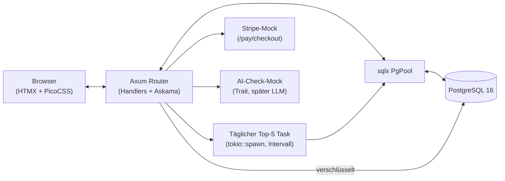
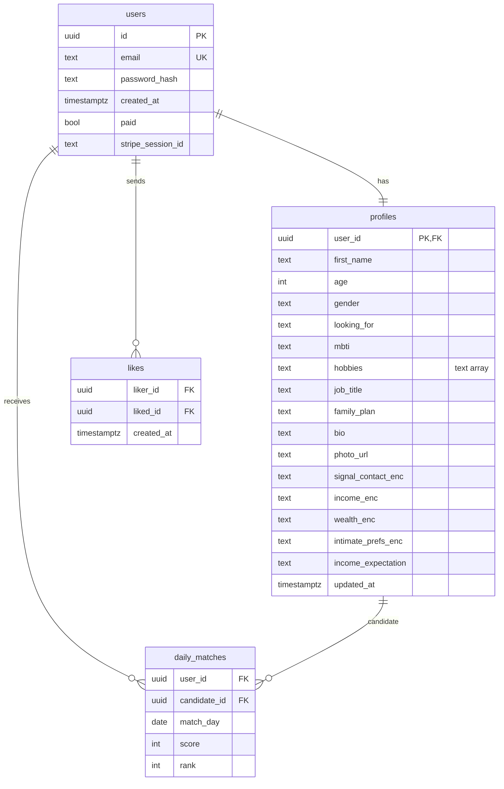

# Anti-Tinder MVP — Implementierungsplan

> Kontext für einen unabhängigen AI-Agenten: Diese Datei ist der Einstiegspunkt.
> Ziel ist eine ressourcenschonende Partnerbörse in Rust (Axum + PostgreSQL +
> HTMX), die Nutzer anhand von MBTI, Lebenszielen und Interessen matcht — ohne
> Engagement-Baiting, ohne In-App-Chat (Weiterleitung auf Signal), mit
> Privacy-by-Default (sensible Felder verschlüsselt, nur für den Algorithmus
> sichtbar) und Anti-Abuse (Einmalgebühr via Stripe-Mock, AI-Spam-Check-Mock,
> Rate-Limiting). Details zur Fachlichkeit: `plan/20261004_01_init/prompt.txt`.

## 1. Tech-Stack (verbindlich)

| Schicht | Technologie |
|---|---|
| Backend | Rust Edition 2024, `axum` 0.8, `tokio` |
| DB | PostgreSQL 16 via `sqlx` (PgPool, `migrate!`), ohne ORM |
| Frontend | `askama` Templates + `htmx` (CDN) + PicoCSS (CDN) |
| Verschlüsselung | `chacha20poly1305` (AEAD, App-Level vor DB-Insert), Key aus `DATA_ENCRYPTION_KEY` |
| Passwörter | `argon2` |
| Rate-Limit | `tower-governor` (Peer-IP, `into_make_service_with_connect_info`) |
| Telemetrie | `tracing` + `tracing-subscriber` (JSON in Prod, pretty in Dev) |
| Config | `dotenvy`, `.env` / Umgebungsvariablen |
| Zahlungen | Stripe-Mock (eigene `/pay/*` Routen, Testmodus-kompatibel); `reqwest` bereit für echte Stripe-/LLM-Calls |
| AI-Check | Trait `AiChecker` + `MockAiChecker` (Heuristik: Links/Spam-Wörter); `HttpAiChecker`-Stub für OpenAI/Anthropic via `reqwest` |
| E2E | Python + `uv`, `pytest`, `playwright` (Chromium), Ordner `e2e_tests/` |

## 2. Architektur-Überblick

## 3. Dateiliste (alle geplanten Dateien)

### Rust-Quellen (`src/`, alle < 600 Zeilen, gemischte Zuständigkeiten verboten)

> Hinweis: Rust-Modulnamen dürfen nicht mit Ziffern beginnen. Die Dateien
> heißen daher z. B. `01_config.rs`, werden aber per
> `#[path = "01_config.rs"] mod config;` in `main.rs` eingebunden.

| Datei | Beschreibung |
|---|---|
| `src/main.rs` | Nur Modul-Deklarationen, Config laden, Telemetry init, Pool aufbauen, Migrationen, Router bauen, Server starten |
| `src/01_config.rs` | `Config::from_env()`: `DATABASE_URL`, `DATA_ENCRYPTION_KEY`, `PORT`, `STRIPE_*`, `AI_*`, `SESSION_SECRET` |
| `src/02_db.rs` | `create_pool()`, `run_migrations()`, AEAD-Ver-/Entschlüsselungshelfer (`encrypt_field`/`decrypt_field`, Nonce-generierung, Base64) |
| `src/03_models.rs` | `User`, `Profile`, `PublicProfile` (nur öffentliche Felder), `Like`, `MutualMatch`, `DailyMatch`; Sichtbarkeits-Flags, Serde-Structs für Formulare |
| `src/04_scoring.rs` | Reiner Weighted-Scoring-Algorithmus: harte Filter (Alter/Geschlecht/Kinderwunsch → 0), MBTI-Matrix, Hobby-Schnittmenge, Hidden-Passung; Score 0–100 |
| `src/05_handlers_auth.rs` | Registrierung (inkl. Stripe-Mock-Gate), Login/Logout, Cookie-Session (signiert), Passwort-Hashing mit argon2 |
| `src/06_handlers_profile.rs` | Profil anlegen/bearbeiten (mit AI-Check vor Speichern), öffentliche Profilansicht mit Tresor-Symbol für Hidden-Felder, HTMX-Partials |
| `src/07_telemetry.rs` | `init_tracing()`: EnvFilter, Subskription, Request-Span-Middleware-Helfer |
| `src/08_ai_check.rs` | `AiChecker`-Trait, `MockAiChecker`-Heuristik, `HttpAiChecker`-Stub (reqwest, Feature-gated via Env) |
| `src/09_payments.rs` | Stripe-Mock: Checkout-Session erzeugen, Success/Cancel, `paid`-Flag am User; echte Stripe-API optional via `STRIPE_SECRET_KEY` |
| `src/10_matching.rs` | Täglicher Top-5-Job (`compute_top_matches`, `run_daily_task`), Like/Match-Logik, Signal-Kontaktaustausch bei gegenseitigem Like |
| `src/11_views.rs` | Askama-Template-Structs + `render()`-Helfer + `AppError`-Typ (`IntoResponse`) |
| `src/12_routes.rs` | Router-Aufbau: alle Routen, State, `GovernorLayer`, `TraceLayer`, Static-Files für HTMX-Fallback |

### Templates (`templates/`, Askama)

| Datei | Beschreibung |
|---|---|
| `templates/base.html` | Layout: PicoCSS + HTMX CDN, Navigationsleiste, Flash-Messages |
| `templates/index.html` | Landingpage mit Registrierungs-CTA |
| `templates/register.html` | Registrierungsformular (inkl. Hinweis auf 10 € Einmalgebühr) |
| `templates/login.html` | Login-Formular |
| `templates/profile_form.html` | Profil-Editor; Hidden-Felder mit 🔒 Tresor-Symbol |
| `templates/profile_view.html` | Öffentliche Profilansicht; Hidden-Felder nur als 🔒 Platzhalter |
| `templates/matches.html` | Top-5-Tagesmatches (Container für HTMX-Partial) |
| `templates/matches_list.html` | HTMX-Partial: Match-Cards mit Score, Like-Button |
| `templates/mutual.html` | Gegenseitiges Match: "Chat via Signal"-Button + Signal-Kontakt des Gegenübers |
| `templates/pay_checkout.html` | Stripe-Mock-Checkoutseite (10 €, Testmodus-Hinweis) |

### Migrationen (`migrations/`)

| Datei | Beschreibung |
|---|---|
| `migrations/001_init.sql` | `users`, `profiles`, `likes`, `daily_matches`; Indizes; Constraints |

### Infra & Config (Root)

| Datei | Beschreibung |
|---|---|
| `Cargo.toml` / `Cargo.lock` | Rust-Manifest (Edition 2024), alle Deps aktuell (`cargo upgrade` geprüft) |
| `docker-compose.yml` | PostgreSQL 16 Service (`db`, Volume, Healthcheck) + App-Service (optional) |
| `.env.example` | Alle Variablen dokumentiert (DB-URL, Keys, Stripe-Testkeys, AI-Mode) |
| `Dockerfile` | Multi-Stage-Build (Builder + slim Runner) |
| `deps.md` | Abhängigkeiten in `<org>/<project>`-Notation (DeepWiki-fähig) |
| `plan.md` (diese Datei) | Implementierungsplan |
| `task.md` | Schritt-für-Schritt-Aufgaben mit Test-Nachweisen |
| `plan/walkthrough.md` | Abschluss-Doku (Deutsch, nach Implementierung) |

### E2E (`e2e_tests/`, via `uv`)

| Datei | Beschreibung |
|---|---|
| `e2e_tests/pyproject.toml` | `uv init`-Projekt, Deps: `pytest`, `playwright`, `pytest-playwright` |
| `e2e_tests/test_flows.py` | Kritische Flows: Registrierung → Profil → Tresor-Check → Matches via HTMX |
| `e2e_tests/conftest.py` | Fixtures: Server-URL, DB-Reset-Helfer, Browser-Setup |

## 4. Datenbankschema (Mermaid ER)

Feld-Sichtbarkeit:

* Öffentlich: `first_name`, `age`, `mbti`, `hobbies`, `job_title`,
  `family_plan`, `bio` (nach AI-Check), `photo_url`.
* Versteckt (verschlüsselt, `*_enc`, nur Algorithmus): `signal_contact`,
  `income`, `wealth`, `intimate_prefs`. UI zeigt 🔒.
* `income_expectation` ist eine grobe, nicht-sensitive Erwartungsstufe
  (`low|medium|high|any`) und darf öffentlich sein.

## 5. Matching-Algorithmus (Kurzspec, Details in `04_scoring.rs`)

1. Harte Filter: Alter passt in beide Zielbereiche (vereinfacht: ±8 Jahre,
   konfigurierbar), `looking_for` kompatibel mit `gender`, `family_plan`
   kompatibel → sonst Score 0.
2. Scoring (0–100): MBTI-Matrix max 35 P., Hobby-Schnittmenge max 35 P.
   (Jaccard-ähnlich), Hidden-Passung max 30 P. (Einkommenserwartung vs.
   Einkommensstufe des anderen + grobe Präferenz-Kompatibilität).
3. Top-5-Job: `tokio::spawn` mit Tagesintervall (MVP: auch manuell per
   `POST /matches/recompute` triggerbar), speichert nach `daily_matches`.

## 6. Routen-Übersicht

| Methode & Pfad | Handler | Sichtbarkeit |
|---|---|---|
| `GET /` | Landingpage | öffentlich |
| `GET /register`, `POST /register` | Registrierung + Paywall-Gate | öffentlich |
| `GET /pay/checkout`, `GET /pay/success`, `GET /pay/cancel` | Stripe-Mock | öffentlich (Session) |
| `GET /login`, `POST /login`, `POST /logout` | Session | öffentlich |
| `GET /profile/edit`, `POST /profile` | Profil-Editor (AI-Check) | login + bezahlt |
| `GET /profile/:id` | öffentliche Ansicht (Tresor!) | login + bezahlt |
| `GET /matches`, `GET /matches/list` (HTMX-Partial) | Top-5 | login + bezahlt |
| `POST /matches/recompute` | Job manuell triggern | login + bezahlt |
| `POST /like/:id` | Liken | login + bezahlt |
| `GET /mutual/:id` | Signal-Austausch bei Match | nur bei gegenseitigem Like |

## 7. Commit-Regeln (zwingend)

* **Conventional Commits**: `<type>(<scope>): <kurze Beschreibung>` mit
  detailliertem Body (Was/Warum, Test-Nachweis).
* Typen: `feat`, `fix`, `docs`, `test`, `refactor`, `chore`, `ci`.
* Jede Task aus `task.md` = mindestens ein Commit. Kein Commit ohne grüne
  relevante Tests (`cargo test` bzw. `uv run pytest` für E2E-Schritte).
* Beispiel:
  `feat(scoring): implement weighted matching with MBTI matrix`
  Body: Algorithmus-Details, Grenzfälle, `cargo test scoring` grün.
