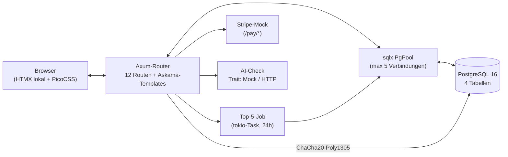
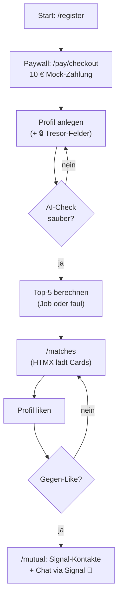

# Walkthrough: Anti-Tinder MVP 👩‍❤️‍👨 (ohne Swiping!)

*Was passiert, wenn man eine Dating-App baut, die ihre Nutzer möglichst
schnell wieder loswerden will? Genau das haben wir getan — und es war
überraschend lehrreich.*

## 1. Was exakt implementiert wurde

Stell dir vor: Du meldest dich an, zahlst einmalig 10&nbsp;€ (damit Bots
draußen bleiben), füllst dein Profil aus — und bekommst danach **jeden Tag
maximal 5 Partnervorschläge**. Kein endloses Wischen, kein
„Engagement-Baiting“. Wenn es beidseitig funkt, tauscht ihr eure
Signal-Kontakte aus und verlasst die Plattform. Mission erfüllt!

### Die Features im Überblick

| Bereich | Was das MVP kann |
|---|---|
| **Registrierung & Paywall** | E-Mail + Passwort (Argon2-Hash, also ein moderner, absichtlich langsamer Hash-Algorithmus gegen Brute-Force). Danach Mock-Checkout über 10&nbsp;€ — im Testmodus fließt kein echtes Geld. Erst mit `paid=true` geht es weiter. |
| **Profil mit Tresor** | Öffentlich: Vorname, Alter, MBTI-Typ, Hobbys, Beruf, Familienplanung, Profiltext, Foto. **Versteckt** (🔒 Tresor-Symbol in der UI): Signal-Kontakt, Einkommen, Vermögen, intime Präferenzen — alles per **ChaCha20-Poly1305** verschlüsselt in der Datenbank (ein moderner AEAD-Chiffre-Algorithmus: AEAD heißt, Verschlüsselung *und* Fälschungsschutz in einem). |
| **AI-Spam-Check** | Jeder Profiltext läuft vor dem Speichern durch einen Filter. Im MVP eine Heuristik (blockt Links, OnlyFans-, Telegram-, CashApp-Muster), per Trait austauschbar gegen eine echte LLM-API (`AI_MODE=http`). |
| **Weighted Scoring** | Statt eines starren Algorithmus gibt es einen dynamischen Score von 0–100&nbsp;%: Harte Dealbreaker (Alter ±10 Jahre, gegenseitige Geschlechtspräferenz, Familienplanung) führen zu 0. Sonst zählen MBTI-Kompatibilität (35&nbsp;P.), Hobby-Überschneidung per Jaccard-Ähnlichkeit (35&nbsp;P.) und die Passung der *versteckten* Attribute (30&nbsp;P.). |
| **Anti-Swiping** | Ein Hintergrund-Task (`tokio::spawn`, alle 24h) berechnet die Top&nbsp;5 pro Nutzer. Zusätzlich rechnet `GET /matches` bei leerem Tag **faul nach** — neue Profile sehen sofort etwas. |
| **Signal statt Chat** | Kein In-App-Chat! Bei gegenseitigem Like erscheint ein **„Chat via Signal“**-Button plus die entschlüsselten Kontakte beider Seiten. |
| **Rate-Limiting** | `tower-governor`: 10 echte Requests/Sekunde pro IP, Burst 30 (per Env konfigurierbar). |
| **Telemetrie** | `tracing` mit lesbarem Dev-Format und JSON per `LOG_FORMAT=json`. |
| **E2E-Tests** | 5 echte Browser-Tests (Playwright/Chromium, via `uv`): Registrierung→Paywall→Login, Tresor-Geheimhaltung (kein Secret im HTML!), HTMX-Matchliste, gegenseitiges Like→Signal, Spam-Ablehnung. |

### Architektur: Wer spricht mit wem?



### User-Flow: Von der Anmeldung bis Signal



### Beispiel: Wie der Score zustande kommt

Anna (30, INFJ, Hobbys Klettern/Kochen, Vermögen „low“) und Ben (32, ENFP,
Hobbys Klettern/Lesen, Vermögen „medium“), beide mit Kinderwunsch:

* Dealbreaker: Alter ok (±10), Präferenzen gegenseitig, Familienplanung gleich → weiter.
* MBTI: INFJ→ENFP, beide „Diplomaten“ (NF-Gruppe) → **28/35**.
* Hobbys: Schnittmenge {Klettern} / Vereinigung {Klettern, Kochen, Lesen} = ⅓ → **12/35**.
* Hidden: Erwartung „egal“ → 12/18, Vermögen benachbart (low↔medium) → 8/12 → **20/30**.
* **Gesamt: 60&nbsp;%** — exakt das, was die Tests und der Rauchtest zeigen. ✔

## 2. Architektur-Entscheidungen (spontan unterwegs getroffen)

Man plant — und dann kommt der Compiler. Hier die wichtigsten
Kurskorrekturen, alle mit Begründung:

1. **Nummerierte Dateien via `#[path]`**: Rust verbietet Modulnamen wie
   `01_config`. Statt die Vorgabe zu brechen, heißen die Dateien
   `01_config.rs`, werden aber per `#[path = "01_config.rs"] mod config;`
   eingebunden. Best of both worlds: Sortierung bleibt, der Compiler ist
   glücklich.

2. **Laufzeit-Queries statt `query!`-Makros**: `sqlx` kann SQL schon beim
   Kompilieren gegen eine Live-DB prüfen — dafür braucht der Build aber
   *immer* eine Datenbank. Für ein MVP, das überall offline bauen soll,
   war das zu fragil. Wir nutzen `query_as` mit `FromRow` (Typsicherheit
   zur Laufzeit, Migrationen via `migrate!`). Echte DB-Abdeckung liefern
   der migrations-Test (`TEST_DATABASE_URL`) und die E2E-Suite.

3. **Enum statt `dyn` beim AI-Check**: Native `async fn` in Traits sind
   nicht objekt-sicher — `Arc<dyn AiChecker>` kompiliert nicht. Statt die
   `async-trait`-Abhängigkeit einzuschleppen, gibt es `AiCheckerKind`
   (Enum-Dispatch Mock/Http). Kleiner, schneller, keine neue Abhängigkeit.

4. **Handgerollte HMAC-Session statt Session-Crate**: `tower-sessions`
   + Redis wäre Overkill. Ein HMAC-SHA256-signiertes Cookie
   (`dating_session`) ohne Server-State reicht fürs MVP völlig — und spart
   eine ganze Infrastrukturkomponente.

5. **Askama-`==` umgangen**: Askamas Template-`==` vergleicht nicht
   sauber `String` mit String-Literalen (Compiler-Fehler `String == &&str`).
   Lösung: `SelectOption`-Structs — das „selected?“ wird in Rust
   vorberechnet, Templates enthalten nur noch boolesche ``-Flags.
   Als Bonus ist das Markup dadurch DRY (Schleifen statt 16 MBTI-Zeilen).

6. **Axum-0.8-Routen `{id}` statt `:id`**: Die alte `:id`-Syntax panickt
   beim Start („Path segments must not start with `:`“). Alle Routen
   nutzen jetzt `{id}`.

7. **`per_second` heißt nicht, was man denkt**: `tower-governor`s
   `per_second(10)` bedeutet *1 Token pro 10 Sekunden* (Replenish-Periode!),
   nicht 10 Requests/Sekunde. Das hat die E2E-Suite entlarvt (in Serie rot,
   einzeln grün). Jetzt: Periode = 1s/rps via `.period()`, plus per Env
   konfigurierbar (`RATE_LIMIT_PER_SECOND/BURST`). Die E2E-Umgebung fährt
   mit 1000/1000.

8. **Crypto-API-Modernisierung**: `password-hash 0.6` würfelt das Salt
   automatisch (`hash_password(pw)` ohne Salt-Parameter), HMAC braucht
   `KeyInit` statt `Mac::new_from_slice`, `rand 0.10` liefert Nonces per
   `rand::random::<[u8; 12]>()`. Alles aus den installierten Quellen
   verifiziert, nicht geraten.

9. **HTMX lokal vendored**: `static/htmx.min.js` wird mit ausgeliefert
   (ServeDir), statt CDN-Pflicht. Die E2E-Tests sind dadurch unabhängig
   vom Netz — nur PicoCSS kommt noch vom CDN (reine Optik, kein
   Funktions-Bedarf).

10. **Container-in-Container-DB-Zugriff**: Die Umgebung läuft selbst in
    Docker, daher ist `localhost:5432` *nicht* der DB-Container. Lokal
    zeigt `DATABASE_URL` auf die Bridge-IP (`172.17.0.3`), nativ bleibt
    `localhost` korrekt. `docker-compose.yml` deckt den echten
    Deploy-Fall ab.

## 3. Learnings und nächste Ausbaustufen

### Was wir gelernt haben

* **E2E-Tests finden echte Bugs**: Das Rate-Limit-Problem (Punkt&nbsp;7)
  wäre per Unit-Test nie aufgefallen — erst die schnelle Test-Sequenz hat
  es gezeigt. Die Investition in Playwright hat sich am ersten Tag bezahlt
  gemacht.
* **DeepWiki vor Raten**: Die `GovernorLayer`- und Askama-Integration
  kamen per Doku-Recherche statt Trial-and-Error zustande — bei
  `tower-governor 0.8` war das README-Beispiel (`new(config)` ohne
  `.into()`) der entscheidende Hinweis gegen Typ-Inferenz-Fehler.
* **„Sensible Defaults“ sind Architektur, kein Feature**: Dass
  `PublicProfile` *konstruktiv* keine Hidden-Felder enthalten kann
  (eigener Struct, `debug_assert_no_ciphertext_leak`, Leak-Test im E2E),
  ist stärker als jede Code-Review-Regel.

### Nächste Ausbaustufen (priorisiert)

1. **Echter Stripe-Checkout** (`STRIPE_SECRET_KEY` ist vorbereitet,
   `price_id` wird schon angezeigt): Checkout-Session per Stripe-API +
   Webhook (`/pay/webhook`) statt Mock-Bestätigung.
2. **Echte LLM-Moderation**: `HttpAiChecker` an OpenAI/Anthropic
   anschließen, Fail-Open → Fail-Closed mit Retry-Queue.
3. **Matching-Skalierung**: Vollscan → Kandidaten-Vorauswahl per SQL
   (Alter, Geschlecht, Familienplanung als WHERE-Klausel), dann Scoring
   nur für die Shortlist; Pagination der Historie.
4. **Bilder-Upload**: Foto-Upload statt URL (Object Storage, Größenlimit,
   NSFW-Pre-Check).
5. **Härtung**: `Secure`/`__Host-`-Cookies + CSRF-Token, Security-Header
   (Helmet-Äquivalent), `cargo audit`/`deny` in CI, Backups +
   Key-Rotation für `DATA_ENCRYPTION_KEY`.
6. **UX**: Passwort-Reset, Profil-Löschung (DSGVO-Export/Löschung),
   E-Mail-Verifikation, Paginierung.

## 4. Benötigte CLI-Tools & Pakete (fürs Dockerfile)

| Tool/Paket | Wofür | Status im Dockerfile |
|---|---|---|
| `rust:1.88-slim` + `cargo build --release` | Builder-Stage | ✅ enthalten |
| `pkg-config`, `libssl-dev` | Build-Abhängigkeiten (TLS) | ✅ Builder-Stage |
| `debian:bookworm-slim` + `ca-certificates` | schlanker Runner (TLS-Root-Zertifikate!) | ✅ enthalten |
| `postgres:16-alpine` | Datenbank (`docker-compose.yml`) | ✅ Compose |
| `sqlx-cli` | *Optional*: `sqlx migrate add/run` für neue Migrationen (Laufzeit nutzt `migrate!`, braucht CLI nicht) | ❌ bewusst weggelassen |
| `stripe-cli` | *Optional*: Webhook-Tests (`stripe listen`) bei Ausbau­stufe 1 | ❌ bewusst weggelassen |
| `uv` + `playwright` + `pytest-playwright` + `psycopg[binary]` | E2E-Suite (`e2e_tests/`) | ❌ nur Dev/Test-Umgebung |
| Playwright-Systemlibs (`libnss3`, Fonts, …) | Headless-Chromium (`playwright install-deps`) | ❌ nur CI/Test-Image |

### Start (lokal, Dev-DB via Docker)

```bash
cp -n .env.example .env   # Key erzeugen, siehe Kommentar in der Datei
docker run -d --name dating_mvp_db -e POSTGRES_USER=dating \
  -e POSTGRES_PASSWORD=dating_secret_dev -e POSTGRES_DB=dating_mvp \
  -p 5432:5432 postgres:16-alpine
cargo run                  # → http://localhost:3000
cd e2e_tests && uv run pytest   # E2E (eigene Test-DB + Port 3101)
```

### Test-Nachweise (alle grün)

* `cargo test` → **37 bestanden** (Config, Crypto, Modelle, Scoring inkl.
  900er Property-Sweep, AI-Check, Auth/Session, Payments, Matching).
* `TEST_DATABASE_URL=… cargo test db::` → Migrationen laufen auf echter DB.
* `uv run pytest` → **5 E2E-Flows bestanden** (Registrierung/Paywall,
  Tresor-Leakfreiheit, HTMX-Matches, Signal-Austausch, Spam-Block).
* `cargo fmt --check`, `cargo clippy --all-targets -- -D warnings`,
  `cargo upgrade` (alle 24 Pakete aktuell) → sauber.
