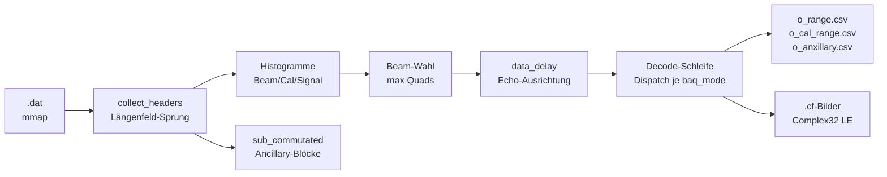

# Implementierungsplan: Sentinel-1-Rohdaten-Dekodierer (Rust-Port)

Ziel: Den C++14-Space-Packet-Dekodierer `/workspace/src/copernicus-radar/`
(~7.000 Zeilen, CMake, pybind11) als idiomatisches Rust-Crate unter
`examples/34_copernicus_radar/` neu bauen. Das Binary mappt eine
Sentinel-1-Level-0-`.dat`-Datei in den Speicher, sammelt die
Paket-Header, histogrammiert Kalibrier- und Signalpakete, wählt den
Elevation-Beam mit den meisten Daten und dekodiert dessen Echos
(FDBAQ, festes BAQ 3/4/5, Bypass) in ein komplexes Entfernungsbild
plus CSV-Berichte. Validierung gegen das echte S1C-Produkt in
`../34_copernicus/data/`.

Arbeitsverzeichnis: `examples/34_copernicus_radar/`
Plan-Ordner: `plan/20261004_01_rust_port/` (dieser Ordner).

---

## 1. Anforderungs-Review: Lücken und Ergänzungen

Die Anforderungen aus `prompt.txt` sind vollständig übernommen.
Zusätzlich fehlen bzw. werden präzisiert:

| # | Lücke | Vorschlag (umgesetzt, falls nicht anders markiert) |
|---|---|---|
| 1 | **C++ routet alles durch FDBAQ.** `baq_mode` 3/4/5 trägt keine BRC-Bits im Strom; der FDBAQ-Dekodierer liest Nutzdaten als Code und desynchronisiert. | Dispatch pro Paket nach `baq_mode`: 12–14 → FDBAQ, 3/4/5 → festes BAQ, 0 → Bypass; sonst typisierter Fehler. |
| 2 | **C++ schreibt `.cf` nie wirklich.** Ausgabezeiger wird nie beschrieben (uninitialisierter Heap). | Kanäle zu komplexen Samples verweben (gerade: IE+i·QE, ungerade: IO+i·QO) und schreiben. |
| 3 | **Feste Puffer laufen über** (512 Echos, `brcs[205]`/`thidxs[205]`). | `--max-echoes` begrenzt nur die Speicherung (Rest wird weiter dekodiert/protokolliert); Code-Tabellen wachsen dynamisch. |
| 4 | **`assert(0)` bricht bei jedem Sonderpaket ab.** | Typisierte `Error`-Enum; fatale Fehler (Sync, I/O) brechen ab, Paketfehler loggen und fahren fort. |
| 5 | **Eingebettetes Python ist toter Ballast** (C++-`main` ruft die Shell nie auf). | Kein Interpreter; `--export-headers` schreibt dieselbe Spaltentabelle als CSV. `demangle` ersatzlos streichen. |
| 6 | **Synthetische Tests teilen Annahmen mit dem Codec.** | Regressionstests auf Echtdaten (`tests/real_data.rs`): Volkszählung, Echo-, Rauschpaket-Dekodierung, Paketgrenzen-Prüfung; skip ohne Datensatz (`S1_DAT`). |
| 7 | **Datensatz zu groß fürs Repo** (1,2 GB Zip, ~600 MB je `.dat`). | Bleibt in `../34_copernicus/data/`, per `.gitignore` ausgeschlossen; nie committen. |
| 8 | **Alter Download-Link tot** (`scihub.copernicus.eu`). | Aktuell: Copernicus-Data-Space-OData-API (Token → Katalog → `Nodes(...)/$value`); in README/`walkthrough.md` dokumentiert, kein Download-Skript im MVP. |
| 9 | **CSV-Floats müssen C-Format treffen** (`%.3g`). | Eigener Formatierer mit Oracle-Tabelle im Unit-Test. |
| 10 | Nicht im MVP (Vorschläge) | VH-Polarisation, Fokussierung (SAR-Bild), Quicklook-PNG, Parallelisierung (rayon), IW/EW-Modi, GeoTIFF-Export, Streaming ohne Echo-Cap. |

## 2. Architektur



### 2.1 Paketformat

Space Packet (CCSDS): 6-Byte-Primär-Header (`data_length` Big-Endian
in Byte 4–5) + 62-Byte-Sekundär-Header = 68 Byte Kopf, danach
Nutzdaten (~25 kB). Sync-Marker `0x352EF853` in Byte 12–15.
Schlüsselfelder: `cal_p` (59:7), Elevation-Beam (60:4–7), Quads
(u16be 65), `baq_mode` (37:0–4), `signal_type` (63:4–7),
`test_mode` (21:4–6). Ein Quad = 2 komplexe Samples (gerade +
ungerade) = IE/QE/IO/QO.

### 2.2 Dekodierer

- **FDBAQ** (`decode_packet`): Blöcke à 128 Symbole, `ceil(2·quads/256)`
  Blöcke. Kanäle hintereinander: IE trägt BRC (3 Bit) + je Symbol
  Vorzeichenbit + Huffman-Mcode; IO übernimmt BRCs; QE trägt `thidx`
  (8 Bit/Block) und rekonstruiert sofort; QO übernimmt beides;
  IE/IO werden nachträglich skaliert. Füllbits auf gerades Byte
  zwischen Kanälen.
- **Festes BAQ** (`decode_type_c`): 3/4/5 Bit je Sample
  (Vorzeichen + Betrag), kein BRC, `thidx` im QE-Kanal, Tabellen
  A/NRLA.
- **Bypass** (`decode_type_ab`): rohe 10-Bit-Codes (1+9), keine
  Tabellen.
- **Rekonstruktion** (`utils::reconstruct`): `thidx ≤ simple_limit` →
  einfaches Gesetz (±mcode bzw. ±Tabelle[thidx]), sonst normales
  Gesetz (±NRL[mcode]·SF[thidx]). Tabellen B/NRL/SF/A/NRLA aus
  `tables.rs` (Byte-exakt aus dem C++ übernommen).

### 2.3 Pipeline (`main.rs`)

mmap → sammeln (45.437 Pakete in ~20 ms) → Histogramme + Ancillary →
Beam mit den meisten Quads → `data_delay`-Ausrichtung
(`mi/ma_data_delay`, Bildbreite `n0`) → Decode-Schleife mit
CSV-Protokoll und `.cf`-Schreibung (erste `--max-echoes`, Default
512). Flags: `--csv-dir`, `--cf-dir` (Fallback: CSV-Verzeichnis),
`--max-echoes`, `--dump-headers`, `--animate`, `--export-headers`.
Logformat angelehnt ans C++ (vergangene ns, Fundstelle, `k=v`-Paare).

## 3. Kontext für den ausführenden Agenten (Dateien)

| Datei | Warum lesen |
|---|---|
| `plan/20261004_01_rust_port/prompt.txt` | Originalanforderungen, Regeln (Tests, Commits, Walkthrough). |
| `/workspace/src/copernicus-radar/README.org` | Was das C++-Programm tut; toter SciHub-Link als Ausgangspunkt der Download-Recherche. |
| `/workspace/src/copernicus-radar/source/copernicus_00_main.cpp` | Pipeline-Vorbild: Histogramme, Beam-Wahl, Delay-Ausrichtung, CSV/`.cf`-Schreibung. |
| `/workspace/src/copernicus-radar/source/copernicus_04_decode_packet.cpp` | FDBAQ-Referenz: BRC-, Huffman-, Padding-Regel (2.624 Zeilen, generiert). |
| `/workspace/src/copernicus-radar/source/copernicus_07_decode_type_c_packet.cpp` | Festes BAQ3/4/5 + Tabellen A/NRLA. |
| `/workspace/src/copernicus-radar/source/copernicus_05_decode_type_ab_packet.cpp` | Bypass-Format (10-Bit-Codes). |
| `/workspace/src/copernicus-radar/source/copernicus_06_decode_sub_commutated_data.cpp` | Ancillary-Protokoll (Wortindex → Strukturbytes). |
| `/workspace/src/copernicus-radar/source/utils.h` | Bit-Leser (MSB-zuerst), Schwellenindex-Leser, Ancillary-Struktur. |
| `/workspace/src/copernicus-radar/source/CMakeLists.txt` | C++-Abhängigkeiten (pybind11, gmp) — beide entfallen im Port. |
| `examples/34_copernicus_radar/README.md` | Modulkarte, Abweichungen vom C++, Test-/Laufanleitung. |
| `examples/34_copernicus_radar/src/main.rs` | Pipeline, Dispatch, CSV/`.cf`-Schreiber, CLI. |
| `examples/34_copernicus_radar/tests/real_data.rs` | Echtdaten-Regression: Zensus, Echo, Rauschpaket. |

## 4. Usage-Beispiele der Abhängigkeiten

Nur zwei Laufzeit-Abhängigkeiten (plus `tempfile` für Tests):

`memmap2` (Datei einblenden):
```rust
use memmap2::Mmap;
use std::fs::File;
let file = File::open(path)?;
let mmap = unsafe { Mmap::map(&file)? };
let bytes: &[u8] = &mmap;
```

`num-complex` (Samples, Bildpuffer):
```rust
use num_complex::Complex32;
let image = vec![Complex32::default(); n0 * echoes];
image[base] = Complex32::new(re, im);
```

`tempfile` (nur Tests: CSV/`.cf`-Vergleiche in flüchtigen Verzeichnissen).

## 5. Dateiaufteilung

Ein Crate, Bibliothek + Binary; Module in Datenfluss-Reihenfolge,
`lib.rs`/`main.rs` enthalten Deklarationen, Zustand und Verdrahtung:

```
34_copernicus_radar/
  Cargo.toml  README.md
  src/  lib.rs main.rs mmap.rs collect_headers.rs header.rs
        sub_commutated.rs process_headers.rs decode_packet.rs
        decode_type_c.rs decode_type_ab.rs tables.rs utils.rs
        error.rs header_export.rs
  tests/  integration.rs real_data.rs
  plan/20261004_01_rust_port/  prompt.txt plan.md walkthrough.md plan_effort.md
```

## 6. Werkzeuge und Qualität

- Aktuelles Rust, `cargo fmt`, `cargo clippy --all-targets -- -D
  warnings`, neueste Dependency-Versionen.
- Tests: `cargo test` (Unit + synthetische Integration + Echtdaten mit
  Skip ohne Datensatz); Volllauf auf der 631-MB-VV-Datei als
  E2E-Nachweis (Erwartung: 0 Dekodierfehler, plausible Bildstatistik).
- Keine Workspace-Änderungen: Jedes Beispiel-Crate baut für sich;
  `target/` und `*.lock` bleiben per `.gitignore` draußen, ebenso der
  Datensatz (`examples/34_copernicus/data/`).

## 7. Commit-Regeln

Conventional Commits, Autor Wol Pumba `<wolpumba@gmail.com>`, jede
Nachricht mit Titel (≤ 72 Zeichen, `typ(scope): was`) und ausführlichem
Body (Warum, Was, wie getestet). Typen: `feat`, `fix`, `test`, `docs`,
`refactor`, `build`, `chore`. Scope: `34_copernicus_radar`. Ein Commit
pro abgeschlossenem Schritt mit grünen Tests; keine Builds (`target/`),
keine Riesendaten (`.dat`/`.zip`), keine Lockfiles ins Repo. Beispiel:

```
feat(34_copernicus_radar): dispatch signal packets by baq mode

Route baq modes 12-14 to the FDBAQ decoder, 3/4/5 to fixed-rate BAQ
and 0 to bypass instead of forcing every signal packet through FDBAQ
like the C++ main does. Fixed-rate packets carry no bit-rate codes,
so FDBAQ misreads payload as codes and derails (~224 bytes later).

Tested: cargo test (41 green, incl. 3 real-data tests); full 631 MB
run with 0 decode errors (was 16).
```

## 8. Walkthrough-Regeln (für `walkthrough.md` nach Abschluss)

- **Sprache und Stil:** zwingend Deutsch, didaktisch, flüssig lesbar.
- **Erklärungen:** Fachbegriffe kurz und verständlich erklären.
- **Visualisierung:** reichlich Code-Beispiele und Mermaid-Diagramme
  (Architektur, Datenfluss, komplexe Konzepte).
- **Struktur:** 1. Was exakt implementiert wurde. 2. Welche Architektur-
  Entscheidungen aufgrund von Tests geändert werden mussten. 3. Learnings
  und mögliche Erweiterungen. 4. Liste neuer Programme/Pakete fürs
  Dockerfile.
- **Ehrlichkeit:** Nur Zahlen nennen, die in der Session gemessen
  wurden; unbelegte Vorab-Behauptungen prüfen statt zitieren.
