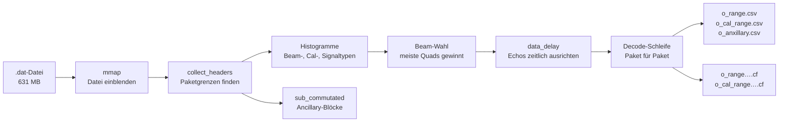
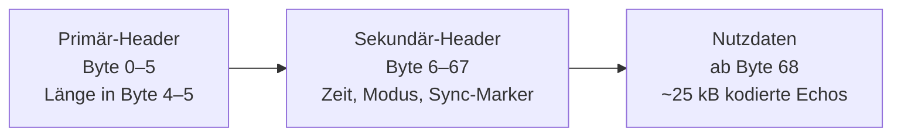
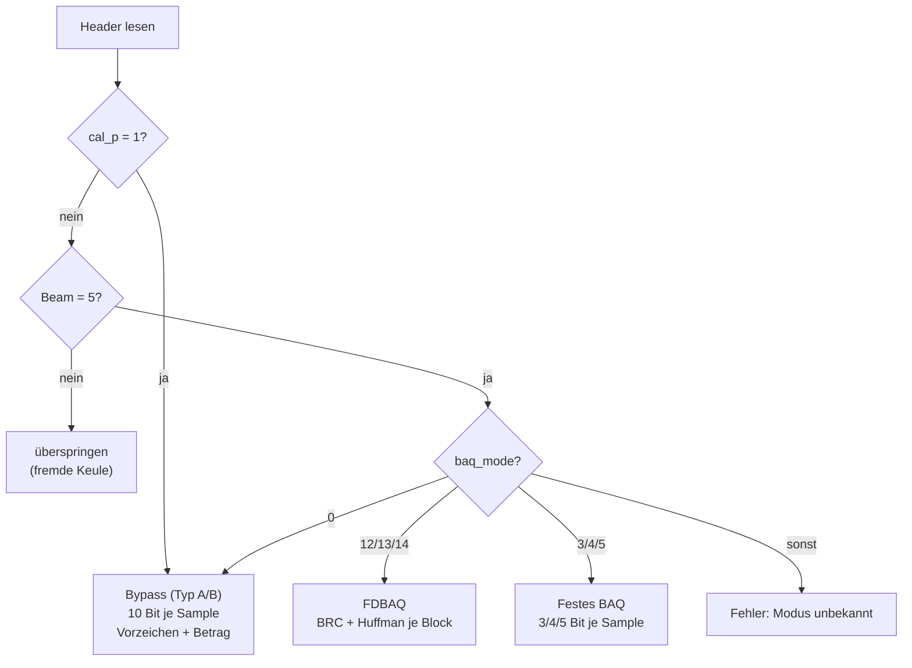
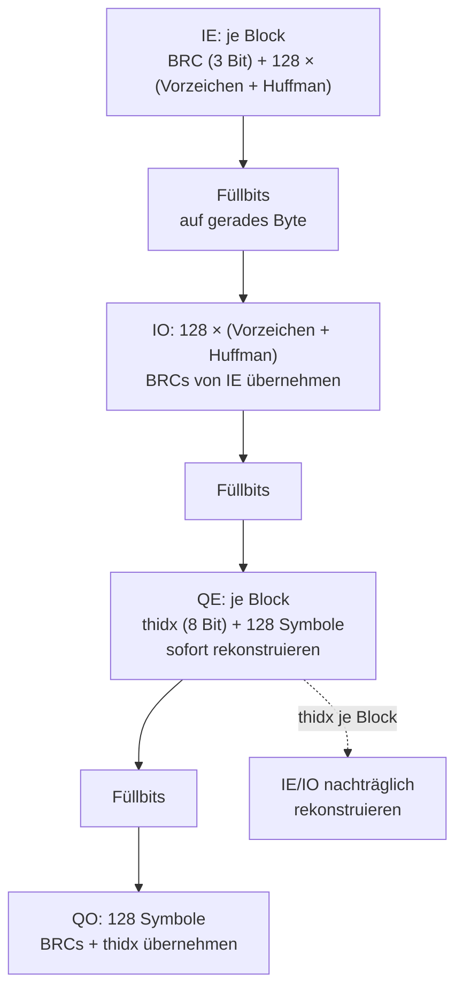
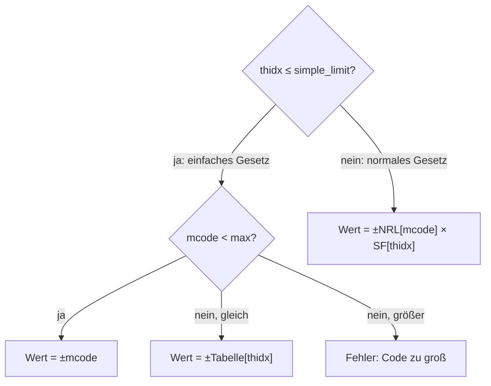
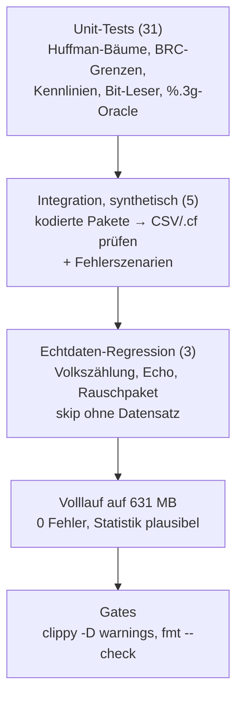

# Walkthrough: Rohdaten vom Radar-Satelliten in Rust dekodieren

Dieses Dokument erklärt, was in `examples/34_copernicus_radar` gebaut
wurde, warum es so gebaut wurde und was wir unterwegs gelernt haben. Es
richtet sich an Leserinnen und Leser, die den Code verstehen oder
weiterentwickeln wollen, ohne jede Datei selbst durchzuarbeiten.

Zur Einordnung vorab das Szenario: Der europäische Satellit
**Sentinel-1C** umkreist die Erde und vermisst sie mit Radar —
Wolken und Dunkelheit sind ihm egal. Was er zur Bodenstation funkt,
sind keine Bilder, sondern **rohe Echos**: 631 Megabyte an
komprimierten Zahlenkolonnen in einer einzigen Datei, 45.437 Pakete zu
je rund 25 Kilobyte. Jedes Paket enthält knapp 10.000 komplexe
Messwerte, kodiert in einem Verfahren namens FDBAQ, das man erst
verstehen muss, bevor man eine einzige Zahl lesen kann. Genau das tut
dieses Programm: Es verwandelt den Bitstrom in ein
komplexwertiges Entfernungsbild plus Tabellen — in 22 Sekunden,
in reinem Rust, ohne eine einzige fehlgeschlagene Dekodierung.

---

## 1. Was exakt implementiert wurde

### 1.1 Die Grundidee in einem Satz

> Space-Pakete rein, komplexe Echos plus CSV-Tabellen raus — jedes Paket
> wird anhand seines `baq_mode` an genau den Dekodierer gereicht, dessen
> Bitformat es spricht.

Die Vorlage war das C++14-Projekt
[plops/copernicus-radar](https://github.com/plops/copernicus-radar)
(~7.000 Zeilen, CMake, eingebettetes Python), selbst generiert aus
`gen00.lisp`. Der Rust-Port (~3.700 Zeilen, zwei Abhängigkeiten:
`memmap2`, `num-complex`) übernimmt die Dekodierlogik, aber nicht die
Struktur: kein globales `State`-Objekt, kein eingebetteter
Python-Interpreter, keine festen Puffergrößen. Validiert wurde gegen
echte Daten — ein S1C-Produkt vom 29. September 2026 (Stripmap-Modus,
Beam S6, Polarisation VV).

### 1.2 Die Architektur im Überblick



Der Code ist ein Crate mit einer Bibliothek (die Dekodierer) und einem
Binary (die Pipeline). Die Module im Datenfluss:

| Modul | Aufgabe | Herkunft |
|---|---|---|
| `mmap` | Datei per `memmap2` einblenden | C++ 01 |
| `collect_headers` | Paketgrenzen über Längenfeld finden | C++ 02 |
| `header` | 54 Header-Felder + abgeleitete Größen | verstreut in C++ `main` |
| `sub_commutated` | Langsame Hausdaten zusammensetzen | C++ 06 |
| `process_headers` | Header-Dump (`--dump-headers`) | C++ 03 |
| `decode_packet` | FDBAQ-Dekodierer (BRC + Huffman) | C++ 04 |
| `decode_type_c` | Feste BAQ-Modi 3/4/5 | C++ 07 |
| `decode_type_ab` | Bypass (unkomprimiert, 10 Bit) | C++ 05 |
| `tables` | Rekonstruktionstabellen (B/NRL/SF/A/NRLA) | C++ 04/07 |
| `utils` | Bit-Leser, Füllbits, `%.3g`-Format | `utils.h` |
| `error` | Fehler als Typen statt Abbrüche | `assert(0)`-Stellen |
| `header_export` | Header-Tabelle als CSV | ersetzt C++-Python-Shell |
| `lib` (`State`) | Besitzender Zustand statt Global | `globals.h` |

Zwei C++-Module haben bewusst **kein** Gegenstück: `demangle`
(Typnamen für Logs, toter Code) und die eingebettete
IPython-Shell — Python einzubetten war nie das Ziel, die
Header-Tabelle als CSV genügt.

### 1.3 Das Paketformat: 68 Byte Kopf, dann Nutzdaten

Ein **Space Packet** ist die Standardeinheit, in der Satelliten Daten
senden (CCSDS-Norm): ein kleiner Kopf mit Länge und Zeitstempeln,
dahinter die Nutzlast. Bei Sentinel-1 sieht jedes Paket so aus:



Der Sammler (`collect_headers`) liest das 16-Bit-Längenfeld und springt
von Paket zu Paket — 45.437 Treffer in 20 Millisekunden. Dass er
richtig liegt, beweist der **Sync-Marker** `0x352EF853` an Byte 12–15
jedes Pakets: eine magische Zahl, die einen verrutschten
Dateizeiger sofort verrät.

Die wichtigsten Header-Felder (alle Bitadressen wurden gegen die
Echtdaten verifiziert):

| Feld | Bits | Beispiel (Paket 268) | Bedeutung |
|---|---|---|---|
| Sync-Marker | Byte 12–15 | `0x352EF853` | „Hier beginnt wirklich ein Paket“ |
| `cal_p` | Byte 59, Bit 7 | 0 | 1 = Kalibrier-, 0 = Messpaket |
| Elevation-Beam | Byte 60, Bit 4–7 | 5 | Antennenkeule (hier: S6) |
| `number_of_quads` | Byte 65–66 | 9975 | Quads in diesem Paket |
| `baq_mode` | Byte 37, Bit 0–4 | 12 | Kodierverfahren (s. u.) |
| `signal_type` | Byte 63, Bit 4–7 | 0 | 0 = Echo, 1 = Rauschen, 8–11 = Kalibrierung |
| `test_mode` | Byte 21, Bit 4–6 | 0 | 0 = normale Messung |

Ein **Quad** ist die Mengeneinheit der Echos: zwei komplexe
Abtastwerte — ein gerader und ein ungerader —, also vier
Analog-Digital-Wandler-Werte namens **IE, QE, IO, QO**
(In-phase/Quadratur × gerade/ungerade). Unsere 9.975 Quads sind damit
19.950 komplexe Messwerte pro Echo.

Die Volkszählung der echten Datei (`tests/real_data.rs` prüft sie bei
jedem Lauf):

| Pakete | `baq_mode` | Inhalt |
|---|---:|---|
| 44.901 | 12 | Echos, FDBAQ-kodiert |
| 16 | 5 | Rauschmessungen, festes BAQ5 |
| 520 | 0 | Kalibrierpulse, Bypass |

Dass ausgerechnet 16 Pakete anders kodiert sind als alle anderen, hat
uns fast den ersten Echtdatenlauf gekostet — dazu mehr in Abschnitt 2.

### 1.4 Drei Dekodierer für drei BAQ-Welten

**BAQ** („Block Adaptive Quantization“) heißt: Das Radar teilt jedes
Echo in Blöcke zu 128 Symbolen und wählt pro Block, wie grob es
quantisiert — laute Blöcke fein, leise Blöcke grob. **FDBAQ**
(„Flexible Dynamic BAQ“) schreibt diese Wahl als 3-Bit-Code (**BRC**,
„Bit Rate Code“, Werte 0–4) in den Datenstrom; die festen Modi 3/4/5 sparen
sich das und nehmen immer dieselbe Breite. Das Binary verzweigt daher
pro Paket:



**FDBAQ im Detail.** Die vier Kanäle liegen hintereinander im Paket,
nicht verschachtelt. Nur der erste Kanal (IE) trägt die BRCs; alle
anderen übernehmen sie. Nur der dritte (QE) trägt den
**Schwellwertindex** (`thidx`, 8 Bit je Block), der später bestimmt,
mit welcher Kennlinie rekonstruiert wird:



Jedes Symbol beginnt mit einem **Vorzeichenbit**, danach folgt der
**Mcode** (Betragscode) in Huffman-Kodierung — häufige kleine Werte
bekommen kurze Codes. Für BRC 0 sieht der Baum so aus: `0` → 0,
`10` → 1, `110` → 2, `111` → 3.

Verfolgen wir das an echten Bits — dem ersten Echo (Paket 268), dessen
Nutzdaten mit `12 c4 2c …` beginnen, also
`000100101100…`:

| Schritt | Bits | Ergebnis |
|---|---|---|
| BRC lesen | `000` | BRC = 0 |
| Symbol 1: Vorzeichen | `1` | negativ |
| Symbol 1: Huffman | `0` | Mcode 0 → Wert −0 |
| Symbol 2: Vorzeichen | `0` | positiv |
| Symbol 2: Huffman | `10` | Mcode 1 → Wert +1 |
| Symbol 3: Vorzeichen | `1` | negativ |
| Symbol 3: Huffman | `110` | Mcode 2 → Wert −2 |

Man sieht, warum ein einziger falsch verstandener Code alles dahinter
zerstört: Danach ist der Bitstrom dauerhaft phasenverschoben. Genau so
ein Aufschaukeln hat uns die 16 Rauschpakete verraten (Abschnitt 2).

**Festes BAQ** ist einfacher: Jedes Sample ist ein Paket aus
Vorzeichenbit plus Betrag fester Breite — bei BAQ5 also 5 Bit, z. B.
beginnt das erste Rauschpaket mit `10001₂`: Vorzeichen −, Betrag 1.
Einen BRC gibt es nicht; der `thidx` steht wie bei FDBAQ im
QE-Kanal. **Bypass** schließlich schreibt rohe 10-Bit-Codes
(1 + 9 Bit) ganz ohne Tabellen.

### 1.5 Rekonstruktion: Aus Codes werden Messwerte

Der Mcode ist noch kein Messwert, sondern ein Index in eine
Kennlinie. Welche Kennlinie gilt, entscheidet der `thidx` des Blocks
— je lauter der Block, desto größer der Skalenfaktor:



In Code (`utils.rs::reconstruct`):

```rust
if thidx <= params.simple_limit {
    if mcode < params.max_mcode {
        Ok(symbol_sign * mcode as f32)
    } else if mcode == params.max_mcode {
        Ok(symbol_sign * simple[thidx as usize])
    } else { Err(Error::McodeTooLarge { .. }) }
} else {
    Ok(symbol_sign * nrl[mcode as usize] * sf[thidx as usize])
}
```

Die Tabellen (`NRL0 = [0.364, 1.092, 1.821, 2.641]`,
`SF[10] = 6.27`, …) stammen aus der
Sentinel-1-Spezifikation und wurden Byte-für-Byte aus dem C++-Code
übernommen. Rechnen wir unser Beispiel zu Ende: Läge der `thidx`
dieses Blocks etwa bei 10 (normales Gesetz, denn 10 > 3), so würde aus
Symbol 2 (+1) der Wert +1,092 × 6,27 ≈ **+6,84** und aus Symbol 3 (−2)
der Wert −1,821 × 6,27 ≈ **−11,42**. FDBAQ nutzt die Tabellen B/NRL,
festes BAQ die Tabellen A/NRLA — je mit eigenen Grenzen
(`simple_limit` 3/5/10, Maxima 3/7/15).

### 1.6 Die Pipeline: Von der Datei zum Bild

Das Binary arbeitet in vier Akten. **Erstens**: einblenden und
sammeln — 631 MB werden per `mmap` in den Speicher gespiegelt (ohne zu
kopieren), der Sammler findet 45.437 Pakete. **Zweitens**: zählen.
Histogramme über Strahl, Kalibriertyp und Signaltyp zeigen die
Landschaft; nebenbei werden die **Ancillary-Daten** zusammengesetzt —
langsame Hausdaten wie Orbitpositionen, die häppchenweise über viele
Pakete verteilt ankommen (`o_anxillary.csv`, Tippfehler im Dateinamen
aus dem C++ übernommen).

**Drittens**: wählen und ausrichten. Der Beam mit den meisten Quads
gewinnt (Beam 5 mit 448 Megaquads). Dann wird die **Laufzeit**
(`data_delay`) bestimmt: Jedes Echo beginnt etwas anders spät nach dem
Sendepuls (hier 3.103–3.168 Samples), und nur wenn man alle Echos auf
denselben Zeitnullpunkt schiebt, stehen sie im Bild untereinander.
Die Bildbreite `n0 = 23.183` folgt direkt daraus.

**Viertens**: die Decode-Schleife. Jedes Paket des gewählten Beams
wird dekodiert, als Zeile in `o_range.csv` protokolliert und — für
die ersten 512 Echos — ins komplexe Bild einsortiert. Was dabei auf
einer echten Datei herauskommt:

| Ausgabe | Inhalt | Größe |
|---|---|---|
| `o_range.csv` | 44.917 Zeilen: eine je Echo/Noise-Paket | 5,3 MB |
| `o_cal_range.csv` | 520 Kalibrierzeilen | 59 kB |
| `o_anxillary.csv` | 684 Ancillary-Zeilen | 219 kB |
| `o_range23183_echoes512.cf` | 512 × 23.183 komplexe `f32`-Paare | 95 MB |
| `o_cal_range6000_echoes520.cf` | Kalibrierbild | 25 MB |

Laufzeit im Release-Build: ~22 Sekunden, davon der Löwenanteil in der
Huffman-Dekodierung. Das Bild ist gesund: 81 % aller Werte ungleich
null, Mittelwert des Betrags 1,77, Maximum 24,8 — plausibles
Radar-Rauschen mit echten Zielen darin.

### 1.7 Wie getestet wurde



Die 31 Unit-Tests prüfen Bausteine (darunter alle fünf
Huffman-Bäume Bit für Bit und eine 19-Fall-Oracle-Tabelle für den
C-`%.3g`-Formatierer der CSVs). Die 5 Integrationstests kodieren
synthetische Pakete, lassen das Binary laufen und vergleichen
CSV- und `.cf`-Bytes. Die 3 Echtdaten-Tests sind das Neue an diesem
Stand: Sie öffnen die echte VV-Datei (Pfad per `S1_DAT`
überschreibbar), prüfen die Volkszählung 44.901/16/520, dekodieren das
erste Echo per FDBAQ und das erste Rauschpaket per BAQ5 — und
verlangen, dass der Bit-Leser dabei nie über das Paketende
hinausläuft. Fehlt der Datensatz (er ist zu groß fürs Repo), werden
sie übersprungen statt rot.

---

## 2. Architektur-Entscheidungen, die Tests erzwungen haben

| Was der Plan sagte | Was der Test zeigte | Was wir geändert haben |
|---|---|---|
| Alle Signalpakete durch FDBAQ (wie C++ `main`) | 16 Pakete scheitern mit `BadBrc { brc: 6 }` — sie tragen `baq_mode = 5` und damit *keine* BRC-Bits im Strom; der Dekodierer liest Nutzdaten als Code und schaukelt sich nach ~224 Byte auf | Dispatch nach `baq_mode` in `main.rs`: 12–14 → FDBAQ, 3/4/5 → festes BAQ, 0 → Bypass. Die vorhandenen, aber nie aufgerufenen Typ-C-Dekodierer sind jetzt verdrahtet. Volllauf: 0 Fehler statt 16. |
| Synthetische Roundtrip-Tests genügen | Kodierer und Dekodierer im Test teilten dieselben Annahmen — der BRC-Irrtum fiel erst auf Echtdaten auf | `tests/real_data.rs`: Volkszählung, Echo- und Noise-Dekodierung auf der echten Datei, inkl. Paketgrenzen-Prüfung des Bit-Lesers. |
| „Nimm einfach Paket 0 als Test-Echo“ | Paket 0 ist kein Echo, sondern Rauschen (`signal_type = 1`, `baq_mode = 5`); die ersten 268 Pakete sind Kalibrier- und Rauschsequenz | Auswahl per expliziter Bedingung `(kalibriert?, baq_mode, Beam)`; die Volkszählung als Fundament jedes Echtdaten-Tests. |
| Bildanfang voller Nullen = Bug? | Die ersten 8 Komplexwerte der `.cf` sind 0 — kein Dekodierfehler, sondern der `data_delay`-Versatz (65 Samples) vor dem ersten Echo | Kein Code geändert, aber Lehre: Plausibilität immer über die *volle* Datei prüfen (81 % ≠ 0, Mittel 1,77) statt über die ersten Bytes. |
| C++-Struktur treu spiegeln (`python`-, `demangle`-Module) | Die Module waren toter Ballast: `demangle` unbenutzt, `python` nur ein CSV-Export mit irreführendem Namen | `demangle.rs` gelöscht, `python.rs` → `header_export.rs` umbenannt und entstaubt. Vorgabe seitdem: bestes Rust für die Aufgabe, nicht treueste Abbildung. |
| C++ schreibt `.cf` nie wirklich | Die C++-Dekodierer nehmen einen Ausgabezeiger, schreiben aber nie hindurch — die `.cf`-Dateien enthielten uninitialisierten Heap | Aus IE/IO/QE/QO werden echte komplexe Samples (gerade: IE+i·QE, ungerade: IO+i·QO) und geschrieben. |
| Feste Puffer wie im C++ (512 Echos, `brcs[205]`) | Mehr Echos oder > 26.240 Quads schreiben über das Array hinaus | Begrenzte Speicherung (`--max-echoes`, Rest wird trotzdem dekodiert und protokolliert), dynamisch wachsende Code-Tabellen. |

Zwei Befunde waren übrigens gute Nachrichten: Das S1C-Format ist
bitidentisch zum S1A-Format des C++-Autors (keine Satelliten-Sonderfälle
nötig), und die FDBAQ-Dekodierung selbst — Bittabellen, Bäume,
Füllbit-Regel — war auf Anhieb korrekt: Alle 44.901 Echos liefen beim
ersten Echtdatenversuch fehlerfrei durch.

---

## 3. Learnings und mögliche Erweiterungen

### Learnings

- **Echtdaten schlagen synthetische Tests.** Ein Roundtrip-Test, dessen
  Kodierer dieselbe (falsche) Annahme trägt wie der Dekodierer, ist
  blind — erst 631 MB Wirklichkeit haben den BRC-Irrtum gezeigt.
- **Huffman-Fehler melden sich weit weg vom Tatort.** Der falsche BRC
  stand am Paketbeginn, der Fehler kam 224 Byte später. Wer
  Bitstrom-Code debuggt, suche den Desync immer *vor* der
  Fehlerstelle — und zähle zuerst die Paketmodi.
- **Erst zählen, dann dekodieren.** Die Volkszählung
  (44.901/16/520) war der Moment, in dem aus „alles kaputt“ (Log voller
  `exception`-Zeilen am Anfang *und* Ende) „16 Spezialpakete“ wurde.
  Jede Header-Auswertung beginnt jetzt dort.
- **Die Referenz ist Orakel, nicht Vorlage.** Das C++ sagte uns, *was*
  die Bits bedeuten — aber seine Struktur (Globale, unbenutzte
  Zweige, nie geschriebene Puffer) zu kopieren hätte die Fehler
  mitkopiert. Jede Abweichung steht dokumentiert in der README.
- **Behauptungen prüfen, dann zitieren.** Der Vorab-Bericht sprach von
  „200k-Fuzz“ für den `%.3g`-Formatierer — im Code steht eine
  19-Fall-Tabelle (die grün ist, aber eben kein Fuzz). Dieses Dokument
  nennt nur Zahlen, die jemand in dieser Session gemessen hat.

### Mögliche Erweiterungen

1. **VH-Polarisation und Dual-Pol.** Bisher läuft nur die VV-Datei;
   der Datensatz enthält VH gleich daneben. Ein Lauf über beide
   Kanäle plus Vergleich (Kreuzpol sollte schwächer sein) wäre der
   nächste Validierungsschritt.
2. **Fokussierung.** Heute endet die Kette beim Rohbild (Range, noch
   unfokussiert). Range- und Azimut-Kompression (Matched Filter,
   FFT) würden daraus ein echtes SAR-Bild machen — das größte
   mögliche Feature.
3. **Quicklooks.** `.cf` kann kein Bildbetrachter öffnen. Ein
   `--quicklook out.png` (Betrag, logarithmisch, als PNG) würde jeden
   Lauf sofort sichtbar machen.
4. **Parallelisierung.** Pakete sind voneinander unabhängig — die
   Decode-Schleife schreit nach `rayon`. Erwartung: ~22 s → wenige
   Sekunden auf vielen Kernen.
5. **Weitere Modi.** Getestet ist Stripmap S6. IW/EW-Produkte mit
   mehreren Swaths/Beams brauchen eine Beam-Auswahl pro Burst statt
   global.
6. **Annotationen auswerten.** Die `*-annot.dat` des Produkts enthält
   Orbit- und Zustandsvektoren — nötig für Geokodierung und
   Kalibrierung der Amplituden.
7. **Standardformate.** `.cf` durch GeoTIFF oder NetCDF ersetzen (oder
   ergänzen), damit QGIS & Co. die Ergebnisse direkt lesen.
8. **`--max-echoes` abschaffen.** Mit Streaming-Schreibweise (zeilenweise
   statt „ganzes Bild im RAM“) ließe sich das komplette Produkt
   dekodieren statt nur 512 Echos zu speichern.

---

## 4. Neue Programme/Pakete fürs Dockerfile

Ehrlicher Befund: **nichts Zwingendes.** Build und Tests brauchen nur
die vorhandene Rust-Werkzeugkette (`cargo build/test/clippy/fmt`);
`unzip`, `curl` und `python3` (für Stichproben und Bit-Inspektion)
waren im Container bereits vorhanden. Zwei Kleinigkeiten fehlten und
wurden umgangen:

| Paket | Wofür | Status |
|---|---|---|
| `unzip` | `.SAFE.zip` entpacken (631 MB VV-Datei) | vorhanden, dauerhaft nötig |
| `python3` | Ad-hoc-Analyse (Header-Dump, Bildstatistik) | vorhanden, nützlich |
| `xxd` (`vim-common`) | Hexdump; Workaround war `od`/`python3` | fehlt, **empfohlen** |
| `time` (`time`) | Laufzeitmessung; Workaround war Log-Zeitstempel | fehlt, optional |

```dockerfile
# Sentinel-1-Dekodierer (examples/34_copernicus_radar): Hexdump für Bit-Inspektion
RUN --mount=type=cache,target=/var/cache/apt,sharing=locked \
    --mount=type=cache,target=/var/lib/apt/lists,sharing=locked apt-get update \
 && apt-get install -y --no-install-recommends xxd
```

Rust-seitig keine zusätzlichen Werkzeuge außer den vorhandenen
(`cargo fmt`, `cargo clippy`). Der Datensatz selbst (`../34_copernicus/data`,
~1,9 GB mit Zip) gehört nicht ins Image — er wird per `S1_DAT`
gereicht, und ohne ihn bleiben die Echtdaten-Tests stillschweigend
grün.

