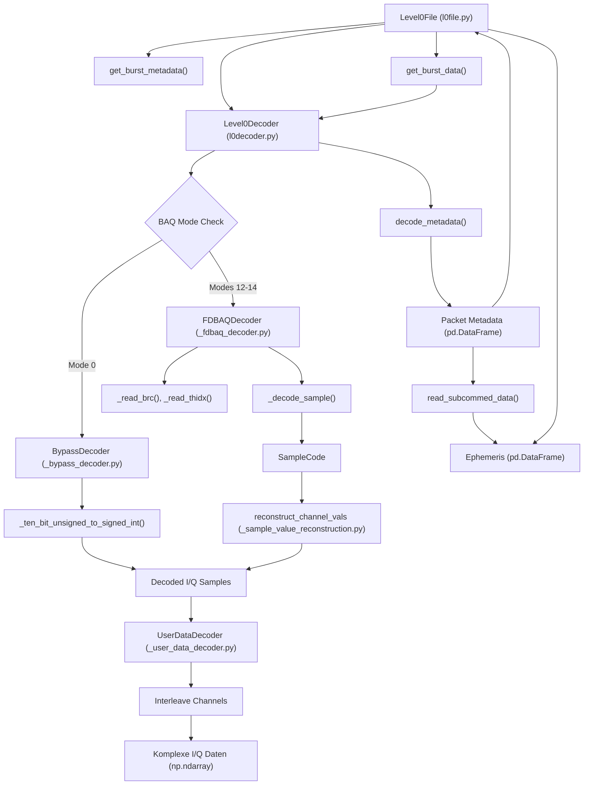

# Rich-Hall/sentinel1decoder

## GitHub & DeepWiki
- GitHub: https://github.com/Rich-Hall/sentinel1decoder
- DeepWiki: https://deepwiki.com/Rich-Hall/sentinel1decoder

## Kurze Einführung
Das `sentinel1decoder`-Repository bietet eine Python-Implementierung zur Dekodierung von Sentinel-1 Level 0-Dateien, die die Rohdaten der Sentinel-1-Raumfahrzeuge enthalten. Es extrahiert die I/Q-Sensorausgabe des SAR-Instruments, welche für die weitere Verarbeitung zur Erstellung von SAR-Bildern genutzt werden kann. Die Bibliothek richtet sich an Entwickler und Wissenschaftler, die mit Sentinel-1-Rohdaten arbeiten und diese in ein nutzbares Format umwandeln müssen. 

## Die 3 wichtigsten (oder komplexesten) Algorithmen

### 1. Dekodierung von 10-Bit-Samples im Bypass-Modus
- **Name & Verortung im Code**: `_ten_bit_unsigned_to_signed_int` Funktion und `BypassDecoder` Klasse in `src/sentinel1decoder/_bypass_decoder.py`.  
- **Detaillierte technische Funktionsweise**: Im Bypass-Modus (BAQ Mode 0) werden die Radarsamples als 10-Bit-Werte ohne Kompression gespeichert.  Die Funktion `_ten_bit_unsigned_to_signed_int` wandelt diese 10-Bit-Werte, die als vorzeichenlose Ganzzahlen vorliegen, in standardmäßige vorzeichenbehaftete Ganzzahlen um.  Dabei wird das 9. Bit als Vorzeichenbit (1 für negativ, 0 für positiv) interpretiert und die restlichen 9 Bits repräsentieren den Betrag.  Die `BypassDecoder`-Klasse ist für die Extraktion dieser 10-Bit-Samples aus einem Roh-Byte-Stream verantwortlich.  Sie verarbeitet die Daten kanalweise (I-Even, I-Odd, Q-Even, Q-Odd), indem sie Gruppen von 5 Bytes liest und daraus jeweils vier 10-Bit-Samples mittels Bit-Operationen extrahiert. 
- **Warum prägend**: Dieser Algorithmus ist prägend, da er die Grundlage für die Dekodierung der unkomprimierten Rohdaten bildet, die für maximale Datenintegrität und -treue entscheidend sind.  Die präzise Bit-Manipulation zur Extraktion der 10-Bit-Werte aus dem Byte-Stream ist komplex und fehleranfällig, aber essenziell für die korrekte Rekonstruktion der Radarsignale. 

### 2. FDBAQ Huffman-Dekodierung
- **Name & Verortung im Code**: `FDBAQDecoder` Klasse in `src/sentinel1decoder/_fdbaq_decoder.py`.  Die Huffman-Bäume sind als Tupel `_TREE_BRC_ZERO` bis `_TREE_BRC_FOUR` definiert. 
- **Detaillierte technische Funktionsweise**: Für BAQ-Modi 12-14 wird die Flexible Dynamic Block Adaptive Quantization (FDBAQ) verwendet, die Huffman-Kodierung nutzt.  Die `FDBAQDecoder`-Klasse extrahiert `SampleCode`-Objekte, die ein Vorzeichenbit und einen Huffman-kodierten Magnitudencode (`mcode`) enthalten.  Die Dekodierung erfolgt blockweise (typischerweise 128 Samples pro Block).  Für jeden Block werden ein Bit Rate Code (BRC) und ein Threshold Index (THIDX) gelesen.  Der BRC bestimmt, welcher der vordefinierten Huffman-Bäume (`_HUFFMAN_TREES`) für die Dekodierung der Samples in diesem Block verwendet wird.  Die Methode `_decode_sample` traversiert den entsprechenden Huffman-Baum Bit für Bit, um den Magnitudencode zu erhalten. 
- **Warum prägend**: Dieser Algorithmus ist entscheidend für die Verarbeitung der komprimierten Sentinel-1-Daten.  Die Verwendung von Huffman-Kodierung ermöglicht eine effiziente Speicherung der Daten, erfordert aber eine komplexe Dekodierungslogik mit variabler Bitlänge und baumartigen Datenstrukturen.  Die korrekte Auswahl und Traversierung der Huffman-Bäume ist fundamental für die genaue Rekonstruktion der Sample-Codes. 

### 3. Rekonstruktion von Sample-Werten
- **Name & Verortung im Code**: `reconstruct_channel_vals` Funktion in `src/sentinel1decoder/_sample_value_reconstruction.py`. 
- **Detaillierte technische Funktionsweise**: Nach der Huffman-Dekodierung im FDBAQ-Modus liegen die Daten als `SampleCode`-Objekte vor.  Die Funktion `reconstruct_channel_vals` nimmt diese `SampleCode`-Objekte zusammen mit den BRC- und THIDX-Werten der entsprechenden Blöcke entgegen.  Basierend auf dem BRC und THIDX wird eine spezifische Logik angewendet, um den endgültigen numerischen Wert des Samples zu berechnen.  Dies beinhaltet oft die Multiplikation des Magnitudencodes mit einem Skalierungsfaktor (`lookup.sf[thidx]`) oder die Verwendung von Nachschlagetabellen (`lookup.b0`, `lookup.nrl_b0` etc.), die von BRC und THIDX abhängen.  Das Vorzeichen des Samples wird durch das `sign`-Attribut des `SampleCode`-Objekts bestimmt. 
- **Warum prägend**: Dieser Algorithmus ist entscheidend, da er die abstrakten Huffman-dekodierten `SampleCode`-Werte in tatsächliche, physikalisch sinnvolle I/Q-Sample-Werte umwandelt.  Die Komplexität liegt in der Vielzahl der Fallunterscheidungen basierend auf BRC und THIDX, die jeweils unterschiedliche Rekonstruktionsformeln und Nachschlagetabellen erfordern.  Eine fehlerhafte Implementierung hier würde direkt zu inkorrekten Radardaten führen.

## Architektur & Zusammenspiel

         

Die Hauptkomponente ist die Klasse `Level0File`, die eine Sentinel-1 Level 0-Datei kapselt und den Zugriff auf Metadaten und dekodierte Daten in "Bursts" organisiert.  Sie verwendet intern einen `Level0Decoder`, um die Rohdaten zu verarbeiten.  Der `Level0Decoder` liest die Datei, extrahiert primäre und sekundäre Header-Informationen und delegiert die Dekodierung der Nutzdaten an die `UserDataDecoder`-Klasse.   Die `UserDataDecoder`-Klasse wählt basierend auf dem `BAQ Mode` entweder den `BypassDecoder` für unkomprimierte Daten oder den `FDBAQDecoder` für Huffman-kodierte Daten.   Der `BypassDecoder` nutzt `_ten_bit_unsigned_to_signed_int` zur direkten Umwandlung von 10-Bit-Samples.  Der `FDBAQDecoder` extrahiert `BRCs` und `THIDXs` und dekodiert `SampleCode`-Objekte mittels Huffman-Bäumen.   Diese `SampleCode`-Objekte werden dann von `reconstruct_channel_vals` in tatsächliche I/Q-Werte umgewandelt.  Schließlich werden die vier Kanäle (I-Even, I-Odd, Q-Even, Q-Odd) von `UserDataDecoder` zu komplexen I/Q-Samples verschachtelt. 

## Notes
Das Repository verwendet `numpy` für effiziente numerische Operationen und `pandas` für die Verwaltung von Metadaten, insbesondere für die Organisation von Paket-Metad

Wiki pages you might want to explore:
- [User Data Decoding (Rich-Hall/sentinel1decoder)](/wiki/Rich-Hall/sentinel1decoder#3.3)
- [Data Formats and Compression (Rich-Hall/sentinel1decoder)](/wiki/Rich-Hall/sentinel1decoder#4)
- [Bypass Mode (BAQ Mode 0) (Rich-Hall/sentinel1decoder)](/wiki/Rich-Hall/sentinel1decoder#4.1)

View this search on DeepWiki: https://deepwiki.com/search/zielrepository-richhallsentine_2ce10d9a-3441-41d9-bf38-bd050080d629
