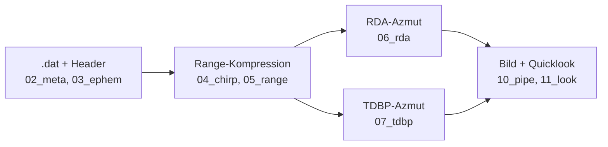

# Implementierungsplan: GPU-SAR-Fokussierung (`sar_focus`)

Stand: 2026-10-04. Ziel: Aus den dekodierten Sentinel-1-Rohdaten
(Stripmap S6, VV) ein fokussiertes Slant-Range-Bild rechnen — CPU-Referenz
und GPU-Lösung mit quantitativem Vergleich, plus PNG-Quicklook.

Kette: `.dat` → Dekompression (Decoder als Lib) → Range-Kompression
(Matched Filter, FFT) → Azimut-Fokussierung (RDA **und** TDBP) → dB-Bild.

## 1. Kontextquellen (Leseliste für einen unabhängigen Agenten)

Jede Quelle mit Pfad (relativ zum Repo-Root `cl-rust-generator/`) und
warum sie nötig ist. Reihenfolge = Einarbeitungsreihenfolge.

### 1.1 Aufgabe und Referenzen (Plan-Ordner)

| Datei | Warum lesen |
|---|---|
| `examples/34_copernicus_radar/plan/20261004_02_gpu_decode_sar/prompt.txt` | Der Auftrag: Umfang, MVP-Vereinfachungen, Tests, Doku-Regeln |
| `examples/34_copernicus_radar/plan/20261004_02_gpu_decode_sar/l0-processing.md` | SentiWiki-Auszug: L0/L1-Kette, BAQ5 für Noise/Cal, Range-Doppler mit hyperbolischer Range-Gleichung, RCMC in Range-/Azimut-Frequenz |
| `examples/34_copernicus_radar/plan/20261004_02_gpu_decode_sar/l0-processor-github.md` | DeepWiki-Steckbriefe zu `dm6718/RITSAR` (Backprojection-Familie, `phs`+`platform`-Rezept) und `sirbastiano/SSFocus` (Filterformeln, Chunking, Torch-GPU-Vorbild) |

### 1.2 Decoder (wird als Bibliothek wiederverwendet)

| Datei | Warum lesen |
|---|---|
| `examples/34_copernicus_radar/plan/20261004_01_rust_port/walkthrough.md` | Was der Decoder tut: Paketformat, FDBAQ, `.cf`-Layout, `data_delay`-Ausrichtung, Volkszählung 44901/16/520 |
| `examples/34_copernicus_radar/src/header.rs` | Alle 54 Header-Felder + abgeleitete Größen (`tx_ramp_rate`, `tx_pulse_start_frequency`, `tx_pulse_length_us`, `swst_us`, `data_delay`, `time_relative`) — speisen Range-Filter und `slant_range_vec` |
| `examples/34_copernicus_radar/src/main.rs` | Decode-Schleife als Vorlage: Beam-Wahl, `data_delay`-Fenster (`n0`), Dispatch nach `baq_mode`, `.cf`-Schreibweise |
| `examples/34_copernicus_radar/src/utils.rs` | `FREF = 37.53472 MHz`, `BitReader`, Rekonstruktionsgesetz |
| `examples/34_copernicus_radar/src/sub_commutated.rs` | **Achtung, Bug (s. §4.3):** liest Positionen little-endian — Ephemeriden müssen big-endian dekodiert werden (siehe sentinel1decoder-Vorbild) |
| `examples/34_copernicus_radar/Cargo.toml` | Lib-Name `copernicus-radar` für die Pfad-Dependency |

### 1.3 GPU-TDBP-Vorbild (Muster + Fallstricke)

| Datei | Warum lesen |
|---|---|
| `examples/32_cuda-rust/plan/20261004_01_sar_tdbp/walkthrough.md` | **Pflichtlektüre:** Kernel-ABI, Upload-einmalig, `pulse_limit`-Apertur, Nadir→Seitenblick, Azimut-Abtasttheorem, „Nahbereich oben“, ungerade Test-Grids, eigener `Complex32`, libdevice-Rundung, GPU-vs-CPU-Tabelle (2,4·10⁻⁴) |
| `examples/32_cuda-rust/sar_tdbp/src/01_types.rs` | `Complex32`/`Vec3` (`repr(C)` + `DeviceCopy`), dB-Skalierung, Turbo-Colormap |
| `examples/32_cuda-rust/sar_tdbp/src/03_simulator.rs` | Punktziel-Simulation (Sinc-Echo + Trägerphase), Zeitachsen-Bestimmung |
| `examples/32_cuda-rust/sar_tdbp/src/04_kernel.rs` | TDBP-Mathematik CPU + `#[kernel]` (1D-Grid, `DisjointSlice`), PSF-/Kohärenz-Tests |
| `examples/32_cuda-rust/sar_tdbp/src/05_pipeline.rs` | `SarPipeline` (Upload einmalig, `run(limit)`), PNG/ASCII-Ausgabe, Benchmark-Gerüst |
| `examples/32_cuda-rust/sar_tdbp/Cargo.toml` + `rust-toolchain.toml` | Exakte `cuda-oxide`-Revision (`a0cc6cc…`) und Nightly-Pin (`nightly-2026-08-28`) — übernehmen |

### 1.4 Externe Referenzen (öffentlich, via DeepWiki/Web recherchiert)

| Quelle | Befund (verifiziert) |
|---|---|
| `sirbastiano/SSFocus`, `SARProcessor/focus.py` | Einsatzbereite Filter: Chirp-Replika `exp(2jπ(φ₁t+φ₂t²))`, `φ₁=TXPSF+TXPRR·TXPL/2`, `φ₂=TXPRR/2`; `slant_range_vec=(rank·PRI+fast_time)·c/2` mit `suppressed=320/(8·F_REF)`; RCMC-Phasenfilter `exp(4jπ·f_r·R₀(1/D−1)/c)` (**phasenrein, keine Interpolation**); Azimut-Filter `exp(4jπ·R·D/λ)`; D-Faktor `√(1−λ²f_a²/4v²)`; Chunking via `get_partition` |
| `rich-hall/sentinel1decoder`, `constants.py`/`utilities.py`/`_metadata_parser.py`/`enums.py` | `F_REF=37.53472224 MHz`, `TX=5.405 GHz`, `c`, WGS84-Achsen; Roh→physikalisch: `PRI/SWST/SWL/TXPL = raw/F_REF`, `TXPRR=±mag·F_REF²/2²¹`, `TXPSF=TXPRR/4F_REF ± mag·F_REF/2¹⁴`; `RGDEC→fs`: `fs=(L/M)·4·F_REF`, RGDEC 9 = (5,16) → **46.918 MHz**; **Ephemeriden big-endian**: Positionen 3×`>f8`, Speeds 3×`>f4`, 1-basiert ab SubCom-Index 1 |
| `dm6718/RITSAR`, `ritsar/imgTools.py` | `phs` = `[npulses × nsamples]`, `platform`-Dict (`pos`, `f_0`, `chirprate`, `k_r`, `R_c`), lineare Range-Interpolation — direkt auf unser `.cf` + Ephemeriden abbildbar |
| `ejmahler/RustFFT` (DeepWiki) | `FftPlanner`, `num_complex::Complex32`, `process()` in-place, Normierung manuell (`1/N` nach vor+rück) — CPU-FFT |
| `coreylowman/cudarc` (DeepWiki) | **Kein cuFFT-Binding** — daher minimales eigenes cuFFT-FFI (s. §3.4) statt cudarc |
| crates.io | `rustfft 6.4.1`, `ndarray 0.17.2`, `image 0.25` (aktuellste, Stand 2026-10-04) |
| `*-annot.dat`-XSD (`support/s1-level-0-annot.xsd` im SAFE-Zip) | **Kein Orbit darin** (nur Sense/Downlink-Zeiten + Längen) — Ephemeriden kommen aus den SubCom-Worten der `.dat`-Header |

### 1.5 Daten (niemals committen!)

`examples/34_copernicus_radar/data/`: `S1C_S6_RAW__0SDV_…SAFE.zip`
(~1,2 GB), `vv/*.dat` (VV, 602 MB), `vv/*-annot.dat` (nur Zeiten),
`vv/*-index.dat`, Referenz-Screenshot `2026-10-04-220713_467x696_scrot.png`
(Santos/São Paulo: Schiffe = helle Punkte im Meer, Küste, Stadt/Wald).
Eckwerte (gemessen): 45.437 Pakete, PRF ≈ 1663 Hz, `TXPL=51.1 µs`,
Chirp-Bandbreite ≈ 42.2 MHz, `fs=46.918 MHz`, Slant-Near ≈ 914 km,
Orbitradius 7080 km, |v| ≈ 7589 m/s.

## 2. Architektur des neuen Crates `sar_focus`

Lage: `examples/34_copernicus_radar/sar_focus/` (eigene `[workspace]`,
eigener `rust-toolchain.toml`-Pin wie `sar_tdbp`, Direktrust, kein
Transpiler). Module nummeriert in Datenflussreihenfolge, ≤ ~300 Zeilen,
`lib.rs`/`main.rs` nur Deklaration + Verdrahtung.

| Modul | Inhalt |
|---|---|
| `01_types` | Eigener `Complex32`/`Vec3` (`repr(C)`+`DeviceCopy`, sar_tdbp-Muster), Konstanten (`F_REF`, `c`, 5.405 GHz, WGS84), Fehlertyp |
| `02_meta` | Header→physikalisch (Formeln aus sentinel1decoder, gegen `header.rs` geprüft), `RGDEC→fs`-Tabelle, `slant_range_vec`, Zeiten |
| `03_ephem` | **Korrekte** BE-Ephemeriden aus SubCom-Worten + lineare Interpolation auf Pulszeiten + effektive Geschwindigkeit (SSFocus-Formel) + geometrischer Doppler-Centroid |
| `04_chirp` | Ideale Chirp-Replika (SSFocus-Formel) + Range-Matched-Filter `conj(FFT)` |
| `05_range` | Range-Kompression CPU (`rustfft`, Zeilen-FFT·Filter→iFFT) + FFT-Helfer |
| `06_rda` | RDA-Azmut CPU: D-Faktor, RCMC-Phasenfilter, Azimut-Filter, 2D-Fluss (exakte DFT-Frequenzraster statt `linspace`-Quirk) |
| `07_tdbp` | TDBP CPU-Referenz (f64-Geometrie, gerade Bahn + Ephemeriden-Bahn, range-komprimierter Input) |
| `08_cufft` | Minimales cuFFT-FFI (`Plan1d/Many`, `ExecC2C`, `SetStream`, `Destroy`) auf `cuda-oxide`-Buffern (`cu_deviceptr`/`cu_stream`; Primary-Context → interop-sicher) |
| `09_kernel` | `cuda-oxide`-Kernel: komplexe Elementmultiplikation (Filter), TDBP (**f64**-Geometrie/Phase wegen ~900 km — dokumentierte Abweichung von sar_tdbp-f32) |
| `10_pipe` | GPU-Pipeline (Upload einmalig, Chunking in Azimut) + CPU-Spiegel + Vergleich (max. rel. Abw.) + Benchmark |
| `11_look` | dB + Colormap + PNG + ASCII + Kennzahlen (Energie/Kontrast, Schiffs-PSF/FWHM) |
| `main` | CLI: `.dat`→(Dekodierung via `copernicus-radar`-Lib)→Chunk-Fokus (CPU/GPU)→`.cf`+PNG; `--bench`, `--compare` |

Abhängigkeiten (minimal, aktuellste): `copernicus-radar` (Pfad),
`rustfft 6.4`, `num-complex 0.4`, `image 0.25` (nur `png`),
`cuda-oxide`-Trio (exakte sar_tdbp-Revision). **Kein** `ndarray`
(flache `Vec`s wie sar_tdbp genügen), **kein** `cudarc` (kein cuFFT),
**keine** cuFFT-Alpha-Crates (lieber 60 Zeilen stabiles FFI gegen
`libcufft.so.12` aus dem vorhandenen CUDA-Toolkit 13.x).

## 3. Implementierungsreihenfolge (Phasen)

1. **Gerüst:** Crate-Anlage, Toolchain-Pin, `build.rs` (cuFFT-Link),
   `01_types` + `02_meta` mit Unit-Tests (Orakelwerte aus sentinel1decoder).
2. **CPU-Range:** `03_ephem`, `04_chirp`, `05_range`; Physik-Test
   synthetischer Chirp→Peak; Filter-Gegenprobe vs. SSFocus-Formeln.
3. **CPU-Azmut:** `06_rda` (2D-Punktziel→Fokus, PSF vs. Theorie),
   `07_tdbp` (Peak/Kohärenz wie sar_tdbp, gerade vs. Ephemeriden-Bahn).
4. **GPU:** `08_cufft`, `09_kernel`, `10_pipe`; GPU-vs-CPU-Schranken
   (Ziel ≤ 10⁻³ wie TDBP); Benchmark-Tabelle.
5. **E2E:** `11_look` + `main`; Fokus auf VV-Echtdaten (Chunk, dann
   Streaming); Quicklook vs. Referenz-Screenshot (Strukturvergleich);
   Schiffs-PSF (FWHM, Sidelobes); `.cf` + PNG-Artefakte.
6. **Gates + Doku:** `cargo test`, `clippy --all-targets -- -D warnings`,
   `fmt --check` (via `cargo oxide …` wo nötig); `walkthrough.md`
   (deutsch, Mermaid, Code-Beispiele, Glossar, Artefakt-Links),
   `plan_effort.md` (Token-Verbrauch).

## 4. Festgelegte Entscheidungen (vom Plan abweichend, begründet)

1. **RDA statt CSA als Frequenz-Arm.** SSFocus-RCMC ist ein reiner
   Phasenfilter (keine Interpolation) und damit GPU-freundlich; CSA wäre
   Neuland ohne validierte Referenz. RDA-Formeln sind 1:1 gegenprobefähig.
2. **Kein Geokodieren/TOPSAR/Kalibrierung** (Nicht-Ziele aus dem Prompt).
   Nur VV, Slant-Range, idealer Chirp (keine Kalibrier-Replika).
3. **Ephemeriden-Bug im Decoder wird nicht dort gefixt**, sondern korrekt
   in `03_ephem` implementiert (BE, 1-basiert) und im Walkthrough als
   Upstream-Befund dokumentiert — minimaler Eingriff, kein Risiko für
   bestehende Decoder-Tests.
4. **TDBP-Kernel in f64-Geometrie:** Bei ~900 km Schrägentfernung verliert
   f32 die Phase (2·10⁸ rad); sar_tdbp-f32 gilt nur für Labormaße.
5. **Frequenzraster exakt** (`(i−N/2)·fs/N`) statt SSFocus-`linspace`
   (inklusive Nyquist-Doppelung) — mathematisch das korrekte DFT-Raster.
6. **Doppler-Centroid geometrisch** aus Ephemeriden (S1 steuert auf
   Null-Doppler; SSFocus braucht gar keinen expliziten DC) — datengetrieben
   nur bei sichtbarer Azimut-Schmierung.

## 5. Testplan (Kurzfassung; Details im Prompt)

Physik (CPU, synthetisch) → GPU-vs-CPU (Pflicht, Schranke) →
Filter-Gegenprobe (SSFocus-Wertevergleich) → E2E-Echtdaten (Kennzahlen +
Quicklook-Artefakt, Schiffs-PSF) → Gates. Tests ohne Datensatz grün
(`S1_DAT`-Skip wie `real_data.rs`). Datensatz niemals committen.

## 6. Commit-Regeln (strikt)

- **Format:** Conventional Commits, **eine logische Änderung pro Commit**:
  `feat(sar-focus): …`, `fix(sar-focus): …`, `test(sar-focus): …`,
  `docs(sar-focus): …`, `plan(sar-focus): …`.
- **Body (Pflicht):** Was + Warum in 3–8 Zeilen: Motivation, wichtigste
  Entscheidung, Messwert/Testevidenz (z. B. „GPU-vs-CPU 3.1e-4“),
  bekannte Einschränkung. Keine Einzeiler-Commits ohne Body.
- **Sprache:** Englisch für Subject, Body Englisch oder Deutsch.
- **Reihenfolge:** Erst Code + Tests grün (`test`/`clippy`/`fmt`), dann
  Commit; Walkthrough/Artefakte (`*.png`, `*.cf`) nur in `docs`-Commits,
  **niemals** Rohdaten (`.dat`/`.zip`) committen.
- **Kein Push ohne Aufforderung** — Commits bleiben lokal bis zur Freigabe.
