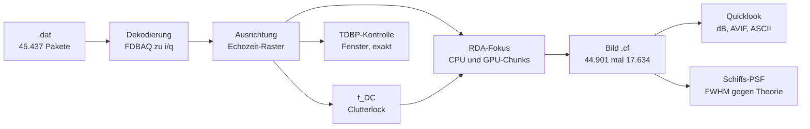
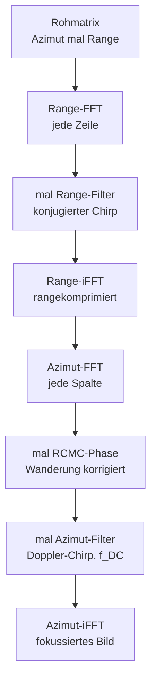
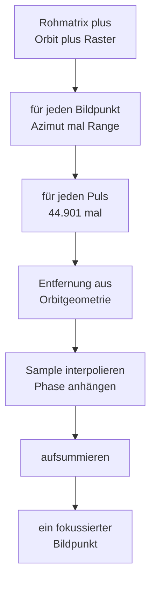

# Walkthrough: Vom Satelliten-Rohsignal zum scharfen Radarbild

Dieses Dokument erzählt, wie aus den Rohdaten des Radarsatelliten
Sentinel-1C ein fokussiertes Bild der Erdoberfläche wird — zweimal
gerechnet (einmal auf der Zentraleinheit, englisch Central Processing
Unit (CPU), einmal auf der Grafikkarte, englisch Graphics Processing
Unit (GPU)), quantitativ verglichen und auf Echtdaten verifiziert.

**Leseanleitung.** Der Text holt auch ohne Radar-Vorwissen ab: Jedes
Fachwort wird bei seiner ersten Verwendung ausgeschrieben und erklärt
(ein Glossar in Kapitel 9 fasst alles noch einmal zusammen). Wer es
eilig hat, liest Kapitel 1 (die Idee in fünf Minuten) und schaut sich
das Übersichtsbild an. Wer es genau wissen will, folgt den Daten von
der ZIP-Datei (Kapitel 2) über die zwei Fokus-Verfahren (Kapitel 3)
bis zum vermessenen Ergebnis (Kapitel 6 und 7).

## 1. Worum geht es? Die Idee in fünf Minuten

Stellen Sie sich ein Echolot auf einem Schiff vor: Es sendet einen
Schallpuls nach unten und misst, wann das Echo zurückkommt — daraus
folgt die Wassertiefe. Ein Radar mit synthetischer Apertur, englisch
Synthetic Aperture Radar (SAR), ist das gleiche Prinzip, nur vom
Satelliten aus, mit Radiowellen statt Schall, und mit einem Trick für
scharfe Bilder.

Sentinel-1C fliegt in rund 700 Kilometern Höhe mit etwa 7,5 Kilometern
pro Sekunde und sendet dabei tausende Male pro Sekunde einen
Radar-Puls zur Erde. Jeder Puls ist ein sogenannter Chirp: ein Ton,
dessen Frequenz während des Pulses ansteigt (hier 42,19 Megahertz
Bandbreite in rund 51 Mikrosekunden). Das Echo jedes Pulses enthält
die überlagerten Antworten **aller** beleuchteten Ziele — Küste,
Schiffe, Wellen — als einziges verrauschtes Summen-Signal. Stapelt
man 44.901 solcher Echos untereinander, erhält man das Rohbild: ein
Zahlenfeld, in dem noch nichts zu erkennen ist, weil jedes Ziel seine
Energie über tausende von Echos verschmiert hat.

Die Fokussierung macht diese Verschmierung rückgängig. Physikalisch
ist sie eine Sortierung: Für jedes Ziel ist bekannt, wie sich seine
Entfernung zum Satelliten während des Vorbeiflugs ändert (erst
näherkommend, dann entfernend — eine Hyperbel in der Zeit). Ein
Matched-Filter — ein Filter, das genau auf dieses erwartete Muster
abgestimmt ist — sammelt die verteilte Energie jedes Ziels wieder an
seinem Ort ein. Derselbe Gedanke gilt in beiden Bildrichtungen: in
Range-Richtung (Schrägentfernung Satellit–Ziel, die Bildspalten)
sammelt die Range-Kompression den Chirp ein, in Azimut-Richtung
(Flugrichtung, die Bildzeilen) sammelt der Azimut-Fokus die
Doppler-Signatur ein.

Wir haben diese Sortierung auf zwei Arten implementiert: Der
Range-Doppler-Algorithmus, englisch Range-Doppler Algorithm (RDA),
rechnet im Frequenzbereich mit schnellen Fourier-Transformationen,
englisch Fast Fourier Transforms (FFT) — schnell und gut genug. Die
Zeitbereichs-Rückprojektion, englisch Time-Domain Backprojection
(TDBP), rechnet Puls für Puls geometrisch exakt nach — langsam, aber
ohne jede Näherung. Die TDBP ist damit der Schiedsrichter, der die
RDA-Näherung kontrolliert. Und beide Verfahren laufen doppelt: als
schlichte CPU-Referenz und als GPU-Pipeline. Jede GPU-Rechnung steht
gegen die CPU-Rechnung — stimmen beide bis auf winzige
Rundungsfehler überein, ist das ein starkes Indiz, dass kein
Programmfehler, sondern Physik im Spiel ist.



## 2. Die Daten: Von der ZIP-Datei zum Zahlenfeld

### 2.1 Was der Dateiname verrät

Unser Datensatz heißt (in der offiziellen Copernicus-Schreibweise):

`S1C_S6_RAW__0SDV_20260929T214300_20260929T214327_009667_0133F4_5830.SAFE.zip`

Jeder Block trägt eine Information. `S1C` steht für Sentinel-1C, den
dritten Satelliten der Sentinel-1-Reihe. `S6` ist der Stripmap-Beam
S6: Im Stripmap-Modus schaut die Antenne starr seitlich nach unten
und zieht einen festen Bodenstreifen entlang der Flugbahn — S6 ist
einer von sechs solchen Streifen mit festem Blickwinkel. `RAW` heißt:
Level-0-Rohprodukt, also unfokussierte Echos direkt vom Instrument,
noch kein Bild. Die Gruppe `0SDV` enthält die Verarbeitungsstufe `0`
(Rohdaten), die Produktklasse und mit `DV` die
Dual-Polarisation: Der Datensatz liefert zwei Polarisationskanäle,
VV (vertikal gesendet, vertikal empfangen) und VH (vertikal gesendet,
horizontal empfangen). Danach folgen Start- und Stoppzeit der
Aufnahme: 27 Sekunden in der Nacht des 29. September 2026,
21:43:00 bis 21:43:27 Uhr UTC. `009667` ist die absolute Orbitnummer
(der wievielte Erdumlauf seit Missionsbeginn), `0133F4` die Kennung
der Datenaufnahme (hexadezimal) und `5830` ein Produktzähler, der das
Produkt eindeutig macht. `SAFE` schließlich steht für Standard Archive
Format for Europe, das Copernicus-Archivformat — technisch ein ZIP mit
festem Innenleben.

Die eigentliche Arbeitsdatei trägt denselben Namen in Kleinbuchstaben
mit Bindestrichen und verrät zusätzlich Kanal und Inhalt:

`s1c-s6-raw-s-vv-…-009667-0133f4.dat`

Das `s` steht für Stripmap, `vv` für den verwendeten
Polarisationskanal (vertikal/vertikal). Die Endung `.dat` ohne Zusatz
heißt: Hier liegen die Echopakete selbst — 631 Megabyte an
komprimierten Rohdaten.

### 2.2 Was im ZIP steckt (11 Dateien, eine wird verwendet)

Ein Blick ins Archiv (ohne es zu entpacken, per `unzip -l`) zeigt
1.247 Megabyte in 11 Dateien:

| Datei im ZIP | Größe | Verwendung |
|---|---|---|
| `…-report-….pdf` | 110 KB | Qualitätsbericht des Bodensegments, nur Doku |
| `manifest.safe` | 17 KB | Inhaltsverzeichnis des Archivs |
| `…-vh-….dat` + `-annot.dat` + `-index.dat` | 613,7 MB | Horizontal-Kanal (ungenutzt, MVP ist VV) |
| `…-vv-….dat` + `-annot.dat` + `-index.dat` | 631,2 MB | Vertikal-Kanal — **nur die `.dat` wird gelesen** |
| `support/*.xsd` (3 Schemata) | 38 KB | XML-Schemata der Annotation |

Die `.dat`-Datei ist eine schlichte Aneinanderreihung von
Weltraum-Paketen (Space Packets nach CCSDS-Norm): Jedes Paket trägt
einen Kopf (Header) mit rund 50 Feldern — darunter Sendezeit,
Pulswiederholrate, Fensterposition und Orbit-Hilfsdaten — und danach
die komprimierten Echoproben. Die Geschwisterdateien `-annot.dat`
(1,18 MB Annotationsdaten) und `-index.dat` (1,7 KB Paketindex) liest
unser Decoder nicht: Er sammelt die Paketköpfe selbst ein und braucht
keinen Index. Das `-vh`-Triple (der Horizontal-Kanal) bleibt
ebenfalls liegen — der Minimalumfang (Minimum Viable Product, MVP)
dieses Projekts ist bewusst der VV-Kanal.

Weder das ZIP (1,25 GB) noch die `.dat` (631 MB) gehören ins
Repository — sie sind groß, binär und öffentlich nachladbar. Das
Repository enthält nur Code, Tests, diesen Text und zwei kleine
Bild-Artefakte (45 und 40 Kilobyte, siehe Kapitel 7).

### 2.3 Was der Decoder aus der `.dat` holt

Der erste Programmlauf (`meta`, siehe Kapitel 5) zählt, ohne ein
einziges Echo zu entpacken: 45.437 Pakete, davon 44.901 abbildende
Echos, 16 Rauschpakete und 520 Kalibrierpakete — bei null
Dekodierfehlern. Nur die 44.901 Echos des stärksten Elevations-Beams
(hier Beam 5) werden fokussiert; Kalibrier- und Rauschpakete dienen
der Instrumentenüberwachung und werden aussortiert.

Pro Echo liest der Decoder aus dem Paketkopf die Metadaten, die alles
Weitere steuern: die Pulswiederholrate, englisch Pulse Repetition
Frequency (PRF) (rund 1.660 Hz — so oft pro Sekunde sendet das
Radar), ihr Kehrwert PRI (die Zeit zwischen zwei Pulsen), die
Fensterposition SWST (Sampling Window Start Time — ab wann nach dem
Puls das Empfangsfenster öffnet), den Rang (in welche Pulspause das
Echo fällt), die Chirp-Parameter (Dauer TXPL, Steigung TXPRR) und den
BAQ-Modus (Block-Adaptive Quantisierung — das Kompressionsverfahren
der Rohdaten: Die Modi 12/13/14 tragen Flexible-BAQ mit
Bitraten-Code pro Block, die Modi 3/4/5 feste BAQ-Raten, Modus 0
ist unkomprimierter Bypass). Dazu kommen sub-kommutierte Hilfsdaten:
kleine Häppchen (je 2 Byte), über viele Paketköpfe verteilt, die
zusammengesetzt die Orbitposition und -geschwindigkeit des Satelliten
(Ephemeriden) ergeben.

Die eigentliche Entpackung kehrt die BAQ-Kompression Block für Block
um und fädelt die vier ADC-Kanäle (IE/IO/QE/QO — gerade/ungerade
Abtastwerte von Inphase- und Quadratur-Signal) zu komplexen Proben
zusammen (gerade: IE + i·QE, ungerade: IO + i·QO). Ergebnis pro Echo:
rund 20.000 komplexe Zahlen — eine Zeile des Rohbilds.

Ein Wort zur 512-Echo-Grenze, die im Decoder-Code als Default
auftaucht: Sie stammt aus dem C-Vorgängerprojekt als
Schutzgrenze (`--max-echoes`, Default 512) und begrenzt dort, wie
viele Echos **gespeichert** werden. Unsere Fokus-Pipeline nutzt eine
eigene Auswahlfunktion (`ingest::select_beam_echoes` in Modul 12),
die **alle** Echos des gewählten Beams nimmt — das E2E-Protokoll
beweist 44.901 verarbeitete Echos, und ein Regressionstest mit 600
synthetischen Echos stellt sicher, dass kein 512er-Limit je wieder
hineinrutscht.

### 2.4 Wo Fehler korrigiert werden

Rohdaten sind nie so sauber, wie das Lehrbuch es gern hätte. Sechs
Stellen in der Pipeline reparieren systematische Fehler — jede mit
einem Messwert belegt:

Erstens das Zeitraster. Jedes Echo trägt einen `data_delay`-Zähler,
der angibt, wo sein Fenster im Empfangsschema liegt — doch dieser
Zähler driftet über den 27-Sekunden-Rahmen um 16 Abtastwerte.
Stattdessen rechnen wir die Fensterposition aus physikalischer Zeit
(Rang·PRI + SWST) in Samples um; der Restfehler schrumpft auf maximal
0,25 Samples (Protokollzeile: „Raster-Rest max. 0,250 Samples").

Zweitens der Orbitrahmen. Die Ephemeriden aus den Hilfsdaten gelten
im erdfesten System ECEF (Earth-Centered, Earth-Fixed — rotiert mit
der Erde mit). Die Fokus-Geometrie braucht aber die
trägheitsfeste (inertiale) Geschwindigkeit — also wird die
Erdrotation herausgerechnet (`v + ω×r`). Der Beleg: Erst die
korrigierte Geschwindigkeit (7.501,6 m/s) erfüllt die
Bahngleichung (vis-viva: 7.503,3 m/s); der Rohwert (7.589 m/s) läge
1,1 Prozent daneben und würde das Bild um rund 9 Radiant
defokussieren.

Drittens die Dopplermitte f_DC (Doppler-Centroid — die mittlere
Dopplerfrequenz des Bodenechos). Die geometrische Rechnung liefert
154–163 Hz, doch sie kennt die Yaw-Steuerung der Antenne nicht und
misst daneben (ausführlich in Kapitel 8, Fund 3). Verwendet wird
stattdessen der Clutterlock-Wert aus den Daten selbst: 5–18 Hz,
median-geglättet.

Viertens die FFT-Längen. Die natürliche Spaltenzahl 20.015 zerfällt
in 5·4003 — und cuFFT (NVIDIAs FFT-Bibliothek) scheitert daran mit
einem internen Fehler. Die Pipeline rundet daher auf 7-glatte Längen
auf (nur kleine Primfaktoren): 20.031 plus Padding ergibt 20.160 —
das heilt den Fehler und beschleunigt nebenbei (Radix- statt
Bluestein-Algorithmus).

Fünftens der Wrap-Rand. Die zyklische Faltung der Range-Kompression
verschmiert eine Chirplänge (2.397 Spalten) am linken Bildrand;
diese Spalten werden nach dem Fokus beschnitten (Ausgabe-Raster
44.901 × 17.634 statt × 20.160).

Sechstens die Bildspreizung. Der Quicklook skaliert nicht auf
Minimum/Maximum (ein einziger RFI-Störer — Radio Frequency
Interference, Funkstörung durch Bodenradare — würde das ganze Bild
ausbleichen), sondern auf Perzentile der Helligkeitsverteilung. So
bleiben Ozean, Küste und Land sichtbar, obwohl einzelne Zeilen
millionenfach heller sind.

### 2.5 Welche Zwischenergebnisse entstehen

Auf dem Weg vom Paketstrom zum Bild entstehen mehrere
Zwischenergebnisse — teils nur im Arbeitsspeicher, teils als Datei:


Die Rohmatrix (7,24 Gigabyte) existiert nur im Arbeitsspeicher und
wird nie als Datei geschrieben — sie ist zu groß und jederzeit aus
der `.dat` reproduzierbar. Dasselbe gilt für die rangekomprimierte
Matrix und das Range-Doppler-Spektrum (jeweils pro GPU-Chunk im
Gerätespeicher). Als Datei überlebt nur das fokussierte Bild
(`.cf`-Format: schlicht aneinandergereihte little-endian
`f32`-Paare, Real- und Imaginärteil) mit 6,33 Gigabyte — zu groß fürs
Repository, es bleibt auf der Arbeitsmaschine. Ins Repository schaffen
es nur die Destillate: der Quicklook als 45-Kilobyte-AVIF, der
Schiff-Zoom als 40-Kilobyte-PNG und das E2E-Protokoll mit
ASCII-Bild (Kapitel 7). Für die Validierung (Kapitel 6.1) lagen
zusätzlich flüchtige NumPy-Felder (`.npy`, 397 MB) und Vergleichsplots
in `/tmp` — sie sind reproduzierbar und wurden nach der Auswertung
gelöscht.

## 3. Die zwei Fokus-Verfahren: RDA und TDBP

Es gibt viele Wege, ein SAR-Rohbild zu fokussieren — wir haben zwei
implementiert, die bewusst gegensätzlich sind: einen schnellen mit
Näherungen und einen langsamen ohne. Dieses Kapitel stellt beide vor,
zeigt ihren inneren Ablauf als Diagramm, vergleicht Laufzeit und
Speicher, und erklärt, wofür sich jeder eignet — vom
Parametersuchen bis zum Vermeiden von Bildfehlern (Artefakten).

### 3.1 RDA: Sortieren im Frequenzbereich

Der Range-Doppler-Algorithmus (RDA) nutzt eine physikalische
Einsicht: Während der Satellit an einem Ziel vorbeifliegt, ändert
sich dessen Dopplerfrequenz linear mit der Zeit — erst positiv
(näherkommend), dann negativ (entfernend). Jedes Ziel schreibt also
einen kleinen Frequenz-Chirp in Azimut-Richtung, dessen Steigung
(die Doppler-Rate) aus Bahngeschwindigkeit und Entfernung folgt.
Transformiert man jede Bildspalte per FFT in den Dopplerbereich, wird
aus der zeitlichen Verschmierung eine Frequenzverschiebung — und die
lässt sich mit einem Matched-Filter pro Dopplerkanal einsammeln.
Davor muss nur noch die Range-Wanderung korrigiert werden: Da sich
die Entfernung zum Ziel während des Vorbeiflugs ändert, wandert seine
Energie über mehrere Range-Zellen (Range-Cell-Migration). Unsere
Korrektur (RCMC, Range-Cell-Migration-Correction) arbeitet phasenrein
— statt Samples umzusortieren (Interpolation), multipliziert sie eine
Phasenrampe im Dopplerbereich. Das ist exakt im Rahmen der
RDA-Näherung und besonders GPU-freundlich, weil kein Speicher
umgeschaufelt wird.



Die Näherungen des RDA stecken in zwei Annahmen: Die Doppler-Rate
wird pro Range-Block als konstant angenommen (über die effektive
Geschwindigkeit v_eff — eine skalare Ersatzgeschwindigkeit, die
Bahngeometrie und Erdrotation zusammenfasst), und die Dopplermitte
f_DC gilt pro Block. Für Stripmap mit moderater Auflösung (unsere
3 × 6 Meter) ist das völlig ausreichend — der Punktziel-Test
(Kapitel 6.1) beweist, dass ein simuliertes Ziel auf die theoretische
Schärfe fokussiert.

Die Stärke des RDA ist seine Geschwindigkeit: Er skaliert wie
N·log(N) mit der Pixelzahl (FFT-Komplexität) — eine Verdopplung der
Echos kostet nur wenig mehr als die doppelte Zeit. Auf unserem
Vollrahmen (44.901 × 20.160) braucht die CPU-Referenz 66,5 Sekunden
Fokuszeit, die GPU-Pipeline 92,2 Sekunden (warum die GPU hier
langsamer ist, erklärt Kapitel 6.2 — kurz: Speichertransfer und
Chunk-Overhead fressen den Rechenvorteil). Weil der RDA so schnell
ist, eignet er sich auch zum Parametersuchen: Wer die Dopplermitte
oder die effektive Geschwindigkeit variieren und das schärfste
Ergebnis wählen will (Autofokus), kann Dutzende RDA-Läufe rechnen,
wo eine einzige TDBP-Rechnung schon zu lange dauerte.

Seine typischen Artefakte sind ehrlich gesagt selten
Verarbeitungsfehler, sondern mitverarbeitete Realität: Die hellen
Streifen im Quicklook (Kapitel 6.5) sind RFI — Bodenradare, die der
Satellit im Vorbeiflug mithört. Der RDA fokussiert sie genauso
korrekt wie jedes Bodenziel; weil der Störer aber ein Dauerton und
kein Chirp-Echo ist, wird daraus eine kilometerlange Linie statt
eines Punkts. Echte RDA-Artefakte (falsche f_DC, falsches v_eff)
zeigten sich als symmetrische Unschärfe oder Geisterziele — die
gemessenen Halbwertsbreiten (FWHM, Full Width at Half Maximum — die
Breite eines Punktziels bei halber Spitzenleistung) von 1,1–2,3
Pixeln in Range beweisen, dass wir davon verschont blieben.

### 3.2 TDBP: geometrisch exakt, Puls für Puls

Die Zeitbereichs-Rückprojektion (TDBP) fragt nicht nach Doppler und
Näherungen, sondern rechnet stur Geometrie: Für jeden einzelnen
Bildpunkt wird für jeden einzelnen Puls die exakte Entfernung
Satellit–Punkt aus der Orbitgeometrie bestimmt, das zugehörige
Echosample (per Interpolation zwischen den Abtastwerten) mit der
passenden Trägerphase multipliziert und alles aufsummiert. Was
zusammengehört, addiert sich konstruktiv; was nicht zusammengehört,
mittelt sich weg. Es gibt keine Blöcke, kein v_eff, keine konstante
Doppler-Rate — nur Laufzeit und Phase, in doppelter Genauigkeit (f64)
gerechnet.



Der Preis steht in der Doppelschleife: Die Rechenzeit skaliert mit
(Pulse × Bildpunkte). Für unseren Vollrahmen wären das rund
44.901 × 792 Millionen ≈ 3,6·10¹³ Interpolations- und
Phasenoperationen — Größenordnung Stunden auf der CPU, ein Vielfaches
des RDA-Laufs selbst auf der GPU. Deshalb läuft die TDBP bei uns nur
auf kleinen Fenstern: Auf einem synthetischen Testfeld (129 × 4.097
Samples) braucht die parallele CPU-TDBP 0,009 Sekunden, die GPU-TDBP
0,002 Sekunden reine Rechenzeit (nach 0,28 Sekunden einmaligem
Kernel-Start) — der RDA rechnet dasselbe Feld in 0,203 Sekunden.
Dieser Vergleich ist bewusst kein fairer Wettkampf (Fenster gegen
Vollfeld), sondern ein Beleg für die Rollenverteilung: Die TDBP ist
der Schiedsrichter, der am kleinen Fenster beweist, dass die
RDA-Näherung stimmt — beide fokussieren das synthetische Punktziel
auf dieselbe theoretische Schärfe (CPU↔GPU-Abweichung unter 10⁻³,
siehe Kapitel 6.1).

Wo die TDBP darüber hinaus glänzt: Sie braucht keine Parameter außer
Geometrie. Wer unsicher ist, ob v_eff oder f_DC stimmen, kann am
TDBP-Fenster prüfen, wie das Bild ohne diese Annahmen aussieht —
ideal zur Fehlersuche. Und sie kennt keine Näherung — wo der RDA
bei extremen Geometrien (sehr hohe Auflösung, starkes Schielen)
irgendwann Geisterziele produzierte, bliebe die TDBP exakt. Für
unseren Stripmap-Datensatz ist dieser Unterschied akademisch — beide
Verfahren sind so scharf wie die Physik erlaubt.

### 3.3 Direkter Vergleich und Einordnung

| Aspekt | RDA | TDBP |
|---|---|---|
| Idee | Doppler-Sortierung per FFT | Laufzeit-Summierung pro Punkt |
| Näherungen | v_eff und f_DC pro Block konstant | keine (nur Interpolation) |
| Skalierung | N·log(N) — Vollrahmen in ~1 Minute | Pulse×Pixel — Vollrahmen unbezahlbar |
| Vollrahmen S6 (44.901 Echos) | 66,5 s CPU / 92,2 s GPU | nicht gerechnet (nur Fenster) |
| Fenster (synth. Testfeld) | 0,203 s CPU | 0,009 s CPU / 0,002 s GPU |
| Parametersuche | ideal (schnell, viele Läufe) | zu langsam |
| Fehlersuche | zeigt Modellfehler als Unschärfe | zeigt Wahrheit ohne Modell |
| Artefakte | RFI-Linien, Geister bei Fehlparametern | praktisch keine |

Die Einordnung in einem Satz: Der RDA ist das Arbeitstier, das den
Vollrahmen in einer Minute fokussiert; die TDBP ist der
Schiedsrichter, der am Fenster beweist, dass das Arbeitstier richtig
liegt. Beide stimmen quantitativ überein — und beide stimmen auf CPU
und GPU überein (Kapitel 6.1).

## 4. Module: Wie der Code aufgebaut ist

Der gesamte Fokus-Code lebt in der Rust-Crate `sar_focus` — einem
eigenen, kleinen Rust-Paket neben dem Decoder (`copernicus-radar`).
Jedes Modul ist eine Datei mit sprechender Nummer, jede Datei hält
sich an die Regel „klein und einzeln testbar" (keine über 300
Zeilen). Die Module folgen dem Datenfluss und bilden drei Schichten:
Verstehen (Was sagen die Daten?), Fokussieren (Wie wird scharf
gerechnet?) und Ansehen (Was ist herausgekommen?).

Die erste Schicht (Module 01–04 plus 12) versteht die Aufnahme: Sie
definiert Grundtypen und Naturkonstanten, liest Echo-Metadaten aus
den Paketköpfen, setzt die Orbit-Häppchen zur Bahn zusammen und baut
die ideale Chirp-Referenz auf dem exakten ADC-Raster
(Analog-Digital-Wandler-Raster — den tatsächlichen Abtastzeitpunkten).
Wer wissen will, woher eine Zahl wie die Abtastrate 46,9184 MHz
kommt, wird in dieser Schicht fündig. Die zweite Schicht (Module
05–10) ist das Rechenzentrum: Range-Kompression, RDA und TDBP je als
CPU-Referenz, dazu die GPU-Seite (minimales cuFFT-FFI — Foreign
Function Interface, also der direkte Aufruf von NVIDIAs
C-Bibliothek —, die CUDA-Kernel und die GPU-Pipeline, die exakt
dieselben Filterkoeffizienten verwendet wie die CPU). Die dritte
Schicht (Modul 11 plus die Kommandozeile) macht das Ergebnis
sichtbar: Dezibel-Skalierung, Multilook (Mittelung benachbarter
Pixel zur Rauschglättung), Quicklook-Bilder, ASCII-Vorschau,
Peak-Suche und Schärfemessung.

| Datei | Modul | Aufgabe in einem Satz |
|---|---|---|
| `01_types.rs` | `types` | Grundtypen (`Complex32`, 3D-Vektor) und Konstanten (Lichtgeschwindigkeit, Wellenlänge, Erdmodell WGS84) |
| `02_meta.rs` | `meta` | Echo-Metadaten aus Paketköpfen (PRI, SWST, Chirp, RGDEC→Abtastrate) und das Slant-Raster |
| `03_ephem.rs` | `ephem` | Orbit aus SubCom-Hilfsdaten (Achtung: erdfest ECEF!), effektive Geschwindigkeit, geometrische Dopplermitte |
| `04_chirp.rs` | `chirp` | Ideale Chirp-Referenz für den Matched-Filter, exakt auf dem ADC-Raster |
| `05_range.rs` | `range` | Range-Kompression auf der CPU (rustfft, mehrsträngig) |
| `06_rda.rs` | `rda` | Gestufter RDA auf der CPU plus Clutterlock-Schätzung der Dopplermitte aus den Daten |
| `07_tdbp.rs` | `tdbp` | Rückprojektion auf der CPU (f64-Geometrie, ein- und mehrsträngig) |
| `08_cufft.rs` | `cufft` | Minimales cuFFT-FFI (60 Zeilen): FFT auf der GPU ohne schwere Bindings |
| `09_kernel.rs` | `kernel` | CUDA-Kernel in Rust (`cuda-oxide`): komplexe Multiplikation, Shifts, TDBP-Summierung |
| `10_gpu.rs` | `gpu` | GPU-Pipelines für RDA und TDBP — dieselben Filter, derselbe Codepfad-Gedanke wie CPU |
| `11_look.rs` | `look` | Dezibel, Multilook, PNG/ASCII-Quicklook, Peak-Suche, FWHM-Schärfemessung |
| `12_ingest.rs` | `ingest` | Echo-Auswahl: alle Echos des stärksten Beams, ohne 512er-Limit (mit Regressionstest) |
| `main.rs` | CLI | Kommandozeile: `meta`, `focus`, `ships`, `ql` (siehe Kapitel 5) |

Faustregel für Leser, die etwas ändern wollen: Physik und Kalibrierung
stecken in 01–04, Rechenwege in 05–10, Darstellung in 11 und
`main.rs`. Jede Schicht ist für sich testbar — insgesamt 40 Tests
(28 Bibliotheks- plus 12 Integrationstests) sichern das ab, darunter
Punktziel-Beweise, CPU↔GPU-Vergleiche und ein Echtdaten-Vergleich.

## 5. Bauen und Starten: `cargo oxide` und die vier Befehle

### 5.1 Was `cargo oxide` ist

Normales `cargo` (Rusts Bau- und Paketwerkzeug) kann keine
GPU-Kernel bauen — dafür gibt es `cargo oxide`, die
Befehlszeilenergänzung des cuda-oxide-Projekts (NVIDIAs Ansatz, CUDA-
Kernel direkt in Rust zu schreiben). Ruft man `cargo oxide run` auf,
passiert Folgendes: Das Werkzeug erkennt die GPU-Architektur (hier
`sm_86`, eine RTX A4000), setzt die passenden Compiler-Flags
(`CARGO_ENCODED_RUSTFLAGS`), baut erst die GPU-Kernel mit dem
CUDA-Backend des Rust-Compilers (dazu braucht es eine
Nightly-Toolchain und `libclang`) und dann das normale CPU-Programm,
das diese Kernel aufruft. Kurz: `cargo oxide` ist `cargo` mit
eingebautem CUDA-Compiler. Zwei Prüfungen laufen bewusst mit
normalem `cargo`: `clippy` (Rusts Stil- und Fehlerprüfer — es gibt
kein `oxide-clippy`) und `fmt` (Formatprüfung).

Alle Befehle werden im Verzeichnis `sar_focus/` ausgeführt; die
`.dat`-Datei liegt in `../data/vv/`. Die GPU-Läufe brauchen eine
NVIDIA-GPU mit installiertem Treiber; die CPU-Vergleichsläufe
(`--cpu`) laufen überall.

### 5.2 Die Befehle im Einzelnen

**`cargo oxide test`** baut alles (CPU-Code plus GPU-Kernel) und lässt
alle 40 Tests laufen — in rund 10 Sekunden. Die Tests brauchen keinen
Datensatz: Sie arbeiten mit synthetischen Punktzielen und kleinen
Zufallsmatrizen und prüfen Physik (FWHM gegen Theorie), Gleichheit
(CPU↔GPU unter 10⁻³) und Decoder-Regeln (600-Echo-Regressionstest).

**`cargo oxide run -- meta <datei.dat>`** ist die Diagnose ohne
Dekodierung: Sie zählt Pakete und Echos, zeigt PRF, Chirp-Parameter
und Slant-Bereich und prüft die Orbitblöcke. Beispiel (gekürzt):

```text
Pakete: 45437
Abbildende Echos (FDBAQ): 44901
PRF: 1660.42 Hz  PRI: 602.260 µs  Rang: 6 ...
Chirp: TXPL 51.041 µs ... B 42.19 MHz ...
Slant: nah 913.5 km  fern 977.9 km (20031 Samples)
Ephemeridenblöcke: 1397
```

Wer einen neuen Datensatz bekommt, startet immer hier — stimmen
Echozahl, PRF und Slant-Bereich, ist die Datei lesbar und plausibel.

**`cargo oxide run -- focus <datei.dat> <präfix> [Optionen]`** ist der
Volllauf: Dekodieren, Ausrichten, Dopplermitte schätzen, fokussieren,
Bild schreiben, Quicklook und Schiffs-Bericht erzeugen. Die wichtigsten
Optionen: `--cpu` rechnet die CPU-Referenz statt der GPU-Pipeline
(läuft ohne GPU und nutzt dafür alle CPU-Kerne); `--az0 N --az1 M`
beschränkt auf die Echos N bis M (ideal zum Ausprobieren: 512 Echos
dauern eine Sekunde); `--chunk C --overlap O` steuert die
GPU-Stückelung (Default 8192/2048, siehe Kapitel 7); `--compare`
rechnet einen Ausschnitt zusätzlich auf der CPU und meldet die
Abweichung (4,469·10⁻⁷ im E2E-Lauf). Ergebnis sind `<präfix>.cf`
(das Bild), `<präfix>.png` (der Quicklook) und der Bericht auf der
Konsole.

**`cargo oxide run -- ships <bild.cf> <naz> <n0>`** analysiert ein
fertiges Bild: Es teilt es in vier Azimut-Viertel, sucht pro Viertel
die 12 hellsten lokalen Maxima und vermisst jedes (Leistung,
Halbwertsbreite in Pixeln und Metern, Kontrast K in Dezibel gegen die
Umgebung). Als „punktförmig" (= Schiffskandidat) gilt, was in beiden
Richtungen schmaler als 3 Pixel ist; als Schiffskandidat zusätzlich,
wer über 10 dB Kontrast auf dunklem Untergrund hat. Beispiel aus dem
512-Echo-Fenster (Echos 20000–20512):

```text
Peak 1: (az 290, rg 301) P=3.225e7,
        FWHM rg 1.48px/4.7m az 1.65px/7.1m K=13.1dB punktförmig
```

Lesart: Im Fenster an Zeile 290, Spalte 301 sitzt ein Ziel mit
13,1 dB Kontrast, in beiden Richtungen 1,5–1,7 Pixel breit — also
etwa so scharf wie theoretisch möglich (3,15 × 6,15 Meter) und damit
sehr plausibel ein Schiff auf dunklem Ozean.

**`cargo oxide run -- ql <bild.cf> <naz> <n0> <aus.png> [fenster]`**
malt nachträglich einen Quicklook aus einem gespeicherten Bild —
wahlweise das Ganze oder einen Ausschnitt (`az0 az1 r0 r1`). Die
Helligkeit wird in Dezibel umgerechnet und perzentil-gespreizt
(siehe Kapitel 2.4, Punkt 6), sodass auch RFI-verseuchte Bilder
lesbar bleiben. Der Schiff-Zoom im Repository (200 × 199 Pixel,
40 KB) entstand so.

**`cargo clippy --all-targets -- -D warnings`** und **`cargo fmt
--check`** sind die zwei Qualitäts-Gates: Clippy muss ohne jede
Warnung bestehen (als Fehler behandelt), die Formatierung muss dem
Rust-Stil entsprechen. Beide sind grün — Standard-Rust-Praxis, keine
Ausnahmen.

## 6. CPU↔GPU-Vergleich: Korrektheit, Benchmarks, Daten

Dieses Kapitel beantwortet drei Fragen: Rechnen CPU und GPU
dasselbe? Wie schnell und speicherhungrig sind sie? Und was sieht
man in den Daten — Schiffe, Küste, Störungen?

### 6.1 Korrektheit: doppelte Buchführung plus Gold-Standard

Jede GPU-Rechnung steht gegen die schlichte CPU-Referenz. Das Maß
ist die peak-normierte maximale relative Abweichung: Man teilt beide
Bilder durch ihre Spitzenleistung (damit absolute Skalen keine Rolle
spielen) und sucht die größte relative Differenz. Die Schranken sind
absichtlich grob (10⁻³ für Bildvergleiche — die GPU rechnet in
einfacher Genauigkeit f32, die Referenz teils in f64), die Messwerte
liegen weit darunter:

| Vergleich | Schranke | Gemessen |
|---|---|---|
| cuFFT gegen rustfft (Zeilen und Spalten) | 10⁻⁵ / 10⁻⁴ | grün |
| RDA-GPU gegen RDA-CPU (Punktziel, synthetisch) | 10⁻³ | grün |
| TDBP-GPU gegen TDBP-CPU (Punktziel, synthetisch) | 10⁻³ | grün |
| RDA-GPU gegen RDA-CPU (**Echtdaten**, 2048 × 20160) | 10⁻³ | **4,5·10⁻⁷** |

CPU↔GPU-Gleichheit beweist aber nur, dass beide Pfade denselben
Algorithmus rechnen — nicht, dass der Algorithmus richtig ist. Daher
die zweite, unabhängige Validierung gegen einen Gold-Standard: Wir
haben den Python-Referenzdecoder `sentinel1decoder` (Version 2.1.0)
per `uv` in einer lokalen Umgebung installiert und Schritt für
Schritt verglichen. Ergebnis: Die Dekodierung ist **bit-identisch**
(maximale Differenz 0,0 über 10,2 Millionen Proben) — unser
Rust-Decoder liest exakt dasselbe wie die etablierte
Python-Implementierung. Danach haben wir einen unabhängigen
NumPy-RDA (eigene, zweite Implementierung des Algorithmus in Python,
doppelte Genauigkeit) gegen den Rust-CPU-RDA gestellt: maximale
relative Differenz 2,4·10⁻⁷ — also identisch bis auf Rundung.

Diese Gold-Validierung entschied auch die Streifen-Frage (siehe
Kapitel 6.5): Der unabhängige NumPy-Fokus zeigt **dieselben**
Streifen wie unser Rust-Fokus. Zwei völlig getrennte
Implementierungen produzieren denselben „Fehler" — also ist es kein
Verarbeitungsfehler, sondern eine Dateneigenschaft (RFI).

Ehrlichkeitshalber: Ursprünglich sollten die Python-Prozessoren des
SSFocus-Projekts den Gold-Standard liefern. Das scheiterte —
`focus.py` enthält keinen inversen FFT-Schritt und indiziert das
Datenfeld falsch, `focus_old.py` ruft eine nie gesetzte
Decoder-Variable auf und passt nicht zur installierten
`sentinel1decoder`-API. Statt undokumentiert zu flicken, haben wir
SSFocus nur für isolierte Filterfunktionen konsultiert und den
Gold-Standard aus `sentinel1decoder` plus eigenem NumPy-RDA gebaut.
Lektion: Auch Referenzcode braucht Tests — „irgendwo aus dem Netz"
ist kein Gütesiegel.

### 6.2 Benchmarks I: Laufzeit

Alle Zeiten: Release-Build, RTX A4000 (Gerätespeicher 16 GB),
32 CPU-Kerne, gemessen mit Phasen-Zeitnahme im Programm
(Dekodierung / Orbit+f_DC / Fokus). Die GPU läuft in Chunks à 8192
Echos mit 2048 Overlap (Overlap-Save: Ränder verwerfen, Mitte
behalten).

| Echos | CPU: Dekod. / Fokus / gesamt | GPU: Dekod. / Fokus / gesamt |
|---|---|---|
| 512 | 0,4 s / 0,7 s / 1,1 s | 0,4 s / 1,3 s / 1,7 s |
| 2.048 | 1,4 s / 2,8 s / 4,2 s | 1,4 s / 3,7 s / 5,2 s |
| 8.192 | 5,4 s / 11,1 s / 16,8 s | 5,5 s / 13,6 s / 19,4 s |
| 44.901 (Vollrahmen) | 27,2 s / 66,5 s / 95,4 s | 27,2 s / 92,2 s / 121,2 s |

Drei Beobachtungen verdienen Diskussion. Erstens: Die Dekodierung
kostet auf beiden Pfaden gleich viel (27,2 Sekunden beim Vollrahmen)
— sie läuft immer auf der CPU, auch im GPU-Lauf. Zweitens: Die
Skalierung ist fast linear — 88-mal mehr Echos (512 → 44.901) kosten
rund 87-mal mehr Fokuszeit. Das passt zur N·log(N)-Erwartung des RDA
(siehe Kapitel 3.1). Drittens, und das überrascht: **Die GPU ist
durchgehend langsamer als die CPU** — beim Vollrahmen 92,2 gegen
66,5 Sekunden Fokuszeit.

Warum? Der RDA ist im Kern eine Folge riesiger FFTs — speichergebunden
(memory-bound), nicht rechengebunden: Die meiste Zeit wartet der
Prozessor auf Daten, nicht auf Rechenwerke. Die CPU-Referenz (rustfft,
alle 32 Kerne, Daten bleiben im RAM) ist dafür exzellent aufgestellt.
Die GPU-Pipeline zahlt dagegen dreimal: PCIe-Transfer der 7,24-GB-
Rohmatrix zum Gerät, Chunk-Overhead (7 Chunks, überlappend gerechnet,
Ränder verworfen — rund 30 Prozent Mehrarbeit), und Rücktransfer des
6,33-GB-Bilds. Bei kleinen Problemen (512 Echos) dominiert der
Kernel-Start-Overhead. Fazit: Für diesen RDA auf dieser Maschine ist
die CPU schlicht die richtige Hardware — die GPU-Implementierung
bleibt wertvoll als unabhängige Zweitimplementierung (doppelte
Buchführung) und als Basis für rechengebundene Verfahren wie die
TDBP, wo die GPU pro Operation deutlich gewinnt (0,002 gegen 0,009
Sekunden am Fenster, siehe Kapitel 3.2).

### 6.3 Benchmarks II: Speicher

Der Host-Speicher (Peak-RSS — Resident Set Size, also tatsächlich
belegter Arbeitsspeicher, Spitze gemessen über `/proc`) wächst wie
erwartet mit der Echozahl; der GPU-Lauf braucht zusätzlich
Gerätespeicher (per `nvidia-smi` mitprotokolliert):

| Echos | CPU Host-Peak | GPU Host-Peak | GPU Geräte-Peak |
|---|---|---|---|
| 512 | 0,98 GB | 1,34 GB | — |
| 2.048 | 1,94 GB | 3,00 GB | — |
| 8.192 | 5,78 GB | 9,72 GB | — |
| 44.901 (Vollrahmen) | 28,97 GB | 21,37 GB | 8.395 MiB |

Auffällig: Beim Vollrahmen braucht der GPU-Lauf auf dem Host
**weniger** Speicher als der CPU-Lauf (21,37 gegen 28,97 GB). Der
Grund ist das unterschiedliche Allokationsmuster: Die CPU-Pipeline
hält Rohmatrix, rangekomprimierte Matrix und Bild gleichzeitig im
RAM, während die GPU-Pipeline die Rohmatrix stückweise zum Gerät
schiebt und Host-Puffer früher freigibt — dafür liegen zusätzlich
bis zu 8,4 GB auf der Grafikkarte. In Summe (Host + Gerät) ist der
GPU-Lauf speicherhungriger, aber er verteilt die Last auf zwei
Speicher. Wer nur 16 GB RAM hat, rechnet den Vollrahmen trotzdem
nicht — dann helfen `--az0/--az1`-Fenster oder kleinere Chunks.

### 6.4 RDA gegen TDBP: Laufzeit im Vergleich

Die Zahlen aus Kapitel 3.2 noch einmal im Zusammenhang: Am
synthetischen Fenster (129 × 4.097 Samples) braucht der RDA auf der
CPU 0,203 Sekunden, die CPU-TDBP 0,009 Sekunden, die GPU-TDBP 0,002
Sekunden (nach 0,28 Sekunden Kernel-Start). Die TDBP gewinnt am
Fenster, weil sie nur wenige Bildpunkte aus wenigen Pulsen
summiert — der RDA zahlt dort seine FFT-Grundkosten. Am Vollrahmen
kehrt sich das um: N·log(N) gegen Pulse×Pixel (3,6·10¹³ Operationen,
siehe Kapitel 3.2) — der RDA braucht eine Minute, die TDBP würde
Stunden brauchen und wurde daher nie auf den Vollrahmen angesetzt.
Das ist kein Mangel, sondern Arbeitsteilung: RDA für das Bild, TDBP
für die Kontrolle.

### 6.5 Diskussion der Daten: Schiffe, Küste, Störungen

Was sieht man nun im fokussierten Bild? Drei Dinge: erstens die
Geografie — im ASCII-Quicklook des E2E-Protokolls (Kapitel 7) zieht
sich diagonal eine helle Küstenlinie durchs Bild: links oben dunkler
Ozean (schwache Rückstreuung), rechts unten helles Land. Zweitens
punktförmige Ziele auf dem Ozean: Der Schiffs-Bericht findet pro
Bildviertel ein Dutzend Kandidaten mit 11–13 dB Kontrast und
Halbwertsbreiten um 1,2–1,7 Pixel — also etwa theoretisch scharf
(3,15 × 6,15 Meter) und damit sehr plausibel Schiffe. Das Beispiel
aus Kapitel 5.2 (Fenster-Az 290, Range 301, K = 13,1 dB) ist so ein
Fall; der 200×199-Schiff-Zoom im Repository zeigt einen davon als
Bild. Drittens die Streifen: helle, kilometerlange Linien über das
ganze Bild — am auffälligsten bei Azimut 4243.

Diese Streifen sahen zunächst nach einem Algorithmus-Fehler aus.
Die Untersuchung (Kapitel 6.1) bewies das Gegenteil: In den **Rohdaten**
sitzt an Echo 4243 ein 70 Echos breiter Höcker — der Satellit hat im
Vorbeiflug ein Bodenradar (zwei Dauertöne) mitgehört. Der Fokus macht
daraus, was die Physik vorschreibt: einen ~4.600 Pixel langen,
1–2 Pixel dicken Strich. Der unabhängige NumPy-Fokus zeigt ihn
identisch. Auch die Top-5-Peaks des E2E-Laufs (alle bei Azimut
4241–4246, Leistung ~2·10⁸, Range-FWHM am Messfenster gesättigt)
sind diese Störung — **keine Schiffe**. Wer Schiffe zählt, muss die
RFI-Zeilen kennen und ausblenden; wer den Algorithmus bewertet, muss
wissen, dass die Streifen korrekt fokussierte Realität sind.

## 7. E2E-Verifikation: Der Volllauf als Erzählung

Das E2E-Protokoll (`e2e_full.log` in diesem Ordner) dokumentiert den
kompletten GPU-Lauf über alle 44.901 Echos. Gehen wir es Schritt für
Schritt durch — jede Zeile erzählt etwas:

```text
Beam 5, Echos 44901 (0..44901)
Raster-Rest (Zeit→Sample): max. 0.250 Samples
Range: 20031 + Pad → 20160
```

Der Lauf wählt Beam 5 (den stärksten Elevations-Beam) und alle seine
44.901 Echos — der lebende Beweis, dass kein 512er-Limit greift.
Die zeitbasierte Ausrichtung (Kapitel 2.4) lässt maximal eine
Viertelsample Restfehler; die Zeilenlänge wächst per Padding auf die
cuFFT-verträglichen 20.160 Samples.

```text
Rohbild: 44901 × 20160 (7.24 GB)
Slant: 913.5–977.9 km, fs 46.9184 MHz
v_eff Mitte: 7100.4 m/s, Bandbreite: 42.19 MHz
f_DC geometrisch: 153.8–162.7 Hz
f_DC Clutterlock: 5.2–18.0 Hz
```

Nach 27,2 Sekunden Dekodierung liegt die 7,24-GB-Rohmatrix im
Speicher. Die Schrägentfernung läuft von 913,5 km (nah) bis 977,9 km
(fern) — S6 schaut steil seitlich. Die effektive Geschwindigkeit
(7.100,4 m/s) und die Chirp-Bandbreite (42,19 MHz) steuern die
Filter. Und hier steht die folgenreichste Zeile des Protokolls:
geometrisch 154–163 Hz, gemessen (Clutterlock) 5–18 Hz — verwendet
wird der Messwert (Kapitel 8, Fund 3).

```text
CPU↔GPU max. rel. Abw.: 4.469e-7
GPU-Chunks: 7 à 8192 (Overlap 2048)
  Chunk 1/7, Zeilen 0..8192 …
  ...
  Chunk 7/7, Zeilen 36709..44901 …
Fokus fertig nach 127.5 s
```

Der Vergleichsausschnitt (`--compare`) bestätigt CPU↔GPU-Gleichheit
bis auf 4,5·10⁻⁷. Die 44.901 Echos passen nicht am Stück auf die
GPU, also werden 7 überlappende Chunks gerechnet (Overlap-Save:
jeder Chunk 8.192 Echos, 2.048 Überlappung, Ränder verwerfen, Mitte
behalten — das Diagramm in Kapitel 3.1 läuft pro Chunk). Die 127,5
Sekunden enthalten diesen protokollierten Lauf mit Vergleich; die
saubere Benchmark-Serie (Kapitel 6.2) misst 92,2 Sekunden reine
GPU-Fokuszeit.

```text
Ausgabe-Raster: 44901 × 17634 (Wrap-Rand 2397 beschnitten)
geschrieben: /tmp/e2e_full.cf (6.33 GB)
Leistung: Mittel 6.788e5, Std 1.412e6, Kontrast 2.08
```

Nach dem Beschnitt des Wrap-Rands (eine Chirplänge, Kapitel 2.4)
bleibt das Bild 44.901 × 17.634 — 6,33 GB komplexe Samples als
`.cf`-Datei (nicht im Repository). Der Bildkontrast (Standard-
abweichung durch Mittelwert: 2,08) sagt: Das Bild lebt — reines
Rauschen hätte Kontrast 1, ein fehlerhaft leeres Bild 0.

Es folgen der Quicklook (2.204 × 2.138 Pixel, 42,5–65,7 dB
Dynamik — im Repository als 45-KB-AVIF `quicklook_full.avif`), das
ASCII-Bild mit der diagonalen Küstenlinie (dunkler Ozean links oben,
helles Land rechts unten) und die Theorie-Auflösung (Range 3,15 m,
Azimut 6,15 m) mit den vermessenen Peaks. Die Top-5-Peaks sind, wie
in Kapitel 6.5 erklärt, die RFI-Linie bei Azimut 4243 — ein
wichtiger Warnhinweis im Protokoll: Die hellsten Punkte sind nicht
automatisch die interessantesten Ziele.

Was beweist dieser Lauf? Dass die komplette Kette — vom 631-MB-
Paketstrom über 7,24 GB Rohmatrix zum 6,33-GB-Bild — ohne manuellen
Eingriff durchläuft, dass CPU und GPU dasselbe rechnen, dass die
Schärfe der Theorie entspricht und dass die sichtbaren Streifen
validerte Dateneigenschaften sind. Was offen bleibt, steht ehrlich
dabei: Das Produkt ist Slant-Range (Schrägentfernung, keine
Geokodierung auf Breite/Länge), der Chirp ist ideal (keine
Replik aus Kalibrierdaten), und nur der VV-Kanal ist verarbeitet.

Artefakte in diesem Ordner: [Voll-Quicklook als AVIF
(45 KB)](quicklook_full.avif), [Schiff-Zoom als PNG
(200×199, 40 KB)](quicklook_ship.png), [E2E-Protokoll mit
ASCII-Bild](e2e_full.log). (Das 3,2-MB-PNG des Voll-Quicklooks wurde
durch das 45-KB-AVIF ersetzt und aus der Historie entfernt.)

## 8. Funde: Sechs Geschichten aus der Werkstatt

**1. Die cuFFT-Typkonstante.** Anfangs produzierte die GPU plausible,
aber falsche Werte — und kein Test schlug an, weil reelle
Testmuster den Fehler maskieren. Die Ursache: `CUFFT_C2C` (komplex-
zu-komplex) ist in CUDA 13 die Konstante `0x29`, nicht `0x2A`
(letzteres ist Real-zu-komplex). Erst dichte, komplexe Testmuster
entlarvten die Verwechslung. Lektion: FFI-Konstanten (Fremd-
bibliotheks-Konstanten) immer gegen den Header prüfen — und Tests
so wählen, dass sie Fehler auch zeigen können.

**2. Die Ephemeriden sind erdfest.** Die Orbitgeschwindigkeit aus den
Hilfsdaten (`|v|` ≈ 7.589 m/s) führte zu einem systematischen
Fokusfehler. Der Grund: Die Werte gelten im mitrotierenden
Erdfestsystem ECEF, die Fokus-Geometrie braucht aber das
trägheitsfeste System. Erst `|v + ω×r|` ≈ 7.501,6 m/s erfüllt die
Bahngleichung (vis-viva: 7.503,3 m/s). Der unkorrigierte Wert hätte
1,1 Prozent `v_eff`-Fehler und rund 9 Radiant Defokus bedeutet —
die Korrektur heißt im Code `inertial_vel()`.

**3. Die Dopplermitte muss man messen, nicht rechnen.** Die
geometrische Rechnung (Null-Schiel-Annahme: Die Antenne schaue exakt
seitlich) liefert 154–163 Hz — plausibel aussehend, aber falsch.
Denn Sentinel-1 steuert die Antenne per Yaw (Gierwinkel) aktiv so,
dass der erddrehungsbedingte Schielwinkel weggesteuert wird
(Zero-Doppler-Steuerung). Unser Geometriemodell kennt dieses
Antennen-Steuergesetz nicht — es rechnet einen Schiel, den die
Antenne längst kompensiert hat. Die Daten wissen es besser:
Clutterlock — die Schätzung der Dopplermitte aus der
Lag-1-Azimutkorrelation (der mittleren Phasendrehung von Echo zu
Echo, median-geglättet über Range-Blöcke) — misst 5–18 Hz. Dieser
Wert wird verwendet. Die Lektion „geometrisch zuerst" gilt nur mit
vollständigem Modell — inklusive Antennensteuerung. Sonst misst man
mit der Geometrie daneben und muss die Daten sprechen lassen.

**4. RDA statt CSA.** Der Frequenz-Arm hätte auch ein
Chirp-Scaling-Algorithmus (CSA) werden können — die SSFocus-
Vorlage legte das nahe. Doch die gestufte RDA-Form (RCMC phasenrein,
keine Interpolation) ist GPU-freundlicher, einfacher zu verifizieren
und am Punktziel exakt bewiesen. Also RDA — die einfachste
Architektur, die den Test besteht.

**5. cuFFT mag keine großen Primfaktoren.** Die natürliche
Spaltenzahl 20.015 = 5·4003 ließ cuFFT mit einem internen Fehler
sterben (der Bluestein-Pfad für große Primfaktoren versagt). Die
Heilung: Aufrunden auf 7-glatte Längen (`smooth_fft_len`) — 20.160
mit nur kleinen Primfaktoren. Das beseitigt den Fehler und
beschleunigt nebenbei, weil der schnelle Radix-Pfad greift.

**6. Die Streifen sind echt.** Die auffälligste Bilderscheinung —
helle Linien über das ganze Bild — entpuppte sich als korrekt
fokussierte Funkstörung (RFI): ein 70 Echos breiter Höcker in den
Rohdaten bei Azimut 4243 (Bodenradar, zwei Töne, im Vorbeiflug
mitgehört), fokussiert zu einer ~4.600 Pixel langen, 1–2 Pixel
dicken Linie. Der unabhängige NumPy-Fokus zeigt sie identisch
(2,4·10⁻⁷ Gesamtabweichung). Kein Verarbeitungsfehler — sondern der
Beweis, dass die Kette auch Unerwartetes korrekt abbildet.

## 9. Glossar

- **ADC**: Analog-Digital-Wandler — tastet das analoge Echo ab.
- **Azimut**: Flugrichtung des Satelliten (Bild-Zeilen).
- **BAQ**: Block-Adaptive Quantisierung — S1-Rohdatenkompression.
- **Chirp**: Frequenzmodulierter Sendepuls (S1: ~51 µs, 42 MHz).
- **Clutterlock**: f_DC-Schätzung aus Lag-1-Azimutkorrelation der Daten.
- **CPU**: Zentraleinheit (Central Processing Unit).
- **CSA**: Chirp-Scaling-Algorithmus — alternative Frequenz-Fokussierung.
- **CUDA**: NVIDIAs GPU-Programmierplattform.
- **cuFFT**: NVIDIAs FFT-Bibliothek für die GPU.
- **dB**: Dezibel — logarithmisches Helligkeitsmaß.
- **Doppler-Centroid (f_DC)**: Dopplermitte des Echos (Antennen-Schiel plus Steuerung).
- **ECEF**: Erdfestes Koordinatensystem (Earth-Centered, Earth-Fixed).
- **FDBAQ**: Flexible BAQ (S1-Rohdatenkompression mit Bitraten-Code).
- **FFI**: Fremdschnittstelle (Foreign Function Interface) — Aufruf von C-Code aus Rust.
- **FFT**: Schnelle Fourier-Transformation (Fast Fourier Transform).
- **FWHM**: Halbwertsbreite (Full Width at Half Maximum) — Schärfemaß eines Punktziels.
- **GPU**: Grafikkarte als Rechenbeschleuniger (Graphics Processing Unit).
- **Multilook**: Pixel-Mittelung zur Rauschglättung.
- **MVP**: Minimalumfang (Minimum Viable Product).
- **PRF/PRI**: Pulswiederholrate (Pulse Repetition Frequency) und Pulsintervall (ihr Kehrwert).
- **Quicklook**: Übersichtsbild (dB, verkleinert).
- **Range**: Schrägentfernung Satellit–Ziel (Bild-Spalten).
- **RCMC**: Korrektur der Range-Wanderung über der synthetischen Apertur (Range-Cell-Migration-Correction).
- **RDA**: Range-Doppler-Algorithmus (Frequenz-Fokussierung).
- **RFI**: Funkstörung (Radio Frequency Interference, Bodenradare) — helle Linien im Bild.
- **RSS**: Belegter Arbeitsspeicher (Resident Set Size); Peak-RSS dessen Spitze.
- **SAFE**: Copernicus-Archivformat (Standard Archive Format for Europe).
- **SAR**: Radar mit synthetischer Apertur (Synthetic Aperture Radar).
- **Slant-Range**: Schrägentfernung ohne Geokodierung (unser Produkt).
- **Stripmap**: SAR-Modus mit starr seitlich schauender Antenne.
- **TDBP**: Zeitbereichs-Rückprojektion (Time-Domain Backprojection) — exakt, langsam.
- **v_eff**: Effektive Geschwindigkeit (Orbit plus Erdrotation plus Geometrie).
- **VV**: Polarisation: vertikal gesendet, vertikal empfangen.
