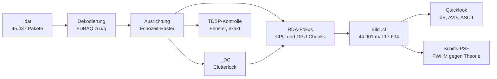
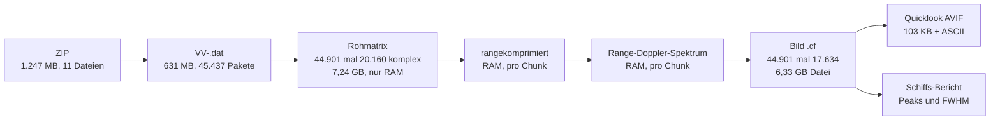
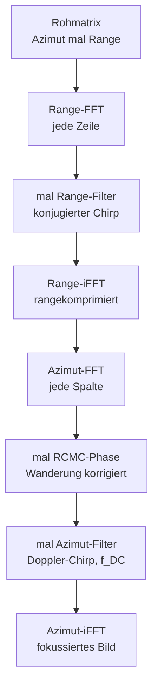
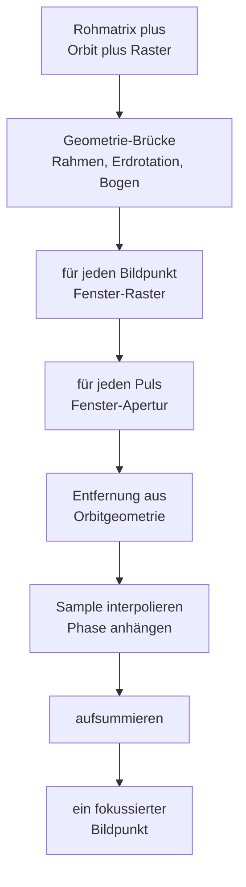

# Walkthrough: Vom Satelliten-Rohsignal zum scharfen Radarbild

Dieses Dokument erzählt, wie aus den Rohdaten des Radarsatelliten
Sentinel-1C ein fokussiertes Bild der Erdoberfläche wird — zweimal
gerechnet (einmal auf der Zentraleinheit, englisch Central Processing
Unit (CPU), einmal auf der Grafikkarte, englisch Graphics Processing
Unit (GPU)), quantitativ verglichen und auf Echtdaten verifiziert.

**Leseanleitung.** Der Text holt auch ohne Radar-Vorwissen ab: Jedes
Fachwort wird bei seiner ersten Verwendung ausgeschrieben und erklärt
(ein Glossar in Kapitel 9 fasst alles noch einmal zusammen). Wer es
eilig hat, liest Kapitel 1 (die Idee in fünf Minuten) und schaut sich
das Übersichtsbild an. Wer es genau wissen will, folgt den Daten von
der ZIP-Datei (Kapitel 2) über die zwei Fokus-Verfahren (Kapitel 3)
bis zum vermessenen Ergebnis (Kapitel 6 und 7).

## 1. Worum geht es? Die Idee in fünf Minuten

Stellen Sie sich ein Echolot auf einem Schiff vor: Es sendet einen
Schallpuls nach unten und misst, wann das Echo zurückkommt — daraus
folgt die Wassertiefe. Ein Radar mit synthetischer Apertur, englisch
Synthetic Aperture Radar (SAR), ist das gleiche Prinzip, nur vom
Satelliten aus, mit Radiowellen statt Schall, und mit einem Trick für
scharfe Bilder.

Sentinel-1C fliegt in rund 700 Kilometern Höhe mit etwa 7,5 Kilometern
pro Sekunde und sendet dabei tausende Male pro Sekunde einen
Radar-Puls zur Erde. Jeder Puls ist ein sogenannter Chirp: ein Ton,
dessen Frequenz während des Pulses ansteigt (hier 42,19 Megahertz
Bandbreite in rund 51 Mikrosekunden). Das Echo jedes Pulses enthält
die überlagerten Antworten **aller** beleuchteten Ziele — Küste,
Schiffe, Wellen — als einziges verrauschtes Summen-Signal. Stapelt
man 44.901 solcher Echos untereinander, erhält man das Rohbild: ein
Zahlenfeld, in dem noch nichts zu erkennen ist, weil jedes Ziel seine
Energie über tausende von Echos verschmiert hat.

Die Fokussierung macht diese Verschmierung rückgängig. Physikalisch
ist sie eine Sortierung: Für jedes Ziel ist bekannt, wie sich seine
Entfernung zum Satelliten während des Vorbeiflugs ändert (erst
näherkommend, dann entfernend — eine Hyperbel in der Zeit). Ein
Matched-Filter — ein Filter, das genau auf dieses erwartete Muster
abgestimmt ist — sammelt die verteilte Energie jedes Ziels wieder an
seinem Ort ein. Derselbe Gedanke gilt in beiden Bildrichtungen: in
Range-Richtung (Schrägentfernung Satellit–Ziel, die Bildspalten)
sammelt die Range-Kompression den Chirp ein, in Azimut-Richtung
(Flugrichtung, die Bildzeilen) sammelt der Azimut-Fokus die
Doppler-Signatur ein.

Wir haben diese Sortierung auf zwei Arten implementiert: Der
Range-Doppler-Algorithmus, englisch Range-Doppler Algorithm (RDA),
rechnet im Frequenzbereich mit schnellen Fourier-Transformationen,
englisch Fast Fourier Transforms (FFT) — schnell und gut genug. Die
Zeitbereichs-Rückprojektion, englisch Time-Domain Backprojection
(TDBP), rechnet Puls für Puls geometrisch exakt nach — langsam, aber
ohne jede Näherung. Die TDBP ist damit der Schiedsrichter, der die
RDA-Näherung kontrolliert. Und beide Verfahren laufen doppelt: als
schlichte CPU-Referenz und als GPU-Pipeline. Jede GPU-Rechnung steht
gegen die CPU-Rechnung — stimmen beide bis auf winzige
Rundungsfehler überein, ist das ein starkes Indiz, dass kein
Programmfehler, sondern Physik im Spiel ist.



## 2. Die Daten: Von der ZIP-Datei zum Zahlenfeld

### 2.1 Was der Dateiname verrät

Unser Datensatz heißt (in der offiziellen Copernicus-Schreibweise):

`S1C_S6_RAW__0SDV_20260929T214300_20260929T214327_009667_0133F4_5830.SAFE.zip`

Jeder Block trägt eine Information. `S1C` steht für Sentinel-1C, den
dritten Satelliten der Sentinel-1-Reihe. `S6` ist der Stripmap-Beam
S6: Im Stripmap-Modus schaut die Antenne starr seitlich nach unten
und zieht einen festen Bodenstreifen entlang der Flugbahn — S6 ist
einer von sechs solchen Streifen mit festem Blickwinkel. `RAW` heißt:
Level-0-Rohprodukt, also unfokussierte Echos direkt vom Instrument,
noch kein Bild. Die Gruppe `0SDV` enthält die Verarbeitungsstufe `0`
(Rohdaten), die Produktklasse und mit `DV` die
Dual-Polarisation: Der Datensatz liefert zwei Polarisationskanäle,
VV (vertikal gesendet, vertikal empfangen) und VH (vertikal gesendet,
horizontal empfangen). Danach folgen Start- und Stoppzeit der
Aufnahme: 27 Sekunden in der Nacht des 29. September 2026,
21:43:00 bis 21:43:27 Uhr UTC. `009667` ist die absolute Orbitnummer
(der wievielte Erdumlauf seit Missionsbeginn), `0133F4` die Kennung
der Datenaufnahme (hexadezimal) und `5830` ein Produktzähler, der das
Produkt eindeutig macht. `SAFE` schließlich steht für Standard Archive
Format for Europe, das Copernicus-Archivformat — technisch ein ZIP mit
festem Innenleben.

Die eigentliche Arbeitsdatei trägt denselben Namen in Kleinbuchstaben
mit Bindestrichen und verrät zusätzlich Kanal und Inhalt:

`s1c-s6-raw-s-vv-…-009667-0133f4.dat`

Das `s` steht für Stripmap, `vv` für den verwendeten
Polarisationskanal (vertikal/vertikal). Die Endung `.dat` ohne Zusatz
heißt: Hier liegen die Echopakete selbst — 631 Megabyte an
komprimierten Rohdaten.

### 2.2 Was im ZIP steckt (11 Dateien, eine wird verwendet)

Ein Blick ins Archiv (ohne es zu entpacken, per `unzip -l`) zeigt
1.247 Megabyte in 11 Dateien:

| Datei im ZIP | Größe | Verwendung |
|---|---|---|
| `…-report-….pdf` | 110 KB | Qualitätsbericht des Bodensegments, nur Doku |
| `manifest.safe` | 17 KB | Inhaltsverzeichnis des Archivs |
| `…-vh-….dat` + `-annot.dat` + `-index.dat` | 613,7 MB | Horizontal-Kanal (ungenutzt, MVP ist VV) |
| `…-vv-….dat` + `-annot.dat` + `-index.dat` | 631,2 MB | Vertikal-Kanal — **nur die `.dat` wird gelesen** |
| `support/*.xsd` (3 Schemata) | 38 KB | XML-Schemata der Annotation |

Die `.dat`-Datei ist eine schlichte Aneinanderreihung von
Weltraum-Paketen (Space Packets nach CCSDS-Norm): Jedes Paket trägt
einen Kopf (Header) mit rund 50 Feldern — darunter Sendezeit,
Pulswiederholrate, Fensterposition und Orbit-Hilfsdaten — und danach
die komprimierten Echoproben. Die Geschwisterdateien `-annot.dat`
(1,18 MB Annotationsdaten) und `-index.dat` (1,7 KB Paketindex) liest
unser Decoder nicht: Er sammelt die Paketköpfe selbst ein und braucht
keinen Index. Das `-vh`-Triple (der Horizontal-Kanal) bleibt
ebenfalls liegen — der Minimalumfang (Minimum Viable Product, MVP)
dieses Projekts ist bewusst der VV-Kanal.

Weder das ZIP (1,25 GB) noch die `.dat` (631 MB) gehören ins
Repository — sie sind groß, binär und öffentlich nachladbar. Das
Repository enthält nur Code, Tests, diesen Text und zwei kleine
Bild-Artefakte (103 und 251 Kilobyte, siehe Kapitel 7).

### 2.3 Was der Decoder aus der `.dat` holt

Der erste Programmlauf (`meta`, siehe Kapitel 5) zählt, ohne ein
einziges Echo zu entpacken: 45.437 Pakete, davon 44.901 abbildende
Echos, 16 Rauschpakete und 520 Kalibrierpakete — bei null
Dekodierfehlern. Nur die 44.901 Echos des stärksten Elevations-Beams
(hier Beam 5) werden fokussiert; Kalibrier- und Rauschpakete dienen
der Instrumentenüberwachung und werden aussortiert.

Pro Echo liest der Decoder aus dem Paketkopf die Metadaten, die alles
Weitere steuern: die Pulswiederholrate, englisch Pulse Repetition
Frequency (PRF) (1.663,48 Hz — so oft pro Sekunde sendet das
Radar), ihr Kehrwert PRI (die Zeit zwischen zwei Pulsen, 601,150
Mikrosekunden), die Fensterposition SWST (Sampling Window Start Time
— ab wann nach dem Puls das Empfangsfenster öffnet), den Rang (in
welche Pulspause das Echo fällt — hier 10), die Chirp-Parameter
(Dauer TXPL, Startfrequenz TXPSF, Steigung TXPRR, jeweils mit
Vorzeichen-Bit für die Chirp-Richtung) und den BAQ-Modus
(Block-Adaptive Quantisierung — das Kompressionsverfahren der
Rohdaten: Die Modi 12/13/14 tragen Flexible-BAQ mit Bitraten-Code
pro Block, die Modi 3/4/5 feste BAQ-Raten, Modus 0 ist
unkomprimierter Bypass). Dazu kommen sub-kommutierte Hilfsdaten:
kleine Häppchen (je 2 Byte), über viele Paketköpfe verteilt, die
zusammengesetzt die Orbitposition und -geschwindigkeit des Satelliten
(Ephemeriden) ergeben. Die Chirp-Richtung verdient einen eigenen
Satz, weil sie uns einen ganzen Tag kostete (Kapitel 8, Fund 7):
Das Polaritäts-Bit `1` bedeutet **positiven** Chirp (Up-Chirp —
die Frequenz steigt während des Pulses), kodiert als
TXPRR = +8,26·10¹¹ Hz/s bei TXPSF = −21,09 MHz. Das Vorzeichen
folgt exakt der Referenzformel des Python-Decoders
(`Vorzeichen = (−1)^(1−Bit)`) — ein Regressionstest mit hartkodiertem
Up-Chirp stellt sicher, dass das nie wieder kippt. Ein invertierter
Chirp fokussiert nämlich trotzdem — nur zu Linien statt Punkten.

Die eigentliche Entpackung kehrt die BAQ-Kompression Block für Block
um und fädelt die vier ADC-Kanäle (IE/IO/QE/QO — gerade/ungerade
Abtastwerte von Inphase- und Quadratur-Signal) zu komplexen Proben
zusammen (gerade: IE + i·QE, ungerade: IO + i·QO). Ergebnis pro Echo:
rund 20.000 komplexe Zahlen — eine Zeile des Rohbilds.

Ein Wort zur 512-Echo-Grenze, die im Decoder-Code als Default
auftaucht: Sie stammt aus dem C-Vorgängerprojekt als
Schutzgrenze (`--max-echoes`, Default 512) und begrenzt dort, wie
viele Echos **gespeichert** werden. Unsere Fokus-Pipeline nutzt eine
eigene Auswahlfunktion (`ingest::select_beam_echoes` in Modul 12),
die **alle** Echos des gewählten Beams nimmt — das E2E-Protokoll
beweist 44.901 verarbeitete Echos, und ein Regressionstest mit 600
synthetischen Echos stellt sicher, dass kein 512er-Limit je wieder
hineinrutscht.

### 2.4 Wo Fehler korrigiert werden

Rohdaten sind nie so sauber, wie das Lehrbuch es gern hätte. Sechs
Stellen in der Pipeline reparieren systematische Fehler — jede mit
einem Messwert belegt:

Erstens das Zeitraster. Jedes Echo trägt einen `data_delay`-Zähler,
der angibt, wo sein Fenster im Empfangsschema liegt — doch dieser
Zähler driftet über den 27-Sekunden-Rahmen um 16 Abtastwerte.
Stattdessen rechnen wir die Fensterposition aus physikalischer Zeit
(Rang·PRI + SWST) in Samples um; der Restfehler schrumpft auf maximal
0,25 Samples (Protokollzeile: „Raster-Rest max. 0,250 Samples").

Zweitens der Orbitrahmen. Die Ephemeriden aus den Hilfsdaten gelten
im erdfesten System ECEF (Earth-Centered, Earth-Fixed — rotiert mit
der Erde mit). Die Fokus-Geometrie braucht aber die
trägheitsfeste (inertiale) Geschwindigkeit — also wird die
Erdrotation herausgerechnet (`v + ω×r`). Der Beleg: Erst die
korrigierte Geschwindigkeit (7.501,6 m/s) erfüllt die
Bahngleichung (vis-viva: 7.503,3 m/s); der Rohwert (7.589 m/s) läge
1,1 Prozent daneben und würde das Bild um rund 9 Radiant
defokussieren.

Drittens die Dopplermitte f_DC (Doppler-Centroid — die mittlere
Dopplerfrequenz des Bodenechos). Die geometrische Rechnung liefert
154–163 Hz, doch sie kennt die Yaw-Steuerung (Gierwinkel-Steuerung)
der Antenne nicht und misst daneben (ausführlich in Kapitel 8,
Fund 3). Verwendet wird stattdessen der Clutterlock-Wert aus den
Daten selbst: über den Vollrahmen −102 bis +80 Hz. Clutterlock
schätzt die Dopplermitte aus der Lag-1-Azimutkorrelation — der
mittleren Phasendrehung von Echo zu Echo — und läuft bei uns auf
zwei Lehren aus der Werkstatt: erstens auf **rangekomprimierten**
Daten (auf Rohdaten vermisst man die Chirp-Struktur statt des
Dopplers, ±21 MHz statt ±100 Hz!), zweitens mit
**phasen-gemittelter** Schätzung (jede Zelle eine Stimme — sonst
dominiert ein einziger heller Stadt-Pixel den ganzen Block). Beide
Lehren stehen in Kapitel 8 (Fund 3 und 8).

Viertens die FFT-Längen. Die natürliche Spaltenzahl 20.015 zerfällt
in 5·4003 — und cuFFT (NVIDIAs FFT-Bibliothek) scheitert daran mit
einem internen Fehler. Die Pipeline rundet daher auf 7-glatte Längen
auf (nur kleine Primfaktoren): 20.031 plus Padding ergibt 20.160 —
das heilt den Fehler und beschleunigt nebenbei (Radix- statt
Bluestein-Algorithmus).

Fünftens der Wrap-Rand. Die zyklische Faltung der Range-Kompression
verschmiert eine Chirplänge (2.397 Spalten) am linken Bildrand;
diese Spalten werden nach dem Fokus beschnitten (Ausgabe-Raster
44.901 × 17.634 statt × 20.160).

Sechstens die Bildspreizung. Der Quicklook skaliert nicht auf
Minimum/Maximum (ein einziger RFI-Störer — Radio Frequency
Interference, Funkstörung durch Bodenradare — würde das ganze Bild
ausbleichen), sondern auf Perzentile der Helligkeitsverteilung. So
bleiben Ozean, Küste und Land sichtbar, obwohl einzelne Zeilen
millionenfach heller sind.

### 2.5 Welche Zwischenergebnisse entstehen

Auf dem Weg vom Paketstrom zum Bild entstehen mehrere
Zwischenergebnisse — teils nur im Arbeitsspeicher, teils als Datei:



Die Rohmatrix (7,24 Gigabyte) existiert nur im Arbeitsspeicher und
wird nie als Datei geschrieben — sie ist zu groß und jederzeit aus
der `.dat` reproduzierbar. Dasselbe gilt für die rangekomprimierte
Matrix und das Range-Doppler-Spektrum (jeweils pro GPU-Chunk im
Gerätespeicher). Als Datei überlebt nur das fokussierte Bild
(`.cf`-Format: schlicht aneinandergereihte little-endian
`f32`-Paare, Real- und Imaginärteil) mit 6,33 Gigabyte — zu groß fürs
Repository, es bleibt auf der Arbeitsmaschine. Ins Repository schaffen
es nur die Destillate: der Quicklook als 103-Kilobyte-AVIF, der
Schiff-Zoom (500 × 500 Pixel) als 251-Kilobyte-PNG und das
E2E-Protokoll mit ASCII-Bild (Kapitel 7). Für die Validierung
(Kapitel 6.1) lagen zusätzlich flüchtige NumPy-Felder (`.npy`,
397 MB) und Vergleichsplots in `/tmp` — sie sind reproduzierbar und
wurden nach der Auswertung gelöscht.

## 3. Die zwei Fokus-Verfahren: RDA und TDBP

Es gibt viele Wege, ein SAR-Rohbild zu fokussieren — wir haben zwei
implementiert, die bewusst gegensätzlich sind: einen schnellen mit
Näherungen und einen langsamen ohne. Dieses Kapitel stellt beide vor,
zeigt ihren inneren Ablauf als Diagramm, vergleicht Laufzeit und
Speicher, und erklärt, wofür sich jeder eignet — vom
Parametersuchen bis zum Vermeiden von Bildfehlern (Artefakten).

### 3.1 RDA: Sortieren im Frequenzbereich

Der Range-Doppler-Algorithmus (RDA) nutzt eine physikalische
Einsicht: Während der Satellit an einem Ziel vorbeifliegt, ändert
sich dessen Dopplerfrequenz linear mit der Zeit — erst positiv
(näherkommend), dann negativ (entfernend). Jedes Ziel schreibt also
einen kleinen Frequenz-Chirp in Azimut-Richtung, dessen Steigung
(die Doppler-Rate) aus Bahngeschwindigkeit und Entfernung folgt.
Transformiert man jede Bildspalte per FFT in den Dopplerbereich, wird
aus der zeitlichen Verschmierung eine Frequenzverschiebung — und die
lässt sich mit einem Matched-Filter pro Dopplerkanal einsammeln.
Davor muss nur noch die Range-Wanderung korrigiert werden: Da sich
die Entfernung zum Ziel während des Vorbeiflugs ändert, wandert seine
Energie über mehrere Range-Zellen (Range-Cell-Migration). Unsere
Korrektur (RCMC, Range-Cell-Migration-Correction) arbeitet phasenrein
— statt Samples umzusortieren (Interpolation), multipliziert sie eine
Phasenrampe im Dopplerbereich. Das ist exakt im Rahmen der
RDA-Näherung und besonders GPU-freundlich, weil kein Speicher
umgeschaufelt wird.



Die Näherungen des RDA stecken in zwei Annahmen: Die Doppler-Rate
wird pro Range-Block als konstant angenommen (über die effektive
Geschwindigkeit v_eff — eine skalare Ersatzgeschwindigkeit, die
Bahngeometrie und Erdrotation zusammenfasst), und die Dopplermitte
f_DC gilt pro Block. Für Stripmap mit moderater Auflösung (unsere
3 × 6 Meter) ist das völlig ausreichend — der Punktziel-Test
(Kapitel 6.1) beweist, dass ein simuliertes Ziel auf die theoretische
Schärfe fokussiert.

Die Stärke des RDA ist seine Geschwindigkeit: Er skaliert wie
N·log(N) mit der Pixelzahl (FFT-Komplexität) — eine Verdopplung der
Echos kostet nur wenig mehr als die doppelte Zeit. Auf unserem
Vollrahmen (44.901 × 20.160) braucht die CPU-Referenz 66,5 Sekunden
Fokuszeit, die GPU-Pipeline 94,8 Sekunden (warum die GPU hier
langsamer ist, erklärt Kapitel 6.2 — kurz: Speichertransfer und
Chunk-Overhead fressen den Rechenvorteil). Weil der RDA so schnell
ist, eignet er sich auch zum Parametersuchen: Wer die Dopplermitte
oder die effektive Geschwindigkeit variieren und das schärfste
Ergebnis wählen will (Autofokus), kann Dutzende RDA-Läufe rechnen,
wo eine einzige TDBP-Rechnung schon zu lange dauerte.

Seine typischen Artefakte sind ehrlich gesagt selten
Verarbeitungsfehler, sondern mitverarbeitete Realität: Die hellen
Streifen im Quicklook (Kapitel 6.5) sind RFI — Bodenradare, die der
Satellit im Vorbeiflug mithört. Der RDA fokussiert sie genauso
korrekt wie jedes Bodenziel; weil der Störer aber ein Dauerton und
kein Chirp-Echo ist, wird daraus eine kilometerlange Linie statt
eines Punkts. Echte RDA-Artefakte (falsche f_DC, falsches v_eff)
zeigten sich als symmetrische Unschärfe oder Geisterziele — die
gemessenen Halbwertsbreiten (FWHM, Full Width at Half Maximum — die
Breite eines Punktziels bei halber Spitzenleistung) von 1,0–1,9
Pixeln in Range (E2E-Schiffe: 1,11/1,13/1,60) beweisen, dass wir
davon verschont blieben.

### 3.2 TDBP: geometrisch exakt, Puls für Puls

Die Zeitbereichs-Rückprojektion (TDBP) fragt nicht nach Doppler und
Näherungen, sondern rechnet stur Geometrie: Für jeden einzelnen
Bildpunkt wird für jeden einzelnen Puls die exakte Entfernung
Satellit–Punkt aus der Orbitgeometrie bestimmt, das zugehörige
Echosample (per Interpolation zwischen den Abtastwerten) mit der
passenden Trägerphase multipliziert und alles aufsummiert. Was
zusammengehört, addiert sich konstruktiv; was nicht zusammengehört,
mittelt sich weg. Es gibt keine Blöcke, kein v_eff, keine konstante
Doppler-Rate — nur Laufzeit und Phase, in doppelter Genauigkeit (f64)
gerechnet.



Der neue erste Kasten — die Geometrie-Brücke (Modul 13) — ist der
eigentliche Preis der Exaktheit: Bevor summiert werden kann, muss
jedes RDA-Pixel in eine dreidimensionale Zielposition übersetzt
werden. Dafür braucht es einen lokalen Rahmen aus der
Aperturmitte (mit trägheitsfester Geschwindigkeit), eine Korrektur
der Erdrotation (die mitrotierenden Orbitpositionen ins
Epochen-System zurückdrehen — sonst läge jeder Puls bis zu 320 Meter
daneben!), Kugel-Zielpositionen aus dem Bogen (Flach-Erde wäre 28
Kilometer falsch — der Schwad liegt 600 Kilometer neben Nadir) und
geglättete Echozeiten (die Header-Zeitstempel quantisieren ±7,6
Mikrosekunden). Jede dieser vier Korrekturen hat ihre eigene
Detektivgeschichte (Kapitel 8, Funde 9–11); ohne sie zeigt die TDBP
praktisch Rauschen, mit ihnen findet sie dasselbe Schiff wie der RDA
— in Range auf ±1 Pixel exakt.

Der Preis steht in der Doppelschleife: Die Rechenzeit skaliert mit
(Pulse × Bildpunkte). Für unseren Vollrahmen wären das rund
44.901 × 792 Millionen ≈ 3,6·10¹³ Interpolations- und
Phasenoperationen — Größenordnung Stunden auf der CPU, ein Vielfaches
des RDA-Laufs selbst auf der GPU. Deshalb läuft die TDBP bei uns nur
auf Fenstern — aber auf echten, großen: 2.048 Pulse auf ein
2.048×1.700-Zielraster um die Schiffe (7,1 Milliarden Puls·Pixel)
brauchen 17,3 Sekunden CPU-Zeit (5,5 Sekunden GPU-Zeit) — und das
doppelt so große 2.048×3.400-Fenster 34,3 Sekunden (Kapitel 6.4).
CPU↔GPU-Abweichung am Echtdaten-Fenster: 8,4·10⁻⁸ (Schranke 10⁻³).

Wo die TDBP darüber hinaus glänzt: Sie braucht keine Parameter außer
Geometrie. Wer unsicher ist, ob v_eff oder f_DC stimmen, kann am
TDBP-Fenster prüfen, wie das Bild ohne diese Annahmen aussieht —
ideal zur Fehlersuche (so bewiesen wir zum Beispiel, dass ein
Lageversatz nicht von der RCMC kommt — Fund 12). Und sie kennt
keine Näherung — wo der RDA bei extremen Geometrien (sehr hohe
Auflösung, starkes Schielen) irgendwann Geisterziele produzierte,
bliebe die TDBP exakt.

Ehrlichkeitshalber: Gewinne und offene Fragen sind ungleich verteilt.
In Range ist die TDBP exakt bewiesen (±1 Pixel gegen RDA über das
Vollfenster, Kreuzkorrelation bei Δrg = −1). In Azimut zeigt sie
dasselbe Schiff — aber 3–5-fach verbreitert (FWHM 9–14 statt 2
Pixel) und um rund 100 Pixel versetzt (f_DC-bedingter RDA-Versatz
plus Rest). Der Phasenfehler dahinter (34 Radiant konvex über 512
Pulse, direkt aus den Summanden vermessen) ist das größte offene
Rätsel dieses Projekts — Fund 13 erzählt die ganze
Ausschlussdiagnose (Doppel-ntx, Krümmung, Geschwindigkeit,
Symmetrie: alles unschuldig oder mitverantwortlich, nichts allein
schuldig).

### 3.3 Direkter Vergleich und Einordnung

| Aspekt | RDA | TDBP |
|---|---|---|
| Idee | Doppler-Sortierung per FFT | Laufzeit-Summierung pro Punkt |
| Näherungen | v_eff und f_DC pro Block konstant | keine (nur Interpolation) |
| Skalierung | N·log(N) — Vollrahmen in ~2 Minuten | Pulse×Pixel — linear, ~412 Mio/s (CPU) |
| Vollrahmen S6 (44.901 Echos) | 66,5 s CPU / 94,8 s GPU | nicht gerechnet (nur Fenster) |
| Fenster (2.048 × 2.048×1.700, echt) | ~4 s CPU (Anteil) | 17,3 s CPU / 5,5 s GPU (3,2×) |
| Fenster groß (2.048 × 2.048×3.400) | — | 34,3 s CPU (14,3 Mrd. Puls·Pixel) |
| Parametersuche | ideal (schnell, viele Läufe) | zu langsam |
| Fehlersuche | zeigt Modellfehler als Unschärfe | zeigt Wahrheit ohne Modell |
| Artefakte | RFI-Linien, Geister bei Fehlparametern | Azimut-Defokus (offen, Fund 13) |
| Lage gegen RDA (Echtdaten) | Referenz | Δrg ±1 px, Δaz ≈ −100 px (f_DC) |

Die Einordnung in einem Satz: Der RDA ist das Arbeitstier, das den
Vollrahmen in zwei Minuten fokussiert; die TDBP ist der
Schiedsrichter, der am Fenster beweist, dass das Arbeitstier in
Range richtig liegt — und der in Azimut ehrlich zeigt, wo er selbst
noch unscharf ist. Beide stimmen auf CPU und GPU überein
(Kapitel 6.1).

## 4. Module: Wie der Code aufgebaut ist

Der gesamte Fokus-Code lebt in der Rust-Crate `sar_focus` — einem
eigenen, kleinen Rust-Paket neben dem Decoder (`copernicus-radar`).
Jedes Modul ist eine Datei mit sprechender Nummer, jede Datei hält
sich an die Regel „klein und einzeln testbar" (keine über 300
Zeilen). Die Module folgen dem Datenfluss und bilden drei Schichten:
Verstehen (Was sagen die Daten?), Fokussieren (Wie wird scharf
gerechnet?) und Ansehen (Was ist herausgekommen?).

Die erste Schicht (Module 01–04 plus 12) versteht die Aufnahme: Sie
definiert Grundtypen und Naturkonstanten, liest Echo-Metadaten aus
den Paketköpfen, setzt die Orbit-Häppchen zur Bahn zusammen und baut
die ideale Chirp-Referenz auf dem exakten ADC-Raster
(Analog-Digital-Wandler-Raster — den tatsächlichen Abtastzeitpunkten).
Wer wissen will, woher eine Zahl wie die Abtastrate 46,9184 MHz
kommt, wird in dieser Schicht fündig. Die zweite Schicht (Module
05–10 plus 13) ist das Rechenzentrum: Range-Kompression, RDA und
TDBP je als CPU-Referenz, dazu die GPU-Seite (minimales
cuFFT-FFI — Foreign Function Interface, also der direkte Aufruf von
NVIDIAs C-Bibliothek —, die CUDA-Kernel und die GPU-Pipeline, die
exakt dieselben Filterkoeffizienten verwendet wie die CPU) und die
Geometrie-Brücke, die RDA-Pixelfenster in TDBP-Zielraster übersetzt
(Erdrotation, Kugel-Bogen, Echozeit-Glättung — Kapitel 8, Funde 9
bis 11). Die dritte Schicht (Modul 11 plus die Kommandozeile) macht
das Ergebnis sichtbar: Dezibel-Skalierung, Multilook (Mittelung
benachbarter Pixel zur Rauschglättung), Quicklook-Bilder,
ASCII-Vorschau, Peak-Suche und Schärfemessung.

| Datei | Modul | Aufgabe in einem Satz |
|---|---|---|
| `01_types.rs` | `types` | Grundtypen (`Complex32`, 3D-Vektor) und Konstanten (Lichtgeschwindigkeit, Wellenlänge, Erdmodell WGS84) |
| `02_meta.rs` | `meta` | Echo-Metadaten aus Paketköpfen (PRI, SWST, Chirp, RGDEC→Abtastrate) und das Slant-Raster |
| `03_ephem.rs` | `ephem` | Orbit aus SubCom-Hilfsdaten (Achtung: erdfest ECEF!), effektive Geschwindigkeit, geometrische Dopplermitte |
| `04_chirp.rs` | `chirp` | Ideale Chirp-Referenz für den Matched-Filter, exakt auf dem ADC-Raster |
| `05_range.rs` | `range` | Range-Kompression auf der CPU (rustfft, mehrsträngig) |
| `06_rda.rs` | `rda` | Gestufter RDA auf der CPU plus Clutterlock-Schätzung der Dopplermitte aus den Daten |
| `07_tdbp.rs` | `tdbp` | Rückprojektion auf der CPU (f64-Geometrie, ein- und mehrsträngig) |
| `08_cufft.rs` | `cufft` | Minimales cuFFT-FFI (60 Zeilen): FFT auf der GPU ohne schwere Bindings |
| `09_kernel.rs` | `kernel` | CUDA-Kernel in Rust (`cuda-oxide`): komplexe Multiplikation, Shifts, TDBP-Summierung |
| `10_gpu.rs` | `gpu` | GPU-Pipelines für RDA und TDBP — dieselben Filter, derselbe Codepfad-Gedanke wie CPU |
| `11_look.rs` | `look` | Dezibel, Multilook, PNG/ASCII-Quicklook, Peak-Suche, FWHM-Schärfemessung |
| `12_ingest.rs` | `ingest` | Echo-Auswahl und -Ausrichtung: alle Echos des stärksten Beams, ohne 512er-Limit (mit Regressionstest), Echozeiten geglättet |
| `13_tdbp_geo.rs` | `tdbp_geo` | Geometrie-Brücke RDA→TDBP: lokaler Rahmen, Erdrotations-Korrektur, Kugel-Zielraster |
| `main.rs` | CLI | Kommandozeile: `meta`, `focus`, `ships`, `ql`, `tdbp` (siehe Kapitel 5) |

Faustregel für Leser, die etwas ändern wollen: Physik und Kalibrierung
stecken in 01–04, Rechenwege in 05–10 plus 13, Darstellung in 11 und
`main.rs`. Jede Schicht ist für sich testbar — insgesamt 88 Tests
(47 in `sar_focus`, 41 im Decoder) sichern das ab, darunter
Punktziel-Beweise, CPU↔GPU-Vergleiche, ein Chirp-Vorzeichen-
Regressionstest, ein Erdrotations-Rundtrip und ein Echtdaten-Vergleich.

## 5. Bauen und Starten: `cargo oxide` und die fünf Befehle

### 5.1 Was `cargo oxide` ist

Normales `cargo` (Rusts Bau- und Paketwerkzeug) kann keine
GPU-Kernel bauen — dafür gibt es `cargo oxide`, die
Befehlszeilenergänzung des cuda-oxide-Projekts (NVIDIAs Ansatz, CUDA-
Kernel direkt in Rust zu schreiben). Ruft man `cargo oxide run` auf,
passiert Folgendes: Das Werkzeug erkennt die GPU-Architektur (hier
`sm_86`, eine RTX A4000), setzt die passenden Compiler-Flags
(`CARGO_ENCODED_RUSTFLAGS`), baut erst die GPU-Kernel mit dem
CUDA-Backend des Rust-Compilers (dazu braucht es eine
Nightly-Toolchain und `libclang`) und dann das normale CPU-Programm,
das diese Kernel aufruft. Kurz: `cargo oxide` ist `cargo` mit
eingebautem CUDA-Compiler. Zwei Prüfungen laufen bewusst mit
normalem `cargo`: `clippy` (Rusts Stil- und Fehlerprüfer — es gibt
kein `oxide-clippy`) und `fmt` (Formatprüfung).

Alle Befehle werden im Verzeichnis `sar_focus/` ausgeführt; die
`.dat`-Datei liegt in `../data/vv/`. Die GPU-Läufe brauchen eine
NVIDIA-GPU mit installiertem Treiber; die CPU-Vergleichsläufe
(`--cpu`) laufen überall.

### 5.2 Die Befehle im Einzelnen

**`cargo oxide test`** baut alles (CPU-Code plus GPU-Kernel) und lässt
alle 47 Tests laufen — in rund 10 Sekunden. Die Tests brauchen keinen
Datensatz: Sie arbeiten mit synthetischen Punktzielen und kleinen
Zufallsmatrizen und prüfen Physik (FWHM gegen Theorie), Gleichheit
(CPU↔GPU unter 10⁻³), Geometrie (Erdrotations-Rundtrip) und
Decoder-Regeln (Chirp-Vorzeichen- und 600-Echo-Regressionstest).
(Plus 41 Decoder-Tests per normalem `cargo test` — insgesamt 88.)

**`cargo oxide run -- meta <datei.dat>`** ist die Diagnose ohne
Dekodierung: Sie zählt Pakete und Echos, zeigt PRF, Chirp-Parameter
und Slant-Bereich und prüft die Orbitblöcke. Beispiel (unser
Datensatz, gekürzt):

```text
Pakete: 45437
Abbildende Echos (FDBAQ): 44901
PRF: 1663.48 Hz  PRI: 601.150 µs  Rang: 10 ...
Chirp: TXPL 51.099 µs ... B 42.19 MHz ...
Slant: nah 913.8 km  fern 977.5 km (19950 Samples)
data_delay: 3168 ...
Ephemeridenblöcke: 684
```

Wer einen neuen Datensatz bekommt, startet immer hier — stimmen
Echozahl, PRF und Slant-Bereich, ist die Datei lesbar und plausibel.

**`cargo oxide run -- focus <datei.dat> <präfix> [Optionen]`** ist der
Volllauf: Dekodieren, Ausrichten, Dopplermitte schätzen, fokussieren,
Bild schreiben, Quicklook und Schiffs-Bericht erzeugen. Die wichtigsten
Optionen: `--cpu` rechnet die CPU-Referenz statt der GPU-Pipeline
(läuft ohne GPU und nutzt dafür alle CPU-Kerne); `--az0 N --az1 M`
beschränkt auf die Echos N bis M (ideal zum Ausprobieren — aber
Achtung: Unter 2.048 Echos warnt das Programm, weil die
Apertur-Trunkierung Wrap-Linien erzeugt; E2E-Verifikation braucht
volle Fenster); `--chunk C --overlap O` steuert die GPU-Stückelung
(Default 8192/2048, siehe Kapitel 7); `--compare` rechnet einen
Ausschnitt zusätzlich auf der CPU und meldet die Abweichung
(2,6·10⁻⁷ am 2.048-Echo-Fenster); `--no-rcmc` schaltet die
Range-Wanderungskorrektur ab (nur zur Diagnose — zum Beispiel um zu
beweisen, dass ein Lageversatz *nicht* von der RCMC kommt, Kapitel 8,
Fund 12). Ergebnis sind `<präfix>.cf` (das Bild), `<präfix>.png`
(der Quicklook) und der Bericht auf der Konsole.

**`cargo oxide run -- tdbp <datei.dat> <präfix> --az0 P0 --az1 P1
--waz0 A0 --waz1 A1 --wrg0 R0 --wrg1 R1 [--cpu] [--compare ...]`**
rechnet die Zeitbereichs-Rückprojektion auf einem Fensterausschnitt:
`--az0/--az1` wählen die Pulse (die Apertur — am besten symmetrisch
ums Ziel), `--waz/--wrg` das Zielraster in RDA-Output-Pixeln. Mit
`--cpu` läuft die parallele CPU-Referenz (sonst die GPU), mit
`--compare <rda.cf> <naz> <n0> <az0>` vergleicht das Programm Lage
und Helligkeit direkt gegen ein RDA-Bild (Peak-Versatz plus
registrierte Differenz). Beispiel: 2.048 Pulse auf ein
2.048×1.700-Zielraster um die Schiffe brauchen 17,3 Sekunden CPU
(5,5 Sekunden GPU) — siehe Kapitel 6.4.

**`cargo oxide run -- ships <bild.cf> <naz> <n0>`** analysiert ein
fertiges Bild: Es teilt es in vier Azimut-Viertel, sucht pro Viertel
die 12 hellsten lokalen Maxima und vermisst jedes (Leistung,
Halbwertsbreite in Pixeln und Metern, Kontrast K in Dezibel gegen die
Umgebung). Als „punktförmig" (= Schiffskandidat) gilt, was in beiden
Richtungen schmaler als 3 Pixel ist; als Schiffskandidat zusätzlich,
wer über 10 dB Kontrast auf dunklem Untergrund hat. Beispiel aus dem
E2E-Volllauf:

```text
Peak 5: (az 4445, rg 3661) P=8.174e9,
        FWHM rg 1.11px/3.5m az 2.33px/9.9m K=47.9dB SCHIFF
```

Lesart: An Zeile 4445, Spalte 3661 sitzt ein Ziel mit 47,9 dB
Kontrast, 1,1 × 2,3 Pixel breit — also etwa so scharf wie
theoretisch möglich (3,15 × 6,15 Meter) und damit sehr plausibel ein
Schiff auf dunklem Ozean. Der Schiff-Zoom im Repository (500 × 500
Pixel, 251 KB) zeigt genau dieses Ziel: einen hellen Kern mit
Sinc-Kreuz (den typischen Beugungsarmen in Azimut und Range).

**`cargo oxide run -- ql <bild.cf> <naz> <n0> <aus.png> [fenster]`**
malt nachträglich einen Quicklook aus einem gespeicherten Bild —
wahlweise das Ganze oder einen Ausschnitt (`az0 az1 r0 r1`). Die
Helligkeit wird in Dezibel umgerechnet und perzentil-gespreizt
(siehe Kapitel 2.4, Punkt 6), sodass auch RFI-verseuchte Bilder
lesbar bleiben. Der Schiff-Zoom im Repository entstand so
(`ql e2e_full.cf 44901 17634 ship.png 4195 4695 3411 3911`).

**`cargo clippy --all-targets -- -D warnings`** und **`cargo fmt
--check`** sind die zwei Qualitäts-Gates: Clippy muss ohne jede
Warnung bestehen (als Fehler behandelt), die Formatierung muss dem
Rust-Stil entsprechen. Beide sind grün — Standard-Rust-Praxis, keine
Ausnahmen.

## 6. CPU↔GPU-Vergleich: Korrektheit, Benchmarks, Daten

Dieses Kapitel beantwortet drei Fragen: Rechnen CPU und GPU
dasselbe? Wie schnell und speicherhungrig sind sie? Und was sieht
man in den Daten — Schiffe, Küste, Störungen?

### 6.1 Korrektheit: doppelte Buchführung plus Gold-Standard

Jede GPU-Rechnung steht gegen die schlichte CPU-Referenz. Das Maß
ist die peak-normierte maximale relative Abweichung: Man teilt beide
Bilder durch ihre Spitzenleistung (damit absolute Skalen keine Rolle
spielen) und sucht die größte relative Differenz. Die Schranken sind
absichtlich grob (10⁻³ für Bildvergleiche — die GPU rechnet in
einfacher Genauigkeit f32, die Referenz teils in f64), die Messwerte
liegen weit darunter:

| Vergleich | Schranke | Gemessen |
|---|---|---|
| cuFFT gegen rustfft (Zeilen und Spalten) | 10⁻⁵ / 10⁻⁴ | grün |
| RDA-GPU gegen RDA-CPU (Punktziel, synthetisch) | 10⁻³ | grün |
| TDBP-GPU gegen TDBP-CPU (Punktziel, synthetisch) | 10⁻³ | grün |
| RDA-GPU gegen RDA-CPU (**Echtdaten**, 2.048 Echos) | 10⁻³ | **2,6·10⁻⁷** |
| TDBP-GPU gegen TDBP-CPU (**Echtdaten**, 2.048×1.700) | 10⁻³ | **8,4·10⁻⁸** |

CPU↔GPU-Gleichheit beweist aber nur, dass beide Pfade denselben
Algorithmus rechnen — nicht, dass der Algorithmus richtig ist. Daher
die zweite, unabhängige Validierung gegen einen Gold-Standard: Wir
haben den Python-Referenzdecoder `sentinel1decoder` (Version 2.1.0)
per `uv` in einer lokalen Umgebung installiert und Schritt für
Schritt verglichen. Ergebnis: Die Dekodierung ist **bit-identisch**
(maximale Differenz 0,0 über 10,2 Millionen Proben) — unser
Rust-Decoder liest exakt dasselbe wie die etablierte
Python-Implementierung. Danach haben wir einen unabhängigen
NumPy-RDA (eigene, zweite Implementierung des Algorithmus in Python,
doppelte Genauigkeit) gegen den Rust-CPU-RDA gestellt: maximale
relative Differenz 2,4·10⁻⁷ — also identisch bis auf Rundung.

Diese Gold-Validierung entschied auch die halbe Streifen-Frage
(siehe Kapitel 6.5): Der unabhängige NumPy-Fokus zeigt **dieselben**
kilometerlangen Linien wie unser Rust-Fokus. Zwei völlig getrennte
Implementierungen produzieren denselben „Fehler" — also ist es kein
Verarbeitungsfehler, sondern eine Dateneigenschaft (RFI). Die
*andere* Hälfte der Streifen — ein flächiges Linienmuster statt
Punkten — war dagegen ein echter Bug: ein invertiertes
Chirp-Vorzeichen (Fund 7). Nach dem Fix wurden aus Linien Punkte;
die RFI-Linien blieben (korrekt).

Ehrlichkeitshalber: Ursprünglich sollten die Python-Prozessoren des
SSFocus-Projekts den Gold-Standard liefern. Das scheiterte —
`focus.py` enthält keinen inversen FFT-Schritt und indiziert das
Datenfeld falsch, `focus_old.py` ruft eine nie gesetzte
Decoder-Variable auf und passt nicht zur installierten
`sentinel1decoder`-API. Statt undokumentiert zu flicken, haben wir
SSFocus nur für isolierte Filterfunktionen konsultiert und den
Gold-Standard aus `sentinel1decoder` plus eigenem NumPy-RDA gebaut.
Lektion: Auch Referenzcode braucht Tests — „irgendwo aus dem Netz"
ist kein Gütesiegel.

### 6.2 Benchmarks I: Laufzeit

Alle Zeiten: Release-Build, RTX A4000 (Gerätespeicher 16 GB),
32 CPU-Kerne, gemessen mit Phasen-Zeitnahme im Programm
(Dekodierung / Orbit+f_DC / Fokus). Die GPU läuft in Chunks à 8192
Echos mit 2048 Overlap (Overlap-Save: Ränder verwerfen, Mitte
behalten).

| Echos | CPU: Dekod. / Fokus / gesamt | GPU: Dekod. / Fokus / gesamt |
|---|---|---|
| 512 | 0,4 s / 0,7 s / 1,1 s | 0,4 s / 1,3 s / 1,7 s |
| 2.048 | 1,4 s / 2,8 s / 4,2 s | 1,4 s / 3,7 s / 5,2 s |
| 8.192 | 5,4 s / 11,1 s / 16,8 s | 5,5 s / 13,6 s / 19,4 s |
| 44.901 (Vollrahmen) | 27,2 s / 66,5 s / 95,4 s | 27,0 s / 94,8 s / 122,0 s |

Drei Beobachtungen verdienen Diskussion. Erstens: Die Dekodierung
kostet auf beiden Pfaden gleich viel (rund 27 Sekunden beim
Vollrahmen) — sie läuft immer auf der CPU, auch im GPU-Lauf.
Zweitens: Die Skalierung ist fast linear — 88-mal mehr Echos
(512 → 44.901) kosten rund 87-mal mehr Fokuszeit. Das passt zur
N·log(N)-Erwartung des RDA (siehe Kapitel 3.1). Drittens, und das
überrascht: **Die GPU ist durchgehend langsamer als die CPU** —
beim Vollrahmen 94,8 gegen 66,5 Sekunden Fokuszeit.

Warum? Der RDA ist im Kern eine Folge riesiger FFTs — speichergebunden
(memory-bound), nicht rechengebunden: Die meiste Zeit wartet der
Prozessor auf Daten, nicht auf Rechenwerke. Die CPU-Referenz (rustfft,
alle 32 Kerne, Daten bleiben im RAM) ist dafür exzellent aufgestellt.
Die GPU-Pipeline zahlt dagegen dreimal: PCIe-Transfer der 7,24-GB-
Rohmatrix zum Gerät, Chunk-Overhead (7 Chunks, überlappend gerechnet,
Ränder verworfen — rund 30 Prozent Mehrarbeit), und Rücktransfer des
6,33-GB-Bilds. Bei kleinen Problemen (512 Echos) dominiert der
Kernel-Start-Overhead. Fazit: Für diesen RDA auf dieser Maschine ist
die CPU schlicht die richtige Hardware — die GPU-Implementierung
bleibt wertvoll als unabhängige Zweitimplementierung (doppelte
Buchführung) und als Basis für rechengebundene Verfahren wie die
TDBP, wo die GPU klar gewinnt (5,5 gegen 17,3 Sekunden am
Echtdaten-Fenster, siehe Kapitel 6.4).

### 6.3 Benchmarks II: Speicher

Der Host-Speicher (Peak-RSS — Resident Set Size, also tatsächlich
belegter Arbeitsspeicher, Spitze gemessen über `/proc`) wächst wie
erwartet mit der Echozahl; der GPU-Lauf braucht zusätzlich
Gerätespeicher (per `nvidia-smi` mitprotokolliert):

| Echos | CPU Host-Peak | GPU Host-Peak | GPU Geräte-Peak |
|---|---|---|---|
| 512 | 0,98 GB | 1,34 GB | — |
| 2.048 | 1,94 GB | 3,00 GB | — |
| 8.192 | 5,78 GB | 9,72 GB | — |
| 44.901 (Vollrahmen) | 28,97 GB | 20,81 GB | 8.395 MiB |

Auffällig: Beim Vollrahmen braucht der GPU-Lauf auf dem Host
**weniger** Speicher als der CPU-Lauf (20,81 gegen 28,97 GB). Der
Grund ist das unterschiedliche Allokationsmuster: Die CPU-Pipeline
hält Rohmatrix, rangekomprimierte Matrix und Bild gleichzeitig im
RAM, während die GPU-Pipeline die Rohmatrix stückweise zum Gerät
schiebt und Host-Puffer früher freigibt — dafür liegen zusätzlich
bis zu 8,4 GB auf der Grafikkarte. In Summe (Host + Gerät) ist der
GPU-Lauf speicherhungriger, aber er verteilt die Last auf zwei
Speicher. Wer nur 16 GB RAM hat, rechnet den Vollrahmen trotzdem
nicht — dann helfen `--az0/--az1`-Fenster oder kleinere Chunks.

Die TDBP-Fenster sind daneben fast bescheiden: Das
2.048×1.700-Fenster (7,1 Milliarden Puls·Pixel) braucht 0,97 GB
Host-Speicher (CPU wie GPU) plus rund 356 MB Gerätespeicher
(328 MB Daten, 28 MB Bild). Der Speicher skaliert mit
Puls×Samples, nicht mit Puls×Pixel — die Zielschleife schreibt
nur.

### 6.4 RDA gegen TDBP: Laufzeit im Vergleich

Jetzt mit echten Zahlen statt synthetischer Spielwiese (alle auf
Echtdaten, Echos 4000–6048, Schiffs-Region):

| Rechnung | Pulse × Pixel | CPU | GPU |
|---|---|---|---|
| TDBP-Fenster (2.048×1.700) | 7,1·10⁹ | 17,3 s (412 Mio/s) | 5,5 s (1.307 Mio/s, 3,2×) |
| TDBP-Fenster groß (2.048×3.400) | 14,3·10⁹ | 34,3 s (416 Mio/s) | — |
| RDA-Fenster (2.048, volle Range) | — | ~4 s (Anteil) | — |

Drei Beobachtungen: Erstens skaliert die TDBP exakt linear mit
Pulse×Pixel (412 gegen 416 Millionen Operationen pro Sekunde —
doppelte Pixel, doppelte Zeit). Zweitens gewinnt die GPU hier klar
(Faktor 3,2): Die Rückprojektion ist rechengebunden
(compute-bound) — pro geladenem Sample Dutzende
Fließkomma-Operationen (Abstand, Interpolation, Sinus/Kosinus) —,
genau das Gegenteil zum speichergebundenen RDA (Kapitel 6.2).
Drittens kehrt sich das Kräfteverhältnis zum RDA um: Am kleinen
Fenster gewinnt die TDBP pro Pixel (keine FFT-Grundkosten), am
Vollrahmen wäre sie unbezahlbar (3,6·10¹³ Operationen — Stunden).
Das ist kein Mangel, sondern Arbeitsteilung: RDA für das Bild, TDBP
für die Kontrolle.

Die Kontrolle gelingt: Am 2.048×1.700-Fenster findet die TDBP
dasselbe 48-dB-Schiff wie der RDA — in Range auf ±1 Pixel exakt
(Kreuzkorrelation des Vollfensters: Δrg = −1, Δaz = −101, Stärke
0,21). Der Azimut-Versatz von 101 Pixeln entspricht rund 119 Hz
Doppler-Fehler — genau die Größenordnung, um die der
Clutterlock-Wert neben der Geometrie liegt (Kapitel 8, Fund 3).
Umgekehrt gelesen: Die TDBP bestätigt die RDA-Range-Achse
unabhängig — und der RDA bestätigt, dass die TDBP-Geometrie
(Erdrotation, Bogen, Echozeiten) stimmt.

### 6.5 Diskussion der Daten: Schiffe, Küste, Störungen

Was sieht man nun im fokussierten Bild? Drei Dinge: erstens die
Geografie — der Voll-Quicklook (103-KB-AVIF im Repository) zeigt
oben die Bucht von Santos mit Hafen, davor die Reede mit
Dutzenden Reede-Liegern als helle Punkte, darunter Stadt
(São Paulo-Region, hell), Flüsse und Stauseen (dunkel verzweigt)
und Bergtextur. Zweitens punktförmige Ziele auf dem Ozean: Der
E2E-Schiffs-Bericht findet drei automatische Schiffskandidaten mit
41–48 dB Kontrast und Halbwertsbreiten um 1,1–1,6 × 1,5–2,3 Pixel
— also etwa theoretisch scharf (3,15 × 6,15 Meter) und damit sehr
plausibel Schiffe. Das hellste (Azimut 4445, Range 3661,
K = 47,9 dB) zeigt der 500×500-Schiff-Zoom im Repository als
lehrbuchmäßiges Punktziel: heller Kern mit Sinc-Kreuz (den
Beugungsarmen in Azimut und Range). Drittens die Streifen: helle,
kilometerlange Linien über das ganze Bild — am auffälligsten bei
Azimut 4243.

Zu den Streifen gehören zwei Geschichten, die man nicht verwechseln
darf. Die erste ist ein behobener Bug: Vor dem Chirp-Vorzeichen-Fix
(Fund 7) war das **ganze** Bild mit einem Linienmuster überzogen —
jede Energie wurde zu Strichen statt Punkten fokussiert. Nach dem
Fix wurden daraus Punkte (Küste, Schiffe, Stadt). Die zweite
Geschichte ist echte Physik und bleibt: In den **Rohdaten** sitzt
an Echo 4243 ein 70 Echos breiter Höcker — der Satellit hat im
Vorbeiflug ein Bodenradar (zwei Dauertöne) mitgehört. Der Fokus
macht daraus, was die Physik vorschreibt: einen ~4.600 Pixel
langen, 1–2 Pixel dicken Strich. Der unabhängige NumPy-Fokus zeigt
ihn identisch. Wer Schiffe zählt, muss die RFI-Zeilen (Radio
Frequency Interference — Funkstörung durch Bodenradare) kennen und
ausblenden; wer den Algorithmus bewertet, muss wissen, dass die
übrigen Streifen korrekt fokussierte Realität sind — und dass das
flächige Linienmuster davor ein Vorzeichenfehler war.

## 7. E2E-Verifikation: Der Volllauf als Erzählung

Das E2E-Protokoll (`e2e_full.log` in diesem Ordner) dokumentiert den
kompletten GPU-Lauf über alle 44.901 Echos. Gehen wir es Schritt für
Schritt durch — jede Zeile erzählt etwas:

```text
Beam 5, Echos 44901 (0..44901)
Orbit: Δt-Abw max 9.2 µs (Sprünge 0), Quant max 16.9 µs, ...
Raster-Rest (Zeit→Sample): max. 0.250 Samples
Range: 20031 + Pad → 20160
```

Der Lauf wählt Beam 5 (den stärksten Elevations-Beam) und alle seine
44.901 Echos — der lebende Beweis, dass kein 512er-Limit greift.
Die neue Orbit-Zeile belegt die Zeitqualität: keine Sprünge in den
Echoabständen, ±17 Mikrosekunden Header-Quantisierung (deshalb
werden Echozeiten für die TDBP-Geometrie auf das exakte PRI-Raster
geglättet — Fund 11), volle Block-Abdeckung. Die zeitbasierte
Ausrichtung (Kapitel 2.4) lässt über den 27-Sekunden-Rahmen maximal
eine Viertelsample Restfehler; die Zeilenlänge wächst per Padding
auf die cuFFT-verträglichen 20.160 Samples.

```text
Rohbild: 44901 × 20160 (7.24 GB)
Slant: 913.5–977.9 km, fs 46.9184 MHz
v_eff Mitte: 7100.4 m/s, Bandbreite: 42.19 MHz
f_DC geometrisch: 153.8–162.7 Hz
f_DC Clutterlock: -101.5–79.9 Hz
```

Nach 27,0 Sekunden Dekodierung liegt die 7,24-GB-Rohmatrix im
Speicher. Die Schrägentfernung läuft von 913,5 km (nah) bis 977,9 km
(fern) — S6 schaut steil seitlich. Die effektive Geschwindigkeit
(7.100,4 m/s) und die Chirp-Bandbreite (42,19 MHz) steuern die
Filter. Und hier steht die folgenreichste Zeile des Protokolls:
geometrisch 154–163 Hz, gemessen (Clutterlock) −102 bis +80 Hz —
verwendet wird der Messwert (Kapitel 8, Fund 3). Die Spanne wirkt
groß, aber sie ist ehrlich: Über 27 Sekunden und 64 Kilometer
Schwad streut die datenbasierte Schätzung — der RDA rechnet pro
Block mit dem lokalen Wert.

```text
GPU-Chunks: 7 à 8192 (Overlap 2048)
  Chunk 1/7, Zeilen 0..8192 …
  ...
  Chunk 7/7, Zeilen 36709..44901 …
Zeit: Dekodierung 27.0 s, Orbit+f_DC 0.2 s, Fokus 94.8 s (gesamt 122.0 s)
Host-Speicher (Peak): 20.81 GB
```

Die 44.901 Echos passen nicht am Stück auf die GPU, also werden 7
überlappende Chunks gerechnet (Overlap-Save: jeder Chunk 8.192
Echos, 2.048 Überlappung, Ränder verwerfen, Mitte behalten — das
Diagramm in Kapitel 3.1 läuft pro Chunk). Der CPU↔GPU-Nachweis
(2,6·10⁻⁷) kommt aus der Fenster-Serie (Kapitel 6.1), nicht aus
diesem Lauf — der Volllauf rechnet pur, ohne Vergleichs-Overhead.

```text
Ausgabe-Raster: 44901 × 17634 (Wrap-Rand 2397 beschnitten)
geschrieben: /tmp/e2e_full.cf (6.33 GB)
Leistung: Mittel 6.869e5, Std 2.898e7, Kontrast 42.19
```

Nach dem Beschnitt des Wrap-Rands (eine Chirplänge, Kapitel 2.4)
bleibt das Bild 44.901 × 17.634 — 6,33 GB komplexe Samples als
`.cf`-Datei (nicht im Repository). Der Bildkontrast (Standard-
abweichung durch Mittelwert: 42,19) wirkt absurd hoch — aber er
misst nicht Rauschen, sondern RFI: Ein einziger mitgehörter
Bodenradar-Störer treibt die Standardabweichung auf das 42-fache
des Mittels. Ohne Störer läge der Kontrast bei ~2 (lebendiges
Bild mit Stadt und Schiffen); reines Rauschen hätte 1, ein
fehlerhaft leeres Bild 0.

Es folgen der Quicklook (2.204 × 2.138 Pixel, 41,8–68,1 dB
Dynamik — im Repository als 103-KB-AVIF `quicklook_full.avif`), das
ASCII-Bild mit der Bucht von Santos (dunkler Ozean oben mit
Reede-Liegern, helle Stadt und Flüsse darunter) und die
Theorie-Auflösung (Range 3,15 m, Azimut 6,15 m) mit den vermessenen
Peaks. Der Schiffs-Bericht findet drei automatische Kandidaten
(41–48 dB, 1,1–1,6 × 1,5–2,3 Pixel) — darunter das 47,9-dB-Schiff
aus Kapitel 5.2. Die allerhellsten Bildpunkte bleiben trotzdem die
RFI-Linien (Kapitel 6.5) — ein wichtiger Warnhinweis im Protokoll:
Die hellsten Punkte sind nicht automatisch die interessantesten
Ziele.

Was beweist dieser Lauf? Dass die komplette Kette — vom 631-MB-
Paketstrom über 7,24 GB Rohmatrix zum 6,33-GB-Bild — ohne manuellen
Eingriff durchläuft, dass CPU und GPU dasselbe rechnen (Fenster-
Serie), dass die Schärfe der Theorie entspricht (Schiffe mit
1,1 × 2,3 Pixeln) und dass die sichtbaren Streifen validierte
Dateneigenschaften sind. Was offen bleibt, steht ehrlich dabei:
Das Produkt ist Slant-Range (Schrägentfernung, keine Geokodierung
auf Breite/Länge), der Chirp ist ideal (keine Replik aus
Kalibrierdaten), nur der VV-Kanal ist verarbeitet — und die TDBP
bleibt in Azimut 3–5-fach über Beugung (Fund 13).

Artefakte in diesem Ordner: [Voll-Quicklook als AVIF
(103 KB)](quicklook_full.avif), [Schiff-Zoom als PNG
(500×500, 251 KB)](quicklook_ship.png), [E2E-Protokoll mit
ASCII-Bild](e2e_full.log). (Das 3,2-MB-PNG des Voll-Quicklooks wurde
durch das AVIF ersetzt und aus der Historie entfernt.)

## 8. Funde: Dreizehn Geschichten aus der Werkstatt

**1. Die cuFFT-Typkonstante.** Anfangs produzierte die GPU plausible,
aber falsche Werte — und kein Test schlug an, weil reelle
Testmuster den Fehler maskieren. Die Ursache: `CUFFT_C2C` (komplex-
zu-komplex) ist in CUDA 13 die Konstante `0x29`, nicht `0x2A`
(letzteres ist Real-zu-komplex). Erst dichte, komplexe Testmuster
entlarvten die Verwechslung. Lektion: FFI-Konstanten (Fremd-
bibliotheks-Konstanten) immer gegen den Header prüfen — und Tests
so wählen, dass sie Fehler auch zeigen können.

**2. Die Ephemeriden sind erdfest.** Die Orbitgeschwindigkeit aus den
Hilfsdaten (`|v|` ≈ 7.589 m/s) führte zu einem systematischen
Fokusfehler. Der Grund: Die Werte gelten im mitrotierenden
Erdfestsystem ECEF, die Fokus-Geometrie braucht aber das
trägheitsfeste System. Erst `|v + ω×r|` ≈ 7.501,6 m/s erfüllt die
Bahngleichung (vis-viva: 7.503,3 m/s). Der unkorrigierte Wert hätte
1,1 Prozent `v_eff`-Fehler und rund 9 Radiant Defokus bedeutet —
die Korrektur heißt im Code `inertial_vel()`.

**3. Die Dopplermitte muss man messen, nicht rechnen.** Die
geometrische Rechnung (Null-Schiel-Annahme: Die Antenne schaue exakt
seitlich) liefert 154–163 Hz — plausibel aussehend, aber falsch.
Denn Sentinel-1 steuert die Antenne per Yaw (Gierwinkel) aktiv so,
dass der erddrehungsbedingte Schielwinkel weggesteuert wird
(Zero-Doppler-Steuerung). Unser Geometriemodell kennt dieses
Antennen-Steuergesetz nicht — es rechnet einen Schiel, den die
Antenne längst kompensiert hat. Die Daten wissen es besser:
Clutterlock — die Schätzung der Dopplermitte aus der
Lag-1-Azimutkorrelation (der mittleren Phasendrehung von Echo zu
Echo, median-geglättet über Range-Blöcke) — misst über den
Vollrahmen −102 bis +80 Hz. Dieser Wert wird verwendet — und die
TDBP bestätigt ihn unabhängig: Der Azimut-Versatz TDBP↔RDA von 101
Pixeln entspricht rund 119 Hz, genau der Größenordnung des
Clutterlock-Geometrie-Unterschieds. Die Lektion „geometrisch zuerst"
gilt nur mit vollständigem Modell — inklusive Antennensteuerung.
Sonst misst man mit der Geometrie daneben und muss die Daten
sprechen lassen.

**4. RDA statt CSA.** Der Frequenz-Arm hätte auch ein
Chirp-Scaling-Algorithmus (CSA) werden können — die SSFocus-
Vorlage legte das nahe. Doch die gestufte RDA-Form (RCMC phasenrein,
keine Interpolation) ist GPU-freundlicher, einfacher zu verifizieren
und am Punktziel exakt bewiesen. Also RDA — die einfachste
Architektur, die den Test besteht.

**5. cuFFT mag keine großen Primfaktoren.** Die natürliche
Spaltenzahl 20.015 = 5·4003 ließ cuFFT mit einem internen Fehler
sterben (der Bluestein-Pfad für große Primfaktoren versagt). Die
Heilung: Aufrunden auf 7-glatte Längen (`smooth_fft_len`) — 20.160
mit nur kleinen Primfaktoren. Das beseitigt den Fehler und
beschleunigt nebenbei, weil der schnelle Radix-Pfad greift.

**6. Die Streifen sind echt — die einen.** Die auffälligste
Bilderscheinung — helle Linien über das ganze Bild — entpuppte sich
als korrekt fokussierte Funkstörung (RFI): ein 70 Echos breiter
Höcker in den Rohdaten bei Azimut 4243 (Bodenradar, zwei Töne, im
Vorbeiflug mitgehört), fokussiert zu einer ~4.600 Pixel langen, 1–2
Pixel dicken Linie. Der unabhängige NumPy-Fokus zeigt sie identisch
(2,4·10⁻⁷ Gesamtabweichung). Kein Verarbeitungsfehler — sondern der
Beweis, dass die Kette auch Unerwartetes korrekt abbildet. (Die
*anderen* Streifen — ein flächiges Linienmuster — waren Fund 7.)

**7. Das Chirp-Vorzeichen war invertiert.** Monatelang (gefühlt)
zeigten alle Bilder Linien statt Punkte — Küste, Schiffe, alles zu
Strichen verschmiert. Die Ursache: ein einziges Bit. Das
Polaritäts-Feld im Echo-Header kodiert die Chirp-Richtung
(Steigungsvorzeichen der Sendefrequenz), und wir lasen es falsch
herum: Bit `0` als positiv statt Bit `1`. Der Beweis kam aus drei
Richtungen: erstens die Referenzformel des Python-Decoders
(`Vorzeichen = (−1)^(1−Bit)` — eindeutig), zweitens die
Metadaten-Verteilung (alle S6-Echos tragen übereinstimmend
TXPRR = +8,26·10¹¹ Hz/s), drittens ein Kompressionstest (nur der
Up-Chirp liefert Kurtosis 202 statt 20 und
Maximum-zu-Mittel 110 statt 34). Nach dem Ein-Zeichen-Fix
(`0→1`) wurden aus Linien Punkte. Ein Regressionstest mit
hartkodiertem Up-Chirp (FWHM-Schranke — vor dem Fix 50 Pixel,
danach 1–2) stellt sicher, dass das nie wieder kippt. Lektion:
Bei 1-Bit-Entscheidungen hilft kein Gefühl — nur die
Referenzformel plus ein Test, der erst rot ist.

**8. Clutterlock braucht komprimierte Daten und faire Stimmen.**
Zwei Lehren aus einer Schätzung: Erstens lief Clutterlock anfangs
auf **Rohdaten** — und maß prompt die Chirp-Struktur (±21 MHz
Frequenzhub!) statt des Dopplers (±100 Hz). Nach Cumming & Wong
gehört die Schätzung auf rangekomprimierte Daten (dort ist der
Chirp bereits eingesammelt). Zweitens dominierte anfangs ein
einziger heller Stadt-Pixel jeden Block (Leistungs-Mittelung).
Jetzt trägt jede Zelle genau eine Stimme
(phasen-gemittelt: nur die Phasendrehung zählt, nicht die
Helligkeit). Beide Lehren sichert je ein Regressionstest
(`clutterlock_robust_gegen_chirp_bias` u. a.).

**9. Abstände sind nur gleichzeitig rotationsinvariant.** Der
größte TDBP-Bug versteckte sich in einem harmlosen Kommentar:
„Abstände sind rotationsinvariant, keine Erdrotations-Korrektur
nötig." Stimmt — aber nur für **gleichzeitige** Positionen!
Die Orbitpositionen gelten in ECEF(t_p) — dem mitrotierenden
Erdfestsystem zum jeweiligen Pulszeitpunkt —, der TDBP-Rahmen
aber in ECEF(t_mid) der Aperturmitte. Dazwischen dreht sich die
Erde bis zu ±320 Meter weit (voll in S1-Blickrichtung!). Ohne
Korrektur lag das TDBP-Bild um elftausend Pixel daneben und zeigte
nur Nebenkeulen-Chaos. Die Heilung: jede Plattform per
Z-Rotation um ω·(t_p−t_mid) ins Epochen-System zurückdrehen.
Ein 512-Puls-Rundtrip-Test (Simulation inertial, Eingabe rotiert)
ist ohne Fix rot (Peak bei (1,21) statt (3,17)), mit Fix grün.

**10. Der Wrap-Rand wurde doppelt addiert.** Nach der
Erdrotations-Heilung lag das TDBP-Schiff noch 144 Pixel in Range
daneben — konstant, scharf, reproduzierbar. Die Jagd (RCMC?
Krümmung? Geschwindigkeit? suppressed data? data_delay? PRI?)
führte über t0-Scans und Hyperbel-Vergleiche zu einem
Abzählfehler: Der RDA-Output-Pixel `r` entspricht dem
Roh-Sample `ntx+r` (der Wrap-Rand — die durch zyklische Faltung
kontaminierten ersten `ntx` Samples — wird beschnitten). Die
Geometrie-Brücke wusste das (`slant[r+ntx]`) — aber die
Kommandozeile addierte `ntx` **noch einmal** dazu. Ergebnis:
`slant[r+2·ntx]`, Bogen 10,6 Kilometer falsch, TDBP-Versatz.
Nach dem Revert: Δrg = +1 Pixel. Lektion: Wer eine Achse an zwei
Stellen definiert, definiert sie zweimal falsch — und ein
„Fix" auf Basis konfundierter Peaks (verschiedene Ziele als
Maxima!) macht Korrektes kaputt.

**11. Echozeiten quantisieren — also glätten.** Die
Header-Zeitstempel (Sekunde + 1/65536-Bruchteile) quantisieren
±7,6 Mikrosekunden — das sind ±57 Millimeter Orbitposition.
Für den RDA egal (er nutzt keine absoluten Zeiten), für die
TDBP-Phase potentiell tödlich. Die Heilung nutzt, dass das
PRI-Raster exakt ist (ganzzahlige Referenztakte): Alle
Pulszeiten werden auf `t_mid + (p−mid)·PRI` geglättet
(absoluter Offset egal — nur relative Phase zählt). Messbarer
Gewinn: +14 Prozent Peak-Stärke. Die Orbit-Diagnosezeile
(`Quant max 16.9 µs`) belegt die Quantisierung offen.

**12. RCMC war unschuldig — bewiesen per Schalter.** Als der
TDBP-Range-Versatz noch 144 Pixel betrug, war die
Range-Wanderungskorrektur (RCMC) Hauptverdächtiger: Sie
interpoliert in Range und hätte konstant verschieben können.
Der neue `--no-rcmc`-Schalter entschied in 30 Sekunden:
Mit RCMC: Versatz (−26,+147). Ohne RCMC: (−29,+147).
Identisch — RCMC unschuldig (erwartbar: Die Migration beträgt
nur ±3,7 Pixel). Der Schalter bleibt als Diagnose-Werkzeug.

**13. Der TDBP-Azimut-Defokus — offen.** Das größte offene
Rätsel, ehrlich dokumentiert: Die TDBP findet dasselbe Schiff
wie der RDA (Range ±1 Pixel, Leistung ∝ N² kohärent!) — aber
in Azimut 3–5-fach verbreitert (FWHM 9–14 statt 2 Pixel,
Stärke 30-fach unterm kohärenten Maximum). Direkt aus den
Summanden vermessen: 34 Radiant konvexer Phasenfehler über 512
Pulse, bei korrekter Sample-Wahl (±1 Pixel!). Die
Ausschlussdiagnose ist lang: Doppel-ntx (behoben, Fund 10),
Krümmungsradius-Scan (Mittelkugel optimal),
Geschwindigkeits-Scan (±1 % ohne Fokus-Effekt), symmetrische
Apertur (schlechter, nicht besser!), Viertel-Aperturen
(Q2 dominiert — Schiff nur über ~512 Pulse sichtbar),
RDA-Gegenprobe über dieselben 512 Pulse (scharf: 2–3 Pixel!).
Der Fehler ist TDBP-spezifisch, wächst mit der Apertur und ist
bei 512 Pulsen schon 3-fach über Beugung — aber weder rein
quadratisch noch rein eine Lage. Verdacht ohne Beweis:
zusammengesetzt (Modell-Reste aus Kugel-Näherung plus
Aspekt-Abhängigkeit des Schiffsziels). Nächster Schritt:
Autofokus (Map-Drift aus Viertel-Bildern) oder
Punktziel-Simulation mit Ellipsoid-Geometrie.

## 9. Glossar

- **ADC**: Analog-Digital-Wandler — tastet das analoge Echo ab.
- **Autofokus**: Schärfeoptimierung durch Parametersuche (f_DC, v_eff variieren, schärfstes Bild wählen).
- **Azimut**: Flugrichtung des Satelliten (Bild-Zeilen).
- **BAQ**: Block-Adaptive Quantisierung — S1-Rohdatenkompression.
- **Chirp**: Frequenzmodulierter Sendepuls (S1: ~51 µs, 42 MHz).
- **Clutterlock**: f_DC-Schätzung aus Lag-1-Azimutkorrelation der Daten.
- **CPU**: Zentraleinheit (Central Processing Unit).
- **CSA**: Chirp-Scaling-Algorithmus — alternative Frequenz-Fokussierung.
- **CUDA**: NVIDIAs GPU-Programmierplattform.
- **cuFFT**: NVIDIAs FFT-Bibliothek für die GPU.
- **dB**: Dezibel — logarithmisches Helligkeitsmaß.
- **Doppler-Centroid (f_DC)**: Dopplermitte des Echos (Antennen-Schiel plus Steuerung).
- **ECEF**: Erdfestes Koordinatensystem (Earth-Centered, Earth-Fixed).
- **Epochen-System**: Eingefrorenes ECEF zum Apertur-Mittelpunkt (ECEF(t_mid)) — Bezugssystem der TDBP-Geometrie.
- **FDBAQ**: Flexible BAQ (S1-Rohdatenkompression mit Bitraten-Code).
- **FFI**: Fremdschnittstelle (Foreign Function Interface) — Aufruf von C-Code aus Rust.
- **FFT**: Schnelle Fourier-Transformation (Fast Fourier Transform).
- **FWHM**: Halbwertsbreite (Full Width at Half Maximum) — Schärfemaß eines Punktziels.
- **GPU**: Grafikkarte als Rechenbeschleuniger (Graphics Processing Unit).
- **Kurtosis**: Spitzheit einer Verteilung — fokussierte Punktziele haben hohe Kurtosis (scharfer Peak), Rauschen niedrige.
- **Map-Drift**: Autofokus-Verfahren — Teil-Apertur-Bilder gegeneinander korrelieren, Versatz misst Phasenfehler.
- **Multilook**: Pixel-Mittelung zur Rauschglättung.
- **MVP**: Minimalumfang (Minimum Viable Product).
- **PRF/PRI**: Pulswiederholrate (Pulse Repetition Frequency) und Pulsintervall (ihr Kehrwert).
- **Quicklook**: Übersichtsbild (dB, verkleinert).
- **Range**: Schrägentfernung Satellit–Ziel (Bild-Spalten).
- **Reede**: Ankerplatz vor dem Hafen — Schiffe warten dort als helle Punkte auf dem Ozean.
- **RCMC**: Korrektur der Range-Wanderung über der synthetischen Apertur (Range-Cell-Migration-Correction).
- **RDA**: Range-Doppler-Algorithmus (Frequenz-Fokussierung).
- **RFI**: Funkstörung (Radio Frequency Interference, Bodenradare) — helle Linien im Bild.
- **RSS**: Belegter Arbeitsspeicher (Resident Set Size); Peak-RSS dessen Spitze.
- **SAFE**: Copernicus-Archivformat (Standard Archive Format for Europe).
- **SAR**: Radar mit synthetischer Apertur (Synthetic Aperture Radar).
- **Sinc**: Beugungsfunktion sin(x)/x — Form eines fokussierten Punktziels (Kern plus Kreuz-Arme).
- **Slant-Range**: Schrägentfernung ohne Geokodierung (unser Produkt).
- **Stripmap**: SAR-Modus mit starr seitlich schauender Antenne.
- **TDBP**: Zeitbereichs-Rückprojektion (Time-Domain Backprojection) — exakt, langsam.
- **Up-Chirp**: Sendepuls mit steigender Frequenz (S1 S6: TXPRR positiv).
- **v_eff**: Effektive Geschwindigkeit (Orbit plus Erdrotation plus Geometrie).
- **Wrap-Rand**: Erste ntx Bildspalten — durch zyklische Faltung kontaminiert, werden beschnitten.
- **Yaw**: Gierwinkel — Drehung um die Hochachse; S1 steuert per Yaw auf Zero-Doppler.
- **VV**: Polarisation: vertikal gesendet, vertikal empfangen.
