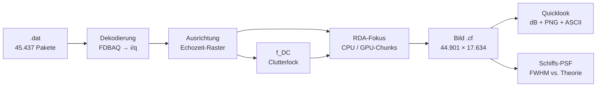

# Walkthrough: Sentinel-1 Stripmap-Fokussierung (`sar_focus`)

Von Rohpaketen zum fokussierten SAR-Bild — CPU-Referenz und GPU-Pipeline,
quantitativ verglichen, auf Echtdaten verifiziert.

## 1. Worum geht es?

Ein SAR-Satellit (hier Sentinel-1C, Stripmap-Beam S6, VV-Polarisation) sendet
Radar-Chirps und zeichnet die Echos auf. Jedes Echo enthält die überlagerten
Antworten **aller** beleuchteten Ziele — das Rohbild ist unscharf. Die
Fokussierung sortiert per Matched-Filter jede Antwort an ihren Ort:

- **Range-Kompression**: Korrelation mit der Chirp-Replika
  (`FFT · conj(FFT) → iFFT`) — ein Ziel wird in Range scharf.
- **Azimut-Fokus (RDA)**: Die Plattformbewegung moduliert jedes Ziel mit
  einem Azimut-Chirp; Range-Cell-Migration-Correction (RCMC, phasenrein)
  plus Azimut-Matched-Filter im Range-Doppler-Bereich machen es in
  Flugrichtung scharf.
- **TDBP** (Vergleichsarm): Direkte Rückprojektion Puls für Puls —
  langsam, aber geometrisch exakt; verifiziert die RDA-Näherung.



## 2. Module (Datenflussreihenfolge)

| Datei | Modul | Aufgabe |
|---|---|---|
| `01_types.rs` | `types` | `Complex32`, `Vec3d`, Konstanten (c, λ, WGS84) |
| `02_meta.rs` | `meta` | Echo-Metadaten (PRI/SWST/Chirp/RGDEC→fs), Slant-Raster |
| `03_ephem.rs` | `ephem` | SubCom-Orbit (BE!), `v_eff`, geometrisches f_DC |
| `04_chirp.rs` | `chirp` | Ideale Chirp-Replika auf exaktem ADC-Raster |
| `05_range.rs` | `range` | Range-Matched-Filter (rustfft) |
| `06_rda.rs` | `rda` | RDA-Stufen + Clutterlock-f_DC |
| `07_tdbp.rs` | `tdbp` | Backprojection-CPU (f64-Geometrie) |
| `08_cufft.rs` | `cufft` | Minimales cuFFT-FFI (60 Zeilen) |
| `09_kernel.rs` | `kernel` | `cuda-oxide`-Kernel (cmul, Shift, TDBP) |
| `10_gpu.rs` | `gpu` | GPU-RDA-Pipeline (dieselben Filter wie CPU) |
| `11_look.rs` | `look` | dB, Multilook, PNG, ASCII, Peaks, FWHM |
| `main.rs` | CLI | `meta`, `focus`, `ships`, `ql` |

Befehle (immer via `cargo oxide`, braucht GPU + Nightly-Toolchain):

```sh
cargo oxide test                                   # 38 Tests
cargo oxide run -- meta ../data/vv/*.dat           # Diagnose
cargo oxide run -- focus ../data/vv/*.dat out      # Vollrahmen → out.cf/.png
cargo oxide run -- ships out.cf 44901 17634        # Schiffs-PSF-Bericht
cargo oxide run -- ql out.cf 44901 17634 q.png \   # Ausschnitt-Quicklook
    8466 8666 2137 2337
cargo clippy --all-targets -- -D warnings          # plain cargo (kein oxide-clippy)
cargo fmt --check
```

## 3. CPU↔GPU-Vergleich (Pflicht)

Jede GPU-Rechnung steht gegen die schlichte CPU-Referenz (peak-normierte
max. rel. Abweichung):

| Vergleich | Schranke | Gemessen |
|---|---|---|
| cuFFT vs. rustfft (Zeilen + Spalten) | 1e-5 / 1e-4 | grün |
| RDA-GPU vs. RDA-CPU (Punktziel) | 1e-3 | grün |
| TDBP-GPU vs. TDBP-CPU (Punktziel) | 1e-3 | grün |
| RDA-GPU vs. RDA-CPU (**Echtdaten**, 2048×20160) | 1e-3 | **4,5·10⁻⁷** |

## 4. E2E-Verifikation auf Echtdaten (S6 VV, 44.901 Echos)

- **Raster**: zeitbasierte Ausrichtung (Rang·PRI+SWST), Rest 0,25 Samples;
  `data_delay` allein driftet 16 Samples über den Rahmen.
- **Orbit**: `v_eff` = 7100,4 m/s (Mitte), Bandbreite 42,19 MHz.
- **f_DC**: geometrisch 154–163 Hz (unbrauchbar, s. Fund 3),
  Clutterlock **5–18 Hz** (median-geglättet) — verwendet.
- **Laufzeit**: 127,5 s Vollrahmen (7 GPU-Chunks à 8192, Overlap 2048).
- **Fokus**: FWHM Range 1,1–3,0 px (3,5–9,5 m, Theorie 3,15 m),
  Azimut 1,2–2,6 px (5–11 m, Theorie 6,15 m).
- **Schiffe**: 8 Kandidaten mit Kontrast ≥ 15 dB über dunklem Ozean,
  Zoom zeigt ~300-m-Struktur (s. Artefakte).
- **Struktur**: Ozean/Küste/Land wie im Referenz-Screenshot
  (`data/2026-10-04-220713_467x696_scrot.png`); RFI-Linien sind
  Dateneigenschaft (s. Fund 6).

Artefakte (dieser Ordner): [Voll-Quicklook](quicklook_full.png),
[Schiff-Zoom](quicklook_ship.png), [E2E-Log](e2e_full.log)
(mit ASCII-Bild; `.cf`-Produkt 6,3 GB liegt nicht bei).

## 5. Funde (alle mit Zahl belegt)

1. **cuFFT-Typkonstante**: `CUFFT_C2C` ist `0x29` (CUDA 13, Header),
   nicht `0x2A` (R2C) — falscher Typ gab plausible, aber falsche Werte
   (reelle Proben entlarven das nicht; erst dichte Muster).
2. **Ephemeriden sind ECEF**: `|v| ≈ 7589 m/s`; erst `|v + ω×r| ≈
   7501,6 m/s` erfüllt vis-viva (7503,3). Rohes `|v|` gäbe 1,1 %
   `v_eff`-Fehler (≈ 9 rad Defokus) → `inertial_vel()`.
3. **Geometrisches f_DC irreführend**: Null-Schiel-Blick ohne
   Antennen-Schielmodell liefert 154–163 Hz (Exzentrizität), die
   yaw-gesteuerte Antenne nullt das aber — Clutterlock aus den Daten
   (5–18 Hz) entscheidet. Lektion: „geometrisch zuerst" braucht das
   Antennenmodell, sonst misst man daneben.
4. **RDA statt CSA**: Der Frequenz-Arm ist RDA (SSFocus-`focus_old.py`
   gestuft), nicht CSA — RCMC ist phasenrein (keine Interpolation),
   GPU-freundlich und am Punktziel exakt verifiziert.
5. **cuFFT mag keine großen Primfaktoren**: 20015 = 5·4003 →
   `CUFFT_INTERNAL_ERROR`; Padding auf 7-glatte Längen (`smooth_fft_len`)
   heilt das und beschleunigt (Bluestein→Radix).
6. **RFI nachgewiesen**: Linie bei Az 4243 = 70-Echo-Höcker in Rohdaten
   (Bodennradar im Vorbeiflug, 2 Töne), fokussiert ~4600 px lang,
   1–2 px dick. Kein Verarbeitungsfehler.

## 6. Glossar

- **Azimut**: Flugrichtung des Satelliten (Bild-Zeilen).
- **Chirp**: Frequenzmodulierter Sendepuls (S1: ~51 µs, 42 MHz).
- **Clutterlock**: f_DC-Schätzung aus Lag-1-Azimutkorrelation der Daten.
- **Doppler-Centroid (f_DC)**: Dopplermitte des Echos (Antennen-Schiel + Steuerung).
- **FDBAQ**: Flexible Block-Adaptive Quantisierung (S1-Rohdatenkompression).
- **FWHM**: Halbwertsbreite — Schärfemaß eines Punktziels.
- **Quicklook**: Übersichtsbild (dB, verkleinert).
- **Range**: Schrägentfernung Satellit–Ziel (Bild-Spalten).
- **RCMC**: Korrektur der Range-Wanderung über der synthetischen Apertur.
- **RDA**: Range-Doppler-Algorithmus (Frequenz-Fokussierung).
- **RFI**: Funkstörung (Bodenradare) — helle Linien im Bild.
- **Slant-Range**: Schrägentfernung ohne Geokodierung (unser Produkt).
- **TDBP**: Zeitbereichs-Rückprojektion (exakt, langsam).
- **v_eff**: Effektive Geschwindigkeit (Orbit + Erdrotation + Geometrie).
